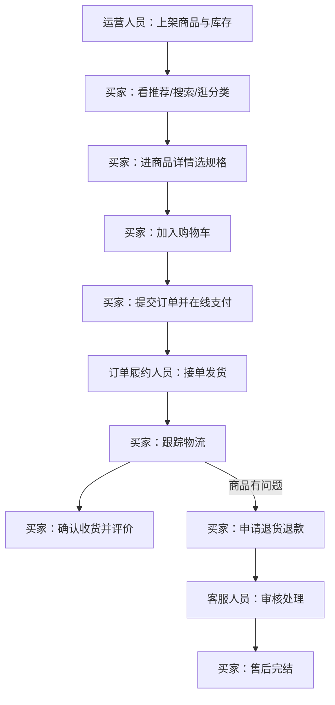
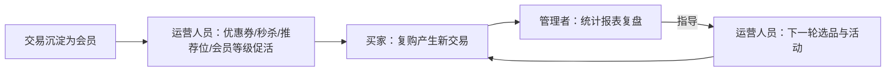

# 项目概念：好物商城（暂定名，待议）

> 本文是「好物商城」的立项概念定义，供项目成员对齐方向、作为项目 PRD 的依据；当前为基于原始需求的草案，关键取舍已在文中标注决策状态。上游为模拟案例材料，模拟性质予以保留。

## 1. 项目是什么

**一句话定义**：好物商城是一套自建自营的零售电商系统，让买家在手机商城完成从逛到买的购物旅程，让我们的经营团队在同一个后台完成从商品上架到经营复盘的管理闭环。

本文为概念级定义草案：产品方向取自原始需求并已确认；参与主体划分与角色设置是基于输入的建议草案；暂定名「好物商城」待议。参与者有两类——**买家**（最终使用产品的顾客）与**我们的经营团队**（对经营结果负责的商家，自营单一卖方，无第三方入驻）。产品覆盖两端形态：买家侧手机商城（优先）、内部 PC 网页后台，两端共用同一套数据。范围本质是"把买卖跑通、后台管得住"的自营零售在线化，卖实物商品；不做多商家入驻、直播带货与社交裂变、跨境电商与线下门店，财务只记订单收支（均为输入明确的边界）。

## 2. 为什么要做

**买家侧**：货不好找——没有集中的搜索和推荐入口；下单流程绕——挑选、比价、支付环节割裂；订单进度和售后没人管——付了钱之后心里没底。**经营侧**：商品资料散落各处，缺统一的商品台账；订单靠人工盯，发货与售后跟进吃力；促销没抓手，有货卖不动；经营情况说不清，选品与活动凭感觉。

上述困境均来自原始需求的明确表述（已确认）。对应的解法思路：用"商城端＋管理端"一体的系统，把逛、选、买、售后串成一条线，把商品、订单、会员、营销、内容收进一个后台，并以统计报表支撑复盘（解法方向为已确认，具体能力见第 5 节）。

## 3. 参与主体与角色

主体划分（建议草案）：按输入推导出两个主体——**买家（用户主体）**是产品最终服务的使用方；**经营团队（经营主体）**即我们自己，对经营结果负责，承担经营决策、组织分工与账号权限安排。项目为单一卖方自营，不设平台主体，也不为内部执行工作单设中台主体，统一作为经营主体下的角色。

| 主体 | 角色 | 主要责任 | 使用场景 |
|---|---|---|---|
| 买家 | 买家 | 自主完成浏览、选购、支付、收货、评价与售后申请 | 手机商城 |
| 经营团队 | 运营人员 | 上架商品、维护分类品牌规格库存、排推荐位、发优惠券、做秒杀、管理会员等级 | PC 后台 |
| 经营团队 | 订单履约人员 | 接单、发货、跟踪订单履约 | PC 后台 |
| 经营团队 | 客服人员 | 处理退货退款审核、答复咨询 | PC 后台 |
| 经营团队 | 管理者 | 看统计报表、管理账号与权限、掌握经营情况 | PC 后台 |

角色设置为建议草案（输入列举了运营、订单与客服、管理者三类岗位职责，据此归并为四个角色）；"各岗位只见自己那一摊"的权限隔离要求已确认，落在权限管理能力中。一人可兼任多角色。

## 4. 做成以后有什么用

- **买家**：减少"找不到、流程绕、没着落"的负担——推荐与搜索让货好找，购物车到支付一条线让下单顺畅，订单跟踪与售后入口让进度有着落（期望效果，方向已确认）。
- **运营人员**：商品资料统一收口、上下架自主可控，推荐位与优惠券、秒杀成为日常促销抓手，减少手工整理（期望效果）。
- **订单履约人员**：订单集中呈现、状态清晰，从"人工盯"变为"按单处理"（期望效果）。
- **客服人员**：退货退款有统一入口和审核流程，处理有据可查（期望效果）。
- **管理者**：账号权限按岗位收口，经营数据以报表呈现，复盘有依据（期望效果）。

## 5. 各主体与角色需要哪些能力

**买家（手机商城）**
- 首页门户与商品推荐：进入商城的入口，看到推荐商品。
- 商品搜索：按关键词找到想要的商品。
- 商品展示：浏览商品详情，挑选规格。
- 购物车：暂存选好的商品，统一结算。
- 订单流程与支付：提交订单并在线支付。
- 会员中心：查看订单、资料，享受会员权益。
- 客户服务与帮助中心：咨询答疑、申请售后。

**运营人员（PC 后台）**
- 商品管理：维护分类、品牌、规格与库存，上架商品（业务准备）。
- 促销管理：配置优惠券与秒杀活动（日常运营）。
- 运营与内容管理：维护推荐位、广告、专题（日常运营）。
- 会员管理：维护会员信息与等级（日常运营）。

**订单履约人员（PC 后台）**
- 订单管理：接单、发货、处理退货申请（日常操作，含与客服协作）。

**客服人员（PC 后台）**
- 售后处理：审核退货退款、答复咨询（日常操作）。

**管理者（PC 后台）**
- 权限管理：账号、角色与可见范围控制（管理）。
- 统计报表：商品、订单、会员的经营数据（分析）。
- 基础财务：订单收支记录（管理）。

以上能力清单对应输入"商城必备／后台必备"的原文范围（已确认）；将订单管理分配给订单履约人员、退货审核分配给客服人员为建议草案。

## 6. 各主体与角色怎样开展工作

**买家购买旅程（主线，已确认）**：运营人员在后台维护商品（分类、品牌、规格、库存）并上架 → 买家从首页推荐、搜索或分类进入商品详情 → 选规格、加购物车、提交订单、在线支付 → 后台接单发货，买家跟踪物流 → 确认收货、评价；有问题发起退货退款，由客服人员审核处理。

**经营侧日常运转（已确认闭环，角色分工为建议草案）**：交易沉淀为会员，运营人员用优惠券、秒杀、推荐位和会员等级促活复购 → 管理者用统计报表复盘商品、订单与会员情况 → 反过来指导下一轮选品与活动。

---

## 讨论备忘

- 项目名称：暂定「好物商城」，待议。
- 角色归并：输入中"订单与客服"并列提及，本文将其拆为订单履约人员与客服人员两个角色，供确认；若实际为同一批人，可合并为一个角色，不影响能力划分。
- 会员等级的具体权益、秒杀与优惠券的详细规则属于细节，留给项目 PRD。
