# 产品需求文档（PRD）：好物商城（暂定名，待议）

> 本文是好物商城的项目级产品需求总纲：说明为什么做、给谁用、产品由什么组成、业务怎么跑通、关键如何决策，支撑立项汇报与整体讲解；功能的详细规则、界面交互、数据字段由大版本与小版本文档细化。上游为模拟案例材料，模拟性质予以保留；当前为基于概念文档与原始需求的总纲草案，推断与建议默认已就地标明并汇总于文末备忘。

## 1. 产品概述

### 1.1 背景与目标

**现状问题**（引自原始需求，已确认）：买卖两端各有三重困境——买家"货不好找、下单流程绕、订单和售后没人管"；经营团队"商品资料散落各处、订单靠人盯、促销没抓手、经营情况说不清"。线下与零散工具维系的零售方式，让购物旅程断点多、经营数据不成线。

**产品目标**（已确认）：建一套自建自营的零售电商系统，买家侧把"逛—选—买—收—售后"串成一条线，经营侧把"商品—订单—会员—营销—内容—报表"收进一个后台，把卖货的整条链路搬到线上。

**成功标准**（从目标推导的定性表达，推断）：买家能独立完成从进店到收货售后的全程自助；经营团队能在后台完成商品上架到订单履约的日常运转；每一笔交易和促销活动都有数据可查、可复盘。量化口径（如订单转化、履约时效）由版本级文档按届时数据约定。

### 1.2 产品定位与形态

**一句话定义**：好物商城是一套自建自营的 B2C 零售电商系统，由买家侧手机商城与内部管理后台组成，两端共用同一套数据。

| 端 | 形态 | 面向 | 职责 |
|---|---|---|---|
| 商城端 | 手机端（优先） | 买家 | 商品浏览与搜索、购物车、下单支付、订单跟踪、售后申请、会员中心、客户服务与帮助中心 |
| 管理端 | PC 网页 | 经营团队各角色 | 商品、订单、会员、促销、运营内容、权限、报表与基础财务管理 |

商业模式为**自营零售、单一卖方**：店铺与货均为我们所有，不引入第三方商家入驻（已确认）。两端职责边界：交易动作发生在商城端，经营配置与履约处理发生在管理端；同一业务事实（商品、订单、会员）在两端看到的是同一份数据。

## 2. 参与主体与角色

主体划分承接概念文档（建议草案）：**买家（用户主体）**是产品最终服务的使用方；**经营团队（经营主体）**对经营结果负责，承担经营决策、组织分工与账号权限安排。单一卖方自营，不设平台主体。

| 主体 | 所属端 | 定位 | 包含角色 |
|---|---|---|---|
| 买家 | 商城端 | 最终使用产品、完成购买与售后的顾客 | 买家 |
| 经营团队 | 管理端 | 对经营结果负责的自营商家，内部按岗位分角色 | 运营人员、订单履约人员、客服人员、管理者 |

**角色特征与典型场景**：
- **买家**：自主购物，目标是用最短路径买到想要的货。典型场景——首页看到推荐进详情、搜索关键词找货、购物车合并结算、查物流进度、收货后评价、商品有问题申请退货。
- **运营人员**：管"卖什么、怎么推"。典型场景——新品上架维护规格库存、配置秒杀与优惠券、调整首页推荐位与专题、查看会员分层。
- **订单履约人员**：管"货怎么到"。典型场景——处理待发货订单、点发货登记物流、跟进异常订单。
- **客服人员**：管"人怎么被服务"。典型场景——审核退货退款申请、答复买家咨询。
- **管理者**：管"全局怎么看好、权限怎么分"。典型场景——看经营报表、复盘活动效果、为新人开通账号并授权。

**共性工作方式**：一人可兼任多角色；各岗位通过管理端账号与角色授权限定可见与可操作范围，"各岗位只见自己那一摊"（已确认）。角色为职责模板，具体人员分配由经营团队自行安排。

## 3. 功能全景

能力清单按"主体→角色"组织，能力名为动词短语（能力），括注承载的业务对象。覆盖原始需求"商城必备／后台必备"全部范围（已确认）；带 ◇ 的条目为上游未明说、按行业惯例推断补足的自助管理面。

### 3.1 买家（商城端）

| 能力 | 用途 |
|---|---|
| 首页门户与商品推荐 | 进入商城的入口，按推荐位配置看到主推商品（内容位、商品） |
| 商品搜索 | 按关键词快速找到想要的商品（商品） |
| 商品展示 | 按分类浏览货架、查看商品详情并选择规格（商品分类、商品） |
| 购物车 | 暂存选中商品、调整数量、合并结算（购物车） |
| 订单流程与支付 | 提交订单、在线支付、查看订单状态、确认收货（订单、支付单） |
| 会员中心 ◇ | 买家的自助管理面：订单与售后记录查询、优惠券持有查看、个人资料与登录凭据维护、收货地址簿管理、注销退出（顾客账号、收货地址） |
| 在线咨询 | 就订单或商品问题发起咨询、查看答复（咨询工单） |
| 帮助中心 | 查阅购物、支付、售后等常见问题的帮助文章（帮助文章） |
| 商品评价 | 收货后对商品评价（商品评价） |
| 售后申请 | 对有问题的订单发起退货退款、跟踪处理进度（退货单） |

### 3.2 经营团队（管理端）

| 角色 | 能力 | 用途 |
|---|---|---|
| 运营人员 | 商品管理 | 维护商品的分类、品牌、规格与库存，上下架商品（商品、商品分类、品牌、商品库存） |
| 运营人员 | 促销管理 | 配置优惠券与秒杀活动（优惠券、秒杀活动） |
| 运营人员 | 运营与内容管理 | 维护推荐位、广告与专题等内容位（内容位） |
| 运营人员 | 会员管理 | 查看会员信息、维护会员等级（顾客账号、会员等级） |
| 订单履约人员 | 订单管理 | 查看与处理订单、接单发货登记物流（订单） |
| 客服人员 | 售后处理 | 审核退货退款申请、完结售后（退货单） |
| 客服人员 | 咨询答复 | 响应与答复买家咨询（咨询工单） |
| 管理者 | 权限管理 | 开通管理端账号、分配角色、停用账号（管理端账号、角色） |
| 管理者 | 统计报表 | 查看商品销售、订单与会员的经营报表 |
| 管理者 | 基础财务 | 查看订单收支记录（订单收支记录） |
| 全体内部角色 | 个人设置 ◇ | 各内部角色的自助管理面：自身账号资料与登录凭据重置（管理端账号） |

## 4. 核心业务闭环

各闭环的衔接关系：商品上架是购买的前置；购买产生交易与会员沉淀；交易异常走售后；交易与会员数据喂给促活复购；报表复盘收口并回到商品上架，形成经营循环。

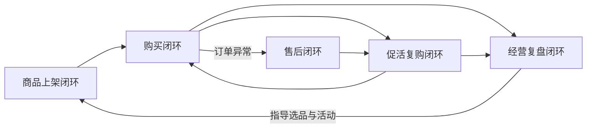

### 4.1 购买闭环（跨主体跨端）

买家在商城端发起并推进，订单履约人员在管理端接续，两侧围绕同一份订单交接。

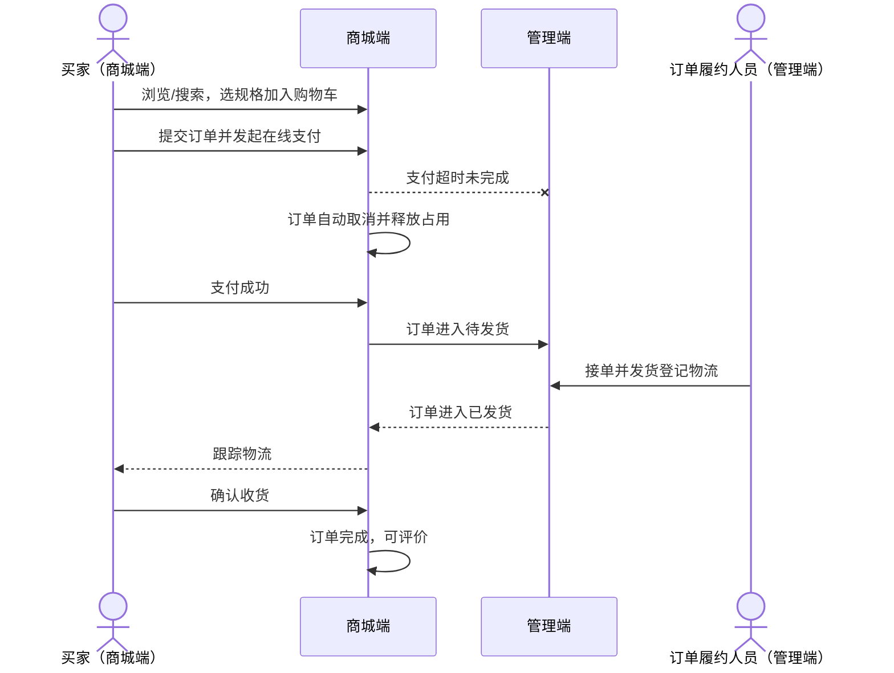

谁发起：买家；怎么交接：支付成功后订单从商城端进入管理端待发货队列，发货后状态回到商城端供买家跟踪；怎样结束：买家确认收货（或超时自动确认，方向见 D7），订单完成；全局性异常：支付超时订单自动取消，占用（库存、优惠券）释放。

### 4.2 售后闭环（跨主体跨端）

买家就已支付订单发起退货退款，客服人员在管理端审核处理。

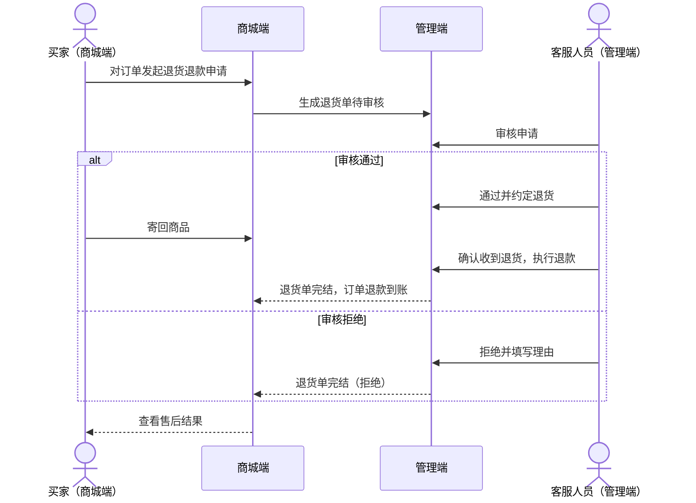

谁发起：买家；怎么交接：申请生成退货单进入客服队列，审核结论与退款结果回传商城端；怎样结束：退款完成或拒绝，退货单到达终态；全局性异常：审核拒绝时必须留有理由供买家查看（方向，具体规则留版本级）。

### 4.3 促活复购闭环（循环型，跨主体）

运营人员在管理端配置促销与内容，买家在商城端感知并复购，交易再沉淀为会员数据。

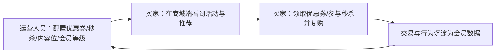

谁发起：运营人员；怎么交接：配置生效于商城端，买家参与后数据回流；怎样结束：无终态，持续循环；全局性异常：活动库存与有效期到点自动结束（方向）。

### 4.4 经营复盘闭环（单主体循环）

管理者与运营人员在管理端内完成"看数—判断—调整"。

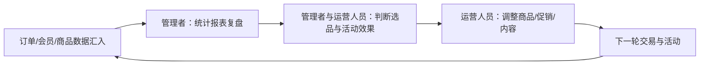

谁发起：管理者；怎么交接：报表结论转化为运营调整动作；怎样结束：无终态，按经营节奏循环。

### 4.5 商品上架闭环（单主体，业务准备）

运营人员在管理端完成商品从建档到可售。

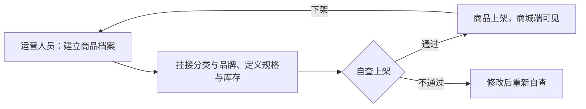

谁发起：运营人员；怎样结束：商品上架对买家可见（下架后可修改再上架）；说明：输入未要求多级审核，上架动作由运营人员自行完成（建议默认）。

## 5. 核心业务对象

### 5.1 对象关系总览

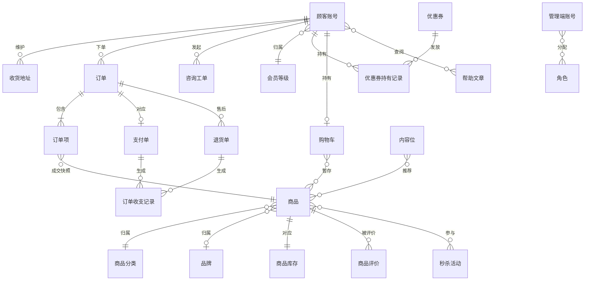

### 5.2 人与账号

**顾客账号**：买家在商城端的身份与资料载体，注册即产生。
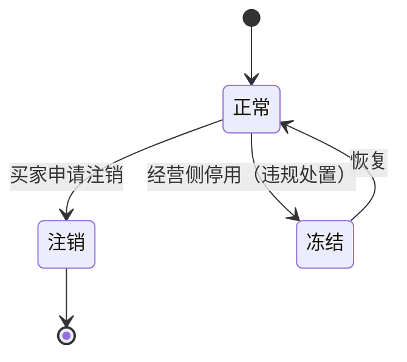

**收货地址**：买家维护的常用收货信息集合（自助管理附属对象），下单时选用。
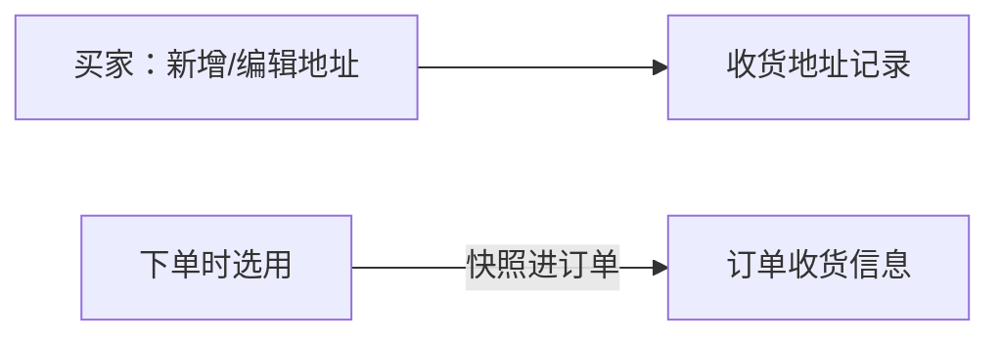

**管理端账号**：内部人员的登录身份，与顾客账号完全隔离。
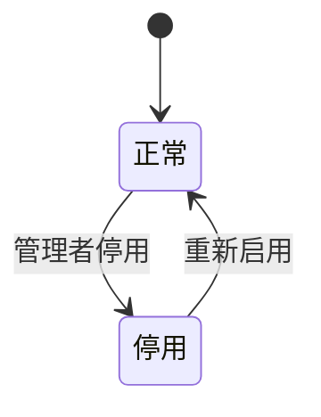

**角色**：管理端的权限载体，定义可见与可操作范围；账号可持多角色。
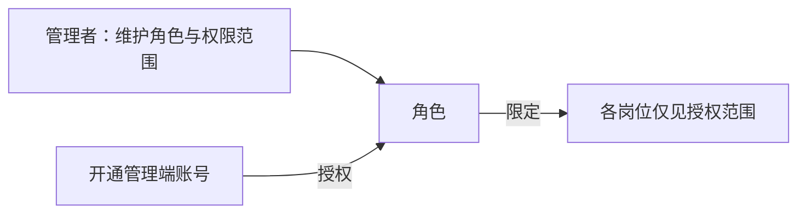

**会员等级**：对顾客账号的分层与权益模板，由运营人员维护。
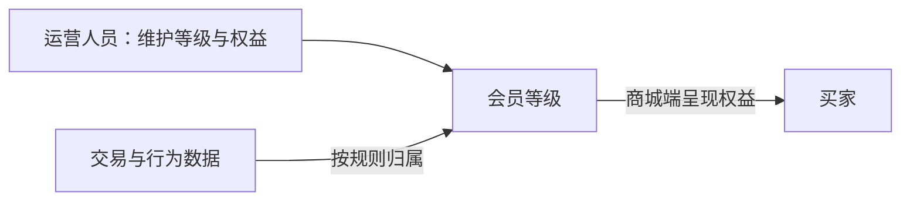

### 5.3 商品域

**商品**：以规格（SKU）为最小售卖单元的实物商品档案。
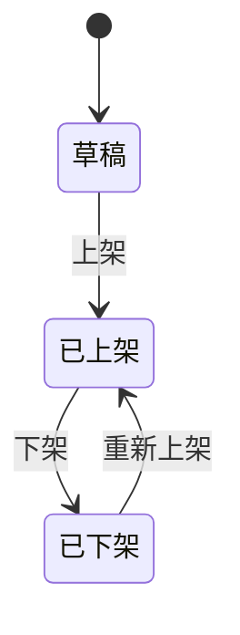

**商品分类**：商品的类目树，商城端分类浏览与管理端商品组织的共用结构。
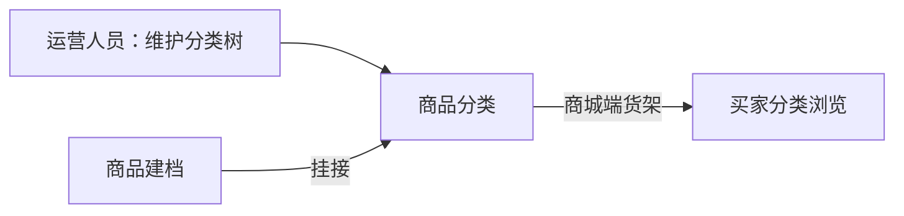

**品牌**：商品的厂牌信息，供商品组织与品牌展示。
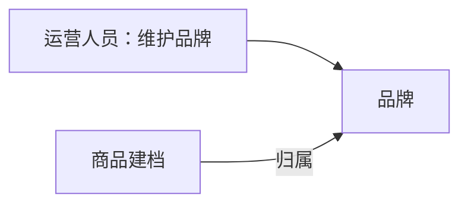

**商品库存**：SKU 级的可售数量台账，随订单生命周期变动。
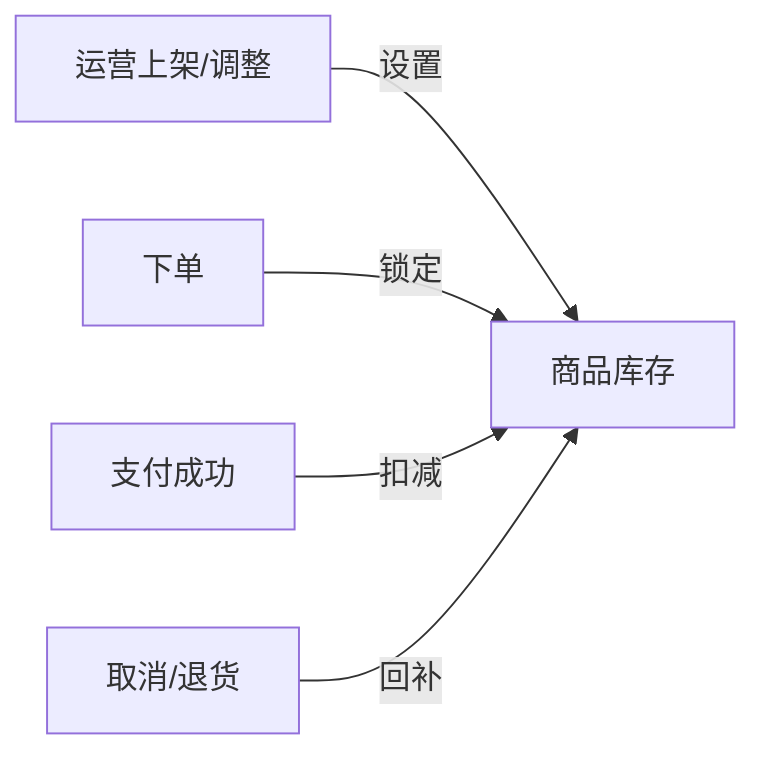

### 5.4 交易域

**购物车**：买家暂存选中商品的载体，结算后清空对应条目。
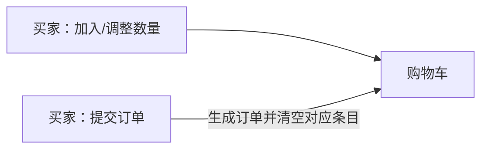

**订单**：一次交易的主记录，买卖两侧流程的衔接核心。
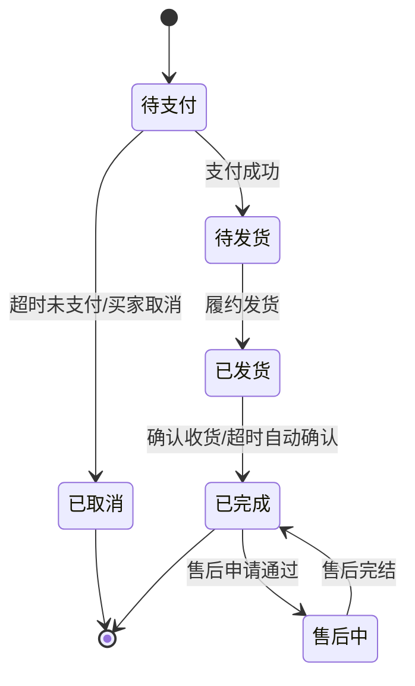

**订单项**：订单内的商品明细，记录成交时点的商品与规格快照（见 D6）。


**支付单**：订单的在线支付记录，对接支付渠道。
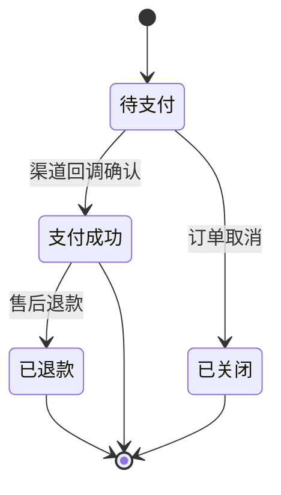

**退货单**：售后申请与处理的记录，完结即终态。
```mermaid
stateDiagram-v2
    [*] --> 待审核
    待审核 --> 待退货 : 审核通过
    待审核 --> 已拒绝 : 审核拒绝
    待退货 --> 退款完成 : 收到退货并退款
    待审核 --> 已取消 : 买家撤回
    已拒绝 --> [*]
    退款完成 --> [*]
    已取消 --> [*]
```

**商品评价**：买家在订单完成后对商品的评价记录。
```mermaid
flowchart LR
    确认收货[订单完成] -->|买家评价| 评价[商品评价]
    评价 -->|展示| 商品详情[商品详情页]
```

### 5.5 营销与内容域

**优惠券**：运营定义的券模板（面额/条件/有效期），经领取或发放产生持有记录。
```mermaid
flowchart LR
    运营创建[运营人员：创建券模板] --> 优惠券[优惠券]
    买家领取[买家：领取] -->|生成| 持有记录[优惠券持有记录]
```

**优惠券持有记录**：买家名下券的实例，随使用、取消退回与过期流转。
```mermaid
stateDiagram-v2
    [*] --> 未使用
    未使用 --> 已使用 : 下单核销
    未使用 --> 已过期 : 超过有效期
    已使用 --> 未使用 : 订单取消退回
    已使用 --> [*]
    已过期 --> [*]
```

**秒杀活动**：限时限量特价活动，到点自动开始与结束。
```mermaid
stateDiagram-v2
    [*] --> 待开始
    待开始 --> 进行中 : 到达开始时间
    进行中 --> 已结束 : 到达结束时间/售罄
    已结束 --> [*]
```

**内容位**：商城端首页与专题页的推荐位、广告位与专题入口的统称，运营配置、商城呈现。
```mermaid
flowchart LR
    运营配置[运营人员：配置内容位与关联商品] --> 内容位[内容位]
    内容位 -->|商城端呈现| 首页与专题[首页门户/专题页]
```

### 5.6 服务与支撑域

**咨询工单**：买家咨询的记录与客服协作载体。
```mermaid
stateDiagram-v2
    [*] --> 待响应
    待响应 --> 处理中 : 客服接手
    处理中 --> 已完结 : 答复且买家无追问
    已完结 --> [*]
```

**帮助文章**：帮助中心的常见问题内容，运营维护、买家自助查阅。
```mermaid
flowchart LR
    运营维护[运营人员：维护帮助文章] --> 文章[帮助文章]
    买家查阅[买家：帮助中心检索查阅] --> 文章
```

**订单收支记录**：基础财务的订单收支台账，从支付与退款事实生成、只读留存。
```mermaid
flowchart LR
    支付成功[支付成功] -->|生成收入记录| 收支[订单收支记录]
    退款完成[售后退款完成] -->|生成支出记录| 收支
    管理者查看[管理者：基础财务查看] --> 收支
```

## 6. 关键设计决策

版本细化时遵守本节规则；冲突时以本节为准，不需重抄。

| 编号 | 决策 | 选择与理由 | 确立的跨版本规则 |
|---|---|---|---|
| D1 | 两端一库 | 商城端与管理端共用同一套业务数据，避免同一事实两处维护打架（输入明确"共用一套数据"） | 同一业务对象只有一份权威数据；两端是同一数据的两个视图 |
| D2 | 自营单一卖方 | 店与货均归我们，不引入第三方商家（输入明确不做多商家入驻） | 全链路只有单一卖方视角；不为入驻、多商户结算预留复杂度 |
| D3 | 账号分端独立 | 顾客账号与管理端账号分属两套身份体系，顾客不可能进入管理端 | 账号类对象按端命名与隔离；管理端账号的开通必须经管理者 |
| D4 | 按角色授权、最小可见 | 输入要求"各岗位只见自己那一摊"；用角色承载权限而非逐人配置 | 能力可见性由角色决定；账号可持多角色，权限取并集 |
| D5 | 商城端优先 | 买家侧是收入发生地，且移动端是买家主要入口（输入明确优先） | 资源冲突时商城端体验优先；管理端以保证履约与管控为度 |
| D6 | 成交信息快照 | 订单项记录成交时点的商品、规格与价格（行业惯例，推断） | 订单事实以生成时点为准，不随后续商品改价改名变化 |
| D7 | 订单自动流转 | 支付超时自动取消、确认收货可超时自动确认，减少两侧悬空等待（行业惯例，推断） | 订单在约定时限后自动流转，规则数值由版本级定 |
| D8 | 财务只记收支 | 基础财务仅记录订单收支，不做结算分账（输入明确） | 财务面不出现多方分账概念；收支记录从交易事实只读生成 |

---

## 备忘

- **推断补足（行业惯例）**：会员中心与个人设置两个自助管理面、收货地址簿、帮助文章、咨询工单、订单项成交快照与订单自动流转（D6、D7）为上游未明说的补足项，均已在正文标 ◇ 或注明；确认或裁剪以业务意见为准。
- **外部依赖**：在线支付依赖第三方支付渠道的对接与回调；物流跟踪依赖承运方提供的物流状态。具体渠道与方式由技术文档评估。
- **待确认**：项目名称（暂定「好物商城」）；订单履约人员与客服人员是否合并为一个岗位（不影响能力划分）；会员等级的具体权益与升降级规则；秒杀与优惠券的详细规则——均留给大版本 PRD 细化。
- **量级假设**：本文按"单一卖方、中小规模自营零售"理解量级，未做容量规划（无真实依据，不预设）。
