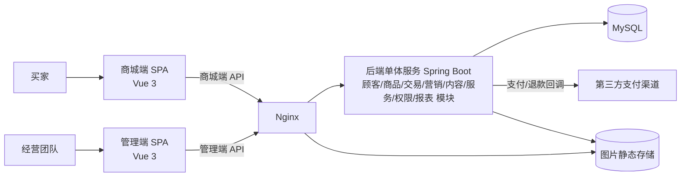
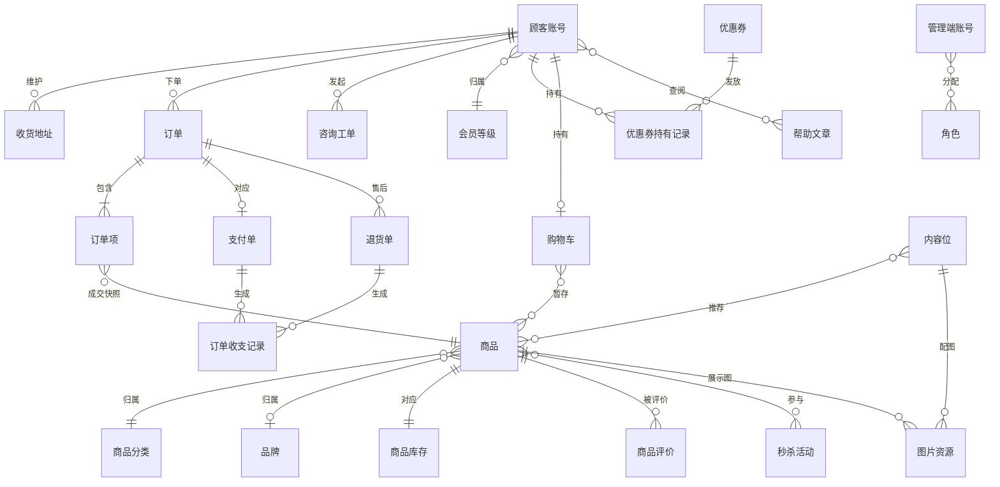

# 技术文档（项目）：好物商城（暂定名，待议）

> 本文是好物商城的技术基线：确定技术形态、技术栈、系统构成、概念数据模型与关键技术决策，定稿后各版本只细化不推翻。上游为模拟案例材料，模拟性质予以保留；技术前提无真实输入处按合理默认形成判断并标明（推断）。

## 1. 技术形态

- **整体架构**：模块化单体——单一后端服务内部按业务域分模块，共享一个数据库；单一卖方中小规模，最简单可行方案，避免分布式复杂度。
- **前后端模式**：前后端分离——商城端与管理端各为独立 Web 单页应用，经 HTTP API 与后端交互；两端界面形态与发布节奏不同，分离后互不牵连。
- **端结构**：商城端为移动 Web 应用（手机浏览器优先适配，不开发原生 App——输入未要求，成本不成比例，推断）；管理端为 PC Web 应用。
- **部署形态**：单台服务器容器化部署（Docker Compose 编排应用、数据库与反向代理），中小规模够用且迁移方便（推断）。

## 2. 技术栈

| 分类 | 采用 | 一句话理由 |
|---|---|---|
| 商城端 | Vue 3 + Vant（移动组件库） | 移动 Web 主流方案，组件库贴合商城交互 |
| 管理端 | Vue 3 + Element Plus | PC 管理界面成熟组件体系，表格表单开发效率高 |
| 后端 | Java · Spring Boot（模块化单体） | 事务、安全、调度等电商刚需组件齐备，单体开发与部署简单 |
| 数据库 | MySQL（关系型） | 订单、库存、收支要求事务一致性，关系模型天然承载 PRD 对象骨架 |
| 鉴权 | JWT 无状态令牌 | 两套账号体系隔离的承载，免服务端会话存储 |
| 反向代理 | Nginx | 前端静态资源服务、API 反向代理、图片静态服务一体 |
| 部署 | Docker Compose | 单机一键编排，环境一致 |
| 支付 | 第三方支付渠道适配层（对接支付宝/微信支付） | 满足"在线支付"必需；渠道经适配层可替换 |
| 版本管理 | Git | 全程可追溯 |

未硬编具体版本号，构建时选各技术的当前稳定版。

## 3. 系统构成

模块划分（模块级，职责单一）：

| 模块 | 一句话职责 |
|---|---|
| 权限模块 | 管理端账号、角色与授权；管理端登录 |
| 顾客模块 | 顾客账号、收货地址、会员等级 |
| 商品模块 | 商品、商品分类、品牌、商品库存、商品评价、图片资源（挂靠持有） |
| 交易模块 | 购物车、订单、订单项、支付单、退货单 |
| 营销模块 | 优惠券、优惠券持有记录、秒杀活动 |
| 内容模块 | 内容位、帮助文章 |
| 服务模块 | 咨询工单 |
| 报表模块 | 统计报表、订单收支记录 |
| 公共基座 | 通用组件：鉴权、单号、异常、留痕等横切能力（图片对象挂靠商品模块持有） |

核心数据流：商城端请求经 Nginx 进入单体服务的商城端 API，按业务落到对应模块；订单支付经支付渠道异步回调确认后驱动库存扣减与状态流转；管理端经管理端 API 操作同一批模块；交易与售后事实由报表模块生成收支与统计视图。

## 4. 概念数据模型

实体承接项目 PRD 的业务对象，用语一致；补充的技术实体已标注。

逐实体一句话说明：**顾客账号**买家身份载体；**收货地址**买家常用收货信息；**管理端账号**内部人员登录身份；**角色**管理端权限载体；**会员等级**顾客分层与权益模板；**商品**以规格（SKU）为最小售卖单元的商品档案；**商品分类**类目树；**品牌**厂牌信息；**商品库存**SKU 级可售数量台账；**购物车**暂存选中商品；**订单**交易主记录；**订单项**成交快照明细；**支付单**在线支付记录；**退货单**售后处理记录；**商品评价**订单完成后的评价；**优惠券**券模板；**优惠券持有记录**买家名下券实例；**秒杀活动**限时限量特价活动；**内容位**推荐位/广告/专题统称；**咨询工单**买家咨询记录；**帮助文章**帮助中心内容；**订单收支记录**基础财务只读台账；**图片资源**（技术实体）商品图与内容位图的统一存取对象。

## 5. 关键技术决策

| 编号 | 选什么 | 为什么 | 不选什么 |
|---|---|---|---|
| K1 | 模块化单体 | 单一卖方中小规模，一个可事务的单位最简 | 微服务——拆分带来分布式事务与运维成本，规模撑不起 |
| K2 | 两组 API（商城端/管理端）分开暴露 | 账号体系与风险面天然隔离（承接 PRD D3） | 单组 API 混用——鉴权边界模糊 |
| K3 | MySQL 关系库为唯一权威存储 | 订单/库存/收支强一致刚需 | NoSQL 主库——关系与事务表达弱 |
| K4 | JWT 无状态令牌、按端分受众 | 两套账号隔离、水平扩展免会话共享 | 服务端 Session——需会话存储组件 |
| K5 | 库存扣减用数据库事务＋乐观锁 | 中小并发下正确性优先、方案最简 | Redis 预扣＋消息削峰——并发量撑不起复杂度 |
| K6 | 支付渠道适配层统一接口 | 渠道可替换、回调统一处理 | 直连单一渠道硬编码——换渠道即重写 |
| K7 | 商品搜索用数据库查询 | 商品量中小，索引查询够用 | 独立搜索引擎——引入集群运维，量级不需要 |
| K8 | 图片本地存储＋Nginx 静态服务 | 单机部署内闭环、零额外组件 | 自建对象存储集群——规模不匹配 |
| K9 | Docker Compose 单机部署 | 一键起停、环境一致 | K8s 集群——无多节点诉求 |
| K10 | 金额以整数（分）存储与运算 | 消除浮点误差，收支口径一致 | 浮点金额——对账隐患 |
| K11 | 物流状态经查询接口对接（承运方查询接口或物流聚合服务，具体渠道于首个发货版本立项时定案） | 满足买家跟踪物流的最小闭环，不自建物流节点体系 | 自建物流轨迹系统——单一卖方中小规模不需要 |

**明确不采用**：微服务与分布式事务框架；Elasticsearch 等独立搜索引擎；Redis（当前版本，若秒杀实测出现瓶颈再评估引入并记录决策变更）；MongoDB；消息队列；Kubernetes；原生 App 与跨端编译框架；第三方 SaaS 化中台组件。理由均为"当前规模与 PRD 需求撑不起对应复杂度"。

## 6. PRD 决策的技术承接

| PRD 决策 | 技术对策 |
|---|---|
| D1 两端一库 | 单库单服务，两组 API 是同一数据的两个入口 |
| D2 自营单一卖方 | 数据模型不含租户/多商户维度，不预留分账结构 |
| D3 账号分端独立 | 顾客账号与管理端账号分表存储，令牌按端分受众互不通用 |
| D4 按角色授权 | RBAC：角色挂能力点，账号挂角色，API 层统一鉴权 |
| D5 商城端优先 | Nginx 对商城端静态资源与 API 配置优先；界面按移动端断点先行 |
| D6 成交信息快照 | 订单项冗余成交时点字段，商品后续变更不回写 |
| D7 订单自动流转 | 单体内延时任务调度（超时取消、超时确认收货） |
| D8 财务只记收支 | 订单收支记录由支付/退款事实触发只读生成，不设人工编辑入口 |

---

## 备忘

- **推断的技术前提**（PRD 与输入均未提供，按合理默认）：团队具备 Java/Vue 主流栈经验；部署为单台云服务器；商品与订单量为中小规模（来自 PRD 备忘量级假设）；上述前提变化时重新评审 K1/K5/K7/K9。
- **待确认**：支付渠道的正式商户资质（模拟案例按沙箱对接）；物流状态查询渠道的具体选型（K11，承运方接口或聚合服务，随首个发货版本立项定案）；图片存储未来是否迁移对象存储（量级增长时）。
