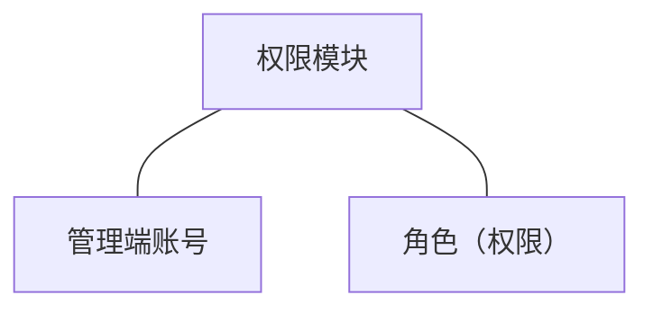
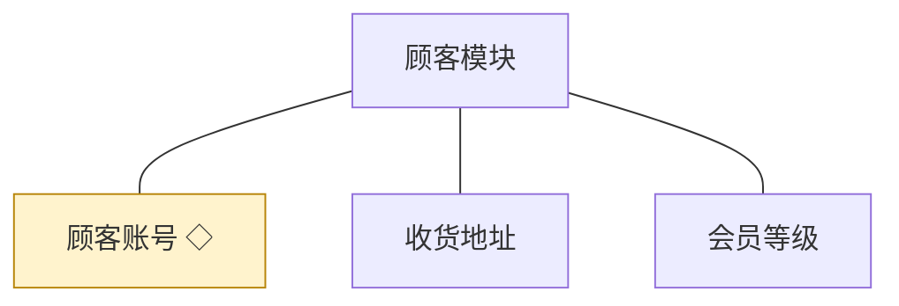
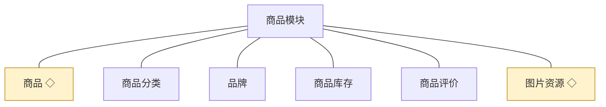
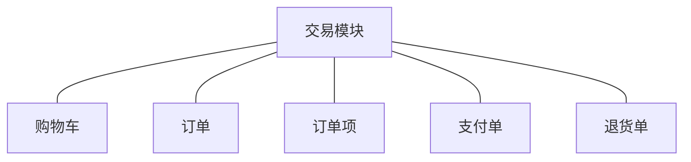
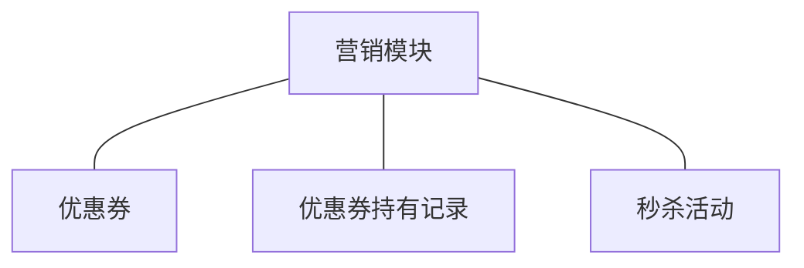
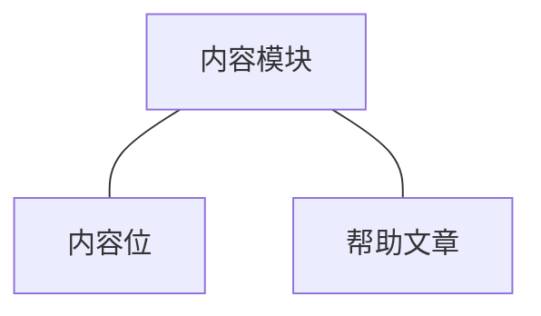
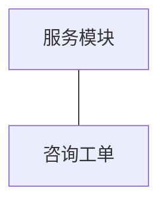
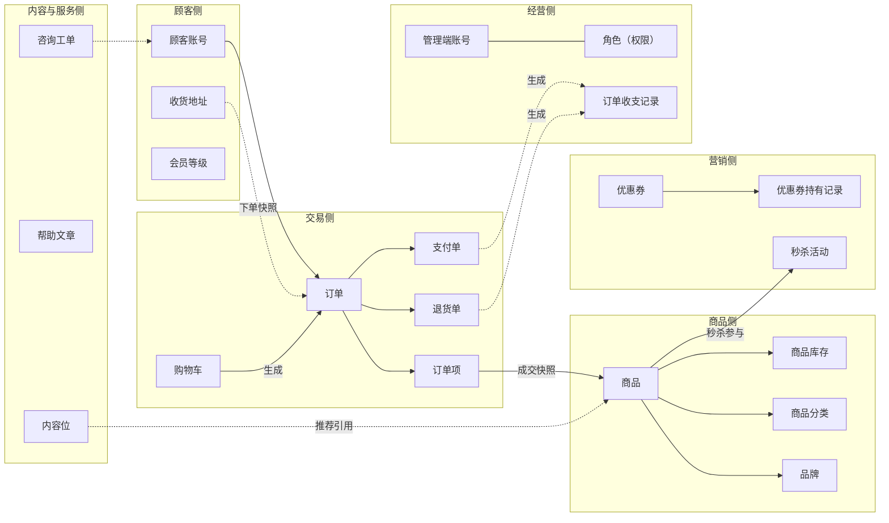

# 模块总览：好物商城

> 本总览确定好物商城的业务模块划分、对象归属与跨模块关系；每模块的详细设计见同目录分文档。上游为模拟案例材料，本文档集为模拟案例评审稿；规则句末括注来源（D＝PRD 决策、K＝技术决策、规范＝开发规范、建议＝本轮建议）。

## 1. 项目结构（模块与对象）

```mermaid
flowchart TB
    P[好物商城]
    P --- M1[权限模块]
    P --- M2[顾客模块]
    P --- M3[商品模块]
    P --- M4[交易模块]
    P --- M5[营销模块]
    P --- M6[内容模块]
    P --- M7[服务模块]
    P --- M8[报表模块]
    M1 --- O1[管理端账号]
    M1 --- O2[角色（权限）]
    M2 --- O3[顾客账号 ◇]
    M2 --- O4[收货地址]
    M2 --- O5[会员等级]
    M3 --- O6[商品 ◇]
    M3 --- O7[商品分类]
    M3 --- O8[品牌]
    M3 --- O9[商品库存]
    M3 --- O10[商品评价]
    M3 --- O11[图片资源 ◇]
    M4 --- O12[购物车]
    M4 --- O13[订单]
    M4 --- O14[订单项]
    M4 --- O15[支付单]
    M4 --- O16[退货单]
    M5 --- O17[优惠券]
    M5 --- O18[优惠券持有记录]
    M5 --- O19[秒杀活动]
    M6 --- O20[内容位]
    M6 --- O21[帮助文章]
    M7 --- O22[咨询工单]
    M8 --- O23[订单收支记录]
    M8 --- O24[统计报表视图]
    classDef marked fill:#fff3cd,stroke:#b8860b;
    class O3,O6,O11 marked;
    classDef derived fill:#f0f0f0,stroke-dasharray: 5 5;
    class O24 derived;
```

◇ 为跨模块共享对象（持有方唯一，使用方以标识引用或统一写入，见各模块共享对象表）；虚线节点为派生查询视图（不落独立业务对象）。

**模块与技术分包的映射**：

| 业务模块 | 技术分包 | 说明 |
|---|---|---|
| 权限模块 | 权限模块分包 | 一一对应 |
| 顾客模块 | 顾客模块分包 | 一一对应 |
| 商品模块 | 商品模块分包 | 一一对应；图片资源为横切技术实体，挂靠最大使用方商品模块持有，不单设技术模块 |
| 交易模块 | 交易模块分包 | 一一对应 |
| 营销模块 | 营销模块分包 | 一一对应 |
| 内容模块 | 内容模块分包 | 一一对应；图片资源经共享契约引用 |
| 服务模块 | 服务模块分包 | 一一对应 |
| 报表模块 | 报表模块分包 | 一一对应；仅派生查询与只读台账，不反向写业务数据 |
| —— | 公共基座分包 | 横切技术能力（鉴权、单号、留痕、异常），以开发规范机制条款承载，不设业务模块 |

模块识别结论：八个业务域各自拥有独立对象群、规则群与使用方，均独立成模块（K1 模块化单体的分包即业务域候选，经主体×对象交叉验证无一需要合并）。

## 2. 模块与对象

### 2.1 权限模块

职责：管理端一侧的身份与授权——管理端账号全生命周期、角色与能力点授权、管理端登录与身份上下文；并认领内部人员的自助管理面（个人设置与账号权限）。

| 对象 | 业务含义与主要组成 | 关系及约束 |
|---|---|---|
| 管理端账号 | 内部人员登录身份：账号名、凭据、状态、所持角色 | 与顾客账号完全隔离（D3）；可持多角色 |
| 角色（权限） | 权限载体：角色名、能力点集合 | 授权可见性由角色决定（D4） |

共享对象表（无）。

功能列表（简单粒度）：账号开通／停用／启用、账号资料与凭据自助重置（个人设置）、角色维护、角色授权、管理端登录登出。详见 [04C-权限.md](./04C-权限.md)。

### 2.2 顾客模块

职责：商城端一侧的顾客身份与画像——顾客账号全生命周期、收货地址簿自助维护、会员等级归属；并认领买家的自助管理面（个人中心）。

| 对象 | 业务含义与主要组成 | 关系及约束 |
|---|---|---|
| 顾客账号 | 买家身份与资料：手机号、资料、状态、归属等级 | 注销后不可复用身份（终态）；被各模块以 customer_id 引用 |
| 收货地址 | 常用收货信息集：联系人、电话、地址、默认标记 | 属个人中心自助管理面，下单时选用并快照 |
| 会员等级 | 分层与权益模板：等级名、门槛、权益说明 | 每顾客归属至多一个等级 |

共享对象表：

| 对象 | 共享方式 | 使用方 |
|---|---|---|
| 顾客账号 | 标识引用（customer_id）＋统一写入（仅顾客模块可改） | 交易、营销、服务、报表 |

功能列表（简单粒度）：注册登录、资料与凭据维护、地址簿增删改查与默认地址设定、注销、会员等级维护与归属、账号查询与冻结。详见 [04C-顾客.md](./04C-顾客.md)。

### 2.3 商品模块

职责：可售商品的档案与货架——商品建档与上下架、分类品牌组织、SKU 级库存台账、商品评价承载、图片资源持有。

| 对象 | 业务含义与主要组成 | 关系及约束 |
|---|---|---|
| 商品 | 商品档案：名称、分类、品牌、规格（SKU）、售价、详情 | 以 SKU 为最小售卖单元；交易以成交快照引用 |
| 商品分类 | 类目树：分类名、父子层级 | 商城货架与管理组织共用（D1） |
| 品牌 | 厂牌：品牌名、介绍、图标 | 商品挂接 |
| 商品库存 | SKU 可售数量台账 | 数量变动只经交易模块的统一写入（锁定/扣减/回补） |
| 商品评价 | 订单完成后的评价：评分、内容、关联商品 | 由交易完成事件触发创建 |
| 图片资源 | 统一存取的图片对象：业务类型＋业务标识 | 挂靠本模块持有（建议） |

共享对象表：

| 对象 | 共享方式 | 使用方 |
|---|---|---|
| 商品 | 标识引用（product_id）＋只读 | 交易（成交快照）、营销（秒杀）、内容（推荐） |
| 图片资源 | 标识引用（biz_type＋biz_id） | 内容 |

功能列表（简单粒度）：商品建档与编辑、上下架、分类树维护、品牌维护、库存设置与调整、评价管理、图片上传与关联。详见 [04C-商品.md](./04C-商品.md)。

### 2.4 交易模块

职责：买卖达成的全过程——购物车、下单支付、订单履约、退货售后；是买卖两侧流程的衔接核心。

| 对象 | 业务含义与主要组成 | 关系及约束 |
|---|---|---|
| 购物车 | 按顾客聚合的暂存条目：SKU、数量 | 条目引用商品实时信息，成交以提交时点价 |
| 订单 | 交易主记录：单号、顾客、金额、状态、收货快照 | 状态流转见分文档；业务单号对外 |
| 订单项 | 成交明细：商品/规格/价格成交时点快照 | 快照不随后续商品变化回写（D6） |
| 支付单 | 在线支付记录：单号、金额、渠道、状态 | 经渠道回调确认；单据只追加不删 |
| 退货单 | 售后记录：单号、原因、状态、处理结论 | 审核结论必须留痕可见 |

功能列表（简单粒度）：购物车增删改查、提交订单、订单查询与跟踪、确认收货、取消订单、支付发起与回调确认、发货登记、退货申请与审核、退款执行、订单自动流转。详见 [04C-交易.md](./04C-交易.md)。

### 2.5 营销模块

职责：拉复购的促销工具——优惠券模板与持有、秒杀活动配置与执行。

| 对象 | 业务含义与主要组成 | 关系及约束 |
|---|---|---|
| 优惠券 | 券模板：面额、使用条件、有效期、发放量 | 模板与实例分离 |
| 优惠券持有记录 | 券实例：持有人、状态、核销关联单号 | 每顾客对同模板唯一持有（防重索引） |
| 秒杀活动 | 限时限量特价：活动商品、价、限购、档期、活动库存 | 引用商品；活动库存独立于商品库存台账 |

功能列表（简单粒度）：券模板增删改查、券发放与领取、券核销与退券、秒杀活动增删改查、活动档期执行、秒杀价呈现。详见 [04C-营销.md](./04C-营销.md)。

### 2.6 内容模块

职责：商城端页面运营内容——内容位（推荐位/广告位/专题）配置与帮助中心文章维护。

| 对象 | 业务含义与主要组成 | 关系及约束 |
|---|---|---|
| 内容位 | 首页/专题页的推荐位、广告位、专题入口：类型、素材、关联对象、档期 | 关联对象以标识引用 |
| 帮助文章 | 帮助中心内容：分类、标题、正文、发布状态 | 买家自助查阅 |

功能列表（简单粒度）：内容位增删改查与上下线、帮助文章增删改查与发布、帮助文章分类维护。详见 [04C-内容.md](./04C-内容.md)。

### 2.7 服务模块

职责：买家咨询的受理与答复——咨询工单全流程。

| 对象 | 业务含义与主要组成 | 关系及约束 |
|---|---|---|
| 咨询工单 | 咨询记录：工单号、顾客、内容、往来答复、状态 | 关联订单可选；完结后留档 |

功能列表（简单粒度）：工单创建、工单查询、答复与追问、工单完结。详见 [04C-服务.md](./04C-服务.md)。

### 2.8 报表模块

职责：经营复盘的只读呈现——订单收支台账与统计报表查询视图。

只读分析类模块，不建第二套业务对象；查询视图表代替对象结构图与共享对象表：

| 视图/台账 | 业务含义 | 数据来源 |
|---|---|---|
| 订单收支记录（台账） | 基础财务收支流水：收入（支付成功）、支出（售后退款） | 交易模块支付/退货事实统一写入（D8） |
| 统计报表视图 | 商品销售、订单、会员经营统计 | 各业务表派生查询，不落第二套对象 |

功能列表（简单粒度）：收支台账查询、商品销售统计、订单统计、会员统计、报表导出。详见 [04C-报表.md](./04C-报表.md)。

## 3. 跨模块关系

**对象关联表**：

| 关联对象 | 关系 | 数据归属 |
|---|---|---|
| 订单项—商品 | 成交快照引用 | 快照数据落交易模块，商品档案归商品模块 |
| 秒杀活动—商品 | 参与引用 | 活动归营销模块；活动商品引用商品标识 |
| 内容位—商品 | 推荐引用 | 内容位归内容模块，以标识引用 |
| 订单收支记录—支付单/退货单 | 事实派生 | 台账归报表模块，由交易事实统一写入（D8） |
| 咨询工单—顾客账号 | 发起引用 | 工单归服务模块 |
| 购物车—商品 | 暂存引用 | 购物车归交易模块；展示取商品实时信息 |
| 会员等级—顾客账号 | 归属 | 等级归顾客模块 |
| 图片资源—商品/内容位 | 图关联 | 图片资源归商品模块，以业务类型＋标识关联 |

**协作约束表**：

| 协作场景 | 必须共同成立的结果 | 详细设计 |
|---|---|---|
| 提交订单 | 订单/订单项创建＋库存锁定＋券核销（如用券）要么全部成立要么全部回滚，同一本地事务 | 04C-交易.md ◆提交订单 |
| 支付回调确认 | 支付单落账＋订单转待发货＋库存扣减＋收支记录生成，同一本地事务且回调幂等 | 04C-交易.md ◆支付回调确认 |
| 退货退款完成 | 退货单完结＋订单回已完成＋库存回补＋支出记录生成，同一本地事务 | 04C-交易.md ◆退货审核与退款 |
| 订单自动取消 | 订单关闭＋占用释放（库存/券），任务可重入幂等 | 04C-交易.md ◆订单自动流转 |
| 秒杀下单 | 活动库存扣减＋订单创建同事务，活动售罄即止 | 04C-营销.md ◆秒杀执行 |
| 内容位呈现 | 仅呈现已上架商品，下架自动失效 | 04C-内容.md |
