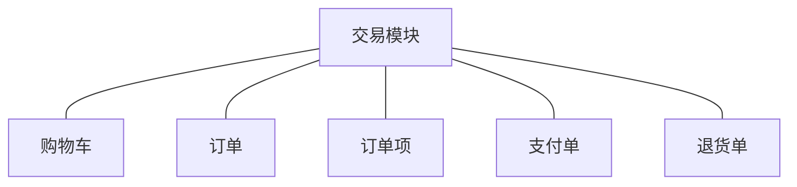
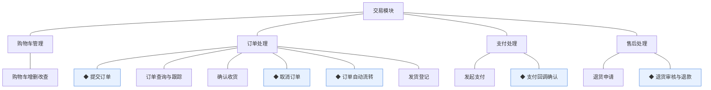
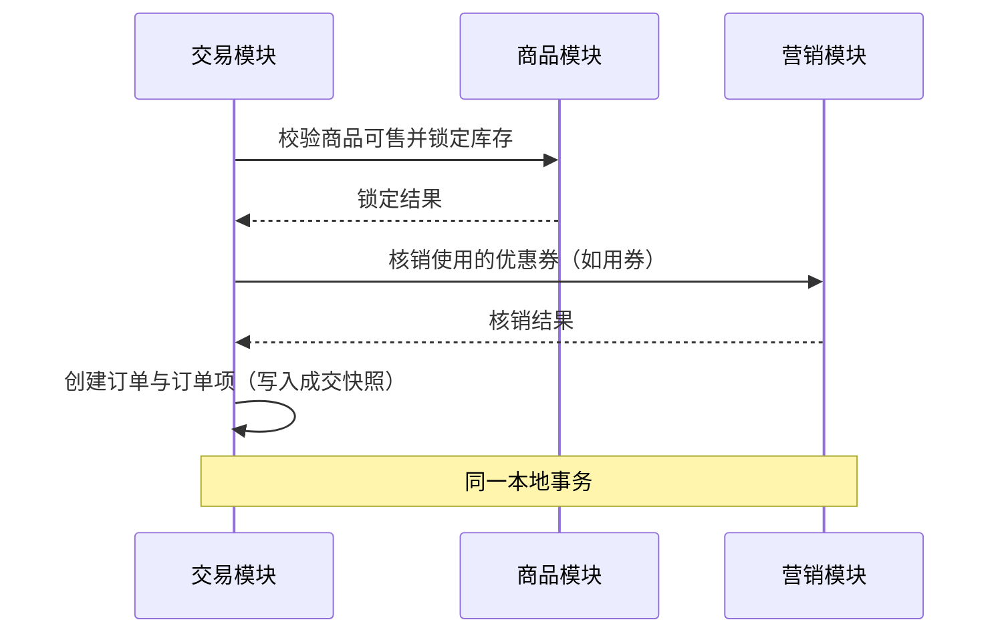
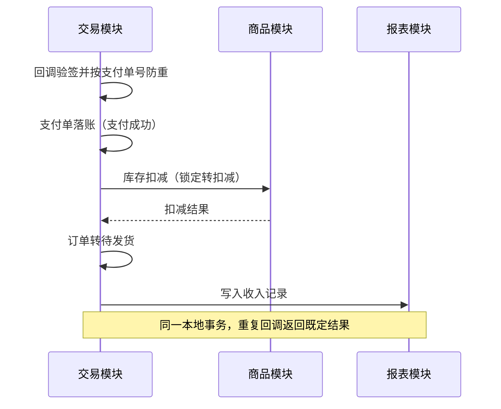
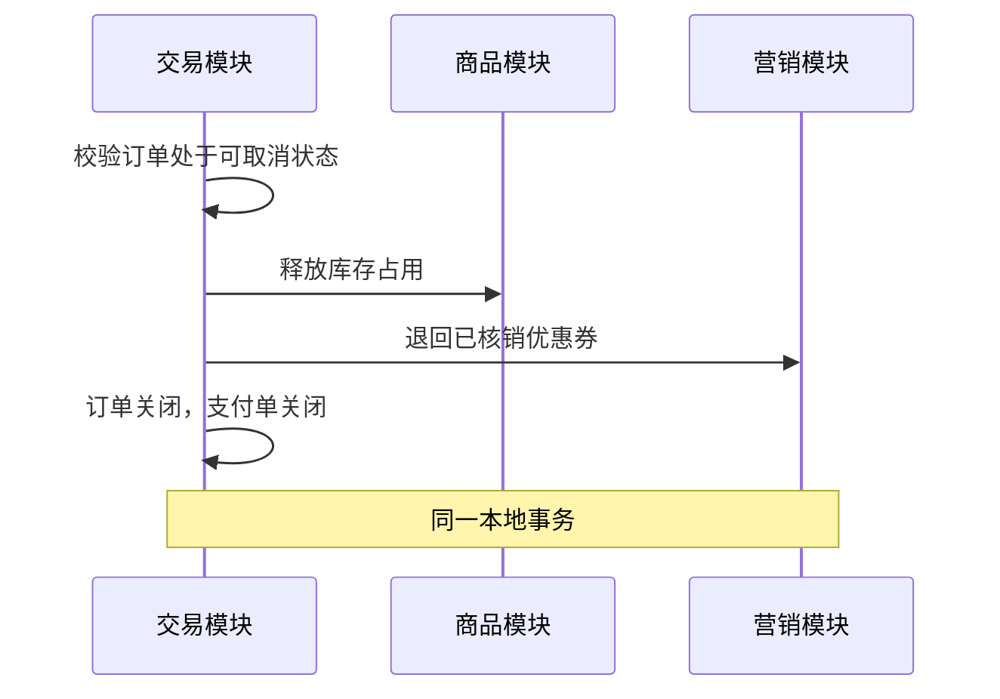
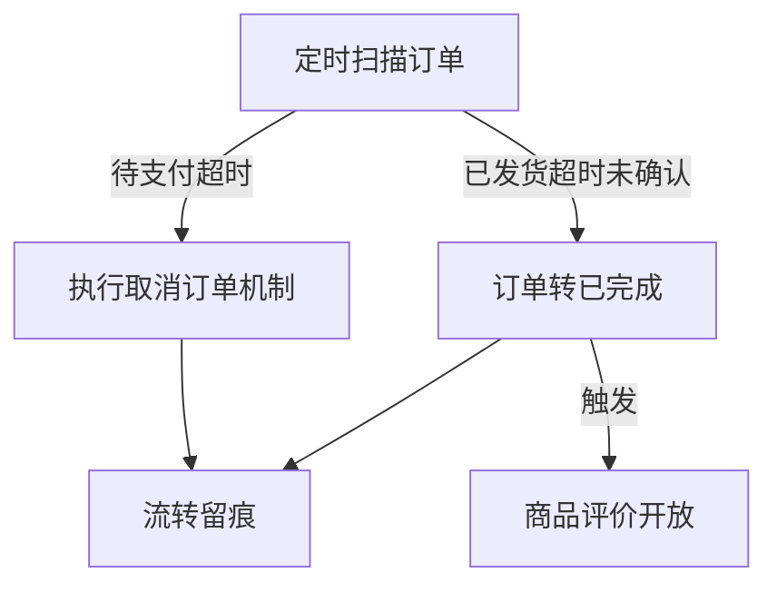
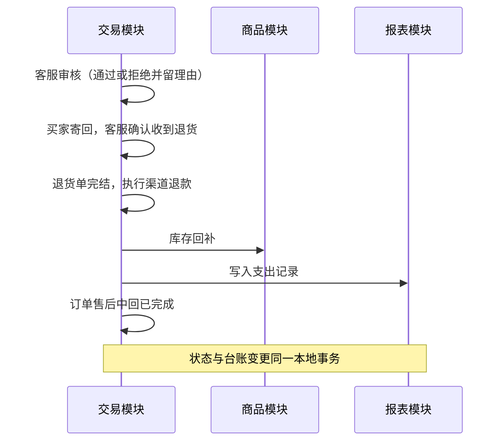
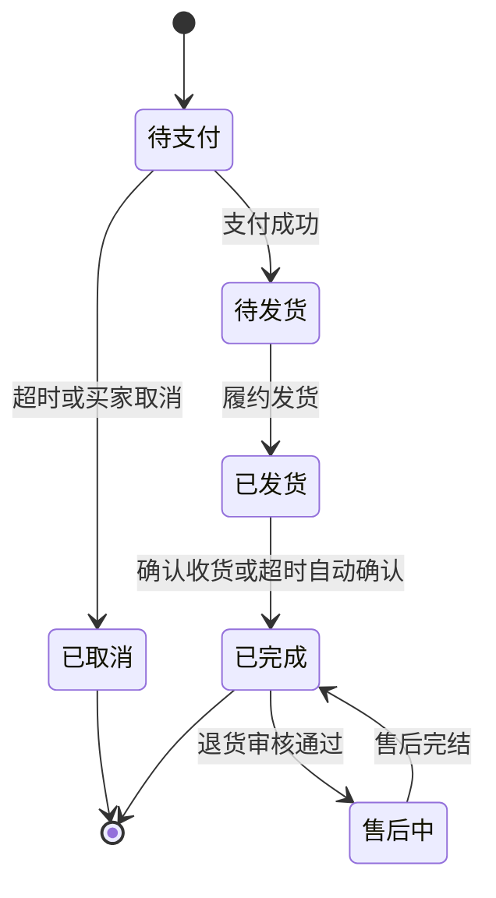

# 模块设计：交易模块

> 对应技术分包"交易模块"，承接《模块总览》2.4 节的同构放大；规则句末括注来源（D＝PRD 决策、K＝技术决策、规范＝开发规范、建议＝本轮建议）。上游为模拟案例材料，本文档为模拟案例评审稿。

## 1. 职责与边界

**管**：购物车、订单、订单项、支付单、退货单的全生命周期；买卖两侧的流程衔接（下单—支付—发货—收货—售后）；订单状态流转与自动流转；库存数量变动入口与收支台账写入的触发。

**不管**：商品档案与分类品牌（商品模块）；库存台账的归属（商品模块持有，本模块仅统一写入变动）；优惠券模板与活动配置（营销模块）；收支台账的持有与查询（报表模块）；顾客身份与地址簿（顾客模块）；咨询受理（服务模块）。

**边界**：凡"一笔交易的成立、履行与售后"归本模块；交易涉及的他人数据一律经协作契约。

## 2. 对象

### 2.1 对象结构

### 2.2 对象说明

- **购物车**：定位——买家暂存选中商品的载体（按顾客聚合的条目集）。关键组成——顾客标识、商品/规格引用、数量、加入时间。关系与约束——条目引用商品实时信息（名称/图/价随商品展示）；结算后清空对应条目；不落成交事实。
- **订单**：定位——一次交易的主记录，买卖两侧流程的衔接核心。关键组成——订单号（对外单号）、顾客标识、订单状态、总金额（分）、收货快照、时间点集。关系与约束——与顾客账号是标识引用；业务单号对外展示与跨单据关联（规范）。
- **订单项**：定位——订单内商品明细，成交时点快照。关键组成——商品/规格标识、名称快照、规格快照、单价快照（分）、数量、成交小计。关系与约束——快照字段不随后续商品变化回写（D6）。
- **支付单**：定位——订单的在线支付记录。关键组成——支付单号、订单号关联、支付金额（分）、渠道、支付状态。关系与约束——每订单一次有效支付尝试对应一单，重试换新单；单据只追加不删（规范）。
- **退货单**：定位——售后申请与处理记录。关键组成——退货单号、订单号关联、原因、凭证、状态、审核结论与理由。关系与约束——审核拒绝必须留理由供买家查看（PRD 售后闭环）；完结即终态。

### 2.3 共享对象

本模块持有的对象无被他方以共享方式使用者（报表模块对交易事实是"统一写入"的协作契约，见第 5 节），本节省略。

## 3. 功能

### 3.1 功能结构

### 3.2 购物车管理

| 功能 | 使用方 | 说明 |
|---|---|---|
| 加入购物车 | 买家（商城端） | 选择规格与数量加入；重复加入同规格合并数量 |
| 调整数量／移除 | 买家（商城端） | 条目级操作 |
| 购物车查询 | 买家（商城端） | 展示商品实时信息，标记失效条目（商品下架/删除） |

### 3.3 订单处理

| 功能 | 使用方 | 说明 |
|---|---|---|
| 订单查询与跟踪 | 买家（商城端）、订单履约人员（管理端） | 按状态/单号/顾客维度查询；买家见本人订单与物流状态 |
| 确认收货 | 买家（商城端） | 已发货订单确认；完结后开放评价（评价对象归商品模块） |
| 发货登记 | 订单履约人员（管理端） | 待发货订单登记承运与单号，订单转已发货 |

### 3.4 支付处理

| 功能 | 使用方 | 说明 |
|---|---|---|
| 发起支付 | 买家（商城端） | 对待支付订单创建支付单并请求渠道；渠道经适配层（K6） |

### 3.5 售后处理

| 功能 | 使用方 | 说明 |
|---|---|---|
| 退货申请 | 买家（商城端） | 对已完成订单发起，生成退货单待审核 |

### 3.6 ◆ 提交订单

说明：买家从购物车（或商品直达）发起结算，交易模块在同一本地事务内完成订单创建、库存锁定与券核销，要么全部成立要么全部回滚。

规则：
1. 下单价格取提交时点的商品售价与生效优惠（D6）。
2. 库存锁定失败或券核销失败则整单失败，不留占用（规范：同事务）。
3. 订单项必须写入成交快照字段（D6、术语表快照契约）。
4. 用券金额在订单金额中先行抵扣，订单总金额为分单位整数（K10）。
5. 事务内不发起任何外部调用（规范）。

### 3.7 ◆ 支付回调确认

说明：支付渠道异步回调到达，交易模块在同一本地事务内落账支付单、推进订单、扣减库存并触发收支写入。

规则：
1. 回调以支付单号防重，重复回调不产生第二份事实（规范）。
2. 支付成功前订单已取消的，回调到达即转退款路径处理（渠道资金原路退回，建议）。
3. 收支记录由本模块统一写入报表模块台账，报表不自行抓取（D8）。

### 3.8 ◆ 取消订单

说明：买家主动取消或支付超时取消，交易模块释放全部占用。

规则：
1. 仅待支付订单可取消；待发货起的取消走售后路径（建议）。
2. 释放与退回必须与订单关闭同事务成立（规范）。
3. 取消后同单据不可复活，重新购买即新订单（D6 快照原则）。

### 3.9 ◆ 订单自动流转

说明：调度任务驱动的状态自动推进——支付超时自动取消、发货后超时自动确认收货；任务可重入幂等。

规则：
1. 自动流转与手动动作同规：走同一取消/完结机制，不旁路（D7）。
2. 任务重入不产生重复流转，以状态前置条件保护（规范：条件更新）。
3. 时限阈值不在本文档定义，归小版本 PRD（版本替换检验）。

### 3.10 ◆ 退货审核与退款

说明：客服人员审核退货申请，通过后经买家寄回、确认收货执行退款；同一事务完成售后闭环与库存回补、支出记录。

规则：
1. 审核拒绝必须填写理由并回传商城端可见（PRD 售后闭环）。
2. 退款金额不超过订单实付金额；部分退的口径归小版本 PRD（版本替换检验）。
3. 渠道退款经适配层发起，退款的到账确认以渠道回执为准（K6）。

## 4. 状态

**订单**（状态机与术语表一致）：

| 流转 | 触发条件 | 伴随动作与约束 |
|---|---|---|
| 待支付→已取消 | 买家取消/支付超时 | 释放库存与券（同事务，D7） |
| 待支付→待发货 | 支付回调确认 | 扣库存、写收入记录（同事务） |
| 待发货→已发货 | 履约人员发货登记 | 登记承运信息，商城端可跟踪 |
| 已发货→已完成 | 买家确认或超时自动 | 开放评价 |
| 已完成→售后中→已完成 | 退货审核通过→售后完结 | 回补库存、写支出记录 |

**支付单**：待支付 `PENDING` → 支付成功 `PAID`／已关闭 `CLOSED`；支付成功 → 已退款 `REFUNDED`（售后退款）。终态：`PAID`（无售后时）、`CLOSED`、`REFUNDED`。

**退货单**：待审核 `PENDING_REVIEW` → 待退货 `PENDING_RETURN`／已拒绝 `REJECTED`／已取消 `CANCELLED`；待退货 → 退款完成 `REFUNDED`。终态：`REFUNDED`、`REJECTED`、`CANCELLED`。

购物车与订单项无独立状态（购物车条目失效以商品状态派生标记；订单项随订单状态）。

## 5. 对外契约

| 操作 | 语义 | 调用方 | 关键约束 |
|---|---|---|---|
| 锁定库存 | 为订单预留数量（锁定） | 本模块→商品模块 | 数量台账统一写入入口（总览协作约束） |
| 扣减库存 | 支付成功后锁定转扣减 | 本模块→商品模块 | 与支付落账同事务 |
| 回补库存 | 售后完结回补数量 | 本模块→商品模块 | 与退货完结同事务 |
| 核销/退回优惠券 | 用券占用与取消释放 | 本模块→营销模块 | 与订单创建/取消同事务 |
| 写入收支记录 | 收入/支出事实写入台账 | 本模块→报表模块 | 只读生成，不提供人工编辑（D8） |
| 订单完成事件 | 通知评价开放 | 本模块→商品模块 | 事件式通知，评价对象归商品模块 |

## 6. 待议与版本级事项

- **本轮建议**：支付成功前订单已取消的回调走原路退回；待发货起的取消走售后路径。
- **待业务确认**：部分退（退货数量小于订单数量）的金额口径。
- **留版本级**：支付时限、确认收货时限等阈值；部分退规则；退款到账提示文案。
- **明确不做**：订单改价、人工备注之外的单据字段编辑（D6 快照原则的推论）。
- **关联评审**：若营销模块引入积分等其他优惠载体，本模块用券抵扣机制需联动评审。
