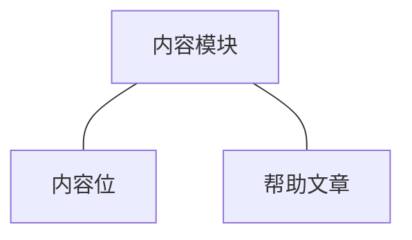
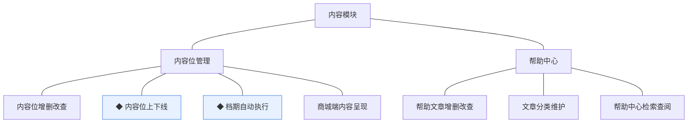
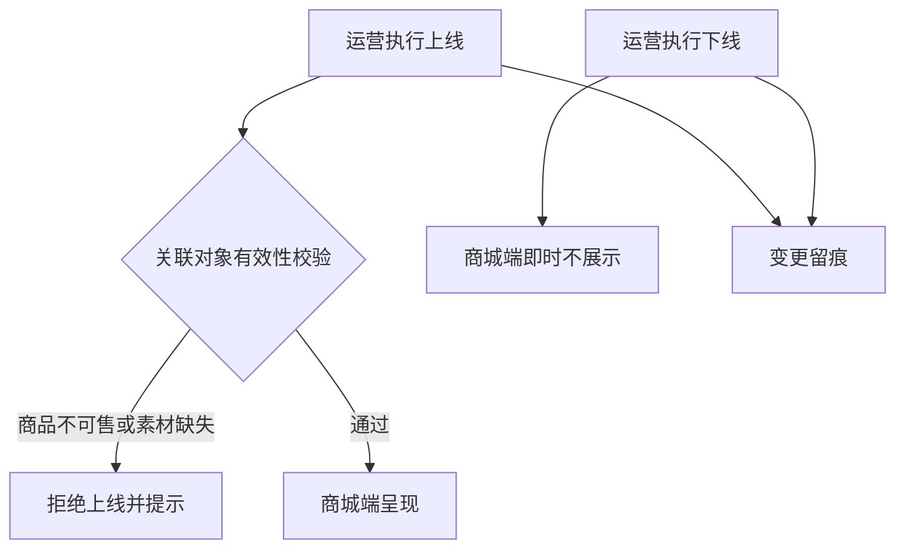
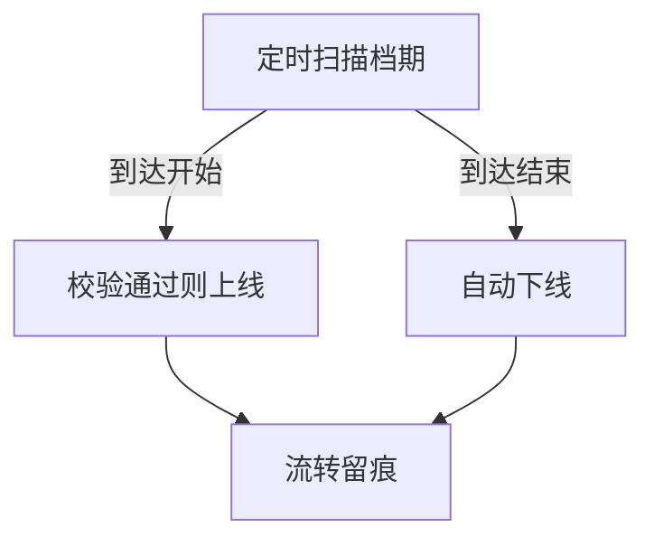

# 模块设计：内容模块

> 对应技术分包"内容模块"，承接《模块总览》2.6 节的同构放大；规则句末括注来源（D＝PRD 决策、K＝技术决策、规范＝开发规范、建议＝本轮建议）。上游为模拟案例材料，本文档为模拟案例评审稿。

## 1. 职责与边界

**管**：商城端页面运营内容——内容位（推荐位/广告位/专题入口）的配置、档期与上下线、帮助中心文章的维护与发布。

**不管**：商品档案与可售性判定（商品模块，内容位只引用）；图片对象的持有（商品模块共享契约）；秒杀与优惠券等促销配置（营销模块）。

**边界**：凡"页面上运营说什么、推什么"归本模块；被推对象的资质由其归属模块判定。

## 2. 对象

### 2.1 对象结构

### 2.2 对象说明

- **内容位**：定位——首页门户与专题页的推荐位、广告位、专题入口的统称。关键组成——类型（推荐/广告/专题）、标题文案、素材图引用、关联对象标识、投放档期、排序。关系与约束——关联商品以标识引用并须可售；素材经图片资源共享契约引用。
- **帮助文章**：定位——帮助中心的常见问题内容。关键组成——分类、标题、正文、发布标记。关系与约束——面向买家自助查阅，无关联业务对象。

### 2.3 共享对象

本模块无被他方使用的持有对象；本模块引用他方对象（商品、图片资源）经契约表达，本节省略。

## 3. 功能

### 3.1 功能结构

### 3.2 内容位管理

| 功能 | 使用方 | 说明 |
|---|---|---|
| 内容位增删改查 | 运营人员（管理端） | 配置类型、文案、素材、关联对象、排序与档期 |
| 商城端内容呈现 | 买家（商城端） | 首页门户与专题页按配置渲染；失效位自动不展示 |

### 3.3 帮助中心

| 功能 | 使用方 | 说明 |
|---|---|---|
| 帮助文章增删改查 | 运营人员（管理端） | 维护分类与正文；发布后买家可见 |
| 文章分类维护 | 运营人员（管理端） | 帮助分类树；被引用不可删 |
| 帮助中心检索查阅 | 买家（商城端） | 按分类/关键词查阅 |

### 3.4 ◆ 内容位上下线

说明：运营人员对内容位执行上线/下线，上线时校验关联对象有效性，下线即时从商城端撤出。

规则：
1. 上线前置校验：关联商品须处于已上架状态（总览协作约束）；素材图已关联（建议）。
2. 商品事后下架的，内容位呈现侧按失效处理，不自动删除配置（建议）。
3. 上下线留痕（规范）。

### 3.5 ◆ 档期自动执行

说明：按投放档期自动上线/下线内容位。

规则：
1. 自动上线仍须通过有效性校验，不通过则跳过并留痕待处理（建议）。
2. 任务可重入幂等（规范）。

## 4. 状态

内容位与帮助文章均无生命周期状态对象：内容位以"投放档期＋上下线标记"表达有效性（属性而非状态机，建议）；帮助文章以"发布标记"表达可见性。两者均不随业务事件流转。

## 5. 对外契约

| 操作 | 语义 | 调用方 | 关键约束 |
|---|---|---|---|
| 内容位列表查询 | 首页门户与专题页渲染 | 商城端→本模块 | 仅返回有效位 |
| 商品可售查询 | 上线/呈现校验 | 本模块→商品模块 | 只读 |
| 图片引用 | 素材图关联 | 本模块→商品模块 | 共享契约（biz_type＋biz_id） |
| 帮助文章查询 | 帮助中心检索 | 商城端→本模块 | 仅已发布 |

## 6. 待议与版本级事项

- **本轮建议**：失效内容自动隐藏不删配置；自动上线失败跳过留痕。
- **待业务确认**：专题页是否作为独立页面形态（当前按专题入口+落地呈现理解）。
- **留版本级**：素材尺寸规范、内容位数量上限、帮助文章富文本能力边界。
- **明确不做**：个性化推荐算法（按运营配置呈现）。
- **关联评审**：首页信息结构（UI 文档）对内容位类型清单的影响。
