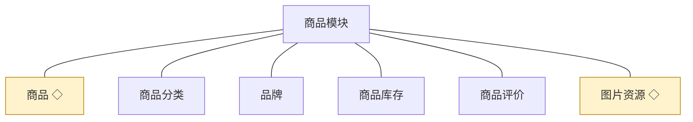
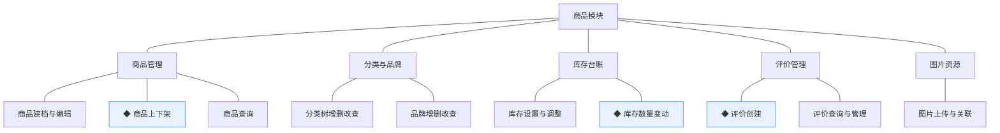
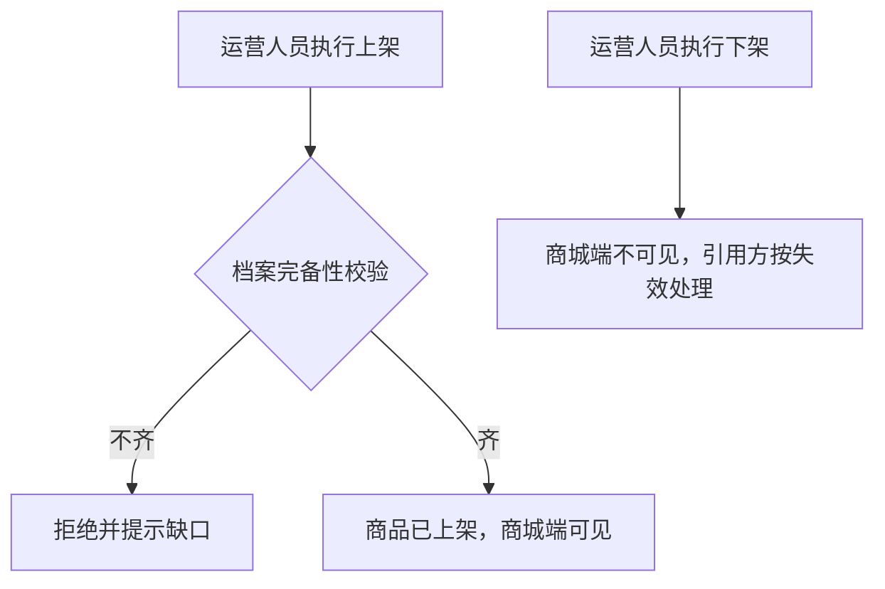
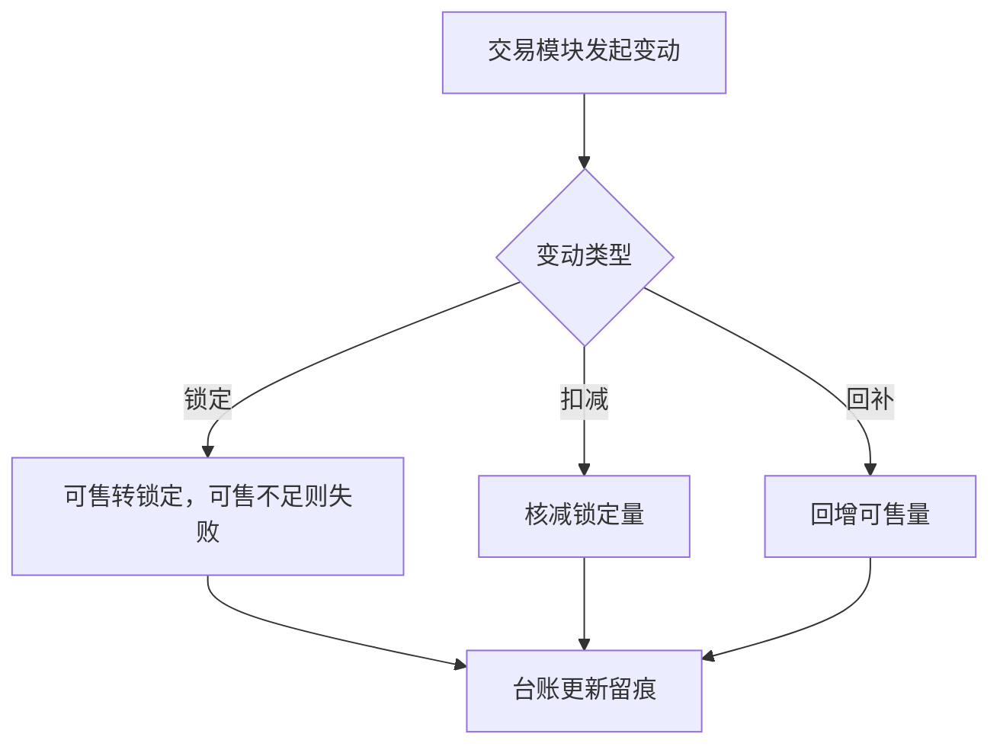
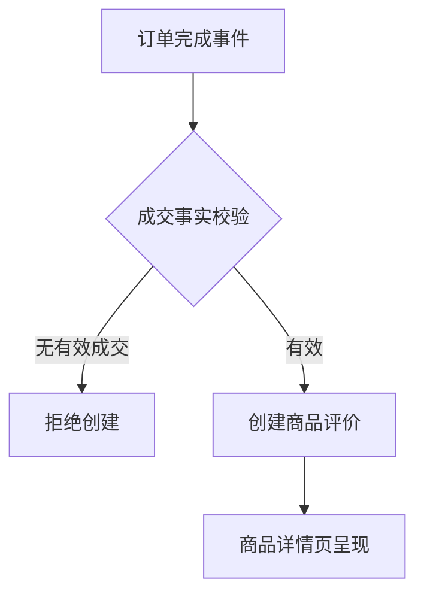
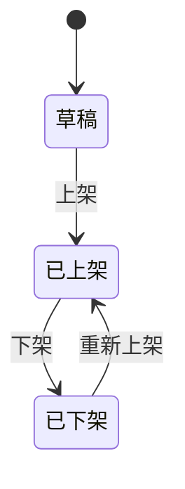

# 模块设计：商品模块

> 对应技术分包"商品模块"，承接《模块总览》2.3 节的同构放大；规则句末括注来源（D＝PRD 决策、K＝技术决策、规范＝开发规范、建议＝本轮建议）。上游为模拟案例材料，本文档为模拟案例评审稿。

## 1. 职责与边界

**管**：商品建档与上下架、分类与品牌组织、SKU 级库存台账的持有、商品评价的承载、图片资源对象的持有与关联。

**不管**：库存数量的业务变动入口（交易模块统一写入，本模块只持有台账）；订单与成交快照（交易模块）；秒杀活动的档期与活动价（营销模块）；内容位对商品的引用配置（内容模块）；帮助文章（内容模块）。

**边界**：凡"商品档案与货架的组织"归本模块；数量的增减动因归交易。

## 2. 对象

### 2.1 对象结构

### 2.2 对象说明

- **商品**：定位——以规格（SKU）为最小售卖单元的实物商品档案。关键组成——名称、分类归属、品牌归属、规格集（SKU）、售价（分）、详情图文。关系与约束——交易以成交快照引用本对象（D6）；引用方不得反写档案。
- **商品分类**：定位——商城货架与管理组织共用的类目树。关键组成——分类名、父分类、排序。关系与约束——叶子分类挂商品；分类删除受"被商品引用不可删"约束（规范软删除语义）。
- **品牌**：定位——商品厂牌信息。关键组成——品牌名、介绍、品牌图。关系与约束——品牌被商品引用不可删。
- **商品库存**：定位——SKU 级可售数量台账。关键组成——SKU 标识、可售数量、锁定数量。关系与约束——数量变动只接受交易模块的统一写入（锁定/扣减/回补）；运营可设置与调整初始量（建议）。
- **商品评价**：定位——订单完成后买家对商品的评价记录。关键组成——关联订单项、评分、评价内容、图片。关系与约束——由交易模块订单完成事件触发创建；一次成交仅一条评价。
- **图片资源**：定位——统一存取的图片对象（技术实体）。关键组成——业务类型、业务标识、存储地址。关系与约束——挂靠本模块持有（建议）；内容模块经共享契约引用；外站图片转存后引用（规范）。

### 2.3 共享对象

| 对象 | 共享方式 | 使用方 | 使用契约 |
|---|---|---|---|
| 商品 | 标识引用（product_id）＋只读 | 交易、营销、内容 | 引用方留存标识与快照，不复制档案、不反写 |
| 图片资源 | 标识引用（biz_type＋biz_id） | 内容 | 只引用不持有；上传入口统一走本模块图片能力 |

## 3. 功能

### 3.1 功能结构

### 3.2 商品管理

| 功能 | 使用方 | 说明 |
|---|---|---|
| 商品建档与编辑 | 运营人员（管理端） | 维护名称、分类、品牌、规格（SKU）、售价、详情；草稿态可反复编辑 |
| 商品查询 | 买家（商城端）、运营人员（管理端） | 商城端按分类/关键词/详情浏览；管理端按档案维度检索 |

### 3.3 分类与品牌

| 功能 | 使用方 | 说明 |
|---|---|---|
| 分类树增删改查 | 运营人员（管理端） | 父子层级维护；被引用的分类不可删 |
| 品牌增删改查 | 运营人员（管理端） | 被引用的品牌不可删 |

### 3.4 库存台账

| 功能 | 使用方 | 说明 |
|---|---|---|
| 库存设置与调整 | 运营人员（管理端） | 设置初始量、人工修正并留痕 |

### 3.5 评价管理

| 功能 | 使用方 | 说明 |
|---|---|---|
| 评价查询与管理 | 运营人员（管理端） | 按商品/订单维度查询；违规评价可隐藏并留痕（建议） |

### 3.6 图片资源

| 功能 | 使用方 | 说明 |
|---|---|---|
| 图片上传与关联 | 运营人员（管理端） | 上传入库并按业务类型关联；外部图转存（规范） |

### 3.7 ◆ 商品上下架

说明：运营人员对草稿/已下架商品执行上架，或对在售商品下架；上下架改变商城端可见性并联动他方引用的有效性。

规则：
1. 上架前置校验：名称、分类、至少一个规格与售价、库存台账就绪（建议）。
2. 下架后交易侧购物车与内容位引用按失效处理，不删除既有订单事实（D6）。
3. 上下架动作留痕（规范）。

### 3.8 ◆ 库存数量变动

说明：交易模块发起的数量变动统一入口——锁定、扣减、回补三类契约写操作；条件更新保护并发。

规则：
1. 变动以条件更新（数量前置条件）保护并发（K5、规范）。
2. 可售不足时锁定失败，由调用方决定整单回滚（总览协作约束）。
3. 台账变动必须可追溯（谁/何时/何因，规范留痕）；人工修正同样留痕。

### 3.9 ◆ 评价创建

说明：订单完成事件触发买家评价，校验成交事实后创建评价记录。

规则：
1. 一次成交（订单项）至多一条评价（防重约束，规范）。
2. 评价内容含图片时走图片资源关联（共享契约）。
3. 评价不修改商品档案，仅作展示与统计输入（D6 推论）。

## 4. 状态

**商品**（状态机与术语表一致；无终态，可循环上下架）：

| 流转 | 触发条件 | 伴随动作与约束 |
|---|---|---|
| 草稿→已上架 | 运营上架+完备性校验 | 商城端可见 |
| 已上架→已下架 | 运营下架 | 引用方按失效处理，订单事实不变 |
| 已下架→已上架 | 重新上架 | 重新通过完备性校验 |

商品库存、商品评价、分类、品牌、图片资源无独立状态对象：库存以变动留痕表达历史（不设状态）；评价是成交后追加的记录（隐藏为管理标记非生命周期，建议）；分类/品牌/图片为静态档案。

## 5. 对外契约

| 操作 | 语义 | 调用方 | 关键约束 |
|---|---|---|---|
| 可售校验与锁定 | 为订单预留库存 | 交易模块→本模块 | 与订单创建同事务 |
| 扣减 | 支付成功核减 | 交易模块→本模块 | 条件更新保护 |
| 回补 | 售后回增 | 交易模块→本模块 | 与退货完结同事务 |
| 订单完成事件响应 | 开放并创建评价 | 交易模块→本模块 | 防重创建 |
| 商品可售查询 | 引用有效性校验 | 营销、内容模块 | 只读 |

## 6. 待议与版本级事项

- **本轮建议**：违规评价可隐藏并留痕；上架完备性校验的清单口径如上三条。
- **待业务确认**：评价是否需要先审后显。
- **留版本级**：库存预警阈值、评价展示排序规则、图片大小限制。
- **明确不做**：多规格组合商品（套装）、商品多语言。
- **关联评审**：若营销引入更多活动形态（如拼团），对商品的引用契约需联动评审。
