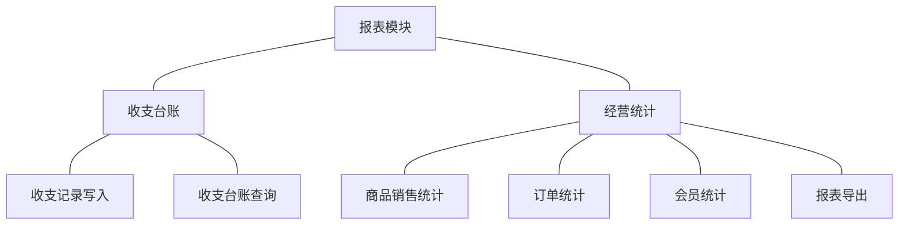

# 模块设计：报表模块

> 对应技术分包"报表模块"，承接《模块总览》2.8 节的同构放大；规则句末括注来源（D＝PRD 决策、K＝技术决策、规范＝开发规范、建议＝本轮建议）。上游为模拟案例材料，本文档为模拟案例评审稿。本模块为只读分析类模块：不建第二套业务对象，第 2 节以台账与查询视图表代替对象结构图与共享对象表，第 4 节说明无状态原因。

## 1. 职责与边界

**管**：基础财务的订单收支台账持有与查询（收入与支出两向）；商品销售、订单、会员三类经营统计查询视图；报表导出与导出留痕。

**不管**：任何业务事实的产生（全部业务对象归各自模块）；收支记录的人工编辑（无此能力，D8）；统计指标的逐条口径定义与数值目标（留版本级细化）；导出文件在系统外的二次分发（不在系统内管控）；实时监控大屏与推送提醒（明确不做）。

**边界**：本模块是只读分析层——只接收交易侧统一写入的台账与对业务表的派生查询，不反向写任何业务数据。

## 2. 对象（台账与查询视图）

| 台账/视图 | 定位 | 关键组成 | 关系与约束 |
|---|---|---|---|
| 订单收支记录（台账） | 基础财务收支流水 | 记录类型（收入/支出/冲正）、金额（分）、关联单号（支付单号/退货单号/被冲正单号）、发生时间 | 由交易模块统一写入（D8）；只读追加，不提供编辑与删除 |
| 统计报表视图 | 经营统计的派生查询 | 商品销售统计、订单统计、会员统计 | 从各业务表派生，不落第二套对象（K3 单库派生） |
| 报表导出产物 | 统计结果的文件化交付 | 导出任务、文件、留痕 | 按角色能力点控制（D4） |

订单收支记录的记录类型（落库值见术语表编码契约）：

| 类型 | 含义 | 来源 |
|---|---|---|
| 收入 `INCOME` | 一笔交易的实收金额 | 支付成功事实（04C-交易 3.7） |
| 支出 `EXPENSE` | 一笔售后的退款金额 | 售后退款完成事实（04C-交易 3.10） |
| 冲正 `REVERSAL` | 交易事实修正时的反向对冲 | 源头模块修正后追加，金额取反、关联被冲正单号（规范：单据只追加） |

统计视图按"商品销售／订单／会员"三类组织；每类的取数维度与口径要点如下（维度组合的完整清单归版本级）：

| 视图 | 取数维度 | 口径要点 |
|---|---|---|
| 商品销售统计 | 商品/规格、时间、商品分类、品牌 | 以订单完成口径计销售；退款订单按净额双列呈现（毛额与扣除退款后净额，建议） |
| 订单统计 | 时间、订单状态、下单渠道 | 过程指标按状态分布计（如待发货存量），完成指标按完成时点计（建议） |
| 会员统计 | 时间、会员等级、顾客账号状态 | 存量口径；注销账号计入历史累计不计当期存量（建议） |

统计日切以服务器时区（东八区）自然日为准（规范：时间条款推论）；报表周期（日/周/月）为同一取数口径下的不同时间窗，不另建对象（建议）。

## 3. 功能

### 3.1 功能结构

（本模块无契约类写操作以外的独立复杂功能：收支写入是承接交易模块统一写入的入口而非独立操作，不标 ◆。）

### 3.2 收支台账

| 功能 | 使用方 | 说明 |
|---|---|---|
| 收支记录写入 | 交易模块（系统间协作） | 收入（支付成功）与支出（售后退款）事实写入，同事务（D8） |
| 收支台账查询 | 管理者（管理端） | 按时间/类型（收入/支出/冲正）/单号维度查询流水 |

### 3.3 经营统计

| 功能 | 使用方 | 说明 |
|---|---|---|
| 商品销售统计 | 管理者、运营人员（管理端） | 商品/规格维度的销量与金额，毛额与净额双列（建议） |
| 订单统计 | 管理者（管理端） | 订单量、状态分布、时间趋势 |
| 会员统计 | 管理者、运营人员（管理端） | 会员规模、等级分布、复购情况 |
| 报表导出 | 管理者（管理端） | 统计结果导出文件，导出须留痕（规范） |

### 3.4 写入与统计规则

规则：
1. 收支记录只由交易模块写入，一次交易事实一条记录，写入幂等（按关联单号防重，规范）。
2. 台账金额为分单位整数，与交易事实严格一致（K10）。
3. 台账错误不做就地修改：交易事实在源头模块修正后，以反向冲正记录追加修正（类型＝冲正、金额取反、关联被冲正单号），原记录保留（规范：单据只追加）。
4. 统计视图实时派生自业务表；量大时的汇总加速（预聚合）作为实现优化，不改变口径（建议）。
5. 销售类统计以订单完成口径计；退款完成的订单在净额口径中扣除（建议）。
6. 会员统计以顾客账号存量为口径，注销账号计入历史累计不计当期存量（建议）。
7. 统计口径的逐指标定义不在本文档展开，归版本级细化（版本替换检验）。
8. 报表导出须具备对应角色能力点且导出动作留痕；导出文件内容与当期查询结果一致（规范）。
9. 统计取数不访问已逻辑删除的业务档案；确需历史统计的（如下架商品销量）以交易事实中的快照字段取数（D6 推论）。
10. 金额汇总先按分单位整数求和、展示时统一换算，中间过程不做浮点运算（K10 推论）。
11. 同一时点的三类统计视图基于同一数据库取数，跨视图不出现相互矛盾的口径（K3 推论）。
12. 对账差异可能来自时间窗内的在途事实（如回调延迟），核对以单据状态为准，不以报表时点强平（建议）。

### 3.5 与台账的对账关系

统计视图与收支台账是同一交易事实的两个视角，满足对账不变式：**订单实收净额合计（销售净额口径）＝ 台账收入合计 － 台账支出合计 － 冲正净额**（K10，建议）。管理者以该不变式核对报表与台账的一致性；不一致即数据异常，回溯对应单据处理（处理动作在源头模块，本模块只呈现差异）。该关系不改变台账与视图的无状态结论（见第 4 节）。

## 4. 状态

本模块无生命周期状态对象，原因分述：
- **订单收支记录**：追加型只读记录，收支方向即记录类型，无状态流转；错误经冲正记录修正而非状态回退（规范：单据只追加）。
- **统计报表视图**：派生查询，每次取数实时计算（或预聚合加速），无落库生命周期。
- **报表导出产物**：一次性交付物，生成即终态，仅留存痕记录。
- **对账差异提示**：核对结果随取数实时计算，不落库、不产生新对象（建议）。

报表导出产物不作为业务对象建模：文件本体存于部署产物区，系统内仅保留导出留痕（操作者、时间、范围）供审计（规范）。

## 5. 对外契约

| 操作 | 语义 | 调用方 | 关键约束 |
|---|---|---|---|
| 写入收支记录 | 交易事实落台账 | 交易模块→本模块 | 同事务、按单号幂等、只读追加（D8） |
| 写入冲正记录 | 交易事实修正的台账对冲 | 交易模块→本模块 | 与被冲正记录关联、金额取反、只追加（规范） |
| 业务数据查询 | 统计派生取数 | 本模块→各业务模块 | 只读，不访问已删除档案 |
| 台账与统计查询 | 管理端报表呈现 | 管理端→本模块 | 按角色能力点控制（D4） |
| 对账差异呈现 | 报表与台账核对差异提示 | 管理端→本模块 | 只读呈现；差异处理在源头模块（见 3.5） |

## 6. 待议与版本级事项

- **本轮建议**：预聚合作为实现优化手段；净额口径双列呈现；冲正以反向记录追加。
- **待业务确认**：管理者与运营人员的统计可见范围划分（对应角色能力点）。
- **留版本级**：各统计指标的具体口径、报表周期切换、导出格式与频控、维度组合清单、对账差异的容忍口径。
- **明确不做**：经营预测、多维自定义分析、对账单生成（D8 范围内无此诉求）。
- **关联评审**：新业务事实类型（如未来运费收退）加入台账时与交易模块联动评审；新统计维度依赖新业务字段时与对应模块联动评审。
