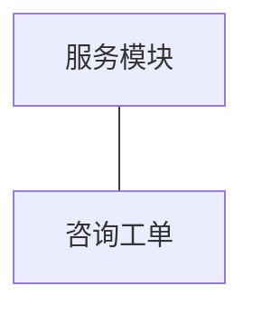
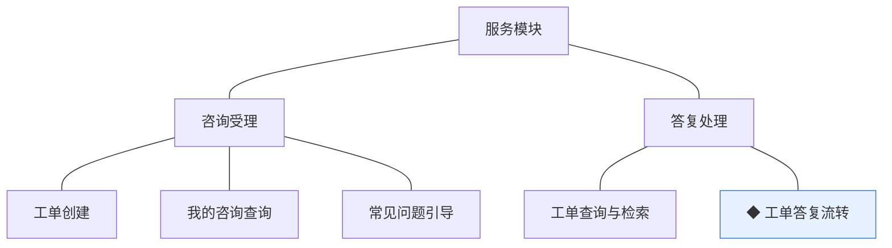
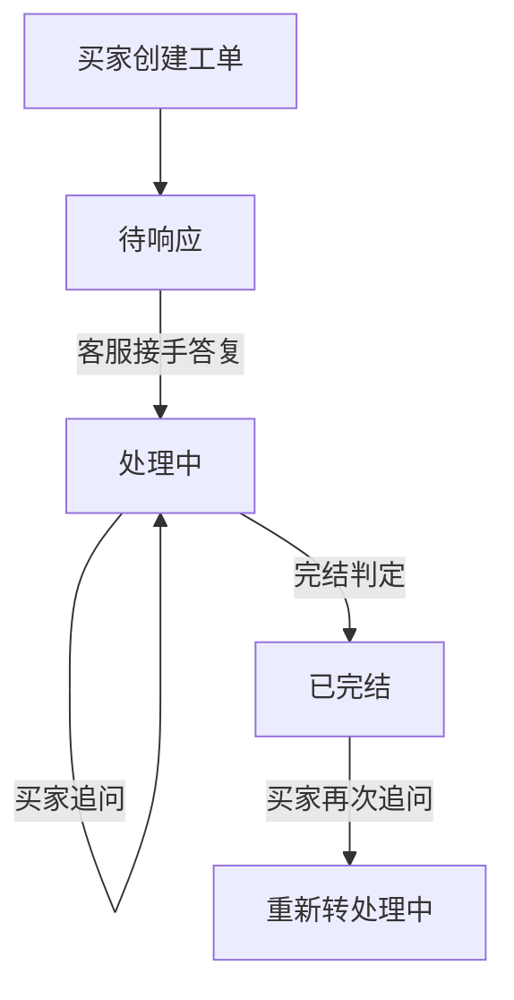
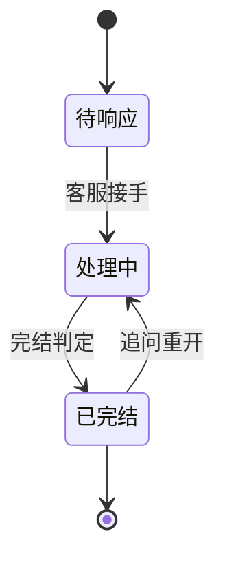

# 模块设计：服务模块

> 对应技术分包"服务模块"，承接《模块总览》2.7 节的同构放大；规则句末括注来源（D＝PRD 决策、K＝技术决策、规范＝开发规范、建议＝本轮建议）。上游为模拟案例材料，本文档为模拟案例评审稿。

## 1. 职责与边界

**管**：买家咨询的受理与答复——咨询工单全生命周期（创建、响应、追问重开、完结）。

**不管**：退货退款申请与审核（交易模块退货单）；帮助内容（内容模块）；顾客身份（顾客模块）。

**边界**：凡"一问一答的咨询受理"归本模块；涉及钱与货的售后走交易模块。

## 2. 对象

### 2.1 对象结构

### 2.2 对象说明

- **咨询工单**：定位——买家咨询记录与客服协作载体。关键组成——工单号（对外单号）、发起顾客、咨询内容与往来答复、可选关联订单号、状态、完结时间。关系与约束——关联订单为可选标识引用；完结后留档不删（规范）。

### 2.3 共享对象

本模块无被他方使用的持有对象，本节省略。

## 3. 功能

### 3.1 功能结构

### 3.2 咨询受理

| 功能 | 使用方 | 说明 |
|---|---|---|
| 工单创建 | 买家（商城端） | 就商品或订单发起咨询，可附订单号；生成工单号（规范：单号组件） |
| 我的咨询查询 | 买家（商城端） | 个人中心查看本人工单与答复 |

### 3.3 答复处理

| 功能 | 使用方 | 说明 |
|---|---|---|
| 工单查询与检索 | 客服人员（管理端） | 按状态/顾客/关联单号检索 |

### 3.4 自助分流

| 功能 | 使用方 | 说明 |
|---|---|---|
| 常见问题引导 | 买家（商城端） | 咨询入口先呈现帮助中心高频问题，买家未解决再建工单（建议） |

分流机制：帮助文章由内容模块维护，本模块只按分类取高频问题做入口引导，不复制内容（共享契约为只读查询）。

### 3.5 ◆ 工单答复流转

说明：客服答复与买家追问驱动的状态流转，含完结判定与重开分支。

规则：
1. 完结判定：客服答复且买家无追问后完结（口径归小版本 PRD，此处只定机制，建议）。
2. 已完结工单被追问时重开，不另起新工单（同一事实一个载体，D6 推论）。
3. 答复与状态变更留痕（规范）。

## 4. 状态

**咨询工单**（状态机与术语表一致）：

| 流转 | 触发条件 | 伴随动作与约束 |
|---|---|---|
| 待响应→处理中 | 客服接手答复 | 答复对买家可见 |
| 处理中→已完结 | 完结判定 | 留档可查 |
| 已完结→处理中 | 买家追问 | 原工单重开 |

## 5. 对外契约

| 操作 | 语义 | 调用方 | 关键约束 |
|---|---|---|---|
| 工单查询 | 个人中心咨询入口 | 顾客侧聚合→本模块 | 仅本人工单 |
| 订单信息查询 | 关联订单上下文 | 本模块→交易模块 | 只读 |
| 顾客身份校验 | 创建与追问校验 | 本模块→顾客模块 | 只读 |
| 高频问题查询 | 咨询入口分流引导 | 本模块→内容模块 | 只读已发布文章 |

## 6. 待议与版本级事项

- **本轮建议**：完结后追问重开原工单，不另起新单。
- **待业务确认**：完结判定的具体口径（答复后多久无追问自动完结）。
- **留版本级**：咨询入口的位置（商品页/订单页/帮助中心）、答复时效要求。
- **明确不做**：即时聊天式会话、机器人自动答复。
- **关联评审**：若引入退款进度查询入口，与交易模块退货单状态联动呈现。
