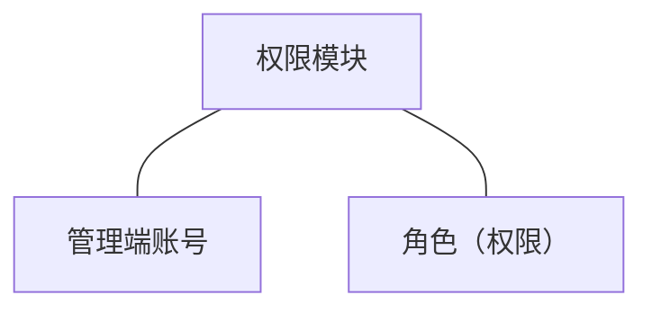
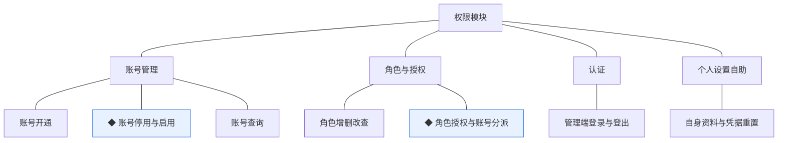
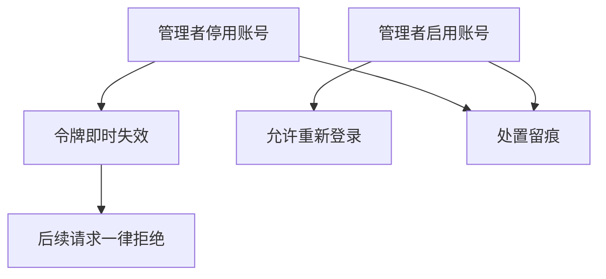
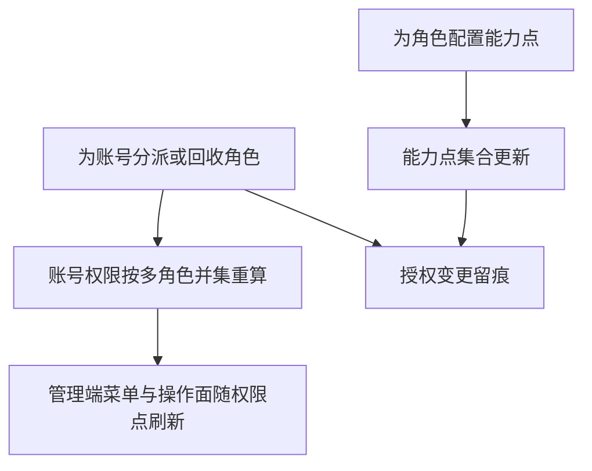
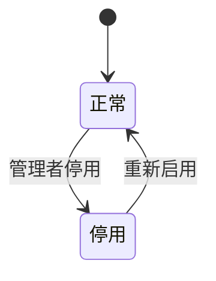

# 模块设计：权限模块

> 对应技术分包"权限模块"，承接《模块总览》2.1 节的同构放大；规则句末括注来源（D＝PRD 决策、K＝技术决策、规范＝开发规范、建议＝本轮建议）。上游为模拟案例材料，本文档为模拟案例评审稿。

## 1. 职责与边界

**管**：管理端账号全生命周期（开通、停用、启用）、角色与能力点维护、账号—角色授权、管理端登录与身份上下文；内部人员自助管理面（个人设置与账号权限）的功能承载。

**不管**：顾客身份（顾客模块）；商城端任何鉴权（顾客令牌走顾客模块+公共基座）；业务数据的行级授权口径（各业务模块以角色能力点判断）。

**边界**：凡"管理端谁能进、进来能看能做什么"归本模块。

## 2. 对象

### 2.1 对象结构

### 2.2 对象说明

- **管理端账号**：定位——内部人员的登录身份。关键组成——账号名、显示名、登录凭据、状态、所持角色集。关系与约束——与顾客账号分库分体系（D3）；凭据重置可自助（个人设置）。
- **角色（权限）**：定位——管理端权限载体。关键组成——角色名、能力点集合、说明。关系与约束——能力点与前端权限点字符串同名同源（规范）；账号可持多角色，权限取并集（D4）。

### 2.3 共享对象

本模块持有的对象无被他方以共享方式使用者（各业务模块消费的是"身份上下文＋能力点"契约，不持有本模块对象），本节省略。

## 3. 功能

### 3.1 功能结构

### 3.2 账号管理

| 功能 | 使用方 | 说明 |
|---|---|---|
| 账号开通 | 管理者（管理端） | 开户并指定初始角色；凭据首次登录强制重置（建议） |
| 账号查询 | 管理者（管理端） | 按账号名/角色/状态检索 |

### 3.3 角色与授权

| 功能 | 使用方 | 说明 |
|---|---|---|
| 角色增删改查 | 管理者（管理端） | 维护角色与能力点集合；被账号引用的角色不可删 |

### 3.4 认证

| 功能 | 使用方 | 说明 |
|---|---|---|
| 管理端登录与登出 | 全体内部角色（管理端） | 签发管理端受众令牌（D3、K4） |

### 3.5 个人设置自助（认领：内部人员的自助管理面）

| 功能 | 使用方 | 说明 |
|---|---|---|
| 自身资料与凭据重置 | 全体内部角色（管理端） | 显示名/凭据自助维护；不涉角色变更 |

### 3.6 ◆ 账号停用与启用

说明：管理者停用账号即时阻断登录与操作；启用恢复。

规则：
1. 停用后已签发令牌即时失效，以状态校验兜底（规范：身份上下文）。
2. 停用不删除账号与操作留痕（规范：留痕不删）。

### 3.7 ◆ 角色授权与账号分派

说明：管理者为角色配置能力点、为账号分派角色；变更即时影响可见面。

规则：
1. 权限取多角色并集（D4）。
2. 能力点字符串前后端同源（规范）；前端不自行判断角色（规范）。
3. 授权变更留痕（规范）。

## 4. 状态

**管理端账号**（状态机与术语表一致；无终态）：

| 流转 | 触发条件 | 伴随动作与约束 |
|---|---|---|
| 正常→停用 | 管理者处置 | 令牌失效、请求拒绝 |
| 停用→正常 | 管理者启用 | 允许登录，角色保持 |

角色（权限）无生命周期状态（模板对象，删除受引用约束）。

## 5. 对外契约

| 操作 | 语义 | 调用方 | 关键约束 |
|---|---|---|---|
| 身份上下文 | 解析令牌并注入身份与能力点 | 公共基座→本模块 | 管理端受众令牌（D3） |
| 能力点校验 | 业务入口的权限判定 | 各业务模块 | 以能力点为单位，不判断具体人员 |
| 操作留痕 | 记录操作者与动作 | 公共基座→本模块 | 与业务同事务（规范） |

## 6. 待议与版本级事项

- **本轮建议**：首次登录强制重置凭据；停用即时失效。
- **待业务确认**：角色预设清单（运营/履约/客服/管理者四个初始角色的能力点划分）。
- **留版本级**：登录失败锁定策略、密码强度规则。
- **明确不做**：细到数据行/单据级的授权（只做能力点级，D4）。
- **关联评审**：业务模块新增能力点时同步登记角色授权范围。
