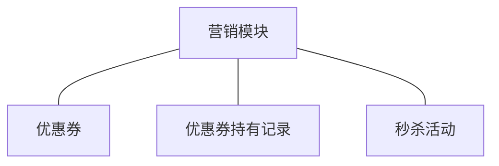
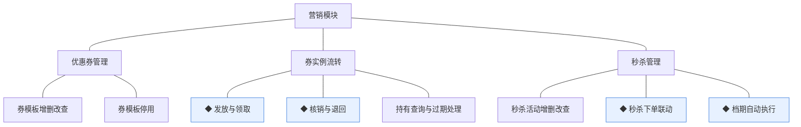
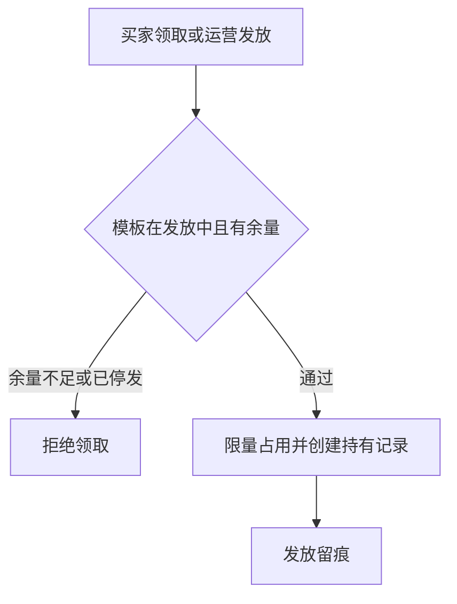
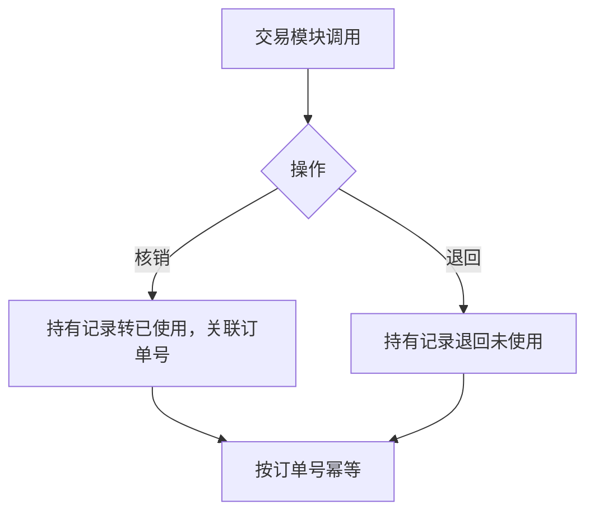
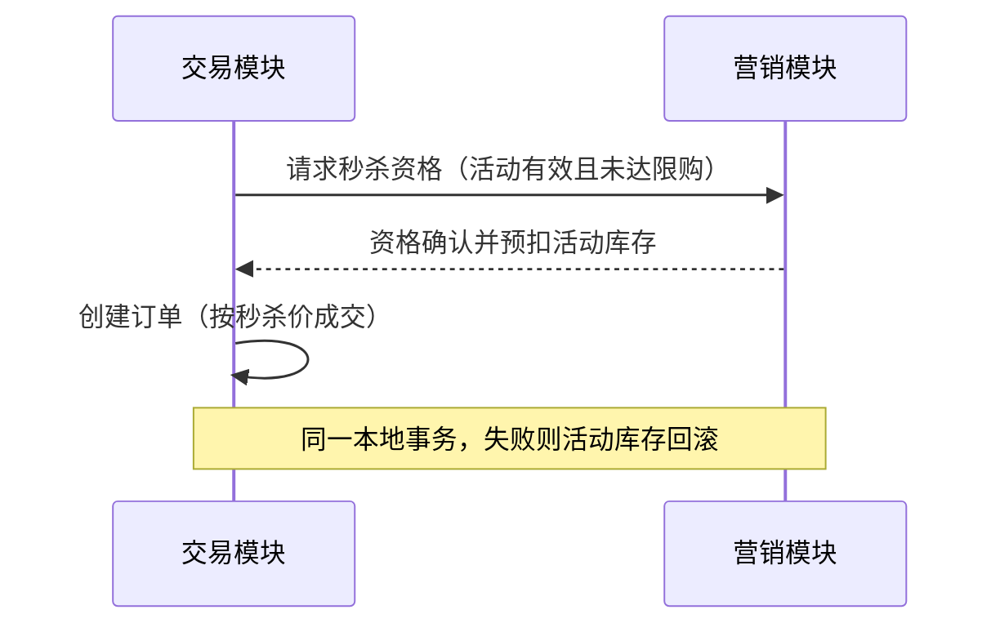
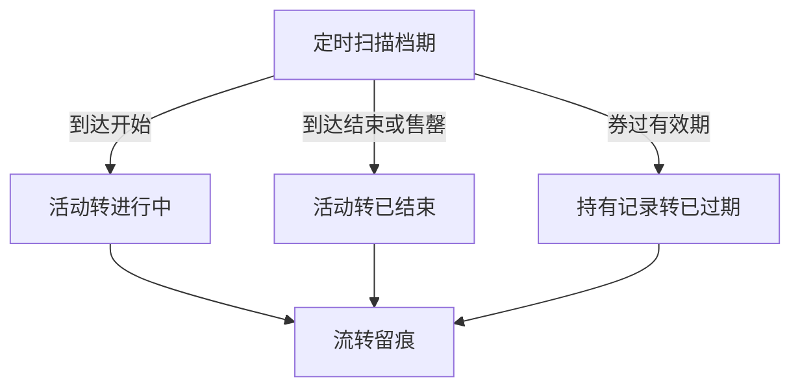
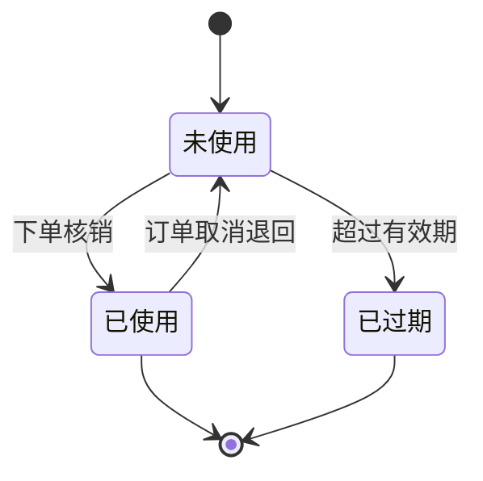

# 模块设计：营销模块

> 对应技术分包"营销模块"，承接《模块总览》2.5 节的同构放大；规则句末括注来源（D＝PRD 决策、K＝技术决策、规范＝开发规范、建议＝本轮建议）。上游为模拟案例材料，本文档为模拟案例评审稿。

## 1. 职责与边界

**管**：优惠券模板与持有记录的全生命周期、券的发放/领取/核销/退回、秒杀活动的配置与档期执行、活动库存的独立台账。

**不管**：商品档案与基准库存（商品模块）；订单金额计算与用券抵扣的落账（交易模块，本模块只提供核销/退回契约）；内容位推荐配置（内容模块）。

**边界**：凡"促销工具的定义与执行"归本模块；促销参与哪笔交易由交易决定。

## 2. 对象

### 2.1 对象结构

### 2.2 对象说明

- **优惠券**：定位——券模板，定义优惠的适用条件与发放量。关键组成——券名、面额（分）、使用门槛、有效期规则、发放量。关系与约束——模板与实例分离；停用模板不影响已发实例按规则过期（建议）。
- **优惠券持有记录**：定位——买家名下的券实例。关键组成——持有人、所属模板、状态、核销关联单号。关系与约束——每顾客对同模板唯一持有（防重，规范）；核销与退回由交易模块触发。
- **秒杀活动**：定位——限时限量特价活动。关键组成——活动商品引用（SKU）、秒杀价（分）、活动库存、限购数、起止时间。关系与约束——活动库存独立于商品库存台账；引用商品须处于已上架状态（总览协作约束）。

### 2.3 共享对象

本模块持有的对象无被他方以共享方式使用者（券核销/退回是协作契约而非对象共享），本节省略。

## 3. 功能

### 3.1 功能结构

### 3.2 优惠券管理

| 功能 | 使用方 | 说明 |
|---|---|---|
| 券模板增删改查 | 运营人员（管理端） | 定义面额/门槛/有效期/发放量；已被持有的模板不可删，只可停用 |
| 券模板停用 | 运营人员（管理端） | 停止新发放；已发实例按原规则走完（建议） |
| 持有查询与过期处理 | 买家（商城端）、运营人员（管理端） | 买家在个人中心查看持券；过期由档期机制自动流转 |

### 3.3 秒杀管理

| 功能 | 使用方 | 说明 |
|---|---|---|
| 秒杀活动增删改查 | 运营人员（管理端） | 配置活动商品、秒杀价、活动库存、限购与档期 |

### 3.4 ◆ 发放与领取

说明：运营批量发放或买家主动领取，从模板限量中占用名额并生成持有记录；一人一模板防重。

规则：
1. 同顾客对同模板唯一持有，靠唯一索引防重（规范）。
2. 限量占用以条件更新保护并发，不超发（K5 推论）。
3. 发放动作留痕（规范）。

### 3.5 ◆ 核销与退回

说明：交易模块在下单（用券）与取消（释放）时调用；核销把持有记录绑定订单，退回解除占用。

规则：
1. 核销/退回以关联订单号幂等，重复调用不产生二次变更（规范）。
2. 仅"未使用"可核销、仅"已使用（该单）"可退回，状态前置条件保护（规范）。
3. 有效期已过的券不可核销（时间规则在核销时点校验，建议）。

### 3.6 ◆ 秒杀下单联动

说明：买家对秒杀活动商品下单，活动库存扣减与订单创建同事务，售罄即止。

规则：
1. 活动库存独立扣减，不动商品基准库存台账（锁定/扣减仍按商品库存契约执行，建议）。
2. 限购以"顾客＋活动"维度计数，防重（规范）。
3. 活动不在进行中（未开始/已结束）则资格失败（档期判据）。

### 3.7 ◆ 档期自动执行

说明：按起止时间自动推进活动与券有效期状态，到期自动结束/过期。

规则：
1. 任务可重入幂等，状态前置条件保护（规范）。
2. 时间判据以服务器时区为准（规范：东八区）。

## 4. 状态

**优惠券持有记录**（状态机与术语表一致）：

| 流转 | 触发条件 | 伴随动作与约束 |
|---|---|---|
| 未使用→已使用 | 交易下单核销 | 关联订单号，幂等 |
| 未使用→已过期 | 档期任务 | 不可再核销 |
| 已使用→未使用 | 订单取消退回 | 仅原订单号可退 |

**秒杀活动**：待开始 `PENDING` → 进行中 `ACTIVE` → 已结束 `ENDED`（到达结束时间或售罄）。终态：`ENDED`。

优惠券模板无生命周期状态（以"停用"标记表达，属管理标记而非状态机，建议）。

## 5. 对外契约

| 操作 | 语义 | 调用方 | 关键约束 |
|---|---|---|---|
| 核销 | 为订单占用券 | 交易模块→本模块 | 订单号幂等、同事务 |
| 退回 | 取消订单释放券 | 交易模块→本模块 | 状态前置条件 |
| 秒杀资格与预扣 | 秒杀下单联动 | 交易模块→本模块 | 与订单创建同事务 |
| 商品可售查询 | 活动商品有效性 | 本模块→商品模块 | 只读 |
| 会员维度券查询 | 个人中心持券展示 | 顾客侧聚合→本模块 | 只读 |

## 6. 待议与版本级事项

- **本轮建议**：模板停用不影响已发实例；秒杀活动库存独立台账；秒杀仍按商品库存契约执行基准锁定扣减。
- **待业务确认**：券是否限定商品范围；秒杀是否需要排队/限流策略。
- **留版本级**：每人限领张数、活动限购具体数值、过期提醒。
- **明确不做**：积分、拼团、满赠等其他促销载体（PRD 范围外的促销形态）。
- **关联评审**：若引入新促销载体，交易模块抵扣机制联动评审（04C-交易.md 待议）。
