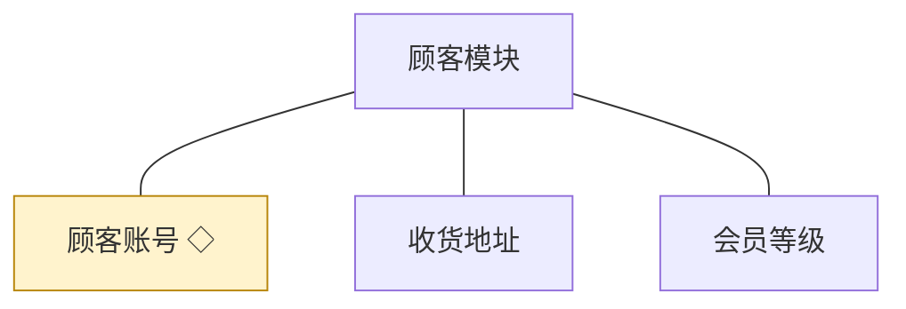
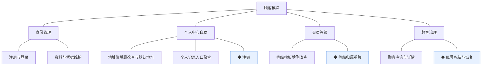
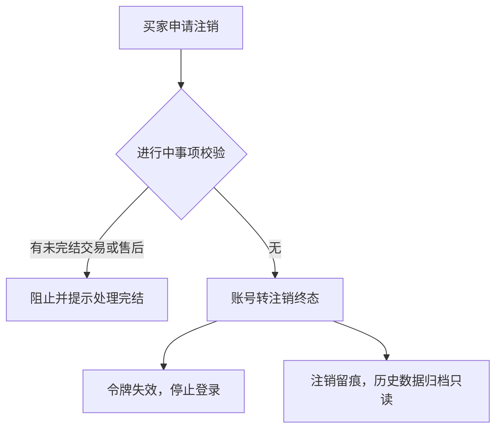
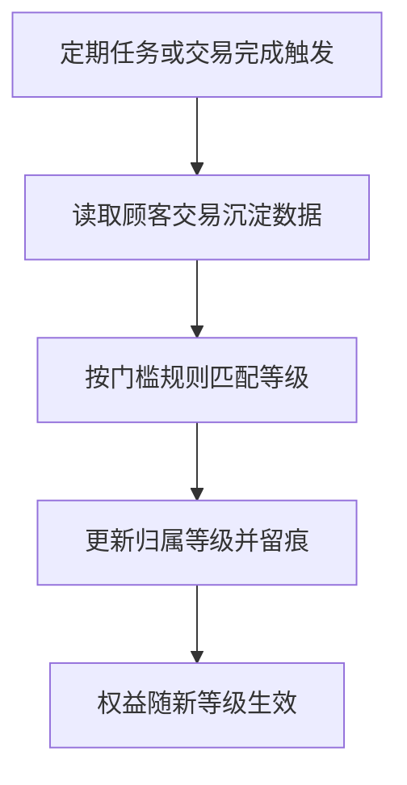
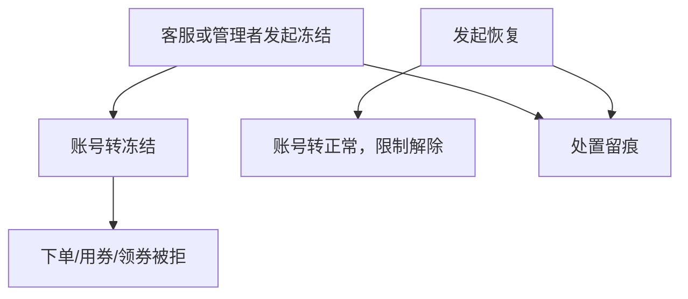
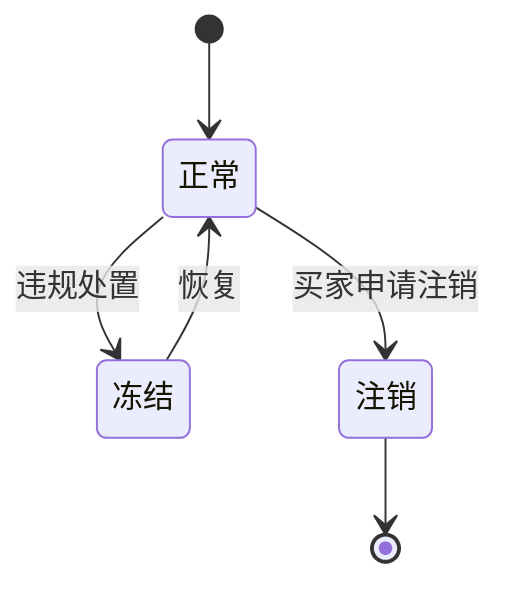

# 模块设计：顾客模块

> 对应技术分包"顾客模块"，承接《模块总览》2.2 节的同构放大；规则句末括注来源（D＝PRD 决策、K＝技术决策、规范＝开发规范、建议＝本轮建议）。上游为模拟案例材料，本文档为模拟案例评审稿。

## 1. 职责与边界

**管**：顾客账号全生命周期（注册、资料、凭据、冻结、注销）、收货地址簿自助维护（买家个人中心的附属对象）、会员等级模板与归属；买家自助管理面（个人中心）中身份与个人信息部分的功能承载。

**不管**：订单与售后记录的持有（交易模块，个人中心仅提供查询入口）；持券记录（营销模块，同样经入口呈现）；咨询（服务模块）；帮助内容（内容模块）。

**边界**：凡"买家身份与个人信息"归本模块；个人中心是跨模块的自助入口聚合，身份类功能落本模块。

## 2. 对象

### 2.1 对象结构

### 2.2 对象说明

- **顾客账号**：定位——买家在商城端的身份与资料载体。关键组成——手机号、昵称/资料、登录凭据、状态、归属等级。关系与约束——与管理端账号完全隔离（D3）；被交易/营销/服务以 customer_id 引用，仅本模块可写。
- **收货地址**：定位——买家维护的常用收货信息集合（个人中心附属对象）。关键组成——联系人、电话、地区与详址、默认标记。关系与约束——属顾客账号（一对多）；下单选用时快照进订单（D6 推论）。
- **会员等级**：定位——顾客分层与权益模板。关键组成——等级名、归属门槛规则、权益说明、排序。关系与约束——每顾客至多归属一个等级；等级删除受"被归属引用不可删"约束。

### 2.3 共享对象

| 对象 | 共享方式 | 使用方 | 使用契约 |
|---|---|---|---|
| 顾客账号 | 标识引用（customer_id）＋统一写入（仅本模块可改） | 交易、营销、服务、报表 | 引用方只读身份与等级信息；状态处置（冻结）仅本模块执行 |

## 3. 功能

### 3.1 功能结构

### 3.2 身份管理

| 功能 | 使用方 | 说明 |
|---|---|---|
| 注册与登录 | 买家（商城端） | 手机号注册；登录签发商城端受众令牌（D3、K4） |
| 资料与凭据维护 | 买家（商城端） | 昵称/头像等资料编辑；登录凭据重置 |

### 3.3 个人中心自助（认领：买家的自助管理面）

| 功能 | 使用方 | 说明 |
|---|---|---|
| 地址簿增删改查与默认地址 | 买家（商城端） | 个人中心附属对象的完整增删改查；默认地址唯一（建议） |
| 个人记录入口聚合 | 买家（商城端） | 订单/售后记录（交易模块）、持券（营销模块）、咨询（服务模块）的查询入口；本模块只聚合不持有 |

### 3.4 会员等级

| 功能 | 使用方 | 说明 |
|---|---|---|
| 等级模板增删改查 | 运营人员（管理端） | 维护等级、门槛与权益说明；被归属引用不可删 |

### 3.5 顾客治理

| 功能 | 使用方 | 说明 |
|---|---|---|
| 顾客查询与详情 | 运营人员（管理端） | 按手机号/昵称/等级检索，查看画像 |

### 3.6 ◆ 注销

说明：买家申请注销，账号进入终态并停止登录；既有交易事实保持不变。

规则：
1. 存在未完结订单或退货单时不可注销（建议）。
2. 注销后身份标识不复用、历史交易事实保留只读（规范：单据不删）。
3. 注销动作留痕（规范）。

### 3.7 ◆ 等级归属重算

说明：按交易沉淀数据与门槛规则重算顾客归属等级；批量任务与触发式重算统一走同一机制。

规则：
1. 归属规则以等级模板为唯一配置来源（不写死规则，建议）。
2. 重算可重入幂等，无变化不产生记录（规范）。
3. 等级变化对商城端权益呈现即时生效（D1 推论）。

### 3.8 ◆ 账号冻结与恢复

说明：违规处置时冻结顾客账号，冻结期间停止交易行为，登录按配置放行或拒绝。

规则：
1. 冻结不改变既有交易事实，只限制新交易行为（建议）。
2. 处置与恢复必须留痕（规范）。

## 4. 状态

**顾客账号**（状态机与术语表一致）：

| 流转 | 触发条件 | 伴随动作与约束 |
|---|---|---|
| 正常→冻结 | 经营侧处置 | 新交易行为被拒 |
| 冻结→正常 | 经营侧恢复 | 限制解除 |
| 正常→注销 | 买家申请（无未完结事项） | 终态，身份不复用 |

收货地址、会员等级无状态：地址是随维护增删的记录（默认标记为属性非状态）；等级模板为静态配置（归属关系在顾客侧表达）。

## 5. 对外契约

| 操作 | 语义 | 调用方 | 关键约束 |
|---|---|---|---|
| 身份校验 | 登录与身份上下文供令牌签发 | 公共基座→本模块 | 商城端受众（D3） |
| 顾客状态查询 | 冻结/注销拦截交易行为 | 交易、营销模块 | 只读 |
| 等级信息查询 | 权益呈现与统计 | 营销、报表模块 | 只读 |
| 地址快照读取 | 下单收货快照 | 交易模块 | 选用时点快照（D6） |

## 6. 待议与版本级事项

- **本轮建议**：默认地址唯一；注销前须无未完结交易/售后；冻结只限新交易。
- **待业务确认**：等级门槛用交易额还是次数；注销冷静期。
- **留版本级**：注册验证码渠道与频控、资料字段范围、等级权益的具体兑现方式。
- **明确不做**：第三方登录/社交账号绑定、多设备登录管控。
- **关联评审**：若等级权益涉及优惠券自动发放，与营销模块联动评审。
