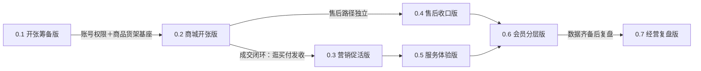
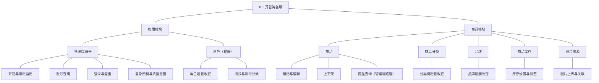
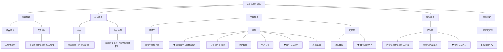
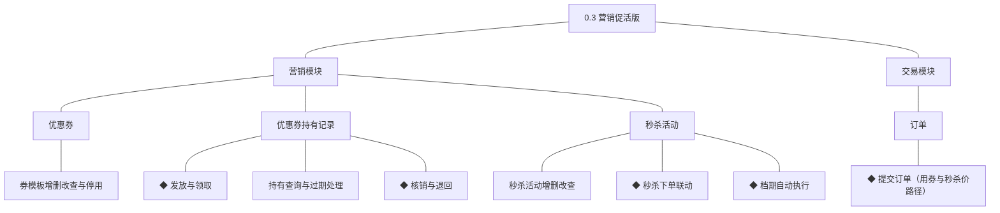
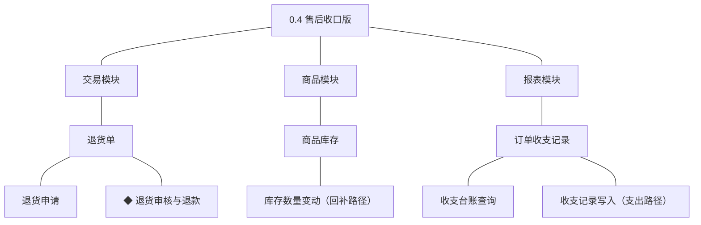
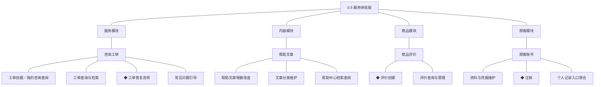
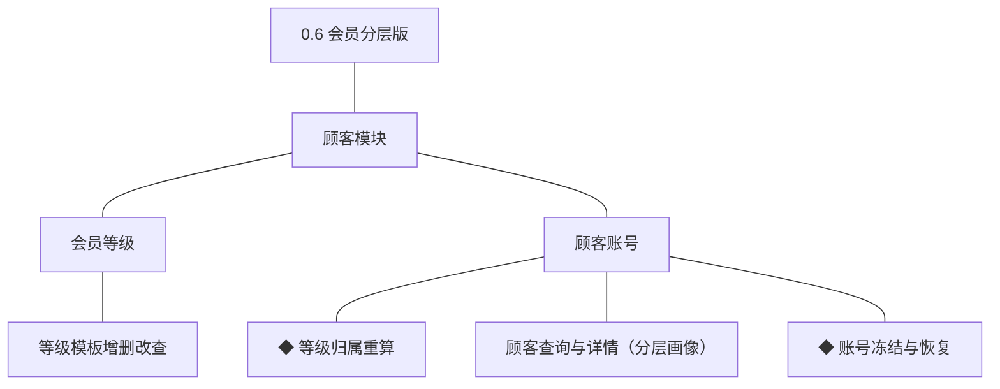
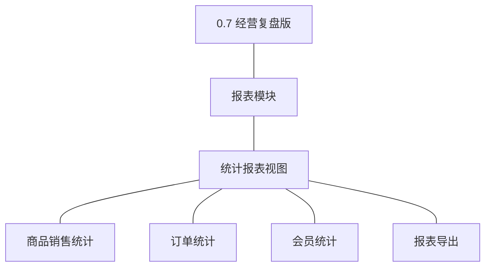

# 产品路线图（项目）：好物商城

> 定位：好物商城的开发步骤说明书＋大版本母版（路线图一个条目＝后续一个大版本文档的立项依据）；活文档，每版本结束后复盘修订。承接项目 PRD、技术文档与模块设计，只拆不增；规则与判断句末括注来源（D／K／模块名／本轮拍板）。上游为模拟案例材料，模拟性质予以保留。

## 1. 拆分思路

一条主线：先内部筹备（账号权限＋商品货架一体就绪），再最小开张（成交闭环上线真实做生意），随后按"促活→售后→服务体验→会员→复盘"逐主题长出闭环外圈。拆分纪律（本轮拍板）：

- **MVP 先行**：内部准备收敛为一个前置版本 0.1（账号权限＋商品＋库存一体交付）；0.2 开张版只放成交闭环必要功能，注销、记录入口、咨询等非成交必需能力归后续主题版本。
- **目的与归属**：功能唯一归属其主题被点亮的版本；基座模块完整功能组随基座版本（账号停用不后移）；自助管理面按归属完整交付——内部个人设置随 0.1、地址簿随 0.2、其余个人中心能力随 0.5。
- **每步一个主题／依赖定序**：按闭环或能力主题纵向拆；商品先于交易、交易先于售后、营销介于其间、报表殿后。
- **步幅均衡**：共 7 版；0.2 为最大单步，因成交闭环（逛—买—付—发—收）不可再拆且缺一不可开张。
- **风险前置**：顾客身份方式、支付渠道、域名备案于 0.1 立项时一并定案并启动长周期外部流程（短信服务随定案同步启动），0.2 收口。
- 画法拍板：订单项为纯明细行对象，切片图中并入订单表达，不单独入图。

## 2. 版本序列

### 2.1 0.1 开张筹备版（内部基座）

**功能清单**（承接各模块详细设计 04C，只列本版交付，按模块分列）

**权限模块**

| 功能 | 使用方 | 说明 |
|---|---|---|
| 账号开通／账号查询 | 管理者（管理端） | 开户并指定初始角色（D3） |
| ◆ 账号停用与启用 | 管理者（管理端） | 停用即时失效（04C-权限 3.6） |
| ◆ 角色授权与账号分派 | 管理者（管理端） | 多角色并集、前后端能力点同源（D4） |
| 管理端登录与登出／自身资料与凭据重置 | 全体内部角色（管理端） | 管理端受众令牌（K4）；个人设置自助面随基座一体交付 |

**商品模块**

| 功能 | 使用方 | 说明 |
|---|---|---|
| 商品建档与编辑／上下架 | 运营人员（管理端） | ◆上下架含完备性校验（04C-商品 3.7） |
| 商品查询 | 运营人员（管理端） | 本版交付管理端档案检索路径 |
| 分类树增删改查／品牌增删改查 | 运营人员（管理端） | 被引用不可删 |
| 库存设置与调整 | 运营人员（管理端） | 初始量与人工修正留痕 |
| 图片上传与关联 | 运营人员（管理端） | 经图片资源统一关联（规范） |

**核心流程说明**

- **角色授权**：开通账号 → 配置角色能力点 → 分派账号 → 管理端菜单随权限点刷新（04C-权限 3.7）。
- **账号停用与启用**：停用 → 令牌即时失效 → 启用恢复登录（04C-权限 3.6）。
- **商品上架**：建档挂分类品牌 → 定义规格与库存 → 完备性校验 → 上架可售（04C-商品 3.7）。

- 目标：内部完成开张准备——账号权限可管、商品货架可上，运营与管理者在管理端完成全部准备工作。
- 沿用：无（首版）。
- 不做：任何商城端界面；交易、营销、售后、服务、报表全部对象与功能。
- 依赖：无前置版本。外部依赖与待定决策（本版立项时一并定案，唯一时点）：顾客身份方式（拟定为手机号验证码，连带短信服务于本版启动）；支付渠道选定（连带商户开户于本版启动）；域名注册与备案于本版启动。
- 完成标志：以真实运营身份走通"开通账号→授权→建档→上架商品"全流程，管理端各角色只见授权菜单。
- 验证假设：内部准备能力足以支撑开张（判定：运营不依赖开发人员即可独立完成商品上架）。

### 2.2 0.2 商城开张版（MVP）

**功能清单**（承接各模块详细设计 04C，只列本版交付，按模块分列）

**顾客模块**

| 功能 | 使用方 | 说明 |
|---|---|---|
| 注册与登录／地址簿增删改查与默认地址 | 买家（商城端） | 手机号验证码（0.1 定案）；地址簿为下单依赖随闭环交付 |

**商品模块**

| 功能 | 使用方 | 说明 |
|---|---|---|
| 商品查询／◆ 库存数量变动 | 买家、交易模块 | 商城端浏览路径；库存本版交付锁定与扣减路径，回补随 0.4（04C-商品 3.8） |

**交易模块**

| 功能 | 使用方 | 说明 |
|---|---|---|
| 购物车增删改查／◆ 提交订单 | 买家（商城端） | 失效条目标记；本版交付无券路径，用券路径随 0.3（04C-交易 3.6） |
| 订单查询与跟踪／确认收货／取消订单／发货登记 | 买家、订单履约人员 | 管理端订单查询兼本版人工售后核对支撑（本轮拍板） |
| ◆ 订单自动流转 | 系统 | 支付超时取消＋超时自动确认收货（04C-交易 3.9） |
| 发起支付／◆ 支付回调确认 | 买家、支付渠道（协作） | 渠道适配层（K6）、回调幂等（04C-交易 3.7） |

**内容模块**

| 功能 | 使用方 | 说明 |
|---|---|---|
| 内容位增删改查与上下线／商城端内容呈现 | 运营人员、买家 | ◆上下线校验商品可售（04C-内容 3.4） |
| ◆ 档期自动执行 | 系统 | 内容位按投放档期自动上线/下线，失效自动隐藏（04C-内容 3.5） |

**报表模块**

| 功能 | 使用方 | 说明 |
|---|---|---|
| 收支记录写入 | 交易模块（协作） | 收入路径写入；支出路径随 0.4（D8） |

**核心流程说明**

- **提交订单（无券）**：选规格加购 → 校验可售并锁库存 → 写订单与成交快照 → 创建支付单（04C-交易 3.6，同事务）。
- **支付回调确认**：验签防重 → 支付单落账 → 扣库存 → 订单转待发货 → 写收入记录（04C-交易 3.7，同事务）。
- **订单自动流转**：定时扫描 → 待支付超时走取消机制（释放占用）→ 已发货超时自动完成（04C-交易 3.9）。
- **内容位上下线**：运营配置 → 关联商品可售校验 → 上线呈现，下线即时撤出；档期到点自动上下线（04C-内容 3.4、04C-内容 3.5）。

- 目标：商城真实开张——买家从逛到收货全程自助，生意在线上成交。
- 沿用：0.1 的账号权限体系、商品货架与库存台账、图片资源。
- 不做：优惠券与秒杀（0.3）；退货退款（0.4）——**售后真空期过渡**：售后经人工处理，退款走支付渠道商户后台人工操作，管理端订单查询（本版已交付）供人工核对，不引用未交付能力；商品评价、咨询与帮助中心（0.5）——咨询过渡为客服电话/即时通讯人工答疑；会员等级（0.6）；统计报表（0.7）。
- 依赖：0.1（账号权限、商品货架、库存台账）。外部依赖：支付商户开户与域名备案于本版收口（0.1 启动）；物流状态查询渠道于本版立项时定案（K11，承运方查询接口或物流聚合服务）。
- 完成标志：真实买家完成首笔全流程订单（浏览→下单→支付→发货→确认收货），含一笔支付超时自动取消验证。灰度台阶（首次对外发布＋首次收款）：环境联调 → 内部全流程演练 → 小额真实单 → 全量开放。
- 验证假设：买家会自助完成线上下单（判定：灰度期不依赖人工协助的真实订单成交；量化口径如"自助下单占比"未定，列入本版立项依赖）。

### 2.3 0.3 营销促活版

**功能清单**（承接各模块详细设计 04C，只列本版交付，按模块分列）

**营销模块**

| 功能 | 使用方 | 说明 |
|---|---|---|
| 券模板增删改查／券模板停用 | 运营人员（管理端） | 已持有不可删只停用 |
| ◆ 发放与领取／持有查询与过期处理 | 买家、运营人员 | 一人一模板防重；过期自动流转（04C-营销 3.4） |
| ◆ 核销与退回 | 交易模块（协作） | 订单号幂等（04C-营销 3.5） |
| 秒杀活动增删改查 | 运营人员（管理端） | 活动库存独立台账 |
| ◆ 秒杀下单联动／◆ 档期自动执行 | 买家、系统 | 与订单同事务；券过期自动流转（04C-营销 3.6/3.7） |

**交易模块**

| 功能 | 使用方 | 说明 |
|---|---|---|
| ◆ 提交订单（用券与秒杀价路径） | 买家（商城端） | 在 0.2 无券路径上增补用券抵扣与秒杀价成交（04C-交易 3.6） |

**核心流程说明**

- **用券下单**：锁库存 → 核销券（订单号幂等）→ 抵扣金额 → 写订单（04C-交易 3.6、04C-营销 3.5，同事务）。
- **发放与领取**：领取或发放请求 → 模板余量与防重校验 → 限量占用并创建持有记录（04C-营销 3.4）。
- **秒杀下单**：资格校验（档期＋限购）→ 预扣活动库存 → 按秒杀价创建订单（04C-营销 3.6，同事务）。
- **档期执行**：定时扫描 → 活动开始/结束、券过期自动流转（04C-营销 3.7）。

- 目标：开张后的生意有促销抓手——券与秒杀可配置、可参与、可核销。
- 沿用：0.2 的成交闭环、订单与支付能力。
- 不做：会员等级与等级权益（0.6）；售后（0.4，本版并行推进不受阻）；统计（0.7）。
- 依赖：0.2（提交订单无券路径、订单状态机）。待定业务决策（本版立项时定案，唯一时点）：秒杀与优惠券的详细规则（PRD 备忘待议项，含限购口径与核销细则）。
- 完成标志：真实买家用券完成一笔订单并正确核销；一场秒杀活动从配置到售罄/到期自动结束全程无人工干预。
- 验证假设：促销拉动复购（判定：活动期用券/秒杀下单占比对比日常；量化口径未定，列入本版立项依赖）。

### 2.4 0.4 售后收口版

**功能清单**（承接各模块详细设计 04C，只列本版交付，按模块分列）

**交易模块**

| 功能 | 使用方 | 说明 |
|---|---|---|
| 退货申请 | 买家（商城端） | 对已完成订单发起 |
| ◆ 退货审核与退款 | 客服人员（管理端） | 审核留理由、退款、回补、写支出（04C-交易 3.10） |

**商品模块**

| 功能 | 使用方 | 说明 |
|---|---|---|
| ◆ 库存数量变动（回补路径） | 交易模块（协作） | 与退货完结同事务（04C-商品 3.8） |

**报表模块**

| 功能 | 使用方 | 说明 |
|---|---|---|
| 收支记录写入（支出路径）／收支台账查询 | 交易模块、管理者 | 收入+支出齐备，管理者可查台账（D8） |

**核心流程说明**

- **退货退款**：申请生成退货单 → 客服审核（通过/拒绝留理由）→ 寄回确认 → 渠道退款 → 回补库存 → 写支出 → 订单回已完成（04C-交易 3.10，同事务）。
- 状态边界：退货单三终态（退款完成/已拒绝/已取消）；订单经"售后中"回"已完成"。

- 目标：售后有着落——买家可自助申请退货退款，客服在系统内审核完结，财务台账收支两向齐备。
- 沿用：0.2 的订单与支付能力（售后路径仅依赖 0.2，与 0.3 营销无依赖，可并行）。
- 不做：换货补发（暂缓清单）；评价（0.5）；咨询（0.5）。
- 依赖：0.2（订单状态机、支付单、成交快照）。外部依赖：退款走支付渠道商户端接口（渠道 0.1 已定案）。待定业务决策（本版立项时定案，唯一时点）：部分退的金额口径（模块设计待业务确认项）。
- 完成标志：一笔真实退货退款全流程系统内完结（申请→审核→退款到账→库存回补→台账支出记录）。首笔真实退款小额先行（灰度台阶）。
- 验证假设：售后自助化降低人工处理量（判定：人工线下退款操作占比下降；量化口径未定，列入本版立项依赖）。

### 2.5 0.5 服务体验版

**功能清单**（承接各模块详细设计 04C，只列本版交付，按模块分列）

**服务模块**

| 功能 | 使用方 | 说明 |
|---|---|---|
| 工单创建／我的咨询查询／工单查询与检索／常见问题引导 | 买家、客服人员 | 咨询受理补齐（真空期结束），入口自助分流（04C-服务 3.4） |
| ◆ 工单答复流转 | 客服人员（管理端） | 含完结判定与追问重开（04C-服务 3.5） |

**内容模块**

| 功能 | 使用方 | 说明 |
|---|---|---|
| 帮助文章增删改查／文章分类维护／帮助中心检索查阅 | 运营人员、买家 | 帮助中心上线 |

**商品模块**

| 功能 | 使用方 | 说明 |
|---|---|---|
| ◆ 评价创建／评价查询与管理 | 买家、运营人员 | 一次成交一条评价（04C-商品 3.9） |

**顾客模块**

| 功能 | 使用方 | 说明 |
|---|---|---|
| 资料与凭据维护／个人记录入口聚合 | 买家（商城端） | 个人中心其余自助能力归位 |
| ◆ 注销 | 买家（商城端） | 无未完结事项方可注销（04C-顾客 3.6） |

**核心流程说明**

- **评价创建**：订单完成事件 → 成交事实校验 → 创建评价 → 详情页呈现（04C-商品 3.9）。
- **工单流转**：创建 → 客服接手 → 答复 → 完结判定；追问重开原单（04C-服务 3.5）。
- **注销**：申请 → 未完结事项校验 → 终态并停权留痕（04C-顾客 3.6）。

- 目标：购物后体验收口——评价有处写、问题有处问、账号生命周期可自助管理。
- 沿用：0.2 的订单完成事件与成交快照、顾客账号；个人中心持券查看（0.3）一并聚合呈现。
- 不做：评价审核先审后显（暂缓清单）；注销冷静期（暂缓清单）。
- 依赖：0.2（订单、顾客账号、订单完成事件）。与 0.3/0.4 无开发依赖，可并行。
- 完成标志：买家完成一笔订单评价并公开展示；一条咨询从创建到完结全流程系统内处理；买家可自助完成资料修改与注销。
- 验证假设：自助服务分流人工咨询（判定：帮助中心查阅量与工单量之比；量化口径未定，列入本版立项依赖）。

### 2.6 0.6 会员分层版

**功能清单**（承接各模块详细设计 04C，只列本版交付，按模块分列）

**顾客模块**

| 功能 | 使用方 | 说明 |
|---|---|---|
| 等级模板增删改查 | 运营人员（管理端） | 门槛与权益模板化 |
| ◆ 等级归属重算 | 系统、运营人员 | 按交易沉淀重算，幂等（04C-顾客 3.7） |
| 顾客查询与详情（分层画像）／◆ 账号冻结与恢复 | 运营、客服、管理者 | 分层画像与治理收口（04C-顾客 3.8） |

**核心流程说明**

- **等级归属重算**：定期/交易触发 → 按模板门槛匹配 → 更新归属并留痕 → 权益生效（04C-顾客 3.7）。
- **冻结治理**：处置 → 冻结限新交易 → 恢复解除（04C-顾客 3.8）。

- 目标：会员有分层、权益有抓手、账号有治理——交易沉淀转化为经营资产。
- 沿用：0.2 交易数据沉淀（验证与取数）、0.5 的顾客画像基础。
- 不做：权益自动发券（与营销联动，暂缓清单）；等级以外的成长体系。
- 依赖：0.2（订单与交易沉淀数据结构）；0.5（顾客画像页面承载）。待定业务决策（本版立项时定案，唯一时点）：会员等级的具体权益与升降级规则（PRD 备忘待议项，含权益兑现方式）。交易数据积累量属验证条件非开发依赖。
- 完成标志：等级模板配置生效，存量顾客完成一次归属重算，权益在商城端会员中心正确呈现；一笔冻结/恢复处置全程留痕。
- 验证假设：等级权益拉动高价值顾客复购（判定：不同等级顾客复购率对比；量化口径未定，列入本版立项依赖）。

### 2.7 0.7 经营复盘版

**功能清单**（承接各模块详细设计 04C，只列本版交付，按模块分列）

**报表模块**

| 功能 | 使用方 | 说明 |
|---|---|---|
| 商品销售统计／订单统计／会员统计 | 管理者、运营人员 | 完成口径计销售（04C-报表 3.4 规则 5） |
| 报表导出 | 管理者（管理端） | 能力点控制并留痕 |

**核心流程说明**

- **统计取数**：业务表派生查询 → 完成/存量口径过滤 → 报表呈现（04C-报表 3.4，预聚合为实现优化不改口径）。
- **报表导出**：能力点校验 → 生成导出文件 → 导出动作留痕（04C-报表 3.4 规则 8）。

- 目标：经营看得清——商品、订单、会员三类报表支撑复盘决策，报表可导出留痕。
- 沿用：0.2~0.6 全部业务数据与台账（0.4 台账查询、0.1~0.2 权限能力点）。
- 不做：经营预测与自定义多维分析（04C-报表明确不做）。
- 依赖：0.6（会员等级数据结构就绪，使会员统计维度成立）；间接依赖 0.2~0.5 各业务表。数据积累量属验证条件，不阻塞立项。
- 完成标志：管理者在报表页完成一次覆盖商品/订单/会员三类的复盘查看并成功导出一份报表。
- 验证假设：报表进入经营决策回路（判定：版本后首轮选品/活动调整引用了报表数据，定性事件）。

## 3. 节奏与调整

- **复盘机制**：每版发布后对"完成标志＋验证假设"双复盘；验证假设未达预期时修订后续版本主题与暂缓清单，不自动加版。
- **立项门槛三层**：完成标志达成即可立项下一版；灰度冻结的只是全量开放与同一风险面上的对外发布（0.2 首发与收款、0.4 首笔退款），不阻塞后续版本开发；数据积累类验证假设（0.6/0.7）不阻塞立项、只影响复盘修订。
- **上游联动点**：D2 自营边界、D8 财务口径变化影响 0.4/0.7；K6 支付渠道决策变化影响 0.2 收口项；顾客身份方式定案变化影响 0.1 连带短信服务与 0.2 注册路径；模块总览对象或 04C 功能增删时，本图切片图与功能清单同步修订。
- **暂缓清单**：换货补发路径（04C 未纳入，业务确认后并入 0.4 主题或增版）；评价先审后显与注销冷静期（PRD 待业务确认，结论后挂 0.5/0.6）；权益自动发券（0.6 与营销联动评审后定）；多商家入驻、直播与社交裂变、跨境电商与线下门店、结算分账（PRD 明确不做，不排期）。
- **评审遗留**：无（上游 PRD 备忘的待议项均已挂唯一时点或入暂缓清单：项目名称待议不影响排期；履约/客服是否合一为组织问题非系统能力；部分退口径挂 0.4 立项依赖）。
