# PRD（大版本）：0.1 开张筹备版

> 本文是 0.1 开张筹备版的立项说明书：把产品路线图 0.1 条目承接为本版需求——做什么、不做什么、每个功能做到什么程度算完成；承接项目 PRD 与模块设计，机制不重写。上游为模拟案例材料，模拟性质予以保留。

## 1. 版本概述

**承接与目标**：开发主线先内部筹备、再最小开张（路线图 1 节）。本版目标：内部完成开张准备——账号权限可管、商品货架可上，运营与管理者在管理端完成全部准备工作。

**成功标准与量化口径**：完成标志——以真实运营身份走通"开通账号→授权→建档→上架商品"全流程，管理端各角色只见授权菜单。量化口径（从版本事实推导）：本版商品上架仅存在系统内一条路径、无系统外人工上架通道，故判定线为**版本验收期内由运营人员独立完成的上架操作 100% 经系统完成**，低于 100% 即按链路阻断排查；"运营不依赖开发人员"的判定方式为验收演示由运营人员独立操作、开发人员零介入。

**范围一句话**：做——管理端账号权限基座（开通、停用启用、角色授权、登录、个人设置）与商品货架准备（分类、品牌、商品建档与上下架、库存设置、图片上传）；不做——商城端全部界面与功能、交易（购物车／订单／支付）、营销、售后、服务、报表，均随 0.2 及后续版本交付（围栏承接路线图 0.1"不做"行）；本版为首个版本，无已发生业务，不存在能力真空期与过渡安排。

**沿用与前置**：无前置版本交付可沿用。立项定案与启动事项（承接路线图 0.1 依赖行，本版启动、收口在后续版本）：顾客身份方式（拟定为手机号验证码，连带短信服务同步启动）、支付渠道选定（连带商户开户启动）、域名注册与备案启动。

## 2. 主体与角色

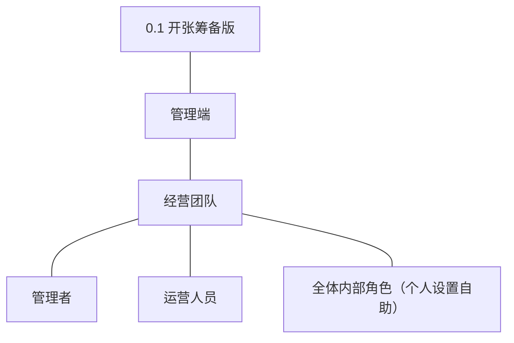

| 主体 | 角色 | 端 | 怎么用系统 |
|---|---|---|---|
| 经营团队 | 管理者 | 管理端 | 开通账号并指定初始角色、维护角色与能力点、停用启用账号、查询账号 |
| 经营团队 | 运营人员 | 管理端 | 维护分类与品牌、商品建档与上下架、设置与调整库存、上传图片 |
| 经营团队 | 全体内部角色（含管理者、运营人员） | 管理端 | 登录登出、自身资料与凭据重置（个人设置自助面） |

**裁剪说明**：买家与商城端不在本版上场（随 0.2 商城开张版）；订单履约人员、客服人员本版无承载功能，不开通账号，角色模板随其功能版本（0.2／0.4）交付时再开通（术语表角色定义不变）。个人设置自助面为全体内部角色的横切能力，随权限基座一体交付（D4、路线图拆分纪律）。

## 3. 核心业务流程

### 3.1 旅程一：开通账号并授权（管理者 → 新内部人员）

同主体跨角色交接：管理者与新内部人员同属经营团队，交接发生在两个角色之间；单端（管理端）单主体，按图型判据用流程图表达（管理者为被开通人准备账号，被开通人首次登录完成接管）。

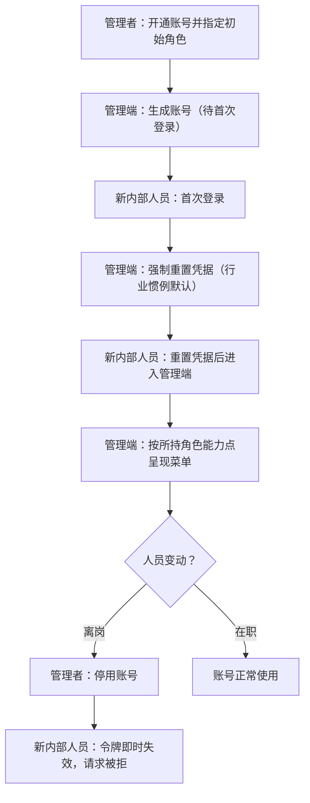

文字：管理者是账号与授权的唯一入口；新内部人员经首次登录强制重置凭据完成接管，此后按角色能力点看到且只看到授权范围；人员离岗由管理者停用，停用即时生效并留痕。

操作步骤清单：
1. 管理者登录管理端，进入权限管理。
2. 开通账号：填写账号名与显示名，指定初始角色，保存。
3. （可选）维护角色：新建或调整角色的能力点集合。
4. 将账号凭据交付新内部人员。
5. 新内部人员首次登录，按提示强制重置凭据。
6. 新内部人员进入与角色匹配的管理端界面开展工作。
7. （人员变动时）管理者停用或启用账号，处置留痕。

### 3.2 旅程二：商品建档到上架（运营人员）

单主体关键流程，承载本版主题"商品货架可上"。

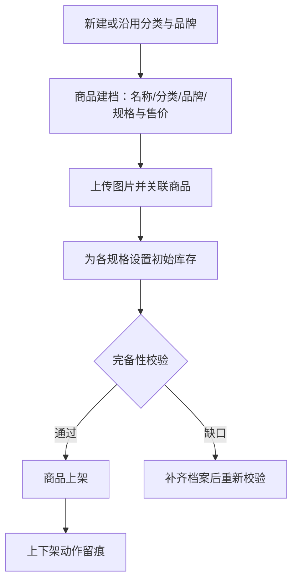

文字：运营人员先备好分类与品牌，再建档商品（含规格与售价、图片、库存），通过完备性校验后上架；上架后商品档案状态为已上架（本版无商城端，可售性以档案状态表达，商城端可见性随 0.2 生效）；下架后可修改再上架。

操作步骤清单：
1. 运营人员登录管理端，维护商品分类树与品牌。
2. 新建商品，填写名称并挂接分类与品牌。
3. 定义规格（SKU）与售价（单位分）。
4. 上传商品图片并关联档案。
5. 为各规格设置初始库存量。
6. 执行上架，完备性校验通过后商品转为已上架。
7. （如需）下架后编辑档案，重新上架。

## 4. 功能需求

功能全景总图：

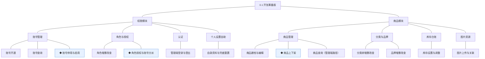

### 4.1 权限模块

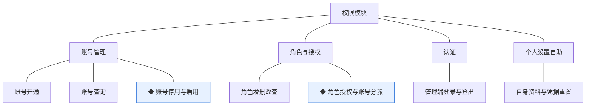

组说明：账号管理与角色与授权是管理者的治理面（D4 按角色授权、最小可见）；认证与个人设置自助是全体内部角色的自助面；能力点与前端权限点同源（开发规范），机制见模块设计（04C-权限）。

| 功能 | 用途 | 验收标准 |
|---|---|---|
| 账号开通 | 为内部人员建立管理端身份 | 管理者开通账号并指定初始角色后，被开通人能以该账号登录管理端，且首次登录被强制重置凭据 |
| 账号查询 | 按条件检索账号 | 管理者按账号名、角色或状态检索，能找到目标账号并查看其角色与状态 |
| ◆ 账号停用与启用 | 处置离岗与恢复账号 | 管理者停用账号后该账号登录与操作即时失效，启用后可重新登录，处置动作留痕可查 |
| 角色增删改查 | 维护角色与能力点集合 | 管理者新建角色并配置能力点后保存成功，被账号引用的角色不可删除 |
| ◆ 角色授权与账号分派 | 决定各岗位可见与可操作范围 | 管理者调整角色能力点或账号所持角色后，对应账号的管理端菜单与操作面即时按新权限刷新，变更留痕 |
| 管理端登录与登出 | 进入与退出管理端 | 内部人员以账号凭据登录后获得与所持角色匹配的管理端界面，登出后访问受保护页面需重新登录 |
| 自身资料与凭据重置 | 个人设置自助面 | 任意内部角色登录后可自行修改显示名与登录凭据，操作不涉及自身角色变更 |

### 4.2 商品模块

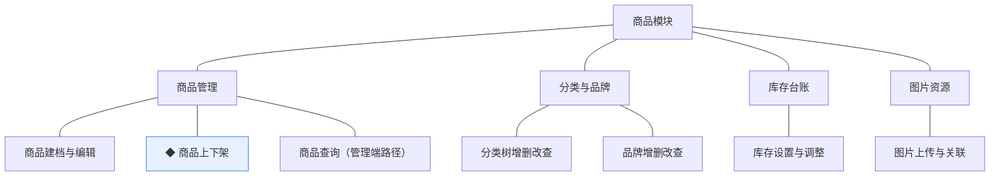

组说明：商品管理承载货架主线；分类与品牌是商品的组织维度；库存台账本版仅开放运营侧设置与调整路径（锁定／扣减随 0.2、回补随 0.4 交付，04C-商品 3.8）；图片资源本版仅商品图关联，内容位配图随 0.2 交付。

| 功能 | 用途 | 验收标准 |
|---|---|---|
| 商品建档与编辑 | 建立与维护商品档案 | 运营人员新建商品并填写名称、分类、品牌、规格（SKU）与售价后保存为草稿，草稿可继续编辑 |
| ◆ 商品上下架 | 控制商品可售状态 | 运营人员对档案完备（名称、分类、至少一个规格与售价、库存台账就绪）的商品执行上架成功；对已上架商品下架后档案转为已下架，上下架动作留痕 |
| 商品查询（管理端路径） | 按档案维度检索商品 | 运营人员按名称、分类、品牌或状态检索，能打开目标商品档案查看与编辑 |
| 分类树增删改查 | 维护商品分类层级 | 运营人员新增、编辑、删除分类并维护父子层级，被商品引用的分类不可删除 |
| 品牌增删改查 | 维护品牌档案 | 运营人员新增、编辑、删除品牌，被商品引用的品牌不可删除 |
| 库存设置与调整 | 设置与人工修正各规格库存 | 运营人员为商品各规格设置初始库存量并做人工修正，每次调整台账留痕可查 |
| 图片上传与关联 | 商品图片上传与挂接 | 运营人员上传图片并关联到商品档案后，商品档案展示已关联图片 |

## 5. 业务对象

对象关系总览：

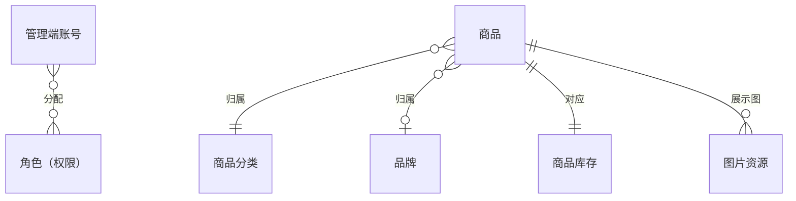

### 5.1 管理端账号

定位：内部人员的登录身份（D3 与顾客账号分体系，顾客账号随 0.2 交付）。

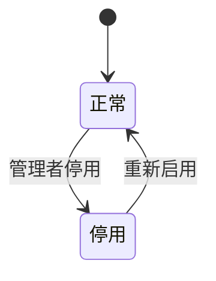

说明：本版即具备正常／停用两态，无终态（04C-权限 4 节）；停用即时失效令牌并拒绝请求，启用恢复登录。版本级默认：首次登录强制重置凭据（行业惯例默认）；登录失败锁定策略与凭据强度规则留小版本定（04C-权限待议）。

### 5.2 角色（权限）

定位：管理端权限载体，能力点集合（D4）。

说明：本版角色随权限基座先行交付，是供后续版本接入的先行基座（非过渡支撑）：0.2 起各业务能力点逐版挂入角色，授权机制本身不被替代。被账号引用的角色不可删除。

### 5.3 商品

定位：以规格（SKU）为最小售卖单元的实物商品档案。

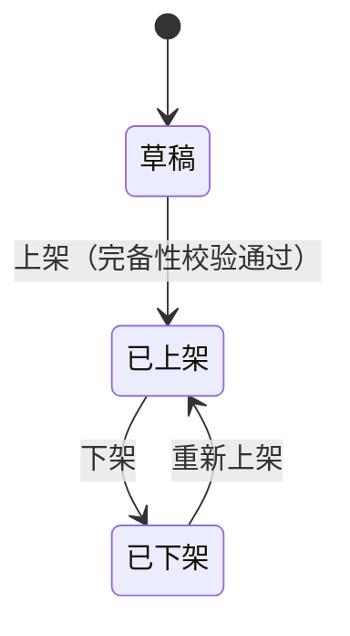

说明：本版三态（草稿／已上架／已下架）全部具备；因本版无商城端，"已上架"在本版仅表达档案可售状态，商城端可见性随 0.2 生效。无终态，可循环上下架（04C-商品 4 节）。

### 5.4 商品分类

定位：管理端与商城端共用的类目树，本版先立管理侧。

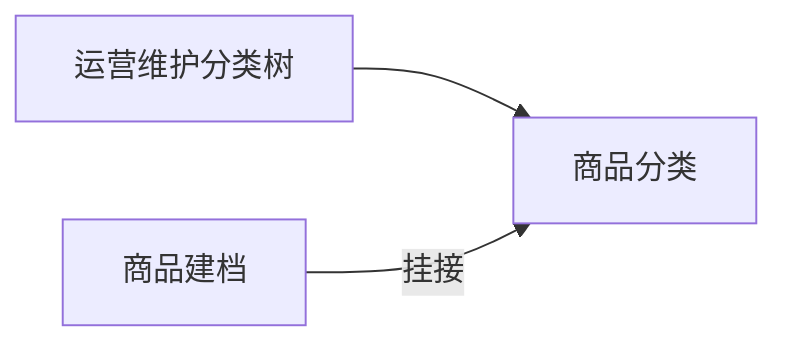

说明：本版仅管理端维护与商品挂接；商城端货架浏览随 0.2 接入（先行基座）。被引用不可删除。

### 5.5 品牌

定位：商品厂牌档案。

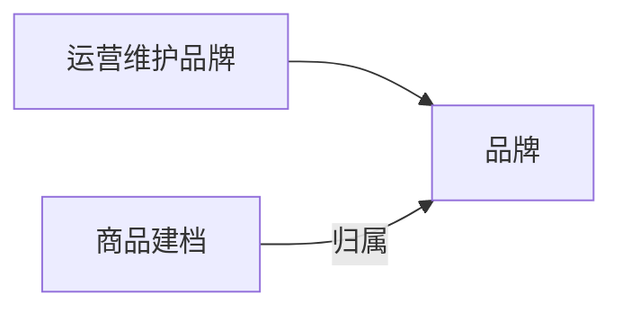

说明：本版管理端维护与商品归属；品牌专区展示随 0.2 商城端接入。被引用不可删除。

### 5.6 商品库存

定位：SKU 级可售数量台账。

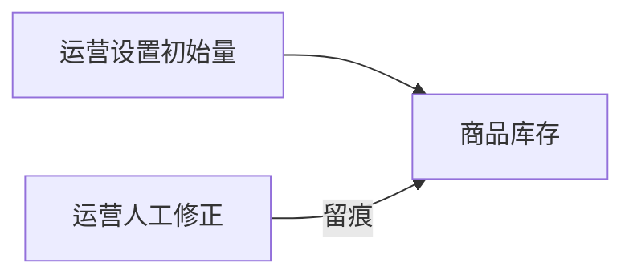

说明：本版仅开放运营侧"设置与调整"两条路径；交易侧锁定／扣减路径随 0.2、回补路径随 0.4 交付（04C-商品 3.8，路线图切片）。台账以变动留痕表达历史，无状态。

### 5.7 图片资源

定位：统一存取的图片对象（技术实体，挂靠商品模块持有）。

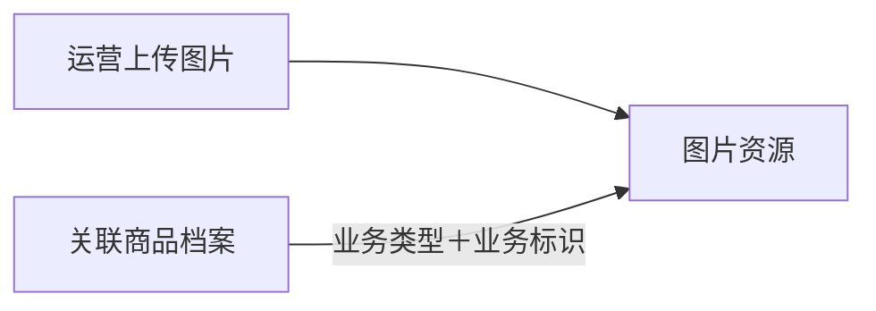

说明：本版仅商品图关联（biz_type＝商品）；内容位配图关联随 0.2 交付。外站图片转存后引用（开发规范）。
