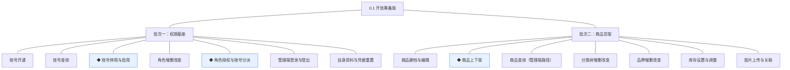
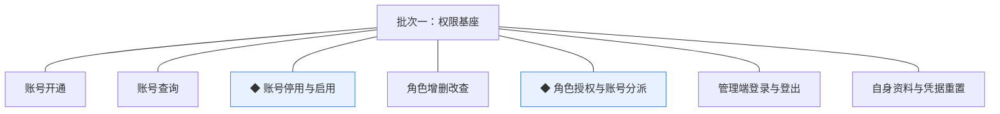
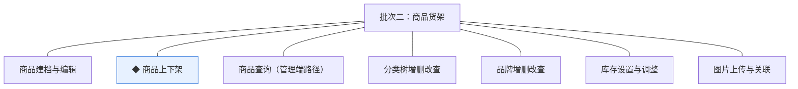

# 开发顺序与需求拆解（大版本）：0.1 开张筹备版

> 本文把 0.1 大版本 PRD 转换为开发批次与功能级需求条目，同时即 0.1 版的完整需求清单（需求池据此直接入池，不另生成版本快照）。上游为模拟案例材料，模拟性质予以保留。

## 1. 拆解说明

- **做什么**：把 PRD 的 14 项功能排成可独立验收的开发批次，每项功能转为一条可直接认领与验收的需求条目（R 编号），用途与验收标准逐字携带 PRD 原文。
- **粒度口径**：条目与 PRD 功能清单一一同构（一条＝一项功能，无归并无新增）；按钮、字段、跳转级的原子拆解归小版本开发，不进本文。
- **与需求池及小版本规划的关系**：本文是需求池的**主入口但不是唯一入口**——会议、沟通、临时反馈产生的需求可直接单条入池，不经本文；小版本规划的输入＝本文开发顺序＋需求池实时状态两者合并，**批次划分是建议而非锁定**，实际认领以需求池为准。

## 2. 开发顺序

**前置版本沿用面**：无（0.1 为首个版本）。

开发批次总图：

批次推进链：

**顺序依据**：权限基座是商品货架的登录与授权前置（商品模块各功能均需管理端账号按角色操作，04C-权限对外契约"身份上下文"被各业务模块消费）；商品货架内部按"分类与品牌 → 建档（含图片、库存）→ 上下架"的使用顺序交付，但同批内可并行开发，不强制单列。**同事务契约**：本版无跨模块同事务写操作（库存的锁定／扣减／回补路径不在本版，04C-商品 3.8），无需跨批同事务边界。

### 2.1 批次一：权限基座

- **目标**：交付管理端账号权限基座与个人设置自助面（D3、D4）。
- **依赖**：无前置批次；外部挂点——无（短信、支付商户开户、域名备案属立项启动事项，不在开发批次内，收口随 0.2）。
- **可验收形态**：管理者演示"开通账号→配置角色→授权→新内部人员首次登录强制重置凭据→只见授权菜单→停用即时失效"全流程；任一角色演示自身资料与凭据重置。

条目与 PRD 4.1 节功能清单一一同构，用途与验收标准逐字引自原文：

| 编号 | 需求名 | 用途 | 验收标准 |
|---|---|---|---|
| R1 | 账号开通 | 为内部人员建立管理端身份 | 管理者开通账号并指定初始角色后，被开通人能以该账号登录管理端，且首次登录被强制重置凭据 |
| R2 | 账号查询 | 按条件检索账号 | 管理者按账号名、角色或状态检索，能找到目标账号并查看其角色与状态 |
| R3 | ◆ 账号停用与启用 | 处置离岗与恢复账号 | 管理者停用账号后该账号登录与操作即时失效，启用后可重新登录，处置动作留痕可查 |
| R4 | 角色增删改查 | 维护角色与能力点集合 | 管理者新建角色并配置能力点后保存成功，被账号引用的角色不可删除 |
| R5 | ◆ 角色授权与账号分派 | 决定各岗位可见与可操作范围 | 管理者调整角色能力点或账号所持角色后，对应账号的管理端菜单与操作面即时按新权限刷新，变更留痕 |
| R6 | 管理端登录与登出 | 进入与退出管理端 | 内部人员以账号凭据登录后获得与所持角色匹配的管理端界面，登出后访问受保护页面需重新登录 |
| R7 | 自身资料与凭据重置 | 个人设置自助面 | 任意内部角色登录后可自行修改显示名与登录凭据，操作不涉及自身角色变更 |

### 2.2 批次二：商品货架

- **目标**：交付商品货架的管理端准备能力，达成版本目标"商品货架可上"。
- **依赖**：批次一（管理端登录与角色授权——商品模块各功能的操作者均经权限基座进入）。
- **可验收形态**：运营人员（由管理者开通并授权）演示"维护分类品牌→商品建档（含图片、规格与售价、初始库存）→完备性校验上架→档案转为已上架"全流程；版本完成标志演示"开通账号→授权→建档→上架商品"全链路。

条目与 PRD 4.2 节功能清单一一同构，用途与验收标准逐字引自原文：

| 编号 | 需求名 | 用途 | 验收标准 |
|---|---|---|---|
| R8 | 商品建档与编辑 | 建立与维护商品档案 | 运营人员新建商品并填写名称、分类、品牌、规格（SKU）与售价后保存为草稿，草稿可继续编辑 |
| R9 | ◆ 商品上下架 | 控制商品可售状态 | 运营人员对档案完备（名称、分类、至少一个规格与售价、库存台账就绪）的商品执行上架成功；对已上架商品下架后档案转为已下架，上下架动作留痕 |
| R10 | 商品查询（管理端路径） | 按档案维度检索商品 | 运营人员按名称、分类、品牌或状态检索，能打开目标商品档案查看与编辑 |
| R11 | 分类树增删改查 | 维护商品分类层级 | 运营人员新增、编辑、删除分类并维护父子层级，被商品引用的分类不可删除 |
| R12 | 品牌增删改查 | 维护品牌档案 | 运营人员新增、编辑、删除品牌，被商品引用的品牌不可删除 |
| R13 | 库存设置与调整 | 设置与人工修正各规格库存 | 运营人员为商品各规格设置初始库存量并做人工修正，每次调整台账留痕可查 |
| R14 | 图片上传与关联 | 商品图片上传与挂接 | 运营人员上传图片并关联到商品档案后，商品档案展示已关联图片 |

**批次判断与边界取舍**：①权限与商品分两批——商品货架全部功能依赖登录与授权，合并则首批无可独立验收的中间形态（判断注记）；②商品货架不按"分类品牌／建档／上下架"再拆批——三段在同批内按使用顺序串接即可整体演示，拆批属过度拆分（判断注记）；③上下架校验依赖库存与图片能力同批成立，不单列联调批（无外部联调点）。

**版本级验收安排**：按 PRD 量化口径验收——验收演示由运营人员独立完成上架操作、开发人员零介入，上架操作 100% 经系统完成；本版为纯内部版本，无对外发布与真实资金流转，不设灰度台阶（灰度属上线安排，不占开发批次）。

## 3. 条目与 PRD 对应核对

- **一一同构声明**：条目数＝PRD 功能数＝14（R1~R14 逐行对应 PRD 4.1／4.2 节功能清单），无归并、无 PRD 外内容、无路径拆分行（"商品查询（管理端路径）"为 PRD 原功能名含路径标注，整条交付）。
- **批次构成**：批次一 7 条（权限模块：账号管理 3、角色与授权 2、认证 1、个人设置自助 1）；批次二 7 条（商品模块：商品管理 3、分类与品牌 2、库存台账 1、图片资源 1）。
- **◆ 清点**：◆ 条目 3 条——R3 账号停用与启用、R5 角色授权与账号分派、R9 商品上下架，与 PRD 功能全景总图 ◆ 标记一致。
- **过渡支撑清点**：无过渡支撑条目（本版无被替代的临时简化能力；权限基座为先行基座，见 PRD 5.2 说明）。

## 4. 与需求池和小版本规划的衔接

- **入池路径**：本表 14 条经需求池批量入池模式登记（编号沿用 R1~R14、批次随本文继承）；池只追加管理属性，内容不改写。
- **多入口口径**：会议、沟通、临时反馈的需求从其他入口直接单条入池（M 编号），与本表条目并存互不覆盖。
- **小版本规划的合并输入**：规划＝本文开发顺序建议＋需求池实时状态；建议按批次一→批次二确认两个小版本（0.1.0 权限基座版认领 R1~R7、0.1.1 商品货架版认领 R8~R14），唯一硬约束是本文声明的依赖与同事务契约不回退（商品货架批不先于权限基座批）。
- **认领与细化原则**：认领后的小版本 PRD 做开发级细化（交互、字段、边界），验收以随行验收标准为锚，不回溯改写本文。
