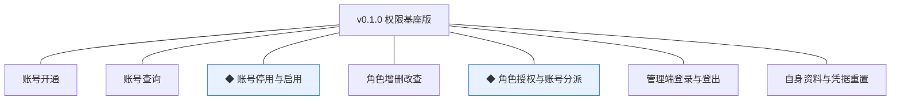
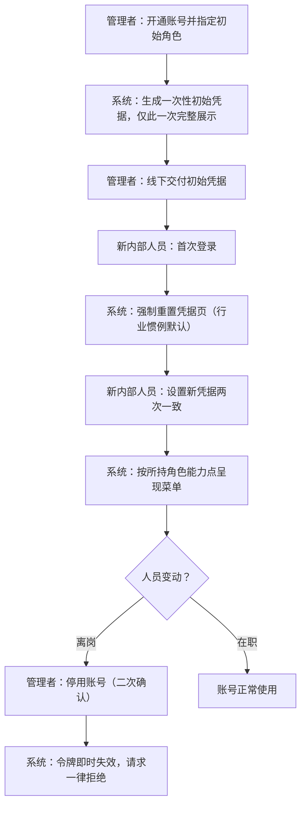
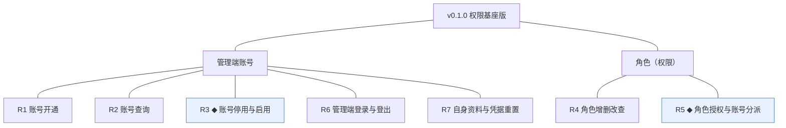
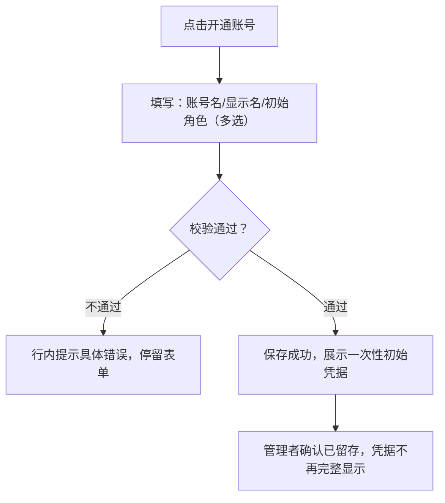
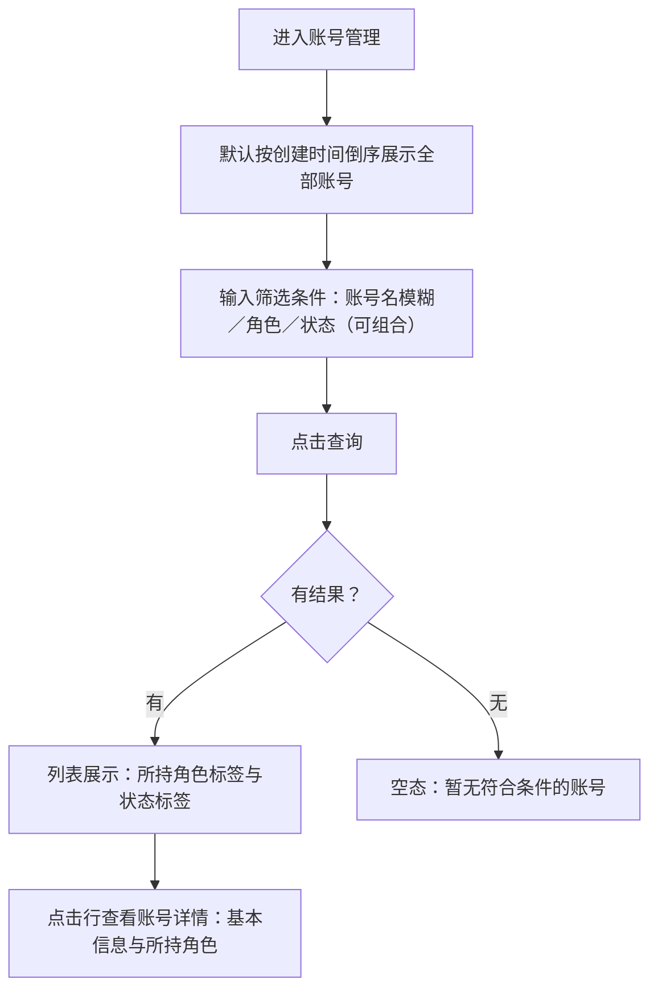
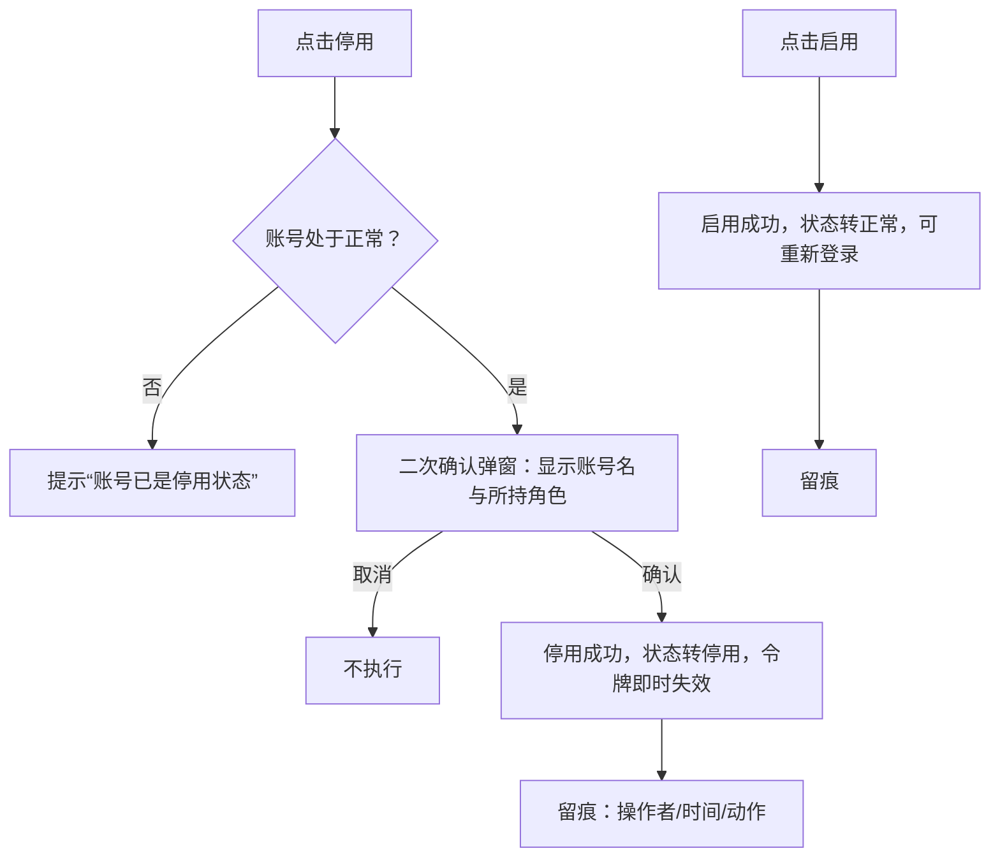
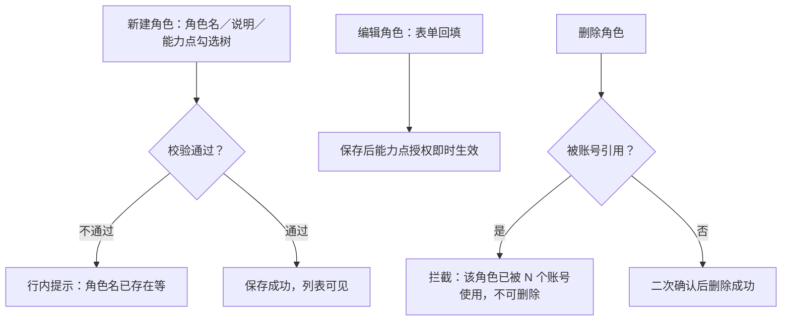
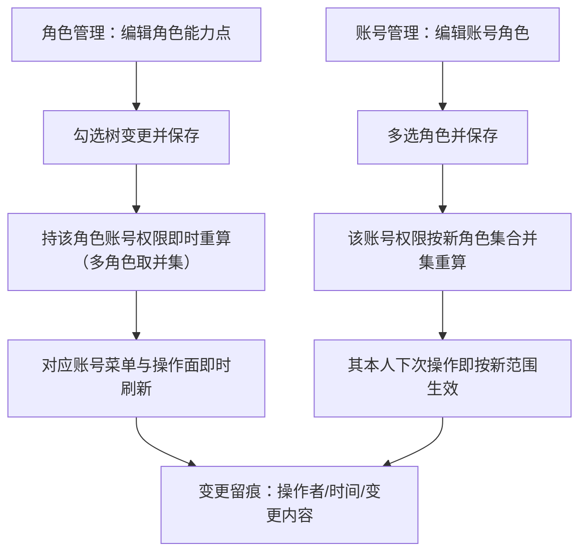
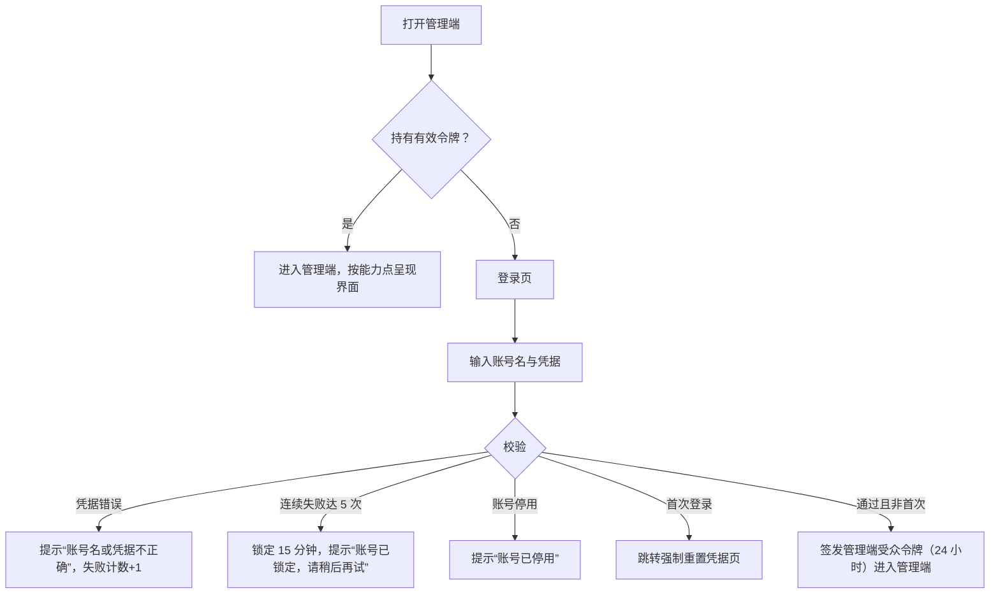
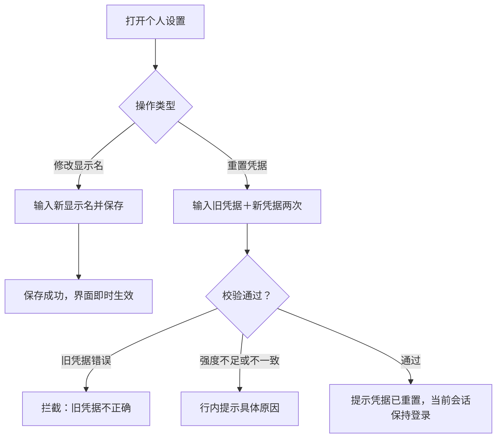

# PRD（小版本）：v0.1.0 权限基座版

> 本文是 v0.1.0 的开发级需求说明书：以认领条目（R1~R7）为范围、大版本 PRD 与 02 拆解为逐字锚，把每条需求细化到开发与测试不再追问的程度。上游为模拟案例材料，模拟性质予以保留。

## 1. 版本概述

**承接与目标**：认领自需求池——0.1 开张筹备版批次一（02 拆解），R1~R7 共 7 条，池内状态已同步为"已认领（v0.1.0）"。本版目标＝交付管理端账号权限基座与个人设置自助面（D3、D4）；本版可验收形态（承接 02 批次一）：管理者演示"开通账号→配置角色→授权→新内部人员首次登录强制重置凭据→只见授权菜单→停用即时失效"全流程，任一角色演示自身资料与凭据重置。

**范围外声明**：商品货架七条（R8~R14）归下一小版本（0.1.1 商品货架版）；商城端、交易、营销、售后、服务、报表归后续版本（0.2 起）；顾客身份方式、支付商户开户、域名备案为 0.1 立项启动事项，不属本版条目。本文对上述范围外内容只作围栏声明，不展开。

**条目内顺序与依赖**（引用上游批内顺序）：R6 登录与 R1 开通先行（认证与身份是其余功能的使用前提）→ R4/R5 角色与授权 → R2 查询、R3 停用启用、R7 个人设置收口；批内可并行开发，不强制串行。

## 2. 需求范围与验收锚

条目总览树（与 02 批次一分支图同名同构）：

认领条目表（需求名／用途／验收标准逐字引自 02 批次一需求表）：

| 编号 | 需求名 | 用途 | 验收标准 |
|---|---|---|---|
| R1 | 账号开通 | 为内部人员建立管理端身份 | 管理者开通账号并指定初始角色后，被开通人能以该账号登录管理端，且首次登录被强制重置凭据 |
| R2 | 账号查询 | 按条件检索账号 | 管理者按账号名、角色或状态检索，能找到目标账号并查看其角色与状态 |
| R3 | ◆ 账号停用与启用 | 处置离岗与恢复账号 | 管理者停用账号后该账号登录与操作即时失效，启用后可重新登录，处置动作留痕可查 |
| R4 | 角色增删改查 | 维护角色与能力点集合 | 管理者新建角色并配置能力点后保存成功，被账号引用的角色不可删除 |
| R5 | ◆ 角色授权与账号分派 | 决定各岗位可见与可操作范围 | 管理者调整角色能力点或账号所持角色后，对应账号的管理端菜单与操作面即时按新权限刷新，变更留痕 |
| R6 | 管理端登录与登出 | 进入与退出管理端 | 内部人员以账号凭据登录后获得与所持角色匹配的管理端界面，登出后访问受保护页面需重新登录 |
| R7 | 自身资料与凭据重置 | 个人设置自助面 | 任意内部角色登录后可自行修改显示名与登录凭据，操作不涉及自身角色变更 |

锚定说明：以上三列为逐字锚，本文第 4 章的细化只加深行为描述、不与锚冲突、不收窄或放宽验收；验收按锚逐条执行（不建独立用例文档）。

## 3. 核心用户旅程

**旅程承接说明**：大版本 PRD 旅程一「开通账号并授权」整条落在本版认领范围内（R1→R5→R6→R7→R3 全链路承接），此处细化到开发级取值与反馈；旅程二「商品建档到上架」不属本版范围（R8~R14 归 0.1.1），不在本版旅程内。

### 3.1 旅程一：开通账号并授权（管理者 → 新内部人员）

同主体跨角色交接（管理者与新内部人员同属经营团队），单端（管理端）单主体，按图型判据用流程图。

文字：管理者是账号与授权的唯一入口；系统生成一次性初始凭据并仅此一次完整展示（本版定），管理者线下交付；新内部人员首次登录被强制重置凭据后接管账号，此后按角色能力点看到且只看到授权范围（能力点与前端权限点同源，开发规范）；人员离岗由管理者停用，二次确认后即时生效并留痕。

操作步骤清单：
1. 管理者登录管理端（R6），进入权限管理。
2. 开通账号（R1）：填写账号名与显示名、勾选初始角色，保存后系统生成一次性初始凭据并完整展示一次。
3. （可选）维护角色（R4）或调整授权（R5）。
4. 管理者将初始凭据线下交付新内部人员。
5. 新内部人员首次登录（R6），被引导至强制重置凭据页，设置新凭据（两次一致、通过强度校验）。
6. 新内部人员进入与所持角色匹配的管理端界面；能力点变化时菜单即时刷新（R5）。
7. 人员变动时管理者停用账号（R3，二次确认），被停用人令牌即时失效；恢复时启用。

## 4. 功能需求

### 4.1 功能总览

对象归组树（版本→对象→条目）：

对象增删改查矩阵：

| 对象 | 增 | 改 | 删 | 查 |
|---|---|---|---|---|
| 管理端账号 | R1 开通 | R7 资料与凭据、R3 状态（停用/启用） | 不做（人员离岗以停用承载；账号与操作留痕不删，规范） | R2 条件检索、R6 凭据校验 |
| 角色（权限） | R4 新建 | R4 编辑、R5 能力点配置 | R4 删除（仅未被账号引用时） | R4 列表与详情 |

（商品域对象——商品、商品分类、品牌、商品库存、图片资源——随 0.1.1 交付，不入本版矩阵。）

主体使用面：

| 主体／角色 | 使用条目 | 说明 |
|---|---|---|
| 管理者 | R1、R2、R3、R4、R5 | 权限管理的唯一操作面 |
| 全体内部角色（管理者、被开通的各角色） | R6、R7 | 认证与个人设置自助面，登录即可用 |

机制条目（无人工触发面）：无——R1~R7 均有人工操作入口；权限校验本身为机制（随 R5 能力点生效，无独立操作面）。

### 4.2 R1 账号开通

**功能说明**：为内部人员建立管理端登录身份并指定初始角色。触发：管理者在权限管理＞账号管理点击"开通账号"。

**交互与流程**：

操作步骤清单：① 进入开通表单；② 填写账号名（4~32 位字母/数字/下划线，全局唯一，本版定）、显示名（2~20 字符）；③ 勾选一个或多个初始角色（至少一个）；④ 保存后系统生成一次性初始凭据（≥8 位含字母与数字，行业惯例默认）并仅此一次完整展示；⑤ 管理者线下交付凭据；确认后凭据在界面不再完整显示。

**字段与校验**：

| 信息项 | 必填 | 校验 | 失败反馈 |
|---|---|---|---|
| 账号名 | 是 | 4~32 位字母/数字/下划线；唯一 | "账号名已存在"／"账号名需为 4~32 位字母、数字或下划线" |
| 显示名 | 是 | 2~20 字符 | "显示名需为 2~20 字符" |
| 初始角色 | 是 | 至少勾选 1 个已有角色 | "请至少选择一个角色" |
| 一次性初始凭据 | 系统生成 | ≥8 位且含字母与数字 | 生成失败提示重试 |

**规则与边界**：
1. 初始角色必须是已存在的角色（R4 产物）；无可用角色时开通入口给出引导"请先创建角色"（本版定）。
2. 一次性初始凭据仅开通成功时完整展示一次，此后任何界面不再明文显示（本版定）。
3. 新账号状态默认"正常"，须完成首次登录强制重置后才可正常使用各功能页（与 R6 联动）。
4. 开通动作留痕（操作者、时间、动作；规范）。

**异常与拦截**：

| 异常场景 | 系统行为 |
|---|---|
| 账号名重复 | 保存拦截，提示"账号名已存在" |
| 所选角色在保存前被删除 | 保存拦截，提示"所选角色已不存在，请重新选择" |
| 未完成首次重置凭据的账号访问功能页 | 拦截并跳转强制重置凭据页 |

### 4.3 R2 账号查询

**功能说明**：按条件检索管理端账号并查看其角色与状态。触发：管理者进入权限管理＞账号管理列表。

**交互与流程**：

列表页默认按创建时间倒序展示全部账号；顶部筛选区（账号名模糊、角色、状态）+分页（默认每页 20 条，本版定）；行内展示账号名、显示名、所持角色、状态、最近登录时间（无则显示—）。

操作步骤清单：① 进入账号管理；② 输入筛选条件（可组合）点击查询；③ 查看列表与状态标签（正常＝成功色、停用＝危险色）；④ 点击行查看账号详情（基本信息与所持角色）。

**字段与校验**：

| 信息项 | 必填 | 校验 | 失败反馈 |
|---|---|---|---|
| 账号名筛选 | 否 | 模糊匹配，≤32 字符 | 超长提示"筛选条件过长" |
| 角色筛选 | 否 | 下拉单选已有角色 | — |
| 状态筛选 | 否 | 正常／停用 | — |

**规则与边界**：
1. 列表不展示凭据任何形式（明文或摘要，规范：敏感字段不出参）。
2. 查询范围＝全部管理端账号（本版无按部门等二次划分，D4 能力点级）。
3. 筛选与分页条件可组合；空结果显示空态文案"暂无符合条件的账号"。

**异常与拦截**：

| 异常场景 | 系统行为 |
|---|---|
| 无任何账号 | 空态："暂无账号，点击开通账号创建第一个账号" |
| 查询无结果 | 空态："暂无符合条件的账号" |

### 4.4 R3 ◆ 账号停用与启用

**功能说明**：处置人员离岗（停用）与返岗（启用）。触发：管理者在账号列表行操作"停用"/"启用"。

**交互与流程**：

操作步骤清单：① 在列表定位目标账号；② 点击"停用"，二次确认弹窗展示账号名与所持角色；③ 确认后状态转"停用"，该账号在线令牌即时失效、后续请求一律拒绝；④ 需要恢复时点击"启用"，账号转"正常"可重新登录；⑤ 处置动作均留痕。

**字段与校验**：无新增表单信息项（操作型条目）——确认弹窗展示既有字段（账号名、显示名、所持角色、当前状态）。

**规则与边界**：
1. 停用即时生效：已签发令牌即时失效，以服务端状态校验兜底（04C-权限 3.6）。
2. 停用不删除账号、不解除角色绑定、不删除留痕（规范）。
3. 管理者可以停用其他管理者账号，但不能停用自己当前登录的账号（避免失去管理入口，本版定）。
4. 状态取值＝正常 `NORMAL`／停用 `DISABLED`（术语表）。

**异常与拦截**：

| 异常场景 | 系统行为 |
|---|---|
| 停用自己当前登录账号 | 拦截："不能停用当前登录的账号" |
| 被停用账号尝试请求 | 响应统一"账号已停用"，跳转登录页 |
| 重复停用/启用 | 提示当前状态，不重复变更 |

### 4.5 R4 角色增删改查

**功能说明**：维护角色及其能力点集合。触发：管理者进入权限管理＞角色管理。

**交互与流程**：

角色列表（角色名、说明、能力点数量、引用账号数、操作）；新建角色表单＝角色名＋说明＋能力点勾选树（按模块分组的两级树）；编辑同表单回填；删除受引用约束。

操作步骤清单：① 新建：填写角色名（2~20 字符、唯一）与说明（≤100 字符，选填），在能力点树勾选；② 保存成功后列表可见；③ 编辑：修改名称、说明或能力点，保存后授权即时生效（与 R5 联动）；④ 删除：仅未被任何账号引用时可删，二次确认后删除。

**字段与校验**：

| 信息项 | 必填 | 校验 | 失败反馈 |
|---|---|---|---|
| 角色名 | 是 | 2~20 字符；唯一 | "角色名已存在"／"角色名需为 2~20 字符" |
| 说明 | 否 | ≤100 字符 | "说明不超过 100 字符" |
| 能力点 | 是 | 至少勾选 1 个 | "请至少选择一个能力点" |

**规则与边界**：
1. 能力点编码格式＝`<模块>:<对象>:<动作>`（如 `auth:account:create`，本版定，已登记术语表）；前后端同源（开发规范）。
2. 能力点树按模块分组呈现，本版仅权限模块能力点可选；后续版本能力点随其条目逐版挂入（先行基座，供后续版本接入）。
3. 被账号引用的角色不可删除（拦截，验收锚）；删除角色不影响账号与留痕。
4. 角色能力点变更后，持该角色账号的菜单与操作面即时按新权限刷新（04C-权限 3.7）。

**异常与拦截**：

| 异常场景 | 系统行为 |
|---|---|
| 删除被引用角色 | 拦截："该角色已被 N 个账号使用，不可删除" |
| 无任何角色 | 空态："暂无角色，请新建第一个角色"（并引导 R1 开通前置） |

### 4.6 R5 ◆ 角色授权与账号分派

**功能说明**：决定各岗位的可见与可操作范围——配置角色能力点、为账号分派角色。触发：管理者在角色管理配置能力点，或在账号管理编辑某账号的角色。

**交互与流程**：

操作步骤清单：① 路径一（角色侧）：编辑角色的能力点勾选并保存；② 路径二（账号侧）：编辑账号所持角色（多选，可清空重选但至少保留一个）并保存；③ 保存后权限按多角色并集即时重算；④ 受影响账号的菜单与操作面即时刷新；⑤ 变更留痕。

**字段与校验**：

| 信息项 | 必填 | 校验 | 失败反馈 |
|---|---|---|---|
| 角色能力点集合 | 是 | 至少 1 个能力点 | "请至少选择一个能力点" |
| 账号所持角色 | 是 | 至少 1 个已有角色 | "请至少为一个账号保留一个角色" |

**规则与边界**：
1. 账号权限＝所持多角色能力点的并集（D4）。
2. 授权变更即时生效，不需要被影响人重新登录（04C-权限 3.7）。
3. 前端菜单与按钮挂能力点标识，界面不自行判断角色（开发规范）；本文不定义具体菜单树（随各版本功能挂入）。
4. 管理者不能移除自己账号的最后一个含"权限管理"能力点的角色组合（避免自锁，本版定）。

**异常与拦截**：

| 异常场景 | 系统行为 |
|---|---|
| 保存将导致自己失去权限管理能力 | 拦截："该变更将使您失去权限管理能力，请先由其他管理者操作或调整角色配置" |
| 目标角色已被删除 | 拦截："所选角色已不存在，请刷新后重选" |

### 4.7 R6 管理端登录与登出

**功能说明**：内部人员进入与退出管理端。触发：打开管理端地址（未登录跳登录页）；登录后点击"登出"。

**交互与流程**：

操作步骤清单：① 打开管理端，未登录跳登录页；② 输入账号名与凭据提交；③ 校验通过进入管理端（首次登录先完成强制重置）；④ 右上角点击"登出"，令牌作废返回登录页；⑤ 登出后访问受保护页面重新跳登录页。

**字段与校验**：

| 信息项 | 必填 | 校验 | 失败反馈 |
|---|---|---|---|
| 账号名 | 是 | 存在性校验（对外不区分"不存在"与"凭据错误"） | 统一"账号名或凭据不正确" |
| 凭据 | 是 | 与账号匹配 | 同上 |

**规则与边界**：
1. 令牌为管理端受众，与商城端令牌互不通用（D3、K4）；有效期 24 小时（行业惯例默认）。
2. 登录失败锁定：同一账号连续失败 5 次锁定 15 分钟（行业惯例默认，04C-权限待议项本版落地）；锁定期间正确凭据也拒绝。
3. 停用账号登录即拒；登录中的账号被停用后请求即时失效（与 R3 联动）。
4. 登录成功不提示"角色"，界面差异仅由能力点驱动（D4）。

**异常与拦截**：

| 异常场景 | 系统行为 |
|---|---|
| 凭据错误 | 统一提示，不暴露账号存在性 |
| 连续失败达阈值 | 锁定 15 分钟并提示剩余等待 |
| 停用账号登录 | "账号已停用" |
| 令牌过期后操作 | 跳转登录页，提示"登录已过期，请重新登录" |

### 4.8 R7 自身资料与凭据重置

**功能说明**：个人设置自助面——修改本人显示名与登录凭据。触发：任意内部角色登录后进入右上角"个人设置"。

**交互与流程**：

两个独立操作：① 修改显示名：输入新显示名保存，下次进入界面即生效；② 重置凭据：输入旧凭据＋新凭据两次，通过强度校验后重置成功，当前令牌不作废（保持登录）、下次登录用新凭据（本版定）。

操作步骤清单：① 打开个人设置；② 修改显示名（2~20 字符）保存；③ 重置凭据：输入旧凭据、新凭据两次；④ 校验通过提示"凭据已重置"；⑤ 旧凭据错误时拦截。

**字段与校验**：

| 信息项 | 必填 | 校验 | 失败反馈 |
|---|---|---|---|
| 显示名 | 是 | 2~20 字符 | "显示名需为 2~20 字符" |
| 旧凭据 | 是 | 与当前凭据匹配 | "旧凭据不正确" |
| 新凭据 | 是 | ≥8 位且含字母与数字；两次输入一致 | "新凭据需至少 8 位且同时包含字母与数字"／"两次输入不一致" |

**规则与边界**：
1. 本页面不提供角色变更入口（验收锚：操作不涉及自身角色变更）；角色变更只能由管理者经 R5 执行。
2. 凭据重置后留痕（操作者、时间、动作；不留凭据内容，规范）。
3. 显示名修改不影响账号名与登录。

**异常与拦截**：

| 异常场景 | 系统行为 |
|---|---|
| 旧凭据错误 | 拦截："旧凭据不正确" |
| 新凭据与旧凭据相同 | 拦截："新凭据不能与旧凭据相同"（本版定） |

## 5. 业务对象与数据字段

数据主体清单：

| 业务对象 | 落库名 | 定位与关系 |
|---|---|---|
| 管理端账号 | auth_account | 管理端登录身份；与顾客账号完全隔离（D3） |
| 角色（权限） | auth_role ＋ auth_account_role | 权限载体：角色档案与"账号—角色"关联由两张表承载（一对象多表映射） |
| 登录令牌 | 不落库（机制态） | JWT 无状态令牌（K4），签发与校验机制实现归属开发阶段 |
| 能力点 | 随角色存储（机制态） | 以能力点编码集合存于角色（capability_codes），存储形态由开发阶段定，前后端同源（开发规范） |

**管理端账号（auth_account）字段表**：

| 字段 | 必填 | 业务类型 | 落库字段名 | 约束与取值 |
|---|---|---|---|---|
| 主键 | 是 | 标识 | id | 自增整型（编码契约） |
| 账号名 | 是 | 文本 | account_name | 4~32 位字母/数字/下划线，全局唯一（本版定） |
| 显示名 | 是 | 文本 | display_name | 2~20 字符 |
| 登录凭据 | 是 | 密文 | credential | 加密存储、任何界面不出参（规范） |
| 首次登录标记 | 是 | 标志 | must_reset_credential | 开通时置是，完成强制重置后置否（本版定） |
| 状态 | 是 | 枚举 | status | NORMAL／DISABLED（术语表） |
| 创建时间／更新时间／逻辑删除 | 是 | 审计 | created_at／updated_at／deleted | 编码契约 |

**角色（权限）——auth_role 字段表**：

| 字段 | 必填 | 业务类型 | 落库字段名 | 约束与取值 |
|---|---|---|---|---|
| 主键 | 是 | 标识 | id | 自增整型 |
| 角色名 | 是 | 文本 | role_name | 2~20 字符，唯一 |
| 说明 | 否 | 文本 | remark | ≤100 字符 |
| 能力点集合 | 是 | 编码集合 | capability_codes | 能力点编码列表，至少 1 项（机制态：存储形态由开发阶段定） |
| 创建时间／更新时间／逻辑删除 | 是 | 审计 | created_at／updated_at／deleted | 编码契约 |

**角色（权限）——auth_account_role（账号角色关联）字段表**：

| 字段 | 必填 | 业务类型 | 落库字段名 | 约束与取值 |
|---|---|---|---|---|
| 主键 | 是 | 标识 | id | 自增整型 |
| 账号 | 是 | 外键 | account_id | 指向 auth_account.id |
| 角色 | 是 | 外键 | role_id | 指向 auth_role.id；同一账号＋角色唯一（防重索引，规范） |
| 创建时间／更新时间／逻辑删除 | 是 | 审计 | created_at／updated_at／deleted | 编码契约 |

## 6. 待议与建议

**本版采用的推断与默认值汇总**：

| 采用值 | 来源状态 | 位置 |
|---|---|---|
| 一次性初始凭据仅完整展示一次、系统生成 | 本版定 | R1 |
| 账号名 4~32 位字母/数字/下划线、唯一 | 本版定 | R1／R2 |
| 显示名 2~20 字符；角色名 2~20 字符唯一；角色说明 ≤100 字符 | 本版定 | R1／R4 |
| 凭据强度 ≥8 位且含字母与数字 | 行业惯例默认（04C-权限待议项本版落地） | R1／R6／R7 |
| 登录失败连续 5 次锁定 15 分钟 | 行业惯例默认（04C-权限待议项本版落地） | R6 |
| 管理端令牌有效期 24 小时 | 行业惯例默认（K4 落地） | R6 |
| 不能停用/自锁自己当前的权限管理能力 | 本版定（防自锁） | R3／R5 |
| 列表默认每页 20 条 | 本版定 | R2 |
| 凭据重置后当前令牌不作废 | 本版定 | R7 |

**待确认内容与影响**：令牌有效期与锁定阈值上线后按实际安全事件复盘调整（影响 R6）；能力点树后续版本随功能挂入时的分组口径（影响 R4/R5 界面呈现，不影响机制）。

**建议回池的新想法与术语表待登记行**：无新想法回池。术语表待登记（本版新定名，已随认领回报合入术语表）：能力点编码格式 `<模块>:<对象>:<动作>`；新落库字段名 account_name／display_name／credential／must_reset_credential／role_name／remark／capability_codes／account_id／role_id。
