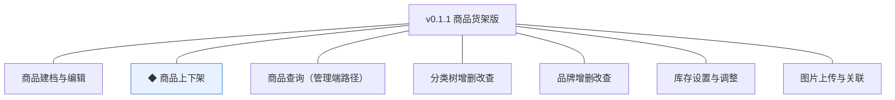
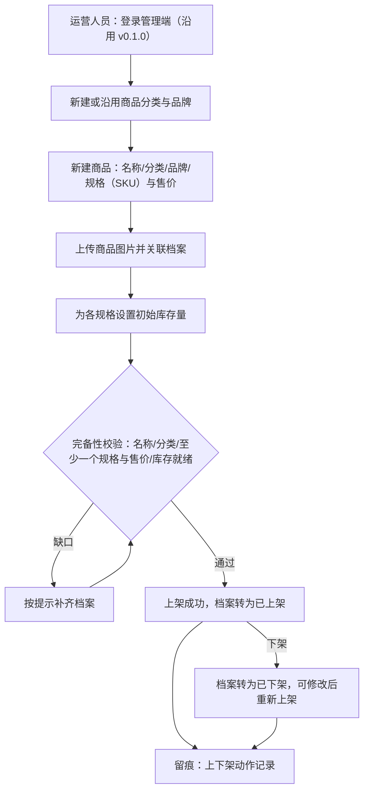
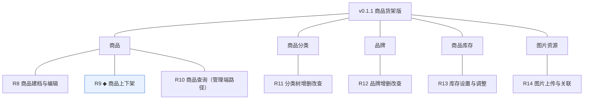
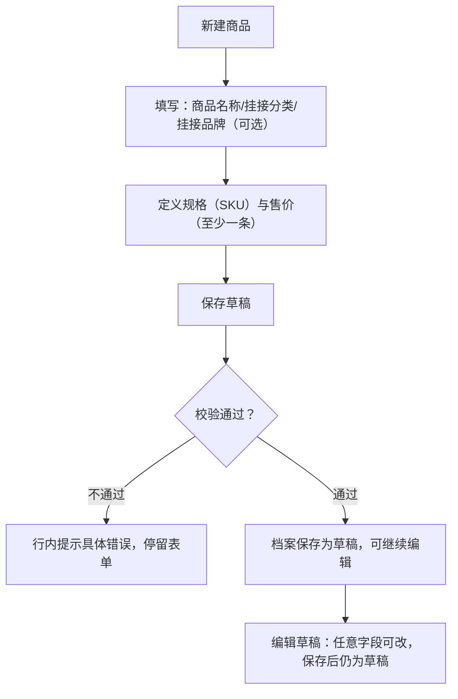
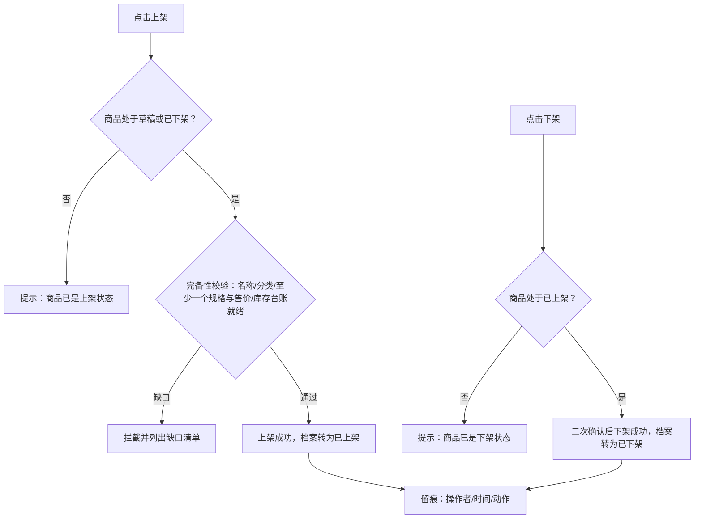
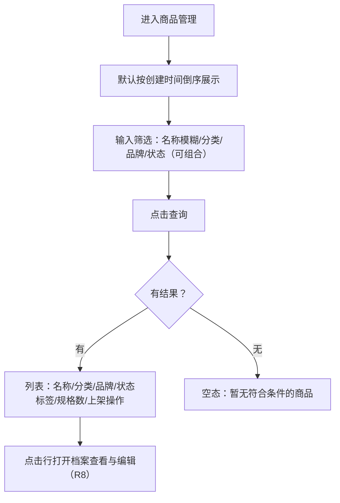
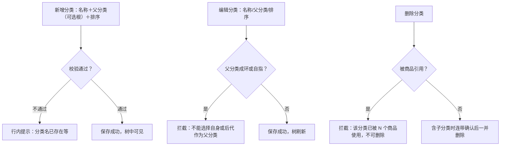
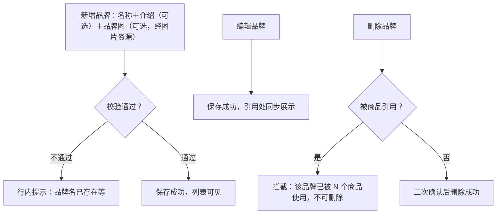
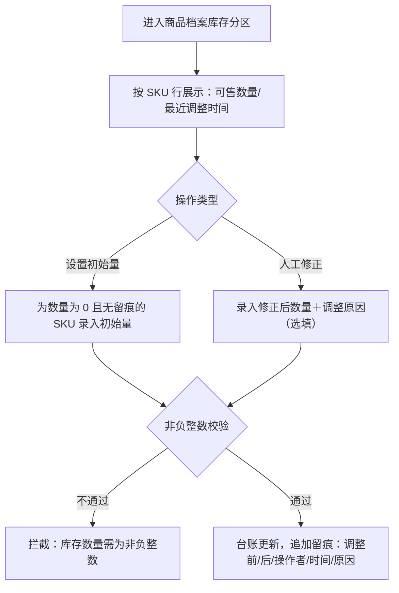
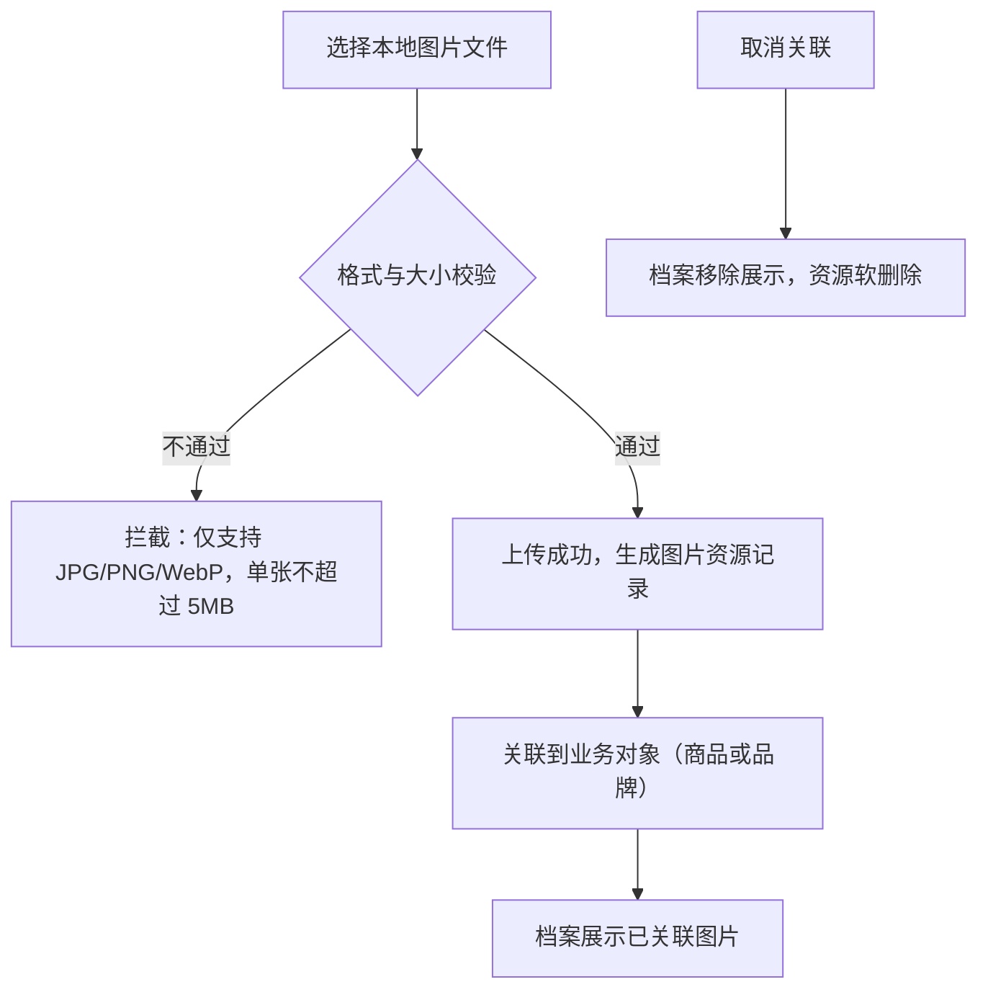

# PRD（小版本）：v0.1.1 商品货架版

> 本文是 v0.1.1 的开发级需求说明书：以认领条目（R8~R14）为范围、大版本 PRD 与 02 拆解为逐字锚，把每条需求细化到开发与测试不再追问的程度。上游为模拟案例材料，模拟性质予以保留。

## 1. 版本概述

**承接与目标**：认领自需求池——0.1 开张筹备版批次二（02 拆解），R8~R14 共 7 条，池内状态已同步为"已认领（v0.1.1）"。本版目标＝交付商品货架的管理端准备能力（0.1 大版本目标"商品货架可上"的完成段）；本版可验收形态（承接 02 批次二）：运营人员（由管理者开通并授权）演示"维护分类品牌→商品建档（含图片、规格与售价、初始库存）→完备性校验上架→档案转为已上架"全流程，并连同 v0.1.0 完成 0.1 版本完成标志"开通账号→授权→建档→上架商品"全链路演示。

**范围外声明**：商城端全部界面与商品浏览路径（商品查询的商城端路径随 0.2）；库存台账的锁定／扣减路径（随 0.2）与回补路径（随 0.4）——本版仅运营侧设置与调整；商品评价（随 0.5）；内容位对商品的引用（随 0.2）；权限域无新增条目（沿用 v0.1.0 交付的登录与授权基座，商品能力点挂入既有角色机制）。本文对范围外内容只作围栏声明。

**条目内顺序与依赖**（引用上游批内顺序）：R11 分类与 R12 品牌先行（建档的挂接对象）→ R8 建档（含 R14 图片、R13 库存同批配套）→ R9 上下架收口（完备性校验依赖档案、库存就绪）；R10 查询贯穿可用。批内可并行开发。

## 2. 需求范围与验收锚

条目总览树（与 02 批次二分支图同名同构）：

认领条目表（需求名／用途／验收标准逐字引自 02 批次二需求表）：

| 编号 | 需求名 | 用途 | 验收标准 |
|---|---|---|---|
| R8 | 商品建档与编辑 | 建立与维护商品档案 | 运营人员新建商品并填写名称、分类、品牌、规格（SKU）与售价后保存为草稿，草稿可继续编辑 |
| R9 | ◆ 商品上下架 | 控制商品可售状态 | 运营人员对档案完备（名称、分类、至少一个规格与售价、库存台账就绪）的商品执行上架成功；对已上架商品下架后档案转为已下架，上下架动作留痕 |
| R10 | 商品查询（管理端路径） | 按档案维度检索商品 | 运营人员按名称、分类、品牌或状态检索，能打开目标商品档案查看与编辑 |
| R11 | 分类树增删改查 | 维护商品分类层级 | 运营人员新增、编辑、删除分类并维护父子层级，被商品引用的分类不可删除 |
| R12 | 品牌增删改查 | 维护品牌档案 | 运营人员新增、编辑、删除品牌，被商品引用的品牌不可删除 |
| R13 | 库存设置与调整 | 设置与人工修正各规格库存 | 运营人员为商品各规格设置初始库存量并做人工修正，每次调整台账留痕可查 |
| R14 | 图片上传与关联 | 商品图片上传与挂接 | 运营人员上传图片并关联到商品档案后，商品档案展示已关联图片 |

锚定说明：以上三列为逐字锚，本文第 4 章的细化只加深行为描述、不与锚冲突、不收窄或放宽验收；验收按锚逐条执行。

## 3. 核心用户旅程

**旅程承接说明**：大版本 PRD 旅程二「商品建档到上架」整条落在本版认领范围内（分类品牌→建档→图片→库存→校验→上架，R11/R12→R8→R14→R13→R9 全链路承接），此处细化到开发级取值与反馈；旅程一（账号开通与授权）已随 v0.1.0 交付，本版旅程的进入前提＝运营人员持已授权账号登录（沿用，不重复成旅程）。

### 3.1 旅程一：商品建档到上架（运营人员）

单主体（运营人员）单端（管理端）操作流，按图型判据用流程图。

文字：运营人员先备好分类与品牌，再建档商品并配套图片与库存，通过完备性校验后上架；本版无商城端，"已上架"仅表达档案可售状态（商城端可见性随 0.2 生效，PRD 大版本 5.3）；下架后可修改档案再上架，上下架动作均留痕。

操作步骤清单：
1. 运营人员以已授权账号登录管理端（v0.1.0 基座），进入商品管理。
2. 维护分类树（R11）与品牌（R12），或确认已有可挂接对象。
3. 新建商品（R8）：填写名称、挂接分类与品牌、定义规格（SKU）与售价（单位分）。
4. 上传商品图片并关联档案（R14）。
5. 为各规格设置初始库存量（R13）。
6. 执行上架（R9）：完备性校验通过后档案转为"已上架"；有缺口则按提示补齐后重试。
7. 如需下市：下架后档案转"已下架"，编辑后可重新上架；动作留痕可查。

## 4. 功能需求

### 4.1 功能总览

对象归组树（版本→对象→条目）：

对象增删改查矩阵：

| 对象 | 增 | 改 | 删 | 查 |
|---|---|---|---|---|
| 商品 | R8 新建（草稿） | R8 编辑、R9 状态（上架/下架） | 不做（下市以"已下架"承载；档案与留痕不删，规范） | R10 条件检索、档案详情 |
| 商品分类 | R11 新增 | R11 编辑（含层级与排序） | R11 删除（仅未被商品引用时） | R11 分类树 |
| 品牌 | R12 新增 | R12 编辑 | R12 删除（仅未被商品引用时） | R12 列表 |
| 商品库存 | R13 设置初始量 | R13 人工修正 | 不做（数量台账只追加留痕，不删除） | 随 R10 商品档案查看 |
| 图片资源 | R14 上传 | R14 关联变更 | R14 取消关联（软删除语义） | 随档案展示 |

（商品评价对象随 0.5 交付，不入本版矩阵；商品库存的交易侧变动路径为协作机制，随 0.2/0.4。）

主体使用面：

| 主体／角色 | 使用条目 | 说明 |
|---|---|---|
| 运营人员 | R8~R14 全部 | 商品货架的唯一操作面（能力点挂入角色：prod 域能力点，编码见规则） |
| 管理者 | 沿用 v0.1.0 | 为运营人员授权 prod 域能力点（沿用 R5 机制，无新增界面） |

机制条目（无人工触发面）：商品库存的锁定／扣减／回补路径为交易模块协作机制（随 0.2／0.4 交付），本版无界面；图片资源的 biz_type 关联机制随 R14 表单内嵌，无独立界面。

### 4.2 R8 商品建档与编辑

**功能说明**：建立与维护商品档案，保存为草稿并可反复编辑。触发：运营人员在商品管理点击"新建商品"，或从列表（R10）打开草稿商品。

**交互与流程**：

操作步骤清单：① 进入新建表单；② 填写商品名称（2~50 字符）、挂接一个叶子分类（R11 产物）、挂接品牌（可选，R12 产物）；③ 添加规格（SKU）行：每行规格名（1~30 字符）＋售价（正整数分）；④ 保存草稿；⑤ 从列表打开草稿继续编辑，任意字段可改。

**字段与校验**：

| 信息项 | 必填 | 校验 | 失败反馈 |
|---|---|---|---|
| 商品名称 | 是 | 2~50 字符 | "商品名称需为 2~50 字符" |
| 商品分类 | 是 | 下拉选择已有叶子分类 | "请选择商品分类" |
| 品牌 | 否 | 下拉选择已有品牌 | — |
| 规格（SKU）行 | 是（至少一条） | 规格名 1~30 字符；售价为正整数（分） | "请至少添加一个规格"/"售价需为正整数（单位分）" |
| 详情图文 | 否 | 富文本，机制态（存储形态由开发阶段定） | 超限提示"详情内容过大" |

**规则与边界**：
1. 新建与编辑保存后一律为"草稿"状态；转"已上架"只能经 R9 上架动作（状态前置条件，术语表商品状态机）。
2. 商品名不做唯一约束（同名商品允许，以档案 id 与 SKU 区分——本版定）。
3. 已上架商品进入编辑时保存后回落为"已下架"？——不回落：已上架商品的编辑保存后保持"已上架"，但名称/分类/规格删除等影响完备性的修改按 R9 完备性即时复检，不满足则拦截保存（本版定）。
4. 草稿商品不占用库存台账；库存台账在首次保存含 SKU 的档案时按 SKU 建行（数量 0，经 R13 设置初始量）。

**异常与拦截**：

| 异常场景 | 系统行为 |
|---|---|
| 无可用分类时新建商品 | 表单拦截："请先维护商品分类"，提供跳转入口 |
| 已上架商品编辑致完备性缺口 | 保存拦截："该修改将使档案不完备，请先下架或补齐" |
| 无任何商品 | 列表空态："暂无商品，点击新建商品创建第一个商品" |

### 4.3 R9 ◆ 商品上下架

**功能说明**：控制商品可售状态。触发：运营人员在商品列表或档案页执行"上架"/"下架"。

**交互与流程**：

操作步骤清单：① 定位草稿或已下架商品，点击"上架"；② 系统执行完备性校验（名称、分类、至少一个规格与售价、库存台账就绪），有缺口则列出缺口清单；③ 校验通过后档案转"已上架"；④ 对已上架商品点击"下架"，二次确认后转"已下架"；⑤ 上下架动作均留痕。

**字段与校验**：无新增表单信息项（操作型条目）——确认弹窗与缺口清单展示既有档案信息。

**规则与边界**：
1. 完备性四要件＝名称（2~50 字符）＋分类已挂接＋至少一个规格与售价＋库存台账就绪（每 SKU 均已建台账行；数量可为 0——数量 0 不阻断上架，售罄语义随 0.2 商城端，本版定）。
2. 状态取值＝草稿 `DRAFT`／已上架 `ON_SALE`／已下架 `OFF_SALE`（术语表）；已下架可重新上架（重过完备性校验）。
3. 本版无商城端，"已上架"仅表档案可售状态（PRD 大版本 5.3 版本态）。
4. 上下架动作留痕（操作者、时间、动作；规范）。

**异常与拦截**：

| 异常场景 | 系统行为 |
|---|---|
| 完备性缺口 | 拦截并列出缺口清单（如"缺少库存台账"） |
| 重复上架/下架 | 提示当前状态，不重复变更 |

### 4.4 R10 商品查询（管理端路径）

**功能说明**：按档案维度检索商品并打开档案。触发：运营人员进入商品管理列表。

**交互与流程**：

操作步骤清单：① 进入商品管理；② 组合筛选（名称模糊、分类、品牌、状态四条件）查询；③ 查看列表（默认每页 20 条，本版定）；④ 点击行打开档案，查看与编辑。

**字段与校验**：

| 信息项 | 必填 | 校验 | 失败反馈 |
|---|---|---|---|
| 名称筛选 | 否 | 模糊匹配，≤50 字符 | 超长提示"筛选条件过长" |
| 分类/品牌/状态筛选 | 否 | 下拉选择既有项 | — |

**规则与边界**：
1. 查询范围＝全部商品档案（含草稿/已上架/已下架），状态以标签色区分（草稿＝辅助色、已上架＝成功色、已下架＝危险色）。
2. 列表不展开 SKU 明细，进档案查看（信息密度控制，本版定）。
3. 商城端浏览路径不在本版（围栏，0.2）。

**异常与拦截**：

| 异常场景 | 系统行为 |
|---|---|
| 查询无结果 | 空态："暂无符合条件的商品" |
| 无任何商品 | 空态："暂无商品，点击新建商品创建第一个商品" |

### 4.5 R11 分类树增删改查

**功能说明**：维护商品分类的父子层级。触发：运营人员进入商品管理＞分类管理。

**交互与流程**：

操作步骤清单：① 新增：填写分类名（2~20 字符）、选择父分类（不选即根级）、排序号；② 编辑：调整名称、父分类、排序，防环校验；③ 删除：未被商品引用时可删，含子分类时二次确认连带删除。

**字段与校验**：

| 信息项 | 必填 | 校验 | 失败反馈 |
|---|---|---|---|
| 分类名 | 是 | 2~20 字符；同父级下唯一（本版定） | "同级下已存在同名分类" |
| 父分类 | 否 | 既有分类；不得为自身或其后代 | "不能选择自身或后代作为父分类" |
| 排序 | 否 | 整数，缺省 0 | "排序需为整数" |

**规则与边界**：
1. 分类层级最多三级（根起算，行业惯例默认——层级过深影响货架浏览）。
2. 商品挂接叶子分类；非叶子分类被商品引用时不阻断建档（挂接约束为"叶子"，建档表单只列叶子分类，本版定）。
3. 被商品引用的分类不可删除（验收锚）；删除含子分类的分类须二次确认并连带删除。

**异常与拦截**：

| 异常场景 | 系统行为 |
|---|---|
| 删除被引用分类 | 拦截："该分类已被 N 个商品使用，不可删除" |
| 父分类成环 | 拦截："不能选择自身或后代作为父分类" |
| 无任何分类 | 空态："暂无分类，请新建第一个分类" |

### 4.6 R12 品牌增删改查

**功能说明**：维护品牌档案。触发：运营人员进入商品管理＞品牌管理。

**交互与流程**：

操作步骤清单：① 新增：品牌名（2~20 字符，全局唯一）＋介绍（≤200 字符，选填）＋品牌图（经 R14 图片上传，选填）；② 编辑：修改后保存，商品档案引用处同步展示；③ 删除：未被商品引用时二次确认删除。

**字段与校验**：

| 信息项 | 必填 | 校验 | 失败反馈 |
|---|---|---|---|
| 品牌名 | 是 | 2~20 字符；全局唯一 | "品牌名已存在"/"品牌名需为 2~20 字符" |
| 介绍 | 否 | ≤200 字符 | "介绍不超过 200 字符" |
| 品牌图 | 否 | 经图片资源上传（格式与大小限制同 R14） | 同 R14 上传反馈 |

**规则与边界**：
1. 品牌图经图片资源关联（biz_type＝brand），不存裸路径（编码契约）。
2. 被商品引用的品牌不可删除（验收锚）；品牌删除不影响已上传图片资源（仅取消关联）。

**异常与拦截**：

| 异常场景 | 系统行为 |
|---|---|
| 删除被引用品牌 | 拦截："该品牌已被 N 个商品使用，不可删除" |
| 无任何品牌 | 空态："暂无品牌，请新建第一个品牌" |

### 4.7 R13 库存设置与调整

**功能说明**：为商品各规格设置初始库存量并做人工修正，台账留痕。触发：运营人员在商品档案内进入"库存"分区。

**交互与流程**：

操作步骤清单：① 打开商品档案库存分区，查看各 SKU 可售数量；② 首次设置：为 SKU 录入初始库存量；③ 人工修正：录入新数量（可附调整原因）；④ 保存后台账更新并追加留痕记录；⑤ 留痕列表可按时间倒序查看。

**字段与校验**：

| 信息项 | 必填 | 校验 | 失败反馈 |
|---|---|---|---|
| 库存数量 | 是 | 非负整数，上限 9999999（本版定） | "库存数量需为非负整数" |
| 调整原因 | 否 | ≤50 字符 | "调整原因不超过 50 字符" |

**规则与边界**：
1. 台账按 SKU 建行（首次保存含 SKU 的档案时创建，数量 0）；本版仅运营侧"设置与调整"两条写入路径。
2. 每次调整追加留痕（调整前后数量、操作者、时间、原因），留痕只增不改（规范）。
3. 锁定数量字段本版恒为 0（交易侧锁定/扣减随 0.2、回补随 0.4，字段随表结构就绪——先行基座）。
4. 可售数量＝台账行值（无锁定）；数量为 0 不阻断上架（R9 规则 1）。

**异常与拦截**：

| 异常场景 | 系统行为 |
|---|---|
| 非整数或负数 | 拦截："库存数量需为非负整数" |
| 无 SKU 的商品进入库存分区 | 空态："请先在档案中添加规格（SKU）" |

### 4.8 R14 图片上传与关联

**功能说明**：上传图片并关联到商品档案（及品牌图）。触发：运营人员在商品档案或品牌表单点击"上传图片"。

**交互与流程**：

操作步骤清单：① 在档案或表单点击上传，选择本地文件；② 校验格式（JPG/PNG/WebP）与大小（≤5MB/张，行业惯例默认）；③ 上传成功后图片进入档案图集；④ 支持设置封面图（第一展示位）与排序；⑤ 取消关联后档案不再展示（资源按软删除处理）。

**字段与校验**：

| 信息项 | 必填 | 校验 | 失败反馈 |
|---|---|---|---|
| 图片文件 | 是 | JPG/PNG/WebP；≤5MB | "仅支持 JPG/PNG/WebP 格式"/"单张不超过 5MB" |
| 封面标记 | 否 | 每档案至多一张封面（本版定） | "封面图只能设置一张" |

**规则与边界**：
1. 图片经图片资源统一关联（biz_type＋biz_id，编码契约），不存裸路径；外站图片一律转存后引用（规范）。
2. biz_type 枚举本版取值：product（商品图）／brand（品牌图）（本版定，已登记术语表）。
3. 每商品图集上限 9 张（本版定）；取消关联为软删除，资源与留痕不物理删除（规范）。

**异常与拦截**：

| 异常场景 | 系统行为 |
|---|---|
| 格式不支持 | 拦截："仅支持 JPG/PNG/WebP 格式" |
| 超过大小限制 | 拦截："单张不超过 5MB" |
| 图集超上限 | 拦截："每个商品最多关联 9 张图片" |

## 5. 业务对象与数据字段

数据主体清单：

| 业务对象 | 落库名 | 定位与关系 |
|---|---|---|
| 商品 | prod_product ＋ prod_sku | 商品档案与规格（SKU）由两张表承载（一对象多表映射）；SKU 为最小售卖单元 |
| 商品分类 | prod_category | 类目树，父子层级；商品挂接叶子分类 |
| 品牌 | prod_brand | 厂牌档案；商品可选挂接 |
| 商品库存 | prod_stock | SKU 级数量台账，按 SKU 建行 |
| 图片资源 | sys_image_asset | 统一存取图片对象（技术实体），以 biz_type＋biz_id 关联商品与品牌 |
| 详情富文本 | 随商品存储（机制态） | 存储形态（独立表或字段内嵌）由开发阶段定，不影响业务行为 |

**商品——prod_product 字段表**：

| 字段 | 必填 | 业务类型 | 落库字段名 | 约束与取值 |
|---|---|---|---|---|
| 主键 | 是 | 标识 | id | 自增整型（编码契约） |
| 商品名称 | 是 | 文本 | product_name | 2~50 字符，不做唯一约束（本版定） |
| 商品分类 | 是 | 外键 | category_id | 指向 prod_category.id，叶子分类 |
| 品牌 | 否 | 外键 | brand_id | 指向 prod_brand.id |
| 详情图文 | 否 | 富文本 | detail | 机制态，存储形态由开发阶段定 |
| 状态 | 是 | 枚举 | status | DRAFT／ON_SALE／OFF_SALE（术语表） |
| 创建时间／更新时间／逻辑删除 | 是 | 审计 | created_at／updated_at／deleted | 编码契约 |

**商品——prod_sku 字段表**：

| 字段 | 必填 | 业务类型 | 落库字段名 | 约束与取值 |
|---|---|---|---|---|
| 主键 | 是 | 标识 | id | 自增整型 |
| 所属商品 | 是 | 外键 | product_id | 指向 prod_product.id |
| 规格名 | 是 | 文本 | sku_name | 1~30 字符 |
| 售价 | 是 | 金额（分） | sale_price | 正整数（K10） |
| 创建时间／更新时间／逻辑删除 | 是 | 审计 | created_at／updated_at／deleted | 编码契约 |

**商品分类——prod_category 字段表**：

| 字段 | 必填 | 业务类型 | 落库字段名 | 约束与取值 |
|---|---|---|---|---|
| 主键 | 是 | 标识 | id | 自增整型 |
| 分类名 | 是 | 文本 | category_name | 2~20 字符，同父级唯一（本版定） |
| 父分类 | 是 | 外键 | parent_id | 指向 prod_category.id，根级为 0；层级≤3 |
| 排序 | 否 | 整数 | sort_order | 缺省 0 |
| 创建时间／更新时间／逻辑删除 | 是 | 审计 | created_at／updated_at／deleted | 编码契约 |

**品牌——prod_brand 字段表**：

| 字段 | 必填 | 业务类型 | 落库字段名 | 约束与取值 |
|---|---|---|---|---|
| 主键 | 是 | 标识 | id | 自增整型 |
| 品牌名 | 是 | 文本 | brand_name | 2~20 字符，全局唯一 |
| 介绍 | 否 | 文本 | brand_intro | ≤200 字符 |
| 创建时间／更新时间／逻辑删除 | 是 | 审计 | created_at／updated_at／deleted | 编码契约 |

**商品库存——prod_stock 字段表**：

| 字段 | 必填 | 业务类型 | 落库字段名 | 约束与取值 |
|---|---|---|---|---|
| 主键 | 是 | 标识 | id | 自增整型 |
| 规格 | 是 | 外键 | sku_id | 指向 prod_sku.id，唯一（一 SKU 一台账行） |
| 可售数量 | 是 | 整数 | available_qty | 非负整数，上限 9999999 |
| 锁定数量 | 是 | 整数 | locked_qty | 本版恒 0；交易侧路径随 0.2/0.4（先行基座） |
| 创建时间／更新时间／逻辑删除 | 是 | 审计 | created_at／updated_at／deleted | 编码契约 |

（库存调整留痕记录：谁/何时/调整前后/原因，随台账机制实现，记录形态由开发阶段定——机制态。）

**图片资源——sys_image_asset 字段表**：

| 字段 | 必填 | 业务类型 | 落库字段名 | 约束与取值 |
|---|---|---|---|---|
| 主键 | 是 | 标识 | id | 自增整型 |
| 业务类型 | 是 | 枚举 | biz_type | product／brand（本版取值，术语表） |
| 业务标识 | 是 | 外键语义 | biz_id | 指向对应业务表 id |
| 存储地址 | 是 | 路径 | storage_path | 本地存储经 Nginx 静态服务（技术文档 K8） |
| 排序 | 否 | 整数 | sort_order | 图集内展示顺序 |
| 创建时间／更新时间／逻辑删除 | 是 | 审计 | created_at／updated_at／deleted | 编码契约 |

## 6. 待议与建议

**本版采用的推断与默认值汇总**：

| 采用值 | 来源状态 | 位置 |
|---|---|---|
| 商品名 2~50 字符、不唯一；规格名 1~30 字符；售价正整数分 | 本版定 | R8 |
| 分类名 2~20 字符同父级唯一；层级最多三级；品牌名 2~20 字符全局唯一；介绍 ≤200 字符 | 本版定／行业惯例默认（层级） | R11／R12 |
| 库存非负整数、上限 9999999；调整原因 ≤50 字符 | 本版定 | R13 |
| 图片 JPG/PNG/WebP、≤5MB、每商品 ≤9 张、封面唯一 | 行业惯例默认（格式与大小）／本版定（上限与封面） | R14 |
| 列表默认每页 20 条 | 本版定 | R10 |
| 库存数量 0 不阻断上架 | 本版定 | R9 |
| 已上架商品编辑保存即时复检完备性 | 本版定 | R8 |

**待确认内容与影响**：商品名是否需要唯一（当前允许同名，以档案区分——影响 R10 检索辨识，留业务确认）；分类层级上限 3 级是否合适（影响 R11）。

**建议回池的新想法与术语表待登记行**：无新想法回池。术语表待登记（本版新定名，随认领回报合入术语表）：新落库表 prod_sku；新落库字段名 product_name／category_id／brand_id／detail／product_id／sku_name／sale_price／category_name／parent_id／sort_order／brand_name／brand_intro／sku_id／available_qty／locked_qty／biz_type（枚举 product／brand）／biz_id／storage_path。
