# PRD（大版本）：0.2 商城开张版

> 本文是 0.2 商城开张版的立项说明书：把产品路线图 0.2 条目承接为本版需求——做什么、不做什么、每个功能做到什么程度算完成；承接项目 PRD 与模块设计，机制不重写。上游为模拟案例材料，模拟性质予以保留。

## 1. 版本概述

**承接与目标**：开发主线"先内部筹备、再最小开张"（路线图 1 节），0.1 已交付权限基座与商品货架。本版目标：商城真实开张——买家从逛到收货全程自助，生意在线上成交。

**成功标准与量化口径**：完成标志（承接路线图 0.2）——真实买家完成首笔全流程订单（浏览→下单→支付→发货→确认收货），含一笔支付超时自动取消验证。量化口径（从版本事实推导）：本版成交只有系统一条路径、无任何人工成单入口，故**自助下单判定线＝灰度期订单 100% 由买家在商城端自助完成**，低于判定线即按链路异常排查；"不依赖人工协助"的判定方式为灰度演示期内客服零介入下单过程（仅观察）。

**范围一句话**：做——商城端上线（注册登录、地址簿、首页门户与内容呈现、商品浏览搜索详情）、成交闭环（购物车、提交订单无券路径、支付、订单跟踪、确认收货、取消、发货登记、订单自动流转）、商品库存的锁定与扣减路径、内容位管理与档期执行、订单收支记录收入路径写入；不做——优惠券与秒杀（0.3）；退货退款（0.4）——**售后真空期过渡**（承接路线图）：售后经人工处理、退款走支付渠道商户后台人工操作，管理端订单查询（本版已交付）供人工核对，不引用未交付能力；咨询与帮助中心（0.5）——咨询过渡为客服电话/即时通讯人工答疑；商品评价（0.5）；会员等级（0.6）；统计报表（0.7）。

**沿用与前置**：沿用 0.1 全部交付——管理端账号与角色授权（含 prod 域能力点机制）、商品货架（分类/品牌/商品/图片）、商品库存台账与运营侧路径、管理端登录；本版为商城端能力首次上线，商城端能力点（cust_/trade_/cms_ 域）挂入既有角色机制（运营人员、订单履约人员）。0.1 立项启动的三项长周期外部流程于本版收口：支付商户开户（沙箱接入）、域名注册与备案、短信服务（顾客身份方式＝手机号验证码，0.1 已定案）。

## 2. 主体与角色

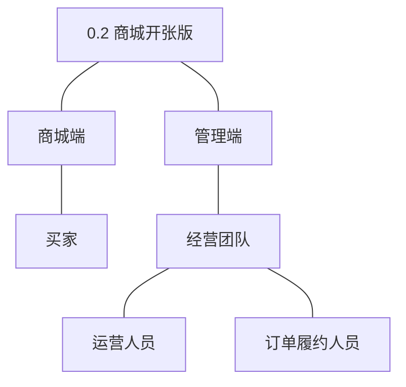

| 主体 | 角色 | 端 | 怎么用系统 |
|---|---|---|---|
| 买家 | 买家 | 商城端 | 注册登录、维护地址簿、逛首页与分类搜索、看详情、加购物车、下单支付、跟踪订单、确认收货、取消待支付订单 |
| 经营团队 | 运营人员 | 管理端 | 配置内容位与档期（首页门户呈现）、管理商品沿用 0.1 |
| 经营团队 | 订单履约人员 | 管理端 | 查看待发货订单、发货登记物流、跟进订单状态 |

**裁剪说明**：买家与商城端在本版首次上场；客服人员本版无系统功能面（售后人工过渡由订单履约人员/管理者执行，咨询走线下渠道），其角色面随 0.4/0.5 交付；管理者沿用 0.1 权限管理，无新增功能条目；全体内部角色的登录与个人设置沿用 0.1。

## 3. 核心业务流程

### 3.1 旅程一：购买（买家 × 订单履约人员，跨主体跨端）

买家在商城端发起并推进，订单履约人员在管理端接续，围绕同一份订单交接。

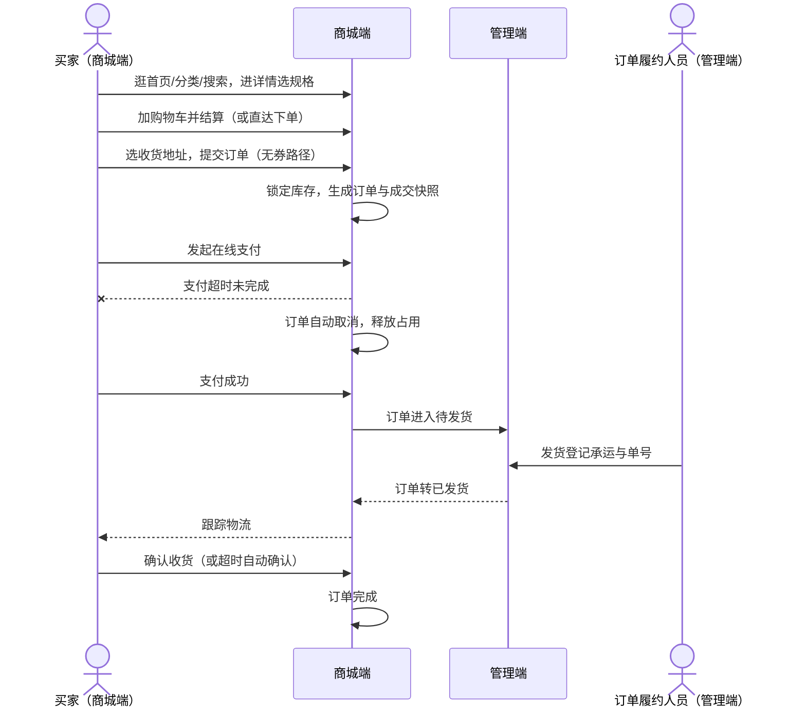

文字：买家自主完成逛与买；支付成功后订单经管理端接单发货再回到商城端供跟踪；全程异常主分支为支付超时自动取消（占用释放，04C-交易 3.8/3.9 机制）；结束态为订单完成（买家确认或超时自动确认，D7）。

操作步骤清单：
1. 买家注册登录（或游客浏览、下单前登录）。
2. 从首页推荐、分类或搜索进入商品详情，选择规格。
3. 加入购物车合并结算，或详情页直接下单。
4. 选择收货地址，确认金额，提交订单。
5. 发起在线支付；支付成功订单转待发货；超时未付自动取消并释放库存。
6. 订单履约人员在管理端对待发货订单登记发货。
7. 买家在订单列表跟踪物流，收货后确认收货（超时自动确认）。
8. 订单完成；有问题经人工售后渠道处理（过渡安排）。

### 3.2 旅程二：注册进店（买家，单端）

开张的入口旅程：从到达商城到可下单的身份就绪。

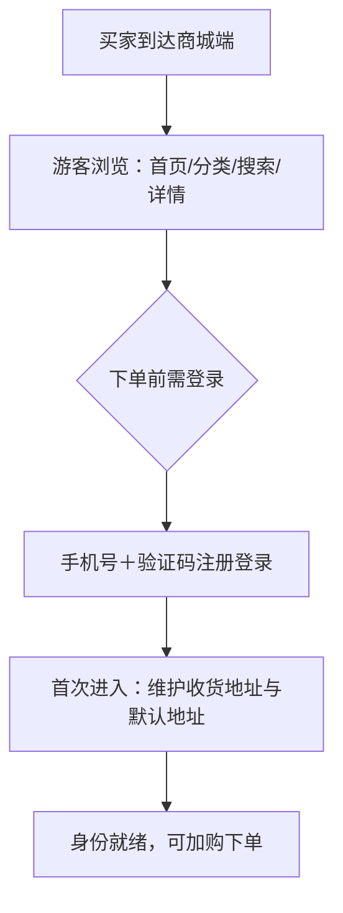

文字：游客可浏览（逛不设门槛），下单前完成手机号验证码注册登录（0.1 定案的身份方式）；首次登录引导维护地址簿与默认地址。

操作步骤清单：① 到达商城端浏览；② 触发登录时输入手机号获取验证码；③ 验证通过注册并登录（老用户直接登录）；④ 首次进入引导新增收货地址并设默认；⑤ 开始加购与下单。

### 3.3 旅程三：配置首页内容位（运营人员，单端）

首页门户的运营旅程：让开张的商城有可运营的门面。

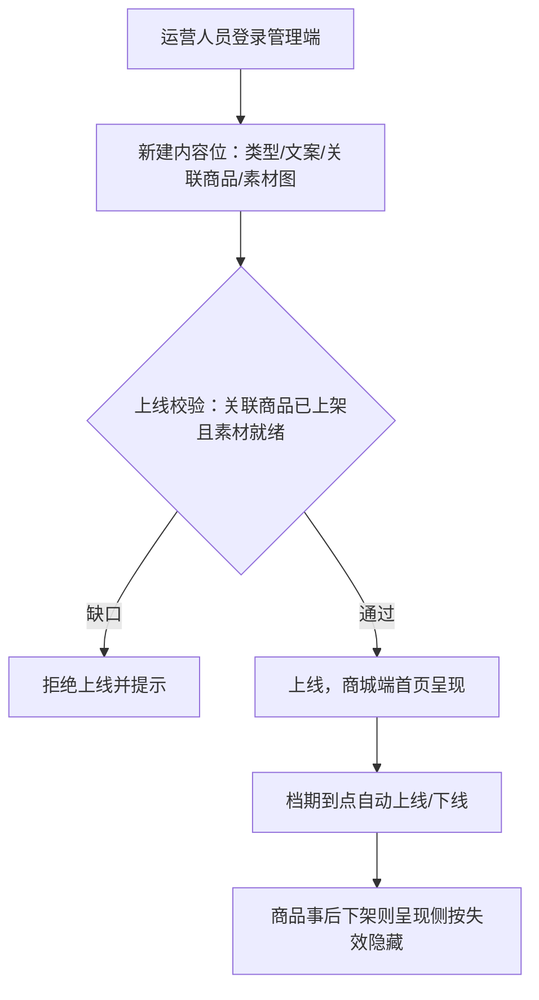

文字：运营配置内容位（推荐位/广告位/专题入口），上线校验关联商品可售；档期自动执行到点上下线；失效商品自动隐藏不删配置（04C-内容 3.4/3.5）。

操作步骤清单：① 管理端进入内容管理，新建内容位；② 配置类型、文案、关联已上架商品、上传素材图、设定档期与排序；③ 执行上线（或档期到点自动上线）；④ 商城端首页与专题入口呈现；⑤ 调整或下线即时生效。

## 4. 功能需求

功能全景总图：

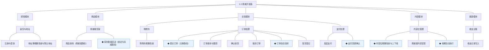

### 4.1 顾客模块

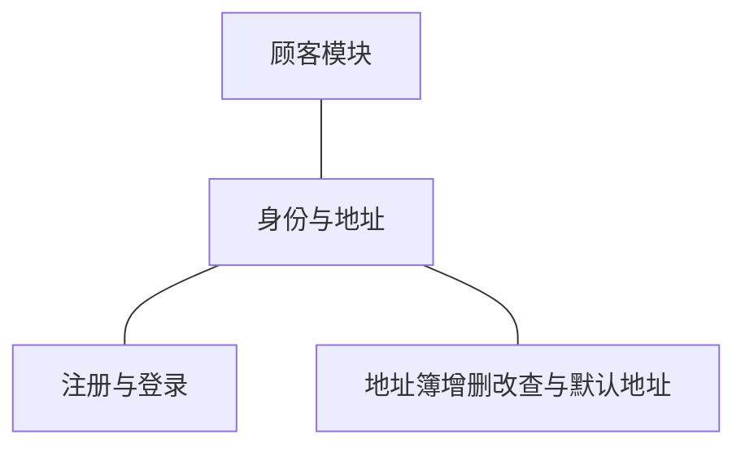

组说明：买家身份与个人中心附属对象的随版交付——注册登录是商城端唯一身份入口（D3 顾客账号与管理端账号隔离），地址簿是下单所依赖的个人中心能力（路线图拆分纪律：闭环依赖随版交付）；其余个人中心能力（资料凭据、注销、记录入口）随 0.5。

| 功能 | 用途 | 验收标准 |
|---|---|---|
| 注册与登录 | 建立买家身份并进入商城端 | 买家以手机号获取验证码完成注册登录，游客可浏览但触发下单时被引导登录，登录态在商城端全程有效 |
| 地址簿增删改查与默认地址 | 维护下单所依赖的收货信息 | 买家登录后可新增、编辑、删除收货地址并设定唯一默认地址，下单时地址簿可选且默认地址自动选中 |

### 4.2 商品模块

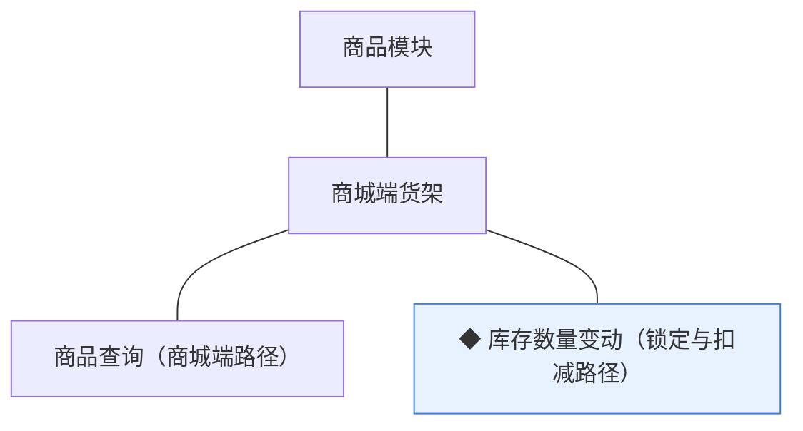

组说明：商品档案、分类、品牌、图片与库存台账沿用 0.1（管理端）；本版交付商城端浏览路径与库存台账的交易侧写入路径（锁定与扣减；回补路径随 0.4，04C-商品 3.8）。

| 功能 | 用途 | 验收标准 |
|---|---|---|
| 商品查询（商城端路径） | 买家在商城端逛与找货 | 买家在商城端按分类浏览、按关键词搜索并打开商品详情，仅"已上架"商品可见，下架商品即时不可见 |
| ◆ 库存数量变动（锁定与扣减路径） | 为成交闭环提供数量一致性 | 提交订单按条件更新锁定对应规格库存（可售不足则下单失败），支付成功核减锁定量；变动台账留痕可查 |

### 4.3 交易模块

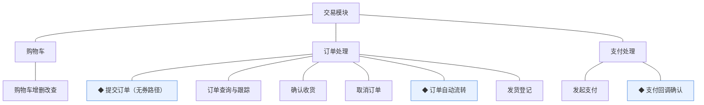

组说明：成交闭环主战场——购物车与订单处理承载买家侧旅程，支付处理经渠道适配层（K6）对接第三方支付；用券路径与秒杀联动随 0.3；订单查询的管理端路径同时作为本版人工售后核对的支撑能力（过渡安排承接，本轮拍板）。

| 功能 | 用途 | 验收标准 |
|---|---|---|
| 购物车增删改查 | 暂存与合并选购 | 买家登录后可将商品规格加入购物车、调整数量与移除，重复加入同规格合并数量，失效商品（下架/删除）在购物车标记不可结算 |
| ◆ 提交订单（无券路径） | 把选购变成交易事实 | 买家选定收货地址提交订单后生成订单与成交快照（时点价格），同笔库存锁定成功，金额为分单位整数，不满足（可售不足/地址缺失）则整单失败不留占用 |
| 订单查询与跟踪 | 两端掌握订单进度 | 买家在商城端查看本人订单列表与详情并跟踪物流状态，订单履约人员在管理端按状态/单号检索订单，状态展示与术语表状态名逐字一致 |
| 确认收货 | 买家收尾交易 | 买家对已发货订单确认收货后订单转已完成；发货后超时未确认的订单自动确认（时限为版本级默认值） |
| 取消订单 | 买家主动放弃待支付订单 | 买家对待支付订单执行取消后订单转已取消，锁定的库存即时释放；非待支付订单不可取消 |
| ◆ 订单自动流转 | 减少两侧悬空等待 | 支付超时的待支付订单自动取消并释放占用，已发货订单超时自动确认收货，自动流转与手动动作同机制且留痕，任务可重入幂等 |
| 发货登记 | 履约侧接单发货 | 订单履约人员对待发货订单登记承运方与物流单号后订单转已发货，商城端即时可跟踪 |
| 发起支付 | 买家为订单付款 | 买家对待支付订单发起在线支付，经支付渠道完成付款，支付渠道经适配层可替换 |
| ◆ 支付回调确认 | 落实交易事实 | 支付渠道回调到达后经防重验签确认，支付单转支付成功、订单转待发货、库存锁定转扣减、收入记录写入台账，全部变更同事务成立，重复回调不产生第二份事实 |

### 4.4 内容模块

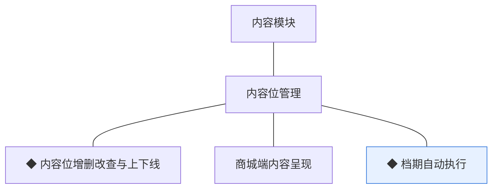

组说明：商城端首页门户与专题入口的运营承载；帮助文章随 0.5；素材图经图片资源关联（biz_type 扩展 content，本版定）。

| 功能 | 用途 | 验收标准 |
|---|---|---|
| ◆ 内容位增删改查与上下线 | 运营配置商城门面 | 运营人员新建内容位（类型/文案/关联商品/素材/排序）保存成功，上线校验关联商品已上架与素材就绪，不满足则拒绝上线并提示，下线即时从商城端撤出，变更留痕 |
| 商城端内容呈现 | 首页门户与专题入口展示 | 商城端首页按内容位配置呈现推荐、广告与专题入口，失效位（下线或关联商品下架）自动不展示且不报错 |
| ◆ 档期自动执行 | 按投放档期自动上下线 | 到达开始时间的内容位经校验自动上线，到达结束时间自动下线，任务可重入幂等且流转留痕 |

### 4.5 报表模块

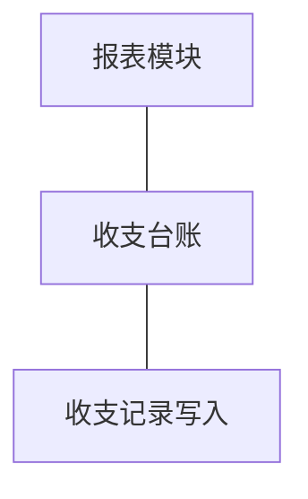

组说明：基础财务台账的收入路径随支付闭环写入（D8）；支出路径随 0.4；台账查询随 0.4（04C-报表）。

| 功能 | 用途 | 验收标准 |
|---|---|---|
| 收支记录写入 | 沉淀交易收入事实 | 支付成功回调确认的同事务内向订单收支记录写入一条收入记录（金额分单位、关联支付单号），写入幂等不重复 |

## 5. 业务对象

对象关系总览：

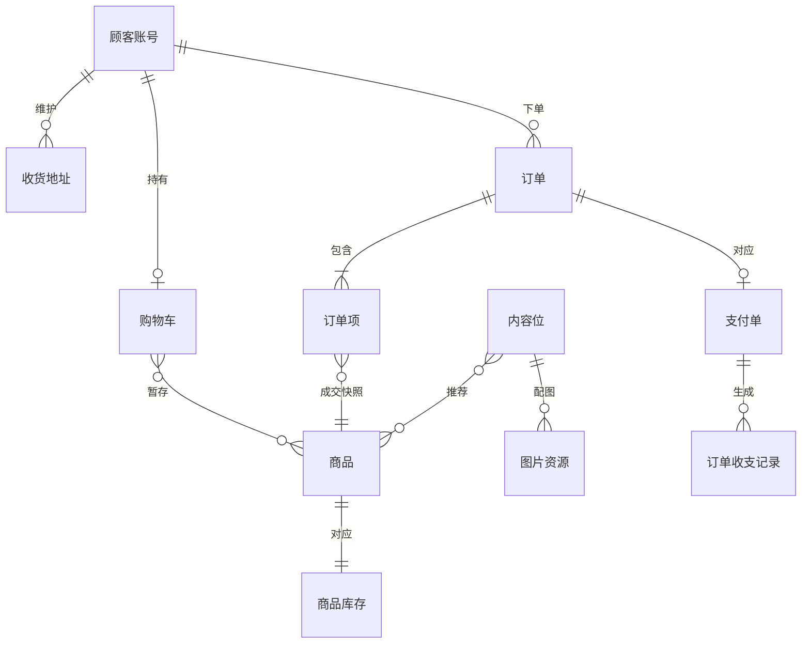

### 5.1 顾客账号

定位：买家在商城端的身份载体，本版首次上线（0.1 已定身份方式＝手机号验证码）。

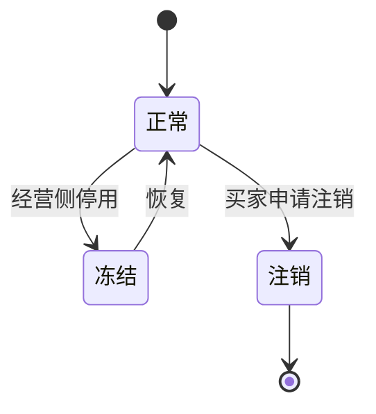

说明：本版上线"正常／冻结"两态（冻结为经营侧治理动作，机制随对象先行就绪、管理面随 0.6 完整交付）；注销随 0.5（无未完结事项校验依赖 0.4 售后）。凭据形态＝手机号验证码（0.1 定案）。

### 5.2 收货地址

定位：买家维护的常用收货信息集（个人中心附属对象），下单选用并快照。

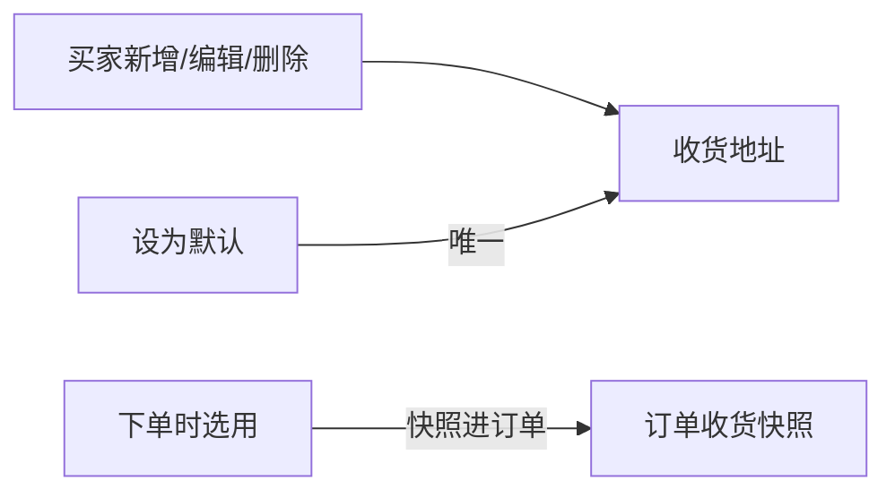

说明：默认地址唯一（行业惯例默认）；下单时点快照进订单（D6），后续地址修改不影响已下订单。

### 5.3 商品（沿用 0.1 扩展）

定位：以 SKU 为最小售卖单元的实物商品档案（0.1 已交付管理端全量）。

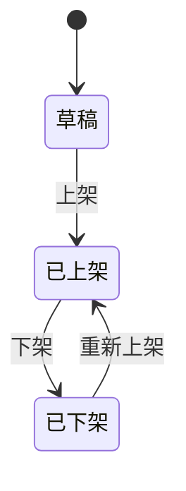

说明：沿用 0.1 三态；本版新增"已上架"的商城端语义——商城端浏览、搜索与详情仅见已上架商品，下架即时不可见（内容位呈现侧按失效隐藏）。

### 5.4 商品库存（沿用 0.1 扩展）

定位：SKU 级可售数量台账。

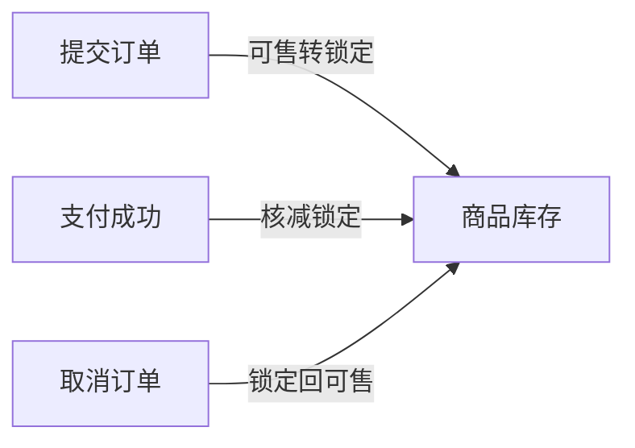

说明：沿用 0.1 台账与运营侧路径；本版新增锁定与扣减两条交易侧路径及取消释放路径（取消为 ◆ 订单自动流转与取消订单的伴随动作）；回补路径随 0.4。可售不足时锁定失败、整单失败（04C-商品 3.8）。

### 5.5 购物车

定位：买家暂存选中商品的载体（按顾客聚合的条目集）。

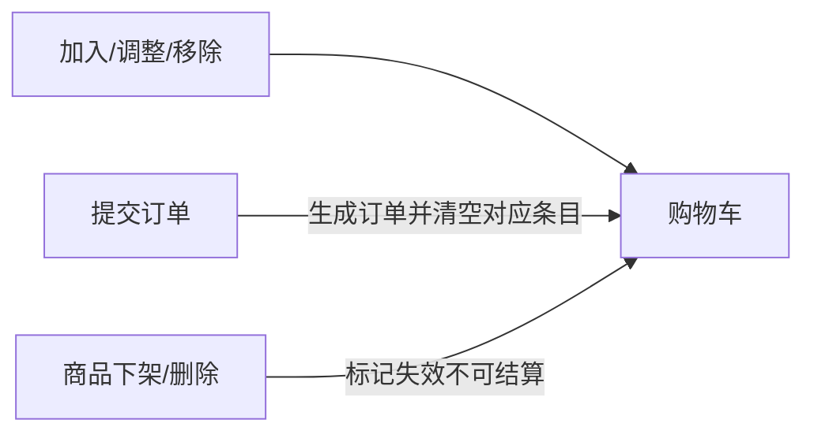

说明：无状态对象（条目随操作增减）；条目引用商品实时信息，成交以提交时点价为准（D6）。

### 5.6 订单

定位：一次交易的主记录，买卖两侧流程衔接核心。

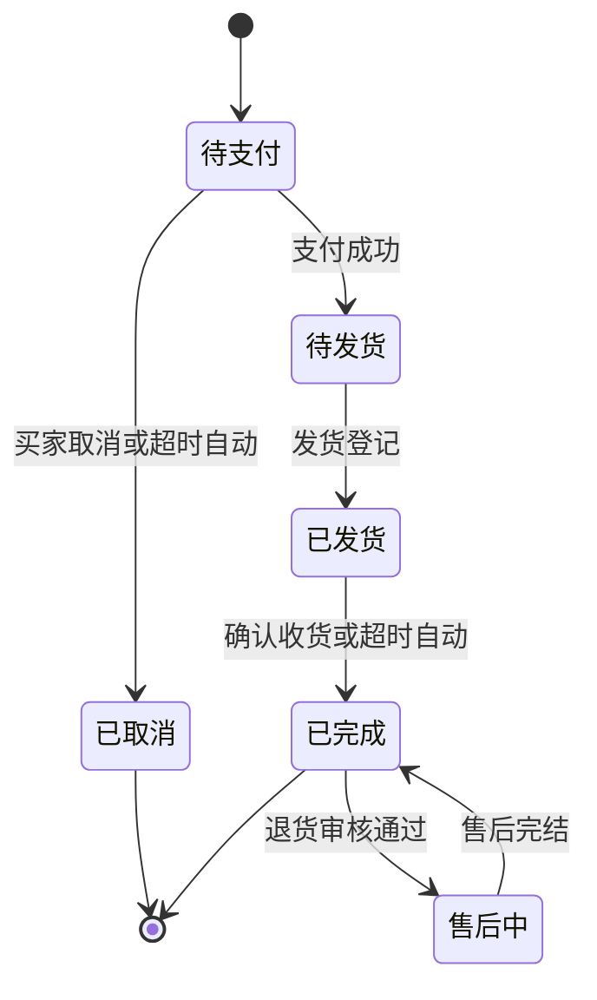

说明：本版交付待支付→已取消／待发货→已发货→已完成全路径；"售后中"态与"已完成→售后中"流转随 0.4 交付（状态机整体先行定义，本版不可达）；超时自动取消与超时自动确认的时限为版本级默认值（随条目细化落地）。

### 5.7 订单项

定位：订单内商品明细，成交时点快照（D6）。


说明：本版随提交订单生成；快照不随后续商品变化回写；退货关联随 0.4。

### 5.8 支付单

定位：订单的在线支付记录，经渠道适配层对接第三方（K6）。

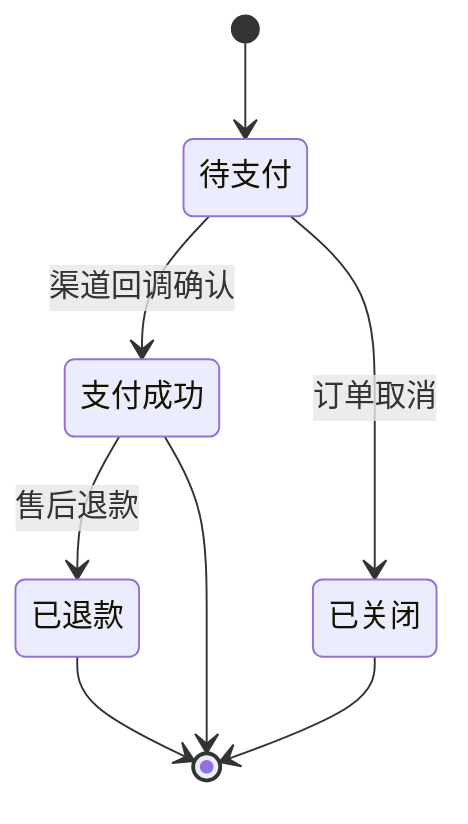

说明：本版交付待支付→支付成功／已关闭；"已退款"随 0.4；沙箱接入（0.1 定案的商户开户于本版收口，模拟案例按沙箱口径）。

### 5.9 内容位

定位：首页与专题页的推荐位/广告位/专题入口统称。

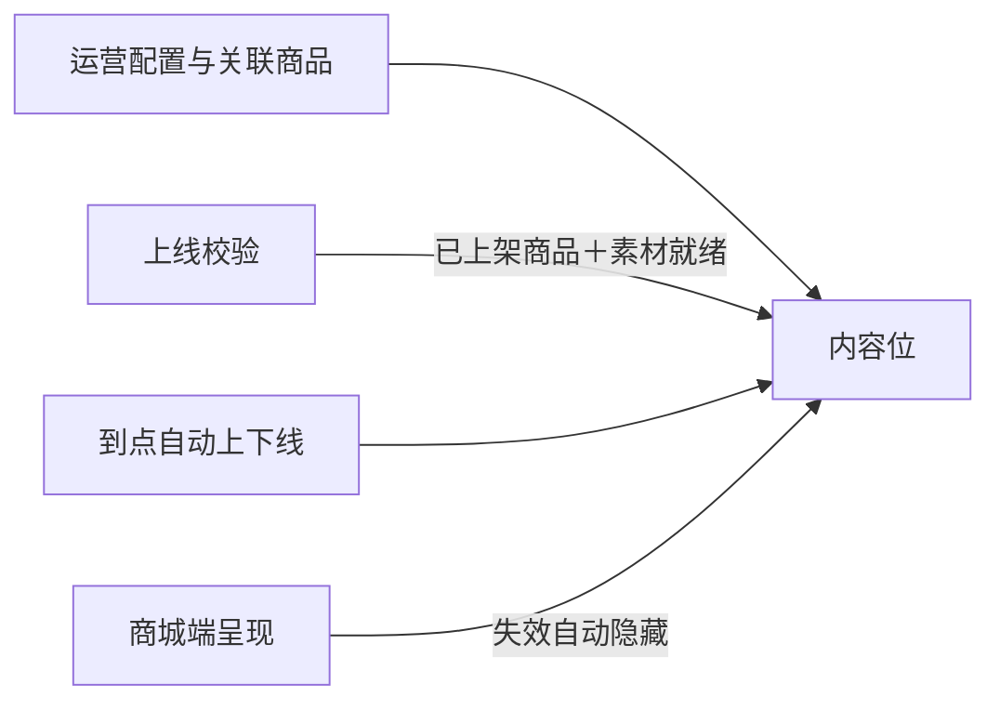

说明：无生命周期状态对象（以档期＋上下线标记表达有效性，属性而非状态机）；素材图经图片资源关联（biz_type 扩展取值 content，本版定）。

### 5.10 图片资源（沿用 0.1 扩展）

定位：统一存取的图片对象（0.1 已交付，挂靠商品模块）。

```mermaid
flowchart LR
    上传[上传入库] --> 图片[图片资源]
    商品关联[关联商品] -->|biz_type=product| 图片
    品牌关联[关联品牌] -->|biz_type=brand| 图片
    内容位关联[关联内容位素材] -->|biz_type=content| 图片
```

说明：沿用 0.1 机制；本版扩展 biz_type 取值 content（内容位素材），已登记术语表。

### 5.11 订单收支记录（收入路径）

定位：基础财务收支台账（D8 只读生成）。

```mermaid
flowchart LR
    支付成功[支付回调确认] -->|同事务写入| 收入[订单收支记录·收入]
    幂等[按支付单号防重] --> 收入
```

说明：本版仅收入路径（类型 INCOME）；支出（EXPENSE）随 0.4、冲正（REVERSAL）为台账机制先行定义；台账查询随 0.4。
