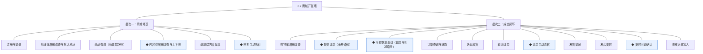
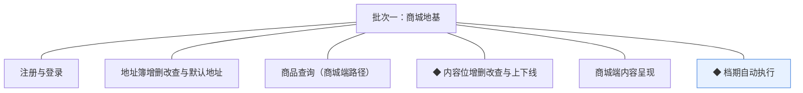
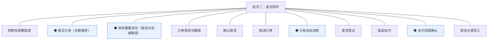

# 开发顺序与需求拆解（大版本）：0.2 商城开张版

> 本文把 0.2 大版本 PRD 转换为开发批次与功能级需求条目，同时即 0.2 版的完整需求清单（需求池据此直接入池，不另生成版本快照）。上游为模拟案例材料，模拟性质予以保留。

## 1. 拆解说明

- **做什么**：把 PRD 的 17 项功能排成可独立验收的开发批次，每项功能转为一条可直接认领与验收的需求条目（R 编号沿用池序，本版 R15~R31），用途与验收标准逐字携带 PRD 原文。
- **粒度口径**：条目与 PRD 功能清单一一同构（一条＝一项功能，无归并无新增）；交互、字段级细化归小版本 PRD。
- **与需求池及小版本规划的关系**：本文是需求池的**主入口但不是唯一入口**——会议、沟通、临时反馈产生的需求可直接单条入池；小版本规划的输入＝本文开发顺序＋需求池实时状态合并，**批次划分是建议而非锁定**。

## 2. 开发顺序

**前置版本沿用面**：0.1 全部交付——管理端账号与角色授权（0.2 各域能力点挂入既有机制）、商品货架与库存台账、图片资源、管理端登录。

开发批次总图：

批次推进链：

**顺序依据**：批次一交付"可逛"——买家身份、商城端货架路径与首页门面，无外部联调点，可独立验收（注册登录＋逛首页/分类/搜索/详情）；批次二交付"可买"——成交闭环全部条目，依赖批次一（登录态、地址簿、浏览路径）。**同事务契约（不可拆批）**：R22 提交订单与 R23 库存锁定同事务（04C-交易 3.6/04C-商品 3.8）；R30 支付回调确认与 R23 扣减、R31 收入写入同事务（04C-交易 3.7）——三组必须同批成立，故并入批次二。**外部联调点**：支付渠道（沙箱）仅批次二涉及；短信服务（注册验证码）为批次一外部依赖，0.1 已启动、本版收口。

### 2.1 批次一：商城地基

- **目标**：商城端上线"可逛"——买家身份就绪、货架与首页门面可浏览。
- **依赖**：0.1（商品货架与已上架商品、图片资源、能力点机制）；外部依赖——短信服务于本批收口（0.1 启动，验证码发送实测）。
- **可验收形态**：真实买家演示"游客浏览→验证码注册登录→维护地址簿与默认地址→逛首页推荐/分类/搜索/详情"；运营演示"配置内容位→校验上线→首页呈现→档期到点自动上下线"。

条目与 PRD 4.1／4.2／4.4 节功能清单一一同构，用途与验收标准逐字引自原文：

| 编号 | 需求名 | 用途 | 验收标准 |
|---|---|---|---|
| R15 | 注册与登录 | 建立买家身份并进入商城端 | 买家以手机号获取验证码完成注册登录，游客可浏览但触发下单时被引导登录，登录态在商城端全程有效 |
| R16 | 地址簿增删改查与默认地址 | 维护下单所依赖的收货信息 | 买家登录后可新增、编辑、删除收货地址并设定唯一默认地址，下单时地址簿可选且默认地址自动选中 |
| R17 | 商品查询（商城端路径） | 买家在商城端逛与找货 | 买家在商城端按分类浏览、按关键词搜索并打开商品详情，仅"已上架"商品可见，下架商品即时不可见 |
| R18 | ◆ 内容位增删改查与上下线 | 运营配置商城门面 | 运营人员新建内容位（类型/文案/关联商品/素材/排序）保存成功，上线校验关联商品已上架与素材就绪，不满足则拒绝上线并提示，下线即时从商城端撤出，变更留痕 |
| R19 | 商城端内容呈现 | 首页门户与专题入口展示 | 商城端首页按内容位配置呈现推荐、广告与专题入口，失效位（下线或关联商品下架）自动不展示且不报错 |
| R20 | ◆ 档期自动执行 | 按投放档期自动上下线 | 到达开始时间的内容位经校验自动上线，到达结束时间自动下线，任务可重入幂等且流转留痕 |

### 2.2 批次二：成交闭环

- **目标**：交付成交闭环——买家从加购到收货全程自助，生意在线上成交（0.2 版本目标达成段）。
- **依赖**：批次一（登录态、地址簿、商城端浏览路径、内容呈现）；0.1（商品库存台账、管理端角色机制——订单履约人员能力点挂入）；外部依赖——支付渠道沙箱联调（商户开户 0.1 已启动、本批收口），域名备案本批收口（商城端对外发布前提）。
- **可验收形态**：真实买家演示"加购→提交订单→在线支付→订单转待发货→履约发货登记→跟踪物流→确认收货→订单完成"全流程；另演示一笔支付超时自动取消（占用释放）；管理端订单查询供人工售后核对（过渡支撑）。

条目与 PRD 4.2／4.3／4.5 节功能清单一一同构，用途与验收标准逐字引自原文：

| 编号 | 需求名 | 用途 | 验收标准 |
|---|---|---|---|
| R21 | 购物车增删改查 | 暂存与合并选购 | 买家登录后可将商品规格加入购物车、调整数量与移除，重复加入同规格合并数量，失效商品（下架/删除）在购物车标记不可结算 |
| R22 | ◆ 提交订单（无券路径） | 把选购变成交易事实 | 买家选定收货地址提交订单后生成订单与成交快照（时点价格），同笔库存锁定成功，金额为分单位整数，不满足（可售不足/地址缺失）则整单失败不留占用 |
| R23 | ◆ 库存数量变动（锁定与扣减路径） | 为成交闭环提供数量一致性 | 提交订单按条件更新锁定对应规格库存（可售不足则下单失败），支付成功核减锁定量；变动台账留痕可查 |
| R24 | 订单查询与跟踪 | 两端掌握订单进度 | 买家在商城端查看本人订单列表与详情并跟踪物流状态，订单履约人员在管理端按状态/单号检索订单，状态展示与术语表状态名逐字一致 |
| R25 | 确认收货 | 买家收尾交易 | 买家对已发货订单确认收货后订单转已完成；发货后超时未确认的订单自动确认（时限为版本级默认值） |
| R26 | 取消订单 | 买家主动放弃待支付订单 | 买家对待支付订单执行取消后订单转已取消，锁定的库存即时释放；非待支付订单不可取消 |
| R27 | ◆ 订单自动流转 | 减少两侧悬空等待 | 支付超时的待支付订单自动取消并释放占用，已发货订单超时自动确认收货，自动流转与手动动作同机制且留痕，任务可重入幂等 |
| R28 | 发货登记 | 履约侧接单发货 | 订单履约人员对待发货订单登记承运方与物流单号后订单转已发货，商城端即时可跟踪 |
| R29 | 发起支付 | 买家为订单付款 | 买家对待支付订单发起在线支付，经支付渠道完成付款，支付渠道经适配层可替换 |
| R30 | ◆ 支付回调确认 | 落实交易事实 | 支付渠道回调到达后经防重验签确认，支付单转支付成功、订单转待发货、库存锁定转扣减、收入记录写入台账，全部变更同事务成立，重复回调不产生第二份事实 |
| R31 | 收支记录写入 | 沉淀交易收入事实 | 支付成功回调确认的同事务内向订单收支记录写入一条收入记录（金额分单位、关联支付单号），写入幂等不重复 |

**批次判断与边界取舍**：①两批划分——"可逛"与"可买"是两类可独立验收的形态，逛店批不依赖任何外部联调可先行演示；合并则首批无可演示中间形态（判断注记）；②成交闭环不再细拆——R21~R31 依赖链闭环（购物车→下单锁库存→支付扣库存→发货→收货；取消/自动流转为闭环伴随机制），拆批则任一中间态不可验收；③R23/R30/R31 与同事务契约绑定并入批次二，不单列联调批（契约内聚优于形式拆分，判断注记）。

**版本级验收安排**：完成标志承接路线图——真实买家首笔全流程订单＋一笔支付超时自动取消；量化口径＝灰度期订单 100% 由买家自助完成（本版无人工成单入口）。0.2 为首次对外发布与首次真实收款的高风险版本，灰度台阶（环境联调→内部全流程演练→小额真实单→全量）属上线安排、不占开发批次；灰度冻结的只是全量开放与同风险面发布，不阻塞 0.3 开发立项。

## 3. 条目与 PRD 对应核对

- **一一同构声明**：条目数＝PRD 功能数＝17（R15~R31 逐行对应 PRD 4.1～4.5 节功能清单），无归并、无 PRD 外内容；路径拆分行 3 条均为 PRD 原功能名含路径标注整条交付（商品查询〔商城端路径〕、提交订单〔无券路径〕、库存数量变动〔锁定与扣减路径〕）。
- **批次构成**：批次一 6 条（顾客模块 2、商品模块 1、内容模块 3）；批次二 11 条（商品模块 1、交易模块 9、报表模块 1）。
- **◆ 清点**：◆ 条目 6 条——R18 内容位增删改查与上下线（04C-内容 3.4 ◆ 同名机制）、R20 档期自动执行、R22 提交订单、R23 库存数量变动、R27 订单自动流转、R30 支付回调确认，与 PRD 功能全景总图 ◆ 标记逐条一致。
- **过渡支撑清点**：过渡支撑 1 处——批次二"可验收形态"中的管理端订单查询人工售后核对（承接路线图 0.2 真空期过渡，R24 管理端路径即支撑能力，当批已交付）。

## 4. 与需求池和小版本规划的衔接

- **入池路径**：本表 17 条经需求池批量入池模式登记（编号 R15~R31、批次随本文继承）；池只追加管理属性。
- **多入口口径**：会议、沟通、临时反馈的需求从其他入口直接单条入池（M01 起编号），与本表条目并存互不覆盖。
- **小版本规划的合并输入**：建议按批次一→批次二确认两个小版本（0.2.0 商城地基版认领 R15~R20、0.2.1 成交闭环版认领 R21~R31），唯一硬约束是本文同事务契约不回退（R22/R23、R30/R23/R31 不拆批认领）。
- **认领与细化原则**：认领后的小版本 PRD 做开发级细化（交互、字段、边界，含时限类版本级默认值落地），验收以随行验收标准为锚。
