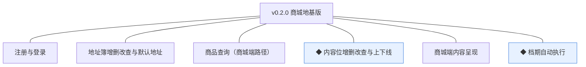
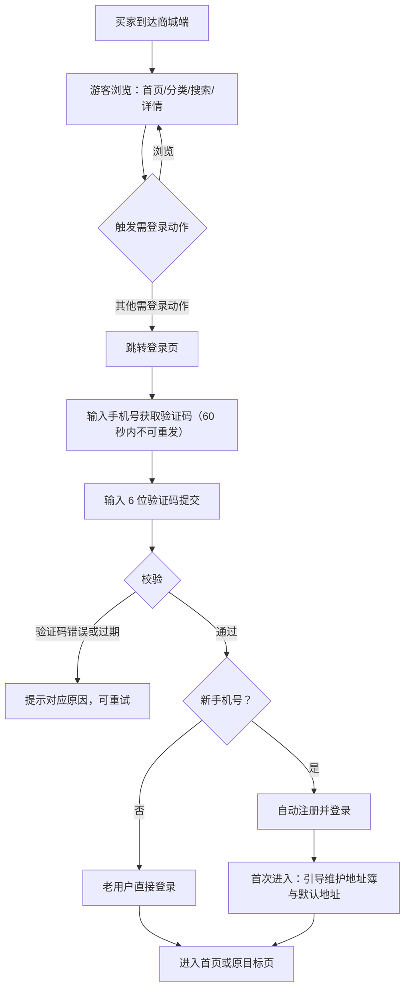
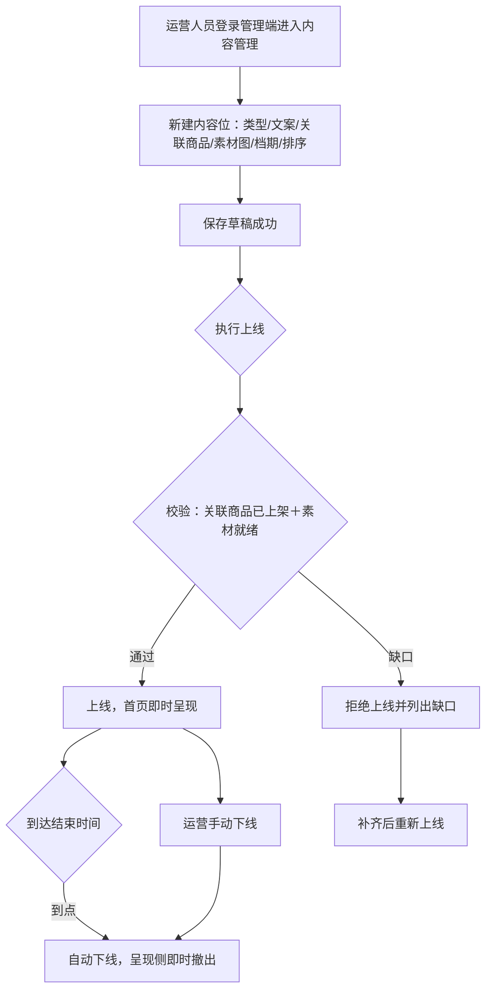
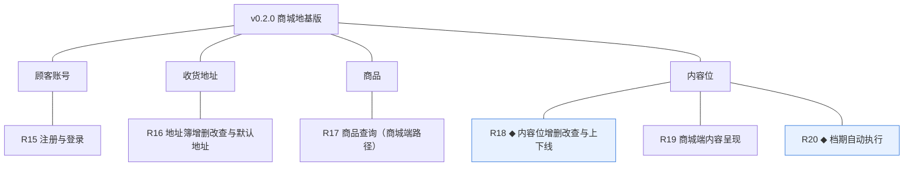
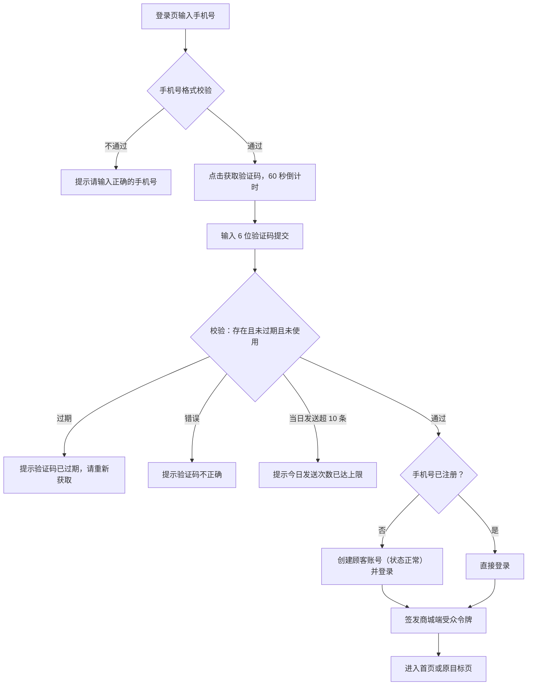
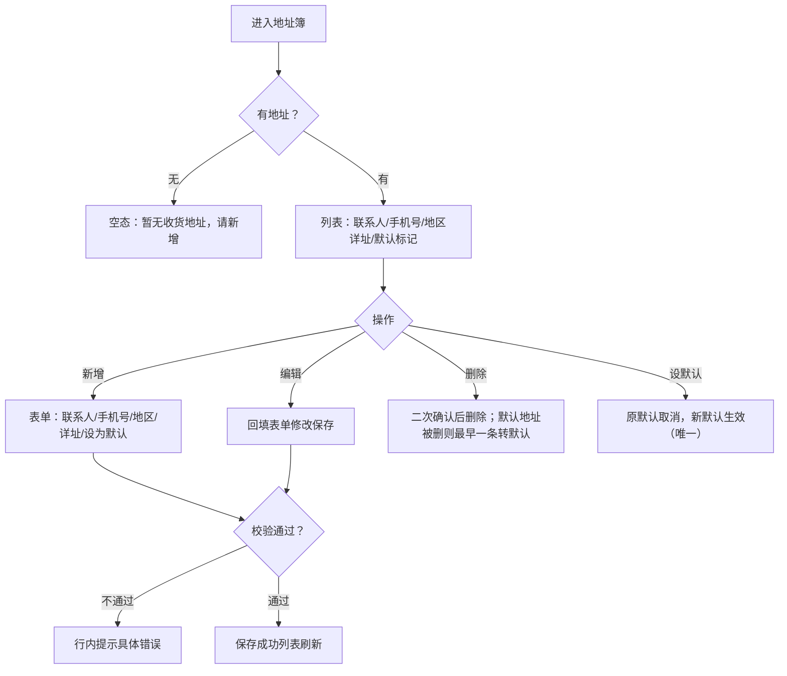
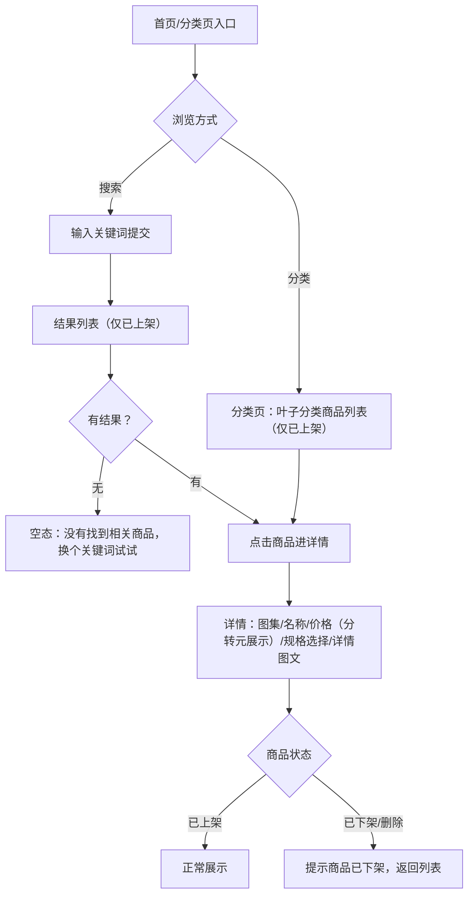
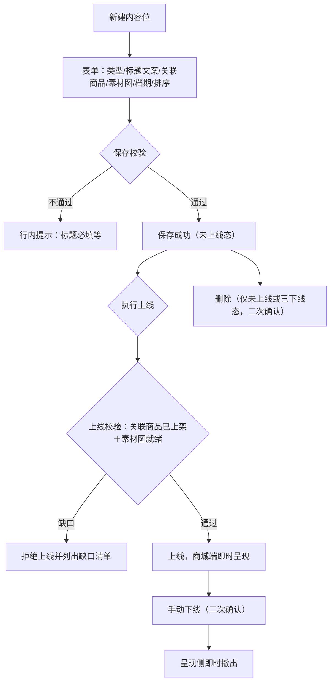
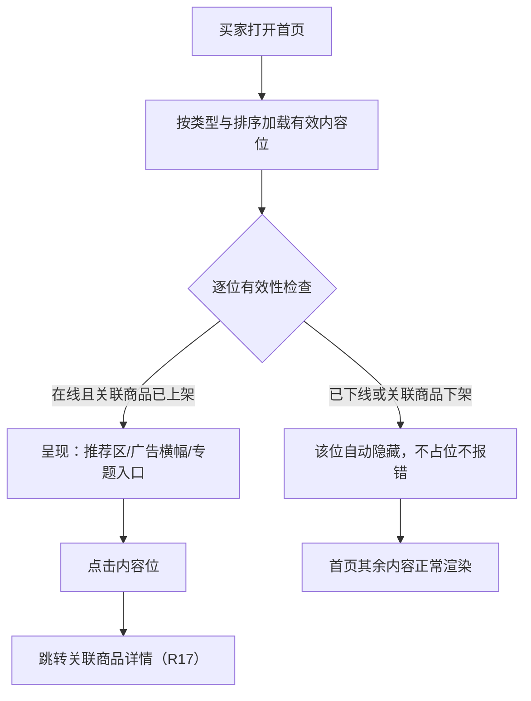
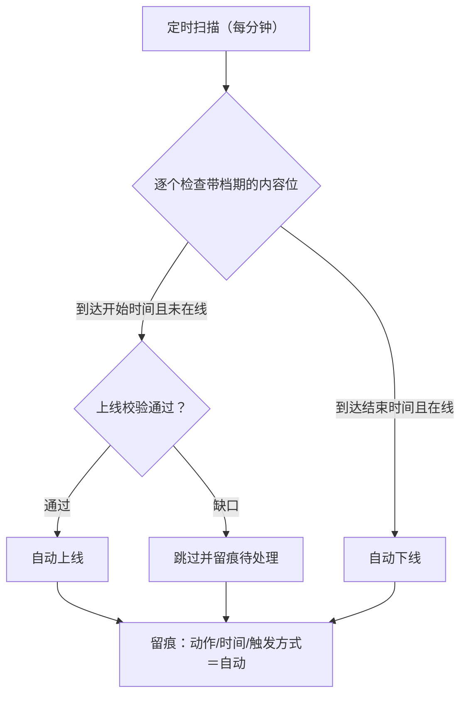

# PRD（小版本）：v0.2.0 商城地基版

> 本文是 v0.2.0 的开发级需求说明书：以认领条目（R15~R20）为范围、大版本 PRD 与 02 拆解为逐字锚，把每条需求细化到开发与测试不再追问的程度。上游为模拟案例材料，模拟性质予以保留。

## 1. 版本概述

**承接与目标**：认领自需求池——0.2 商城开张版批次一（02 拆解），R15~R20 共 6 条，池内状态已同步为"已认领（v0.2.0）"。本版目标＝商城端上线"可逛"（0.2 大版本"先逛后买"的前半段）；本版可验收形态（承接 02 批次一）：真实买家演示"游客浏览→验证码注册登录→维护地址簿与默认地址→逛首页推荐/分类/搜索/详情"；运营演示"配置内容位→校验上线→首页呈现→档期到点自动上下线"。

**范围外声明**：成交闭环九条与库存锁定扣减、收入写入（R21~R31）归下一小版本（0.2.1 成交闭环版）——本版购物车与下单入口不出现；优惠券与秒杀（0.3）；退货退款（0.4）；咨询与帮助中心、商品评价（0.5）；会员等级（0.6）；顾客资料凭据自助与注销（0.5，本版注册即有昵称项但不提供后续修改面）；管理端商品与权限界面沿用 0.1 已交付，不重复交付。本文对范围外内容只作围栏声明。

**条目内顺序与依赖**（引用上游批内顺序）：R15 身份先行（商城端登录态是 R16/R17 的个性化前提）→ R17 商城端货架路径（依赖 0.1 已上架商品）→ R18 内容位配置 → R19 呈现（消费 R18 产物）→ R20 档期自动执行（R18/R19 的自动化伴随机制）。批内可并行开发。

## 2. 需求范围与验收锚

条目总览树（与 02 批次一分支图同名同构）：

认领条目表（需求名／用途／验收标准逐字引自 02 批次一需求表）：

| 编号 | 需求名 | 用途 | 验收标准 |
|---|---|---|---|
| R15 | 注册与登录 | 建立买家身份并进入商城端 | 买家以手机号获取验证码完成注册登录，游客可浏览但触发下单时被引导登录，登录态在商城端全程有效 |
| R16 | 地址簿增删改查与默认地址 | 维护下单所依赖的收货信息 | 买家登录后可新增、编辑、删除收货地址并设定唯一默认地址，下单时地址簿可选且默认地址自动选中 |
| R17 | 商品查询（商城端路径） | 买家在商城端逛与找货 | 买家在商城端按分类浏览、按关键词搜索并打开商品详情，仅"已上架"商品可见，下架商品即时不可见 |
| R18 | ◆ 内容位增删改查与上下线 | 运营配置商城门面 | 运营人员新建内容位（类型/文案/关联商品/素材/排序）保存成功，上线校验关联商品已上架与素材就绪，不满足则拒绝上线并提示，下线即时从商城端撤出，变更留痕 |
| R19 | 商城端内容呈现 | 首页门户与专题入口展示 | 商城端首页按内容位配置呈现推荐、广告与专题入口，失效位（下线或关联商品下架）自动不展示且不报错 |
| R20 | ◆ 档期自动执行 | 按投放档期自动上下线 | 到达开始时间的内容位经校验自动上线，到达结束时间自动下线，任务可重入幂等且流转留痕 |

锚定说明：以上三列为逐字锚，本文第 4 章的细化只加深行为描述、不与锚冲突、不收窄或放宽验收；验收按锚逐条执行。

## 3. 核心用户旅程

**旅程承接说明**：大版本 PRD 旅程二「注册进店」与旅程三「配置首页内容位」整条落在本版认领范围内（R15→R16→R17/R19、R18→R19→R20），此处细化到开发级取值与反馈；旅程一「购买」的成交段不在本版（R21~R31 归 0.2.1），本版旅程止于"逛"，下单动作仅作为登录触发的边界出现。

### 3.1 旅程一：注册进店（买家，单端单主体）

文字：游客浏览零门槛；需登录动作触发引导（本版范围内此类动作为地址簿维护，0.2.1 起扩至加购下单）；验证码一次性、5 分钟有效（行业惯例默认）；新手机号验证通过即自动注册（注册与登录合一，本版定）；登录态全程有效（30 天静默续期，行业惯例默认），失效后重新验证。

操作步骤清单：
1. 买家打开商城端，以游客身份浏览首页、分类、搜索与详情。
2. 触发需登录动作（如维护地址）时跳转登录页。
3. 输入手机号，点击获取验证码（60 秒倒计时防重发）。
4. 输入收到的 6 位验证码提交；错误或过期按提示重试。
5. 新手机号自动注册并登录；老用户直接登录。
6. 首次进入引导新增收货地址并设默认；此后自由浏览。

### 3.2 旅程二：配置首页内容位（运营人员，单端单主体）

文字：运营配置内容位并保存后需经上线校验（关联商品已上架、素材图已就绪）方可呈现；档期到点自动上线/下线与手动动作同机制；商品事后下架的失效位在呈现侧自动隐藏不报错；全部上下线动作留痕。

操作步骤清单：
1. 管理端进入内容管理，点击新建内容位。
2. 选择类型（推荐位/广告位/专题入口），填写标题文案，关联已上架商品，上传素材图（经图片资源，biz_type＝content），设定投放档期与排序。
3. 保存成功后执行上线；校验不通过按缺口清单补齐后重试。
4. 商城端首页即时呈现该内容位。
5. 到达结束时间自动下线（或手动下线）；变更全程留痕。

## 4. 功能需求

### 4.1 功能总览

对象归组树（版本→对象→条目）：

对象增删改查矩阵：

| 对象 | 增 | 改 | 删 | 查 |
|---|---|---|---|---|
| 顾客账号 | R15 验证码注册（注册登录合一） | 不做（资料与凭据自助面随 0.5；冻结治理面随 0.6） | 不做（注销随 0.5） | R15 登录校验（验证码核验） |
| 收货地址 | R16 新增 | R16 编辑、默认地址设定 | R16 删除 | R16 列表（下单选用随 0.2.1） |
| 商品 | 已于 v0.1.1 交付（管理端建档/编辑） | 已于 v0.1.1 交付（含上下架） | 不做（档案不删，v0.1.1 口径） | R17 商城端浏览/搜索/详情（仅已上架） |
| 内容位 | R18 新建 | R18 编辑、R18/R20 上下线（状态） | R18 删除（未被呈现侧引用即可删，草稿/下线态） | R18 列表、R19 商城端呈现 |

主体使用面：

| 主体／角色 | 使用条目 | 说明 |
|---|---|---|
| 买家（商城端） | R15、R16、R17、R19 | 注册登录、地址簿、逛与看首页门面 |
| 运营人员（管理端） | R18 | 内容位配置与上下线 |
| 系统（调度） | R20 | 档期自动执行，无人工触发面（机制条目） |

机制条目（无人工触发面）：R20 档期自动执行为调度任务（任务可重入幂等，流转留痕），无操作界面——其效果在 R18 内容位列表的状态列可见。

### 4.2 R15 注册与登录

**功能说明**：建立买家身份并进入商城端（注册与登录合一）。触发：买家在商城端触发需登录动作（本版为地址维护），或主动点击登录。

**交互与流程**：

操作步骤清单：① 登录页输入手机号；② 格式校验通过后点击获取验证码（60 秒内按钮禁用倒计时）；③ 输入 6 位验证码提交；④ 校验通过后新号自动注册、老号直接登录，签发商城端受众令牌；⑤ 跳转首页或登录前的目标页；⑥ 需登录动作在未登录时统一跳登录页并记录目标页。

**字段与校验**：

| 信息项 | 必填 | 校验 | 失败反馈 |
|---|---|---|---|
| 手机号 | 是 | 11 位大陆手机号格式 | "请输入正确的手机号" |
| 验证码 | 是 | 6 位数字；5 分钟内有效；一次性（本版定／行业惯例默认） | "验证码不正确"/"验证码已过期，请重新获取" |
| 发送频控 | — | 同号 60 秒 1 条、每日上限 10 条（行业惯例默认） | "发送过于频繁，请稍后再试"/"今日发送次数已达上限" |

**规则与边界**：
1. 注册与登录合一：验证通过时手机号未注册即自动注册（状态"正常"），不设独立注册页与密码（身份方式＝手机号验证码，0.1 定案）。
2. 令牌为商城端受众，与管理端令牌互不通用（D3、K4）；登录态 30 天静默续期（行业惯例默认），失效重新验证。
3. 同一手机号重复注册不产生第二账号（手机号唯一约束兜底）。
4. 验证码的存储与核验形态由开发阶段定（机制态：内存或落库，不影响行为口径）；发送依赖短信服务（0.1 启动、本版收口实测）。

**异常与拦截**：

| 异常场景 | 系统行为 |
|---|---|
| 验证码错误/过期 | 对应提示，可重试 |
| 发送频控触发 | 倒计时未到提示"发送过于频繁"，达每日上限提示上限 |
| 游客触发需登录动作 | 跳转登录页，登录后回原目标页 |

### 4.3 R16 地址簿增删改查与默认地址

**功能说明**：买家维护常用收货信息并设定默认地址（个人中心的下单依赖件）。触发：买家在商城端"我的地址"进入地址簿。

**交互与流程**：

操作步骤清单：① 登录后进入地址簿；② 新增：填写联系人、手机号、选择地区、填写详址，可勾选设为默认；③ 编辑：回填修改保存；④ 删除：二次确认后移除；⑤ 设默认：唯一默认即时生效；⑥ 地址簿上限 20 条（行业惯例默认）。

**字段与校验**：

| 信息项 | 必填 | 校验 | 失败反馈 |
|---|---|---|---|
| 联系人 | 是 | 2~20 字符 | "联系人需为 2~20 字符" |
| 手机号 | 是 | 11 位大陆手机号格式 | "请输入正确的手机号" |
| 地区 | 是 | 省/市/区三级选择 | "请选择所在地区" |
| 详细地址 | 是 | 5~100 字符 | "详细地址需为 5~100 字符" |
| 设为默认 | 否 | 每账号唯一默认 | — |

**规则与边界**：
1. 默认地址唯一：设新默认时原默认自动取消；默认地址被删除时最早添加的一条转默认（本版定）。
2. 地址簿上限 20 条，超出拦截新增（行业惯例默认）。
3. 地址修改与删除不影响任何既有引用（订单快照随 0.2.1 引入，届时以时点快照隔离，D6）。

**异常与拦截**：

| 异常场景 | 系统行为 |
|---|---|
| 无地址 | 空态："暂无收货地址，请新增" |
| 超上限新增 | 拦截："最多保存 20 条收货地址" |
| 删除唯一地址 | 二次确认后删除，回到空态 |

### 4.4 R17 商品查询（商城端路径）

**功能说明**：买家在商城端逛与找货（分类浏览、搜索、详情）。触发：买家进入首页/分类页/搜索框。

**交互与流程**：

操作步骤清单：① 首页经推荐位或分类入口进入分类页浏览；② 或搜索框输入关键词查结果列表；③ 点击商品打开详情（图集、名称、价格、规格、图文详情）；④ 分页加载（每页 20 条，本版定）；⑤ 下架或删除商品在列表即时消失，直达链接提示"商品已下架"。

**字段与校验**：

| 信息项 | 必填 | 校验 | 失败反馈 |
|---|---|---|---|
| 搜索关键词 | 是 | ≤30 字符；空关键词不提交 | 超长提示"关键词过长" |
| 分类选择 | — | 仅叶子分类可浏览（v0.1.1 口径） | — |

**规则与边界**：
1. 商城端一律只读"已上架"商品（DRAFT/OFF_SALE 不可见）；运营下架后列表与详情即时不可见。
2. 价格展示为元（两位小数），存储与运算保持分（K10）；图集取图片资源（biz_type＝product，v0.1.1）。
3. 搜索按商品名称匹配（本版定：名称包含匹配；独立搜索引擎明确不采用，K7）。
4. 详情页"加入购物车/立即购买"入口不在本版（随 0.2.1），规格仅可查看选择状态。

**异常与拦截**：

| 异常场景 | 系统行为 |
|---|---|
| 搜索无结果 | 空态："没有找到相关商品，换个关键词试试" |
| 分类下无已上架商品 | 空态："该分类暂无在售商品" |
| 直达已下架商品详情 | 提示"商品已下架"，提供返回列表 |

### 4.5 R18 ◆ 内容位增删改查与上下线

**功能说明**：运营配置商城门面并控制上下线。触发：运营人员在管理端进入内容管理。

**交互与流程**：

操作步骤清单：① 新建：选择类型（推荐位/广告位/专题入口）、填写标题文案（≤20 字符）、关联一个已上架商品、上传素材图、设定档期与排序；② 保存成功后执行上线；③ 校验不通过按缺口清单补齐重试；④ 上线后商城端首页即时呈现；⑤ 手动下线二次确认后撤出；⑥ 未上线或已下线的内容位可删除（二次确认）。

**字段与校验**：

| 信息项 | 必填 | 校验 | 失败反馈 |
|---|---|---|---|
| 类型 | 是 | 推荐位/广告位/专题入口三选一 | "请选择内容位类型" |
| 标题文案 | 是 | 1~20 字符 | "标题文案需为 1~20 字符" |
| 关联商品 | 是 | 下拉选择已有商品 | "请选择关联商品" |
| 素材图 | 是 | 经图片资源上传（JPG/PNG/WebP、≤5MB，沿用 v0.1.1 口径） | 同 v0.1.1 上传反馈 |
| 投放档期 | 否 | 开始时间早于结束时间；不填表示长期 | "结束时间需晚于开始时间" |
| 排序 | 否 | 整数，缺省 0 | "排序需为整数" |

**规则与边界**：
1. 上线前置校验＝关联商品处于"已上架"＋素材图已就绪（验收锚）；缺口以清单反馈。
2. 上下线与档期自动执行同机制（R20），手动动作即时生效并留痕。
3. 商品事后下架不自动下线内容位——呈现侧按失效隐藏（R19 规则 1，04C-内容 3.4 规则 2）。
4. 删除仅限未上线或已下线态；上线中的需先下线（本版定）。

**异常与拦截**：

| 异常场景 | 系统行为 |
|---|---|
| 上线校验缺口 | 拦截并列出缺口（如"关联商品未上架"/"素材图未上传"） |
| 删除上线中的内容位 | 拦截："请先下线后再删除" |
| 无任何内容位 | 空态："暂无内容位，请新建第一个内容位" |

### 4.6 R19 商城端内容呈现

**功能说明**：商城端首页门户与专题入口按配置呈现。触发：买家打开商城端首页。

**交互与流程**：

操作步骤清单：① 打开首页，加载有效内容位（在线＋关联商品已上架）；② 推荐区与广告横幅按排序呈现；③ 失效位自动隐藏不留空白占位；④ 点击内容位跳转关联商品详情。

**字段与校验**：无新增表单信息项（呈现型条目）——呈现要素＝类型区块（推荐位网格/广告横幅/专题入口）、标题文案、素材图、排序。

**规则与边界**：
1. 呈现有效性＝内容位在线（含档期内自动上线）且关联商品"已上架"；二者任一失效即整位隐藏（验收锚）。
2. 呈现按类型分区、区内按排序升序（本版定）。
3. 首页内容位数量上限 20 个（在线态，本版定），超出的按排序截断。

**异常与拦截**：

| 异常场景 | 系统行为 |
|---|---|
| 全部内容位失效 | 首页呈现基础货架区（分类入口＋商品瀑布流），不留空白报错 |
| 内容位图加载失败 | 占位图兜底，不影响其余位与页面 |

### 4.7 R20 ◆ 档期自动执行

**功能说明**：按投放档期自动上下线内容位（调度任务，无人工触发面）。触发：系统定时扫描（每分钟，本版定）。

**交互与流程**：

操作步骤清单（系统侧）：① 每分钟扫描带档期内容位；② 到达开始时间且校验通过者自动上线、有缺口者跳过留痕；③ 到达结束时间者自动下线；④ 全部流转留痕（动作/时间/自动标记）。

**字段与校验**：无人工表单（机制条目）——消费字段＝start_at/end_at（档期）与上线校验要件（关联商品状态、素材就绪）。

**规则与边界**：
1. 自动上下线与手动动作同机制、同校验（04C-内容 3.5 规则 1）；不满足上线校验的跳过并留痕待处理，不强行上线。
2. 任务可重入幂等：以在线状态为前置条件，重复扫描不产生重复流转（规范）。
3. 时间判据以东八区服务器时间为准（规范）；无档期（长期）内容位不参与自动流转。
4. 本版不设自动流转结果的通知界面，留痕在管理端内容位列表的操作记录可查。

**异常与拦截**：

| 异常场景 | 系统行为 |
|---|---|
| 到点但上线校验缺口 | 跳过该位并留痕待处理（不阻塞其他位） |
| 扫描周期内重复触发 | 状态前置条件保护，幂等无重复流转 |

## 5. 业务对象与数据字段

数据主体清单：

| 业务对象 | 落库名 | 定位与关系 |
|---|---|---|
| 顾客账号 | cust_account | 买家身份（手机号验证码，0.1 定案）；与管理端账号隔离（D3） |
| 收货地址 | cust_address | 买家常用收货信息集；属顾客账号（一对多），默认唯一 |
| 内容位 | cms_content_slot | 首页/专题呈现单元；关联商品与素材图 |
| 商品 | prod_product ＋ prod_sku | 沿用 v0.1.1（本版只读商城端路径） |
| 图片资源 | sys_image_asset | 沿用 v0.1.1，本版扩展 biz_type＝content（素材图） |
| 短信验证码 | 不落库或独立轻表（机制态） | 存储与核验形态由开发阶段定；行为口径见 R15 |

**顾客账号（cust_account）字段表**：

| 字段 | 必填 | 业务类型 | 落库字段名 | 约束与取值 |
|---|---|---|---|---|
| 主键 | 是 | 标识 | id | 自增整型（编码契约） |
| 手机号 | 是 | 文本 | mobile | 11 位大陆手机号，全局唯一 |
| 昵称 | 否 | 文本 | nickname | ≤20 字符；缺省按"买家+手机尾号"生成（本版定） |
| 状态 | 是 | 枚举 | status | NORMAL／FROZEN／CANCELLED（术语表；本版仅 NORMAL 可达，冻结随 0.6、注销随 0.5） |
| 创建时间／更新时间／逻辑删除 | 是 | 审计 | created_at／updated_at／deleted | 编码契约 |

**收货地址（cust_address）字段表**：

| 字段 | 必填 | 业务类型 | 落库字段名 | 约束与取值 |
|---|---|---|---|---|
| 主键 | 是 | 标识 | id | 自增整型 |
| 所属顾客 | 是 | 外键 | customer_id | 指向 cust_account.id |
| 联系人 | 是 | 文本 | receiver | 2~20 字符 |
| 手机号 | 是 | 文本 | mobile | 11 位大陆手机号 |
| 地区 | 是 | 文本 | region | 省/市/区三级拼接 |
| 详细地址 | 是 | 文本 | detail | 5~100 字符 |
| 默认标记 | 是 | 标志 | is_default | 每账号至多一条为是（应用层保证唯一） |
| 创建时间／更新时间／逻辑删除 | 是 | 审计 | created_at／updated_at／deleted | 编码契约 |

**内容位（cms_content_slot）字段表**：

| 字段 | 必填 | 业务类型 | 落库字段名 | 约束与取值 |
|---|---|---|---|---|
| 主键 | 是 | 标识 | id | 自增整型 |
| 类型 | 是 | 枚举 | slot_type | RECOMMEND（推荐位）／BANNER（广告位）／TOPIC（专题入口）（本版定，已登记术语表） |
| 标题文案 | 是 | 文本 | title | 1~20 字符 |
| 关联商品 | 是 | 外键 | product_id | 指向 prod_product.id |
| 投放档期 | 否 | 时间 | start_at／end_at | 开始早于结束；空为长期 |
| 在线标记 | 是 | 标志 | online | 上线/下线（属性标记而非状态机，04C-内容 4 节口径） |
| 排序 | 否 | 整数 | sort_order | 缺省 0，升序 |
| 创建时间／更新时间／逻辑删除 | 是 | 审计 | created_at／updated_at／deleted | 编码契约 |

（素材图关联经 sys_image_asset 的 biz_type＝content＋biz_id 挂接，不设裸路径字段；商品与图片资源沿用 v0.1.1 字段，不重复列出。）

## 6. 待议与建议

**本版采用的推断与默认值汇总**：

| 采用值 | 来源状态 | 位置 |
|---|---|---|
| 验证码 6 位、5 分钟有效、一次性；同号 60 秒 1 条、每日 10 条 | 行业惯例默认（一次性为本版定） | R15 |
| 登录态 30 天静默续期 | 行业惯例默认 | R15 |
| 注册登录合一（新号自动注册，无密码） | 本版定（身份方式 0.1 定案的落地） | R15 |
| 地址簿上限 20 条；删除默认地址后最早一条转默认 | 行业惯例默认／本版定 | R16 |
| 搜索＝名称包含匹配；列表每页 20 条 | 本版定（K7 不引入搜索引擎） | R17 |
| 内容位标题 ≤20 字符；在线数上限 20；类型枚举 RECOMMEND／BANNER／TOPIC；扫描每分钟 | 本版定 | R18／R19／R20 |
| 昵称缺省"买家+手机尾号" | 本版定 | R15 |

**待确认内容与影响**：验证码频控与登录时长上线后按短信成本与安全事件复盘（影响 R15）；搜索是否扩至规格名与品牌名（影响 R17，当前仅商品名）。

**建议回池的新想法与术语表待登记行**：无新想法回池。术语表待登记（本版新定名，随认领回报合入术语表）：新落库字段名 cust_account：mobile、nickname；cust_address：customer_id、receiver、mobile、region、detail、is_default；cms_content_slot：slot_type（枚举 RECOMMEND／BANNER／TOPIC）、title、product_id、start_at、end_at、online、sort_order。
