# PRD（小版本）：v0.2.1 成交闭环版

> 本文是 v0.2.1 的开发级需求说明书：以认领条目（R21~R31）为范围、大版本 PRD 与 02 拆解为逐字锚，把每条需求细化到开发与测试不再追问的程度。上游为模拟案例材料，模拟性质予以保留。

## 1. 版本概述

**承接与目标**：认领自需求池——0.2 商城开张版批次二（02 拆解），R21~R31 共 11 条，池内状态已同步为"已认领（v0.2.1）"。本版目标＝交付成交闭环，达成 0.2 大版本目标"商城真实开张——买家从逛到收货全程自助，生意在线上成交"；本版可验收形态（承接 02 批次二）：真实买家演示"加购→提交订单→在线支付→订单转待发货→履约发货登记→跟踪物流→确认收货→订单完成"全流程，另演示一笔支付超时自动取消（占用释放）；管理端订单查询供人工售后核对；连同 v0.2.0 完成 0.2 版本完成标志链路（并补验 v0.2.0 遗留的 R15/R16 锚下单段）。

**范围外声明**：优惠券与秒杀及订单用券抵扣路径（0.3——本版订单金额无优惠抵扣项）；退货退款与订单"售后中"态、库存回补路径（0.4——售后真空期人工过渡：退款走支付渠道商户后台，管理端订单查询为核对支撑，不引用未交付能力）；咨询与帮助中心、商品评价（0.5）；会员等级（0.6）；统计报表与收支台账查询（0.7——本版仅写入收入记录）；顾客资料凭据自助面（0.5）。本文对范围外内容只作围栏声明。

**条目内顺序与依赖**（引用上游批内顺序与同事务契约）：R21 购物车与 R22 提交订单先行（成交入口）——R23 库存锁定与 R22 同事务；R29 发起支付与 R30 回调确认承接——R23 扣减、R31 收入写入与 R30 同事务；R24 查询贯穿；R28 发货登记与 R25 确认收货、R26 取消、R27 自动流转为闭环伴随。同事务契约不可拆分（02 声明）。

## 2. 需求范围与验收锚

条目总览树（与 02 批次二分支图同名同构）：

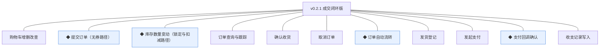

认领条目表（需求名／用途／验收标准逐字引自 02 批次二需求表）：

| 编号 | 需求名 | 用途 | 验收标准 |
|---|---|---|---|
| R21 | 购物车增删改查 | 暂存与合并选购 | 买家登录后可将商品规格加入购物车、调整数量与移除，重复加入同规格合并数量，失效商品（下架/删除）在购物车标记不可结算 |
| R22 | ◆ 提交订单（无券路径） | 把选购变成交易事实 | 买家选定收货地址提交订单后生成订单与成交快照（时点价格），同笔库存锁定成功，金额为分单位整数，不满足（可售不足/地址缺失）则整单失败不留占用 |
| R23 | ◆ 库存数量变动（锁定与扣减路径） | 为成交闭环提供数量一致性 | 提交订单按条件更新锁定对应规格库存（可售不足则下单失败），支付成功核减锁定量；变动台账留痕可查 |
| R24 | 订单查询与跟踪 | 两端掌握订单进度 | 买家在商城端查看本人订单列表与详情并跟踪物流状态，订单履约人员在管理端按状态/单号检索订单，状态展示与术语表状态名逐字一致 |
| R25 | 确认收货 | 买家收尾交易 | 买家对已发货订单确认收货后订单转已完成；发货后超时未确认的订单自动确认（时限为版本级默认值） |
| R26 | 取消订单 | 买家主动放弃待支付订单 | 买家对待支付订单执行取消后订单转已取消，锁定的库存即时释放；非待支付订单不可取消 |
| R27 | ◆ 订单自动流转 | 减少两侧悬空等待 | 支付超时的待支付订单自动取消并释放占用，已发货订单超时自动确认收货，自动流转与手动动作同机制且留痕，任务可重入幂等 |
| R28 | 发货登记 | 履约侧接单发货 | 订单履约人员对待发货订单登记承运方与物流单号后订单转已发货，商城端即时可跟踪 |
| R29 | 发起支付 | 买家为订单付款 | 买家对待支付订单发起在线支付，经支付渠道完成付款，支付渠道经适配层可替换 |
| R30 | ◆ 支付回调确认 | 落实交易事实 | 支付渠道回调到达后经防重验签确认，支付单转支付成功、订单转待发货、库存锁定转扣减、收入记录写入台账，全部变更同事务成立，重复回调不产生第二份事实 |
| R31 | 收支记录写入 | 沉淀交易收入事实 | 支付成功回调确认的同事务内向订单收支记录写入一条收入记录（金额分单位、关联支付单号），写入幂等不重复 |

锚定说明：以上三列为逐字锚，本文第 4 章的细化只加深行为描述、不与锚冲突、不收窄或放宽验收；验收按锚逐条执行（并补验 v0.2.0 交付说明标注的 R15 下单登录引导段与 R16 下单地址默认选中段）。

## 3. 核心用户旅程

**旅程承接说明**：大版本 PRD 旅程一「购买」的成交段整条落在本版（承接 v0.2.0 的逛与身份段）；本条旅程跨主体跨端（买家×订单履约人员），用时序图细化到操作与反馈级；自动流转为机制不成旅程（随 R27 小节）。

### 3.1 旅程一：购买（买家 × 订单履约人员，跨主体跨端）

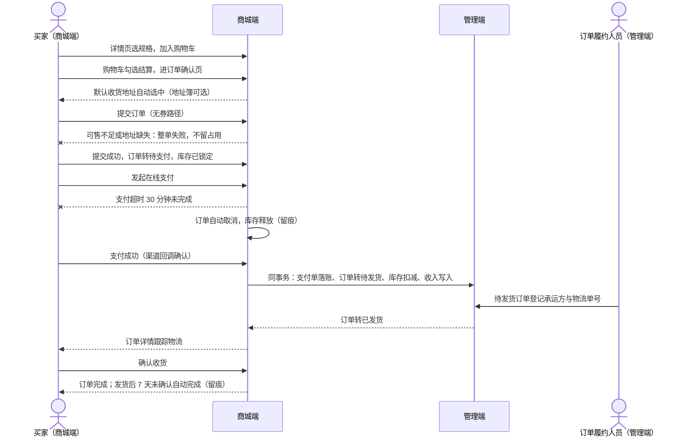

文字：买家自主完成选购到收货；异常主分支两条——下单失败（可售不足/地址缺失，整单失败不留占用）与支付超时自动取消（30 分钟，行业惯例默认）；支付成功为关键交接点：同事务完成支付单落账、订单转待发货、库存锁定转扣减、收入记录写入（04C-交易 3.7）；结束态订单完成（买家确认或发货后 7 天超时自动确认，行业惯例默认）。

操作步骤清单：
1. 买家登录后（沿用 v0.2.0）在详情页选规格加入购物车（或立即购买直达确认页）。
2. 购物车勾选条目结算，进入订单确认页；默认收货地址自动选中，可切换地址簿其他地址。
3. 确认金额明细（商品小计合计，本版无优惠项），提交订单；失败按提示返回修正。
4. 提交成功订单转待支付（库存已锁定），发起在线支付。
5. 支付成功订单转待发货；超时 30 分钟未支付自动取消并释放库存。
6. 订单履约人员在管理端按待发货检索，登记承运方与物流单号。
7. 买家在订单详情跟踪物流，收货后确认；发货后 7 天未确认自动完成。
8. 有问题走人工售后渠道（过渡安排：电话/商户后台退款，管理端订单查询核对）。

## 4. 功能需求

### 4.1 功能总览

对象归组树（版本→对象→条目）：

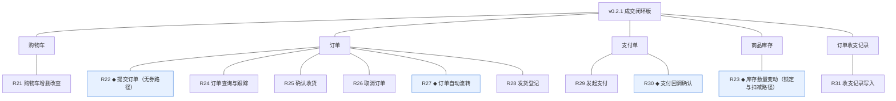

对象增删改查矩阵：

| 对象 | 增 | 改 | 删 | 查 |
|---|---|---|---|---|
| 购物车 | R21 加入 | R21 数量调整 | R21 移除条目 | R21 列表（结算时消费） |
| 订单 | R22 提交生成 | R25/R26/R27/R28 状态流转（改状态而非内容，D6） | 不做（订单不删，规范） | R24 两端检索与详情 |
| 订单项 | R22 随订单生成 | 不做（成交快照不可改，D6） | 不做 | 随订单详情 |
| 支付单 | R29 发起创建 | R30 状态落账、R26/R27 关闭 | 不做（单据只追加） | 随订单 |
| 商品库存 | 已于 v0.1.1 交付（设置/调整） | R23 锁定/扣减（及取消释放，条件更新） | 不做（台账只留痕） | 随商品档案（管理端） |
| 订单收支记录 | R31 收入写入（只追加） | 不做（D8 只读生成） | 不做 | 查询随 0.4 |

主体使用面：

| 主体／角色 | 使用条目 | 说明 |
|---|---|---|
| 买家（商城端） | R21、R22、R24（本人订单）、R25、R26、R29 | 成交链路买家侧全操作 |
| 订单履约人员（管理端） | R24（管理端检索）、R28 | 待发货处理与物流登记 |
| 系统（机制） | R23、R27、R30、R31 | 同事务协作与调度，无人工触发面 |

机制条目（无人工触发面）：R23 库存变动（随 R22/R30 事务内）、R27 自动流转（调度任务）、R30 回调确认（支付渠道触发）、R31 收入写入（随 R30 事务内）——四条均无独立操作界面，效果经 R24 状态与台账呈现。

### 4.2 R21 购物车增删改查

**功能说明**：暂存与合并选购。触发：买家在商品详情页点击"加入购物车"，或底部导航进入购物车。

**交互与流程**：

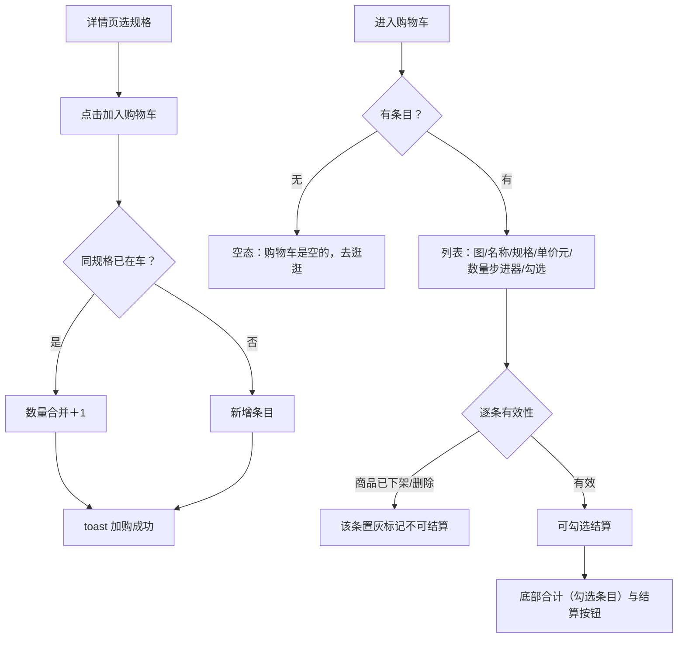

操作步骤清单：① 详情页选规格加购（重复加购合并数量）；② 进购物车查看列表；③ 步进器调整数量（下限 1、上限为可售数与 99 取小，本版定）；④ 移除条目（二次确认）；⑤ 勾选条目实时合计；⑥ 失效条目置灰不可勾选；⑦ 点结算进订单确认页（R22）。

**字段与校验**：

| 信息项 | 必填 | 校验 | 失败反馈 |
|---|---|---|---|
| 规格（SKU） | 是 | 商品处于已上架 | 商品已下架时加购拦截："商品已下架" |
| 数量 | 是 | 1~99 且不超过当前可售数 | "最多可购 N 件"（N＝可售数与 99 取小） |
| 勾选 | — | 仅有效条目可勾选 | — |

**规则与边界**：
1. 购物车按顾客聚合（一人一车）；条目单价与名称实时取商品信息，成交以提交时点价（D6）。
2. 失效（下架/删除）条目不自动移除，置灰标记不可结算（验收锚）。
3. 结算仅含勾选的有效条目；单次结算条目上限 20（本版定）。

**异常与拦截**：

| 异常场景 | 系统行为 |
|---|---|
| 空购物车 | 空态："购物车是空的，去逛逛"（跳首页） |
| 加购已下架商品 | 拦截："商品已下架" |
| 数量超可售 | 步进器上限截断并提示"最多可购 N 件" |

### 4.3 R22 ◆ 提交订单（无券路径）

**功能说明**：把选购变成交易事实。触发：买家从购物车结算或详情页"立即购买"进入订单确认页，点击"提交订单"。

**交互与流程**：

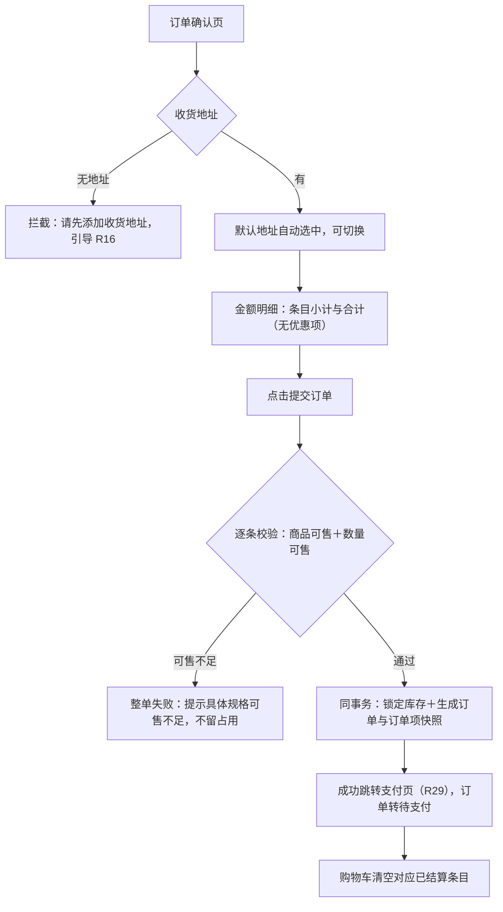

操作步骤清单：① 结算进入确认页（默认地址自动选中——R16 锚补验点）；② 切换地址或保持默认；③ 查看金额明细；④ 提交订单；⑤ 失败按提示返回修正（补地址/调数量）；⑥ 成功进入支付，订单转待支付、购物车清空对应条目。

**字段与校验**：

| 信息项 | 必填 | 校验 | 失败反馈 |
|---|---|---|---|
| 收货地址 | 是 | 地址簿中一条 | "请先添加收货地址" |
| 结算条目 | 是 | ≥1 条有效条目 | "请选择要结算的商品" |
| 数量 | 是 | 逐条不超过可售数 | "「规格名」可售不足，仅剩 N 件" |

**规则与边界**：
1. 订单号＝`ORD`＋日期＋6 位序列（编码契约）；金额全程分单位整数（K10）。
2. 订单项写入成交快照（商品名/规格名/时点价，`_snapshot` 字段，D6）。
3. 库存锁定与订单生成同一本地事务，任一失败整单回滚不留占用（验收锚；04C-交易 3.6）。
4. 同事务内不做外部调用（规范）；支付发起在事务提交后（R29）。
5. "立即购买"跳过购物车直接生成单条目确认页（本版定）。

**异常与拦截**：

| 异常场景 | 系统行为 |
|---|---|
| 无地址 | 拦截并引导新增地址 |
| 可售不足 | 整单失败并列出具体规格，不留占用 |
| 提交瞬间商品下架 | 整单失败："商品已下架，请重新选购" |

### 4.4 R23 ◆ 库存数量变动（锁定与扣减路径）

**功能说明**：为成交闭环提供数量一致性（随事务的协作机制，无独立界面）。触发：R22 提交订单（锁定）、R30 支付回调（扣减）、R26/R27 取消（释放）。

**交互与流程**：

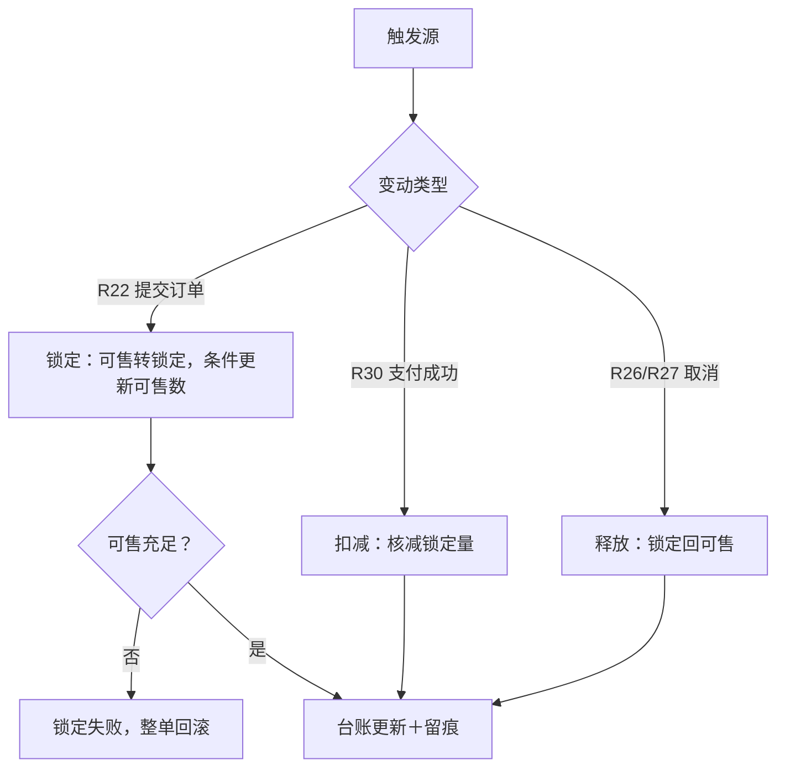

操作步骤清单（系统侧）：① 提交订单事务内按 SKU 条件更新（可售数－N、锁定＋N）；② 支付成功事务内核减锁定；③ 取消/超时取消事务内释放锁定；④ 每次变动追加台账留痕（类型/前后值/关联单号/操作者或自动标记）。

**字段与校验**：无人工表单（机制条目）——消费字段＝prod_stock 的 available_qty/locked_qty 与关联单号。

**规则与边界**：
1. 变动一律条件更新（可售数前置条件），并发下不超卖（K5、规范）。
2. 留痕只增；变动类型与关联单号可回溯（验收锚"台账留痕可查"）。
3. 回补路径随 0.4（04C-商品 3.8）；本版台账 locked_qty 随锁定/扣减/释放真实变动。

**异常与拦截**：

| 异常场景 | 系统行为 |
|---|---|
| 并发下单同一 SKU 可售不足 | 条件更新失败者整单失败，不超卖 |
| 锁定后商品下架 | 既有订单不受影响（快照与锁定已成立，D6） |

### 4.5 R24 订单查询与跟踪

**功能说明**：两端掌握订单进度。触发：买家在商城端"我的订单"；订单履约人员在管理端订单管理。

**交互与流程**：

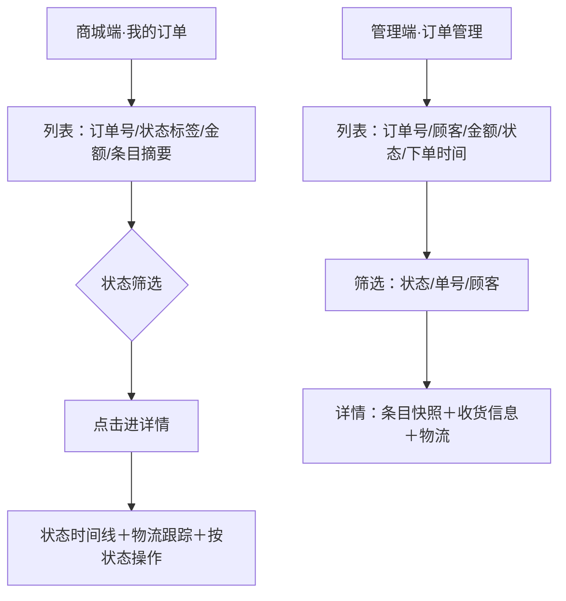

操作步骤清单（买家）：① 进入我的订单按状态筛选（待支付/待发货/已发货/已完成/已取消）；② 打开详情看状态时间线与物流跟踪；③ 按状态执行操作（支付 R29、取消 R26、确认收货 R25）。操作步骤清单（履约）：① 管理端按待发货筛选；② 打开订单核对条目与收货信息；③ 登记发货（R28）。

**字段与校验**：

| 信息项 | 必填 | 校验 | 失败反馈 |
|---|---|---|---|
| 状态筛选 | 否 | 五态枚举 | — |
| 单号检索（管理端） | 否 | 精确匹配订单号 | 无结果空态"未找到该订单" |

**规则与边界**：
1. 商城端仅见本人订单（customer_id 隔离）；管理端见全部（本版无二次划分，D4 能力点级）。
2. 状态展示与术语表逐字一致：待支付/待发货/已发货/已完成/已取消（"售后中"态随 0.4 交付，本版不可达也不展示）。
3. 管理端订单查询同时作为本版人工售后核对支撑（过渡安排承接）。

**异常与拦截**：

| 异常场景 | 系统行为 |
|---|---|
| 买家越权访问他人订单 | 拦截："无权查看该订单" |
| 检索无结果 | 空态："未找到该订单"/商城端"暂无相关订单" |

### 4.6 R25 确认收货

**功能说明**：买家收尾交易。触发：买家对已发货订单点击"确认收货"。

**交互与流程**：

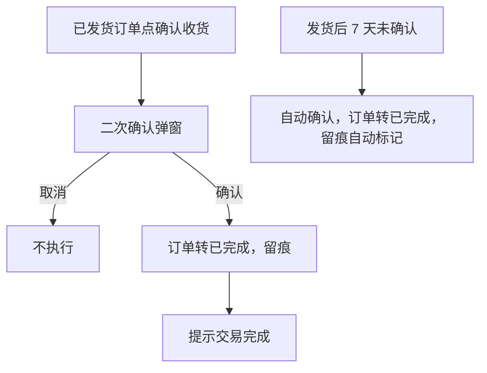

操作步骤清单：① 已发货订单详情或列表点确认收货；② 二次确认后订单完成；③ 发货后 7 天未操作自动确认（行业惯例默认，R27 执行）；④ 完成后订单归入已完成筛选。

**字段与校验**：无新增表单（操作型）——确认弹窗展示订单号、条目摘要与金额。

**规则与边界**：
1. 仅已发货态可确认；其余状态按钮不出现（验收锚口径）。
2. 自动确认时限＝发货后 7 天（行业惯例默认）；自动与手动同机制、留痕区分触发方式。
3. 订单完成后开放评价的联动随 0.5（本版完成后无后续动作）。

**异常与拦截**：

| 异常场景 | 系统行为 |
|---|---|
| 重复确认 | 提示"订单已完成"，不重复变更 |

### 4.7 R26 取消订单

**功能说明**：买家主动放弃待支付订单。触发：买家对待支付订单点击"取消订单"。

**交互与流程**：

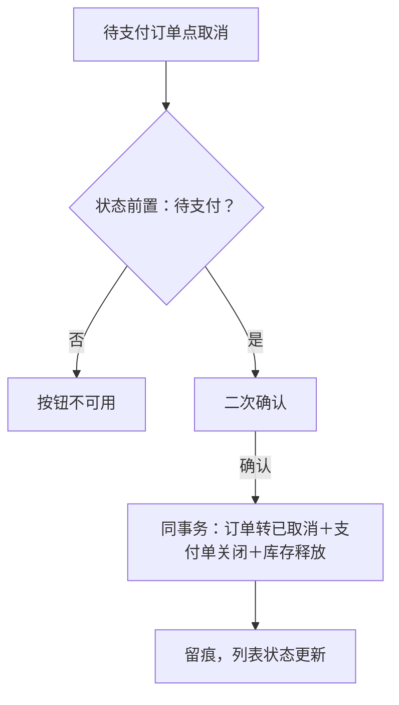

操作步骤清单：① 待支付订单点取消；② 二次确认后订单转已取消；③ 库存锁定即时释放；④ 已发起未完成的支付随订单关闭。

**字段与校验**：无新增表单（操作型）。

**规则与边界**：
1. 仅待支付可取消（验收锚）；待发货起的取消走售后路径（0.4 前人工过渡）。
2. 取消与库存释放、支付单关闭同事务（04C-交易 3.8）。
3. 取消后同单据不可复活，重新购买生成新订单。

**异常与拦截**：

| 异常场景 | 系统行为 |
|---|---|
| 支付处理中取消 | 以支付渠道事实为准：回调已成功则取消拦截并转待发货；未成功则取消成立（本版定） |

### 4.8 R27 ◆ 订单自动流转

**功能说明**：减少两侧悬空等待（调度任务，无人工触发面）。触发：系统定时扫描（每分钟，本版定）。

**交互与流程**：

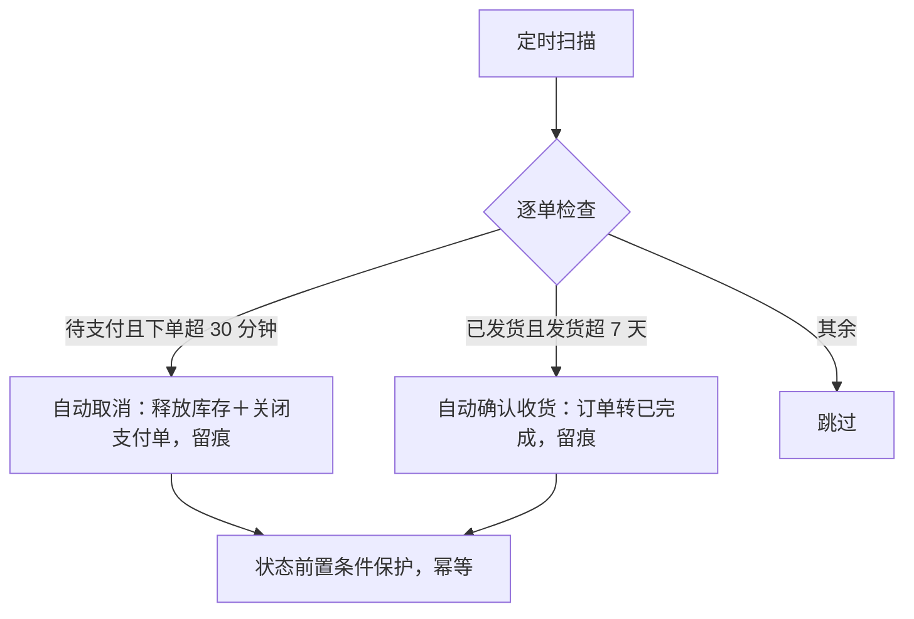

操作步骤清单（系统侧）：① 每分钟扫描待支付与已发货订单；② 下单超 30 分钟未支付自动取消；③ 发货超 7 天未确认自动完成；④ 全部与手动动作同机制、留痕标记自动。

**字段与校验**：无人工表单（机制条目）——消费字段＝下单时间与发货时间对照时限。

**规则与边界**：
1. 时限＝支付 30 分钟、自动确认 7 天（行业惯例默认，PRD 大版本版本级默认值落地）。
2. 自动取消与手动取消同机制（走同一取消路径）；任务可重入幂等（D7、规范）。
3. 时限值留后续按经营节奏调整（回 PRD 修订，不在运行时配置）。

**异常与拦截**：

| 异常场景 | 系统行为 |
|---|---|
| 扫描瞬间买家完成支付 | 状态前置条件保护：取消失败留痕，订单按支付事实流转 |
| 同周期重复触发 | 幂等，仅一条留痕 |

### 4.9 R28 发货登记

**功能说明**：履约侧接单发货。触发：订单履约人员在管理端对待发货订单点击"发货"。

**交互与流程**：

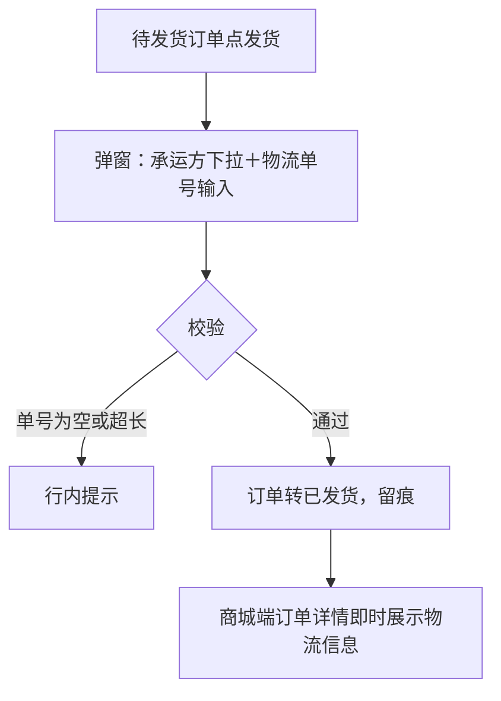

操作步骤清单：① 管理端按待发货筛选订单；② 点击发货，选择承运方、输入物流单号；③ 保存后订单转已发货；④ 商城端详情展示承运与单号、可跟踪。

**字段与校验**：

| 信息项 | 必填 | 校验 | 失败反馈 |
|---|---|---|---|
| 承运方 | 是 | 下拉选择（预设清单，本版定） | "请选择承运方" |
| 物流单号 | 是 | 8~30 位字母数字 | "物流单号需为 8~30 位字母数字" |

**规则与边界**：
1. 仅待发货可登记（状态前置条件）。
2. 发货后信息不再修改（需更正走线下与买家沟通，本版定；修改入口随业务确认）。
3. 物流跟踪状态经 K11 渠道查询（0.2 大版本依赖行立项定案的渠道），本版详情展示承运与单号＋跟踪查询入口。

**异常与拦截**：

| 异常场景 | 系统行为 |
|---|---|
| 无待发货订单 | 空态："暂无待发货订单" |
| 重复发货 | 状态前置拦截："订单已发货" |

### 4.10 R29 发起支付

**功能说明**：买家为订单付款。触发：买家对待支付订单点击"去支付"。

**交互与流程**：

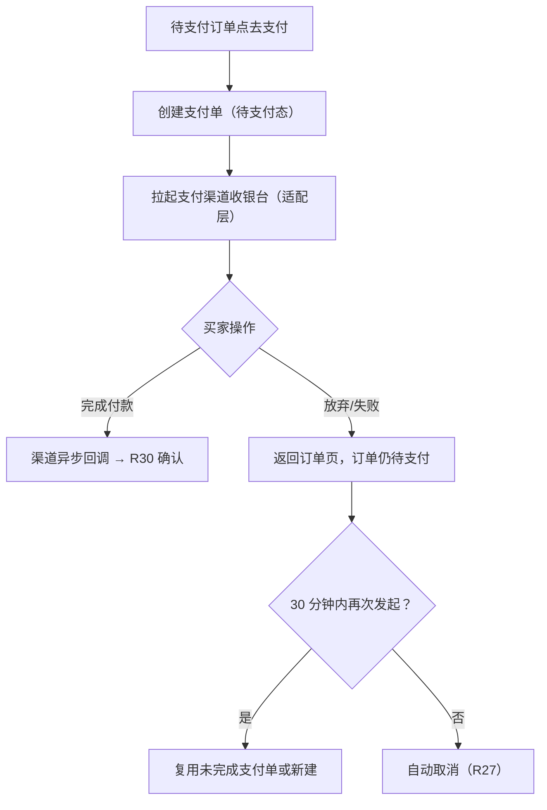

操作步骤清单：① 待支付订单点去支付；② 系统创建支付单并拉起渠道收银台；③ 买家完成付款后由渠道回调确认（R30）；④ 放付未完成可返回再试（30 分钟时限内）；⑤ 超时由 R27 自动取消。

**字段与校验**：

| 信息项 | 必填 | 校验 | 失败反馈 |
|---|---|---|---|
| 支付金额 | 是 | ＝订单应付金额（分） | — |
| 渠道 | 是 | 适配层注册的渠道 | 渠道不可用提示"支付渠道暂不可用，请稍后再试" |

**规则与边界**：
1. 每订单至多一个进行中（待支付）支付单；重试复用或换新以支付单号防重（04C-交易，规范幂等）。
2. 渠道经适配层可替换（K6）；模拟案例按沙箱口径（0.1 定案商户开户）。
3. 回调未到达前订单状态不因买家端"已付款"截图等改变——以回调事实为准（本版定）。

**异常与拦截**：

| 异常场景 | 系统行为 |
|---|---|
| 渠道拉起失败 | 提示重试，支付单保持待支付 |
| 订单已取消后发起支付 | 拦截："订单已取消" |

### 4.11 R30 ◆ 支付回调确认

**功能说明**：落实交易事实（渠道触发的协作机制，无独立人工界面）。触发：支付渠道异步回调到达。

**交互与流程**：

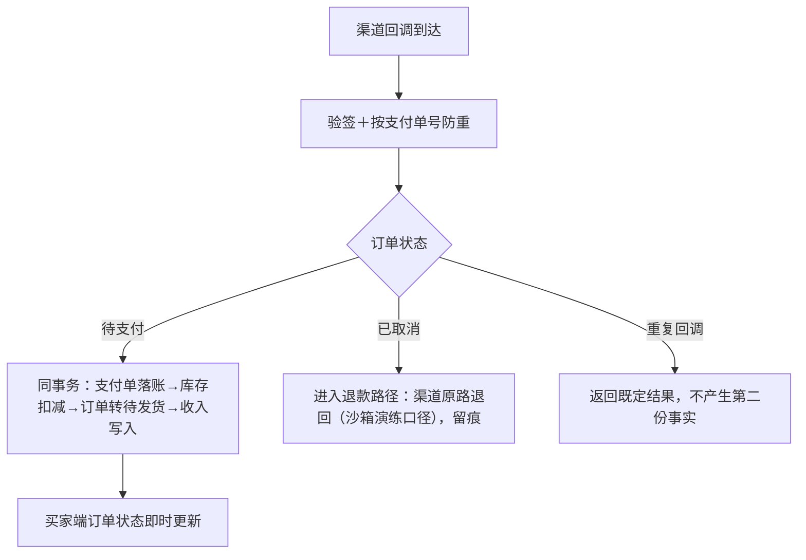

操作步骤清单（系统侧）：① 回调验签、按 payment_no 防重；② 同事务完成四项变更（支付单转支付成功、库存锁定转扣减、订单转待发货、收入记录写入）；③ 订单已取消的进入原路退回处理并留痕；④ 重复回调直接返回既定结果。

**字段与校验**：无人工表单（机制条目）——消费字段＝payment_no、验签凭据、回调金额（与支付单一致校验，不一致留痕告警拒认，本版定）。

**规则与边界**：
1. 四项变更同一本地事务，任一失败整体回滚并按渠道重试机制重放（验收锚；04C-交易 3.7）。
2. 回调金额与支付单不一致：拒认并告警留痕（本版定）。
3. 支付成功前订单已取消：资金原路退回（沙箱演练口径），不产生收入记录。

**异常与拦截**：

| 异常场景 | 系统行为 |
|---|---|
| 验签失败 | 拒收回调，留痕告警 |
| 金额不一致 | 拒认，留痕告警人工介入 |
| 订单已取消 | 原路退回，留痕 |

### 4.12 R31 收支记录写入

**功能说明**：沉淀交易收入事实（随 R30 事务的写入机制，无独立界面）。触发：R30 支付回调确认同事务内。

**交互与流程**：

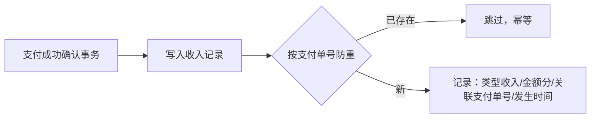

操作步骤清单（系统侧）：① 支付成功事务内向 rpt_order_finance 写入一条收入记录；② 以关联支付单号防重，重复不产生第二份（验收锚）；③ 记录只追加不可编辑（D8）。

**字段与校验**：无人工表单——写入字段见第 5 章订单收支记录字段表。

**规则与边界**：
1. 仅收入路径（record_type＝INCOME）；支出/冲正随 0.4（台账机制已定义）。
2. 台账查询界面随 0.4（04C-报表），本版写入的数据届时直接可查。

**异常与拦截**：

| 异常场景 | 系统行为 |
|---|---|
| 同支付单号重复写入 | 防重拦截（幂等跳过） |

## 5. 业务对象与数据字段

数据主体清单：

| 业务对象 | 落库名 | 定位与关系 |
|---|---|---|
| 购物车 | trade_cart_item | 按顾客聚合的暂存条目集；引用商品与 SKU 实时信息 |
| 订单 | trade_order | 交易主记录；含收货与物流信息、状态与时间点 |
| 订单项 | trade_order_item | 成交快照明细；随订单生成（D6） |
| 支付单 | trade_payment | 订单的在线支付记录；经适配层对接渠道（K6） |
| 商品库存 | prod_stock | 沿用 v0.1.1；本版启用锁定/扣减/释放路径 |
| 订单收支记录 | rpt_order_finance | 收入台账（D8 只读生成）；查询随 0.4 |
| 支付渠道配置 | 部署配置（机制态） | 渠道凭据经环境变量注入（规范），不落业务表 |

**购物车（trade_cart_item）字段表**：

| 字段 | 必填 | 业务类型 | 落库字段名 | 约束与取值 |
|---|---|---|---|---|
| 主键 | 是 | 标识 | id | 自增整型（编码契约） |
| 所属顾客 | 是 | 外键 | customer_id | 指向 cust_account.id |
| 商品 | 是 | 外键 | product_id | 指向 prod_product.id |
| 规格 | 是 | 外键 | sku_id | 指向 prod_sku.id；同顾客＋规格唯一（防重索引） |
| 数量 | 是 | 整数 | quantity | 1~99 且 ≤可售数 |
| 创建时间／更新时间／逻辑删除 | 是 | 审计 | created_at／updated_at／deleted | 编码契约 |

**订单（trade_order）字段表**：

| 字段 | 必填 | 业务类型 | 落库字段名 | 约束与取值 |
|---|---|---|---|---|
| 主键 | 是 | 标识 | id | 自增整型 |
| 订单号 | 是 | 业务单号 | order_no | ORD＋日期＋6 位序列（编码契约），唯一 |
| 顾客 | 是 | 外键 | customer_id | 指向 cust_account.id |
| 状态 | 是 | 枚举 | status | PENDING_PAY／PENDING_SHIP／SHIPPED／COMPLETED／CANCELLED（术语表；AFTER_SALE 随 0.4 交付） |
| 应付金额 | 是 | 金额（分） | total_amount | 正整数（K10） |
| 收货人快照 | 是 | 文本 | receiver_name_snapshot | 下单时点快照（D6） |
| 收货手机快照 | 是 | 文本 | receiver_mobile_snapshot | 同上 |
| 收货地区快照 | 是 | 文本 | receiver_region_snapshot | 同上 |
| 收货详址快照 | 是 | 文本 | receiver_detail_snapshot | 同上 |
| 承运方 | 否 | 文本 | carrier_name | 发货登记填入 |
| 物流单号 | 否 | 文本 | logistics_no | 8~30 位字母数字 |
| 下单时间 | 是 | 时间 | created_at | 审计字段兼下单时点（编码契约） |
| 支付时间 | 否 | 时间 | paid_at | 回调确认时写入 |
| 发货时间 | 否 | 时间 | shipped_at | 发货登记时写入 |
| 完成时间 | 否 | 时间 | completed_at | 确认收货（含自动）时写入 |
| 取消时间 | 否 | 时间 | cancelled_at | 取消（含自动）时写入 |
| 更新时间／逻辑删除 | 是 | 审计 | updated_at／deleted | 编码契约 |

**订单项（trade_order_item）字段表**：

| 字段 | 必填 | 业务类型 | 落库字段名 | 约束与取值 |
|---|---|---|---|---|
| 主键 | 是 | 标识 | id | 自增整型 |
| 所属订单 | 是 | 外键 | order_id | 指向 trade_order.id |
| 规格 | 是 | 外键 | sku_id | 指向 prod_sku.id |
| 商品名快照 | 是 | 文本 | product_name_snapshot | 成交时点（D6） |
| 规格名快照 | 是 | 文本 | sku_name_snapshot | 成交时点 |
| 成交单价快照 | 是 | 金额（分） | price_snapshot | 正整数 |
| 数量 | 是 | 整数 | quantity | 1~99 |
| 小计金额 | 是 | 金额（分） | subtotal_amount | 单价×数量（分） |
| 创建时间／更新时间／逻辑删除 | 是 | 审计 | created_at／updated_at／deleted | 编码契约 |

**支付单（trade_payment）字段表**：

| 字段 | 必填 | 业务类型 | 落库字段名 | 约束与取值 |
|---|---|---|---|---|
| 主键 | 是 | 标识 | id | 自增整型 |
| 支付单号 | 是 | 业务单号 | payment_no | PAY＋日期＋6 位序列（编码契约），唯一 |
| 订单 | 是 | 外键 | order_id | 指向 trade_order.id |
| 支付金额 | 是 | 金额（分） | pay_amount | ＝订单应付金额 |
| 渠道 | 是 | 文本 | channel | 适配层注册标识（K6） |
| 状态 | 是 | 枚举 | status | PENDING／PAID／CLOSED（术语表；REFUNDED 随 0.4） |
| 支付成功时间 | 否 | 时间 | paid_at | 回调确认时写入 |
| 创建时间／更新时间／逻辑删除 | 是 | 审计 | created_at／updated_at／deleted | 编码契约 |

**订单收支记录（rpt_order_finance）字段表**：

| 字段 | 必填 | 业务类型 | 落库字段名 | 约束与取值 |
|---|---|---|---|---|
| 主键 | 是 | 标识 | id | 自增整型 |
| 记录类型 | 是 | 枚举 | record_type | INCOME（本版仅收入；EXPENSE／REVERSAL 随 0.4，术语表） |
| 金额 | 是 | 金额（分） | amount | 正整数（K10） |
| 关联单号 | 是 | 业务单号 | related_no | 支付单号（收入）；唯一索引防重（规范） |
| 发生时间 | 是 | 时间 | occurred_at | 支付成功时点 |
| 创建时间／更新时间／逻辑删除 | 是 | 审计 | created_at／updated_at／deleted | 编码契约 |

（商品库存沿用 v0.1.1 字段；库存变动留痕随台账机制，记录形态由开发阶段定——机制态。）

## 6. 待议与建议

**本版采用的推断与默认值汇总**：

| 采用值 | 来源状态 | 位置 |
|---|---|---|
| 支付超时 30 分钟、发货后 7 天自动确认 | 行业惯例默认（PRD 大版本版本级默认值落地） | R27／R25 |
| 购物车数量上限 99 与可售取小；单次结算条目上限 20；立即购买直达确认页 | 本版定 | R21／R22 |
| 支付处理中取消以渠道回调事实为准；回调金额不一致拒认告警；订单已取消的原路退回（沙箱演练口径） | 本版定 | R26／R30 |
| 发货信息提交后不可修改（更正走线下）；承运方预设清单 | 本版定 | R28 |
| 每订单至多一个进行中支付单 | 04C-交易 口径落地 | R29 |

**待确认内容与影响**：自动流转时限的经营调整走 PRD 修订（影响 R27）；发货信息更正入口（影响 R28）；物流跟踪渠道展示形态（K11 渠道定案后的呈现细节）。

**建议回池的新想法与术语表待登记行**：无新想法回池。术语表待登记（本版新定名，随认领回报合入术语表）：新落库表 trade_cart_item、trade_order、trade_order_item、trade_payment、rpt_order_finance；新落库字段名 trade_cart_item：customer_id、product_id、sku_id、quantity；trade_order：order_no、customer_id、status、total_amount、receiver_name_snapshot、receiver_mobile_snapshot、receiver_region_snapshot、receiver_detail_snapshot、carrier_name、logistics_no、paid_at、shipped_at、completed_at、cancelled_at、updated_at、deleted；trade_order_item：order_id、sku_id、product_name_snapshot、sku_name_snapshot、price_snapshot、quantity、subtotal_amount、updated_at、deleted；trade_payment：payment_no、order_id、pay_amount、channel、status、paid_at、updated_at、deleted；rpt_order_finance：record_type、amount、related_no、occurred_at、updated_at、deleted（注：quantity/status/updated_at/deleted 等通用名跨表复用，按唯一名与出现处两种口径在登记行注明）。
