# PRD（大版本）：0.3 营销促活版

> 本文是 0.3 营销促活版的立项说明书：把产品路线图 0.3 条目承接为本版需求——做什么、不做什么、每个功能做到什么程度算完成；承接项目 PRD 与模块设计，机制不重写。上游为模拟案例材料，模拟性质予以保留。

## 1. 版本概述

**承接与目标**：0.2 已达成商城开张（成交闭环全通）。本版目标：开张后的生意有促销抓手——券与秒杀可配置、可参与、可核销（路线图 2.3）。

**成功标准与量化口径**：完成标志（承接路线图 0.3）——真实买家用券完成一笔订单并正确核销；一场秒杀活动从配置到售罄或到期自动结束全程无人工干预。量化口径（承接路线图验证假设）：促销拉动复购，判定方式为活动期用券／秒杀下单占比对比日常同口径占比；具体对比基线与观测窗口于本版立项时随数据口径一并定案（依赖行已挂，原则：数据积累类验证不阻塞立项）。

**范围一句话**：做——优惠券模板与停用、发放与领取、持有查询与过期处理、核销与退回；秒杀活动配置、档期自动执行、秒杀下单联动；提交订单的用券与秒杀价成交路径；不做——退货退款与"售后中"态（0.4）；商品评价、咨询与帮助中心（0.5）；会员等级（0.6）；统计报表（0.7）；订单改价与人工备注外字段编辑（D6 推论）。**本版立项定案事项**（承接路线图 0.3 依赖行，PRD 备忘待议项唯一时点落地）：① 券规则——有效期采用"领取后 N 天"模板配置（行业惯例默认）；每人每模板限领 1 张（防重即唯一持有）；每订单限用 1 张券（本版定）；② 秒杀规则——每顾客每活动限购 1 件（本版定）；活动库存独立台账、售罄即止。

**沿用与前置**：沿用 0.1（商品货架与图片、能力点机制、管理端）与 0.2 全部（成交闭环、订单状态机、支付、内容位、顾客账号）；促销能力点（mkt_ 域）挂入既有角色机制（运营人员）；上线侧 0.2 灰度台阶仍在执行期，不阻塞本版开发立项（灰度冻结的只是全量开放与同风险面发布）。

## 2. 主体与角色

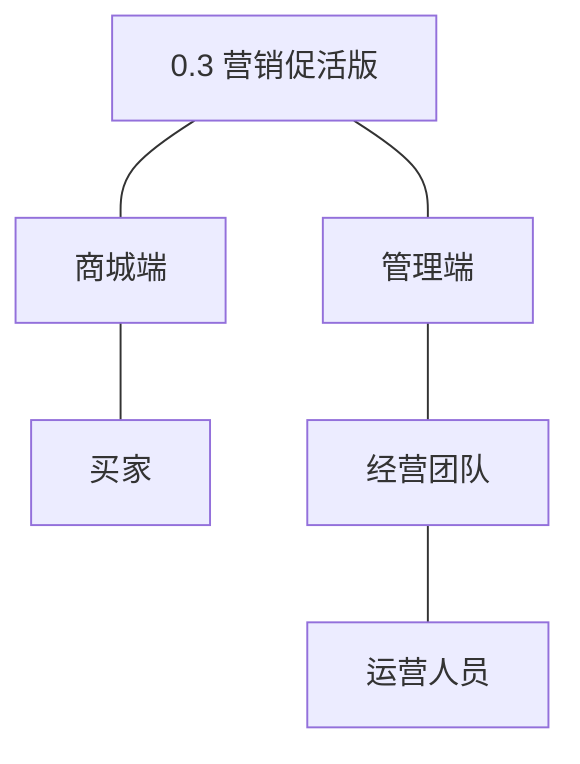

| 主体 | 角色 | 端 | 怎么用系统 |
|---|---|---|---|
| 买家 | 买家 | 商城端 | 领取优惠券、查看持券、下单用券抵扣；浏览秒杀活动、以秒杀价下单 |
| 经营团队 | 运营人员 | 管理端 | 配置优惠券模板与发放、配置秒杀活动与档期、查看持有情况 |

**裁剪说明**：订单履约人员沿用 0.2（促销订单履约无新增操作）；管理者沿用 0.1（mkt_ 域能力点授权）；客服人员仍无系统功能面（随 0.4/0.5）。

## 3. 核心业务流程

### 3.1 旅程一：配置促销（运营人员，单端）

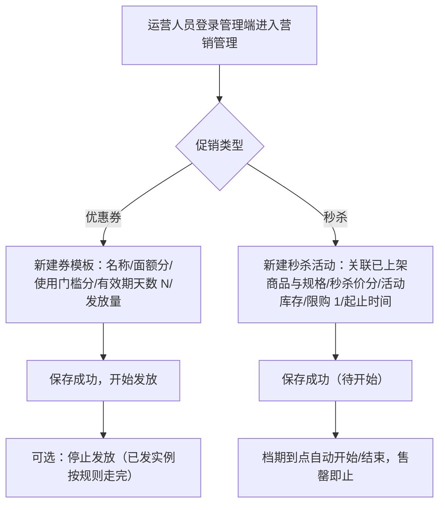

文字：券模板定义面额、门槛与有效期（领取后 N 天，行业惯例默认），停用仅停新发放、已发实例按规则到期（04C-营销 3.4 规则 2）；秒杀活动关联已上架商品、活动库存独立于商品库存台账，档期自动执行（沿用调度机制）。

操作步骤清单：① 管理端进入营销管理；② 新建券模板（面额与门槛为分单位整数、有效期天数 N≥1、发放量）并开启发放；③ （可选）停止发放；④ 新建秒杀活动（选商品与规格、定秒杀价与活动库存、档期）；⑤ 观察档期自动流转与售罄状态。

### 3.2 旅程二：领券与用券下单（买家，单端）

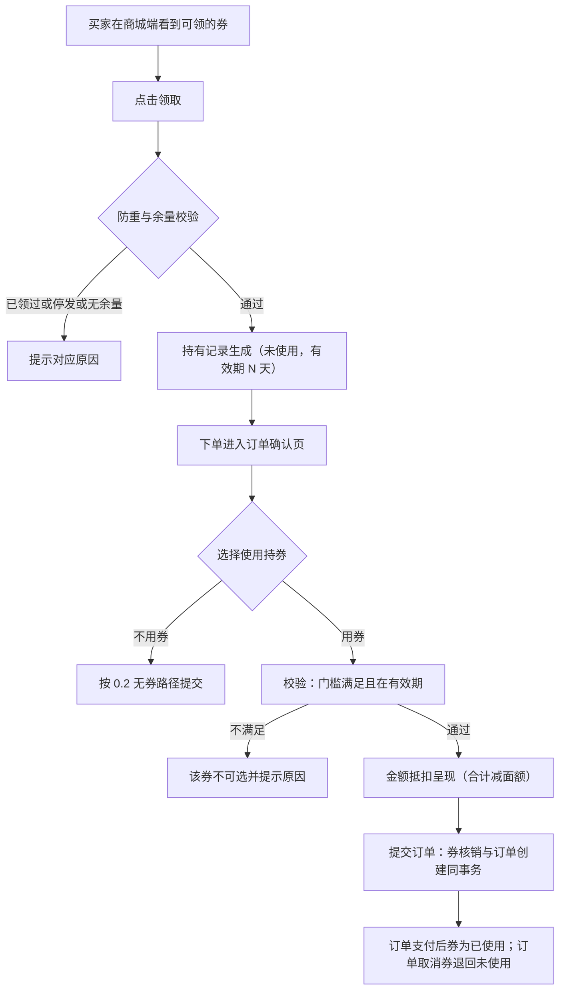

文字：领券防重（每人每模板 1 张）与限量占用同校验；用券在订单确认页选择，门槛与有效期校验不通过不可选；核销与订单创建同事务（04C-营销 3.5）；取消订单退回券（关联订单号幂等）。

操作步骤清单：① 商城端领取优惠券（重复领取提示已领过）；② 下单进确认页查看可用持券（不可用券置灰并标原因）；③ 选券后合计即时抵扣（每单限 1 张）；④ 提交订单（核销同事务）；⑤ 订单取消后持券回到未使用。

### 3.3 旅程三：秒杀参与（买家，单端）

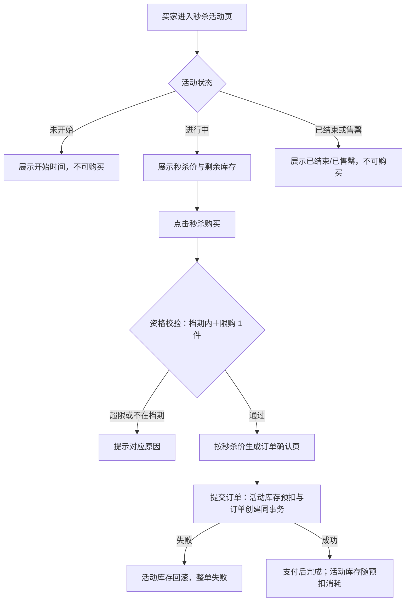

文字：秒杀资格＝活动进行中且未达限购（每顾客每活动 1 件，本版定）；下单与活动库存预扣同事务，失败即回滚；活动库存独立台账不动商品基准库存（04C-营销 3.6）。

操作步骤清单：① 进入活动页看状态（未开始/进行中/已结束/售罄）；② 进行中点击秒杀购买；③ 资格通过按秒杀价进确认页；④ 提交订单（预扣同事务）；⑤ 支付完成交易；重复购买提示已达限购。

## 4. 功能需求

功能全景总图：

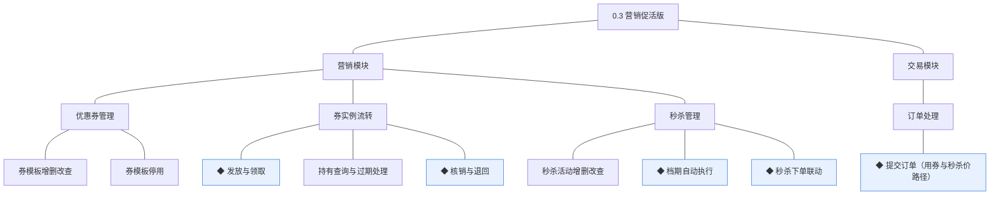

### 4.1 营销模块

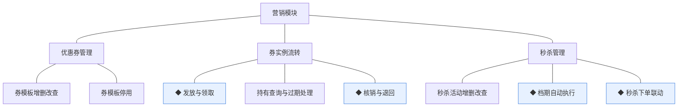

组说明：优惠券管理是运营的配置面；券实例流转贯通领取、使用与过期（核销与退回由交易在下单事务内调用）；秒杀管理承载活动配置、档期与下单联动（04C-营销）。

| 功能 | 用途 | 验收标准 |
|---|---|---|
| 券模板增删改查 | 定义券的面额与规则 | 运营人员新建券模板（名称、面额分、使用门槛分、有效期天数 N≥1、发放量）保存成功并可编辑，被持有的模板不可删除 |
| 券模板停用 | 停止新发放 | 运营人员停用模板后买家不可再领取，停用前已发持有记录按原有效期走完，动作留痕 |
| ◆ 发放与领取 | 把券发到买家名下 | 买家领取或运营批量发放时校验模板在发放中且有余量，每人每模板仅 1 张（重复领取拦截并提示），限量不超发，领取生成持有记录（未使用、有效期 N 天），动作留痕 |
| 持有查询与过期处理 | 买家查看与管理侧跟踪 | 买家在个人中心查看持券（未使用/已使用/已过期），到期的持有记录经档期任务自动转已过期，过期不可再用 |
| ◆ 核销与退回 | 用券占用与取消释放 | 买家下单用券时核销在同事务内完成（已使用并关联订单号，按订单号幂等），订单取消时退回未使用（仅原订单可退回），状态前置条件保护 |
| 秒杀活动增删改查 | 配置限时限量特价 | 运营人员新建秒杀活动（关联已上架商品与规格、秒杀价分、活动库存、每顾客限购 1 件、起止时间）保存成功，未开始的活动可编辑，开始后与被引用活动不可删除 |
| ◆ 档期自动执行 | 活动与券有效期自动流转 | 到达开始时间的活动自动转进行中，到达结束时间或售罄自动转已结束，券过有效期自动转已过期，任务可重入幂等且留痕 |
| ◆ 秒杀下单联动 | 秒杀价成交与活动库存一致 | 买家秒杀下单时资格校验（档期内＋限购 1 件）与活动库存预扣同事务，失败整单回滚，活动库存独立台账不超卖，限购以顾客＋活动计数防重 |

### 4.2 交易模块

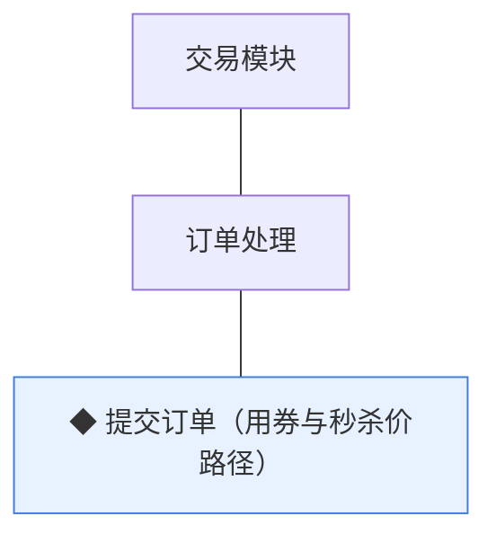

组说明：在 0.2 无券路径之上增补两条成交路径——用券抵扣与秒杀价成交；机制见 04C-交易 3.6，本版细化行为口径。

| 功能 | 用途 | 验收标准 |
|---|---|---|
| ◆ 提交订单（用券与秒杀价路径） | 促销价成交 | 买家用券下单时校验门槛与有效期并按面额抵扣（每单限 1 张券，合计不为负），核销与订单创建同事务；秒杀下单按秒杀价成交（资格与预扣同事务）；路径失败整单回滚不留占用 |

## 5. 业务对象

对象关系总览：

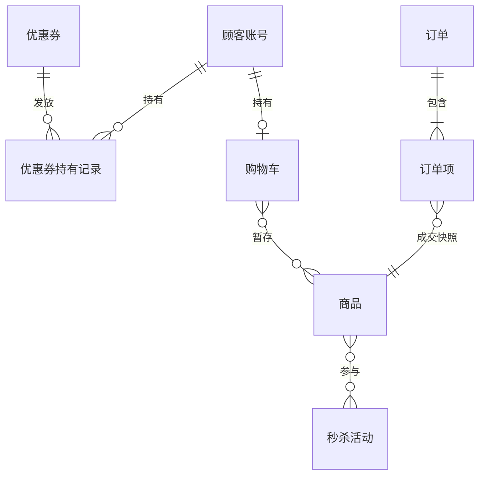

### 5.1 优惠券

定位：券模板——面额、使用条件与发放量的定义（模板与实例分离，04C-营销）。

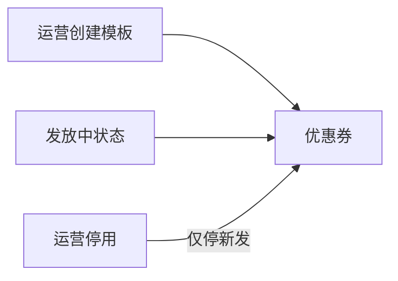

说明：无生命周期状态对象（以"停用"标记表达，管理标记而非状态机，04C-营销 4 节）；被持有的模板不可删除；本版规则落地——有效期类型＝领取后 N 天（行业惯例默认）、面额与门槛为分单位整数（K10）。

### 5.2 优惠券持有记录

定位：买家名下的券实例。

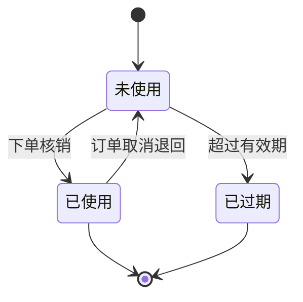

说明：本版三态全量交付；每顾客每模板唯一持有（防重唯一索引）；核销/退回由交易在订单事务内调用（关联订单号幂等）；已过期终态。

### 5.3 秒杀活动

定位：限时限量特价活动，活动库存独立台账。

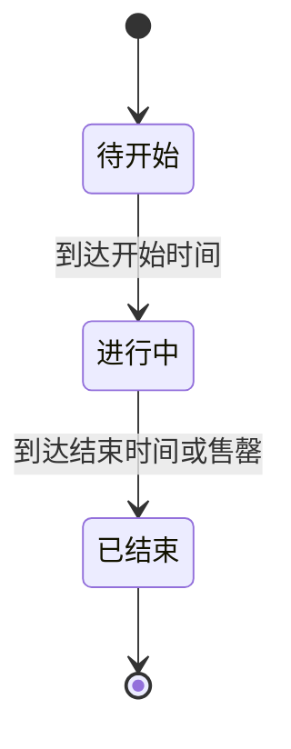

说明：本版三态全量交付；关联已上架商品与规格，秒杀价成交不动商品基准售价；活动库存独立扣减、售罄即止；限购＝每顾客每活动 1 件（本版定）。

### 5.4 订单（沿用 0.2 扩展）

定位：交易主记录（0.2 已交付五态流转）。

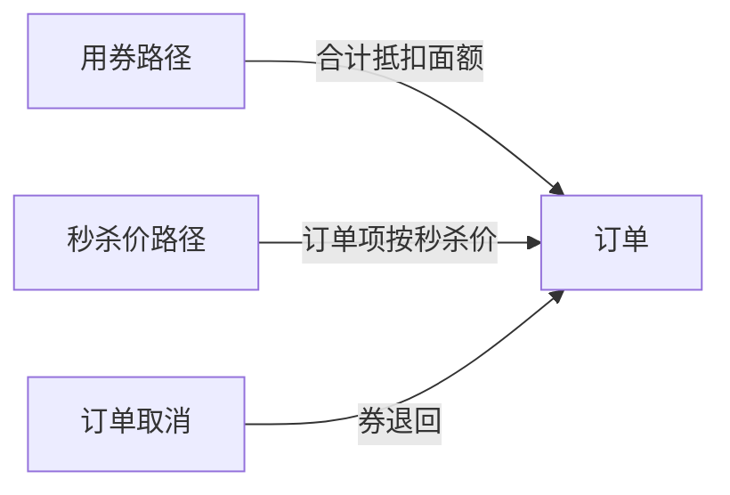

说明：沿用 0.2 状态机与字段；本版新增两条成交路径（用券抵扣与秒杀价），订单结构不变、金额按路径计算；"售后中"态仍随 0.4。

### 5.5 商品库存（沿用 0.2）

定位：SKU 级可售数量台账（0.2 已启用锁定/扣减/释放）。

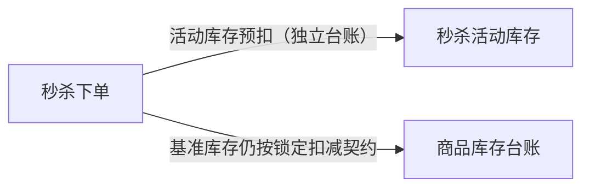

说明：秒杀活动库存独立于商品基准库存台账；秒杀订单的基准库存锁定/扣减仍按 0.2 契约执行（04C-营销 3.6 规则 2 口径）。

### 5.6 购物车／订单项／顾客账号（沿用）

说明：购物车沿用 0.2（促销价在确认页按路径呈现，购物车展示日常价）；订单项沿用快照机制（秒杀订单项快照价＝秒杀价，D6）；顾客账号沿用（持有记录为其关联对象）。
