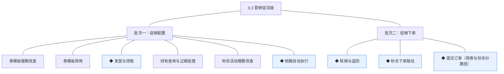
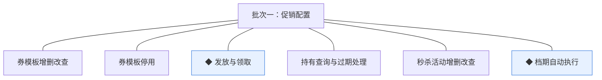
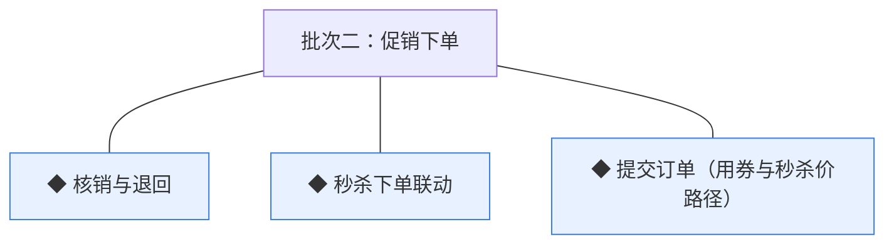

# 开发顺序与需求拆解（大版本）：0.3 营销促活版

> 本文把 0.3 大版本 PRD 转换为开发批次与功能级需求条目，同时即 0.3 版的完整需求清单（需求池据此直接入池，不另生成版本快照）。上游为模拟案例材料，模拟性质予以保留。

## 1. 拆解说明

- **做什么**：把 PRD 的 9 项功能排成可独立验收的开发批次，每项功能转为一条需求条目（R 编号沿用池序，本版 R32~R40），用途与验收标准逐字携带 PRD 原文。
- **粒度口径**：条目与 PRD 功能清单一一同构；交互、字段级细化归小版本 PRD。
- **与需求池及小版本规划的关系**：本文是需求池的**主入口但不是唯一入口**；小版本规划的输入＝本文开发顺序＋需求池实时状态合并，**批次划分是建议而非锁定**。

## 2. 开发顺序

**前置版本沿用面**：0.1 与 0.2 全部交付——商品货架与库存台账（锁定/扣减契约）、成交闭环（提交订单无券路径、订单状态机、取消退回机制）、顾客账号、管理端能力点机制（mkt_ 域能力点挂入运营人员）。

开发批次总图：

批次推进链：

**顺序依据**：批次一交付"可配置、可领取"——券模板与秒杀活动配置、领取与持有、档期流转，不触碰下单链路，可独立验收（配置→领取→持券可见→活动档期自动流转）；批次二交付"可核销、可成交"——核销/退回、秒杀联动与提交订单促销路径。**同事务契约（不可拆批）**：R38 核销与 R40 用券下单同事务（04C-营销 3.5、04C-交易 3.6）；R39 活动库存预扣与 R40 秒杀价下单同事务（04C-营销 3.6）——三条必须同批成立，故并入批次二。无外部联调点（支付与渠道沿用 0.2）。

### 2.1 批次一：促销配置

- **目标**：促销工具可配置、可领取——券与秒杀的管理端配置面和买家领取持有面。
- **依赖**：0.1／0.2 沿用面（商品与图片、顾客账号、能力点）；无新增外部依赖（本版立项定案事项已在 PRD 1 章落地为版本级采用值）。
- **可验收形态**：运营演示"新建券模板→开启发放→买家领取（重复领取拦截）→个人中心持券可见→停用模板仅停新发"；运营演示"新建秒杀活动→档期到点自动开始→到期或售罄自动结束"；买家演示"领券→持券状态与有效期呈现"。

条目与 PRD 4.1 节功能清单一一同构（核销与下单联动除外，归批次二），用途与验收标准逐字引自原文：

| 编号 | 需求名 | 用途 | 验收标准 |
|---|---|---|---|
| R32 | 券模板增删改查 | 定义券的面额与规则 | 运营人员新建券模板（名称、面额分、使用门槛分、有效期天数 N≥1、发放量）保存成功并可编辑，被持有的模板不可删除 |
| R33 | 券模板停用 | 停止新发放 | 运营人员停用模板后买家不可再领取，停用前已发持有记录按原有效期走完，动作留痕 |
| R34 | ◆ 发放与领取 | 把券发到买家名下 | 买家领取或运营批量发放时校验模板在发放中且有余量，每人每模板仅 1 张（重复领取拦截并提示），限量不超发，领取生成持有记录（未使用、有效期 N 天），动作留痕 |
| R35 | 持有查询与过期处理 | 买家查看与管理侧跟踪 | 买家在个人中心查看持券（未使用/已使用/已过期），到期的持有记录经档期任务自动转已过期，过期不可再用 |
| R36 | 秒杀活动增删改查 | 配置限时限量特价 | 运营人员新建秒杀活动（关联已上架商品与规格、秒杀价分、活动库存、每顾客限购 1 件、起止时间）保存成功，未开始的活动可编辑，开始后与被引用活动不可删除 |
| R37 | ◆ 档期自动执行 | 活动与券有效期自动流转 | 到达开始时间的活动自动转进行中，到达结束时间或售罄自动转已结束，券过有效期自动转已过期，任务可重入幂等且留痕 |

### 2.2 批次二：促销下单

- **目标**：促销成交贯通——用券抵扣与秒杀价成交两条路径接入提交订单，核销与预扣同事务。
- **依赖**：批次一（券模板与持有记录、秒杀活动与档期）；0.2（提交订单无券路径、库存锁定/扣减契约、取消退回机制）。
- **可验收形态**：买家演示"领券→下单选券抵扣（合计减面额）→提交→支付完成→券转已使用"；演示"取消该订单→券退回未使用"；买家演示"秒杀活动进行中→秒杀价下单→支付完成"，以及"重复秒杀购买被限购拦截""售罄后整单失败回滚"。

条目与 PRD 4.1／4.2 节功能清单一一同构，用途与验收标准逐字引自原文：

| 编号 | 需求名 | 用途 | 验收标准 |
|---|---|---|---|
| R38 | ◆ 核销与退回 | 用券占用与取消释放 | 买家下单用券时核销在同事务内完成（已使用并关联订单号，按订单号幂等），订单取消时退回未使用（仅原订单可退回），状态前置条件保护 |
| R39 | ◆ 秒杀下单联动 | 秒杀价成交与活动库存一致 | 买家秒杀下单时资格校验（档期内＋限购 1 件）与活动库存预扣同事务，失败整单回滚，活动库存独立台账不超卖，限购以顾客＋活动计数防重 |
| R40 | ◆ 提交订单（用券与秒杀价路径） | 促销价成交 | 买家用券下单时校验门槛与有效期并按面额抵扣（每单限 1 张券，合计不为负），核销与订单创建同事务；秒杀下单按秒杀价成交（资格与预扣同事务）；路径失败整单回滚不留占用 |

**批次判断与边界取舍**：①两批划分——"可配置可领取"与"可核销可成交"是两类可独立验收形态，批次一不触碰下单链路可先行演示；②批次二三条不拆——同事务契约内聚（核销×下单、预扣×下单），拆批则任何中间态不可验收（判断注记）；③档期自动执行归批次一（活动状态流转是配置面的自动化伴随，秒杀联动才依赖活动状态，判断注记）。

**版本级验收安排**：完成标志承接路线图——真实买家用券完成一笔订单并正确核销；一场秒杀从配置到售罄/到期自动结束无人工干预。复购占比对比的观测口径于本版立项定案（数据积累类验证不阻塞开发与验收）；无灰度新增风险面（促销不引入新的资金方向，0.2 灰度状态延续）。

## 3. 条目与 PRD 对应核对

- **一一同构声明**：条目数＝PRD 功能数＝9（R32~R40 逐行对应 PRD 4.1／4.2 节功能清单），无归并、无 PRD 外内容；路径条目 1 条（提交订单〔用券与秒杀价路径〕）为 PRD 原功能名整条交付。
- **批次构成**：批次一 6 条（营销模块：优惠券管理 2、券实例流转 2〔发放领取/持有查询〕、秒杀管理 2〔活动增删改查/档期〕）；批次二 3 条（营销模块 2〔核销退回/秒杀联动〕、交易模块 1）。
- **◆ 清点**：◆ 条目 5 条——R34 发放与领取、R37 档期自动执行、R38 核销与退回、R39 秒杀下单联动、R40 提交订单（用券与秒杀价路径），与 PRD 功能全景总图 ◆ 标记逐条一致。
- **过渡支撑清点**：无过渡支撑条目。

## 4. 与需求池和小版本规划的衔接

- **入池路径**：本表 9 条经需求池批量入池模式登记（编号 R32~R40、批次随本文继承）。
- **多入口口径**：会议、沟通、临时反馈的需求从其他入口直接单条入池（M01 起编号），与本表条目并存互不覆盖。
- **小版本规划的合并输入**：建议按批次一→批次二确认两个小版本（0.3.0 促销配置版认领 R32~R37、0.3.1 促销下单版认领 R38~R40），唯一硬约束是同事务契约不回退（R38/R39/R40 不拆批认领）。
- **认领与细化原则**：认领后的小版本 PRD 做开发级细化（券模板与活动的字段与校验、确认页选券交互、活动页状态呈现），验收以随行验收标准为锚。
