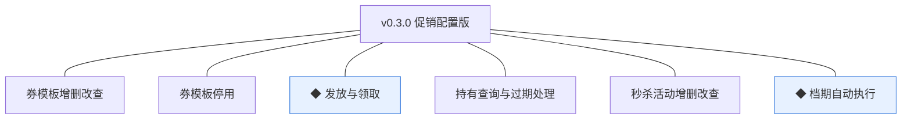
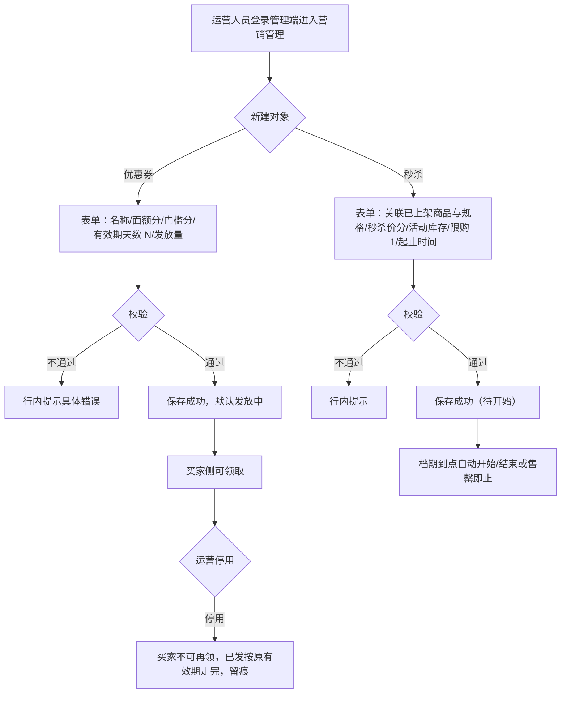
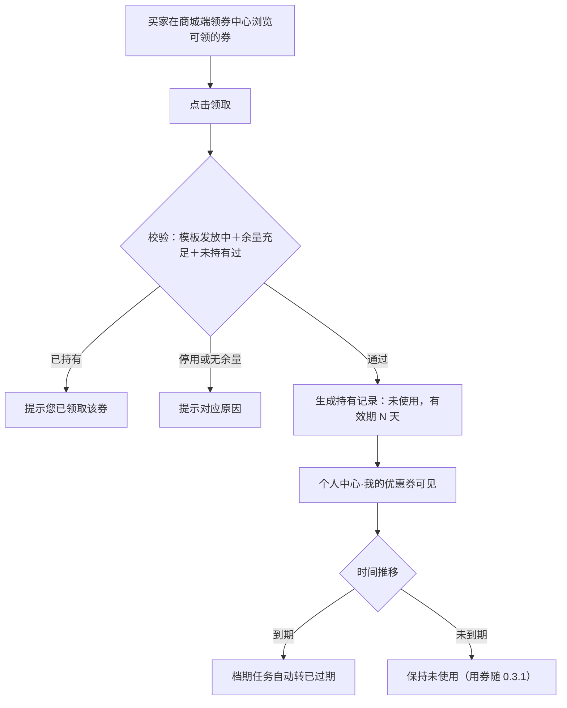
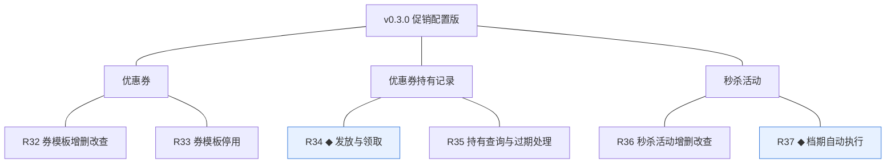
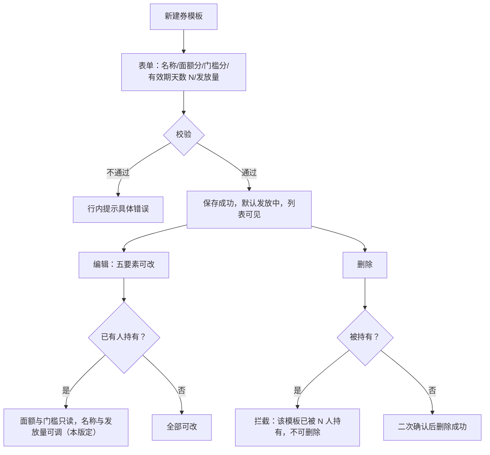
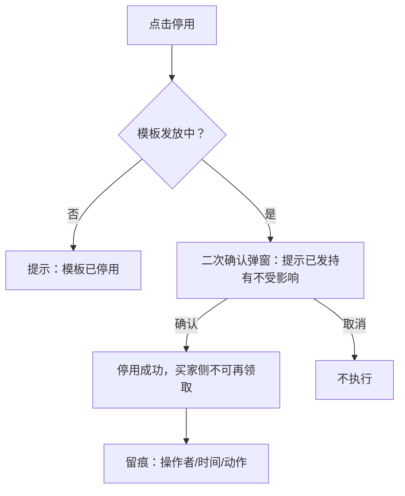
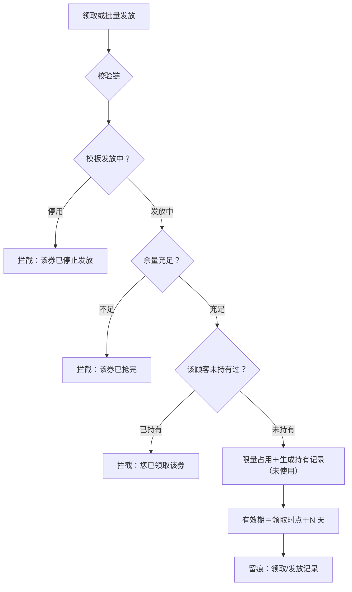
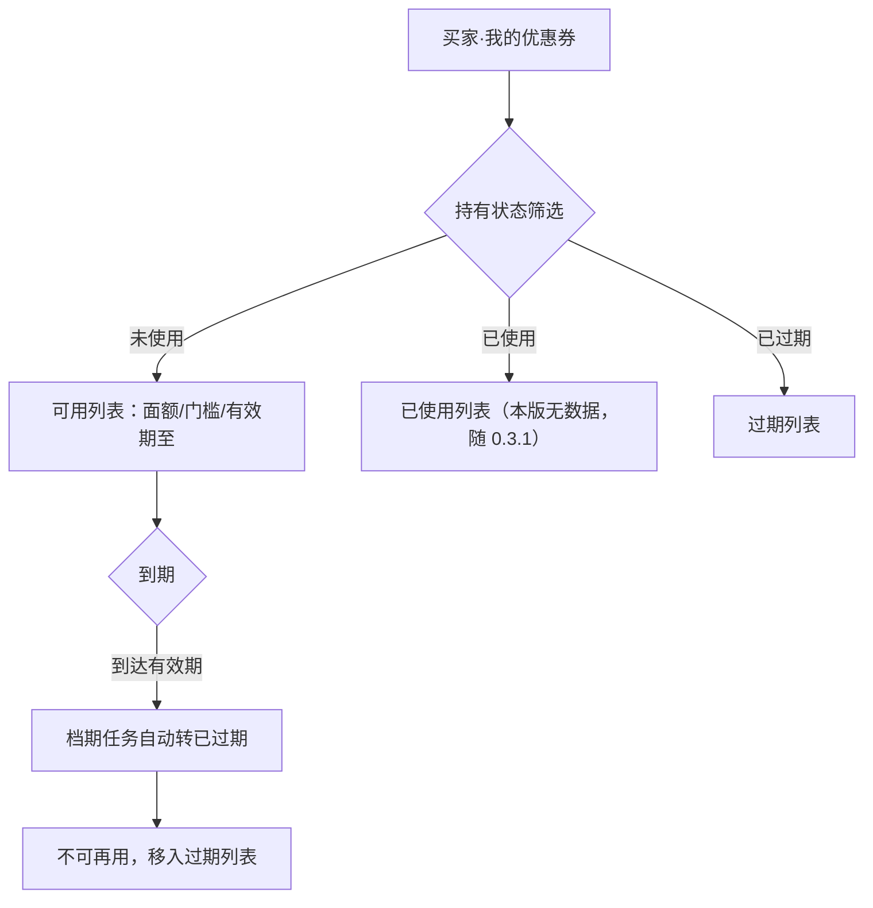
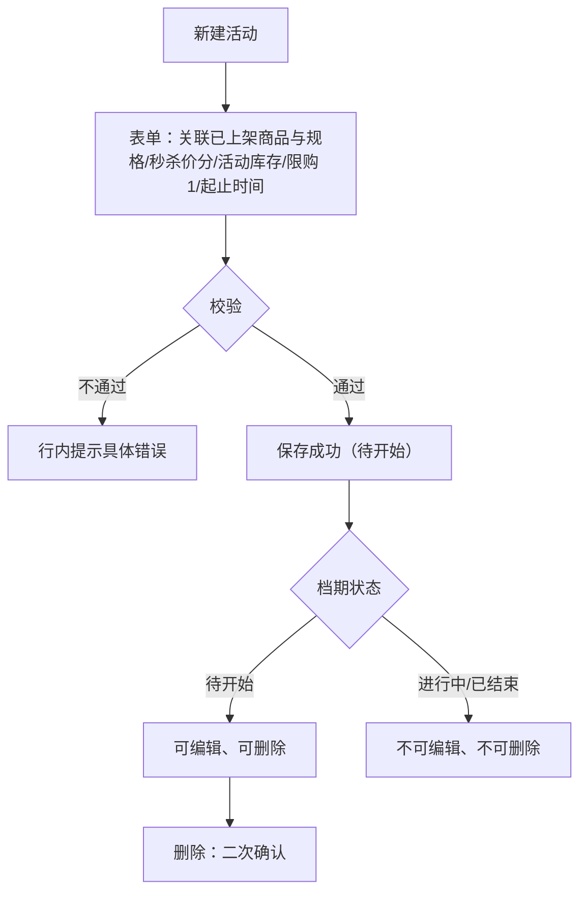
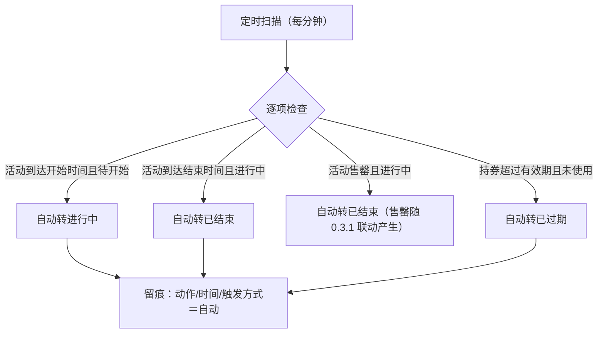

# PRD（小版本）：v0.3.0 促销配置版

> 本文是 v0.3.0 的开发级需求说明书：以认领条目（R32~R37）为范围、大版本 PRD 与 02 拆解为逐字锚，把每条需求细化到开发与测试不再追问的程度。上游为模拟案例材料，模拟性质予以保留。

## 1. 版本概述

**承接与目标**：认领自需求池——0.3 营销促活版批次一（02 拆解），R32~R37 共 6 条，池内状态已同步为"已认领（v0.3.0）"。本版目标＝促销工具可配置、可领取（0.3 目标"可配置、可参与、可核销"的配置与前半段）；本版可验收形态（承接 02 批次一）：运营演示"新建券模板→开启发放→买家领取（重复领取拦截）→个人中心持券可见→停用模板仅停新发"与"新建秒杀活动→档期到点自动开始→到期或售罄自动结束"；买家演示"领券→持券状态与有效期呈现"。

**范围外声明**：核销与退回、秒杀下单联动、提交订单用券与秒杀价路径（R38~R40 归 0.3.1 促销下单版）——本版券可领可持有但**下单不可使用**（订单确认页无选券入口，沿用 0.2 无券路径），持券"已使用"态随 0.3.1 核销可达（R35 锚的三态展示中"已使用"本版无数据，界面预留）；买家侧秒杀活动页与购买随 0.3.1（本版秒杀仅管理端配置与档期状态流转）；退货退款（0.4）；评价与咨询（0.5）；会员等级（0.6）。本文对范围外内容只作围栏声明。

**条目内顺序与依赖**（引用上游批内顺序）：R32 券模板先行（R33/R34 的对象）→ R34 发放领取 → R35 持有查询；R36 秒杀活动与 R37 档期并行的第二条线；两条线互不依赖，批内可并行。

## 2. 需求范围与验收锚

条目总览树（与 02 批次一分支图同名同构）：

认领条目表（需求名／用途／验收标准逐字引自 02 批次一需求表）：

| 编号 | 需求名 | 用途 | 验收标准 |
|---|---|---|---|
| R32 | 券模板增删改查 | 定义券的面额与规则 | 运营人员新建券模板（名称、面额分、使用门槛分、有效期天数 N≥1、发放量）保存成功并可编辑，被持有的模板不可删除 |
| R33 | 券模板停用 | 停止新发放 | 运营人员停用模板后买家不可再领取，停用前已发持有记录按原有效期走完，动作留痕 |
| R34 | ◆ 发放与领取 | 把券发到买家名下 | 买家领取或运营批量发放时校验模板在发放中且有余量，每人每模板仅 1 张（重复领取拦截并提示），限量不超发，领取生成持有记录（未使用、有效期 N 天），动作留痕 |
| R35 | 持有查询与过期处理 | 买家查看与管理侧跟踪 | 买家在个人中心查看持券（未使用/已使用/已过期），到期的持有记录经档期任务自动转已过期，过期不可再用 |
| R36 | 秒杀活动增删改查 | 配置限时限量特价 | 运营人员新建秒杀活动（关联已上架商品与规格、秒杀价分、活动库存、每顾客限购 1 件、起止时间）保存成功，未开始的活动可编辑，开始后与被引用活动不可删除 |
| R37 | ◆ 档期自动执行 | 活动与券有效期自动流转 | 到达开始时间的活动自动转进行中，到达结束时间或售罄自动转已结束，券过有效期自动转已过期，任务可重入幂等且留痕 |

锚定说明：以上三列为逐字锚，本文第 4 章的细化只加深行为描述、不与锚冲突、不收窄或放宽验收；R35 锚中"已使用"态的可达性依赖核销（R38，随 0.3.1），本版如实标注（同 v0.2.0 处理口径）。

## 3. 核心用户旅程

**旅程承接说明**：大版本 PRD 旅程一「配置促销」整条落在本版（券模板与秒杀配置、档期流转）；旅程二「领券与用券下单」仅承接领券与持有段（用券下单段随 0.3.1）；旅程三「秒杀参与」不在本版（活动页与购买随 0.3.1）。

### 3.1 旅程一：配置促销（运营人员，单端）

文字：券模板保存即进入发放中（本版定：模板无独立状态机，以停用标记表达，04C-营销 4 节口径）；停用仅停新发放；秒杀活动保存后处于待开始，档期任务自动流转；两条配置线并行。

操作步骤清单：① 管理端进入营销管理；② 新建券模板（五要素）保存；③ 观察买家侧可领；④ （可选）停用模板；⑤ 新建秒杀活动（关联商品与规格、秒杀价、活动库存、限购、档期）；⑥ 观察活动状态随档期自动流转。

### 3.2 旅程二：领券与持有（买家，单端）

文字：领取三重校验（发放中、余量、每人 1 张）任一不满足拦截并提示对应原因；持有记录生成时按领取时点＋N 天计算有效期；到期由档期任务自动流转；本版持券不可在下单使用（订单确认页无选券入口，围栏）。

操作步骤清单：① 进入领券中心看可领列表（面额、门槛、有效期说明）；② 点击领取；③ 重复领取被拦截；④ 个人中心·我的优惠券查看持券与状态、有效期；⑤ 到期后状态自动转已过期。

## 4. 功能需求

### 4.1 功能总览

对象归组树（版本→对象→条目）：

对象增删改查矩阵：

| 对象 | 增 | 改 | 删 | 查 |
|---|---|---|---|---|
| 优惠券（模板） | R32 新建 | R32 编辑、R33 停用标记 | R32 删除（仅未被持有时） | R32 列表与详情 |
| 优惠券持有记录 | R34 领取/发放生成 | R35 过期流转（R38 核销/退回随 0.3.1） | 不做（实例记录不删） | R35 买家持券列表、R34 管理侧发放跟踪 |
| 秒杀活动 | R36 新建 | R36 编辑（仅待开始） | R36 删除（仅待开始且未被引用） | R36 列表（状态标签） |

主体使用面：

| 主体／角色 | 使用条目 | 说明 |
|---|---|---|
| 运营人员（管理端） | R32、R33、R36 | 券模板与秒杀活动的配置面（mkt_ 域能力点） |
| 买家（商城端） | R34（领取）、R35（持券查询） | 领券中心与个人中心·我的优惠券 |
| 系统（机制） | R37 | 档期与过期自动流转，无人工触发面 |

机制条目（无人工触发面）：R37 档期自动执行为调度任务（活动状态流转＋券过期），无操作界面——效果在管理端活动列表状态列与买家持券状态呈现。

### 4.2 R32 券模板增删改查

**功能说明**：定义券的面额与规则。触发：运营人员在管理端营销管理＞优惠券点击"新建券模板"。

**交互与流程**：

操作步骤清单：① 新建表单填写五要素；② 保存成功进入发放中；③ 编辑（被持有时面额与门槛锁定）；④ 删除仅未被持有时可行（二次确认）。

**字段与校验**：

| 信息项 | 必填 | 校验 | 失败反馈 |
|---|---|---|---|
| 券名称 | 是 | 2~20 字符 | "券名称需为 2~20 字符" |
| 面额（分） | 是 | 正整数；≤门槛（有门槛时，本版定） | "面额需为正整数（单位分）"/"面额不得超过使用门槛" |
| 使用门槛（分） | 是 | 非负整数；0 表示无门槛（本版定） | "使用门槛需为非负整数（单位分）" |
| 有效期天数 N | 是 | 整数 ≥1（领取后 N 天有效） | "有效期天数需为不小于 1 的整数" |
| 发放量 | 是 | 正整数 ≤9999999 | "发放量需为正整数" |

**规则与边界**：
1. 面额、门槛、发放量为分单位/整数（K10）；有效期规则＝领取后 N 天（0.3 大版本立项定案）。
2. 模板无生命周期状态机，以"停用"标记表达（R33，04C-营销 4 节）。
3. 被持有的模板不可删除（验收锚）；被持有时面额与门槛锁定防止规则漂移（本版定）。
4. 新建保存即"发放中"（买家侧可领），无需单独开启动作（本版定）。

**异常与拦截**：

| 异常场景 | 系统行为 |
|---|---|
| 面额＞门槛 | 拦截："面额不得超过使用门槛" |
| 删除被持有模板 | 拦截："该模板已被 N 人持有，不可删除" |
| 无任何模板 | 空态："暂无券模板，请新建第一个券模板" |

### 4.3 R33 券模板停用

**功能说明**：停止新发放。触发：运营人员在券模板列表行操作"停用"。

**交互与流程**：

操作步骤清单：① 定位发放中的模板；② 点击停用，二次确认（弹窗说明已发持有按原有效期走完）；③ 确认后买家侧领取入口消失/拦截；④ 动作留痕。

**字段与校验**：无新增表单信息项（操作型）——确认弹窗展示模板五要素与已发放量。

**规则与边界**：
1. 停用仅停新发放，已发持有记录按原有效期走完（验收锚）。
2. 停用为标记可逆？——本版不支持重新启用（停用即终态标记，需要再发新建模板，本版定，防止规则歧义）。
3. 停用动作留痕（规范）。

**异常与拦截**：

| 异常场景 | 系统行为 |
|---|---|
| 重复停用 | 提示"模板已停用" |
| 停用后买家领取 | 拦截："该券已停止发放" |

### 4.4 R34 ◆ 发放与领取

**功能说明**：把券发到买家名下。触发：买家在领券中心点击"领取"；或运营在管理端对模板执行批量发放（按顾客筛选，本版定：批量发放面向全部无该模板持有记录的顾客）。

**交互与流程**：

操作步骤清单（买家）：① 领券中心浏览（面额/门槛/有效期说明）；② 点击领取，三重校验；③ 通过后持券可见、余量减一。操作步骤清单（运营）：① 模板列表点批量发放；② 确认范围（无持有记录的顾客）；③ 执行后每人持有量＋1、余量相应扣减、留痕。

**字段与校验**：

| 信息项 | 必填 | 校验 | 失败反馈 |
|---|---|---|---|
| 领取对象 | 是 | 已登录买家（未登录引导登录，沿用 v0.2.0） | 未登录跳登录页 |
| 模板状态 | — | 发放中 | "该券已停止发放" |
| 余量 | — | 发放量－已发放量 ＞0 | "该券已抢完" |
| 持有防重 | — | 同顾客同模板唯一（唯一索引） | "您已领取该券" |

**规则与边界**：
1. 三重校验（发放中、余量、每人 1 张）任一不满足拦截（验收锚）；限量占用以条件更新防超发（04C-营销 3.4 规则 2）。
2. 持有记录生成时计算有效期（领取时点＋N 天，0.3 立项定案口径）。
3. 批量发放与单个领取走同一校验链与占用机制（本版定）。
4. 领取与发放动作留痕（规范）。

**异常与拦截**：

| 异常场景 | 系统行为 |
|---|---|
| 停用模板领取 | "该券已停止发放" |
| 余量为零 | "该券已抢完" |
| 重复领取 | "您已领取该券" |
| 并发抢领最后余量 | 条件更新，未抢到的拦截不超发 |

### 4.5 R35 持有查询与过期处理

**功能说明**：买家查看持券与管理侧跟踪。触发：买家进入个人中心·我的优惠券；运营在管理端模板详情查看发放情况。

**交互与流程**：

操作步骤清单：① 个人中心进入我的优惠券；② 按状态筛选查看（未使用/已使用/已过期）；③ 到期券自动转已过期；④ 管理端模板详情查看发放量、已发量与持有分布。

**字段与校验**：

| 信息项 | 必填 | 校验 | 失败反馈 |
|---|---|---|---|
| 状态筛选 | 否 | 未使用/已使用/已过期三态 | — |

**规则与边界**：
1. 三态展示与术语表逐字（未使用/已使用/已过期）；"已使用"本版无数据（核销随 0.3.1），列表保留空态（如实标注，不删入口）。
2. 过期流转由档期任务（R37）执行，买家端状态延迟至多一个扫描周期（本版定：1 分钟）。
3. 本版持券无使用入口（下单用券随 0.3.1）；券详情展示门槛说明。

**异常与拦截**：

| 异常场景 | 系统行为 |
|---|---|
| 无任何持券 | 空态："暂无优惠券，去领券中心逛逛" |
| 已过期券点击使用（预留态） | 提示："该券已过期"（0.3.1 起有使用入口时生效） |

### 4.6 R36 秒杀活动增删改查

**功能说明**：配置限时限量特价。触发：运营人员在管理端营销管理＞秒杀活动点击"新建活动"。

**交互与流程**：

操作步骤清单：① 新建表单选择已上架商品与规格、填写秒杀价、活动库存、限购（默认 1）、起止时间；② 保存成功处于待开始；③ 待开始期间可编辑可删除；④ 开始后状态由档期任务流转（R37），列表状态标签更新。

**字段与校验**：

| 信息项 | 必填 | 校验 | 失败反馈 |
|---|---|---|---|
| 商品与规格 | 是 | 下拉选择已上架商品及其规格 | "请选择已上架的商品与规格" |
| 秒杀价（分） | 是 | 正整数；低于商品日常售价（本版定） | "秒杀价需为正整数且低于日常售价" |
| 活动库存 | 是 | 正整数 ≤9999999 | "活动库存需为正整数" |
| 每顾客限购 | 是 | 固定 1 件（0.3 立项定案；表单展示只读） | — |
| 起止时间 | 是 | 开始早于结束；开始时间晚于当前（本版定） | "结束时间需晚于开始时间"/"开始时间需晚于当前时间" |

**规则与边界**：
1. 活动库存独立台账（不动商品基准库存，04C-营销）；预扣随 0.3.1 联动。
2. 仅待开始可编辑可删除（验收锚）；进行中/已结束的活动不可删（被引用口径＝状态非待开始）。
3. 秒杀价低于日常售价校验（本版定）；状态机三态（待开始/进行中/已结束，术语表）。
4. 同一商品同档期可存在多个活动？——本版限制同一规格同一时刻至多一个进行中活动（重叠校验，本版定）。

**异常与拦截**：

| 异常场景 | 系统行为 |
|---|---|
| 秒杀价≥日常售价 | 拦截提示 |
| 编辑进行中活动 | 拦截："活动已开始，不可编辑" |
| 删除非待开始活动 | 拦截："仅待开始的活动可删除" |
| 与既有活动档期重叠（同规格） | 拦截："该规格在所选时段已有活动" |
| 无任何活动 | 空态："暂无秒杀活动，请新建第一个活动" |

### 4.7 R37 ◆ 档期自动执行

**功能说明**：活动与券有效期自动流转（调度任务，无人工触发面）。触发：系统定时扫描（每分钟，本版定）。

**交互与流程**：

操作步骤清单（系统侧）：① 每分钟扫描待开始/进行中活动与未使用持券；② 到点流转（活动两向、券过期单向）；③ 全部流转留痕自动标记；④ 状态前置条件保护幂等。

**字段与校验**：无人工表单（机制条目）——消费字段＝活动起止时间、持券有效期。

**规则与边界**：
1. 活动三态流转＋券过期单向流转（术语表枚举）；售罄判定依赖活动库存消耗（0.3.1 联动产生，本版活动库存无消耗、售罄分支预留）。
2. 任务可重入幂等（规范）；与 v0.2.0 内容位档期任务同调度机制、任务名独立（规范）。
3. 时间判据东八区服务器时间（规范）。

**异常与拦截**：

| 异常场景 | 系统行为 |
|---|---|
| 同周期重复触发 | 幂等，仅一条留痕 |
| 扫描时活动被手动操作 | 状态前置条件保护，不冲突 |

## 5. 业务对象与数据字段

数据主体清单：

| 业务对象 | 落库名 | 定位与关系 |
|---|---|---|
| 优惠券（模板） | mkt_coupon | 券模板（面额/门槛/有效期规则/发放量）；被持有引用 |
| 优惠券持有记录 | mkt_coupon_hold | 买家名下券实例；每顾客每模板唯一；核销关联订单随 0.3.1 写入 |
| 秒杀活动 | mkt_seckill | 限时限量特价；关联商品与规格；活动库存独立台账 |
| 限购计数 | 机制态（随 0.3.1） | 顾客×活动限购计数以订单事实或独立记录承载，实现形态由开发阶段定（本版限购字段就绪、计数随联动启用） |

**优惠券（mkt_coupon）字段表**：

| 字段 | 必填 | 业务类型 | 落库字段名 | 约束与取值 |
|---|---|---|---|---|
| 主键 | 是 | 标识 | id | 自增整型（编码契约） |
| 券名称 | 是 | 文本 | coupon_name | 2~20 字符 |
| 面额 | 是 | 金额（分） | face_amount | 正整数；≤使用门槛（有门槛时，本版定） |
| 使用门槛 | 是 | 金额（分） | threshold_amount | 非负整数；0＝无门槛 |
| 有效期天数 | 是 | 整数 | valid_days | ≥1（领取后 N 天，0.3 定案） |
| 发放量 | 是 | 整数 | total_qty | 正整数 ≤9999999 |
| 已发放量 | 是 | 整数 | issued_qty | ≤total_qty，条件更新防超发 |
| 停用标记 | 是 | 标志 | is_stopped | 停用后不可再领（标记而非状态机，04C 口径） |
| 创建时间／更新时间／逻辑删除 | 是 | 审计 | created_at／updated_at／deleted | 编码契约 |

**优惠券持有记录（mkt_coupon_hold）字段表**：

| 字段 | 必填 | 业务类型 | 落库字段名 | 约束与取值 |
|---|---|---|---|---|
| 主键 | 是 | 标识 | id | 自增整型 |
| 所属顾客 | 是 | 外键 | customer_id | 指向 cust_account.id |
| 券模板 | 是 | 外键 | coupon_id | 指向 mkt_coupon.id；同顾客＋模板唯一（防重索引） |
| 状态 | 是 | 枚举 | status | UNUSED／USED／EXPIRED（术语表；USED 本版不可达，随 0.3.1） |
| 有效期至 | 是 | 时间 | expire_at | 领取时点＋valid_days |
| 核销关联订单 | 否 | 业务单号 | order_no | 跨模块按业务单号关联（编码契约）；随 0.3.1 核销写入 |
| 创建时间／更新时间／逻辑删除 | 是 | 审计 | created_at／updated_at／deleted | 编码契约 |

**秒杀活动（mkt_seckill）字段表**：

| 字段 | 必填 | 业务类型 | 落库字段名 | 约束与取值 |
|---|---|---|---|---|
| 主键 | 是 | 标识 | id | 自增整型 |
| 商品 | 是 | 外键 | product_id | 指向 prod_product.id（已上架） |
| 规格 | 是 | 外键 | sku_id | 指向 prod_sku.id；同规格同时段至多一个进行中活动（本版定） |
| 秒杀价 | 是 | 金额（分） | seckill_price | 正整数且低于日常售价（本版定） |
| 活动库存 | 是 | 整数 | stock_qty | 正整数；独立台账 |
| 已售量 | 是 | 整数 | sold_qty | 随 0.3.1 联动递增；本版恒 0 |
| 每顾客限购 | 是 | 整数 | per_customer_limit | 固定 1（0.3 定案；表单只读展示） |
| 起止时间 | 是 | 时间 | start_at／end_at | 开始早于结束；开始晚于当前 |
| 状态 | 是 | 枚举 | status | PENDING／ACTIVE／ENDED（术语表；档期任务流转） |
| 创建时间／更新时间／逻辑删除 | 是 | 审计 | created_at／updated_at／deleted | 编码契约 |

## 6. 待议与建议

**本版采用的推断与默认值汇总**：

| 采用值 | 来源状态 | 位置 |
|---|---|---|
| 面额 ≤ 门槛（有门槛时）；门槛 0＝无门槛；新建即发放中 | 本版定 | R32 |
| 停用不可逆（需再发新建模板）；被持有时面额与门槛锁定 | 本版定 | R32／R33 |
| 批量发放＝面向全部无持有记录顾客，与领取同校验链 | 本版定 | R34 |
| 持券状态延迟至多一个扫描周期（1 分钟） | 本版定 | R35／R37 |
| 秒杀价低于日常售价；同规格同时段至多一个进行中活动；开始时间晚于当前 | 本版定 | R36 |
| 限购固定 1、表单只读 | 0.3 立项定案（承接大版本 PRD） | R36 |
| 有效期＝领取后 N 天（valid_days） | 0.3 立项定案（行业惯例默认） | R32／R34 |

**待确认内容与影响**：批量发放的顾客圈选维度（当前全量无持有者，后续按会员等级细分随 0.6 联动评审）；秒杀活动页的信息结构（随 0.3.1 购买联动一并定）。

**建议回池的新想法与术语表待登记行**：无新想法回池。术语表待登记（本版新定名，随认领回报合入术语表）：本版新定落库字段 13 个——mkt_coupon：coupon_name、face_amount、threshold_amount、valid_days、total_qty、issued_qty、is_stopped；mkt_coupon_hold：coupon_id、expire_at；mkt_seckill：seckill_price、stock_qty、sold_qty、per_customer_limit；另有既有名在新表复用 8 处（customer_id、status×2、order_no、product_id、sku_id、start_at、end_at——均已在此前版本登记，不重复定名）。
