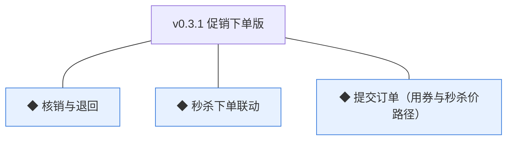
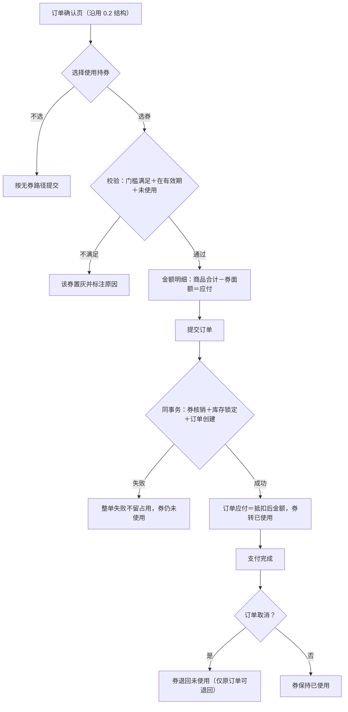
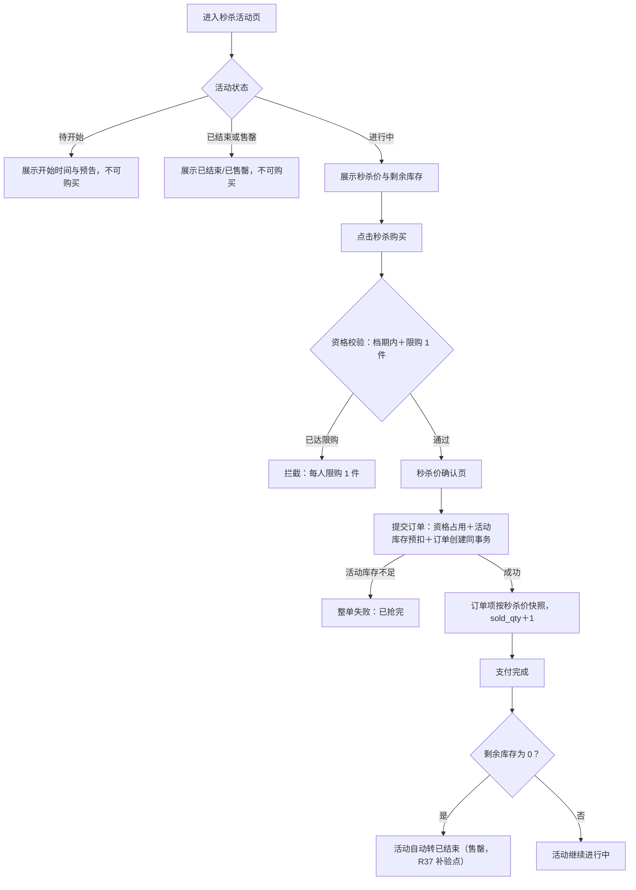
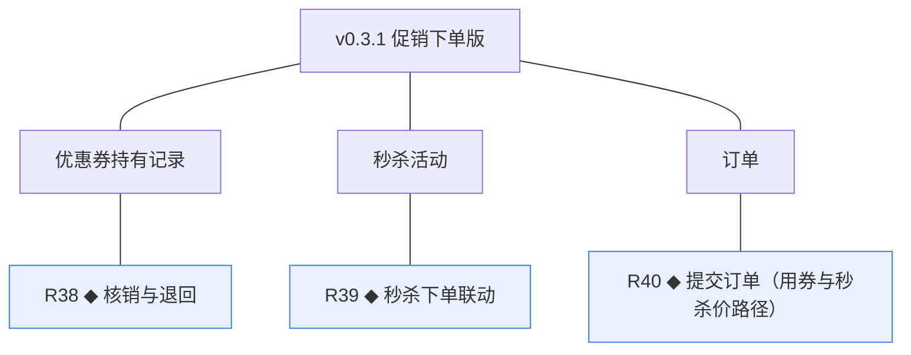
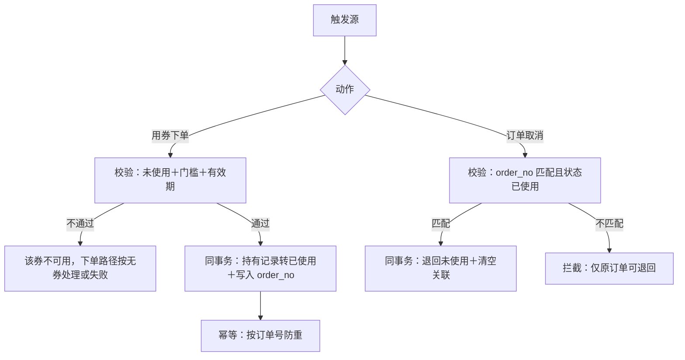
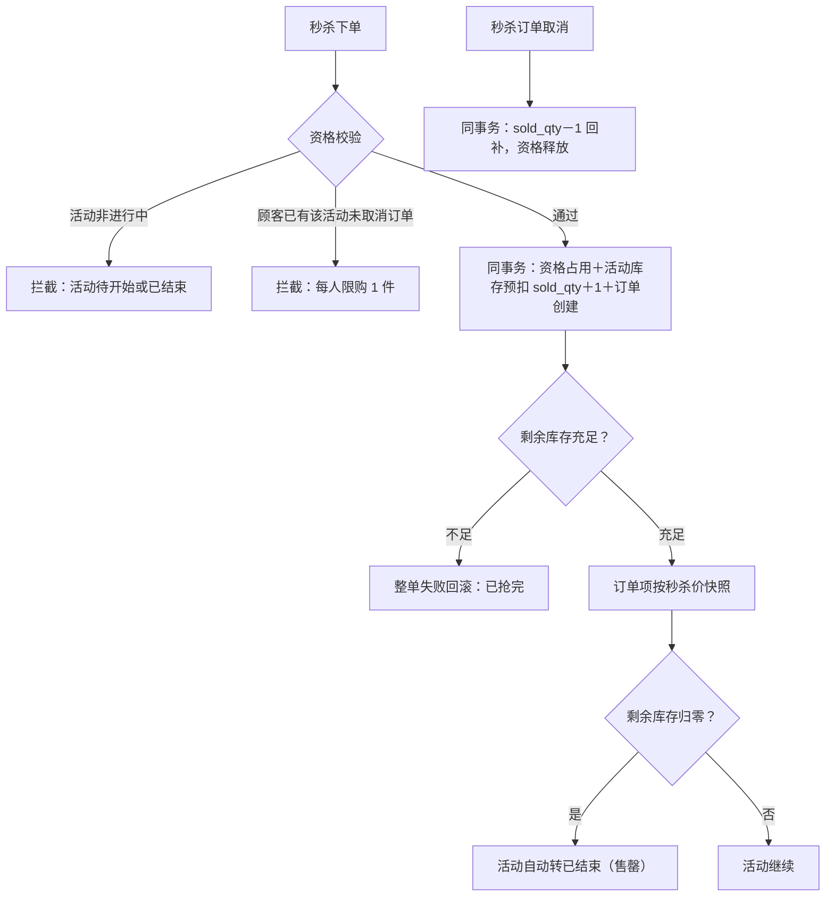
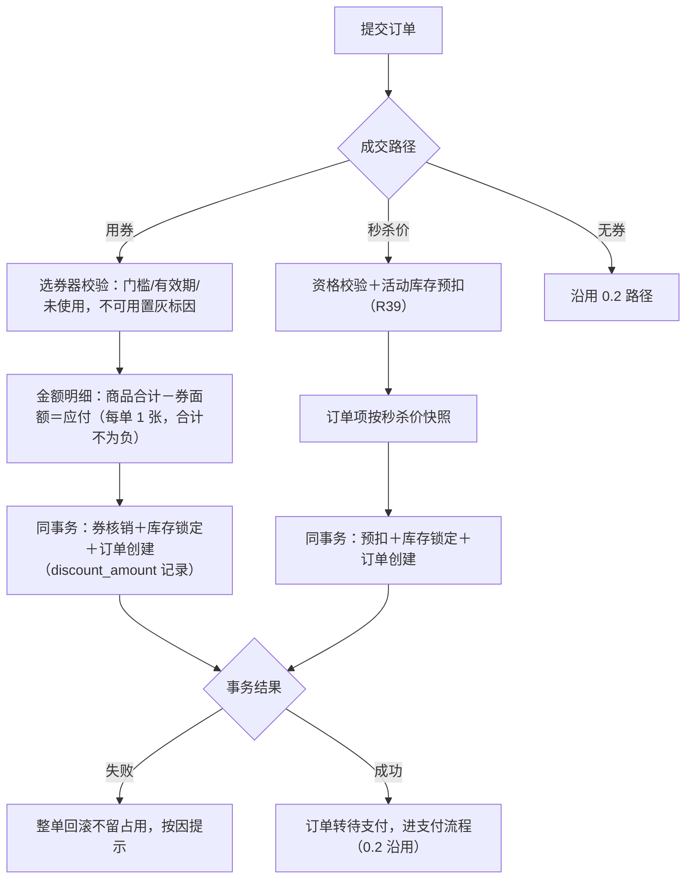

# PRD（小版本）：v0.3.1 促销下单版

> 本文是 v0.3.1 的开发级需求说明书：以认领条目（R38~R40）为范围、大版本 PRD 与 02 拆解为逐字锚，把每条需求细化到开发与测试不再追问的程度。上游为模拟案例材料，模拟性质予以保留。

## 1. 版本概述

**承接与目标**：认领自需求池——0.3 营销促活版批次二（02 拆解），R38~R40 共 3 条，池内状态已同步为"已认领（v0.3.1）"。本版目标＝促销成交贯通（0.3 目标"可核销"段），达成 0.3 大版本目标与完成标志；本版可验收形态（承接 02 批次二）：买家演示"领券→下单选券抵扣（合计减面额）→提交→支付完成→券转已使用"与"取消该订单→券退回未使用"；买家演示"秒杀活动进行中→秒杀价下单→支付完成"，以及"重复秒杀购买被限购拦截""售罄后整单失败回滚"；0.3 完成标志达成（用券订单正确核销＋秒杀活动从配置到售罄/到期全程无人工干预）。

**范围外声明**：退货退款与"售后中"态（0.4）；商品评价、咨询（0.5）；会员等级（0.6）；统计报表（0.7）；多券叠加与满减等其他促销形态（PRD 项目级明确不做/未纳入，04C-营销待议「明确不做」）。本版为 0.3 收口版，无范围外延伸。

**条目内顺序与依赖**（引用上游同事务契约）：R38 核销与 R40 用券路径同事务、R39 预扣与 R40 秒杀价路径同事务——三条一体实现、不可拆分；实现序内部按"先路径后机制呈现"（R40 两条成交路径→R38/R39 随事务机制），批内可并行。

## 2. 需求范围与验收锚

条目总览树（与 02 批次二分支图同名同构）：

认领条目表（需求名／用途／验收标准逐字引自 02 批次二需求表）：

| 编号 | 需求名 | 用途 | 验收标准 |
|---|---|---|---|
| R38 | ◆ 核销与退回 | 用券占用与取消释放 | 买家下单用券时核销在同事务内完成（已使用并关联订单号，按订单号幂等），订单取消时退回未使用（仅原订单可退回），状态前置条件保护 |
| R39 | ◆ 秒杀下单联动 | 秒杀价成交与活动库存一致 | 买家秒杀下单时资格校验（档期内＋限购 1 件）与活动库存预扣同事务，失败整单回滚，活动库存独立台账不超卖，限购以顾客＋活动计数防重 |
| R40 | ◆ 提交订单（用券与秒杀价路径） | 促销价成交 | 买家用券下单时校验门槛与有效期并按面额抵扣（每单限 1 张券，合计不为负），核销与订单创建同事务；秒杀下单按秒杀价成交（资格与预扣同事务）；路径失败整单回滚不留占用 |

锚定说明：以上三列为逐字锚，本文第 4 章的细化只加深行为描述、不与锚冲突、不收窄或放宽验收；验收含 v0.3.0 遗留两处补验（R35 已使用数据、R37 售罄分支——随本版核销与联动产生）。

## 3. 核心用户旅程

**旅程承接说明**：大版本 PRD 旅程二「领券与用券下单」的用券段与旅程三「秒杀参与」整条在本版承接并细化（领取与配置段已随 v0.3.0）；两条均为买家单端流程。

### 3.1 旅程一：用券下单（买家，单端）

文字：选券在订单确认页（可用券列表按门槛与有效期实时校验，不可用置灰标注原因）；每单限用 1 张、合计不为负（门槛≥面额保证，v0.3.0 规则）；核销与订单创建、库存锁定同一事务（04C-交易 3.6、04C-营销 3.5）；取消退回按订单号幂等。

操作步骤清单：① 确认页打开选券器（可用持券列表）；② 不可用券置灰（门槛不满足/已过期/已使用）；③ 选券后金额明细呈现"商品合计－券抵扣＝应付"；④ 提交订单（三动作同事务）；⑤ 支付完成后个人中心持券转"已使用"；⑥ 取消该订单后券回到"未使用"。

### 3.2 旅程二：秒杀参与（买家，单端）

文字：活动页四态（待开始/进行中/已结束/已售罄）；资格＝档期内且该顾客该活动未持有未取消的秒杀订单（限购计数按订单事实，本版定）；预扣即售（活动库存下单即扣 sold_qty，取消订单回补，本版定）；售罄自动结束衔接 v0.3.0 预留分支。

操作步骤清单：① 从首页或活动入口进入活动页；② 进行中点击秒杀购买（重复购买拦截限购）；③ 秒杀价确认页提交订单（预扣同事务）；④ 库存不足整单失败提示"已抢完"；⑤ 支付完成；⑥ 售罄后活动自动转已结束。

## 4. 功能需求

### 4.1 功能总览

对象归组树（版本→对象→条目）：

对象增删改查矩阵：

| 对象 | 增 | 改 | 删 | 查 |
|---|---|---|---|---|
| 优惠券持有记录 | 已于 v0.3.0 交付（领取生成） | R38 核销/退回（状态流转＋订单关联） | 不做 | 随 R40 选券器（可用性实时校验） |
| 秒杀活动 | 已于 v0.3.0 交付（配置） | R39 预扣/回补（sold_qty 变动）＋R37 售罄流转（自动） | 不做（v0.3.0 口径） | 活动页四态呈现（买家侧，本版新增） |
| 订单 | R40 两条促销路径生成 | 沿用 0.2 状态流转（D6） | 不做 | 沿用 0.2 |

主体使用面：

| 主体／角色 | 使用条目 | 说明 |
|---|---|---|
| 买家（商城端） | R40（选券与秒杀下单操作面） | 订单确认页选券器、秒杀活动页与秒杀确认页 |
| 系统（机制） | R38（随 R40 事务）、R39（随 R40 事务） | 核销/退回、资格与预扣均为事务内机制，无人工触发面 |

机制条目（无人工触发面）：R38 与 R39 全部动作随 R40 的提交/取消事务执行，无独立操作界面；效果经持券状态、活动库存与订单金额呈现。

### 4.2 R38 ◆ 核销与退回

**功能说明**：用券占用与取消释放（随下单/取消事务的协作机制，无独立界面）。触发：R40 用券路径提交订单（核销）；订单取消（退回，0.2 取消与自动取消机制）。

**交互与流程**：

操作步骤清单（系统侧）：① 用券下单事务内校验并核销（状态前置：仅"未使用"可核销）；② 写入核销关联订单号；③ 订单取消（手动/自动）事务内按 order_no 匹配退回；④ 全部动作按订单号幂等、留痕。

**字段与校验**：无人工表单（机制条目）——消费字段＝mkt_coupon_hold 的 status/order_no/expire_at 与订单门槛金额。

**规则与边界**：
1. 核销状态前置条件＝未使用（规范：条件更新）；核销与订单创建、库存锁定同一本地事务（验收锚）。
2. 退回仅原订单可退回（order_no 匹配校验）；退回后券状态回到未使用、有效期不重算（沿用原 expire_at，本版定）。
3. 支付超时自动取消（0.2 机制）同样触发退回——与手动取消同机制（D7 口径延伸）。
4. 核销/退回动作留痕（含关联订单号）。

**异常与拦截**：

| 异常场景 | 系统行为 |
|---|---|
| 下单瞬间券到期/被并发使用 | 条件更新失败，该券不可用提示重新选券 |
| 非原订单触发退回 | 拦截不执行 |
| 同订单重复退回 | 幂等拦截 |

### 4.3 R39 ◆ 秒杀下单联动

**功能说明**：秒杀价成交与活动库存一致（随下单事务的协作机制，无独立界面）。触发：R40 秒杀价路径提交订单；订单取消（回补）。

**交互与流程**：

操作步骤清单（系统侧）：① 资格校验（档期内＋限购计数按顾客×活动未取消订单事实，本版定）；② 同事务完成资格占用、活动库存预扣、订单创建（秒杀价快照）；③ 库存不足整单回滚；④ 售罄自动结束（衔接 R37）；⑤ 取消订单回补活动库存并释放资格。

**字段与校验**：无人工表单（机制条目）——消费字段＝mkt_seckill 的 status/stock_qty/sold_qty、订单事实（限购计数）。

**规则与边界**：
1. 活动库存下单即扣（sold_qty＋1）、取消即回补（对称，本版定）；独立台账不动商品基准库存（基准锁定/扣减仍按 0.2 契约执行，04C-营销 3.6 规则 2）。
2. 限购计数＝该顾客该活动未取消（非 CANCELLED）订单事实推导，无独立计数表（本版定，机制态：实现可缓存优化但判定以订单事实为准）。
3. 售罄（剩余 0）由联动事务触发活动转已结束，与档期任务同状态机（幂等由状态前置保护）。
4. 并发抢购以条件更新保护活动库存，不超卖（K5 推论）。

**异常与拦截**：

| 异常场景 | 系统行为 |
|---|---|
| 并发抢最后 1 件 | 条件更新仅一单成功，另一单整单失败"已抢完" |
| 活动进行中但商品被下架 | 下单拦截"商品已下架"（商品可售校验沿用 0.2） |
| 支付超时自动取消秒杀订单 | 回补活动库存＋释放资格（与手动取消同机制） |

### 4.4 R40 ◆ 提交订单（用券与秒杀价路径）

**功能说明**：促销价成交——在 0.2 无券路径之上增补用券抵扣与秒杀价两条成交路径。触发：买家在订单确认页选券提交，或在秒杀活动页购买提交。

**交互与流程**：

操作步骤清单：① 确认页打开选券器（可用券列表、不可用置灰标因）；② 选券后明细即时抵扣；③ 提交（核销/预扣/锁定/创建同事务）；④ 成功进支付（0.2 流程无变化）；⑤ 失败按因提示（可售不足/已抢完/请重新选券）。

**字段与校验**：

| 信息项 | 必填 | 校验 | 失败反馈 |
|---|---|---|---|
| 可用持券（选券器） | 否 | 门槛≤商品合计且未使用且在有效期（实时） | 置灰并标注："未满足使用门槛"/"已过期"/"已使用" |
| 券抵扣后应付 | 是 | ≥0（门槛≥面额规则保证，v0.3.0） | 理论不可达，兜底拦截"订单金额异常" |
| 秒杀资格 | 是（秒杀路径） | 档期内＋限购未超 | "活动待开始或已结束"/"每人限购 1 件" |

**规则与边界**：
1. 每单限用 1 张券（0.3 立项定案）；应付＝商品合计－面额（分单位，K10），discount_amount 记录抵扣额（0＝未用券，本版新定字段）。
2. 两条路径失败均整单回滚不留占用（验收锚）；失败提示按因区分。
3. 秒杀订单项 price_snapshot＝秒杀价（D6）；购物车不参与秒杀（秒杀购买为单条目直达确认页，本版定）。
4. 支付、取消、发货、收货全链路沿用 0.2，无路径差异。

**异常与拦截**：

| 异常场景 | 系统行为 |
|---|---|
| 选券后提交瞬间券失效 | 该券不可用，整单失败提示"请重新选券" |
| 秒杀与用券同时尝试 | 本版秒杀路径不叠加用券（确认页无选券器，本版定） |
| 无可用券 | 选券器呈现"暂无可用优惠券"，默认无券路径 |

## 5. 业务对象与数据字段

数据主体清单：

| 业务对象 | 落库名 | 定位与关系 |
|---|---|---|
| 优惠券持有记录 | mkt_coupon_hold | 沿用 v0.3.0；本版启用 status 流转（核销/退回）与 order_no 关联写入 |
| 秒杀活动 | mkt_seckill | 沿用 v0.3.0；本版启用 sold_qty 预扣/回补与售罄自动结束 |
| 订单 | trade_order | 沿用 0.2；本版新增 1 个字段承载券抵扣额 |
| 限购计数 | 不落独立表（机制态） | 按顾客×活动未取消订单事实推导（判定口径以订单为准，实现可缓存） |

**订单（trade_order）本版扩展字段**：

| 字段 | 必填 | 业务类型 | 落库字段名 | 约束与取值 |
|---|---|---|---|---|
| 券抵扣金额 | 是 | 金额（分） | discount_amount | 非负整数；0＝未用券；≤商品合计（v0.3.1 定名，应付＝合计－抵扣） |

（其余对象沿用既有登记行，不重复列出；无新表。）

## 6. 待议与建议

**本版采用的推断与默认值汇总**：

| 采用值 | 来源状态 | 位置 |
|---|---|---|
| 退回后券有效期不重算（沿用原 expire_at） | 本版定 | R38 |
| 活动库存下单即扣、取消即回补；限购计数按未取消订单事实推导 | 本版定（04C 机制落地口径） | R39 |
| 秒杀路径不叠加用券；秒杀购买为单条目直达确认页（不经购物车） | 本版定 | R40 |
| discount_amount 记录券抵扣额（0＝未用券） | 本版定（新字段） | R40／第 5 章 |

**待确认内容与影响**：秒杀与用券叠加（当前不支持，业务有诉求时回池评估）；限购计数缓存策略（实现优化，不影响判定口径）。

**建议回池的新想法与术语表待登记行**：无新想法回池。术语表待登记（本版新定名，随认领回报合入术语表）：trade_order 扩展字段 1 个——discount_amount（券抵扣金额，分）。
