# PRD（大版本）：0.4 售后收口版

> 定位：0.4 售后收口版的立项需求说明书——承接路线图 2.4 条目与项目 PRD，把售后主题切为本版的功能、验收标准与对象版本级行为；上游为模拟案例材料，模拟性质予以保留。

## 1. 版本概述

**承接与目标**：0.2 开张后的售后真空期（退款走支付渠道商户后台人工操作，管理端订单查询仅供人工核对）在本版收口——售后有着落：买家可自助申请退货退款，客服人员在系统内审核完结，财务台账收支两向齐备（路线图 2.4）。本版成功标准（承接完成标志）：一笔真实退货退款全流程系统内完结——申请→审核→退款到账→库存回补→台账支出记录。量化口径（从版本事实推导，不以行业比例替代）：上线后新发生的售后退款经系统内退货单完结的占比＝**100%**——本版系统内退款路径唯一（渠道退款经适配层发起（K6）），低于判定线按链路异常排查；对账口径为台账支出记录与已退款支付单按退货单号一一对应。验证假设（承接路线图）：售后自助化降低人工处理量（判定：人工线下退款操作占比下降；上线后系统外退款操作仅限历史遗留单据处理）。

**范围一句话**：做——退货申请（买家自助发起）、退货审核与退款（客服系统内完结：退款、回补、写支出同事务）、库存数量变动回补路径、收支记录写入支出路径、收支台账查询；不做——换货补发（暂缓清单，业务确认后并入）、商品评价与咨询（0.5）、统计报表与报表导出（0.7）；0.2 的「管理端订单查询人工售后核对」为过渡支撑，自本版起由正式售后能力替代。**部分退金额口径本版定案（路线图指定的立项时点）**：退货单为订单级整单退，退款金额＝订单实付金额（用券订单按实付退，天然满足「退款金额不超过订单实付金额」）；部分退（退货数量小于订单数量）需扩展退货明细行、超出本版对象模型，列入暂缓清单待业务确认后随主题版本并入。

**沿用与前置**：沿用 0.2 的订单状态机、支付单、成交快照、订单完成事件与台账收入路径；管理端订单查询继续服务履约查询，不再兼人工售后核对。与 0.3 无依赖（售后路径仅依赖 0.2，两版并行互不阻塞）。

## 2. 主体与角色

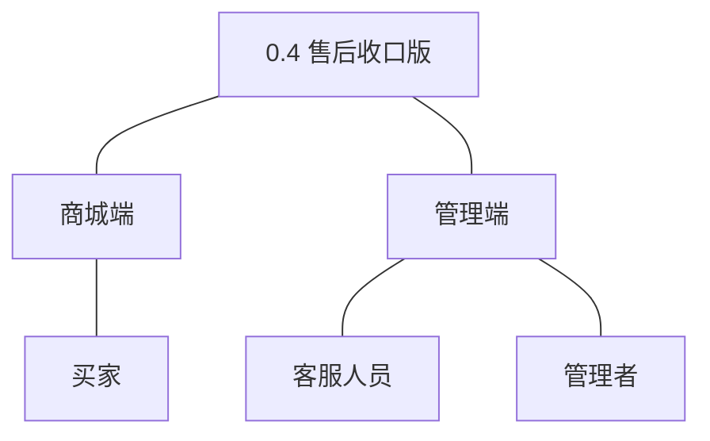

| 主体／角色 | 端 | 怎么用系统 |
|---|---|---|
| 买家 | 商城端 | 对本人已完成订单自助发起退货申请、寄回商品、查看审核结论与退款结果 |
| 客服人员 | 管理端 | 审核退货申请（通过或拒绝并留理由）、确认收到退货、执行退款完结 |
| 管理者 | 管理端 | 查询订单收支台账（收入＋支出两向流水） |

裁剪说明：运营人员与订单履约人员本版无新功能（发货登记沿用 0.2）；交易、商品、报表模块为本版协作方（功能清单使用方「交易模块（协作）」），不进入主体树。

## 3. 核心业务流程

### 3.1 退货退款（买家×客服人员，跨端跨主体）

买家就已完成订单发起退货退款，客服人员在管理端审核处理；审核通过并收到寄回商品后，系统在同一事务内完结退款、回补库存并落台账支出。

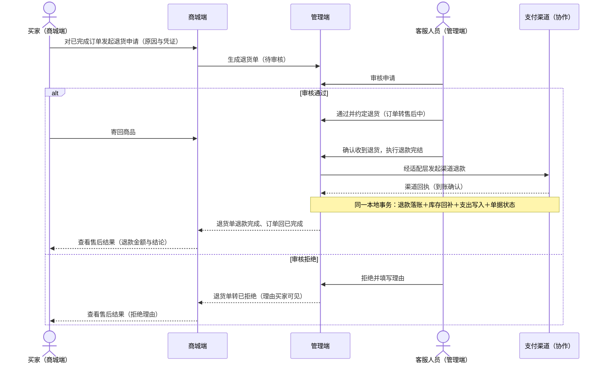

操作步骤清单：

1. 买家在商城端对本人已完成订单发起退货申请，填写原因并上传凭证，提交。
2. 系统生成退货单（待审核），商城端呈现处理进度；客服审核前买家可撤回申请，撤回后退货单转已取消、订单保持已完成。
3. 客服人员在管理端审核：通过——退货单转待退货、订单转售后中，买家按约定寄回商品；拒绝——必须填写理由，退货单转已拒绝，理由对买家可见。
4. 客服人员确认收到退货，执行退款完结：经适配层发起渠道退款，以渠道回执确认到账（K6）。
5. 系统在同一本地事务内完成：退款落账（支付单转已退款）、按成交数量回补库存、写入台账支出记录（关联退货单号）、退货单转退款完成、订单由售后中回已完成（04C-交易 3.10）。
6. 买家在商城端查看售后结果（退款金额或拒绝理由）；管理者可在台账查询该笔支出。

覆盖说明：本版唯一的跨端跨主体流程即退货退款，成一条旅程；收支台账查询为管理者单端简单查询（验收标准可覆盖），不成旅程。

## 4. 功能需求

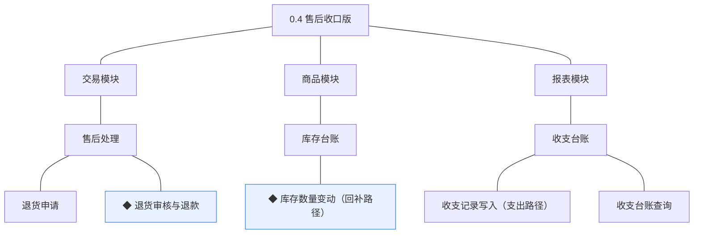

### 4.1 交易模块（售后处理）

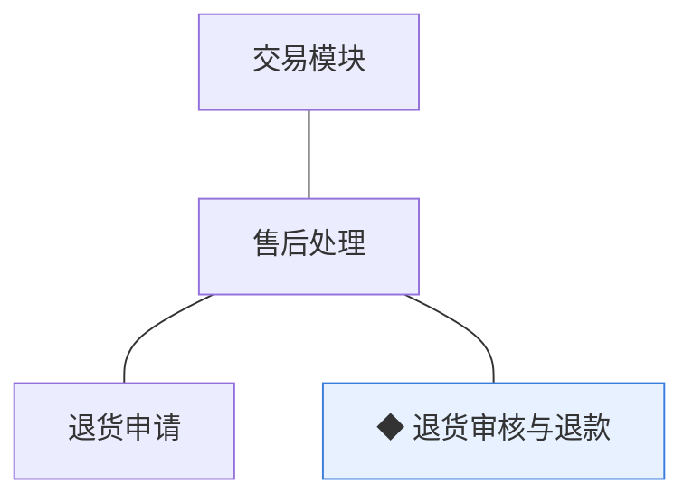

组说明：售后处理承接买卖两侧的售后衔接——申请在商城端生成、审核与完结在管理端进行；完结动作以同一本地事务联动库存回补与台账支出（协作约束见总览协作约束表）。

| 功能 | 用途 | 验收标准 |
|---|---|---|
| 退货申请 | 买家对已完成订单自助发起退货退款并跟踪处理进度 | 买家在商城端对本人已完成订单提交退货申请（含原因与凭证）后，系统生成待审核的退货单并呈现处理进度；客服审核前买家可撤回，撤回后退货单转已取消且订单保持已完成 |
| ◆ 退货审核与退款 | 客服人员在管理端审核退货申请并在系统内完结退款 | 客服人员对待审核退货单作出通过或拒绝（拒绝必须填写理由且商城端买家可见）；通过并确认收到买家寄回商品后，系统在同一事务内完成渠道退款与单据落位——退货单转退款完成、支付单转已退款、订单经售后中回已完成 |

### 4.2 商品模块（库存台账）

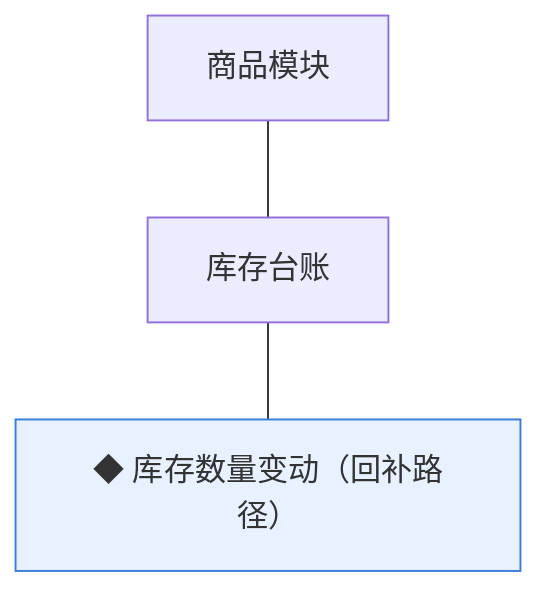

组说明：库存台账由商品模块持有、数量变动只接受交易模块统一写入；本版在既有锁定与扣减路径上新增回补路径，与退货完结同事务（04C-商品 3.8）。

| 功能 | 用途 | 验收标准 |
|---|---|---|
| ◆ 库存数量变动（回补路径） | 售后完结时把退货数量回补进规格级库存台账（本版交付回补路径；锁定与扣减路径已于 v0.2.1 交付） | 退货单退款完结时，系统在同一事务内按该订单成交数量回补对应规格的可售量并留变动痕迹，回补后库存台账数量与变动记录可核对 |

### 4.3 报表模块（收支台账）

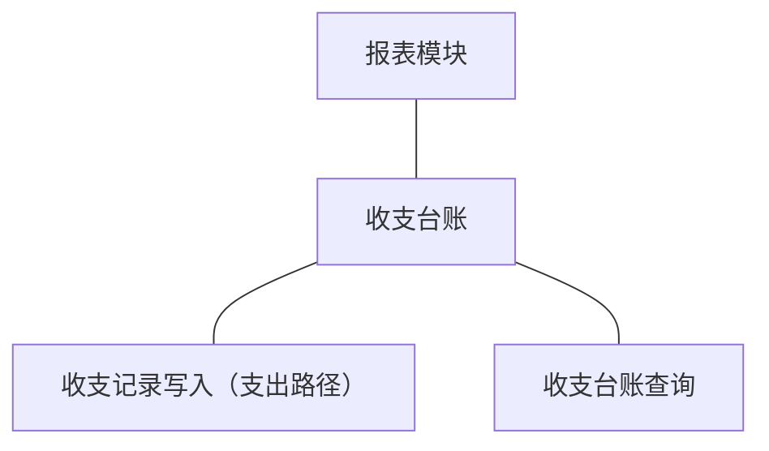

组说明：收支台账由报表模块持有、只读追加；本版补齐支出方向后收入与支出两向齐备，管理者可查流水（D8）。

| 功能 | 用途 | 验收标准 |
|---|---|---|
| 收支记录写入（支出路径） | 售后退款完成事实写入订单收支台账的支出方向（本版交付支出路径；收入路径已于 v0.2.1 交付） | 退货单退款完结时，系统在同一事务内写入一条支出记录（金额＝退款金额、关联退货单号），按退货单号防重、不产生第二条 |
| 收支台账查询 | 管理者在管理端查询订单收支流水，收入与支出两向齐备 | 管理者按时间、记录类型（收入／支出／冲正）与关联单号查询台账流水，收入与支出记录完整呈现且金额分别与对应支付单、退货单一致 |

## 5. 业务对象

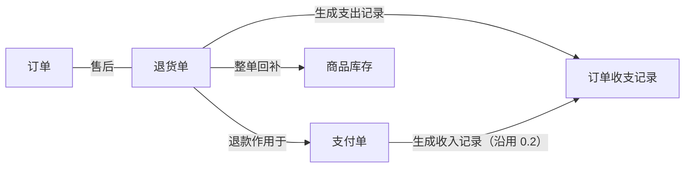

本版新上线退货单，订单、支付单、商品库存、订单收支记录沿用 0.2／0.1 对象并新增售后路径；退货完结时的退款落账、库存回补、支出写入与单据状态变更在同一本地事务内成立（04C-交易 3.10）。

### 5.1 退货单

定位——售后申请与处理记录，一次申请一张、关联一个订单。

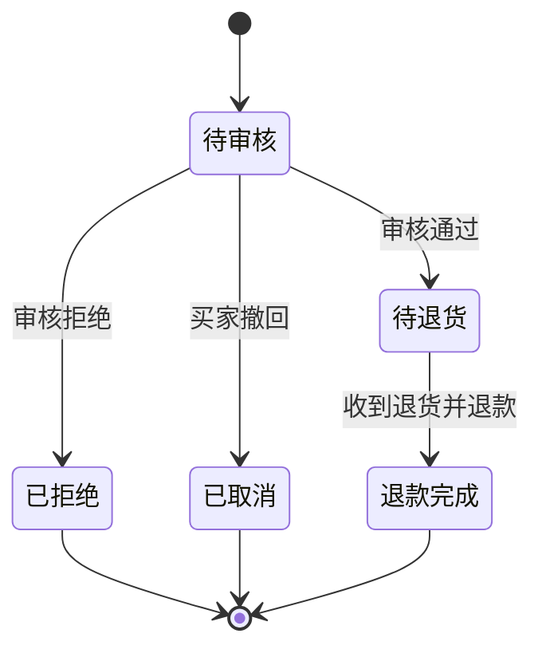

说明：关键组成——退货单号（`RET` 前缀）、订单号关联、原因、凭证、状态、审核结论与理由（术语表）；审核拒绝必须留理由供买家查看。终态三个：退款完成、已拒绝、已取消（与术语表一致）。**金额口径（本版立项定案）**：订单级整单退，退款金额＝订单实付金额——退货单对象组成为订单级、无退货明细行，部分退需扩展对象模型，超出本版（列入暂缓清单）。买家寄回时限与退款到账提示文案不在大版本拍板，归小版本 PRD 定默认值（04C 留版本级）。

### 5.2 订单（沿用 0.2）

定位——一次交易的主记录，买卖两侧流程的衔接核心（沿用 0.2）。

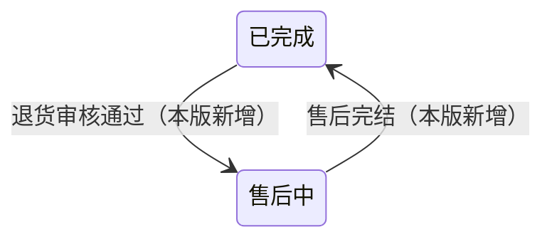

说明：本版只新增上图两段流转，其余状态机沿用 0.2；已完成订单在退货审核通过时转售后中、售后完结时回已完成，全程不产生新订单（D6 快照原则）。

### 5.3 支付单（沿用 0.2）

定位——订单的在线支付记录（沿用 0.2）。

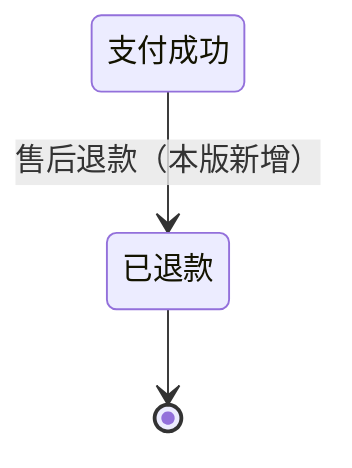

说明：本版只新增支付成功→已退款一段，其余沿用 0.2；退款经渠道适配层发起、到账确认以渠道回执为准（K6）。

### 5.4 商品库存（沿用 0.1／0.2）

定位——规格（SKU）级可售数量台账（沿用 0.1 建档、0.2 锁定与扣减）。

说明：本版只新增回补路径——按订单成交数量整单回增可售量，与退货完结同事务、条件更新保护并发（K5），变动留痕可追溯；设置与人工调整路径沿用 0.1。

### 5.5 订单收支记录（沿用 0.2）

定位——基础财务的订单收支台账，从支付与退款事实生成、只读留存（沿用 0.2 收入路径）。

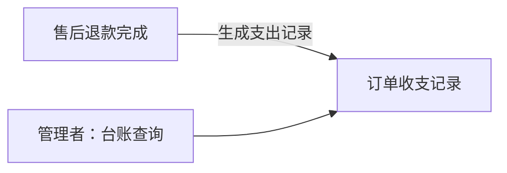

说明：本版新增支出方向（类型＝支出 `EXPENSE`，金额＝退款金额、关联退货单号，按单号防重、只读追加不编辑（D8））；收入方向沿用 0.2（关联支付单号）。台账错误不做就地修改，经冲正记录反向追加修正（规范：单据只追加）。
