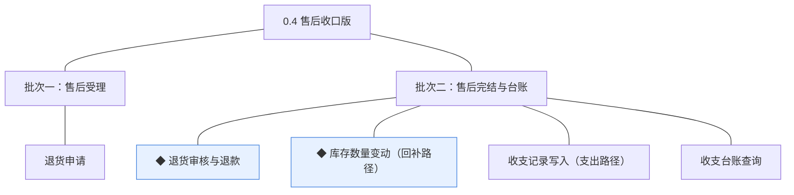
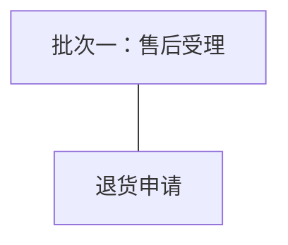
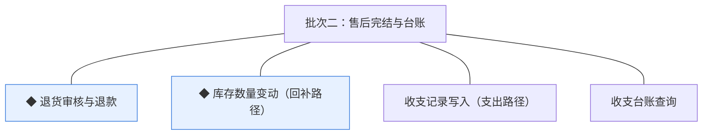

# 开发顺序与需求拆解（大版本）：0.4 售后收口版

> 定位：0.4 售后收口版 PRD→开发批次＋功能级需求条目；本文即该大版本的完整需求清单，需求池据此直接入池、不另生成版本快照；上游为模拟案例材料，模拟性质予以保留。

## 1. 拆解说明

- **做什么**：把 0.4 PRD 的 5 项功能按依赖排成可独立验收的开发批次，每项功能转为一条可直接认领与验收的需求条目（R41 起，用途与验收标准逐字携带 PRD 原文）。
- **粒度口径**：条目与 PRD 4 章功能清单一一同构（一条＝一项功能，无归并无新增）；其中「库存数量变动」与「收支记录写入」为按交付路径拆分的条目（锁定与扣减路径、收入路径已于 v0.2.1 交付），条目内注明本版交付范围；按钮、字段、跳转级的原子拆解归小版本开发，不进本文。
- **与需求池及小版本规划的关系**：本文是需求池的**主入口但不是唯一入口**——会议、沟通、临时反馈产生的需求可直接单条入池，不经本文；小版本规划的输入＝本文开发顺序＋需求池实时状态两者合并，**批次划分是建议而非锁定**，实际认领以需求池为准。

## 2. 开发顺序

**前置版本沿用面**：0.2 的订单状态机、支付单、成交快照、订单完成事件与台账收入路径；0.1／0.2 的库存台账（设置、锁定、扣减）；管理端订单查询（0.2 交付，其人工售后核对的过渡支撑职责自本版起由正式售后能力替代）。

**顺序依据**：批次一交付"可申请、可受理"——买家自助申请生成待审核退货单、客服在管理端可见待审核队列，不触碰退款链路、无外部联调点，可独立验收（提交申请→待审核可见→审核前撤回）；批次二交付"可完结、账两向"——审核、退款、回补、支出与台账查询的售后闭环。**同事务契约（不可拆批）**：退货完结时的退款落账、库存回补、支出写入与单据状态变更在同一本地事务内成立（04C-交易 3.10）——R42／R43／R44 三条必须同批成立，故并入批次二。**外部联调点**：退款走支付渠道商户端接口（经适配层，K6；渠道 0.1 已定案）仅批次二涉及。**部分退口径**：随本版 PRD 立项定案为订单级整单退（退款金额＝订单实付金额），条目按此验收。

### 2.1 批次一：售后受理

- **目标**：买家侧售后入口上线——对已完成订单自助申请，退货单进入客服待审核队列。
- **依赖**：0.2（订单状态机与已完成状态、订单查询呈现）；无本版内部前置、无外部联调点。
- **可验收形态**：买家提交退货申请后退货单待审核可见、进度可查，审核前可撤回（撤回后订单保持已完成）——申请受理面可独立演示。

条目与 PRD 4.1 节功能清单一一同构，用途与验收标准逐字引自原文：

| 编号 | 需求名 | 用途 | 验收标准 |
|---|---|---|---|
| R41 | 退货申请 | 买家对已完成订单自助发起退货退款并跟踪处理进度 | 买家在商城端对本人已完成订单提交退货申请（含原因与凭证）后，系统生成待审核的退货单并呈现处理进度；客服审核前买家可撤回，撤回后退货单转已取消且订单保持已完成 |

### 2.2 批次二：售后完结与台账

- **目标**：售后闭环收口——审核完结（退款、回补、写支出同事务）与收支台账两向查询上线。
- **依赖**：批次一（退货单待审核就绪）；0.2（支付单、成交快照、台账收入路径）。**外部挂点**：渠道退款经适配层发起、到账确认以渠道回执为准（K6）——退款接口联调挂本批。
- **可验收形态**：一笔退货从审核通过→寄回确认→退款到账→库存回补→台账支出记录全流程系统内完结，订单回已完成、支付单转已退款；管理者按时间／类型／单号查台账，收入与支出两向流水完整呈现。

条目与 PRD 4.1～4.3 节功能清单一一同构，用途与验收标准逐字引自原文：

| 编号 | 需求名 | 用途 | 验收标准 |
|---|---|---|---|
| R42 | ◆ 退货审核与退款 | 客服人员在管理端审核退货申请并在系统内完结退款 | 客服人员对待审核退货单作出通过或拒绝（拒绝必须填写理由且商城端买家可见）；通过并确认收到买家寄回商品后，系统在同一事务内完成渠道退款与单据落位——退货单转退款完成、支付单转已退款、订单经售后中回已完成 |
| R43 | ◆ 库存数量变动（回补路径） | 售后完结时把退货数量回补进规格级库存台账（本版交付回补路径；锁定与扣减路径已于 v0.2.1 交付） | 退货单退款完结时，系统在同一事务内按该订单成交数量回补对应规格的可售量并留变动痕迹，回补后库存台账数量与变动记录可核对 |
| R44 | 收支记录写入（支出路径） | 售后退款完成事实写入订单收支台账的支出方向（本版交付支出路径；收入路径已于 v0.2.1 交付） | 退货单退款完结时，系统在同一事务内写入一条支出记录（金额＝退款金额、关联退货单号），按退货单号防重、不产生第二条 |
| R45 | 收支台账查询 | 管理者在管理端查询订单收支流水，收入与支出两向齐备 | 管理者按时间、记录类型（收入／支出／冲正）与关联单号查询台账流水，收入与支出记录完整呈现且金额分别与对应支付单、退货单一致 |

**批次判断与边界取舍**：①两批划分——"可申请可受理"与"可完结账两向"是两类可独立验收形态，申请端不依赖退款渠道联调可先行演示；合并则首批无可演示中间形态（判断注记）；②R42／R43／R44 不拆——同事务契约内聚（退款落账×库存回补×支出写入×单据状态），拆批则完结事务任何中间态不可验收（判断注记）；③R45 不单列查询批——台账查询的完整验收（收支两向）依赖本批支出数据，单列无独立可验收形态（判断注记）；④整单退口径下回补与退款均按订单全额执行，无按项折算分支（本版 PRD 立项定案）。

**版本级验收安排**：完成标志＝一笔真实退货退款全流程系统内完结（申请→审核→退款到账→库存回补→台账支出记录）；首笔真实退款小额先行属灰度台阶，为上线安排、不占开发批次（路线图 2.4）。

## 3. 条目与 PRD 对应核对

- **一一同构声明**：条目数＝PRD 功能数＝5（R41～R45），逐行对应、无归并无新增；其中 R43、R44 为按交付路径拆分条目（「库存数量变动」「收支记录写入」为跨版本分路径交付的功能，本版分别交付回补路径与支出路径），已分别在用途列注明。
- **批次构成**：批次一 1 条（交易模块 1）；批次二 4 条（交易模块 1、商品模块 1、报表模块 2）。
- **◆ 清点**：R42、R43 两条（承接 PRD 功能清单同名 ◆ 标注）。
- **过渡支撑清点**：本版无新增过渡支撑；0.2 交付的「管理端订单查询人工售后核对」过渡支撑自本版起由正式售后能力替代。

## 4. 与需求池和小版本规划的衔接

- **入池路径**：本文各批次需求表由需求池运营提示词按「批量入池」逐行登记（编号沿用、批次随源继承，状态一律待规划）。
- **多入口口径**：本文是主入口但不是唯一入口——会议、沟通、临时反馈的需求直接单条入池，不经本文，两类条目并存互不覆盖。
- **小版本规划的合并输入**：规划＝本文开发顺序建议＋需求池实时状态；建议按批次一→批次二确认两个小版本（0.4.0 售后受理版认领 R41、0.4.1 售后完结版认领 R42～R45），唯一硬约束是本文声明的依赖与同事务契约不回退（R42／R43／R44 不拆批认领）。
- **认领与细化原则**：认领后的小版本 PRD 做开发级细化（交互、字段、边界，含买家寄回时限与退款到账提示文案等版本级默认值落地），验收以随行验收标准为锚，不回溯改写本文。
