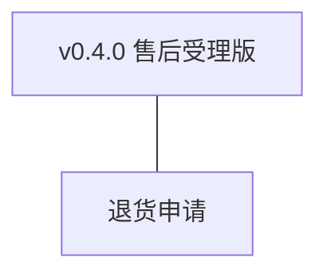
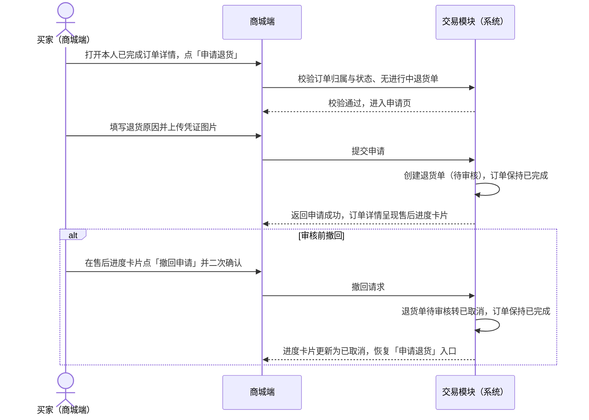
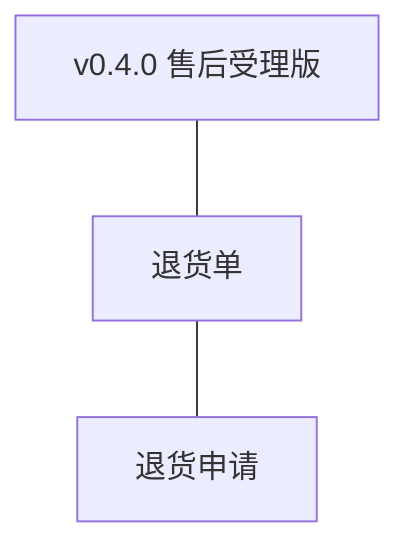
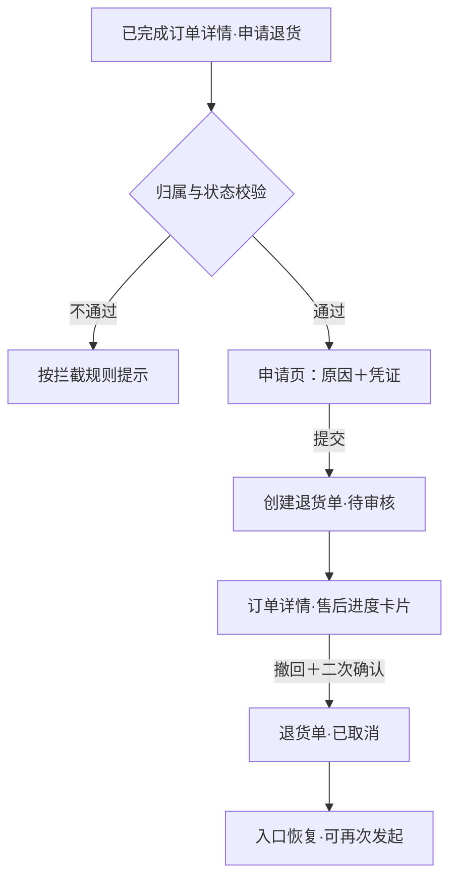

# PRD（小版本）：v0.4.0 售后受理版

> 定位：v0.4.0 的开发级需求说明书——承接 0.4 售后收口版 PRD 与 02、认领自需求池（R41）；上游为模拟案例材料，模拟性质予以保留。

## 1. 版本概述

**承接与目标**：认领 0.4 批次一「售后受理」全部条目（R41 退货申请），交付买家侧售后入口——对已完成订单自助申请退货、查看处理进度、审核前可撤回；本版可验收形态＝买家提交退货申请后退货单待审核可见、进度可查，审核前可撤回（撤回后订单保持已完成），申请受理面可独立演示。

**范围外声明**：客服审核、渠道退款、库存回补、台账支出与收支台账查询随 0.4.1（R42~R45）；管理端审核工作台（含待审核队列操作）不在本版；订单状态不发生流转（已完成→售后中随审核能力上线）；独立售后记录列表入口随 0.5 个人记录入口聚合，本版从订单详情进入。

**条目内顺序与依赖**：单条目版本，无批内顺序；依赖 0.2 的订单状态机（已完成状态判定）与订单详情呈现（引用上游批次一依赖声明）。

## 2. 需求范围与验收锚

| 编号 | 需求名 | 用途 | 验收标准 |
|---|---|---|---|
| R41 | 退货申请 | 买家对已完成订单自助发起退货退款并跟踪处理进度 | 买家在商城端对本人已完成订单提交退货申请（含原因与凭证）后，系统生成待审核的退货单并呈现处理进度；客服审核前买家可撤回，撤回后退货单转已取消且订单保持已完成 |

锚定说明：上表需求名、用途、验收标准逐字引自 0.4 02 批次一需求表（其又逐字锚定 0.4 PRD 4.1 功能清单）；本文只细化不改写，验收以本表为锚。

## 3. 核心用户旅程

旅程承接说明：承接 0.4 PRD 3.1「退货退款」旅程的**申请段**——发起申请→退货单待审核→（审核前撤回分支）；审核及以后各段（客服审核、寄回、退款完结）不在本版旅程内，随 v0.4.1 交付后在该版旅程中承接。

### 3.1 发起退货申请（买家，跨主体交接至售后单据）

操作步骤清单：

1. 买家在商城端「我的订单」打开本人**已完成**订单详情，点击「申请退货」。
2. 系统校验：订单属当前会员、订单状态＝已完成、该订单无未到终态的退货单；通过则进入申请页，否则按拦截规则提示（见 R41 异常与拦截）。
3. 买家填写退货原因（必填，5~200 字，可点常见原因快捷填入），上传凭证图片（必填，1~3 张）。
4. 点击「提交申请」，系统创建退货单（状态＝待审核 `PENDING_REVIEW`），订单保持已完成；页面返回订单详情，售后进度卡片显示「待审核」。
5. 需要撤回时，买家在售后进度卡片点「撤回申请」，二次确认后退货单转已取消 `CANCELLED`，订单保持已完成，入口恢复可再次发起。

## 4. 功能需求

### 4.1 功能总览

**对象增删改查矩阵**：

| 对象 | 增 | 改 | 删 | 查 |
|---|---|---|---|---|
| 退货单 | R41（申请创建） | R41（撤回：待审核→已取消）；审核流转随批次二（R42） | 不做（退货单不做删除，术语表逻辑删除契约将退货单列为不可删除对象） | R41（本人退货单进度查询）；客服侧查询审核随批次二（R42） |
| 订单 | 不做（下单沿用 0.2） | 不做（本版订单状态不流转；售后中流转随批次二） | 不做（同左） | 沿用 0.2（订单详情与已完成判定为本版入口依据） |
| 图片资源 | 沿用 0.1（上传能力）；本版新增退货凭证关联 | 不做 | 不做 | 沿用（凭证图随退货单呈现） |

**主体使用面**：

| 主体 | 端 | 使用条目 |
|---|---|---|
| 买家 | 商城端 | R41 全部交互（入口、申请、进度、撤回） |
| 客服人员 | 管理端 | 本版无操作面（审核工作台随 v0.4.1） |
| 管理者 | 管理端 | 本版无操作面 |

### 4.2 R41 退货申请

**功能说明**：买家对本人已完成订单自助发起退货退款并跟踪处理进度。触发：买家在商城端已完成订单详情点击「申请退货」，或在售后进度卡片点击「撤回申请」。

**交互与流程**：

操作步骤清单：

1. 入口与前置：仅本人、状态＝已完成、无未到终态退货单（待审核／待退货）的订单显示可用「申请退货」入口；不满足时入口置灰或隐藏并给出对应提示（见异常与拦截 A1~A3）。
2. 申请页信息项：退货原因（必填文本，可快捷填入）、凭证图片（必填，1~3 张，支持 jpg／png／webp）；页面底部「提交申请」按钮。
3. 提交成功：系统生成退货单（退货单号按 `RET`＋日期＋6 位当日序列），状态＝待审核；订单详情出现售后进度卡片（退货单号、状态「待审核」、申请时间、原因摘要、凭证缩略图、「撤回申请」按钮）。
4. 撤回：仅待审核状态可撤回；点击后弹二次确认（「撤回后本次申请终止，可重新发起」），确认后退货单转已取消、进度卡片更新、入口恢复。
5. 进度查询：买家在订单详情查看退货单当前状态；本版可见状态为待审核／已取消，其余状态字样随 v0.4.1 审核能力上线后呈现。

**字段与校验**：

| 信息项 | 必填 | 业务类型 | 落库字段名 | 约束与取值 |
|---|---|---|---|---|
| 退货单号 | 是（系统生成） | 编码字符串 | `return_no` | `RET`＋日期（yyyyMMdd）＋6 位当日序列（术语表编码契约） |
| 关联订单 | 是 | 外键引用 | `order_id` | 引用 trade_order.id，须为当前会员本人订单 |
| 退货原因 | 是 | 文本 | `reason` | 5~200 字；快捷选项仅为填入辅助，不落独立枚举 |
| 凭证图片 | 是 | 图片关联 | 经 sys_image_asset（`biz_type`＝`return`＋`biz_id`＝退货单 id） | 1~3 张，单张 ≤5MB，jpg／png／webp |
| 状态 | 是（系统维护） | 状态枚举 | `status` | 待审核 `PENDING_REVIEW`／已取消 `CANCELLED`（本版可达）；待退货／退款完成／已拒绝随 v0.4.1 |
| 撤回时点 | 撤回时写入 | 时间点 | `cancelled_at` | 撤回成功时间；未撤回为空 |

**规则与边界**：

1. 仅状态＝已完成且属当前会员的订单展示可用「申请退货」入口；其余订单状态不展示入口。
2. 同一订单存在状态为待审核或待退货的退货单时，不可再次发起（提交与入口双层拦截，后端以条件创建兜底并发）。
3. 退货单到达终态后：已取消或已拒绝的订单可再次发起申请；已退款完成的订单不可再次发起（整单退口径下一次成功退款即完结该订单售后，0.4 PRD 5.1）。
4. 撤回仅对待审核状态有效；已取消为终态、同单不可复活，再次申请生成新退货单与新退货单号。
5. 退货单创建与撤回均留痕（操作者／时间／动作，规范）；退货单不做删除。
6. 提交按钮防重复点击；同一订单并发提交仅第一笔生效，第二笔按规则 2 拦截。

**异常与拦截**：

| # | 场景 | 系统行为（用户可见） |
|---|---|---|
| A1 | 订单非本人或状态非已完成时触达申请路径 | 提示「仅已完成订单可申请退货」，不进入申请页 |
| A2 | 该订单已有未到终态退货单 | 入口置灰并提示「已有进行中的售后申请」；直接提交则拦截并返回同一提示 |
| A3 | 已退款完成的订单再次发起 | 提示「该订单售后已完成，不可重复申请」 |
| A4 | 原因长度不足 5 字或超过 200 字 | 提交前即时提示「请填写 5~200 字退货原因」，不发起请求 |
| A5 | 凭证为 0 张、超过 3 张或单张超 5MB／格式不支持 | 选择时即时提示「请上传 1~3 张图片（jpg／png／webp，每张不超过 5MB）」，超限图片不入列 |
| A6 | 提交或撤回请求失败（网络／系统异常） | 提示「提交失败，请稍后重试」，已填写的原因与已选凭证保留不丢失 |
| A7 | 撤回二次确认取消 | 关闭确认弹层，退货单保持待审核，无任何变更 |

## 5. 业务对象与数据字段

**数据主体清单**：

| 业务对象 | 落库名 | 定位与关系 |
|---|---|---|
| 退货单 | `trade_return`（新表，本版创建） | 售后申请与处理记录；关联订单（`order_id`）；状态枚举见术语表第 4 节 |
| 订单 | `trade_order`（沿用 0.2） | 本版只读（归属与已完成判定），不新增字段、不发生状态流转 |
| 图片资源 | `sys_image_asset`（沿用 0.1） | 凭证图经 `biz_type`＝`return` 关联退货单；表结构沿用，仅新增业务类型取值 |

**退货单（trade_return）字段表**：

| 字段 | 必填 | 业务类型 | 落库字段名 | 约束与取值 |
|---|---|---|---|---|
| 退货单号 | 是 | 编码字符串 | `return_no` | 唯一；`RET`＋日期＋6 位当日序列 |
| 关联订单 | 是 | 外键引用 | `order_id` | 引用 trade_order.id |
| 退货原因 | 是 | 文本 | `reason` | 5~200 字 |
| 状态 | 是 | 状态枚举 | `status` | 待审核 `PENDING_REVIEW`／已取消 `CANCELLED`（本版可达）；待退货 `PENDING_RETURN`／退款完成 `REFUNDED`／已拒绝 `REJECTED` 随 v0.4.1 落位 |
| 撤回时点 | 否 | 时间点 | `cancelled_at` | 撤回成功时写入 |
| 创建／更新时间 | 是 | 时间戳 | `created_at`／`updated_at` | 通用字段，不另定名 |

审核结论与审核理由字段随 v0.4.1 认领（R42）时定名登记；列类型、主键、索引与建表 DDL 归开发阶段。

**订单（trade_order）**：本版无新增字段；读取 `status`（已完成判定）与 `customer_id`（归属校验），均沿用 v0.2.1 登记名。

**图片资源（sys_image_asset）**：沿用既有字段；`biz_type` 取值新增 `return`（退货凭证）。

## 6. 待议与建议

**本版采用的推断与默认值汇总**：

| 采用值 | 来源状态 |
|---|---|
| 退货原因 5~200 字、凭证 1~3 张、单张 ≤5MB、jpg／png／webp | 行业惯例默认（推断），上游未规定 |
| 同一订单至多一张未到终态退货单；已取消／已拒绝后可再次发起、已退款完成不可再发起 | 整单退口径推导（0.4 PRD 5.1）＋行业惯例默认（推断） |
| 常见原因快捷选项仅为填入辅助、不落独立枚举 | 实现细节（推断），避免新增术语表枚举 |
| 撤回二次确认文案「撤回后本次申请终止，可重新发起」 | 行业惯例默认（推断） |

**待确认内容与影响**：寄回时限、退款到账提示文案等随 v0.4.1 相关条目落地（04C-交易留版本级项），本版不触及。

**建议回池的新想法**：无（管理端审核工作台已属 R42 范围，无需另立条目）。

**术语表待登记行（随本文回报，由主流程合入）**：

- 编码契约新增「v0.4.0 售后域落库表与字段」：新表 `trade_return`，新名 `return_no`、`reason`、`cancelled_at`（`order_id`、`status` 复用既有名）。
- 图片关联业务类型（biz_type 取值）行扩展：`return`（退货凭证）〔v0.4.0〕。
