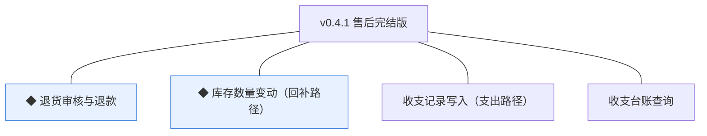
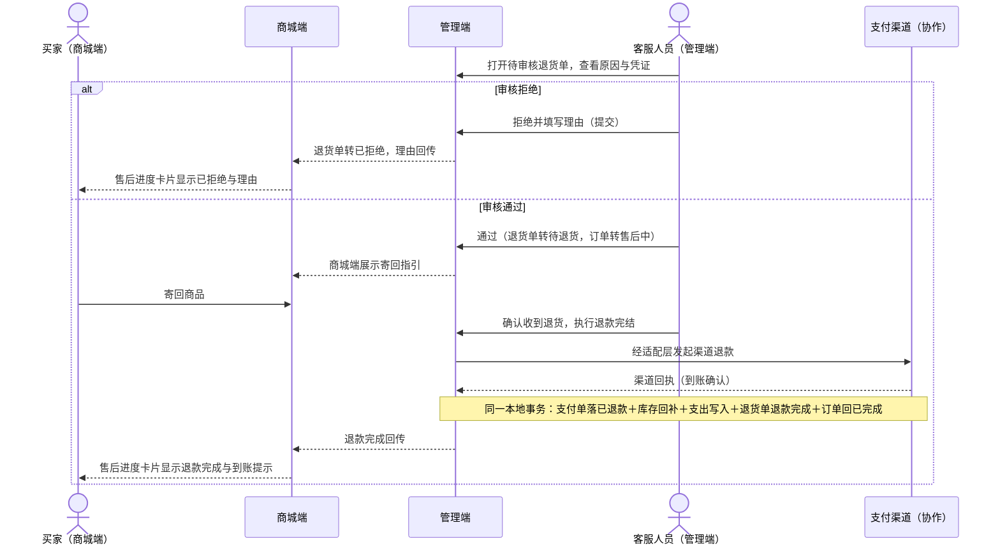
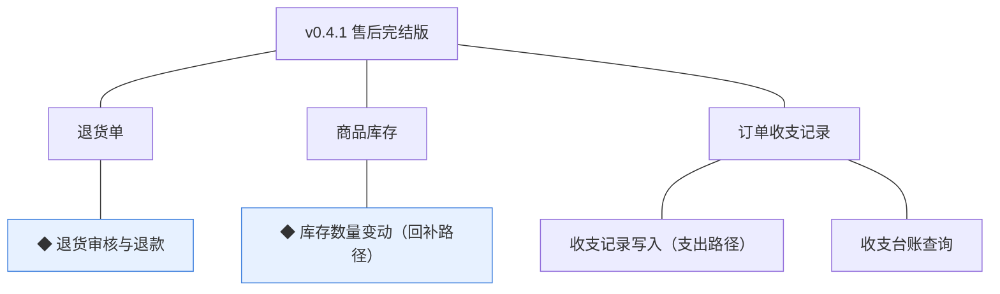
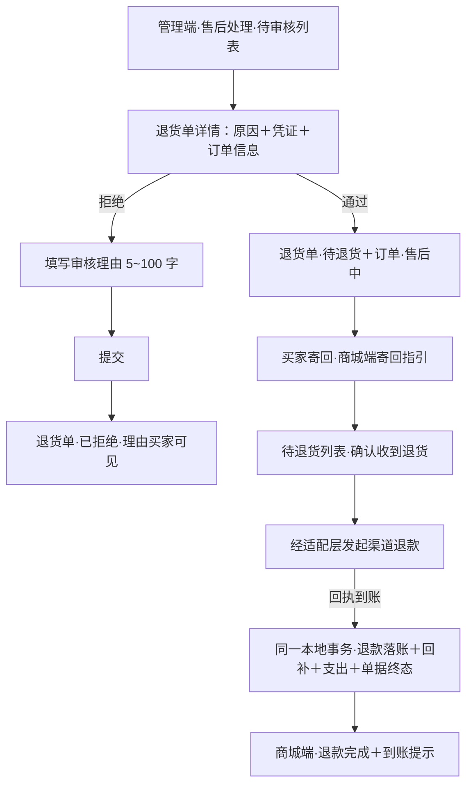
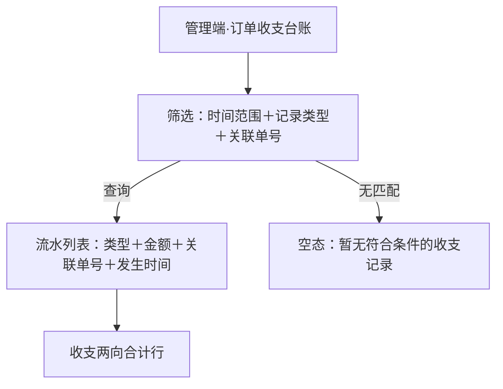

# PRD（小版本）：v0.4.1 售后完结版

> 定位：v0.4.1 的开发级需求说明书——承接 0.4 售后收口版 PRD 与 02、认领自需求池（R42~R45）；上游为模拟案例材料，模拟性质予以保留。

## 1. 版本概述

**承接与目标**：认领 0.4 批次二「售后完结与台账」全部条目（R42 ◆ 退货审核与退款、R43 ◆ 库存数量变动（回补路径）、R44 收支记录写入（支出路径）、R45 收支台账查询；同事务契约 R42/R43/R44 不拆批，整批认领），交付售后闭环收口——审核完结（退款、回补、写支出同事务）与收支台账两向查询；本版可验收形态＝一笔退货从审核通过→寄回确认→退款到账→库存回补→台账支出记录全流程系统内完结，订单回已完成、支付单转已退款，管理者可查收支两向流水。本版发布后 0.4 大版本完成标志达成。

**范围外声明**：退货申请（含撤回）已随 v0.4.0 交付；换货补发（暂缓清单）、商品评价与咨询（0.5）、统计报表与导出（0.7）不在本版；退货单不提供人工编辑与删除（D6 快照原则推论）。

**条目内顺序与依赖**：R42 审核操作面先行（待审核队列就绪自 v0.4.0），R43/R44 随 R42 的退款完结事务同批成立（同事务契约，引用 0.4 02 批次二），R45 查询最后验收（完整验收依赖本批支出数据）；依赖 v0.4.0（退货单待审核就绪）、0.2（支付单、成交快照、台账收入路径）。外部挂点：渠道退款经适配层发起、到账确认以渠道回执为准（K6）。

## 2. 需求范围与验收锚

| 编号 | 需求名 | 用途 | 验收标准 |
|---|---|---|---|
| R42 | ◆ 退货审核与退款 | 客服人员在管理端审核退货申请并在系统内完结退款 | 客服人员对待审核退货单作出通过或拒绝（拒绝必须填写理由且商城端买家可见）；通过并确认收到买家寄回商品后，系统在同一事务内完成渠道退款与单据落位——退货单转退款完成、支付单转已退款、订单经售后中回已完成 |
| R43 | ◆ 库存数量变动（回补路径） | 售后完结时把退货数量回补进规格级库存台账（本版交付回补路径；锁定与扣减路径已于 v0.2.1 交付） | 退货单退款完结时，系统在同一事务内按该订单成交数量回补对应规格的可售量并留变动痕迹，回补后库存台账数量与变动记录可核对 |
| R44 | 收支记录写入（支出路径） | 售后退款完成事实写入订单收支台账的支出方向（本版交付支出路径；收入路径已于 v0.2.1 交付） | 退货单退款完结时，系统在同一事务内写入一条支出记录（金额＝退款金额、关联退货单号），按退货单号防重、不产生第二条 |
| R45 | 收支台账查询 | 管理者在管理端查询订单收支流水，收入与支出两向齐备 | 管理者按时间、记录类型（收入／支出／冲正）与关联单号查询台账流水，收入与支出记录完整呈现且金额分别与对应支付单、退货单一致 |

锚定说明：上表需求名、用途、验收标准逐字引自 0.4 02 批次二需求表（其又逐字锚定 0.4 PRD 4.1～4.3 功能清单）；本文只细化不改写，验收以本表为锚。

## 3. 核心用户旅程

旅程承接说明：承接 0.4 PRD 3.1「退货退款」旅程的**完结段**——审核→（拒绝分支｜寄回→确认收货→退款完结）→台账可查；申请段（发起→待审核→撤回）已随 v0.4.0 交付，不在本版旅程内重复。R45 台账查询为管理者单端简单查询（验收标准可覆盖），不成旅程。

### 3.1 售后完结（买家×客服人员×支付渠道，跨端跨主体）

操作步骤清单：

1. 客服人员在管理端「售后处理」打开待审核退货单，查看退货原因、凭证与关联订单信息。
2. 拒绝：填写审核理由（必填 5~100 字）提交——退货单转已拒绝（终态），理由回传商城端买家可见；订单保持已完成。
3. 通过：退货单转待退货、订单由已完成转售后中；商城端售后进度卡片展示寄回指引（回寄地址与「请尽快寄回」提示）。
4. 买家寄回商品后，客服人员在待退货列表对该退货单「确认收到退货，执行退款完结」。
5. 系统经适配层向支付渠道发起退款（K6），以渠道回执确认到账。
6. 到账确认后系统在同一本地事务内完成：支付单转已退款、按订单成交数量回补对应规格可售量、写入台账支出记录（关联退货单号）、退货单转退款完成（终态）、订单由售后中回已完成。
7. 商城端售后进度卡片显示「退款完成」与到账提示；管理者在订单收支台账可查到该笔支出（关联退货单号）。

## 4. 功能需求

### 4.1 功能总览

**对象增删改查矩阵**：

| 对象 | 增 | 改 | 删 | 查 |
|---|---|---|---|---|
| 退货单 | 沿用 v0.4.0（申请创建） | R42（审核流转：待审核→待退货／已拒绝；确认收货→退款完成；审核与时间点字段写入） | 不做（退货单不做删除，术语表逻辑删除契约） | R42（客服侧待审核／待退货列表与详情） |
| 订单 | 不做（下单沿用 0.2） | R42（已完成→售后中→已完成，随审核与完结流转） | 不做 | 沿用 0.2 |
| 支付单 | 不做（沿用 0.2） | R42（支付成功→已退款，随退款完结） | 不做 | 沿用 0.2 |
| 商品库存 | 不做（台账行沿用 0.1） | R43（可售量回补，与退货完结同事务） | 不做 | 沿用（变动记录可核对即 R43 验收） |
| 订单收支记录 | R44（支出记录，与退货完结同事务；收入沿用 0.2） | 不做（只读追加，D8） | 不做 | R45（管理者台账查询） |

**主体使用面**：

| 主体 | 端 | 使用条目 |
|---|---|---|
| 客服人员 | 管理端 | R42（待审核列表、审核页、待退货确认收货与退款完结） |
| 管理者 | 管理端 | R45（订单收支台账查询） |
| 买家 | 商城端 | R42 的结果可见面（审核结论、拒绝理由、寄回指引、退款完成与到账提示——被动呈现，无操作） |
| 交易模块（协作） | 系统 | R43、R44——机制条目，无人工触发面（随 R42 退款完结事务自动执行） |

### 4.2 R42 ◆ 退货审核与退款

**功能说明**：客服人员在管理端审核退货申请并在系统内完结退款。触发：客服人员在管理端「售后处理」对待审核退货单提交审核结论，或对待退货退货单确认收到退货并执行退款完结。

**交互与流程**：

操作步骤清单：

1. 客服人员在管理端「售后处理」查看待审核列表（退货单号、订单号、买家、申请时间、原因摘要），点击进入退货单详情（完整原因、凭证大图、关联订单与订单项、订单实付金额）。
2. 审核拒绝：选择「拒绝」→审核理由输入框（必填 5~100 字）→提交；退货单转已拒绝，详情与商城端买家侧展示理由原文。
3. 审核通过：选择「通过」→提交；退货单转待退货、订单转售后中；商城端售后进度卡片更新为「待退货」并展示寄回指引。
4. 买家寄回后，客服在待退货列表点「确认收到退货，执行退款完结」；系统经适配层发起渠道退款，等待渠道回执。
5. 回执到账确认后，系统在同一本地事务内完成五项落位（支付单已退款、库存回补、支出写入、退货单退款完成、订单回已完成）；管理端提示「退款完结成功」，商城端展示「退款完成」与到账提示。
6. 买家侧全程无操作：审核结论、拒绝理由、寄回指引、退款完成状态随退货单状态在售后进度卡片自动呈现。

**字段与校验**：

| 信息项 | 必填 | 业务类型 | 落库字段名 | 约束与取值 |
|---|---|---|---|---|
| 审核结论 | 是（审核时写入） | 枚举 | `audit_conclusion` | 通过 `APPROVED`／拒绝 `REJECTED`，与状态机联动（通过→待退货；拒绝→已拒绝） |
| 审核理由 | 拒绝时必填 | 文本 | `audit_reason` | 5~100 字；拒绝必填且商城端买家可见，通过时可空 |
| 审核时点 | 是（审核时写入） | 时间点 | `audited_at` | 审核提交时间 |
| 收货确认时点 | 是（确认时写入） | 时间点 | `received_at` | 客服确认收到退货时间 |
| 退款完成时点 | 是（完结时写入） | 时间点 | `refunded_at` | 渠道回执到账确认后事务提交时间 |
| 退款金额 | 是（系统取值） | 金额（分） | 不落退货单，取自关联支付单 `pay_amount` | ＝订单实付金额（整单退口径，0.4 PRD 5.1）；不超过订单实付金额 |

**规则与边界**：

1. 仅待审核状态可执行审核（通过或拒绝）；仅待退货状态可执行确认收货与退款完结；状态前置条件以条件更新保护并发。
2. 审核拒绝必须填写理由（5~100 字）并回传商城端买家可见；拒绝后退货单终态，订单保持已完成。
3. 审核通过后订单转售后中；退款完结后订单由售后中回已完成；全程不产生新订单（D6 快照原则）。
4. 退款完结的本地事务五项（支付单落已退款、库存回补、支出写入、退货单转退款完成、订单回已完成）要么全部成立要么全部回滚（规范：同事务）。
5. 渠道退款经适配层发起，到账确认以渠道回执为准（K6）；回执未达前退货单保持待退货，不落任何后续状态。
6. 审核时退货单已被买家撤回（并发）则审核失败并提示，以退货单当前状态为准。
7. 退款金额＝订单实付金额（用券订单按实付退），不做部分退（0.4 PRD 立项定案）。
8. 审核与退款完结动作均留痕（操作者／时间／动作）；退货单与支付单不做删除。

**异常与拦截**：

| # | 场景 | 系统行为（用户可见） |
|---|---|---|
| A1 | 拒绝未填理由或长度不足 5 字／超 100 字 | 提交前即时提示「请填写 5~100 字审核理由」，不发起请求 |
| A2 | 审核时退货单已被撤回（并发） | 提示「该申请已撤回」，列表刷新后该单移出待审核 |
| A3 | 渠道退款失败或回执超时 | 退货单保持待退货，管理端提示「渠道退款未成功，可重试」；重试仍走同一完结流程，无部分落位 |
| A4 | 重复点击确认收货／重复发起完结 | 幂等拦截：已进入完结流程的退货单提示「退款完结处理中」，不产生第二笔退款 |
| A5 | 非客服角色访问售后处理菜单 | 菜单不可见（能力点控制，D4）；直接访问接口返回无权限 |
| A6 | 完结事务部分失败（如库存回补异常） | 整体回滚，退货单保持待退货，管理端提示「完结失败，请重试」；无中间态落库 |

### 4.3 R43 ◆ 库存数量变动（回补路径）

**功能说明**：售后完结时把退货数量回补进规格级库存台账（本版交付回补路径；锁定与扣减路径已于 v0.2.1 交付）。触发：R42 退款完结事务内系统自动执行，无人工触发面。

**交互与流程**：无——机制条目，无人工触发面；触发点与同事务边界见 3.1 旅程图「确认收到退货」之后的同一本地事务。

**字段与校验**：

| 信息项 | 必填 | 业务类型 | 落库字段名 | 约束与取值 |
|---|---|---|---|---|
| 回补数量 | 是（系统取值） | 数量 | 不新增字段，按订单项 `quantity` 逐规格合计 | ＝该订单各订单项成交数量（整单退口径） |
| 变动留痕 | 是 | 留痕记录 | 沿用库存变动留痕机制（谁／何时／何因） | 何因＝退货完结，关联退货单号 |

**规则与边界**：

1. 回补与退货完结同一本地事务成立，事务边界同 R42 规则 4。
2. 回补按订单成交数量逐规格回增可售量（`available_qty`），条件更新保护并发（K5）。
3. 商品已下架或档案变更不影响回补——库存台账独立于商品状态，订单事实以快照为准（D6 推论）。
4. 台账变动必须可追溯（谁／何时／何因，规范留痕）；回补后库存台账数量与变动记录可核对（验收锚）。

**异常与拦截**：无独立异常面——回补失败即整个完结事务回滚（R42 A6），不出现回补成功而退款未落的中间态。

### 4.4 R44 收支记录写入（支出路径）

**功能说明**：售后退款完成事实写入订单收支台账的支出方向（本版交付支出路径；收入路径已于 v0.2.1 交付）。触发：R42 退款完结事务内系统自动执行，无人工触发面。

**交互与流程**：无——机制条目，无人工触发面；触发点与同事务边界见 3.1 旅程图。

**字段与校验**：

| 信息项 | 必填 | 业务类型 | 落库字段名 | 约束与取值 |
|---|---|---|---|---|
| 记录类型 | 是（系统写入） | 枚举 | `record_type` | 支出 `EXPENSE`（术语表订单收支记录类型行） |
| 金额 | 是（系统取值） | 金额（分） | `amount` | ＝退款金额＝订单实付金额，整数分（K10） |
| 关联单号 | 是 | 业务单号 | `related_no` | 退货单号（`RET` 前缀），按此防重 |
| 发生时间 | 是（系统写入） | 时间点 | `occurred_at` | 退款完结事务提交时间 |

**规则与边界**：

1. 支出记录与退货完结同一本地事务写入；一次退款事实一条记录，按退货单号防重（唯一约束兜底并发与重试）。
2. 台账只读追加、不提供编辑与删除（D8）；金额与交易事实严格一致（K10）。
3. 重复执行完结流程（重试场景）不产生第二条支出记录（防重即验收锚）。

**异常与拦截**：无独立异常面——写入失败即整个完结事务回滚（R42 A6）；防重冲突（同退货单号第二条）被唯一约束拒绝。

### 4.5 R45 收支台账查询

**功能说明**：管理者在管理端查询订单收支流水，收入与支出两向齐备。触发：管理者在管理端「订单收支台账」进入查询页并设定筛选条件。

**交互与流程**：

操作步骤清单：

1. 管理者在管理端「订单收支台账」进入查询页（菜单按能力点可见，D4）。
2. 设定筛选：时间范围（起止日期）、记录类型（全部／收入／支出／冲正）、关联单号（支付单号或退货单号，精确匹配），点「查询」。
3. 流水列表按发生时间倒序呈现：记录类型（中文）、金额（元，两位小数）、关联单号、发生时间；每页 20 条、可翻页（行业惯例默认，推断）。
4. 列表下方呈现当前筛选范围的收入合计与支出合计两行（冲正计入支出向冲抵呈现，行业惯例默认，推断）。
5. 点击关联单号可查看对应单据编号（只读呈现，不跳转单据详情——单据管理归各自模块）。

**字段与校验**：

| 信息项 | 必填 | 业务类型 | 落库字段名 | 约束与取值 |
|---|---|---|---|---|
| 时间范围 | 否 | 日期区间 | `occurred_at` | 起止日期，默认当月（行业惯例默认，推断） |
| 记录类型 | 否 | 枚举筛选 | `record_type` | 全部／收入 `INCOME`／支出 `EXPENSE`／冲正 `REVERSAL` |
| 关联单号 | 否 | 精确匹配 | `related_no` | 支付单号（`PAY`）或退货单号（`RET`） |
| 呈现列 | — | 只读 | `record_type`／`amount`／`related_no`／`occurred_at` | 金额展示为人民币元（两位小数），汇总先按分求和再换算（K10 推论） |

**规则与边界**：

1. 查询只读，不提供任何编辑、删除或导出（导出随 0.7 报表导出）。
2. 收入记录金额与对应支付单一致、支出记录金额与对应退货单退款金额一致（验收锚；数据由写入侧保证，查询侧如实呈现）。
3. 台账查询菜单按角色能力点控制（D4）：仅管理者可见。
4. 统计口径的对账不变式（收入－支出－冲正净额）随 0.7 经营复盘交付，本版仅流水与合计呈现。

**异常与拦截**：

| # | 场景 | 系统行为（用户可见） |
|---|---|---|
| A1 | 筛选无匹配数据 | 空态提示「暂无符合条件的收支记录」 |
| A2 | 非管理者角色访问台账菜单 | 菜单不可见（能力点控制，D4）；直接访问接口返回无权限 |
| A3 | 时间范围起止倒置 | 即时提示「请选择正确的时间范围」，不发起查询 |

## 5. 业务对象与数据字段

**数据主体清单**：

| 业务对象 | 落库名 | 定位与关系 |
|---|---|---|
| 退货单 | `trade_return`（沿用 v0.4.0，本版新增审核与完结字段） | 售后申请与处理记录；本版补齐审核结论／理由与三个时间点字段后对象完整 |
| 订单 | `trade_order`（沿用 0.2） | 本版状态流转（已完成→售后中→已完成），不新增字段 |
| 支付单 | `trade_payment`（沿用 0.2） | 本版状态流转（支付成功→已退款），不新增字段 |
| 商品库存 | `prod_stock`（沿用 0.1） | 本版新增回补路径（`available_qty` 回增＋变动留痕），不新增字段 |
| 订单收支记录 | `rpt_order_finance`（沿用 0.2） | 本版新增支出路径写入与查询消费，字段全部沿用 v0.2.1 登记 |

**退货单（trade_return）本版新增字段**：

| 字段 | 必填 | 业务类型 | 落库字段名 | 约束与取值 |
|---|---|---|---|---|
| 审核结论 | 审核时写入 | 枚举 | `audit_conclusion` | 通过 `APPROVED`／拒绝 `REJECTED` |
| 审核理由 | 拒绝时必填 | 文本 | `audit_reason` | 5~100 字，买家可见 |
| 审核时点 | 审核时写入 | 时间点 | `audited_at` | — |
| 收货确认时点 | 确认时写入 | 时间点 | `received_at` | — |
| 退款完成时点 | 完结时写入 | 时间点 | `refunded_at` | — |

其余对象（订单／支付单／商品库存／订单收支记录）本版零新增字段，状态与路径变化按第 4 章规则执行；列类型、主键、索引与建表 DDL 归开发阶段。

## 6. 待议与建议

**本版采用的推断与默认值汇总**：

| 采用值 | 来源状态 |
|---|---|
| 审核理由 5~100 字、拒绝必填且买家可见 | 行业惯例默认（推断）；「必填且可见」为验收锚原文 |
| 不设寄回超时自动取消，界面提示「请尽快寄回」 | 从状态机推导——退货单无待退货超时流转（术语表第 4 节、04C-交易 4） |
| 退款到账提示文案「退款已原路退回，到账以支付渠道为准」 | 行业惯例默认（推断），承接 v0.4.0 已知限制中「到账提示文案随本版落地」 |
| 台账列表每页 20 条、默认当月时间范围、收支合计两行（冲正计入支出向冲抵） | 行业惯例默认（推断） |
| 退款金额取支付单实付、不落退货单金额字段 | 整单退口径推导（0.4 PRD 5.1）＋单一事实源（支付单） |

**待确认内容与影响**：渠道退款回执超时阈值（重试提示的等待上限）留开发阶段按渠道约定配置，不影响验收锚。

**建议回池的新想法**：无。

**术语表待登记行（随本文回报，由主流程合入）**：

- 编码契约新增「v0.4.1 售后域扩展字段」：trade_return 新增 `audit_conclusion`（枚举 通过 `APPROVED`／拒绝 `REJECTED`）、`audit_reason`、`audited_at`、`received_at`、`refunded_at`（5 个新名）。
