# PRD（大版本）：0.5 服务体验版

> 定位：0.5 服务体验版的立项需求说明书——承接路线图 2.5 条目与项目 PRD，把购物后体验主题切为本版的功能、验收标准与对象版本级行为；上游为模拟案例材料，模拟性质予以保留。

## 1. 版本概述

**承接与目标**：购物后体验收口——评价有处写、问题有处问、账号生命周期可自助管理（路线图 2.5）。0.2 咨询真空期（客服电话／即时通讯人工答疑）在本版结束：咨询受理进入系统内工单闭环；帮助中心上线自助分流；评价开放；个人中心其余自助能力（资料凭据、记录入口聚合、注销）归位。本版成功标准（承接完成标志）：买家完成一笔订单评价并公开展示；一条咨询从创建到完结全流程系统内处理；买家可自助完成资料修改与注销。量化口径（从版本事实与惯例推导）：自助分流判定＝帮助中心查阅量与新建工单量之比，上线首月达 **3:1** 以上视为分流有效（帮助中心与工单同版本上线、无历史基线，按行业惯例拍板，上线后按实际数据复盘修订）；评价开放判定＝已完成订单项的评价覆盖率随时间上升（观测口径，不设判定线）。

**范围一句话**：做——咨询工单受理与答复流转（创建、我的咨询、客服检索、常见问题引导、答复流转含完结判定与追问重开）、帮助中心（文章增删改查、分类维护、检索查阅）、商品评价（创建、查询与管理）、个人中心自助（资料与凭据维护、个人记录入口聚合、注销）；不做——评价先审后显与注销冷静期（暂缓清单，待业务确认）、即时聊天式会话与机器人自动答复（04C-服务明确不做）、会员等级（0.6）、统计报表（0.7）；0.2 的「客服电话／即时通讯人工答疑」过渡自本版起由系统内工单替代。

**沿用与前置**：沿用 0.2 的订单完成事件与成交快照（评价创建依据）、顾客账号、订单查询；0.3 的持券查看（个人记录入口聚合一并呈现）；0.4 的退货单状态（注销未完结事项校验覆盖）。与 0.3／0.4 无开发依赖（并行无阻，路线图 2.5）。

## 2. 主体与角色

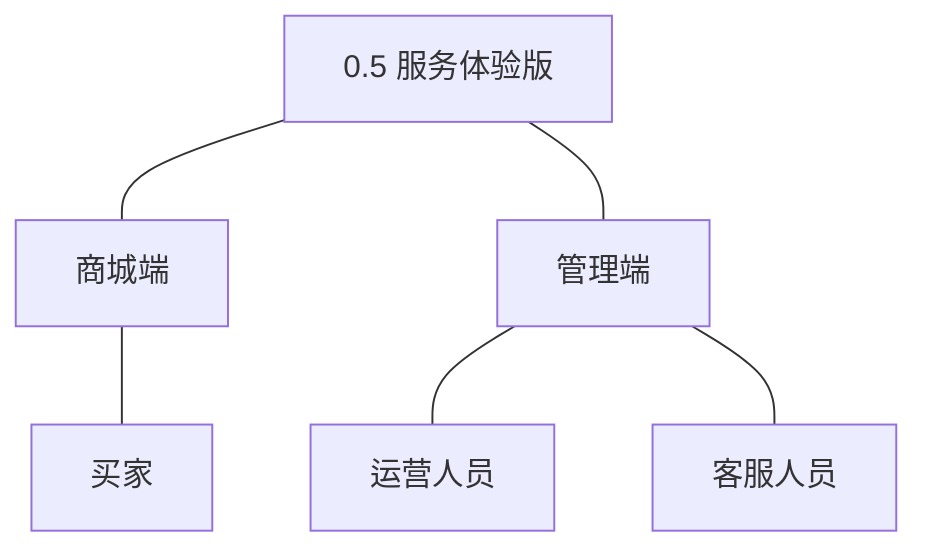

| 主体／角色 | 端 | 怎么用系统 |
|---|---|---|
| 买家 | 商城端 | 写评价、查帮助、发起咨询与追问、维护个人资料与凭据、查个人记录、申请注销 |
| 运营人员 | 管理端 | 维护帮助文章与分类、查询与管理评价（隐藏违规并留痕） |
| 客服人员 | 管理端 | 检索工单、答复与流转（含完结判定） |

裁剪说明：订单履约人员与管理者本版无新功能；商品、内容、服务、顾客模块为本版协作方（评价呈现走商品详情、高频问题取内容模块已发布文章），不进入主体树。

## 3. 核心业务流程

### 3.1 咨询闭环（买家×客服人员，跨端跨主体）

买家就商品或订单问题自助咨询：入口先以帮助中心高频问题分流，未解决再建工单，客服答复、完结，买家可追问重开。

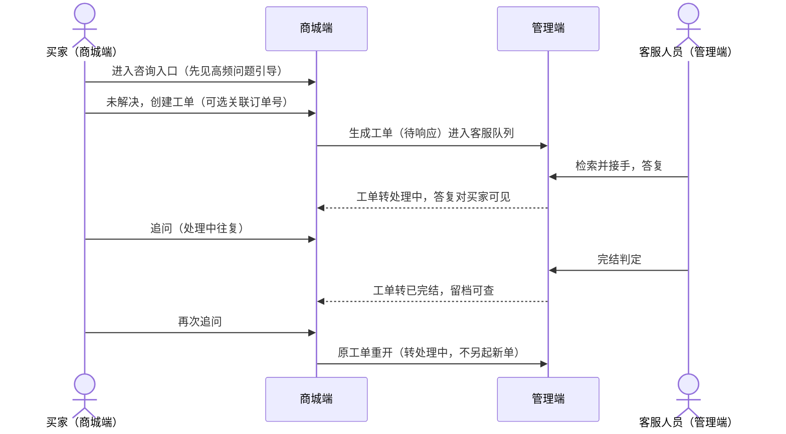

操作步骤清单：

1. 买家在商城端进入咨询入口，先见帮助中心高频问题列表（常见问题引导）；问题解决则不开工单。
2. 未解决时创建工单：填写咨询内容、可选关联订单号，提交后生成工单号，状态＝待响应，在「我的咨询」可见。
3. 客服人员在管理端按状态／顾客／关联单号检索工单，接手并答复；工单转处理中，答复对买家可见。
4. 买家可追问，工单保持处理中往复答复。
5. 客服判定完结（答复且买家无追问后完结，口径归小版本 PRD），工单转已完结，留档可查。
6. 已完结工单被买家再次追问时重开为处理中，不另起新工单（04C-服务 3.5）。

### 3.2 评价创建（买家，单端关键流程）

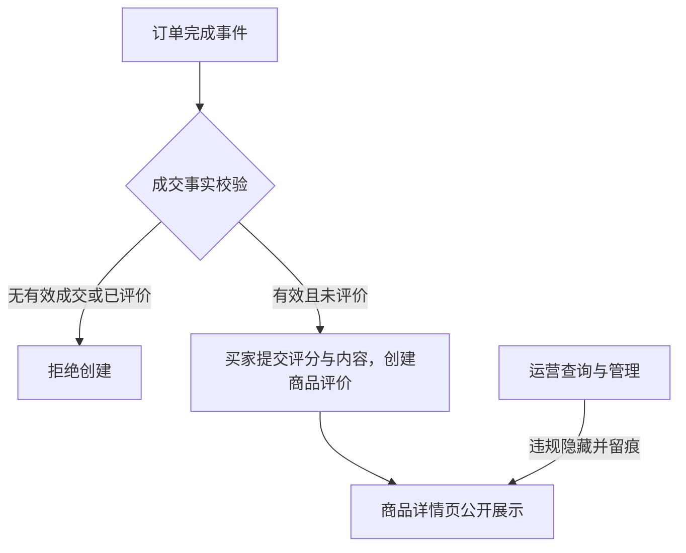

操作步骤清单：

1. 买家在本人已完成订单的订单项上提交评价（评分＋内容，可附图）。
2. 系统校验成交事实与一次成交一条约束，通过后创建评价。
3. 评价在商品详情页公开展示；运营人员可按商品／订单维度查询，违规评价可隐藏并留痕（隐藏后商城端不可见）。

### 3.3 注销（买家，单端关键流程）

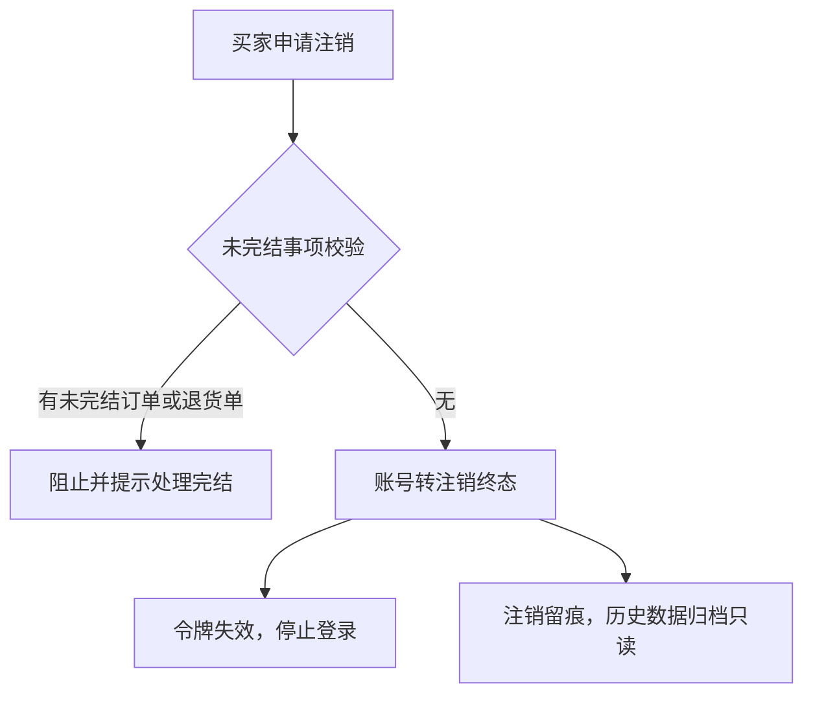

操作步骤清单：

1. 买家在个人中心发起注销申请。
2. 系统校验未完结事项（未完结订单或退货单）；有则阻止并提示先处理完结。
3. 校验通过后账号转注销终态：令牌失效停止登录，身份标识不复用，历史交易事实保留只读，动作留痕。

覆盖说明：咨询闭环为跨端跨主体流程成旅程；评价创建与注销为承载本版主题的关键单端流程各成旅程；帮助检索查阅、资料与凭据维护、个人记录入口聚合为验收标准可覆盖的简单操作，不成旅程。

## 4. 功能需求

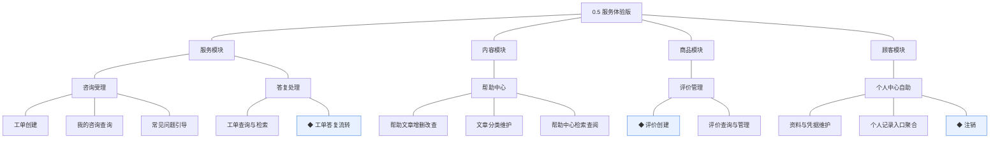

### 4.1 服务模块（咨询受理＋答复处理）

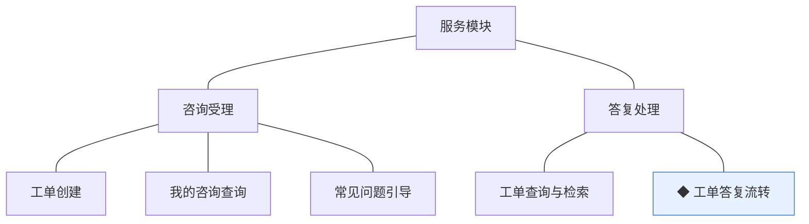

组说明：咨询受理补齐 0.2 以来的咨询真空期（入口自助分流：先高频问题后工单）；答复处理承载客服侧检索与状态流转，完结判定与追问重开为机制核心（04C-服务 3.5）。

| 功能 | 用途 | 验收标准 |
|---|---|---|
| 工单创建 | 买家就商品或订单问题自助发起咨询 | 买家在商城端提交咨询内容（可选关联订单号）后，系统生成待响应的咨询工单并返回工单号，本人在我的咨询中可见 |
| 我的咨询查询 | 买家在个人中心查看本人工单与答复进展 | 买家可查看本人全部工单的状态、咨询内容与往来答复，且仅能见本人工单 |
| 常见问题引导 | 咨询入口先自助分流，减少人工工单量 | 买家进入咨询入口先见帮助中心高频问题列表，未解决时可从引导页直接创建工单 |
| 工单查询与检索 | 客服人员在管理端按维度检索工单并进入处理 | 客服人员按状态、顾客、关联单号检索工单并进入处理，答复后对买家可见 |
| ◆ 工单答复流转 | 客服答复与买家追问驱动的状态流转，含完结判定与重开 | 客服答复后工单转处理中且答复对买家可见；完结判定后工单转已完结；已完结工单被买家追问时重开为处理中且不另起新工单 |

### 4.2 内容模块（帮助中心）

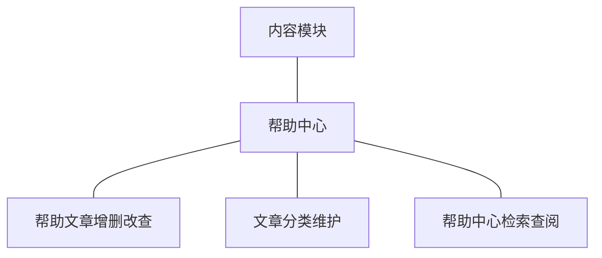

组说明：帮助中心上线——文章与分类由运营维护，买家自助检索查阅；服务模块的常见问题引导按分类只读取已发布文章做入口分流，不复制内容（04C-内容 3.3、04C-服务 3.4）。

| 功能 | 用途 | 验收标准 |
|---|---|---|
| 帮助文章增删改查 | 运营人员维护帮助中心常见问题内容 | 运营人员可新建、编辑、发布与下线帮助文章，仅已发布文章对买家可见 |
| 文章分类维护 | 帮助内容的分类组织 | 运营人员可维护帮助分类树，被文章引用的分类不可删除 |
| 帮助中心检索查阅 | 买家自助查阅购物、支付、售后等常见问题 | 买家按分类或关键词检索并查阅已发布帮助文章 |

### 4.3 商品模块（评价管理）

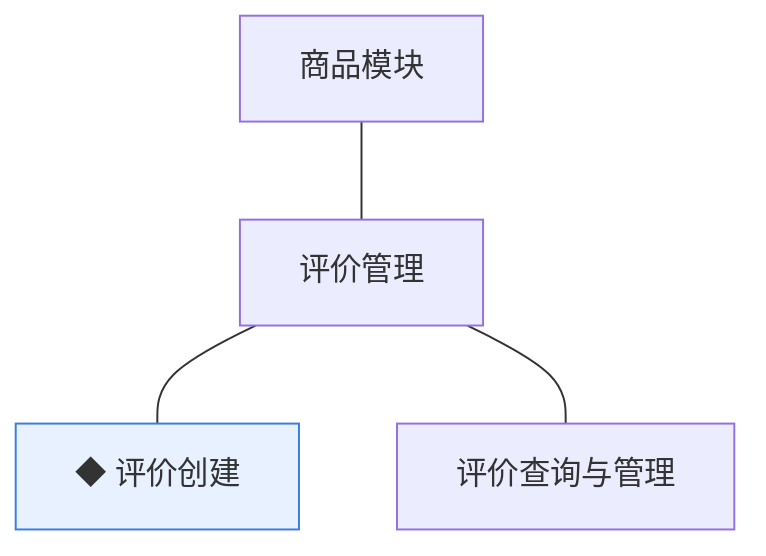

组说明：评价以订单完成事件与成交快照为依据（0.2 沿用），一次成交（订单项）至多一条；呈现于商品详情页，运营可隐藏违规评价并留痕（04C-商品 3.9）。

| 功能 | 用途 | 验收标准 |
|---|---|---|
| ◆ 评价创建 | 订单完成后买家对商品评价，一次成交一条 | 买家对本人已完成订单的订单项提交评价（评分与内容）后创建成功并在商品详情页公开展示，同一订单项至多一条评价 |
| 评价查询与管理 | 评价呈现与运营管理 | 买家可在商品详情页查看该商品的评价列表；运营人员按商品／订单维度查询评价，违规评价可隐藏并留痕，隐藏后商城端不可见 |

### 4.4 顾客模块（个人中心自助）

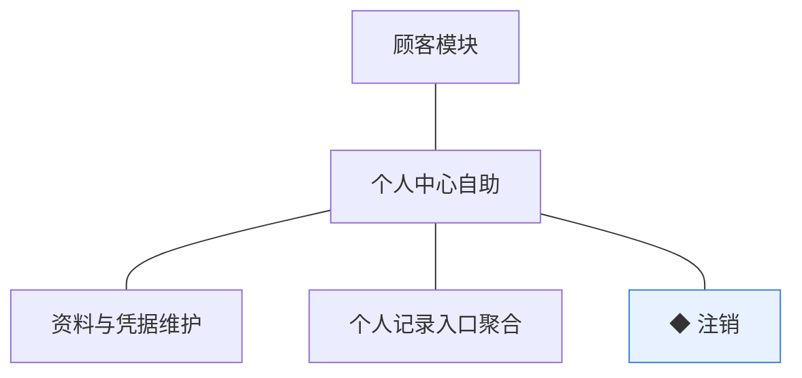

组说明：个人中心其余自助能力归位（路线图拆分纪律：个人设置随 0.1、地址簿随 0.2、其余随 0.5）；聚合只做入口不持有记录（各记录归交易／营销／服务模块，04C-顾客 3.3）。

| 功能 | 用途 | 验收标准 |
|---|---|---|
| 资料与凭据维护 | 买家个人中心自助维护身份资料与登录凭据 | 买家可自助修改昵称、头像等资料并重置登录凭据，修改保存后生效，重置后以新凭据登录 |
| 个人记录入口聚合 | 个人中心统一各业务记录的查询入口 | 买家在个人中心可见订单与售后记录、优惠券持有、我的咨询的查询入口，点击进入对应模块的本人记录查询 |
| ◆ 注销 | 买家账号生命周期自助收口 | 买家申请注销时系统校验无未完结订单或退货单方可注销；注销后账号转注销终态、令牌失效停止登录，历史交易事实保留只读 |

## 5. 业务对象

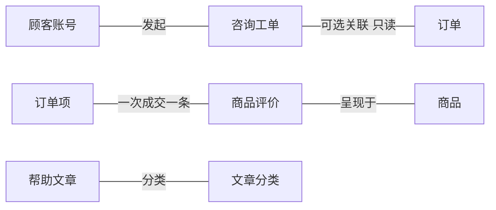

本版新上线咨询工单、帮助文章、商品评价三个对象；顾客账号沿用并新增注销路径；帮助文章无关联业务对象（04C-内容 2.2）。

### 5.1 咨询工单

定位——买家咨询记录与客服协作载体，一问一答的受理与答复（04C-服务）。

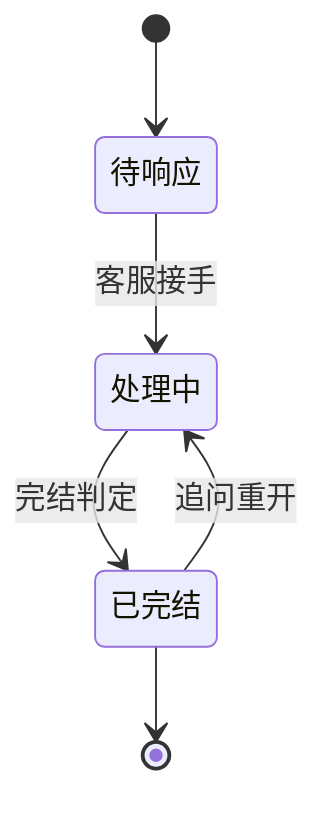

说明：关键组成——工单号（`TIC` 前缀）、发起顾客、咨询内容与往来答复、可选关联订单号、状态、完结时间（术语表）。终态：已完结（追问可重开回处理中，条件终态）；重开不另起新工单，同一事实一个载体（D6 推论）。完结判定口径（答复后多久无追问自动完结）归小版本 PRD 定值。

### 5.2 帮助文章

定位——帮助中心的常见问题内容，运营维护、买家自助查阅。

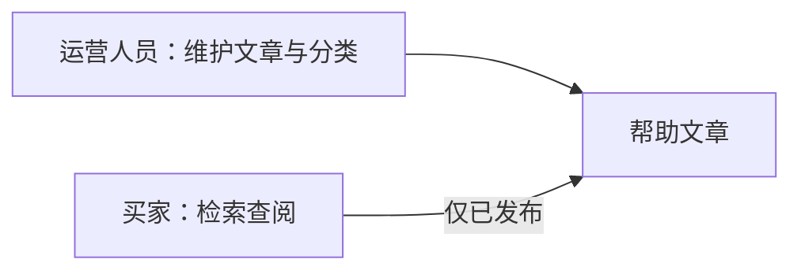

说明：关键组成——分类、标题、正文、发布标记（术语表落库名 `cms_help_article`）。无生命周期状态：以发布标记表达可见性（属性而非状态机，04C-内容 4）；被引用的分类不可删。

### 5.3 商品评价

定位——订单完成后买家对商品的评价记录，追加型只读呈现。

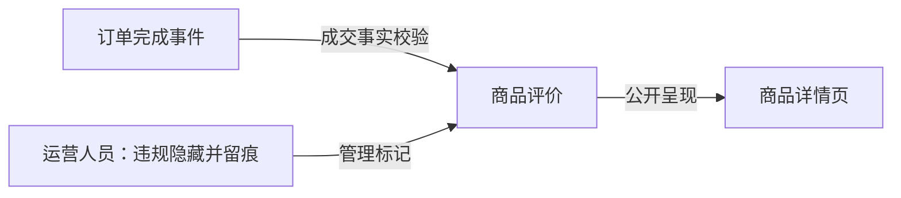

说明：关键组成——关联订单项、评分、评价内容、图片（术语表落库名 `prod_review`）。无生命周期状态：成交后追加的记录，隐藏为管理标记非生命周期（04C-商品 4）；一次成交（订单项）至多一条（防重约束）；评价不修改商品档案（D6 推论）。

### 5.4 顾客账号（沿用 0.2）

定位——买家在商城端的身份与资料载体（沿用 0.2）。

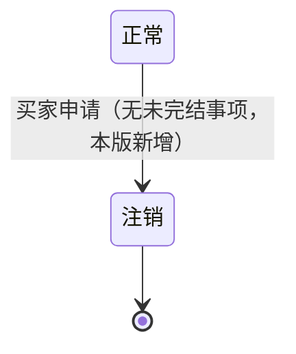

说明：本版只新增正常→注销一段（无未完结订单或退货单方可注销），其余沿用；注销为终态、身份标识不复用、历史交易事实保留只读、动作留痕（04C-顾客 3.6）。冻结路径随 0.6 交付。
