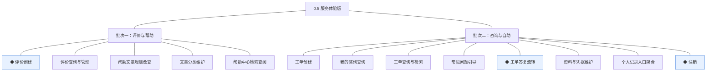
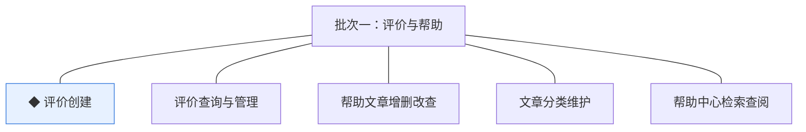
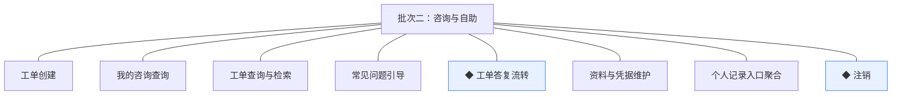

# 开发顺序与需求拆解（大版本）：0.5 服务体验版

> 定位：0.5 服务体验版 PRD→开发批次＋功能级需求条目；本文即该大版本的完整需求清单，需求池据此直接入池、不另生成版本快照；上游为模拟案例材料，模拟性质予以保留。

## 1. 拆解说明

- **做什么**：把 0.5 PRD 的 13 项功能按依赖排成可独立验收的开发批次，每项功能转为一条可直接认领与验收的需求条目（R46 起，用途与验收标准逐字携带 PRD 原文）。
- **粒度口径**：条目与 PRD 4 章功能清单一一同构（一条＝一项功能，无归并无新增）；交互、字段级细化归小版本 PRD。
- **与需求池及小版本规划的关系**：本文是需求池的**主入口但不是唯一入口**——会议、沟通、临时反馈产生的需求可直接单条入池，不经本文；小版本规划的输入＝本文开发顺序＋需求池实时状态两者合并，**批次划分是建议而非锁定**，实际认领以需求池为准。

## 2. 开发顺序

**前置版本沿用面**：0.2 的订单完成事件与成交快照（评价创建依据）、顾客账号与订单查询、退货单状态（注销校验）；0.3 的持券查看（个人记录入口聚合一并呈现）；0.2 的咨询过渡（客服电话／即时通讯人工答疑，自本版由系统内工单替代）。

**顺序依据**：批次一交付"可写、可查、可自助查阅"——评价随订单完成开放并在详情页公开展示、帮助中心上线可检索，两者互不依赖、均只依赖既有版本（评价依赖 0.2 订单完成事件），可独立验收与演示；批次二交付"可问、可管、账号自助收口"——咨询工单受理与答复闭环、个人中心自助齐备（资料凭据、记录入口聚合、注销）。**跨模块只读契约**：常见问题引导按分类只读取帮助中心已发布文章（04C-服务 3.4），依赖批次一帮助中心就绪，归批次二；个人记录入口聚合含「我的咨询」入口，随咨询能力同批。**无同事务契约**：本版无跨模块同事务硬约束（评价创建为订单完成事件后的追加记录、工单流转为服务模块内状态机）；唯一防重约束为一次成交（订单项）至多一条评价，随 R46 实现。无外部联调点。

### 2.1 批次一：评价与帮助

- **目标**：评价开放（一次成交一条、详情页公开展示、运营可管理）＋帮助中心上线（文章与分类维护、买家检索查阅）。
- **依赖**：0.2（订单完成事件、成交快照、订单与订单项查询）；无本版内部前置、无外部联调点。
- **可验收形态**：买家对本人已完成订单的订单项提交评价并在商品详情页公开展示；运营隐藏一条违规评价后商城端不可见；帮助中心按分类与关键词检索到已发布文章——"购物后可写可查、常见问题可自助查阅"可独立演示。

条目与 PRD 4.2～4.3 节功能清单一一同构，用途与验收标准逐字引自原文：

| 编号 | 需求名 | 用途 | 验收标准 |
|---|---|---|---|
| R46 | ◆ 评价创建 | 订单完成后买家对商品评价，一次成交一条 | 买家对本人已完成订单的订单项提交评价（评分与内容）后创建成功并在商品详情页公开展示，同一订单项至多一条评价 |
| R47 | 评价查询与管理 | 评价呈现与运营管理 | 买家可在商品详情页查看该商品的评价列表；运营人员按商品／订单维度查询评价，违规评价可隐藏并留痕，隐藏后商城端不可见 |
| R48 | 帮助文章增删改查 | 运营人员维护帮助中心常见问题内容 | 运营人员可新建、编辑、发布与下线帮助文章，仅已发布文章对买家可见 |
| R49 | 文章分类维护 | 帮助内容的分类组织 | 运营人员可维护帮助分类树，被文章引用的分类不可删除 |
| R50 | 帮助中心检索查阅 | 买家自助查阅购物、支付、售后等常见问题 | 买家按分类或关键词检索并查阅已发布帮助文章 |

### 2.2 批次二：咨询与自助

- **目标**：咨询受理闭环（入口分流→工单→答复→完结→追问重开）＋个人中心自助齐备（资料凭据、记录入口聚合、注销），咨询真空期结束。
- **依赖**：批次一（常见问题引导取帮助中心已发布文章；个人记录入口聚合的评价入口已就绪）；0.2（顾客账号、订单与售后记录入口、退货单状态供注销校验）；0.3（持券查看入口）。无外部联调点。
- **可验收形态**：一条咨询从创建（经高频问题引导）→客服答复→完结→买家追问重开的全程系统内处理；买家在个人中心完成资料修改、经聚合入口查看订单与售后／持券／我的咨询三类记录；一笔无未完结事项的注销成功（令牌失效、历史只读），一笔有未完结订单的注销被阻止——"问题有处问、账号可自助管理"完整演示。

条目与 PRD 4.1、4.4 节功能清单一一同构，用途与验收标准逐字引自原文：

| 编号 | 需求名 | 用途 | 验收标准 |
|---|---|---|---|
| R51 | 工单创建 | 买家就商品或订单问题自助发起咨询 | 买家在商城端提交咨询内容（可选关联订单号）后，系统生成待响应的咨询工单并返回工单号，本人在我的咨询中可见 |
| R52 | 我的咨询查询 | 买家在个人中心查看本人工单与答复进展 | 买家可查看本人全部工单的状态、咨询内容与往来答复，且仅能见本人工单 |
| R53 | 工单查询与检索 | 客服人员在管理端按维度检索工单并进入处理 | 客服人员按状态、顾客、关联单号检索工单并进入处理，答复后对买家可见 |
| R54 | 常见问题引导 | 咨询入口先自助分流，减少人工工单量 | 买家进入咨询入口先见帮助中心高频问题列表，未解决时可从引导页直接创建工单 |
| R55 | ◆ 工单答复流转 | 客服答复与买家追问驱动的状态流转，含完结判定与重开 | 客服答复后工单转处理中且答复对买家可见；完结判定后工单转已完结；已完结工单被买家追问时重开为处理中且不另起新工单 |
| R56 | 资料与凭据维护 | 买家个人中心自助维护身份资料与登录凭据 | 买家可自助修改昵称、头像等资料并重置登录凭据，修改保存后生效，重置后以新凭据登录 |
| R57 | 个人记录入口聚合 | 个人中心统一各业务记录的查询入口 | 买家在个人中心可见订单与售后记录、优惠券持有、我的咨询的查询入口，点击进入对应模块的本人记录查询 |
| R58 | ◆ 注销 | 买家账号生命周期自助收口 | 买家申请注销时系统校验无未完结订单或退货单方可注销；注销后账号转注销终态、令牌失效停止登录，历史交易事实保留只读 |

**批次判断与边界取舍**：①两批划分——"可写可查"（评价与帮助）与"可问可管"（咨询与自助）是两类可独立验收形态，前者不依赖咨询能力可先行演示（判断注记）；②评价与帮助同批——两者互不依赖但均为内容型交付、可合并演示，单拆则批次数增加无独立价值（判断注记）；③常见问题引导归批次二——跨模块只读契约依赖帮助中心文章就绪，且与工单创建构成同一分流入口（判断注记）；④资料与凭据维护、个人记录入口聚合、注销归批次二——个人中心自助面同主题并批演示，其中聚合含「我的咨询」入口须与咨询能力同批（判断注记）；⑤评价先审后显与注销冷静期在暂缓清单（PRD 待业务确认项），本版评价直接公开展示、注销即时生效。

**版本级验收安排**：完成标志＝买家完成一笔订单评价并公开展示；一条咨询从创建到完结全流程系统内处理；买家可自助完成资料修改与注销。无灰度台阶（无首次对外发布与资金方向，沿用 0.2 灰度状态）。

## 3. 条目与 PRD 对应核对

- **一一同构声明**：条目数＝PRD 功能数＝13（R46~R58），逐行对应、无归并无新增；无路径拆分条目（本版功能均为首次交付，评价与帮助文章相关路径无跨版本分批）。
- **批次构成**：批次一 5 条（商品模块 2、内容模块 3）；批次二 8 条（服务模块 5、顾客模块 3）。
- **◆ 清点**：R46、R55、R58 三条（承接 PRD 功能清单同名 ◆ 标注）。
- **过渡支撑清点**：本版无新增过渡支撑；0.2 的「客服电话／即时通讯人工答疑」过渡自本版起由系统内咨询工单替代。

## 4. 与需求池和小版本规划的衔接

- **入池路径**：本文各批次需求表由需求池运营提示词按「批量入池」逐行登记（编号沿用、批次随源继承，状态一律待规划）。
- **多入口口径**：本文是主入口但不是唯一入口——会议、沟通、临时反馈的需求直接单条入池，不经本文，两类条目并存互不覆盖。
- **小版本规划的合并输入**：规划＝本文开发顺序建议＋需求池实时状态；建议按批次一→批次二确认两个小版本（0.5.0 评价帮助版认领 R46~R50、0.5.1 咨询自助版认领 R51~R58），唯一硬约束是本文声明的依赖不回退（常见问题引导与个人记录入口聚合不先于批次一认领）。
- **认领与细化原则**：认领后的小版本 PRD 做开发级细化（交互、字段、边界，含工单完结判定口径、评价字段与评分档位、注销校验明细等版本级默认值落地），验收以随行验收标准为锚，不回溯改写本文。
