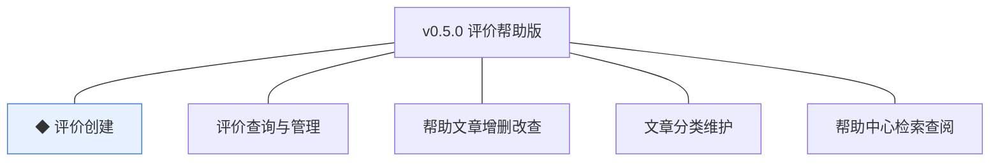
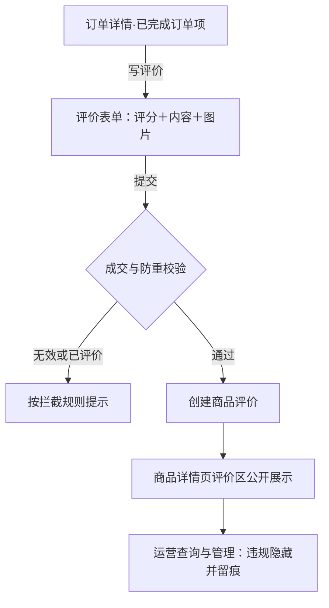
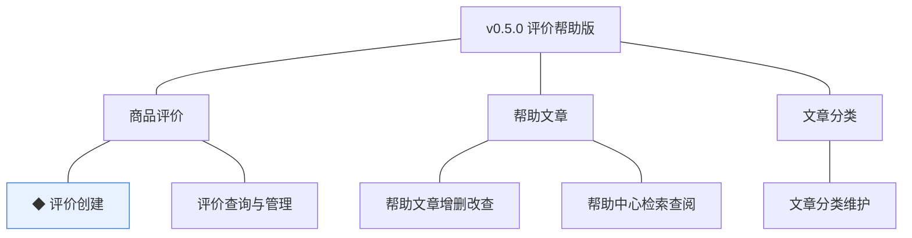
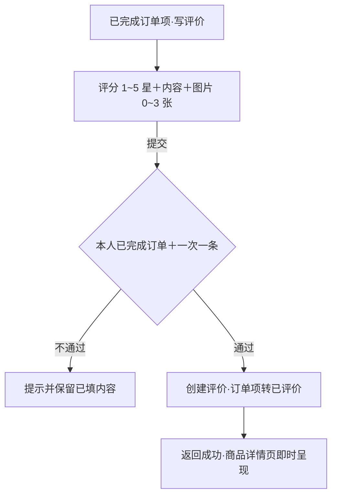
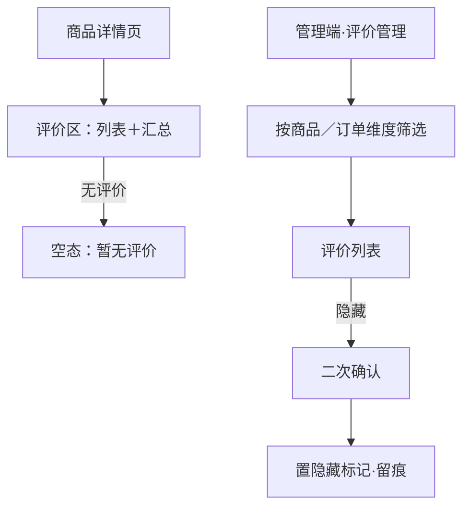
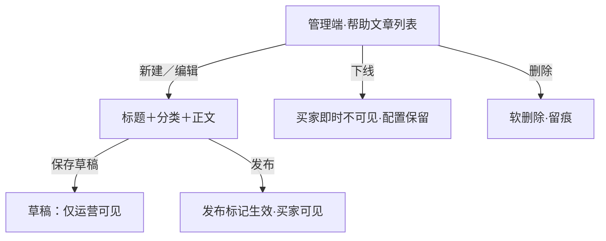
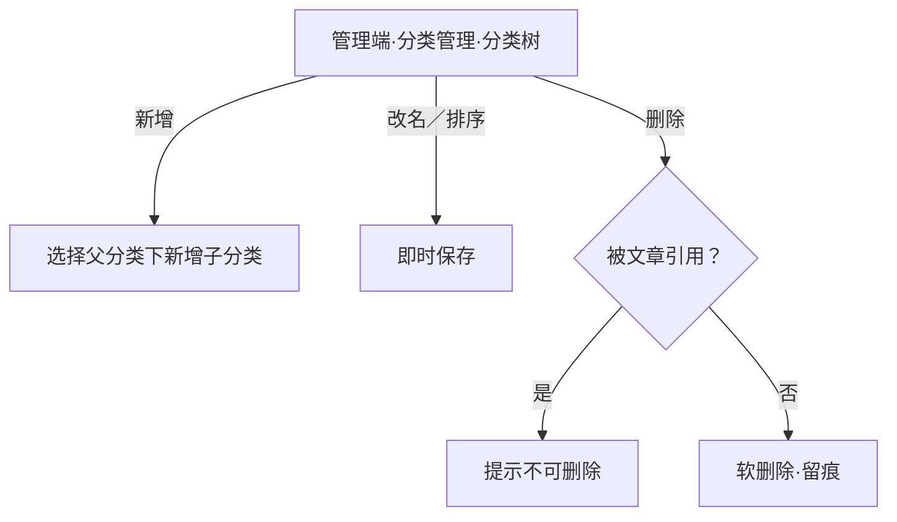
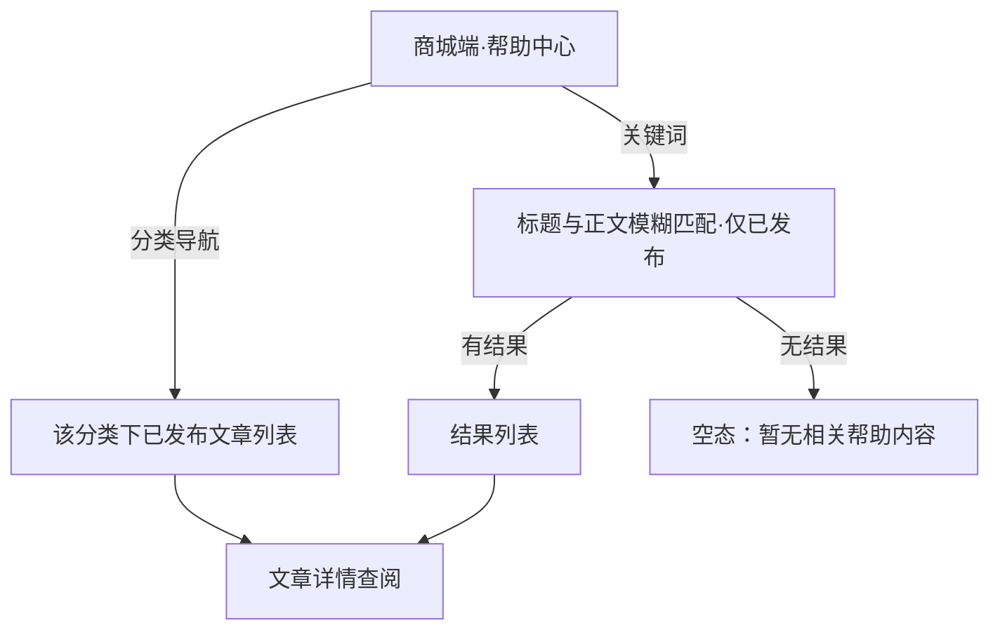

# PRD（小版本）：v0.5.0 评价帮助版

> 定位：v0.5.0 的开发级需求说明书——承接 0.5 服务体验版 PRD 与 02、认领自需求池（R46~R50）；上游为模拟案例材料，模拟性质予以保留。

## 1. 版本概述

**承接与目标**：认领 0.5 批次一「评价与帮助」全部条目（R46 ◆ 评价创建、R47 评价查询与管理、R48 帮助文章增删改查、R49 文章分类维护、R50 帮助中心检索查阅），交付"可写、可查、可自助查阅"——评价随订单完成开放并在商品详情页公开展示、帮助中心上线可检索；本版可验收形态＝买家对已完成订单的订单项提交评价并公开展示、运营隐藏一条违规评价后商城端不可见、帮助中心按分类与关键词检索到已发布文章。

**范围外声明**：咨询工单与常见问题引导、个人中心自助（资料凭据、记录入口聚合、注销）随 0.5.1（R51~R58）；评价先审后显与注销冷静期在暂缓清单（本版评价提交后直接公开展示）；会员等级（0.6）、统计报表（0.7）。

**条目内顺序与依赖**：R49 分类维护先行（R48 文章须挂分类）→R48 文章维护→R50 检索查阅（依赖已发布文章）；R46 评价创建与 R47 评价查询管理依赖 0.2 订单完成事件与成交快照，与帮助中心线并行（引用上游批内依赖声明）。无外部联调点。

## 2. 需求范围与验收锚

| 编号 | 需求名 | 用途 | 验收标准 |
|---|---|---|---|
| R46 | ◆ 评价创建 | 订单完成后买家对商品评价，一次成交一条 | 买家对本人已完成订单的订单项提交评价（评分与内容）后创建成功并在商品详情页公开展示，同一订单项至多一条评价 |
| R47 | 评价查询与管理 | 评价呈现与运营管理 | 买家可在商品详情页查看该商品的评价列表；运营人员按商品／订单维度查询评价，违规评价可隐藏并留痕，隐藏后商城端不可见 |
| R48 | 帮助文章增删改查 | 运营人员维护帮助中心常见问题内容 | 运营人员可新建、编辑、发布与下线帮助文章，仅已发布文章对买家可见 |
| R49 | 文章分类维护 | 帮助内容的分类组织 | 运营人员可维护帮助分类树，被文章引用的分类不可删除 |
| R50 | 帮助中心检索查阅 | 买家自助查阅购物、支付、售后等常见问题 | 买家按分类或关键词检索并查阅已发布帮助文章 |

锚定说明：上表需求名、用途、验收标准逐字引自 0.5 02 批次一需求表（其又逐字锚定 0.5 PRD 4.2～4.3 功能清单）；本文只细化不改写，验收以本表为锚。

## 3. 核心用户旅程

旅程承接说明：承接 0.5 PRD 3.2「评价创建」旅程（本版认领段＝全程：订单完成→成交校验→创建→公开展示→运营管理）；帮助中心检索查阅为单端简单查询（验收标准可覆盖）不成旅程；运营侧文章与分类维护、评价管理为单端管理操作不成旅程（0.5 PRD 覆盖说明）。

### 3.1 评价创建与展示（买家，单端关键流程）

操作步骤清单：

1. 买家在商城端「我的订单」打开已完成订单详情，未评价的订单项显示「写评价」入口。
2. 填写评分（1~5 星）、评价内容（10~500 字）、可选上传图片（0~3 张），提交。
3. 系统校验本人已完成订单与一次成交一条约束，通过后创建评价并返回成功；订单项入口变为「已评价」。
4. 评价即时在商品详情页评价区公开展示（评分、内容、图片、评价时间）。
5. 运营人员在管理端按商品／订单维度查询评价，违规评价执行隐藏（留痕），隐藏后商城端评价区不可见。

## 4. 功能需求

### 4.1 功能总览

**对象增删改查矩阵**：

| 对象 | 增 | 改 | 删 | 查 |
|---|---|---|---|---|
| 商品评价 | R46（买家创建） | R47（隐藏管理标记，留痕；恢复未定义见待议） | 不做（评价不删除，隐藏为管理标记） | R47（买家商品详情评价区＋运营按商品／订单查询） |
| 帮助文章 | R48（新建） | R48（编辑、发布／下线标记切换） | R48（删除，软删除；被检索历史不影响已读） | R48（运营列表）＋R50（买家仅已发布） |
| 文章分类 | R49（新增） | R49（改名、排序） | R49（删除，被文章引用不可删） | R49（分类树）＋R50（买家分类导航） |
| 订单项 | 不做 | 不做 | 不做 | 沿用 0.2（本人已完成订单的订单项为评价入口依据） |
| 商品 | 不做 | 不做 | 不做 | 沿用 0.2（详情页呈现评价区） |

**主体使用面**：

| 主体 | 端 | 使用条目 |
|---|---|---|
| 买家 | 商城端 | R46（写评价）、R47 查看侧（商品详情评价区）、R50（帮助中心检索查阅） |
| 运营人员 | 管理端 | R47 管理侧（查询与隐藏）、R48、R49 |

### 4.2 R46 ◆ 评价创建

**功能说明**：订单完成后买家对商品评价，一次成交一条。触发：买家在本人已完成订单的订单项上点击「写评价」并提交。

**交互与流程**：

操作步骤清单：

1. 入口：仅本人已完成订单的未评价订单项显示「写评价」；已评价项显示「已评价」不可再写。
2. 评价表单：评分（1~5 星，必选）、评价内容（10~500 字，必填）、图片（可选，0~3 张，jpg／png／webp，单张 ≤5MB）。
3. 提交后系统校验：订单属当前会员、状态＝已完成、该订单项无既有评价（唯一约束兜底并发）；通过后创建评价。
4. 成功反馈：提示「评价发布成功」，订单项入口转「已评价」，商品详情页评价区即时呈现该条。

**字段与校验**：

| 信息项 | 必填 | 业务类型 | 落库字段名 | 约束与取值 |
|---|---|---|---|---|
| 关联订单项 | 是（系统写入） | 外键引用 | `order_item_id` | 引用 trade_order_item.id，本人已完成订单 |
| 评分 | 是 | 整数 | `score` | 1~5（星） |
| 评价内容 | 是 | 文本 | `content` | 10~500 字 |
| 评价图片 | 否 | 图片关联 | 经 sys_image_asset（`biz_type`＝`review`＋`biz_id`＝评价 id） | 0~3 张，单张 ≤5MB，jpg／png／webp |
| 隐藏标记 | 是（系统默认） | 布尔 | `is_hidden` | 默认 false（公开展示）；隐藏为管理标记非生命周期 |

**规则与边界**：

1. 一次成交（订单项）至多一条评价：入口、提交、唯一约束三层防重；并发重复提交仅第一条生效。
2. 评价不修改商品档案，仅作展示与统计输入（D6 推论）；订单事实以成交快照为准。
3. 评价提交后直接公开展示（先审后显在暂缓清单，待业务确认）。
4. 评价为追加型记录不做删除；违规经隐藏管理标记处理（R47）。
5. 已评价订单项不可再次编写；订单号与商品快照随评价留档可追溯。

**异常与拦截**：

| # | 场景 | 系统行为（用户可见） |
|---|---|---|
| A1 | 非本人或非已完成订单触达评价路径 | 提示「仅已完成订单可评价」，不进入表单 |
| A2 | 该订单项已有评价（重复提交／并发） | 提示「该商品已评价」，入口转「已评价」 |
| A3 | 内容不足 10 字或超 500 字 | 提交前即时提示「请填写 10~500 字评价内容」，不发起请求 |
| A4 | 未选评分 | 提交前即时提示「请选择 1~5 星评分」 |
| A5 | 图片超 3 张／单张超 5MB／格式不支持 | 选择时即时提示「最多 3 张图片（jpg／png／webp，每张不超过 5MB）」，超限图不入列 |
| A6 | 提交失败（网络／系统异常） | 提示「提交失败，请稍后重试」，已填内容保留 |

### 4.3 R47 评价查询与管理

**功能说明**：评价呈现与运营管理。触发：买家打开商品详情页评价区（查看）；运营人员在管理端「评价管理」查询并执行隐藏（管理）。

**交互与流程**：

操作步骤清单：

1. 买家侧：商品详情页评价区按时间倒序呈现该商品全部未隐藏评价（评分、内容、图片、时间），每页 20 条可翻页（行业惯例默认，推断）；顶部呈现评分分布汇总（各星占比，行业惯例默认，推断）。
2. 买家侧无评价时显示空态「暂无评价，买过后快来评价吧」。
3. 运营侧：管理端「评价管理」按商品（名称／编号）或订单号筛选评价列表。
4. 运营对违规评价点「隐藏」→二次确认（「隐藏后买家不可见，操作留痕」）→评价置隐藏标记并留痕；隐藏后商城端评价区即时不可见。

**字段与校验**：

| 信息项 | 必填 | 业务类型 | 落库字段名 | 约束与取值 |
|---|---|---|---|---|
| 筛选：商品维度 | 否 | 名称／编号模糊或精确 | 沿用商品既有字段 | 买家侧按商品聚合呈现 |
| 筛选：订单维度 | 否 | 订单号精确 | 沿用 `order_no` | 运营侧入口 |
| 隐藏标记 | 是 | 布尔 | `is_hidden` | 隐藏后 true，买家侧查询过滤 |

**规则与边界**：

1. 买家侧仅见未隐藏评价；隐藏为管理标记，评价本体保留（不删除）。
2. 隐藏操作必须留痕（操作者／时间／动作）；重复隐藏幂等（已是隐藏态提示不变更）。
3. 运营查询可见全部评价（含已隐藏，带标记）。
4. 评价管理菜单按角色能力点控制（D4）：仅运营人员可见。

**异常与拦截**：

| # | 场景 | 系统行为（用户可见） |
|---|---|---|
| A1 | 商品暂无评价 | 空态「暂无评价，买过后快来评价吧」 |
| A2 | 非运营角色访问评价管理 | 菜单不可见（能力点控制，D4）；直接访问接口返回无权限 |
| A3 | 筛选无匹配 | 空态「暂无符合条件的评价」 |

### 4.4 R48 帮助文章增删改查

**功能说明**：运营人员维护帮助中心常见问题内容。触发：运营人员在管理端「帮助中心」新建、编辑、发布、下线或删除文章。

**交互与流程**：

操作步骤清单：

1. 运营人员在管理端「帮助中心」查看文章列表（标题、分类、发布状态、更新时间）。
2. 新建／编辑：填写标题（必填 2~50 字）、选择分类（必选，来自分类树）、正文（必填 10~10000 字，纯文本段落）。
3. 保存草稿：仅运营侧可见；发布后买家可见；已发布文章可再编辑（保存后即时生效）或下线。
4. 下线：发布标记关闭，买家侧即时不显现（检索与列表排除），配置保留可再发布。
5. 删除：软删除并留痕；仅未发布或已下线文章可删（已发布须先下线，避免买家侧断链）。

**字段与校验**：

| 信息项 | 必填 | 业务类型 | 落库字段名 | 约束与取值 |
|---|---|---|---|---|
| 标题 | 是 | 文本 | `title`（复用既有名） | 2~50 字 |
| 分类 | 是 | 外键引用 | `category_id`（复用既有名，指向 cms_help_category） | 须为分类树既有分类 |
| 正文 | 是 | 文本 | `content` | 10~10000 字 |
| 发布标记 | 是 | 布尔 | `published` | false＝草稿／已下线；true＝买家可见 |

**规则与边界**：

1. 仅已发布文章对买家可见（检索与查阅均过滤）。
2. 发布、下线、删除均留痕（操作者／时间／动作）。
3. 已发布文章被删除前必须先下线（判断注记：避免买家侧断链）。
4. 文章富文本能力边界留版本级（04C-内容留版本级），本版正文为纯文本段落。

**异常与拦截**：

| # | 场景 | 系统行为（用户可见） |
|---|---|---|
| A1 | 标题或正文长度不符 | 保存前即时提示「标题 2~50 字／正文 10~10000 字」 |
| A2 | 未选分类保存 | 提示「请选择帮助分类」 |
| A3 | 删除已发布文章 | 拦截并提示「请先下线再删除」 |
| A4 | 非运营角色访问帮助中心管理 | 菜单不可见（能力点控制，D4） |

### 4.5 R49 文章分类维护

**功能说明**：帮助内容的分类组织。触发：运营人员在管理端「帮助中心·分类管理」新增、改名、排序或删除分类。

**交互与流程**：

操作步骤清单：

1. 运营人员在分类管理页以树形查看全部帮助分类（名称、排序、下属文章数）。
2. 新增：在选定父分类下新增子分类（名称必填 2~20 字）；排序值即时可调。
3. 改名与排序即时保存。
4. 删除：被文章引用（含草稿）的分类不可删，提示先转移文章；无引用则软删除并留痕。

**字段与校验**：

| 信息项 | 必填 | 业务类型 | 落库字段名 | 约束与取值 |
|---|---|---|---|---|
| 分类名 | 是 | 文本 | `category_name`（复用既有名） | 2~20 字 |
| 父分类 | 否 | 外键引用 | `parent_id`（复用既有名） | 顶级分类为空；支持父子层级 |
| 排序 | 是 | 整数 | `sort_order`（复用既有名） | 越小越靠前 |

**规则与边界**：

1. 被文章引用的分类不可删除（软删除语义，规范）。
2. 分类维护动作留痕；分类树供文章挂载与买家侧导航共用。
3. 层级深度不设硬上限（实现细节）；常用两层以内（行业惯例默认，推断）。

**异常与拦截**：

| # | 场景 | 系统行为（用户可见） |
|---|---|---|
| A1 | 分类名长度不符 | 即时提示「分类名 2~20 字」 |
| A2 | 删除被引用分类 | 提示「该分类下有文章，请先转移后再删除」 |
| A3 | 非运营角色访问分类管理 | 菜单不可见（能力点控制，D4） |

### 4.6 R50 帮助中心检索查阅

**功能说明**：买家自助查阅购物、支付、售后等常见问题。触发：买家在商城端进入「帮助中心」并按分类浏览或关键词检索。

**交互与流程**：

操作步骤清单：

1. 买家进入帮助中心：左侧（顶部）分类导航＋文章列表（仅已发布，按分类与排序呈现）。
2. 输入关键词检索：对标题与正文模糊匹配（仅已发布），结果列表含标题与所属分类。
3. 点击文章进入详情查阅（标题、分类、正文）。
4. 无匹配时显示空态并建议更换关键词。

**字段与校验**：

| 信息项 | 必填 | 业务类型 | 落库字段名 | 约束与取值 |
|---|---|---|---|---|
| 分类导航 | 否 | 分类树只读 | cms_help_category 既有字段 | 仅呈现有已发布文章的分类（行业惯例默认，推断） |
| 关键词 | 否 | 文本 | 对 `title`／`content` 模糊匹配 | 1~30 字；空关键词等于分类浏览 |

**规则与边界**：

1. 买家侧仅能见已发布文章；草稿与已下线一律不出现。
2. 检索不记录个人化数据（无个性化推荐，04C-内容明确不做）。
3. 帮助中心入口在商城端全局可达（底部导航「我的」页与后续咨询入口复用，位置留实现细节）。

**异常与拦截**：

| # | 场景 | 系统行为（用户可见） |
|---|---|---|
| A1 | 关键词无匹配 | 空态「暂无相关帮助内容，换个关键词试试」 |
| A2 | 分类下暂无已发布文章 | 该分类不呈现于导航（空分类不占位） |

## 5. 业务对象与数据字段

**数据主体清单**：

| 业务对象 | 落库名 | 定位与关系 |
|---|---|---|
| 商品评价 | `prod_review`（新表，本版创建） | 订单完成后对商品的评价记录；关联订单项（一次成交一条）；隐藏为管理标记 |
| 帮助文章 | `cms_help_article`（新表，本版创建） | 帮助中心常见问题内容；挂分类、以发布标记表达可见性（一对象与分类共同组织） |
| 文章分类 | `cms_help_category`（新表，本版创建） | 帮助分类树；被文章引用不可删 |
| 订单项／商品 | `trade_order_item`／`prod_product`（沿用 0.2） | 本版只读（成交校验与详情页呈现），不新增字段 |

**商品评价（prod_review）字段表**：

| 字段 | 必填 | 业务类型 | 落库字段名 | 约束与取值 |
|---|---|---|---|---|
| 关联订单项 | 是 | 外键引用 | `order_item_id` | 引用 trade_order_item.id，唯一（一次成交一条） |
| 评分 | 是 | 整数 | `score` | 1~5 |
| 评价内容 | 是 | 文本 | `content` | 10~500 字 |
| 隐藏标记 | 是 | 布尔 | `is_hidden` | 默认 false |

**帮助文章（cms_help_article）字段表**：

| 字段 | 必填 | 业务类型 | 落库字段名 | 约束与取值 |
|---|---|---|---|---|
| 标题 | 是 | 文本 | `title`（复用） | 2~50 字 |
| 分类 | 是 | 外键引用 | `category_id`（复用，指向 cms_help_category） | — |
| 正文 | 是 | 文本 | `content` | 10~10000 字 |
| 发布标记 | 是 | 布尔 | `published` | 默认 false |

**文章分类（cms_help_category）字段表**：

| 字段 | 必填 | 业务类型 | 落库字段名 | 约束与取值 |
|---|---|---|---|---|
| 分类名 | 是 | 文本 | `category_name`（复用） | 2~20 字 |
| 父分类 | 否 | 外键引用 | `parent_id`（复用） | 顶级为空 |
| 排序 | 是 | 整数 | `sort_order`（复用） | 越小越靠前 |

评价图片经 `sys_image_asset`（`biz_type`＝`review`）关联；列类型、主键、索引与建表 DDL 归开发阶段。

## 6. 待议与建议

**本版采用的推断与默认值汇总**：

| 采用值 | 来源状态 |
|---|---|
| 评分 1~5 星；内容 10~500 字；图片 0~3 张、单张 ≤5MB | 行业惯例默认（推断） |
| 评价列表每页 20 条、时间倒序、评分分布汇总 | 行业惯例默认（推断） |
| 标题 2~50 字／正文 10~10000 字／分类名 2~20 字 | 行业惯例默认（推断） |
| 关键词对标题与正文模糊匹配、仅已发布；空关键词等于分类浏览 | 行业惯例默认（推断） |
| 已发布文章删除前须先下线 | 断链防护推导（买家侧不断链） |
| 评价隐藏单向（恢复操作未定义） | 上游仅定义隐藏（04C-商品 3.5）；恢复待业务确认，见下 |

**待确认内容与影响**：隐藏评价的恢复操作与条件待业务确认（当前单向隐藏不影响验收锚）；帮助文章富文本能力边界留版本级（04C-内容）。

**建议回池的新想法**：无。

**术语表待登记行（随本文回报，由主流程合入）**：

- 编码契约新增「v0.5.0 评价与帮助域落库表与字段」：新表 `prod_review`（`order_item_id`、`score`、`content`、`is_hidden`）、`cms_help_article`（`content`、`published`；`title`、`category_id` 复用）、`cms_help_category`（无新名，`category_name`／`parent_id`／`sort_order` 复用）；图片关联业务类型（biz_type 取值）行扩展 `review`（评价图片）〔v0.5.0〕。新名共 5 个（`order_item_id`、`score`、`content`、`published`、`is_hidden`，`content` 为跨表复用计一次）。
