# PRD（小版本）：v0.5.1 咨询自助版

> 定位：v0.5.1 的开发级需求说明书——承接 0.5 服务体验版 PRD 与 02、认领自需求池（R51~R58）；上游为模拟案例材料，模拟性质予以保留。

## 1. 版本概述

**承接与目标**：认领 0.5 批次二「咨询与自助」全部条目（R51 工单创建、R52 我的咨询查询、R53 工单查询与检索、R54 常见问题引导、R55 ◆ 工单答复流转、R56 资料与凭据维护、R57 个人记录入口聚合、R58 ◆ 注销），交付"可问、可管、账号自助收口"——咨询受理闭环（入口分流→工单→答复→完结→追问重开）与个人中心自助齐备；本版可验收形态＝一条咨询从创建（经高频问题引导）→客服答复→完结→买家追问重开的全程系统内处理＋买家自助完成资料修改与注销，咨询真空期结束。本版发布后 0.5 大版本完成标志达成。

**范围外声明**：评价与帮助中心已随 v0.5.0 交付；评价先审后显与注销冷静期在暂缓清单（本版注销即生效）；即时聊天式会话与机器人自动答复不做（04C-服务明确不做）；会员等级（0.6）、统计报表（0.7）。

**条目内顺序与依赖**：R53/R55 客服答复线与 R51/R52/R54 买家受理线可并行起步、闭环联合验收；R54 依赖 v0.5.0 帮助中心已发布文章（批次一已发布，硬约束自然满足）；R57 聚合含「我的咨询」入口须与 R52 同批；R58 注销校验依赖 0.2 订单与 0.4 退货单状态。无外部联调点（短信服务沿用 0.1 启动、0.2 收口的能力）。

## 2. 需求范围与验收锚

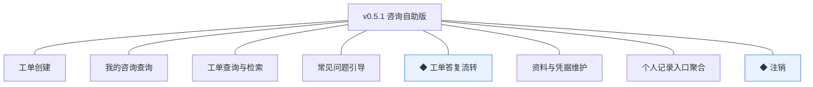

| 编号 | 需求名 | 用途 | 验收标准 |
|---|---|---|---|
| R51 | 工单创建 | 买家就商品或订单问题自助发起咨询 | 买家在商城端提交咨询内容（可选关联订单号）后，系统生成待响应的咨询工单并返回工单号，本人在我的咨询中可见 |
| R52 | 我的咨询查询 | 买家在个人中心查看本人工单与答复进展 | 买家可查看本人全部工单的状态、咨询内容与往来答复，且仅能见本人工单 |
| R53 | 工单查询与检索 | 客服人员在管理端按维度检索工单并进入处理 | 客服人员按状态、顾客、关联单号检索工单并进入处理，答复后对买家可见 |
| R54 | 常见问题引导 | 咨询入口先自助分流，减少人工工单量 | 买家进入咨询入口先见帮助中心高频问题列表，未解决时可从引导页直接创建工单 |
| R55 | ◆ 工单答复流转 | 客服答复与买家追问驱动的状态流转，含完结判定与重开 | 客服答复后工单转处理中且答复对买家可见；完结判定后工单转已完结；已完结工单被买家追问时重开为处理中且不另起新工单 |
| R56 | 资料与凭据维护 | 买家个人中心自助维护身份资料与登录凭据 | 买家可自助修改昵称、头像等资料并重置登录凭据，修改保存后生效，重置后以新凭据登录 |
| R57 | 个人记录入口聚合 | 个人中心统一各业务记录的查询入口 | 买家在个人中心可见订单与售后记录、优惠券持有、我的咨询的查询入口，点击进入对应模块的本人记录查询 |
| R58 | ◆ 注销 | 买家账号生命周期自助收口 | 买家申请注销时系统校验无未完结订单或退货单方可注销；注销后账号转注销终态、令牌失效停止登录，历史交易事实保留只读 |

锚定说明：上表需求名、用途、验收标准逐字引自 0.5 02 批次二需求表（其又逐字锚定 0.5 PRD 4.1、4.4 功能清单）；本文只细化不改写，验收以本表为锚。

## 3. 核心用户旅程

旅程承接说明：承接 0.5 PRD 3.1「咨询闭环」旅程（本版认领段＝全程）与 3.3「注销」旅程（全程）；评价旅程已随 v0.5.0 交付；资料维护、检索、聚合入口为验收标准可覆盖的简单操作不成旅程（0.5 PRD 覆盖说明）。

### 3.1 咨询闭环（买家×客服人员，跨端跨主体）

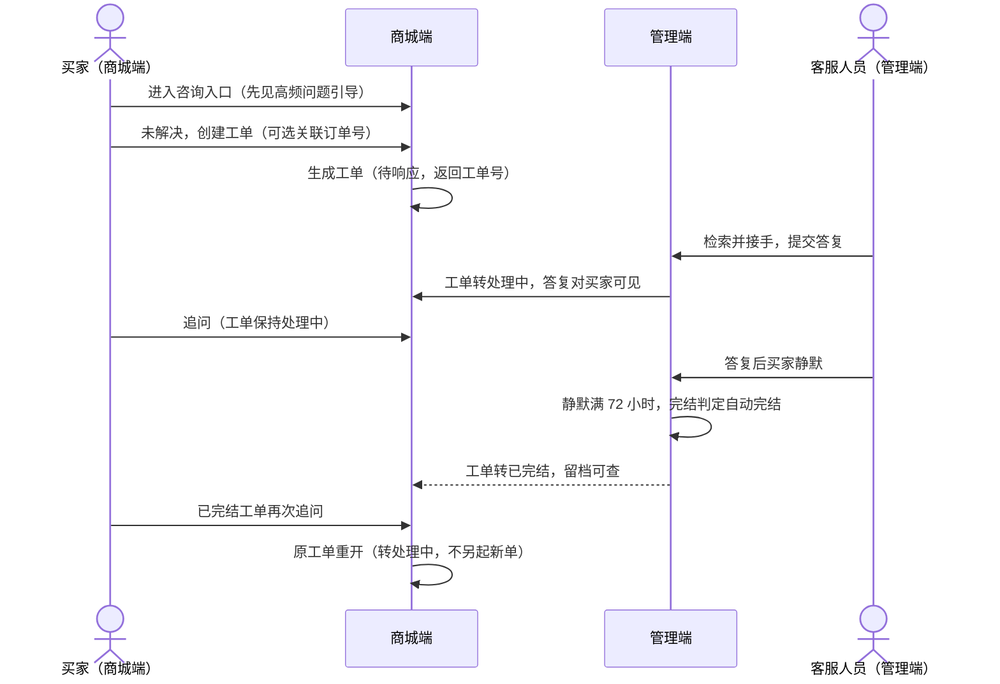

操作步骤清单：

1. 买家进入商城端咨询入口，先见帮助中心高频问题列表（R54 引导）；解决则不开工单。
2. 未解决时创建工单：填写咨询内容、可选关联订单号，提交生成工单号（`TIC` 前缀），状态＝待响应。
3. 客服人员在管理端按状态／顾客／关联单号检索（R53），打开工单提交答复；工单转处理中，答复对买家可见（R55）。
4. 买家可在工单详情追问，工单保持处理中往复。
5. 客服答复后买家静默满 72 小时，系统完结判定自动完结（任务可重入幂等），工单转已完结并留档。
6. 已完结工单被买家再次追问时重开为处理中，不另起新工单。

### 3.2 注销（买家，单端关键流程）

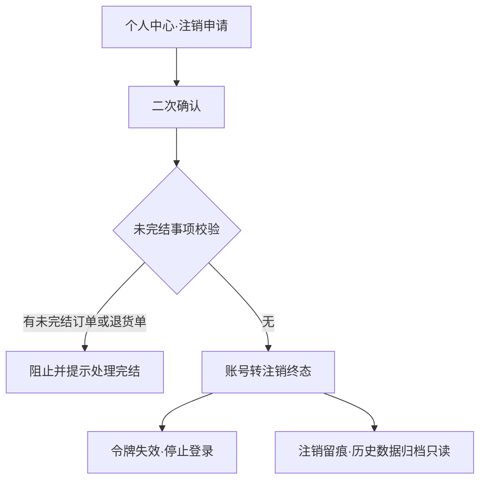

操作步骤清单：

1. 买家在个人中心「账号与安全」发起注销申请，阅读提示并二次确认。
2. 系统校验未完结事项（状态为待支付／待发货／已发货的订单，或待审核／待退货的退货单）；有则阻止并提示先处理完结。
3. 校验通过后账号转注销终态（`CANCELLED`）：令牌失效停止登录、身份标识不复用、历史交易事实保留只读、动作留痕。

## 4. 功能需求

### 4.1 功能总览

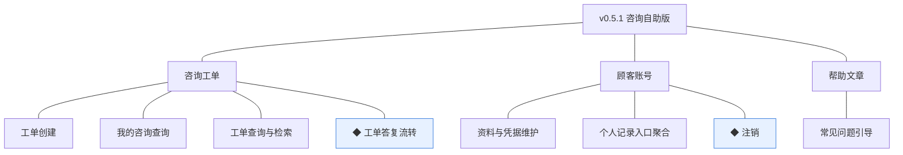

**对象增删改查矩阵**：

| 对象 | 增 | 改 | 删 | 查 |
|---|---|---|---|---|
| 咨询工单 | R51（买家创建） | R55（状态流转：待响应→处理中→已完结→重开；完结时间写入） | 不做（完结后留档不删，规范） | R52（本人）＋R53（客服检索） |
| 咨询答复明细（工单展开表） | R51（咨询内容首条）＋R55（客服答复／买家追问追加） | 不做（答复只追加不改） | 不做 | 随工单详情呈现（R52／R53） |
| 顾客账号 | 不做（注册沿用 0.2） | R56（昵称、头像、换绑手机号）＋R58（注销终态） | 不做（注销为终态留档非删除） | 沿用（本人信息与服务模块只读校验） |
| 帮助文章 | 沿用 v0.5.0 | 沿用 v0.5.0 | 沿用 v0.5.0 | R54（高频问题只读取已发布文章，跨模块只读契约） |
| 订单／退货单 | 沿用 | 沿用 | 沿用 | R58（未完结事项校验只读）＋R57（记录入口跳转查询） |

**主体使用面**：

| 主体 | 端 | 使用条目 |
|---|---|---|
| 买家 | 商城端 | R51、R52、R54、R56、R57、R58；R55 的追问侧与结果可见面 |
| 客服人员 | 管理端 | R53、R55（检索、答复、流转结果） |
| 系统 | — | R55 的完结判定定时任务（自动完结机制，无人工触发面） |

### 4.2 R51 工单创建

**功能说明**：买家就商品或订单问题自助发起咨询。触发：买家在咨询入口（经 R54 引导页或个人中心「我的咨询」）点击「创建工单」并提交。

**交互与流程**：

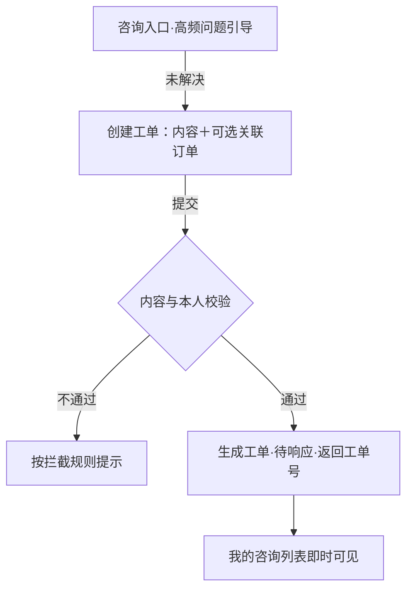

操作步骤清单：

1. 入口：咨询入口引导页「没有解决？创建工单」按钮，或个人中心「我的咨询」页新建入口。
2. 填写咨询内容（10~500 字），可选关联本人订单号（从本人最近订单选择）。
3. 提交后系统生成工单号（`TIC`＋日期＋6 位当日序列），状态＝待响应，返回成功并展示工单号。
4. 「我的咨询」列表即时出现该工单。

**字段与校验**：

| 信息项 | 必填 | 业务类型 | 落库字段名 | 约束与取值 |
|---|---|---|---|---|
| 工单号 | 是（系统生成） | 编码字符串 | `ticket_no` | `TIC`＋日期＋6 位当日序列（术语表编码契约） |
| 发起顾客 | 是（系统写入） | 外键引用 | `customer_id` | 当前会员 |
| 咨询内容 | 是 | 文本 | `content`（首条答复明细） | 10~500 字 |
| 关联订单号 | 否 | 业务单号 | `order_no` | 本人既有订单；跨单据业务单号关联（只读上下文） |
| 状态 | 是（系统维护） | 状态枚举 | `status` | 待响应 `PENDING`（创建即入） |

**规则与边界**：

1. 工单创建不做频控（上限留待议）；同一问题重复提交生成多张工单由客服合并处理（人工口径，不入本版机制）。
2. 关联订单仅作上下文呈现，不触发订单任何变更（只读契约）。
3. 工单与答复均留痕；完结后留档不删（规范）。

**异常与拦截**：

| # | 场景 | 系统行为（用户可见） |
|---|---|---|
| A1 | 内容不足 10 字或超 500 字 | 提交前即时提示「请填写 10~500 字咨询内容」 |
| A2 | 关联非本人订单 | 提示「仅可关联本人订单」，不发起请求 |
| A3 | 提交失败（网络／系统异常） | 提示「提交失败，请稍后重试」，已填内容保留 |

### 4.3 R52 我的咨询查询

**功能说明**：买家在个人中心查看本人工单与答复进展。触发：买家在个人中心点「我的咨询」。

**交互与流程**：

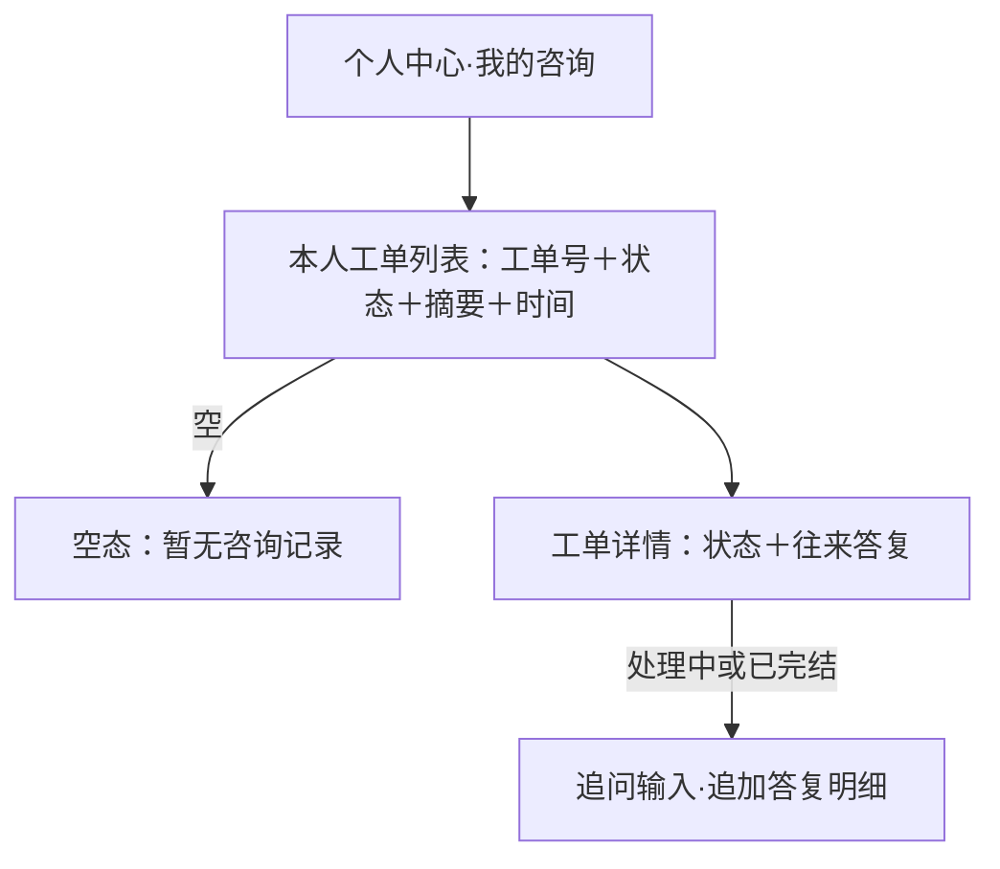

操作步骤清单：

1. 个人中心「我的咨询」呈现本人工单列表（工单号、状态中文、内容摘要、最近更新时间，倒序）。
2. 点击进入详情：状态、咨询内容与往来答复（谁、时间、内容）。
3. 处理中或已完结的工单可追问（已完结追问即重开，见 R55）；待响应工单不可追问（尚无答复，等待接手）。

**字段与校验**：查询只读，无新增信息项；列表过滤条件＝`customer_id`＝当前会员（仅见本人，验收锚）。

**规则与边界**：

1. 仅本人工单可见可查（越权访问他人工单返回不可见）。
2. 状态中文严格按术语表：待响应／处理中／已完结。

**异常与拦截**：

| # | 场景 | 系统行为（用户可见） |
|---|---|---|
| A1 | 无工单 | 空态「暂无咨询记录，遇到问题点上方入口发起咨询」 |
| A2 | 直接访问他人工单详情 | 返回不可见（无权限提示） |

### 4.4 R53 工单查询与检索

**功能说明**：客服人员在管理端按维度检索工单并进入处理。触发：客服人员在管理端「咨询处理」设定检索条件。

**交互与流程**：

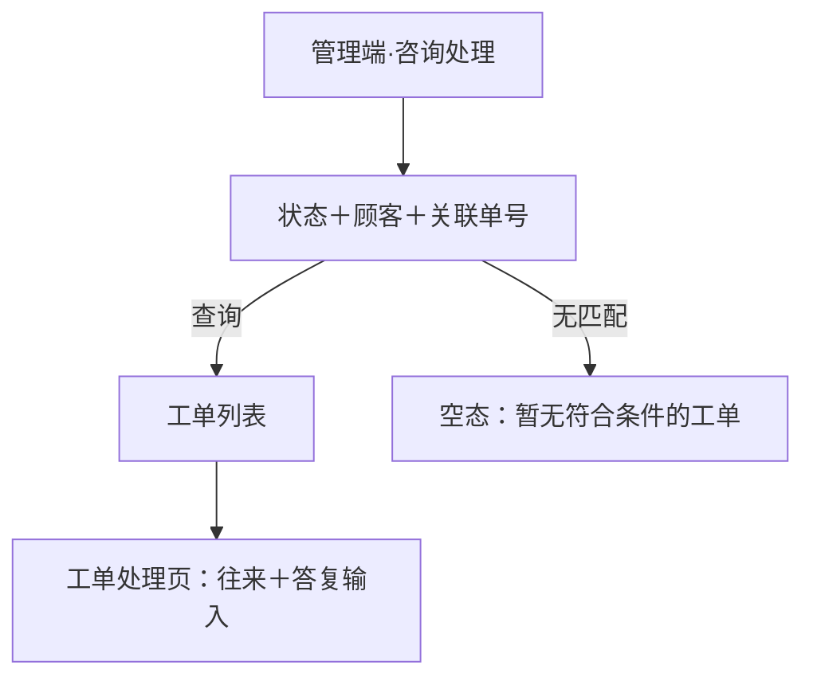

操作步骤清单：

1. 客服人员在「咨询处理」按状态（待响应／处理中／已完结）、顾客（手机号／昵称）、关联单号（订单号或工单号）检索。
2. 列表按最近更新时间倒序；点击进入工单处理页（顾客信息、关联订单上下文、往来答复）。
3. 在处理页提交答复（进入 R55 流转）；检索与答复动作留痕。

**字段与校验**：检索条件＝状态枚举、顾客标识模糊、单号精确；每页 20 条（行业惯例默认，推断）。

**规则与边界**：

1. 咨询处理菜单按角色能力点控制（D4）：仅客服人员可见。
2. 客服可见全部工单（不限本人发起）；答复内容买家可见（不得包含内部备注——内部协同不入本版）。

**异常与拦截**：

| # | 场景 | 系统行为（用户可见） |
|---|---|---|
| A1 | 检索无匹配 | 空态「暂无符合条件的工单」 |
| A2 | 非客服角色访问咨询处理 | 菜单不可见（能力点控制，D4）；直接访问接口返回无权限 |

### 4.5 R54 常见问题引导

**功能说明**：咨询入口先自助分流，减少人工工单量。触发：买家进入商城端咨询入口。

**交互与流程**：

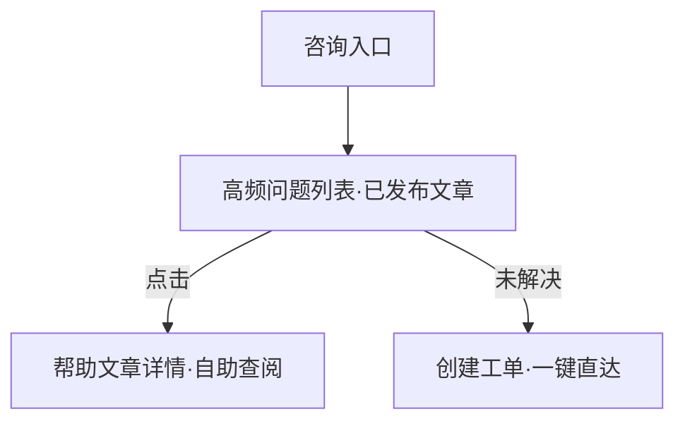

操作步骤清单：

1. 买家进入咨询入口，先见帮助中心高频问题列表（标题＋所属分类，点击进入文章详情）。
2. 未解决时点「没有解决？创建工单」直达创建页（R51）。
3. 引导页底部保留帮助中心全量入口（「查看全部帮助」）。

**字段与校验**：高频问题取数＝帮助中心已发布文章按分类＋排序取前 5 篇（行业惯例默认，推断；跨模块只读契约，不复制内容）。

**规则与边界**：

1. 引导只读取已发布文章（草稿与已下线不出现）。
2. 分流效果观测口径沿用 0.5 立项量化口径（帮助中心查阅量／新建工单量首月 3:1）。

**异常与拦截**：

| # | 场景 | 系统行为（用户可见） |
|---|---|---|
| A1 | 帮助中心暂无已发布文章 | 引导页显示「暂无常见问题」＋创建工单入口前置 |

### 4.6 R55 ◆ 工单答复流转

**功能说明**：客服答复与买家追问驱动的状态流转，含完结判定与重开。触发：客服人员在工单处理页提交答复；买家在工单详情追问；系统定时任务执行完结判定。

**交互与流程**：

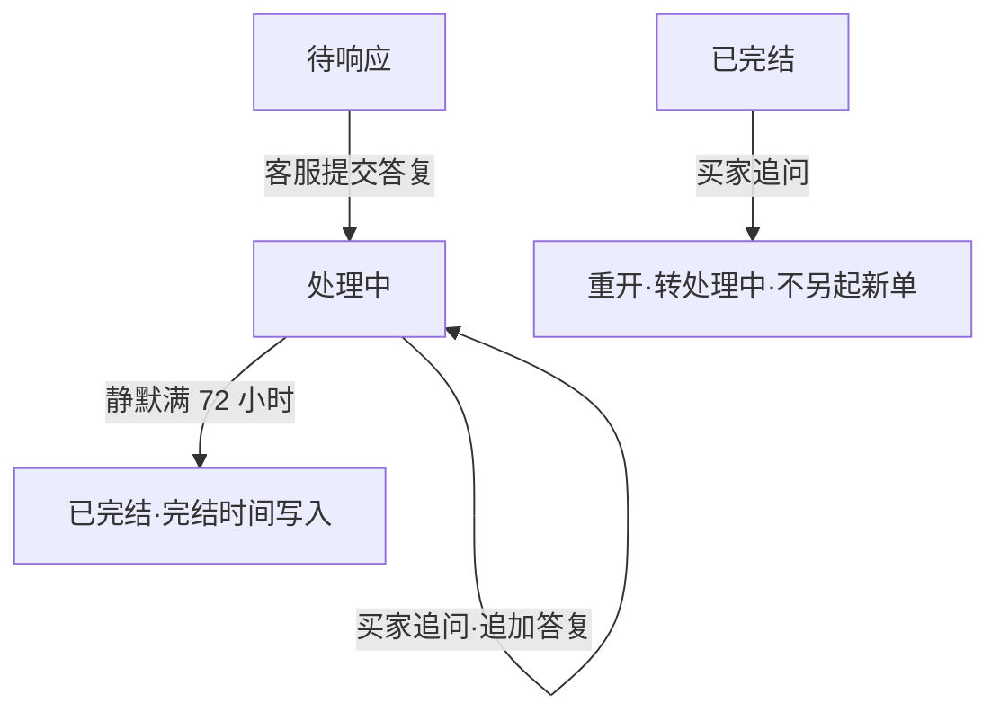

操作步骤清单：

1. 客服对待响应工单提交答复（10~1000 字）：工单转处理中，答复追加明细并即时对买家可见。
2. 买家追问（10~500 字）：工单保持处理中，追问追加明细并进入客服待答复视角。
3. 完结判定：客服答复后买家静默满 72 小时，定时任务将工单转已完结（写入完结时间），任务可重入幂等（行业惯例默认，推断；口径承接 04C-服务留版本级项落地）。
4. 重开：买家对已完结工单追问，原工单转处理中（不另起新单，同一事实一个载体）。
5. 全部答复、追问与状态变更留痕。

**字段与校验**：

| 信息项 | 必填 | 业务类型 | 落库字段名 | 约束与取值 |
|---|---|---|---|---|
| 答复内容（客服） | 是 | 文本 | `content`（答复明细行） | 10~1000 字 |
| 追问内容（买家） | 是 | 文本 | `content`（答复明细行） | 10~500 字 |
| 答复方类型 | 是（系统写入） | 枚举 | `replier_type` | 买家 `BUYER`／客服 `CUSTOMER_SERVICE` |
| 工单状态 | 是（系统维护） | 状态枚举 | `status` | 待响应 `PENDING`／处理中 `PROCESSING`／已完结 `CLOSED` |
| 完结时间 | 完结时写入 | 时间点 | `closed_at` | 自动完结事务提交时间 |

**规则与边界**：

1. 状态流转以条件更新保护并发（答复与追问同时到达不丢明细）。
2. 完结判定只看「最后一条明细为客服答复且静默满 72 小时」；买家追问即时刷新静默计时。
3. 已完结为条件终态（追问重开，回处理中——术语表括注口径）；重开不产生新工单号。
4. 完结判定的自动完结任务为机制部分，无人工触发面（UI 覆盖声明见 02-UI）。

**异常与拦截**：

| # | 场景 | 系统行为（用户可见） |
|---|---|---|
| A1 | 答复／追问字数不符 | 提交前即时提示「请填写 10~1000 字答复」／「请填写 10~500 字咨询内容」 |
| A2 | 买家对待响应工单追问 | 提示「客服尚未接手，请等待答复后再追问」 |
| A3 | 任务完结与买家追问并发 | 以工单当前状态为准：已转已完结的追问走重开，未转的保持处理中；不丢明细 |

### 4.7 R56 资料与凭据维护

**功能说明**：买家个人中心自助维护身份资料与登录凭据。触发：买家在个人中心「个人资料」编辑保存，或在「账号与安全」发起换绑手机号。

**交互与流程**：

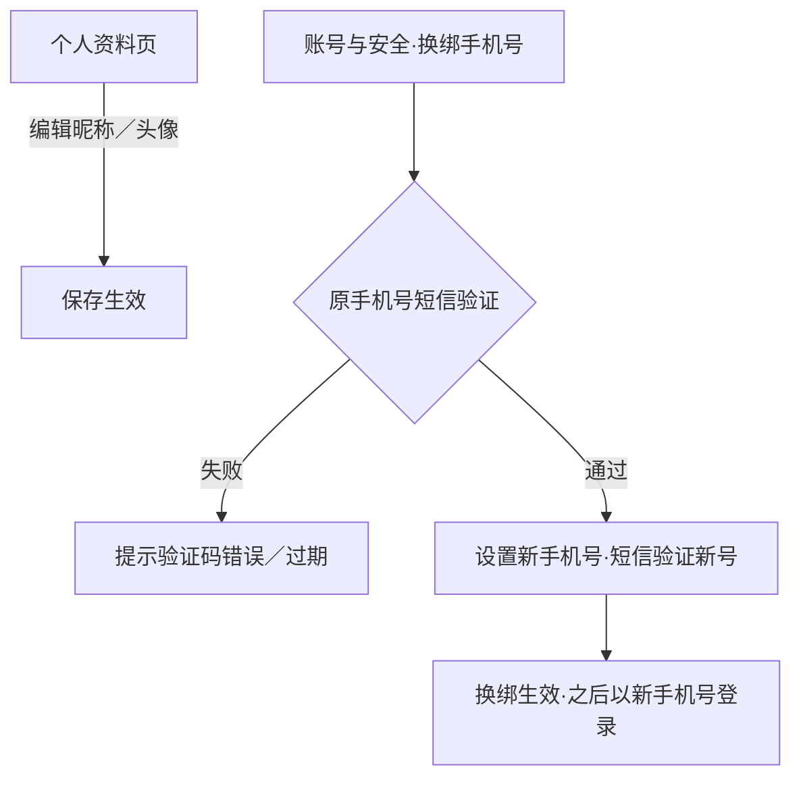

操作步骤清单：

1. 个人资料：编辑昵称（2~20 字）与头像（jpg／png／webp，≤5MB，经图片资源关联），保存即生效。
2. 换绑手机号：校验原手机号短信验证码→输入新手机号并校验其短信验证码→换绑生效；此后以新手机号（新凭据）登录（登录方式沿用 0.2 手机号验证码）。
3. 修改与换绑动作留痕。

**字段与校验**：

| 信息项 | 必填 | 业务类型 | 落库字段名 | 约束与取值 |
|---|---|---|---|---|
| 昵称 | 是 | 文本 | `nickname`（复用） | 2~20 字 |
| 头像 | 否 | 图片关联 | `avatar`（经 sys_image_asset `biz_type`＝`customer` 关联） | jpg／png／webp，≤5MB |
| 手机号（换绑） | 是 | 手机号 | `mobile`（复用，唯一约束） | 新号不得与既有账号重复 |

**规则与边界**：

1. 换绑后旧手机号即时不可登录；新手机号唯一（与既有账号冲突则换绑失败）。
2. 验证码沿用注册短信服务能力（0.1 启动、0.2 收口），频控留实现细节。
3. 资料修改不影响交易事实（订单快照不回写，D6）。

**异常与拦截**：

| # | 场景 | 系统行为（用户可见） |
|---|---|---|
| A1 | 昵称长度不符 | 即时提示「昵称 2~20 字」 |
| A2 | 验证码错误或过期 | 提示「验证码错误或已过期，请重新获取」 |
| A3 | 新手机号已被占用 | 提示「该手机号已绑定其他账号」 |
| A4 | 头像超限／格式不支持 | 即时提示「请上传 jpg／png／webp 图片，不超过 5MB」 |

### 4.8 R57 个人记录入口聚合

**功能说明**：个人中心统一各业务记录的查询入口。触发：买家进入个人中心。

**交互与流程**：

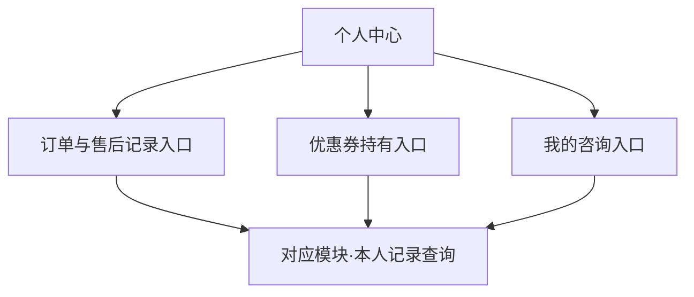

操作步骤清单：

1. 个人中心呈现三类记录入口：订单与售后记录、优惠券持有、我的咨询（含未读答复红点提示，行业惯例默认，推断）。
2. 点击入口进入对应模块的本人记录查询（订单列表沿用 0.2、持券查看沿用 0.3、我的咨询本版 R52）。
3. 个人中心同时保留既有自助面：个人资料（R56）、收货地址簿（0.2）、账号与安全（R56／R58）。

**字段与校验**：无新增信息项——本模块只聚合不持有（各记录归交易／营销／服务模块，04C-顾客 3.3）。

**规则与边界**：

1. 入口点击进入的是各模块既有查询页（不做二次封装页）。
2. 聚合不改变各记录的权限与口径（仅本人）。

**异常与拦截**：无独立异常面——各入口目标页的空态与异常沿用对应模块（订单空态 0.2、持券空态 0.3、咨询空态 R52）。

### 4.9 R58 ◆ 注销

**功能说明**：买家账号生命周期自助收口。触发：买家在个人中心「账号与安全」发起注销申请。

**交互与流程**：

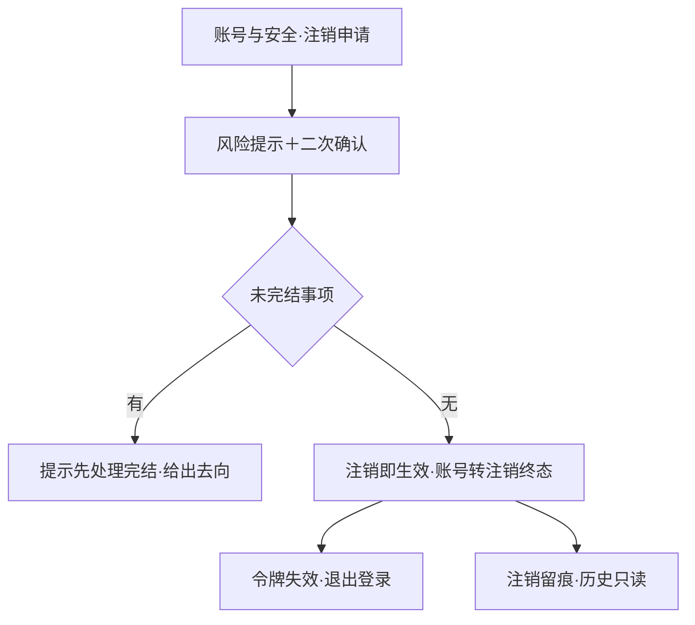

操作步骤清单：

1. 买家在「账号与安全」点「注销账号」，阅读风险提示（历史订单只读、身份不复用）并二次确认。
2. 系统校验未完结事项：状态为待支付／待发货／已发货的订单，或待审核／待退货的退货单。
3. 有未完结事项：阻止并提示「请先处理完结进行中的订单与售后」，并列出去向入口（订单列表／售后进度）。
4. 无未完结事项：注销即生效（冷静期在暂缓清单）——账号转注销终态、令牌失效退出登录、身份标识不复用、历史交易事实保留只读、动作留痕。

**字段与校验**：

| 信息项 | 必填 | 业务类型 | 落库字段名 | 约束与取值 |
|---|---|---|---|---|
| 账号状态 | 是（系统维护） | 状态枚举 | `status` | 正常 `NORMAL`→注销 ★ `CANCELLED`（终态） |
| 注销时点 | 注销时写入 | 时间点 | `cancelled_at`（复用） | 注销事务提交时间 |

**规则与边界**：

1. 校验范围＝未完结订单（待支付／待发货／已发货）与未到终态退货单（待审核／待退货）；已完结工单与进行中工单均不阻止（04C-顾客 3.6 口径——仅订单与退货单；扩展校验范围待业务确认，见待议）。
2. 注销为终态、不可恢复；身份标识（手机号）可被新账号注册使用（身份不复用＝原账号数据不迁移，D3 推论）。
3. 注销动作留痕；历史数据归档只读（规范：单据不删）。

**异常与拦截**：

| # | 场景 | 系统行为（用户可见） |
|---|---|---|
| A1 | 存在未完结订单或退货单 | 阻止并提示「请先处理完结进行中的订单与售后」，附去向入口 |
| A2 | 二次确认取消 | 关闭确认，账号不变更 |
| A3 | 注销请求失败 | 提示「操作失败，请稍后重试」，账号保持正常 |

## 5. 业务对象与数据字段

**数据主体清单**：

| 业务对象 | 落库名 | 定位与关系 |
|---|---|---|
| 咨询工单 | `svc_consult_ticket`（新表）＋`svc_consult_reply`（新表，答复明细——一对象展开两表） | 买家咨询记录与客服协作载体；往来答复为明细行（谁／时间／内容）追加不改 |
| 顾客账号 | `cust_account`（沿用 0.2，本版新增 `avatar` 字段） | 本版资料维护（昵称／头像／换绑手机号）与注销终态 |
| 帮助文章 | `cms_help_article`（沿用 v0.5.0） | R54 高频问题只读取已发布文章（跨模块只读契约） |
| 订单／退货单 | `trade_order`／`trade_return`（沿用） | R58 未完结事项校验只读；R57 记录入口跳转查询 |

**咨询工单（svc_consult_ticket）字段表**：

| 字段 | 必填 | 业务类型 | 落库字段名 | 约束与取值 |
|---|---|---|---|---|
| 工单号 | 是 | 编码字符串 | `ticket_no` | `TIC`＋日期＋6 位当日序列，唯一 |
| 发起顾客 | 是 | 外键引用 | `customer_id`（复用） | — |
| 关联订单号 | 否 | 业务单号 | `order_no`（复用） | 本人既有订单 |
| 状态 | 是 | 状态枚举 | `status`（复用） | 待响应 `PENDING`／处理中 `PROCESSING`／已完结 `CLOSED` |
| 完结时间 | 完结时写入 | 时间点 | `closed_at` | 未完结为空 |

**咨询答复明细（svc_consult_reply）字段表**：

| 字段 | 必填 | 业务类型 | 落库字段名 | 约束与取值 |
|---|---|---|---|---|
| 所属工单 | 是 | 外键引用 | `ticket_id` | 引用 svc_consult_ticket.id |
| 答复方类型 | 是 | 枚举 | `replier_type` | 买家 `BUYER`／客服 `CUSTOMER_SERVICE` |
| 内容 | 是 | 文本 | `content`（复用） | 买家 10~500 字；客服 10~1000 字 |

**顾客账号（cust_account）本版新增字段**：`avatar`（头像图片，经 `sys_image_asset` `biz_type`＝`customer` 关联）。

列类型、主键、索引与建表 DDL 归开发阶段。

## 6. 待议与建议

**本版采用的推断与默认值汇总**：

| 采用值 | 来源状态 |
|---|---|
| 完结判定＝客服答复后静默 72 小时自动完结（定时任务可重入幂等） | 04C-服务留版本级项落地；72 小时为行业惯例默认（推断） |
| 高频问题取已发布文章按分类＋排序前 5 篇 | 行业惯例默认（推断） |
| 咨询内容 10~500 字、客服答复 10~1000 字、昵称 2~20 字 | 行业惯例默认（推断） |
| 凭据重置＝换绑手机号（双端短信验证） | 从登录方式推导（0.2 定案手机号验证码登录，无独立密码凭据） |
| 注销即生效、校验范围限订单与退货单 | 04C-顾客 3.6 口径＋冷静期在暂缓清单 |
| 工单列表每页 20 条倒序；聚合入口未读红点 | 行业惯例默认（推断） |

**待确认内容与影响**：注销校验是否扩展到未完结工单（当前按 04C 口径仅订单与退货单）；工单创建频控上限；均待业务确认，不影响本版验收锚。

**建议回池的新想法**：无。

**术语表待登记行（随本文回报，由主流程合入）**：

- 第 3 节对象行：无新增对象（咨询答复明细为咨询工单一对象展开两表的映射，在数据主体清单标注）。
- 编码契约新增「v0.5.1 咨询与顾客域落库表与字段」：新表 `svc_consult_ticket`（`closed_at` 新名；`ticket_no`／`customer_id`／`order_no`／`status` 复用或既有契约名）、`svc_consult_reply`（`ticket_id`、`replier_type`〔买家 `BUYER`／客服 `CUSTOMER_SERVICE`〕新名；`content` 复用）；cust_account 新增 `avatar`；图片关联业务类型（biz_type 取值）行扩展 `customer`（会员头像）〔v0.5.1〕。新名共 4 个。
