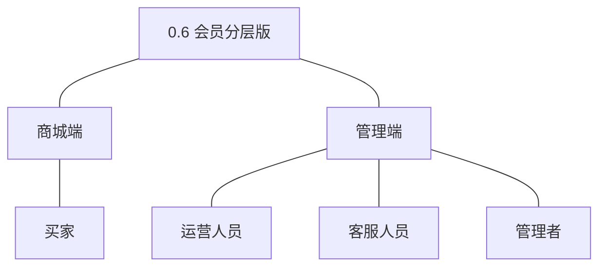
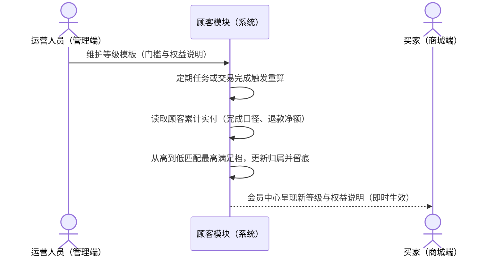
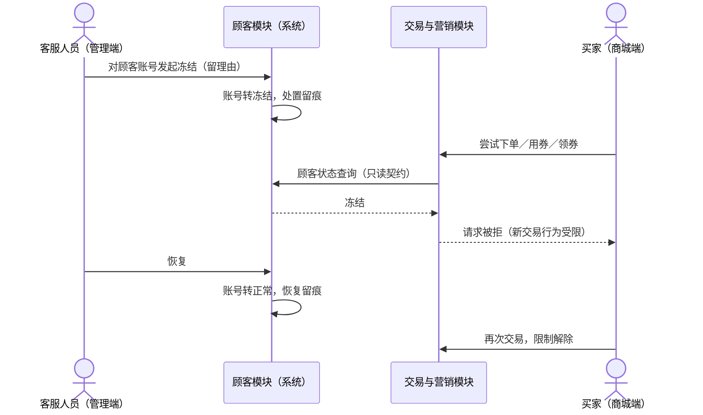
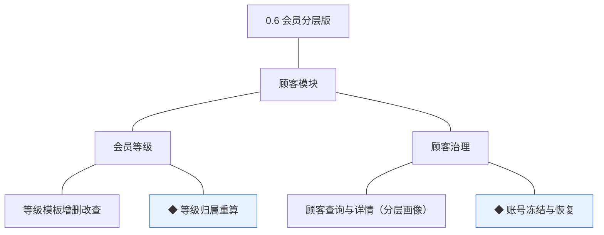
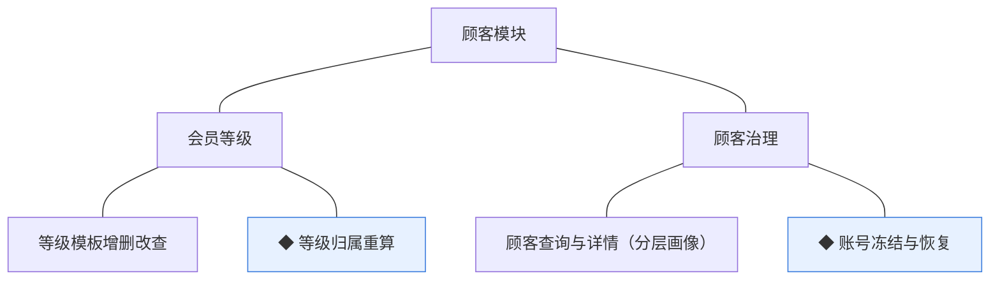
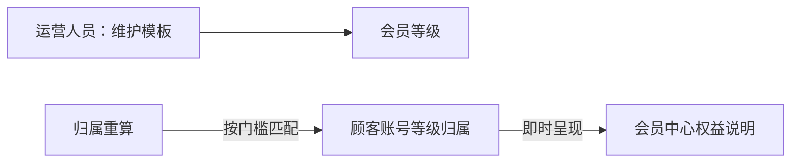
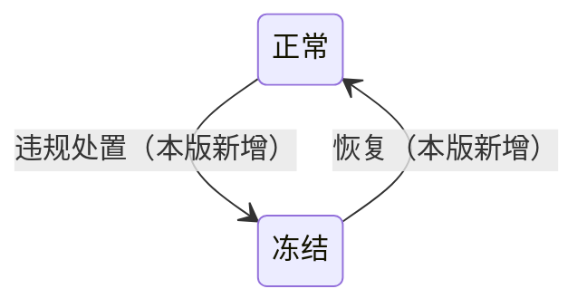

# PRD（大版本）：0.6 会员分层版

> 定位：0.6 会员分层版的立项需求说明书——承接路线图 2.6 条目与项目 PRD，把会员分层主题切为本版的功能、验收标准与对象版本级行为；上游为模拟案例材料，模拟性质予以保留。

## 1. 版本概述

**承接与目标**：会员有分层、权益有抓手、账号有治理——交易沉淀转化为经营资产（路线图 2.6）。本版成功标准（承接完成标志）：等级模板配置生效，存量顾客完成一次归属重算，权益在商城端会员中心正确呈现；一笔冻结／恢复处置全程留痕。量化口径（从版本事实推导）：验证假设＝等级权益拉动高价值顾客复购，判定方式为上线稳定期后不同等级顾客的同期复购率（第二次下单顾客占比）对比，高等级不低于默认等级即方向成立——分层与权益本版新上线、无历史分组基线，不预设行业数值，上线后按实际数据复盘修订（观测口径）。

**范围一句话**：做——等级模板增删改查、◆ 等级归属重算、顾客查询与详情（分层画像）、◆ 账号冻结与恢复；不做——权益自动发券等权益自动兑现（暂缓清单，待与营销联动评审后定）、等级以外的成长体系（积分、任务）、多商家相关分层；0.2 的交易沉淀（订单完成口径数据）与 0.5 的会员中心画像页面为本版取数与呈现基座。

**关键口径定案（路线图指定的立项时点）**：①门槛口径——等级门槛＝顾客累计实付金额（订单完成口径计、退款以净额冲减，04C-报表 3.4 完成口径同源），不设滚动窗口；②默认等级——等级模板须含一个门槛为 0 的默认等级，未达任何门槛的顾客归属默认级（行业惯例默认，推断）；③升降级——重算按当前累计实付从高到低取最高满足档，升级与降级均随重算即时生效（D1 推论）；④权益兑现方式——本版权益为呈现型（商城端会员中心展示等级与权益说明），权益的自动兑现（如自动发券）按暂缓清单待与营销联动评审（PRD 备忘待议项落地）。

**沿用与前置**：沿用 0.2 的订单与交易沉淀（完成口径取数）、0.3 的用券领券入口（冻结拦截点）、0.5 的会员中心与顾客画像页面承载；顾客状态查询契约为既有机制（交易、营销模块只读，04C-顾客 5）。

## 2. 主体与角色

| 主体／角色 | 端 | 怎么用系统 |
|---|---|---|
| 买家 | 商城端 | 在会员中心查看本人等级归属与权益说明（被动呈现，无操作） |
| 运营人员 | 管理端 | 维护等级模板（门槛与权益说明）、触发或查看归属重算 |
| 客服人员 | 管理端 | 检索顾客、执行冻结与恢复处置 |
| 管理者 | 管理端 | 检索顾客、查看分层画像、执行处置 |

裁剪说明：买家侧仅权益呈现（等级归属重算为系统机制）；订单履约人员本版无新功能。

## 3. 核心业务流程

### 3.1 等级生效（运营人员×系统×买家，跨端跨主体）

运营配置等级模板，系统按交易沉淀重算归属，买家在会员中心即时看到等级与权益。

操作步骤清单：

1. 运营人员在管理端维护等级模板：等级名、门槛（累计实付，分）、权益说明、排序；模板含一个门槛为 0 的默认等级。
2. 重算由定期任务或交易完成事件触发；任务读取顾客累计实付（订单完成口径、退款净额冲减）。
3. 按门槛从高到低匹配最高满足档，更新顾客归属等级并留痕；无变化不产生记录（幂等）。
4. 等级与权益变化在商城端会员中心即时呈现。

### 3.2 冻结治理（客服人员×买家，跨主体）

操作步骤清单：

1. 客服或管理者在顾客详情对账号发起冻结（填写处置理由），账号转冻结并留痕。
2. 冻结期间买家的下单、用券、领券请求被拒（既有交易与营销入口按顾客状态契约拦截）；既有交易事实与售后不受影响。
3. 恢复处置后账号转正常，新交易限制解除；处置与恢复均留痕。

覆盖说明：等级生效与冻结治理为跨端跨主体流程各成旅程；顾客查询与详情（分层画像）为管理端单端简单查询（验收标准可覆盖），不成旅程。

## 4. 功能需求

### 4.1 顾客模块（会员等级＋顾客治理）

组说明：会员等级组承载分层配置与归属机制——归属规则以等级模板为唯一配置来源，不写死规则（04C-顾客 3.7）；顾客治理组承载检索、画像与处置收口，冻结只限新交易行为（04C-顾客 3.8）。

| 功能 | 用途 | 验收标准 |
|---|---|---|
| 等级模板增删改查 | 维护等级、门槛与权益说明模板 | 运营人员可新建、编辑、排序与删除等级模板（等级名、门槛与权益说明），被顾客归属引用的等级不可删除 |
| ◆ 等级归属重算 | 按交易沉淀与门槛规则重算顾客归属等级 | 定期或交易完成触发重算时，系统按等级模板门槛匹配顾客累计实付（完成口径、退款净额冲减）并更新归属，留痕且幂等（无变化不产生记录），等级与权益变化即时生效 |
| 顾客查询与详情（分层画像） | 分层画像与顾客检索 | 运营、客服、管理者按手机号、昵称或等级检索顾客并查看详情画像（等级归属、账号状态与交易沉淀摘要） |
| ◆ 账号冻结与恢复 | 违规处置与恢复，分层治理收口 | 客服或管理者对顾客账号执行冻结后，该账号下单、用券、领券被拒且既有交易事实不受影响；恢复后限制解除；处置与恢复全程留痕 |

## 5. 业务对象

本版新上线会员等级对象；顾客账号沿用并新增冻结路径与等级归属引用。

### 5.1 会员等级

定位——顾客分层与权益模板，归属关系在顾客侧表达（04C-顾客 2.2）。

说明：关键组成——等级名、归属门槛规则（累计实付，分）、权益说明、排序（落库名 `cust_member_level`，术语表）。无生命周期状态：静态配置模板（04C-顾客 4），归属关系随重算变化而非等级本身流转；被归属引用不可删；模板须含门槛为 0 的默认等级（本版立项定案）。

### 5.2 顾客账号（沿用 0.2／0.5）

定位——买家在商城端的身份与资料载体（沿用）。

说明：本版只新增正常↔冻结双向流转，其余沿用（注销路径已随 0.5 交付）；冻结期间新交易行为被拒、既有事实不变（04C-顾客 3.8）；等级归属为顾客侧引用字段，随重算更新。
