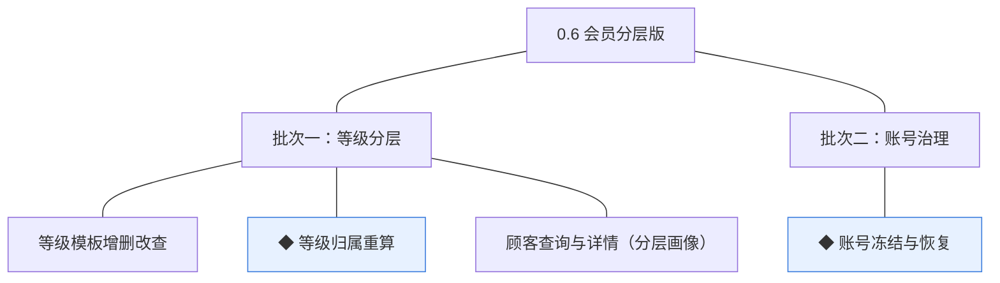
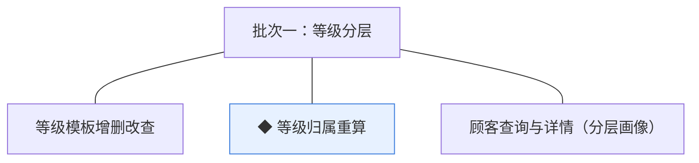
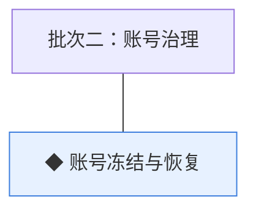

# 开发顺序与需求拆解（大版本）：0.6 会员分层版

> 定位：0.6 会员分层版 PRD→开发批次＋功能级需求条目；本文即该大版本的完整需求清单，需求池据此直接入池、不另生成版本快照；上游为模拟案例材料，模拟性质予以保留。

## 1. 拆解说明

- **做什么**：把 0.6 PRD 的 4 项功能按依赖排成可独立验收的开发批次，每项功能转为一条可直接认领与验收的需求条目（R59 起，用途与验收标准逐字携带 PRD 原文）。
- **粒度口径**：条目与 PRD 4 章功能清单一一同构（一条＝一项功能，无归并无新增）；交互、字段级细化归小版本 PRD。
- **与需求池及小版本规划的关系**：本文是需求池的**主入口但不是唯一入口**——会议、沟通、临时反馈产生的需求可直接单条入池，不经本文；小版本规划的输入＝本文开发顺序＋需求池实时状态两者合并，**批次划分是建议而非锁定**，实际认领以需求池为准。

## 2. 开发顺序

**前置版本沿用面**：0.2 的订单与交易沉淀（完成口径取数）与顾客状态查询契约（交易侧拦截点）；0.3 的用券领券入口（冻结拦截点）；0.5 的会员中心页面（权益与画像呈现承载）。

**顺序依据**：批次一交付"有分层、权益有抓手"——等级模板配置生效、存量顾客完成归属重算、权益在会员中心正确呈现、管理端分层画像可查，三者构成一条可独立演示的分层链路（配置→重算→呈现）；批次二交付"账号有治理"——冻结／恢复处置及其在交易与营销入口的拦截验证。**冻结拦截为独立验证面**：下单（0.2）、用券与领券（0.3）三处拦截点均在既有模块，须逐一回归验证，与分层能力无依赖（判断注记）。**无同事务契约**：等级重算为幂等任务（无变化不产生记录），冻结为顾客模块内状态流转；无外部联调点。**口径定案**：门槛＝累计实付（完成口径、退款净额冲减）、默认等级门槛 0、升降级随重算即时生效、权益为呈现型（自动兑现留暂缓清单）——随本版 PRD 立项定案。

### 2.1 批次一：等级分层

- **目标**：分层链路上线——等级模板配置、按交易沉淀的归属重算、会员中心权益呈现与管理端分层画像。
- **依赖**：0.2（订单完成口径交易沉淀）、0.5（会员中心与画像页面承载）；无本版内部前置、无外部联调点。
- **可验收形态**：运营配置三级模板（含默认级）→存量顾客完成一次归属重算（留痕、幂等）→买家会员中心正确呈现等级与权益说明→管理端按等级检索并查看画像——"配置→重算→呈现→画像"全链路可独立演示。

条目与 PRD 4.1 节功能清单一一同构，用途与验收标准逐字引自原文：

| 编号 | 需求名 | 用途 | 验收标准 |
|---|---|---|---|
| R59 | 等级模板增删改查 | 维护等级、门槛与权益说明模板 | 运营人员可新建、编辑、排序与删除等级模板（等级名、门槛与权益说明），被顾客归属引用的等级不可删除 |
| R60 | ◆ 等级归属重算 | 按交易沉淀与门槛规则重算顾客归属等级 | 定期或交易完成触发重算时，系统按等级模板门槛匹配顾客累计实付（完成口径、退款净额冲减）并更新归属，留痕且幂等（无变化不产生记录），等级与权益变化即时生效 |
| R61 | 顾客查询与详情（分层画像） | 分层画像与顾客检索 | 运营、客服、管理者按手机号、昵称或等级检索顾客并查看详情画像（等级归属、账号状态与交易沉淀摘要） |

### 2.2 批次二：账号治理

- **目标**：账号治理收口——冻结／恢复处置与三处交易拦截验证。
- **依赖**：0.2（下单入口与顾客状态契约）、0.3（用券领券入口）；与批次一无开发依赖（治理不依赖分层能力，判断注记）。无外部联调点。
- **可验收形态**：一笔冻结处置（留理由留痕）后该账号下单、用券、领券三处均被拒而既有订单与售后不受影响；一笔恢复后限制解除——冻结／恢复全程留痕可独立演示。

条目与 PRD 4.1 节功能清单一一同构，用途与验收标准逐字引自原文：

| 编号 | 需求名 | 用途 | 验收标准 |
|---|---|---|---|
| R62 | ◆ 账号冻结与恢复 | 违规处置与恢复，分层治理收口 | 客服或管理者对顾客账号执行冻结后，该账号下单、用券、领券被拒且既有交易事实不受影响；恢复后限制解除；处置与恢复全程留痕 |

**批次判断与边界取舍**：①两批划分——"分层运营"与"账号治理"是两类可独立验收形态，治理不依赖分层能力（判断注记）；②冻结单列批次二——三处拦截点（下单／用券／领券）跨 0.2／0.3 既有模块须逐一回归，验证面独立于分层链路（判断注记）；③等级三条同批——配置→重算→呈现→画像为一条依赖链，拆批则任何中间态不可独立验收（判断注记）；④权益自动兑现（自动发券等）在暂缓清单，本版权益为呈现型（PRD 立项定案）。

**版本级验收安排**：完成标志＝等级模板配置生效，存量顾客完成一次归属重算，权益在商城端会员中心正确呈现；一笔冻结／恢复处置全程留痕。无灰度台阶（无对外发布与资金方向，沿用既有灰度状态）；复购率对比为上线后观测口径（0.6 PRD 概述）。

## 3. 条目与 PRD 对应核对

- **一一同构声明**：条目数＝PRD 功能数＝4（R59~R62），逐行对应、无归并无新增；无路径拆分条目。
- **批次构成**：批次一 3 条（会员等级组 2、顾客治理组 1）；批次二 1 条（顾客治理组 1）。
- **◆ 清点**：R60、R62 两条（承接 PRD 功能清单同名 ◆ 标注）。
- **过渡支撑清点**：本版无过渡支撑（分层与治理均为永久性能力，无临时简化）。

## 4. 与需求池和小版本规划的衔接

- **入池路径**：本文各批次需求表由需求池运营提示词按「批量入池」逐行登记（编号沿用、批次随源继承，状态一律待规划）。
- **多入口口径**：本文是主入口但不是唯一入口——会议、沟通、临时反馈的需求直接单条入池，不经本文，两类条目并存互不覆盖。
- **小版本规划的合并输入**：规划＝本文开发顺序建议＋需求池实时状态；建议按批次一→批次二确认两个小版本（0.6.0 等级分层版认领 R59~R61、0.6.1 账号治理版认领 R62），唯一硬约束是本文声明的依赖不回退（等级链三条不拆批认领）。
- **认领与细化原则**：认领后的小版本 PRD 做开发级细化（交互、字段、边界，含等级模板字段与门槛取值、重算任务参数、冻结处置理由等版本级默认值落地），验收以随行验收标准为锚，不回溯改写本文。
