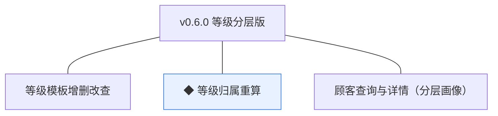
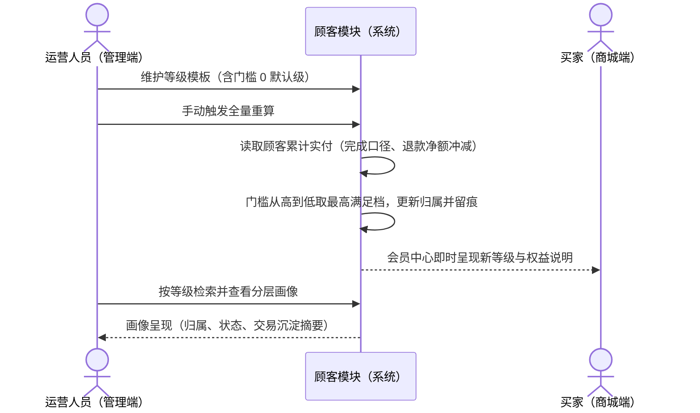
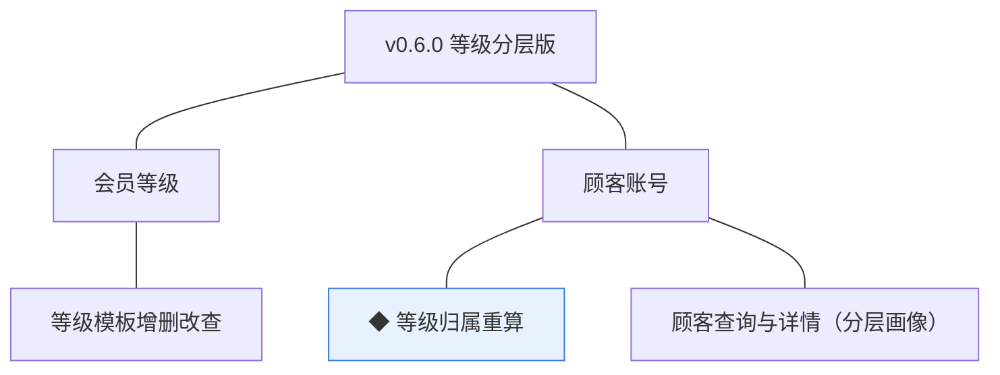
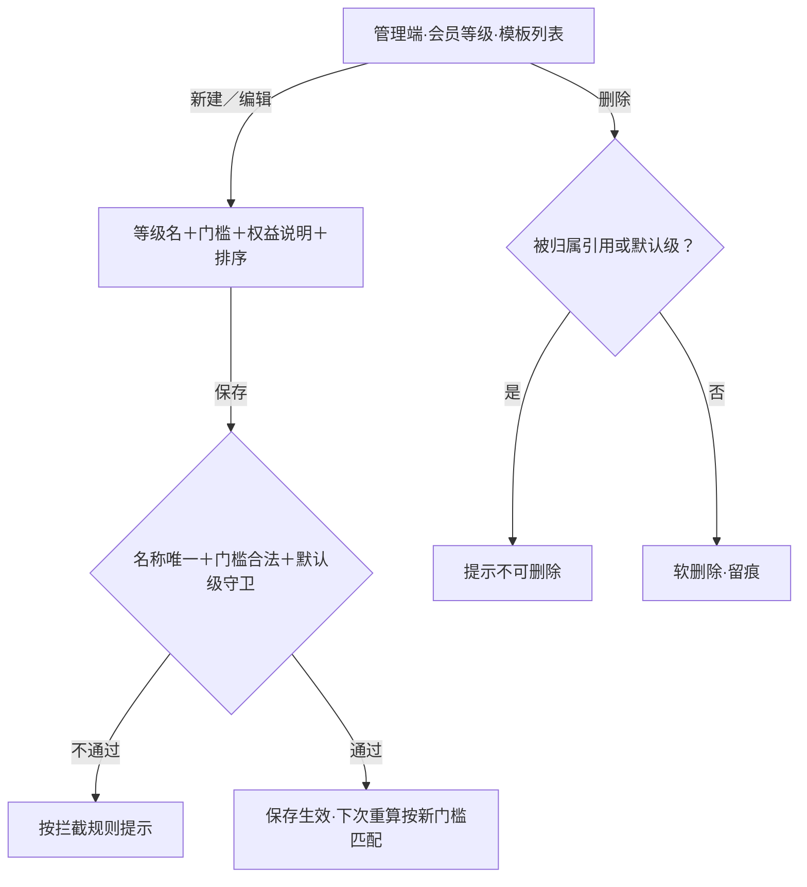
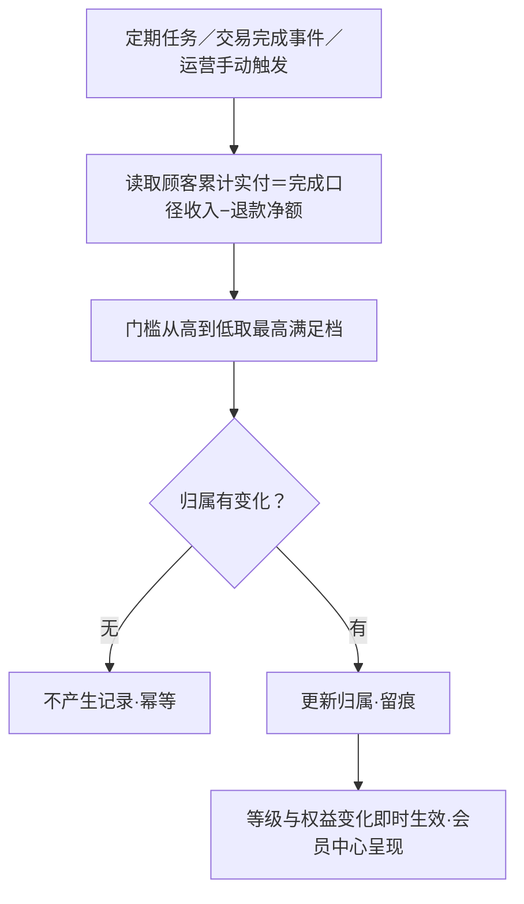
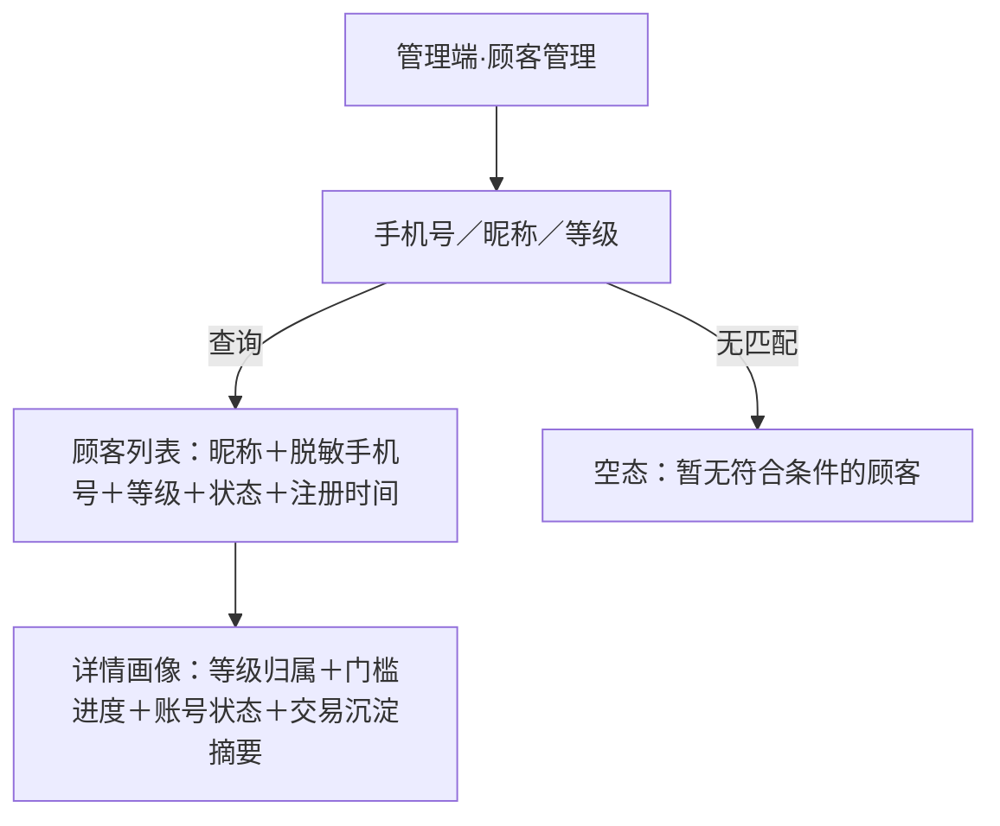

# PRD（小版本）：v0.6.0 等级分层版

> 定位：v0.6.0 的开发级需求说明书——承接 0.6 会员分层版 PRD 与 02、认领自需求池（R59~R61）；上游为模拟案例材料，模拟性质予以保留。

## 1. 版本概述

**承接与目标**：认领 0.6 批次一「等级分层」全部条目（R59 等级模板增删改查、R60 ◆ 等级归属重算、R61 顾客查询与详情（分层画像）；等级链三条不拆批），交付分层链路——等级模板配置、按交易沉淀的归属重算、会员中心权益呈现与管理端分层画像；本版可验收形态＝运营配置三级模板（含默认级）→存量顾客完成一次归属重算（留痕、幂等）→买家会员中心正确呈现等级与权益说明→管理端按等级检索并查看画像。

**范围外声明**：账号冻结与恢复随 v0.6.1（R62）；权益自动兑现（自动发券等）在暂缓清单（本版权益为呈现型）；等级以外的成长体系（积分、任务）不做；统计报表（0.7）。

**条目内顺序与依赖**：R59 模板先行→R60 重算（以模板为唯一配置来源）→R61 画像（呈现归属结果）；依赖 0.2（订单完成口径交易沉淀）、0.5（会员中心页面承载）。无外部联调点。

## 2. 需求范围与验收锚

| 编号 | 需求名 | 用途 | 验收标准 |
|---|---|---|---|
| R59 | 等级模板增删改查 | 维护等级、门槛与权益说明模板 | 运营人员可新建、编辑、排序与删除等级模板（等级名、门槛与权益说明），被顾客归属引用的等级不可删除 |
| R60 | ◆ 等级归属重算 | 按交易沉淀与门槛规则重算顾客归属等级 | 定期或交易完成触发重算时，系统按等级模板门槛匹配顾客累计实付（完成口径、退款净额冲减）并更新归属，留痕且幂等（无变化不产生记录），等级与权益变化即时生效 |
| R61 | 顾客查询与详情（分层画像） | 分层画像与顾客检索 | 运营、客服、管理者按手机号、昵称或等级检索顾客并查看详情画像（等级归属、账号状态与交易沉淀摘要） |

锚定说明：上表需求名、用途、验收标准逐字引自 0.6 02 批次一需求表（其又逐字锚定 0.6 PRD 4.1 功能清单）；本文只细化不改写，验收以本表为锚。

## 3. 核心用户旅程

旅程承接说明：承接 0.6 PRD 3.1「等级生效」旅程（本版认领段＝全程：配置→重算→会员中心呈现）；冻结治理旅程随 v0.6.1；顾客检索与画像查看为管理端单端简单查询（验收标准可覆盖），不成旅程但纳入旅程第 5 步的验收演示。

### 3.1 等级生效（运营人员×系统×买家，跨端跨主体）

操作步骤清单：

1. 运营人员在管理端「会员等级」维护模板：新建三级（默认级门槛 0、白银、黄金），填等级名、门槛（分）、权益说明、排序；保存生效。
2. 运营点「全量重算」按钮触发存量顾客重算（或等待每日定期任务／交易完成事件的增量重算）。
3. 系统按「累计实付＝已完成订单实收合计−已完结退货退款合计」取数，门槛从高到低取最高满足档（未达任何门槛归属默认级），更新顾客归属并留痕；无变化不产生记录。
4. 买家打开商城端会员中心，即时看到本人等级名、权益说明与「距下一等级」进度。
5. 运营在「顾客管理」按等级筛选并打开详情画像（等级归属、账号状态、累计实付与订单数摘要）核对重算结果。

## 4. 功能需求

### 4.1 功能总览

**对象增删改查矩阵**：

| 对象 | 增 | 改 | 删 | 查 |
|---|---|---|---|---|
| 会员等级 | R59（新建） | R59（编辑、排序；门槛变更随下次重算生效） | R59（软删除，被归属引用不可删；门槛 0 默认级不可删） | R59（模板列表）＋R61（画像与检索的等级维度） |
| 顾客账号 | 不做（注册沿用 0.2） | R60（等级归属字段更新，留痕） | 不做（冻结治理随 v0.6.1） | R61（检索与详情画像） |
| 订单／退货单 | 沿用 | 沿用 | 沿用 | R60（累计实付取数只读：完成口径收入−退款净额） |

**主体使用面**：

| 主体 | 端 | 使用条目 |
|---|---|---|
| 买家 | 商城端 | 权益呈现面（会员中心等级、权益说明、距下一等级进度——被动呈现，无操作） |
| 运营人员 | 管理端 | R59（模板维护）、R60 运营侧（手动触发全量重算）、R61（检索与画像） |
| 客服人员／管理者 | 管理端 | R61（检索与画像，只读） |
| 系统 | — | R60 的定期任务与交易完成事件触发（增量重算机制，无人工触发面） |

### 4.2 R59 等级模板增删改查

**功能说明**：维护等级、门槛与权益说明模板。触发：运营人员在管理端「会员等级」新建、编辑、排序或删除等级模板。

**交互与流程**：

操作步骤清单：

1. 运营人员在「会员等级」查看模板列表（等级名、门槛〔元展示〕、权益说明、排序、归属人数）。
2. 新建／编辑：等级名（2~20 字、全局唯一）、门槛（整数分，≥0；0 表示默认级）、权益说明（0~200 字）、排序（越小越靠前）。
3. 保存校验通过后生效；门槛与权益变更随下次重算反映到归属与呈现（已归属顾客的等级名与权益说明即时按模板刷新）。
4. 排序即时调整（影响管理端与商城端等级列表呈现顺序）。
5. 删除：被顾客归属引用的等级不可删（提示先调整门槛重算转移）；门槛为 0 的默认级不可删（未达标顾客的归属兜底）。

**字段与校验**：

| 信息项 | 必填 | 业务类型 | 落库字段名 | 约束与取值 |
|---|---|---|---|---|
| 等级名 | 是 | 文本 | `level_name` | 2~20 字，全局唯一 |
| 门槛 | 是 | 金额（分） | `threshold_amount` | 整数 ≥0；0＝默认级；须全局唯一（两级同门槛无意义） |
| 权益说明 | 否 | 文本 | `benefit_desc` | 0~200 字，呈现型权益文案 |
| 排序 | 是 | 整数 | `sort_order`（复用） | 越小越靠前 |

**规则与边界**：

1. 模板须始终存在一个门槛为 0 的默认等级（新建首个等级强制门槛 0；默认级不可删除、门槛不可改为非 0）。
2. 被归属引用的等级不可删除（软删除语义，规范）。
3. 归属规则以等级模板为唯一配置来源，不写死规则（04C-顾客 3.7）。
4. 模板增删改留痕（操作者／时间／动作）；等级为静态配置模板、无生命周期状态。

**异常与拦截**：

| # | 场景 | 系统行为（用户可见） |
|---|---|---|
| A1 | 等级名重复或长度不符 | 保存前即时提示「等级名 2~20 字且不可重复」 |
| A2 | 门槛非整数／为负／与他级相同 | 即时提示「门槛为不小于 0 的整数金额（分），且各等级门槛不可相同」 |
| A3 | 删除被引用等级 | 提示「该等级已有顾客归属，请先调整门槛重算转移后再删除」 |
| A4 | 删除或改动默认级（门槛 0） | 提示「默认等级不可删除，门槛须保持为 0」 |
| A5 | 非运营角色访问会员等级管理 | 菜单不可见（能力点控制，D4） |

### 4.3 R60 ◆ 等级归属重算

**功能说明**：按交易沉淀与门槛规则重算顾客归属等级。触发：每日定期任务、订单完成或退款完结事件（增量）、运营人员手动全量重算。

**交互与流程**：

操作步骤清单：

1. 触发来源三种：每日凌晨定期全量任务（行业惯例默认，推断）、订单完成／退款完结事件触发的单人增量重算、运营人员在「会员等级」页点「全量重算」。
2. 系统计算顾客累计实付＝已完成订单实收合计−已完结退货退款合计（完成口径，退款净额冲减）。
3. 按当前生效模板门槛从高到低取最高满足档；无匹配归属默认级（门槛 0 必匹配）。
4. 归属变化则更新 `member_level_id` 并留痕（顾客、原级、新级、触发来源、时间）；无变化不产生记录（幂等，任务可重入）。
5. 等级与权益变化即时生效——会员中心呈现、画像查询即时反映。

**字段与校验**：

| 信息项 | 必填 | 业务类型 | 落库字段名 | 约束与取值 |
|---|---|---|---|---|
| 顾客归属等级 | 是 | 外键引用 | `member_level_id` | 引用 cust_member_level.id；每顾客至多一个归属 |
| 累计实付 | 是（计算值） | 金额（分） | 不落独立字段，按交易事实派生（完成口径收入−退款净额，K3 单库派生） | 重算时点计算值 |
| 归属变化留痕 | 变化时写入 | 留痕记录 | 沿用留痕机制（顾客、原级、新级、触发来源） | 幂等：无变化不产生记录 |

**规则与边界**：

1. 归属规则以等级模板为唯一配置来源；模板门槛变更后随下一次重算生效。
2. 升级与降级均随重算即时生效（退款使累计实付下降可触发降级，D1 推论）。
3. 重算任务可重入幂等；定期任务失败可重试，不影响已生效归属。
4. 重算不修改任何交易事实（只读取数，D6 推论）。

**异常与拦截**：

| # | 场景 | 系统行为（用户可见） |
|---|---|---|
| A1 | 模板缺失默认级（配置异常兜底） | 重算任务拒绝执行并告警「等级模板缺少默认等级」（R59 守卫下不应出现） |
| A2 | 手动全量重算进行中重复触发 | 提示「重算处理中，请稍后」，不产生并发任务 |
| A3 | 单人增量重算与全量任务并发 | 以条件更新保护，归属结果以最后一次有效计算为准，留痕不重复 |

### 4.4 R61 顾客查询与详情（分层画像）

**功能说明**：分层画像与顾客检索。触发：运营、客服、管理者在管理端「顾客管理」设定检索条件并查看详情。

**交互与流程**：

操作步骤清单：

1. 检索：手机号（精确）、昵称（模糊）、等级（下拉单选）三个条件可组合；列表每页 20 条（行业惯例默认，推断）。
2. 列表呈现：昵称、脱敏手机号（如 138****1234，行业惯例默认，推断）、等级名、账号状态中文、注册时间。
3. 点击进入详情画像：等级归属与「距下一等级」进度（当前累计实付与下一门槛差额）、账号状态（正常／冻结／注销，冻结处置随 v0.6.1）、交易沉淀摘要（累计实付、完成订单数、最近下单时间）。
4. 检索与查看为只读操作，留访问留痕（规范）。

**字段与校验**：

| 信息项 | 必填 | 业务类型 | 落库字段名 | 约束与取值 |
|---|---|---|---|---|
| 检索：手机号 | 否 | 精确匹配 | `mobile`（复用，脱敏展示） | — |
| 检索：昵称 | 否 | 模糊匹配 | `nickname`（复用） | — |
| 检索：等级 | 否 | 下拉单选 | `member_level_id`（复用） | 模板既有等级 |
| 画像：交易沉淀 | — | 派生只读 | 按交易事实派生（同 R60 口径） | 累计实付／订单数／最近下单时间 |

**规则与边界**：

1. 顾客管理菜单按角色能力点控制（D4）：运营、客服、管理者可见，均只读（处置动作随 v0.6.1）。
2. 画像取数与重算同口径（完成口径收入−退款净额），跨页面不出现矛盾口径（K3 推论）。
3. 手机号脱敏展示，完整号码不留存于前端日志（安全惯例，推断）。

**异常与拦截**：

| # | 场景 | 系统行为（用户可见） |
|---|---|---|
| A1 | 检索无匹配 | 空态「暂无符合条件的顾客」 |
| A2 | 无等级角色访问顾客管理 | 菜单不可见（能力点控制，D4）；直接访问接口返回无权限 |

## 5. 业务对象与数据字段

**数据主体清单**：

| 业务对象 | 落库名 | 定位与关系 |
|---|---|---|
| 会员等级 | `cust_member_level`（新表，本版创建） | 顾客分层与权益模板；归属关系在顾客侧表达 |
| 顾客账号 | `cust_account`（沿用 0.2，本版新增等级归属引用字段） | 等级归属（每顾客至多一个）；画像取数只读 |
| 订单／退货单 | `trade_order`／`trade_return`（沿用） | 累计实付派生取数（完成口径收入−退款净额），不新增字段 |

**会员等级（cust_member_level）字段表**：

| 字段 | 必填 | 业务类型 | 落库字段名 | 约束与取值 |
|---|---|---|---|---|
| 等级名 | 是 | 文本 | `level_name` | 2~20 字，全局唯一 |
| 门槛 | 是 | 金额（分） | `threshold_amount` | 整数 ≥0，0＝默认级，全局唯一 |
| 权益说明 | 否 | 文本 | `benefit_desc` | 0~200 字 |
| 排序 | 是 | 整数 | `sort_order`（复用） | 越小越靠前 |

**顾客账号（cust_account）本版新增字段**：`member_level_id`（等级归属引用，可空——未重算前为空，重算后必归属含默认级）。

列类型、主键、索引与建表 DDL 归开发阶段。

## 6. 待议与建议

**本版采用的推断与默认值汇总**：

| 采用值 | 来源状态 |
|---|---|
| 门槛口径＝累计实付（完成口径收入−退款净额）、不设滚动窗口 | 0.6 PRD 立项定案 |
| 默认等级门槛 0 且不可删改门槛 | 0.6 PRD 立项定案＋归属兜底推导 |
| 等级名 2~20 字、权益说明 0~200 字、门槛全局唯一 | 行业惯例默认（推断） |
| 定期任务每日凌晨全量＋交易完成事件增量＋运营手动全量三触发 | 04C-顾客 3.7 机制（定期／触发式统一）＋行业惯例默认（推断） |
| 会员中心「距下一等级」进度、手机号脱敏、列表每页 20 条 | 行业惯例默认（推断） |

**待确认内容与影响**：权益自动兑现方式（自动发券等）待与营销联动评审（暂缓清单）；重算批量大小与任务时段留实现细节。均不影响本版验收锚。

**建议回池的新想法**：无。

**术语表待登记行（随本文回报，由主流程合入）**：

- 第 3 节对象行：无新增对象（会员等级既有登记）。
- 编码契约新增「v0.6.0 会员分层域落库表与字段」：新表 `cust_member_level`（`level_name`、`threshold_amount`、`benefit_desc` 新名；`sort_order` 复用）；cust_account 新增 `member_level_id`。新名共 4 个。
