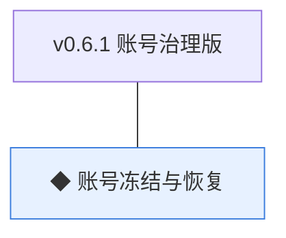
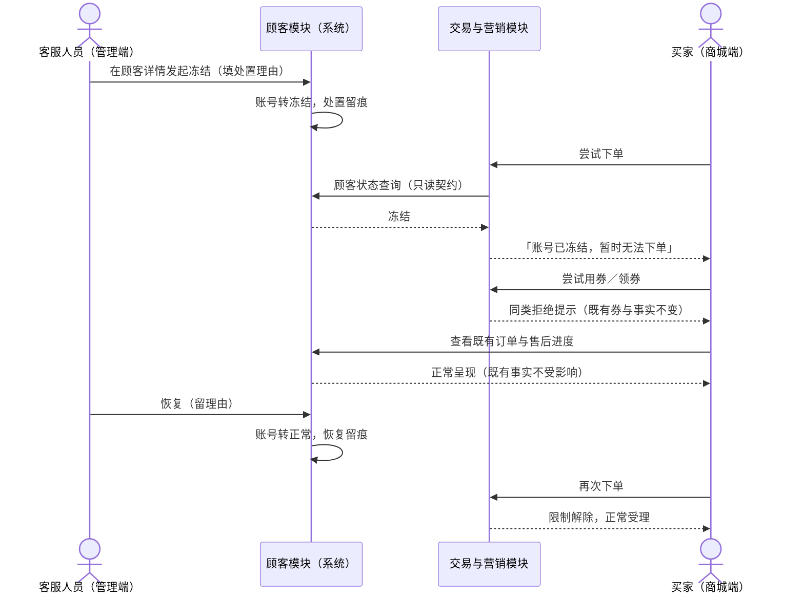
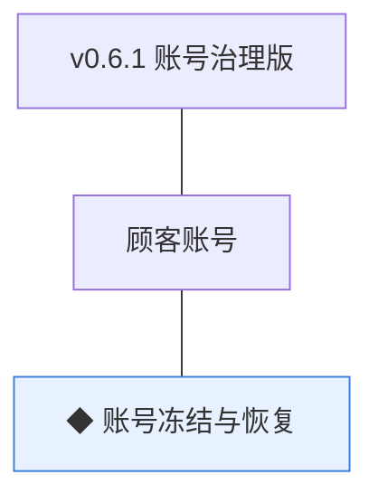
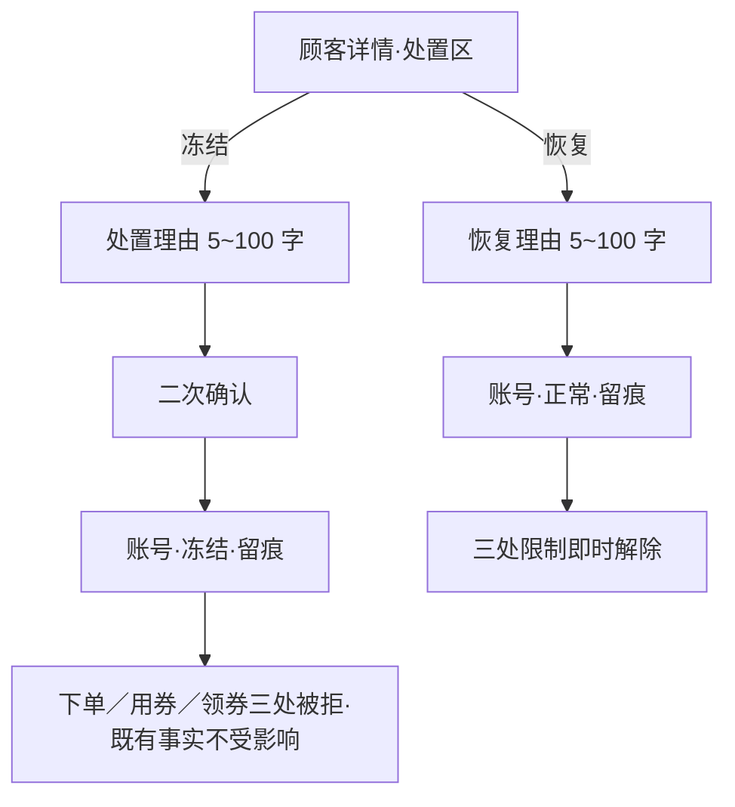

# PRD（小版本）：v0.6.1 账号治理版

> 定位：v0.6.1 的开发级需求说明书——承接 0.6 会员分层版 PRD 与 02、认领自需求池（R62）；上游为模拟案例材料，模拟性质予以保留。

## 1. 版本概述

**承接与目标**：认领 0.6 批次二「账号治理」全部条目（R62 ◆ 账号冻结与恢复），交付账号治理收口——冻结／恢复处置及其在交易与营销入口的拦截验证；本版可验收形态＝一笔冻结处置（留理由留痕）后该账号下单、用券、领券三处均被拒而既有订单与售后不受影响，一笔恢复后限制解除，冻结／恢复全程留痕。本版发布后 0.6 大版本完成标志达成。

**范围外声明**：等级模板、归属重算与分层画像已随 v0.6.0 交付；权益自动兑现（暂缓清单）；顾客账号注销已随 0.5.1 交付（本版仅新增冻结期间注销拦截口径）；管理端账号治理（0.1 已交付）不涉。

**条目内顺序与依赖**：单条目版本；依赖 0.2（下单入口与顾客状态查询契约）、0.3（用券领券入口）、v0.6.0（顾客详情画像页为处置操作承载页）。无外部联调点。

## 2. 需求范围与验收锚

| 编号 | 需求名 | 用途 | 验收标准 |
|---|---|---|---|
| R62 | ◆ 账号冻结与恢复 | 违规处置与恢复，分层治理收口 | 客服或管理者对顾客账号执行冻结后，该账号下单、用券、领券被拒且既有交易事实不受影响；恢复后限制解除；处置与恢复全程留痕 |

锚定说明：上表需求名、用途、验收标准逐字引自 0.6 02 批次二需求表（其又逐字锚定 0.6 PRD 4.1 功能清单）；本文只细化不改写，验收以本表为锚。

## 3. 核心用户旅程

旅程承接说明：承接 0.6 PRD 3.2「冻结治理」旅程（本版认领段＝全程：处置→三处拦截→恢复）；等级生效旅程已随 v0.6.0 交付，不重复。

### 3.1 冻结治理（客服人员×买家，跨主体）

操作步骤清单：

1. 客服或管理者在管理端「顾客管理」打开顾客详情（v0.6.0 画像页），在处置区点「冻结」，填写处置理由（必填 5~100 字）并确认。
2. 账号转冻结（`FROZEN`），处置留痕（操作者、理由、时间）；画像状态标签更新为「冻结」。
3. 冻结期间买家三处交易行为被拒：提交订单、用券（下单核销／秒杀资格）、领券——各入口按顾客状态契约拦截并提示；登录放行（可查看既有订单、售后进度、咨询与帮助，服务面不受限）。
4. 既有交易事实不受影响：进行中订单正常履约、售后退货正常完结、持券记录保留（仅不可使用）。
5. 恢复：客服或管理者点「恢复」填理由确认，账号转正常（`NORMAL`）、留痕；三处限制即时解除。

## 4. 功能需求

### 4.1 功能总览

**对象增删改查矩阵**：

| 对象 | 增 | 改 | 删 | 查 |
|---|---|---|---|---|
| 顾客账号 | 不做（注册沿用 0.2） | R62（状态 正常↔冻结 双向流转＋留痕） | 不做（注销沿用 0.5.1，冻结期间注销被拦截） | 沿用 v0.6.0 画像（状态标签新增「冻结」呈现）＋交易/营销模块状态契约只读 |
| 订单／退货单／持券记录 | 沿用 | 沿用（既有履约与售后不受冻结影响） | 沿用 | 沿用（买家侧正常查看） |

**主体使用面**：

| 主体 | 端 | 使用条目 |
|---|---|---|
| 客服人员／管理者 | 管理端 | R62（顾客详情处置区：冻结、恢复、处置留痕查看） |
| 买家 | 商城端 | 拦截提示被动呈现面（下单／用券／领券被拒）；既有记录查看不受限 |
| 交易与营销模块 | 系统 | 拦截点机制（顾客状态查询契约只读校验，无人工触发面） |

### 4.2 R62 ◆ 账号冻结与恢复

**功能说明**：违规处置与恢复，分层治理收口。触发：客服或管理者在管理端顾客详情处置区发起冻结（填处置理由）或恢复。

**交互与流程**：

操作步骤清单：

1. 冻结入口：顾客详情处置区「冻结」按钮（仅客服、管理者角色可见，运营可见画像但无处置按钮）。
2. 填写处置理由（必填 5~100 字）→二次确认（「冻结后该账号无法下单、用券、领券，既有订单与售后不受影响」）→账号转冻结、留痕。
3. 冻结生效后三处拦截即时生效；画像状态标签、顾客列表状态列更新为「冻结」。
4. 恢复入口：冻结态顾客详情处置区「恢复」按钮，填恢复理由（5~100 字）确认→账号转正常、留痕、限制解除。
5. 处置区下方呈现处置留痕时间线（动作、理由、操作者、时间，倒序）。

**字段与校验**：

| 信息项 | 必填 | 业务类型 | 落库字段名 | 约束与取值 |
|---|---|---|---|---|
| 账号状态 | 是（系统维护） | 状态枚举 | `status`（复用） | 正常 `NORMAL`↔冻结 `FROZEN`；注销 ★ `CANCELLED` 沿用 0.5.1 |
| 处置理由 | 冻结/恢复时必填 | 文本 | 随处置留痕记录（不新增顾客账号字段） | 5~100 字 |
| 处置留痕 | 是 | 留痕记录 | 沿用留痕机制（操作者／动作／理由／时间） | 冻结与恢复各留一行 |

**规则与边界**：

1. 冻结只限新交易行为：下单、用券（核销／秒杀资格）、领券被拒；既有订单履约、售后退货、持券记录、咨询、帮助、登录不受影响（04C-顾客 3.8；登录放行为本版落地值——买家需跟踪既有订单与售后，行业惯例默认，推断）。
2. 三处拦截按顾客状态查询契约实现（交易、营销模块只读校验，04C-顾客 5），不复制状态到业务侧。
3. 已注销账号为终态，不可冻结也不可恢复；冻结期间注销申请被拦截（提示先解除冻结，治理优先——行业惯例默认，推断）。
4. 重复冻结／重复恢复幂等（已是目标状态提示不变更、不产生新留痕行）。
5. 冻结与恢复必须留痕（规范）；处置与恢复理由对管理端可见，不对买家展示（内部治理信息）。

**异常与拦截**：

| # | 场景 | 系统行为（用户可见） |
|---|---|---|
| A1 | 处置理由不足 5 字或超 100 字 | 提交前即时提示「请填写 5~100 字处置理由」 |
| A2 | 对已冻结账号重复冻结／对正常账号恢复 | 提示「该账号已处于冻结状态」／「该账号为正常状态，无需恢复」，不产生变更与留痕 |
| A3 | 对已注销账号发起冻结或恢复 | 提示「已注销账号不可变更状态」 |
| A4 | 非客服／管理者角色访问处置入口 | 处置按钮不可见（能力点控制，D4）；直接访问接口返回无权限 |
| A5 | 冻结账号在商城端提交订单／用券／领券 | 分别提示「账号已冻结，暂时无法下单」「账号已冻结，暂时无法使用优惠券」「账号已冻结，暂时无法领取优惠券」；既有订单、售后、持券查看正常 |
| A6 | 冻结账号申请注销 | 提示「账号处于冻结状态，请联系客服处理后再注销」 |

## 5. 业务对象与数据字段

**数据主体清单**：

| 业务对象 | 落库名 | 定位与关系 |
|---|---|---|
| 顾客账号 | `cust_account`（沿用 0.2，本版零新增字段） | 状态机补齐正常↔冻结双向流转；处置理由与时间随留痕记录承载 |
| 订单／退货单／优惠券持有记录 | `trade_order`／`trade_return`／`mkt_coupon_hold`（沿用） | 既有事实不受冻结影响；冻结拦截仅在交易与营销入口按状态契约校验 |

**顾客账号（cust_account）本版零新增字段**：状态流转复用既有 `status`（正常 `NORMAL`／冻结 `FROZEN`，术语表既有枚举）；处置理由、操作者与时间由留痕机制承载，不为单条目增设字段。

## 6. 待议与建议

**本版采用的推断与默认值汇总**：

| 采用值 | 来源状态 |
|---|---|
| 冻结期间登录放行（仅限交易行为） | 04C-顾客 3.8「登录按配置放行或拒绝」的落地值＋买家需跟踪既有订单售后推导（行业惯例默认，推断） |
| 处置与恢复理由 5~100 字、对管理端可见不对买家展示 | 行业惯例默认（推断）＋内部治理信息口径 |
| 冻结期间注销被拦截 | 治理优先推导（行业惯例默认，推断；04C 注销校验未列冻结态，本版补此拦截口径） |
| 三处拦截提示文案（下单／用券／领券各一句） | 行业惯例默认（推断），措辞与既有拦截提示风格一致 |

**待确认内容与影响**：冻结是否需要通知买家（站内信／短信）待业务确认（当前仅拦截时提示，不影响验收锚）。

**建议回池的新想法**：无。

**术语表待登记行（随本文回报，由主流程合入）**：无——本版零新增表与字段（状态枚举与留痕机制均为既有登记），无新增业务对象。
