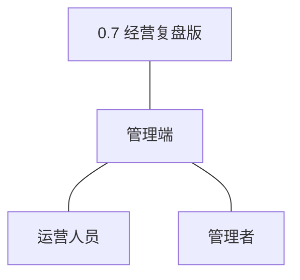
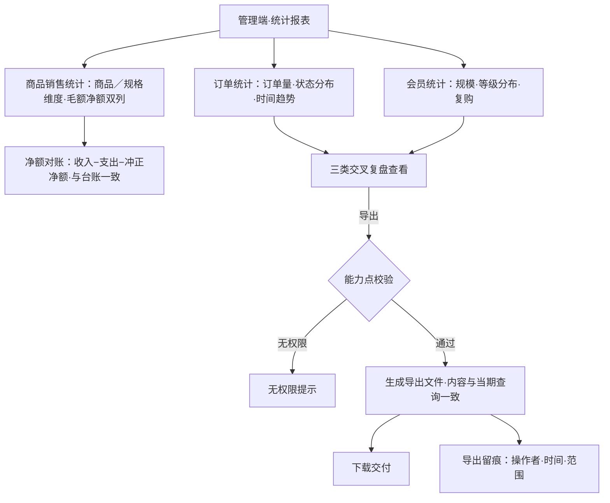
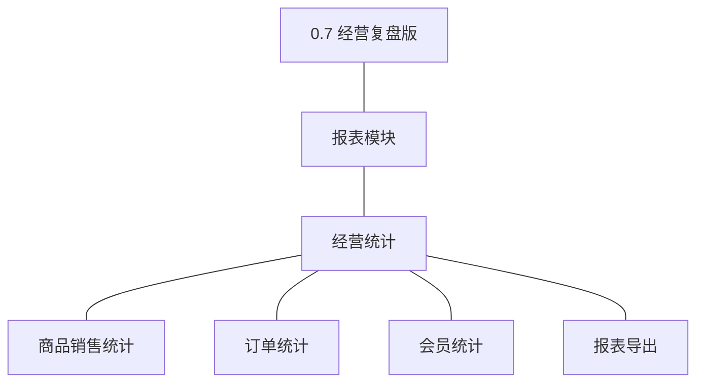
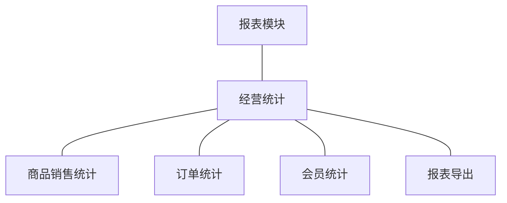
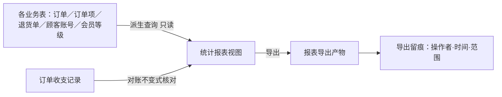
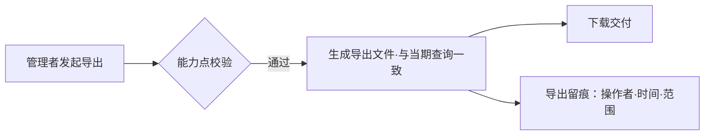

# PRD（大版本）：0.7 经营复盘版

> 定位：0.7 经营复盘版（路线图收官版）的立项需求说明书——承接路线图 2.7 条目与项目 PRD，把经营复盘主题切为本版的功能、验收标准与对象版本级行为；上游为模拟案例材料，模拟性质予以保留。

## 1. 版本概述

**承接与目标**：经营看得清——商品、订单、会员三类报表支撑复盘决策，报表可导出留痕（路线图 2.7）。本版成功标准（承接完成标志）：管理者在报表页完成一次覆盖商品／订单／会员三类的复盘查看并成功导出一份报表。量化口径（承接路线图验证假设）：报表进入经营决策回路——判定为定性事件（版本后首轮选品／活动调整引用了报表数据）；过程观测指标＝报表查看频次与导出次数（行业惯例默认，推断，上线后按实际数据复盘）。

**范围一句话**：做——商品销售统计、订单统计、会员统计三类派生报表与报表导出（能力点控制并留痕）；不做——经营预测与自定义多维分析（04C-报表明确不做）、实时监控大屏与推送提醒（明确不做）、个性化推荐；沿用 0.4 的订单收支台账查询（报表净额口径与台账经对账不变式核对）、0.1~0.2 的权限能力点体系。

**关键口径承接（04C-报表，本版落地为报表行为）**：①销售类统计以订单完成口径计、退款完成的订单在净额口径中扣除——商品销售统计毛额与净额双列；②会员统计以顾客账号存量为口径，注销账号计入历史累计不计当期存量；③三类视图同一时点基于同一数据库派生取数（K3），跨视图不出现矛盾口径；④净额口径满足对账不变式（订单实收净额合计＝台账收入合计−支出合计−冲正净额），管理者可据此核对报表与台账一致（04C-报表 3.5）；⑤统计取数不访问已逻辑删除档案，历史统计以成交快照字段取数（D6 推论）。

**沿用与前置**：沿用 0.2~0.6 全部业务数据与台账；依赖 0.6（会员等级数据结构就绪，使会员统计维度成立）、间接依赖 0.2~0.5 各业务表；数据积累量属验证条件，不阻塞立项（路线图 2.7）。

## 2. 主体与角色

| 主体／角色 | 端 | 怎么用系统 |
|---|---|---|
| 管理者 | 管理端 | 查看三类统计报表、经对账不变式核对台账、发起并下载报表导出 |
| 运营人员 | 管理端 | 查看商品销售统计与会员统计（选品与活动复盘取数） |

裁剪说明：本版为纯管理端报表版本，买家无任何呈现面；报表导出仅管理者（能力点控制，D4）；客服人员与订单履约人员本版无新功能。

## 3. 核心业务流程

### 3.1 经营复盘查看与导出（管理者，单端关键流程）

操作步骤清单：

1. 管理者进入管理端「统计报表」，依次查看商品销售统计（商品／规格维度，毛额与净额双列）、订单统计（订单量、状态分布、时间趋势）、会员统计（会员规模、等级分布、复购情况），设定时间窗。
2. 以对账不变式核对商品销售统计净额合计与订单收支台账（收入−支出−冲正净额）一致。
3. 三类报表交叉对照完成一次复盘查看（覆盖商品／订单／会员三类）。
4. 对任一报表发起导出：系统校验管理者能力点，生成导出文件供下载，内容与当期查询结果一致。
5. 导出动作留痕（操作者、时间、范围），供审计查询。

覆盖说明：本版无跨端跨主体流程；复盘查看与导出为承载版本主题的关键单端流程成一条旅程；三类统计查询为验收标准可覆盖的报表查询操作，不另成旅程。

## 4. 功能需求

### 4.1 报表模块（经营统计）

组说明：统计报表视图从各业务表派生查询、不落第二套对象（K3 单库派生）；销售类统计以订单完成口径计；导出按能力点控制并留痕（D4、规范）；预聚合仅为实现优化不改口径（04C-报表）。

| 功能 | 用途 | 验收标准 |
|---|---|---|
| 商品销售统计 | 商品／规格维度的销量与金额复盘 | 管理者或运营人员按商品或规格维度查询指定时间窗的销量与金额，报表以订单完成口径计销售并毛额与净额双列呈现，净额口径扣除退款完成部分 |
| 订单统计 | 订单量、状态分布与时间趋势复盘 | 管理者按时间查询订单量、状态分布与时间趋势，完成指标按完成时点计、过程指标按状态分布计，结果与业务单据可核对 |
| 会员统计 | 会员规模、等级分布与复购情况复盘 | 管理者或运营人员查询会员规模、等级分布与复购情况，统计以顾客账号存量为口径（注销账号计入历史累计不计当期存量），等级分布与会员等级归属数据一致 |
| 报表导出 | 统计结果文件化交付并留痕 | 管理者对任一统计报表发起导出，系统生成导出文件供下载且内容与当期查询结果一致，导出经能力点校验并留痕（操作者、时间、范围） |

## 5. 业务对象

本版不新增落库业务对象：统计报表视图为派生查询（不落第二套对象，K3），报表导出产物不作为业务对象建模（文件本体存部署产物区，系统内仅保留导出留痕供审计，04C-报表 4）；全部取数为对各业务表的只读派生。

### 5.1 统计报表视图

定位——经营统计的派生查询（商品销售、订单、会员三类），每次取数实时计算（预聚合为实现优化，不改口径）。

说明：无落库生命周期、无状态对象（04C-报表 4）；三类视图同一时点同一数据库取数、口径互不矛盾（K3 推论）；净额口径满足对账不变式（收入−支出−冲正净额）；取数不访问已逻辑删除档案、历史统计以成交快照字段取数（D6 推论）。

### 5.2 报表导出产物

定位——统计结果的文件化交付，一次性交付物。

说明：不作为业务对象建模——文件本体存部署产物区，系统内仅保留导出留痕（操作者、时间、范围）供审计（04C-报表 4）；导出须具备管理者能力点（D4）且内容与当期查询结果一致（规范）；导出频控与文件格式留小版本 PRD 定值。
