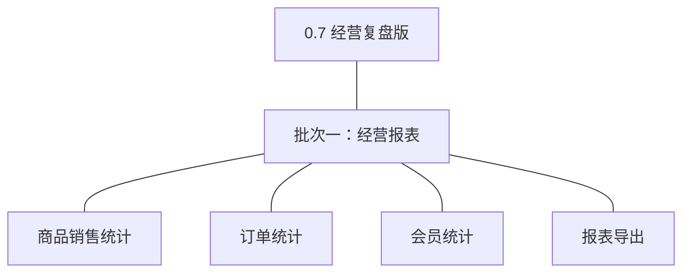
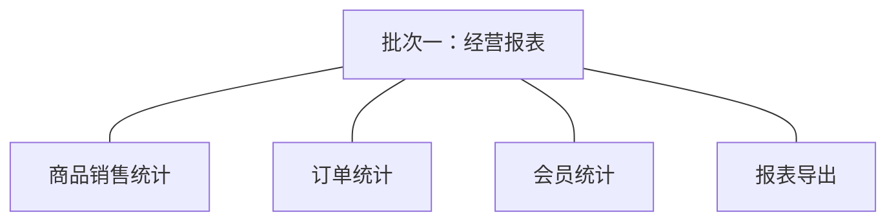

# 开发顺序与需求拆解（大版本）：0.7 经营复盘版

> 定位：0.7 经营复盘版（路线图收官版）PRD→开发批次＋功能级需求条目；本文即该大版本的完整需求清单，需求池据此直接入池、不另生成版本快照；上游为模拟案例材料，模拟性质予以保留。

## 1. 拆解说明

- **做什么**：把 0.7 PRD 的 4 项功能按依赖排成可独立验收的开发批次，每项功能转为一条可直接认领与验收的需求条目（R63 起，用途与验收标准逐字携带 PRD 原文）。
- **粒度口径**：条目与 PRD 4 章功能清单一一同构（一条＝一项功能，无归并无新增）；交互、字段级细化归小版本 PRD。
- **与需求池及小版本规划的关系**：本文是需求池的**主入口但不是唯一入口**——会议、沟通、临时反馈产生的需求可直接单条入池，不经本文；小版本规划的输入＝本文开发顺序＋需求池实时状态两者合并，**批次划分是建议而非锁定**，实际认领以需求池为准。

## 2. 开发顺序

**前置版本沿用面**：0.2~0.6 全部业务数据（订单／订单项／退货单／顾客账号／会员等级等业务表）、0.4 的订单收支台账、0.1~0.2 的权限能力点体系（报表菜单与导出能力点挂载）。

**顺序依据（单批交付，批次从简）**：三类统计互不依赖（各自为对业务表的只读派生查询，无跨功能事务）、导出依赖统计视图存在（先有查询结果方可导出）——四条构成一条可独立演示的完整复盘链路（三类查看→对账核对→导出留痕），无外部联调点、无同事务契约、无跨模块写协作；拆批则任何子集（如仅统计无导出、仅两类统计）均不构成更小的完整可验收形态，按「能合并成一批演示的不拆成两批」单批交付（判断注记）。**口径承接**：完成口径计销售、毛额净额双列与对账不变式、会员存量口径、K3 同库派生——均按 04C-报表与 0.7 PRD 概述落地，条目按此验收。

### 2.1 批次一：经营报表

- **目标**：经营复盘收口——三类统计报表上线、净额口径与台账对账一致、报表可导出留痕。
- **依赖**：0.6（会员等级数据就绪）、0.2~0.5 各业务表（派生取数）、0.4 台账（对账核对）；无本版内部前置、无外部联调点。
- **可验收形态**：管理者在报表页依次完成商品销售统计（毛额净额双列）、订单统计（量／状态／趋势）、会员统计（规模／等级／复购）的复盘查看，净额合计经对账不变式与台账一致，并成功导出一份报表（能力点校验、内容一致、留痕可查）——完成标志对应的一次完整复盘可演示。

条目与 PRD 4.1 节功能清单一一同构，用途与验收标准逐字引自原文：

| 编号 | 需求名 | 用途 | 验收标准 |
|---|---|---|---|
| R63 | 商品销售统计 | 商品／规格维度的销量与金额复盘 | 管理者或运营人员按商品或规格维度查询指定时间窗的销量与金额，报表以订单完成口径计销售并毛额与净额双列呈现，净额口径扣除退款完成部分 |
| R64 | 订单统计 | 订单量、状态分布与时间趋势复盘 | 管理者按时间查询订单量、状态分布与时间趋势，完成指标按完成时点计、过程指标按状态分布计，结果与业务单据可核对 |
| R65 | 会员统计 | 会员规模、等级分布与复购情况复盘 | 管理者或运营人员查询会员规模、等级分布与复购情况，统计以顾客账号存量为口径（注销账号计入历史累计不计当期存量），等级分布与会员等级归属数据一致 |
| R66 | 报表导出 | 统计结果文件化交付并留痕 | 管理者对任一统计报表发起导出，系统生成导出文件供下载且内容与当期查询结果一致，导出经能力点校验并留痕（操作者、时间、范围） |

**批次判断与边界取舍**：①单批交付——四条为一条复盘链路（三类查看→对账→导出），无依赖或外部联调强制拆批（判断注记）；②导出不单列——导出验收依赖统计视图与查询结果，单列无独立可验收形态（判断注记）；③三类统计同批——同类报表族，拆批仅为形式美观属过度拆分（判断注记）；④经营预测、多维自定义分析、实时大屏为明确不做（04C-报表），不占批次。

**版本级验收安排**：完成标志＝管理者在报表页完成一次覆盖商品／订单／会员三类的复盘查看并成功导出一份报表；验证假设＝报表进入经营决策回路（定性事件判定，上线后复盘）。无灰度台阶（纯管理端只读报表，无对外发布与资金方向）。

## 3. 条目与 PRD 对应核对

- **一一同构声明**：条目数＝PRD 功能数＝4（R63~R66），逐行对应、无归并无新增；无路径拆分条目。
- **批次构成**：批次一 4 条（报表模块经营统计组：统计 3、导出 1）。
- **◆ 清点**：无——四条均为报表查询与文件交付，无复杂机制条目（PRD 功能清单未标 ◆，与 04C-报表「无契约类写操作以外的独立复杂功能」一致）。
- **过渡支撑清点**：本版无过渡支撑（三类报表与导出均为永久性能力，0.4 台账查询延续使用不作替代）。

## 4. 与需求池和小版本规划的衔接

- **入池路径**：本文批次需求表由需求池运营提示词按「批量入池」逐行登记（编号沿用、批次随源继承，状态一律待规划）。
- **多入口口径**：本文是主入口但不是唯一入口——会议、沟通、临时反馈的需求直接单条入池，不经本文，两类条目并存互不覆盖。
- **小版本规划的合并输入**：规划＝本文开发顺序建议＋需求池实时状态；建议确认单个小版本（0.7.0 经营报表版认领 R63~R66 整批），无拆批认领约束（单批即全部）。
- **认领与细化原则**：认领后的小版本 PRD 做开发级细化（交互、字段、边界，含时间窗与周期切换、维度组合清单、导出文件格式与频控、对账差异容忍口径等版本级默认值落地），验收以随行验收标准为锚，不回溯改写本文。
