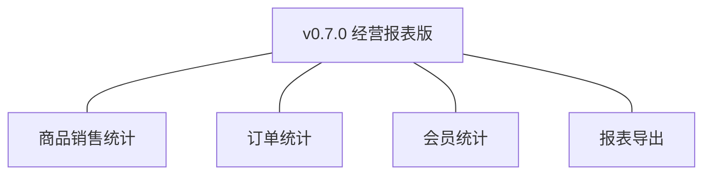
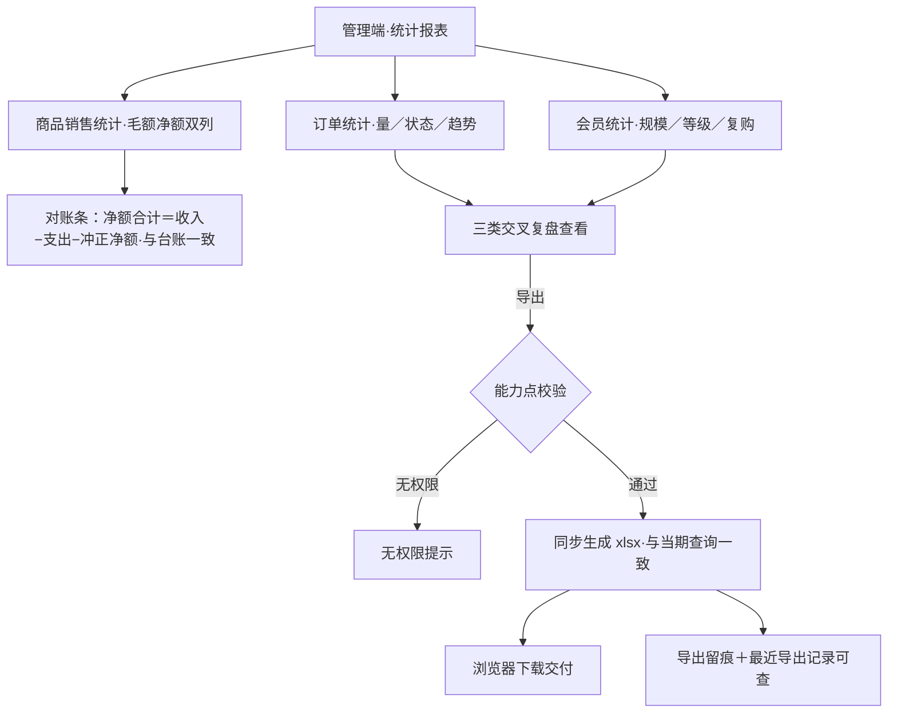
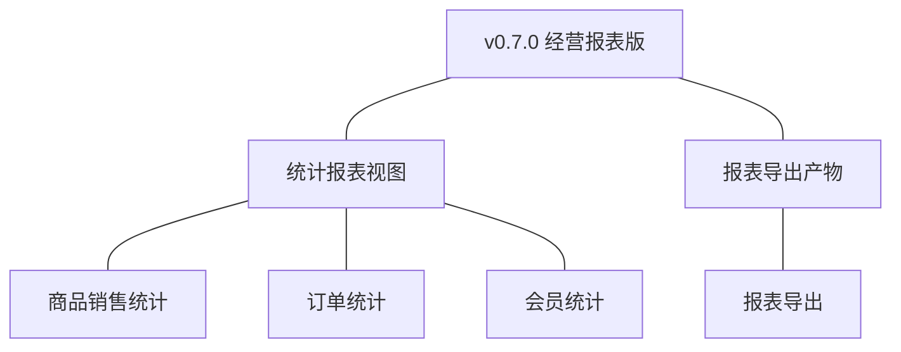
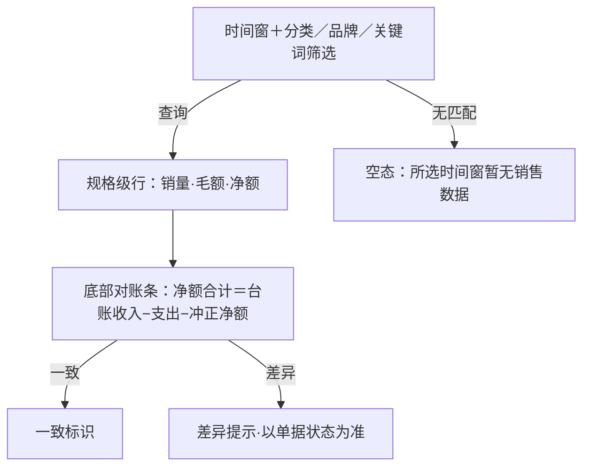
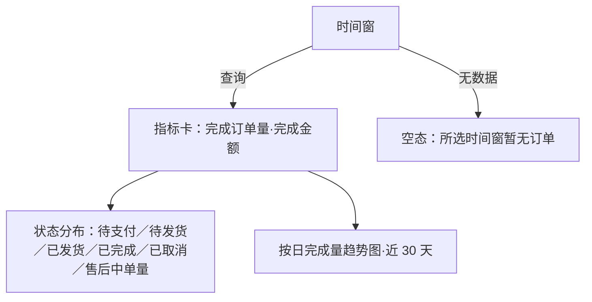
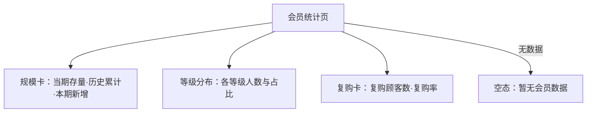
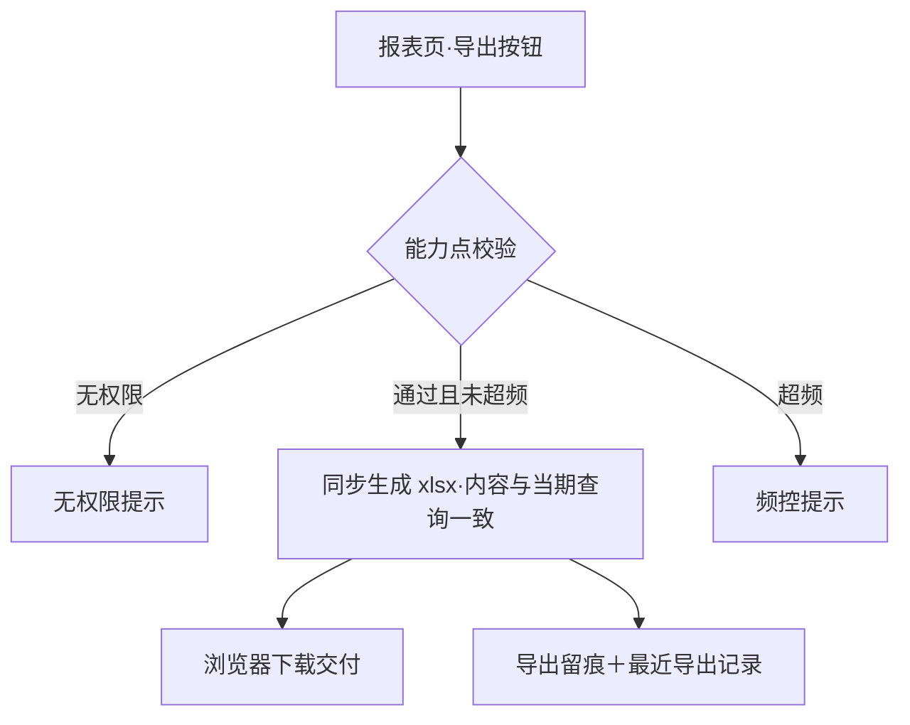

# PRD（小版本）：v0.7.0 经营报表版

> 定位：v0.7.0 的开发级需求说明书——承接 0.7 经营复盘版 PRD 与 02、认领自需求池（R63~R66，单批即全部）；上游为模拟案例材料，模拟性质予以保留。

## 1. 版本概述

**承接与目标**：认领 0.7 批次一「经营报表」全部条目（R63 商品销售统计、R64 订单统计、R65 会员统计、R66 报表导出），交付经营复盘收口——三类派生统计报表（完成口径计销售、毛额净额双列、会员存量口径）、净额对账核对与能力点控制的报表导出留痕；本版可验收形态＝管理者在报表页依次完成三类统计的复盘查看、净额合计经对账不变式与台账一致，并成功导出一份报表（内容一致、留痕可查）。

**范围外声明**：经营预测与自定义多维分析、实时监控大屏与推送提醒（04C-报表明确不做）；预聚合为实现优化不改变口径（不在验收面）；0.4 台账查询延续使用（本版不替代）；导出文件在系统外的二次分发不在管控范围。

**条目内顺序与依赖**：R63/R64/R65 三类统计互不依赖可并行；R66 导出依赖统计视图与查询结果（最后验收）；依赖 0.6（会员等级归属数据）、0.2~0.5 各业务表（派生取数）、0.4 台账（对账核对）。无外部联调点。

## 2. 需求范围与验收锚

| 编号 | 需求名 | 用途 | 验收标准 |
|---|---|---|---|
| R63 | 商品销售统计 | 商品／规格维度的销量与金额复盘 | 管理者或运营人员按商品或规格维度查询指定时间窗的销量与金额，报表以订单完成口径计销售并毛额与净额双列呈现，净额口径扣除退款完成部分 |
| R64 | 订单统计 | 订单量、状态分布与时间趋势复盘 | 管理者按时间查询订单量、状态分布与时间趋势，完成指标按完成时点计、过程指标按状态分布计，结果与业务单据可核对 |
| R65 | 会员统计 | 会员规模、等级分布与复购情况复盘 | 管理者或运营人员查询会员规模、等级分布与复购情况，统计以顾客账号存量为口径（注销账号计入历史累计不计当期存量），等级分布与会员等级归属数据一致 |
| R66 | 报表导出 | 统计结果文件化交付并留痕 | 管理者对任一统计报表发起导出，系统生成导出文件供下载且内容与当期查询结果一致，导出经能力点校验并留痕（操作者、时间、范围） |

锚定说明：上表需求名、用途、验收标准逐字引自 0.7 02 批次一需求表（其又逐字锚定 0.7 PRD 4.1 功能清单）；本文只细化不改写，验收以本表为锚。

## 3. 核心用户旅程

旅程承接说明：承接 0.7 PRD 3.1「经营复盘查看与导出」旅程（本版认领段＝全程：三类查看→对账核对→导出留痕）；三类统计查询为验收标准可覆盖的报表查询操作，不另成旅程（0.7 PRD 覆盖说明）。

### 3.1 经营复盘查看与导出（管理者，单端关键流程）

操作步骤清单：

1. 管理者进入管理端「统计报表」，设定时间窗（今日／近 7 天／近 30 天／自定义起止，默认当月）。
2. 商品销售统计页：按商品或规格（支持分类／品牌筛选）查看销量、毛额、净额双列，净额按倒序排列；页面底部对账条呈现净额合计与台账口径（收入−支出−冲正净额）一致。
3. 订单统计页：查看订单量指标卡、状态分布（六状态单量）与按日完成量趋势。
4. 会员统计页：查看会员规模（当期存量／历史累计）、等级分布（各等级人数与占比）、复购情况（复购顾客数与复购率）。
5. 对任一报表点「导出」：系统校验导出能力点，同步生成 xlsx 文件供下载，内容与当期查询结果一致；导出留痕（操作者、时间、范围），「最近导出记录」列表可查。

## 4. 功能需求

### 4.1 功能总览

**对象增删改查矩阵**：

| 对象 | 增 | 改 | 删 | 查 |
|---|---|---|---|---|
| 统计报表视图 | 不做（派生查询不落库，K3） | 不做（只读派生；预聚合为实现优化不改口径） | 不做 | R63／R64／R65（三类统计查询，带时间窗与维度筛选） |
| 报表导出产物 | R66（同步生成文件，存部署产物区） | 不做（一次性交付物） | 不做（文件生命周期归部署产物区管理） | R66（下载交付＋最近导出记录留痕查询） |
| 各业务表／台账 | 沿用 | 沿用 | 沿用 | 只读派生取数（订单／订单项／退货单／顾客账号／会员等级／订单收支记录）；不访问已逻辑删除档案（D6 推论） |

**主体使用面**：

| 主体 | 端 | 使用条目 |
|---|---|---|
| 管理者 | 管理端 | R63、R64、R65（三类查看＋对账核对）、R66（导出与留痕查询） |
| 运营人员 | 管理端 | R63、R65（查看侧——选品与活动复盘取数；无导出按钮） |
| 买家 | — | 无呈现面（纯管理端版本） |

### 4.2 R63 商品销售统计

**功能说明**：商品／规格维度的销量与金额复盘。触发：管理者或运营人员在管理端「统计报表→商品销售统计」设定时间窗与筛选并查询。

**交互与流程**：

操作步骤清单：

1. 设定时间窗（今日／近 7 天／近 30 天／自定义起止，默认当月——行业惯例默认，推断），可选商品分类、品牌、关键词筛选。
2. 列表按规格级行呈现（商品名＋规格名、销量、毛额、净额，金额元两位小数——先按分求和再换算，K10 推论），净额倒序、每页 20 条（行业惯例默认，推断）。
3. 页面底部对账条：净额合计与台账口径（收入−支出−冲正净额）比对，一致显示「与台账一致」；差异时提示「存在在途事实差异，核对以单据状态为准」（04C-报表 3.4 规则 12）。
4. 明细核对：任一规格行的销量可下钻查看构成（完成订单号列表，只读），支撑「与业务单据可核对」。

**字段与校验**：

| 信息项 | 必填 | 业务类型 | 落库字段名 | 约束与取值 |
|---|---|---|---|---|
| 时间窗 | 是 | 日期区间 | 取数于 `completed_at`／`refunded_at`（完成与退款完成时点） | 起止日期，不跨未来 |
| 分类／品牌筛选 | 否 | 维度筛选 | 沿用 `category_id`／`brand_id` | 既有分类与品牌 |
| 指标列 | — | 派生只读 | 按订单项 `quantity`／`subtotal_amount` 与退货事实派生 | 销量（件）、毛额／净额（元，两位小数） |

**规则与边界**：

1. 以订单完成口径计销售：仅统计已完成订单的订单项（完成时点落窗）；退款完成的订单在净额口径中扣除（对应退货单 `refunded_at` 落窗的退款金额冲减该商品净额——毛额＝完成口径合计、净额＝毛额−退款完成合计）。
2. 三类视图与台账同一时点同库取数，口径互不矛盾（K3 推论）；净额合计满足对账不变式。
3. 取数不访问已逻辑删除档案，历史统计以订单项快照字段取数（D6 推论）；已删除商品仍按快照计入其历史销量。
4. 报表查询为只读派生，不缓存业务事实（预聚合为实现优化，改口径无效）。

**异常与拦截**：

| # | 场景 | 系统行为（用户可见） |
|---|---|---|
| A1 | 时间窗起止倒置或跨未来 | 即时提示「请选择正确的时间范围」，不发起查询 |
| A2 | 所选时间窗无销售数据 | 空态「所选时间窗暂无销售数据」 |
| A3 | 无报表权限角色访问 | 「统计报表」菜单不可见（能力点控制，D4）；直接访问接口返回无权限 |

### 4.3 R64 订单统计

**功能说明**：订单量、状态分布与时间趋势复盘。触发：管理者在「统计报表→订单统计」设定时间窗并查询。

**交互与流程**：

操作步骤清单：

1. 设定时间窗（默认当月），查看完成指标卡（完成订单量、完成金额——按 `completed_at` 落窗计）。
2. 状态分布：六状态当前存量单量（待支付／待发货／已发货／已完成／已取消／售后中——术语表订单状态），各状态单量之和等于订单总量，与订单表可核对。
3. 时间趋势：按日完成订单量柱状趋势（近 30 天窗内按日聚合，行业惯例默认，推断）。
4. 任一状态单量可下钻查看订单号列表（只读），支撑与业务单据核对。

**字段与校验**：时间窗同 R63；完成指标取数于 `completed_at`，状态分布取数于 `status`，趋势按日聚合——均为既有登记字段的只读派生。

**规则与边界**：

1. 完成指标按完成时点计、过程指标按状态分布计（04C-报表 2 节口径要点）；状态名严格按术语表中文原文。
2. 与 R63 同库同时点取数，跨视图口径一致（K3 推论）。
3. 已取消订单计入状态分布与历史口径，不计完成指标。

**异常与拦截**：同 R63 的 A1（时间范围校验）、A2（空态「所选时间窗暂无订单」）、A3（无权限）；订单统计仅管理者可见（运营人员菜单不含本页，D4）。

### 4.4 R65 会员统计

**功能说明**：会员规模、等级分布与复购情况复盘。触发：管理者或运营人员在「统计报表→会员统计」查询。

**交互与流程**：

操作步骤清单：

1. 规模卡：当期存量（状态为正常／冻结的顾客数）、历史累计（含注销）、本期新增（时间窗内注册）。
2. 等级分布：各等级人数与占比，与 `member_level_id` 归属数据一致（0.6 重算结果）；注销账号计入历史累计不计当期存量（04C-报表 3.4 规则 6）。
3. 复购卡：统计期内完成订单 ≥2 的顾客数与复购率（复购顾客数÷当期下单顾客数，行业惯例默认，推断）。
4. 等级分布行可下钻查看该等级顾客列表入口（跳转顾客管理筛选，沿用 v0.6.0 检索）。

**字段与校验**：取数于 `cust_account.status`／`member_level_id`／订单完成事实（派生）——均为既有登记字段的只读派生。

**规则与边界**：

1. 存量口径：注销账号计入历史累计、不计当期存量；冻结账号计入当期存量（状态仍为存量账号）。
2. 等级分布与 0.6 归属重算结果一致（同一数据源）；复购口径为完成订单 ≥2。
3. 与 R63/R64 同库同时点取数（K3 推论）。

**异常与拦截**：空态「暂无会员数据」；无权限拦截同 R63-A3（管理者与运营人员可见）。

### 4.5 R66 报表导出

**功能说明**：统计结果文件化交付并留痕。触发：管理者在任一统计报表页点「导出」。

**交互与流程**：

操作步骤清单：

1. 管理者在任一统计报表页（当前筛选条件）点「导出」。
2. 系统校验导出能力点（`rpt:report:export`，仅管理者）与频控（每人每日 10 次——行业惯例默认，推断）。
3. 校验通过后同步生成 xlsx 文件（行业惯例默认，推断；数据量属中小规模不需异步任务），浏览器下载交付；文件内容与当期查询结果一致（同口径同筛选）。
4. 导出留痕（操作者、时间、范围＝报表类型＋时间窗＋筛选），页面「最近导出记录」列表可查（近 20 条，行业惯例默认，推断）。

**字段与校验**：

| 信息项 | 必填 | 业务类型 | 落库字段名 | 约束与取值 |
|---|---|---|---|---|
| 导出能力点 | 是 | 能力点编码 | `rpt:report:export`（v0.7.0 定名，仅管理者）；统计查看能力点 `rpt:report:view`（管理者、运营人员） | 沿用能力点编码契约 `<模块>:<对象>:<动作>` |
| 导出留痕 | 是 | 留痕记录 | 经既有操作留痕机制承载（操作者／动作／时间／范围），不新增业务对象表 | 范围＝报表类型＋时间窗＋筛选 |
| 导出文件 | 是 | 文件产物 | 存部署产物区，不落业务表（04C-报表 4） | xlsx；内容与当期查询一致 |

**规则与边界**：

1. 导出须具备对应角色能力点且动作留痕；导出文件内容与当期查询结果一致（规范）。
2. 导出为只读交付：不反向写任何业务数据；文件在系统外的二次分发不在管控范围（04C-报表 1）。
3. 频控超限拦截不产生留痕行；同一报表同条件重复导出各计一次并各自留痕。
4. 导出产物不作为业务对象建模——系统内仅保留留痕供审计（04C-报表 4）。

**异常与拦截**：

| # | 场景 | 系统行为（用户可见） |
|---|---|---|
| A1 | 无导出能力点（运营人员）点导出路径 | 导出按钮不可见（能力点控制，D4）；直接访问接口提示「无导出权限」 |
| A2 | 当日导出超 10 次 | 提示「今日导出次数已达上限（10 次／天），请明日再试」 |
| A3 | 生成失败（系统异常） | 提示「导出失败，请稍后重试」，不留痕、不占频控次数 |

## 5. 业务对象与数据字段

**数据主体清单**：

| 业务对象 | 落库名 | 定位与关系 |
|---|---|---|
| 统计报表视图 | 无落库表（派生查询视图，K3） | 商品销售／订单／会员三类统计的实时派生；预聚合为实现优化 |
| 报表导出产物 | 文件存部署产物区，无业务表 | 一次性交付物；系统内仅留痕（经既有操作留痕机制），不建模为业务对象（04C-报表 4） |
| 各业务表 | `trade_order`／`trade_order_item`／`trade_return`／`cust_account`／`cust_member_level`／`rpt_order_finance`（全部沿用） | 只读派生取数；不访问已逻辑删除档案，历史以快照字段取数（D6 推论） |

本版零新增业务对象与落库表；全部指标为对既有登记表的只读派生（落库字段名逐字沿用术语表既有登记）。列类型、索引（含预聚合表如启用）归开发阶段。

## 6. 待议与建议

**本版采用的推断与默认值汇总**：

| 采用值 | 来源状态 |
|---|---|
| 时间窗四档（今日／近 7 天／近 30 天／自定义，默认当月）；列表每页 20 条；趋势近 30 天按日聚合 | 行业惯例默认（推断） |
| 导出格式 xlsx、同步生成、频控 10 次／人／天、最近导出记录近 20 条 | 行业惯例默认（推断；中小数据量不需异步） |
| 复购口径＝统计期内完成订单 ≥2 的顾客占比 | 行业惯例默认（推断） |
| 对账差异以单据状态为准、不以报表时点强平 | 04C-报表 3.4 规则 12 承接（在途事实容忍口径） |
| 能力点 `rpt:report:view`／`rpt:report:export` | 沿用能力点编码契约的版本级定名 |

**待确认内容与影响**：报表周期切换（周／季）与更多维度组合待使用反馈后并入后续迭代（不影响验收锚）。

**建议回池的新想法**：无。

**术语表待登记行（随本文回报，由主流程合入）**：

- 第 3 节对象行：无新增对象（统计视图派生不落库、导出产物不建模——均按 04C-报表 4 节）。
- 编码契约新增「v0.7.0 报表域能力点」行：能力点编码取值 `rpt:report:view`（三类统计查看，管理者／运营人员）、`rpt:report:export`（报表导出，仅管理者）（v0.7.0 定名，2 个新取值；零新增表与字段）。
