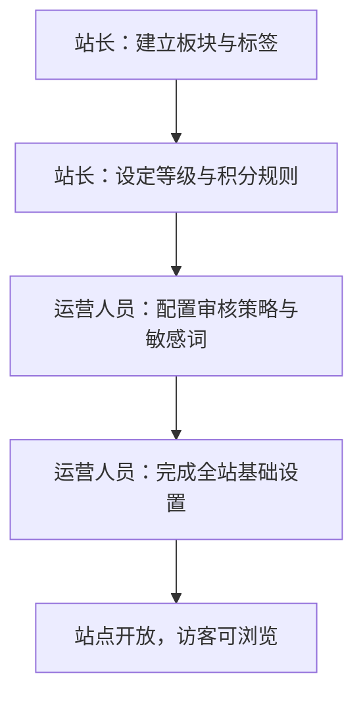
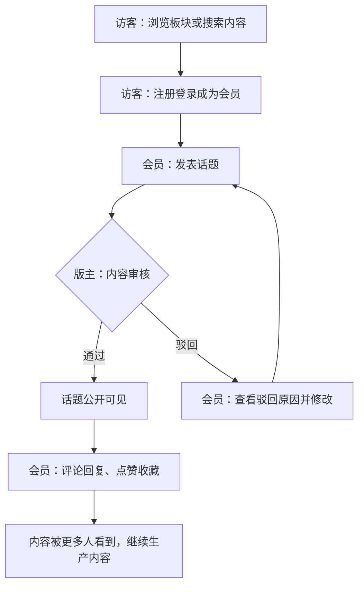
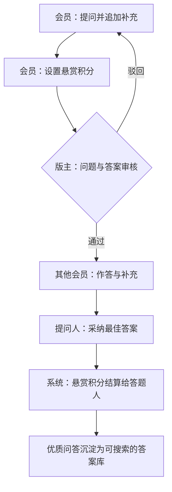
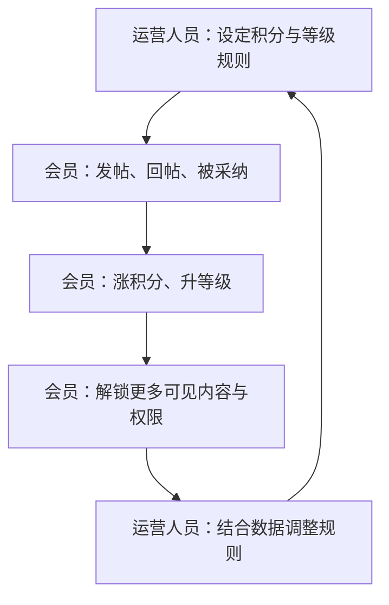
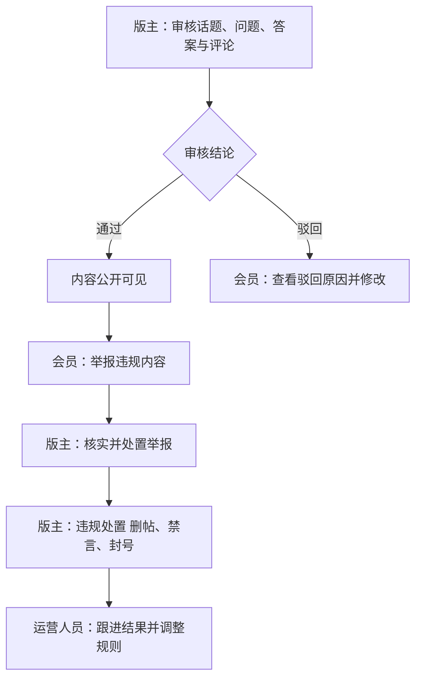

# 项目概念：巡云轻论坛

> 文档用途与决策状态：本文档从模拟案例的原始想法中提炼概念级产品定义，帮助读者理解项目做什么、由谁参与、怎样运转；上游为模拟案例材料，模拟性质予以保留。文中信息状态以"已确认／建议默认／推断／待议／期望"就地标注，未标注的关键分叉见第 1 节说明。

## 1. 项目是什么

**概念摘要（可独立转述）**：我们要做一个自建自营的社区论坛，把「论坛讨论」和「悬赏问答」放在同一个站里——日常话题、经验交流在论坛里聊，遇到卡住的具体问题就发悬赏问答，谁答得好谁拿悬赏。访客与会员在电脑端网页和手机端网页上浏览、搜索、发帖、提问、作答，并靠积分与等级积累身份；站长与运营人员在管理后台维护板块与规则、管理会员与内容、运营激励规则；版主在管理后台审核内容、处置举报与违规。站点自建自营，账号、内容、数据都在自己手里，不依赖第三方平台；本期不做原生 App 与小程序，不做真实资金交易（在线支付、现金悬赏、红包、会员卡、平台分成），不做 AI 问答助手、直播、短视频等扩展玩法（以上范围均为已确认）。

**采用的方向与状态（关键分叉说明）**：输入要求"谁答得好谁拿悬赏"，但未说明悬赏以什么结算。本文按"悬赏以积分结算，现金悬赏与平台分成后续再议"的草案方向展开（建议默认）；该选择不改变问答闭环本身，只影响悬赏媒介，若后续确认引入真实资金，需同步调整范围与外部服务开通。

**本质范围**：产品由三类页面构成——面向访客与会员的电脑端网页、手机端网页（同一站点自适应，前台内容可被搜索引擎收录），以及面向经营方与版主的管理后台；业务覆盖"开站准备 → 注册成长 → 讨论发帖 → 悬赏问答 → 内容治理 → 数据复盘"的完整运营闭环。技术选型、详细功能规格与排期不在本文范围，分别留给下游技术文档与 PRD、路线图。

## 2. 为什么要做

**社区成员方面的困境（已确认）**：

- **讨论留不住、搜不到**：话题散落在聊天群里，刷过去就没了，想找以前的讨论没有地方可翻、可搜。
- **提问没人认真答**：遇到具体问题发问，常常只有零散回应甚至没人理；会答的人得不到回报，答题动力很快耗尽。
- **好内容无法沉淀**：有价值的问答随聊天流走掉，不能变成后来人能搜到、能复用的答案。

**站点经营方方面的困境（已确认）**：

- **缺治理抓手**：内容质量参差，靠人工盯不过来，缺少审核、举报与违规处置的固定通道。
- **新人来了留不住**：缺少成长与激励，用户来一次就走，没有积分、等级、身份这类可积累的东西。
- **经营情况看不清**：内容与互动有多少、谁在活跃，没有统一的地方可看，运营动作只能凭感觉。

**解决思路**：把讨论与问答放进一个自建自营的站里——成员侧一个站点完成注册、发帖、提问、作答、点赞收藏与私信往来；经营侧一个管理后台完成板块与规则设置、会员与内容管理、审核与治理；再用统一的积分与等级把成员行为与可见权限连起来，用浏览量等数据反馈运营决策，形成"内容生产 → 互动沉淀 → 治理保障 → 激励留存"的闭环。

## 3. 参与主体与角色

**主体划分**：本项目按商业角色定位划分出两类主体。

| 主体 | 定位 | 所属端 | 包含角色 |
|---|---|---|---|
| 用户主体（社区成员） | 产品最终服务的使用方：在站内浏览、搜索、发帖、提问与作答的人群 | 电脑端网页 / 手机端网页 | 访客、会员 |
| 经营主体（站点经营方） | 对站点经营结果负责的自营方："我们"——承担经营决策、组织分工与人员账号安排，其内部团队执行日常业务与内容治理 | 管理后台 | 站长、运营人员、版主 |

**裁决说明**：输入中的"站长与运营人员""版主与内容管理员"同属自营方内部团队，前者负责拉人、定规则、管内容，后者负责审核与治理，均按主体定位归入经营主体一体承担，不另设中台主体（不按模板补造主体）；本项目为自建自营的单一站点，不设平台主体（已确认）。输入中"愿意长期答题、靠积分和声望积累身份的老手"是会员中的活跃画像（推断），不单设角色。

**各角色的主要责任与使用场景**：

- **访客**（用户主体）：未注册的浏览者——进站看板块与内容、搜索话题与答案；需要发帖、提问、作答、点赞收藏或私信时先注册登录（推断：浏览不需要先注册，参与互动需要）。
- **会员**（用户主体）：在站内注册后的成员——维护资料与头像；发话题、评论回复、点赞收藏；提问并追加补充、作答与补充、采纳最佳答案；靠发帖、回帖、被采纳积累积分与等级，解锁更多可见内容与权限；通过私信、通知提醒与关注粉丝与他人往来。一人一个会员身份。
- **站长**（经营主体）：经营的组织与决策者——管理端账号与角色授权（人员开通、调整、停用），设定板块与标签、等级与积分规则、审核策略与敏感词等全站设置，查看浏览量等数据复盘站点运转。
- **运营人员**（经营主体）：站点日常业务的执行者——维护板块、标签与运营内容，查询与维护会员与内容，受理与跟进举报，运营积分与等级等激励规则。
- **版主**（经营主体）：内容治理的执行者——对话题、问题、答案与评论执行审核（先审后发），处置举报，对违规内容与账号做出处置（删帖、禁言、封号）。常见于小团队，版主可兼任运营人员（推断：输入按"版主与内容管理员"并列表述，按一人可多角色处理）。

## 4. 做成以后有什么用

- **访客**（相较现状）：打开站点就能按板块逛内容、按关键词搜到以前的讨论与答案（解决"搜不到"），不必再在聊天记录里翻找（期望）。
- **会员**：写的帖子、答的问题留得下来并被更多人看到（解决"留不住"）；认真答题能拿到悬赏、涨积分、升等级（解决"没回报"）；优质问答沉淀为可搜索的答案库，后来人直接受益（期望）。
- **站长**：账号权限、板块规则与全站设置集中可控，站点运转有数据可看（解决"缺治理抓手"与"看不清"）。
- **运营人员**：板块、内容与会员在一处维护，举报与审核有固定通道（解决"人工盯不过来"）；积分与等级规则可运营，用来拉新与留存（解决"新人留不住"）。
- **版主**：审核与处置在管理后台按统一标准执行，处理有入口、有结果（解决"缺治理抓手"）。

## 5. 各主体与角色需要哪些能力

**用户主体·访客（电脑端网页 / 手机端网页）**：

| 能力组 | 能力 | 用途 |
|---|---|---|
| 浏览与搜索 | 板块与内容浏览 | 按板块逛话题与问答，查看列表与详情 |
| | 站内搜索 | 按关键词快速找到话题、问题与答案 |
| 账号入口 | 注册登录 | 注册成为会员后发帖、提问、作答与互动 |

**用户主体·会员（电脑端网页 / 手机端网页）**：

| 能力组 | 能力 | 用途 |
|---|---|---|
| 账号与个人 | 注册登录与资料维护 | 建立会员身份，维护资料与头像 |
| | 私信与通知提醒 | 与其他会员往来，收到互动与审核结果提醒 |
| | 关注与粉丝 | 关注感兴趣的会员，积累自己的粉丝 |
| 论坛讨论 | 发话题与编辑 | 在板块内发表话题并维护自己的内容 |
| | 评论回复 | 在话题下参与讨论 |
| | 点赞收藏 | 标记喜欢的内容，沉淀自己的收藏夹 |
| | 可见权限控制 | 按等级、积分、回复可见等条件开放自己的内容 |
| 悬赏问答 | 提问与追加 | 发表问题，必要时追加补充条件 |
| | 作答与回复 | 对问题作答、补充与回复 |
| | 悬赏与采纳 | 设置悬赏，采纳最佳答案并完成结算 |
| 成长 | 积分与等级 | 靠发帖、回帖、被采纳积累积分并升级 |
| | 权限解锁 | 用等级与积分换取更多可见内容与权限 |

**经营主体·站长（管理后台）**：

| 能力组 | 能力 | 用途 |
|---|---|---|
| 组织与权限 | 管理端账号与角色授权 | 为团队开通账号、分配角色、停用账号 |
| 规则与设置 | 板块与标签设定 | 规划站点结构，确定内容的去处 |
| | 等级与积分规则 | 设定成长与激励的计分口径 |
| | 审核策略与敏感词 | 决定先审后发的范围与拦截词表 |
| | 全站设置 | 集中维护站点级参数与开关 |
| 经营复盘 | 浏览量等数据查看 | 复盘内容与互动情况，指导运营 |

**经营主体·运营人员（管理后台）**：

| 能力组 | 能力 | 用途 |
|---|---|---|
| 板块与内容运营 | 板块与标签维护 | 保持站点结构随运营需要调整 |
| | 运营内容维护 | 组织推荐与引导性内容 |
| 会员与内容管理 | 会员查询与维护 | 查看会员情况，支撑拉新与留存 |
| | 内容查询与维护 | 检索并维护话题、问题与答案 |
| 治理执行 | 举报受理与跟进 | 接住成员举报，跟踪处理结果 |
| 激励运营 | 积分与等级规则运营 | 调整激励口径，驱动内容生产 |

**经营主体·版主（管理后台）**：

| 能力组 | 能力 | 用途 |
|---|---|---|
| 内容审核 | 话题、问题、答案与评论审核 | 先审后发，保证公开内容质量 |
| | 驳回与说明 | 驳回不合格内容并说明原因 |
| 违规处置 | 举报处置 | 核实并处理成员举报 |
| | 违规处置 | 对违规内容与账号执行删帖、禁言、封号 |

## 6. 各主体与角色怎样开展工作

**主线一：开站准备（站长与运营人员，开站之前）**。站长先规划站点结构，建立板块与标签，再设定等级与积分规则，明确成员成长的计分口径；运营人员配置审核策略与敏感词，决定哪些内容需要先审后发，最后完成全站基础设置，站点对外开放。

**主线二：讨论闭环（会员为主，内容生产主线）**。访客按板块逛内容或直接搜索，注册登录成为会员后发表话题；话题经版主审核通过后公开可见，其他会员在话题下评论回复、点赞收藏，内容被更多人看到，作者继续生产内容。

**主线三：悬赏问答闭环（提问会员与答题会员协作，经营核心闭环）**。会员把卡住的问题发出来，设置悬赏积分并追加补充条件；问题与答案经版主审核通过后，其他会员作答与补充，提问人从回答中采纳最佳答案，悬赏积分结算给答题人，优质问答沉淀为可搜索的答案库。

**主线四：会员成长与激励（运营人员策划、会员参与）**。运营人员按站点需要设定积分与等级规则，会员在发帖、回帖、被采纳的过程中涨积分、升等级，解锁更多可见内容与权限；运营人员结合浏览量等数据调整规则，让激励持续有效。

**主线五：内容治理（版主执行，运营与站长兜底）**。话题、问题、答案与评论先审后发：通过的公开可见，驳回的回到会员处修改；公开内容接受成员举报，版主核实处置，对违规内容与账号执行删帖、禁言、封号，运营人员跟进结果并调整规则。

---

## 讨论备忘

- **项目名称**：「巡云轻论坛」沿用示范项目给定名称（已确认来源），正式定名待议，定名后全文替换。
- **悬赏媒介**：输入只说"谁答得好谁拿悬赏"，本文按"悬赏以积分结算、现金悬赏后续再议"处理（建议默认）；该决定同时决定支付相关能力是否进入范围。
- **会员注册登录方式**：本文按站内账号密码注册登录处理（建议默认，待业务确认）；第三方登录未在输入中出现，不纳入。
- **私信形态**：输入将"私信与通知提醒"列为必备，本文按站内私信与通知处理（已确认）；独立即时会话不在输入中，不纳入（待议）。
- **搜索引擎收录**：输入将"前台内容可被搜索引擎收录"作为端偏好提出（已确认），具体实现方式留给技术文档。
- **会员等级与积分规则细节**：输入只要求等级与积分存在并可运营，具体档位、计分与权限对应关系留给 PRD 细化（建议默认）。
- **未纳入的想法**：原生 App、小程序、真实资金交易（在线支付、现金悬赏、红包、会员卡、平台分成）、AI 问答助手、直播、短视频均为输入明确不做项（已确认），不自动成为后续承诺。
