# 产品需求文档（PRD）：巡云轻论坛

> 定位与决策状态：本文是项目级产品需求总纲，用于立项汇报与整体讲解——读者读完能复述这个产品为什么做、给谁用、由什么组成、业务怎么跑通、关键为什么这样定；功能的详细规则、界面交互、数据字段与指标口径由大版本与小版本文档逐步细化，本文不预写。上游为模拟案例材料，模拟性质予以保留；文中信息状态以"已确认／建议默认／推断／待议／期望"就地标注，推断与建议默认汇总于文末备忘。

## 1. 产品概述

### 1.1 背景与目标

**现状问题（已确认）**：讨论散落在聊天群里，刷过去就没了，想找以前的讨论没有地方可翻、可搜；遇到具体问题发问常常只有零散回应，会答的人得不到回报；内容质量参差，经营方缺少审核、举报与违规处置的固定通道；新人来了留不住，缺少积分、等级、身份这类可积累的东西；内容与互动有多少、谁在活跃，没有统一的地方可看。

**产品目标**：做一个自建自营的社区论坛，把「论坛讨论」和「悬赏问答」放进同一个站——日常话题在论坛里聊，卡住的具体问题发悬赏问答，谁答得好谁拿悬赏；账号、内容、数据由经营方自己掌握，不依赖第三方平台。用统一的积分与等级把成员行为与可见权限连起来，用审核、举报与违规处置保证公开内容质量，用浏览量等数据支撑运营调整，让内容生产、互动沉淀、治理保障与激励留存互相带动。

**成功标准（建议默认，定性表达）**：成员能完整走通"注册 → 发帖 → 互动 → 提问 → 作答 → 采纳"的路径；站内内容可被搜索到并被后来人复用；审核、举报与违规处置可执行、有结果；经营方能看到内容与互动的基本情况并据此调整规则。量化口径留版本级文档定义。

### 1.2 产品定位与形态

**一句话定义**：面向社区成员的论坛与悬赏问答站点，由本社区经营方自建自营、自主治理，成员在其中沉淀讨论与问答，经营方在其中掌握内容与数据（已确认）。

**商业模式与形态**：自建自营的单一站点，不接入多主体经营，不设平台抽成（已确认）；账号、内容、数据留存于站点自身，不依赖第三方平台（已确认）。

**端构成与职责**：

| 端 | 使用者 | 职责 |
|---|---|---|
| 电脑端网页 | 访客、会员 | 浏览、搜索、发帖、提问、作答与互动的主阵地 |
| 手机端网页 | 访客、会员 | 与电脑端同一站点自适应，随时浏览与参与 |
| 管理后台 | 站长、运营人员、版主 | 站点规则与结构设置、会员与内容管理、审核与治理、数据查看 |

电脑端网页与手机端网页为同一站点的自适应形态，前台内容可被搜索引擎收录（已确认）；管理后台独立于前台，仅经营方与版主使用（已确认）。

## 2. 参与主体与角色

**主体划分（承接概念文档）**：

| 主体 | 所属端 | 定位 | 包含角色 |
|---|---|---|---|
| 用户主体（社区成员） | 电脑端网页 / 手机端网页 | 产品最终服务的使用方：在站内浏览、搜索、发帖、提问与作答的人群 | 访客、会员 |
| 经营主体（站点经营方） | 管理后台 | 对站点经营结果负责的自营方："我们"——承担经营决策、组织分工与人员账号安排，其内部团队执行日常业务与内容治理 | 站长、运营人员、版主 |

**各角色的特征与典型场景**：

- **访客**：未注册的浏览者，进站按板块逛内容、按关键词搜索话题与答案；在需要发帖、提问、作答、点赞收藏或私信时被引导注册登录（推断：浏览不需要先注册，参与互动需要）。
- **会员**：站点的内容生产者与消费者，同时在"讨论"和"问答"两条线上活动——既发话题、评论回复，也提问、作答、采纳最佳答案；靠积分与等级积累身份，用私信、通知提醒、关注与粉丝与他人往来（已确认）。
- **站长**：经营的组织与决策者，掌握管理端账号与角色授权、板块与标签结构、等级与积分规则、审核策略与敏感词、全站设置，并通过数据复盘站点运转（已确认）。
- **运营人员**：站点日常业务的执行者，负责板块、标签与运营内容的维护，会员与内容的查询维护，举报的受理与跟进，积分与等级规则的运营（已确认）。
- **版主**：内容治理的执行者，对话题、问题、答案与评论执行先审后发的审核，处置举报，对违规内容与账号执行删帖、禁言、封号（已确认）。

**共性的工作方式**：经营方内部常见于小团队，一人可持多个角色，版主可兼任运营人员（推断：输入按"站长与运营人员""版主与内容管理员"并列表述，按一人可多角色处理）；访客注册后即成为会员，会员不因积累等级或声望而改变身份类别（已确认，等级只影响权限与展示，不派生新角色）。

## 3. 功能全景

**用户主体·访客（电脑端网页 / 手机端网页）**：

| 能力组 | 能力 | 用途 |
|---|---|---|
| 浏览与搜索 | 板块与内容浏览 | 按板块逛话题与问答，查看列表与详情 |
| | 站内搜索 | 按关键词快速找到话题、问题与答案 |
| 账号入口 | 注册登录 | 注册成为会员后发帖、提问、作答与互动 |

**用户主体·会员（电脑端网页 / 手机端网页）**：

| 能力组 | 能力 | 用途 |
|---|---|---|
| 个人中心（自助管理） | 身份资料与头像维护 | 维护自己的对外形象与基本资料 |
| | 登录凭据维护 | 修改自己的登录密码等凭据 |
| | 我的内容 | 集中查看与管理自己发表的话题、评论、问题与答案 |
| | 我的收藏 | 查看自己收藏的内容，形成个人的资料夹 |
| | 我的关注与粉丝 | 管理关注关系，查看谁关注了自己 |
| | 我的私信与通知提醒 | 查看站内往来消息与互动、审核结果提醒 |
| | 我的积分与等级 | 查看积分余额、积分变化与当前等级 |
| | 退出登录与注销 | 结束本次登录，或注销自己的会员账号 |
| 论坛讨论 | 发话题与编辑 | 在板块内发表话题并维护自己的内容 |
| | 评论回复 | 在话题下参与讨论 |
| | 点赞与收藏 | 标记喜欢的内容，沉淀自己的收藏 |
| | 可见权限控制 | 按等级、积分、回复可见等条件开放自己的内容 |
| 悬赏问答 | 提问与追加 | 发表问题，必要时追加补充条件 |
| | 作答与回复 | 对问题作答、补充与回复 |
| | 悬赏与采纳 | 设置悬赏，采纳最佳答案并完成结算 |
| 成长 | 积分与等级 | 靠发帖、回帖、被采纳积累积分并升级 |
| | 权益解锁 | 用等级与积分换取更多可见内容与权限 |

**经营主体·站长（管理后台）**：

| 能力组 | 能力 | 用途 |
|---|---|---|
| 个人设置与账号权限 | 个人设置 | 维护自身账号资料与凭据重置 |
| | 管理端账号管理 | 为团队人员开通账号、停用账号 |
| | 管理端角色授权 | 定义角色并分配，控制各角色能做什么 |
| 结构与规则设置 | 板块与标签设定 | 规划站点结构，确定内容的去处与归类 |
| | 等级与积分规则 | 设定成长与激励的计分口径 |
| | 审核策略与敏感词 | 决定先审后发的范围与需拦截的词表 |
| | 全站设置 | 集中维护站点级参数与开关 |
| 经营复盘 | 浏览量等数据查看 | 复盘内容与互动情况，指导运营 |

**经营主体·运营人员（管理后台）**：

| 能力组 | 能力 | 用途 |
|---|---|---|
| 个人设置 | 个人设置 | 维护自身账号资料与凭据重置 |
| 板块与内容运营 | 板块与标签维护 | 保持站点结构随运营需要调整 |
| | 运营内容维护 | 组织推荐与引导性内容 |
| 会员与内容管理 | 会员查询与维护 | 查看会员情况，支撑拉新与留存 |
| | 内容查询与维护 | 检索并维护话题、问题与答案 |
| 治理执行 | 举报受理与跟进 | 接住成员举报，跟踪处理结果 |
| 激励运营 | 积分与等级规则运营 | 调整激励口径，驱动内容生产 |

**经营主体·版主（管理后台）**：

| 能力组 | 能力 | 用途 |
|---|---|---|
| 个人设置 | 个人设置 | 维护自身账号资料与凭据重置 |
| 内容审核 | 内容审核 | 对话题、问题、答案与评论先审后发 |
| | 驳回与说明 | 驳回不合格内容并说明原因 |
| 违规处置 | 举报处置 | 核实并处理成员举报 |
| | 违规处置 | 对违规内容与账号执行删帖、禁言、封号 |

**自助管理面说明**：外部使用者（会员）的自助管理面为个人中心，覆盖身份资料、登录凭据、自身内容与业务记录。内部使用者（站长、运营人员、版主）的自助管理面为个人设置，人员开通、角色授权与停用集中在站长的账号权限能力组；访客未注册、无账号，自助管理面在注册后由会员个人中心承担（推断）。

## 4. 核心业务闭环

**闭环总览**：五条闭环互相咬合——开站准备定下结构与规则，讨论发帖与悬赏问答是内容生产的两条主线，会员成长把行为沉淀为身份与权限，内容治理保证公开内容质量并反哺规则调整。

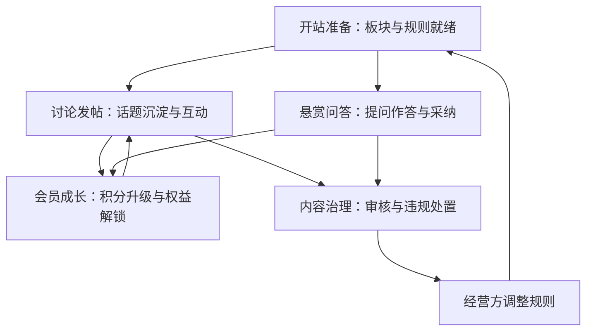
```mermaid
flowchart TD
    A[开站准备：板块与规则就绪] --> B[讨论发帖：话题沉淀与互动]
    A --> C[悬赏问答：提问作答与采纳]
    B --> D[会员成长：积分升级与权益解锁]
    C --> D
    B --> E[内容治理：审核与违规处置]
    C --> E
    E --> F[经营方调整规则]
    F --> A
    D --> B
```

**闭环一：开站准备（站长与运营人员，开站之前）**。站长先规划站点结构、建立板块与标签，再设定等级与积分规则，明确成员成长的计分口径；运营人员配置审核策略与敏感词，决定哪些内容需要先审后发，并完成全站基础设置，站点随后对外开放。闭环结束于站点开放，此后结构与规则随运营复盘持续微调。

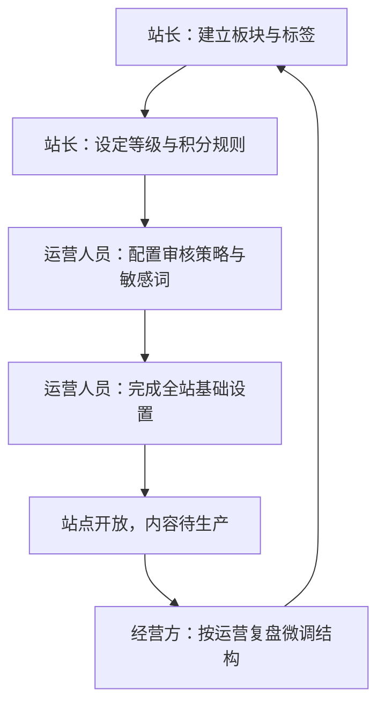
```mermaid
flowchart TD
    A[站长：建立板块与标签] --> B[站长：设定等级与积分规则]
    B --> C[运营人员：配置审核策略与敏感词]
    C --> D[运营人员：完成全站基础设置]
    D --> E[站点开放，内容待生产]
    E --> F[经营方：按运营复盘微调结构]
    F --> A
```

**闭环二：讨论发帖（会员发起、版主审核，内容生产主线）**。会员在板块内发表话题或继续编辑自己的话题，提交后进入审核；版主审核通过后话题公开可见，其他会员评论回复、点赞收藏，作者收到互动提醒并可继续维护自己的内容。若被驳回，会员可看到原因并修改后重新提交；话题按可见权限设置对不同会员开放。

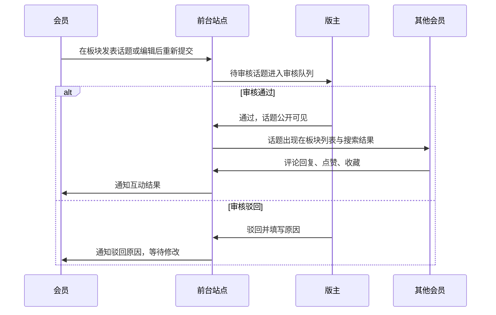
```mermaid
sequenceDiagram
    participant 会员
    participant 前台站点
    participant 版主
    participant 其他会员
    会员->>前台站点: 在板块发表话题或编辑后重新提交
    前台站点->>版主: 待审核话题进入审核队列
    alt 审核通过
        版主->>前台站点: 通过，话题公开可见
        前台站点->>其他会员: 话题出现在板块列表与搜索结果
        其他会员->>前台站点: 评论回复、点赞、收藏
        前台站点->>会员: 通知互动结果
    else 审核驳回
        版主->>前台站点: 驳回并填写原因
        前台站点->>会员: 通知驳回原因，等待修改
    end
```

**闭环三：悬赏问答（提问会员与答题会员协作，经营核心闭环）**。会员把卡住的问题发出来并设置悬赏积分、追加补充条件；问题与答案经版主审核通过后，其他会员作答与补充，提问人从回答中采纳最佳答案，悬赏积分结算给答题人，问答沉淀为可搜索的答案库。若悬赏到期无人被采纳，按规则退回提问人（建议默认，规则数值留版本级）。

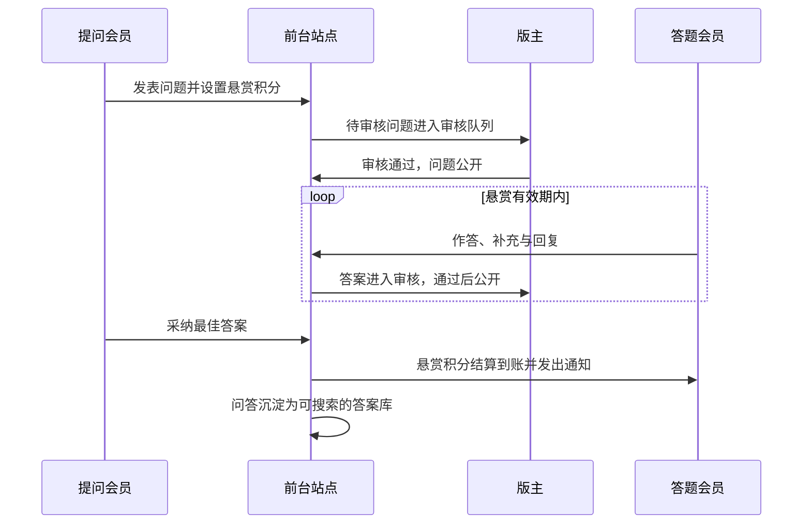
```mermaid
sequenceDiagram
    participant 提问会员
    participant 前台站点
    participant 版主
    participant 答题会员
    提问会员->>前台站点: 发表问题并设置悬赏积分
    前台站点->>版主: 待审核问题进入审核队列
    版主->>前台站点: 审核通过，问题公开
    loop 悬赏有效期内
        答题会员->>前台站点: 作答、补充与回复
        前台站点->>版主: 答案进入审核，通过后公开
    end
    提问会员->>前台站点: 采纳最佳答案
    前台站点->>答题会员: 悬赏积分结算到账并发出通知
    前台站点->>前台站点: 问答沉淀为可搜索的答案库
```

**闭环四：会员成长（运营人员策划、会员参与，循环型闭环）**。运营人员按站点需要设定积分与等级规则，会员在发帖、回帖、被采纳的过程中获得积分、逐级上升，等级与积分带来更多可见内容与权限；运营人员结合浏览量等数据调整规则，让激励持续有效。

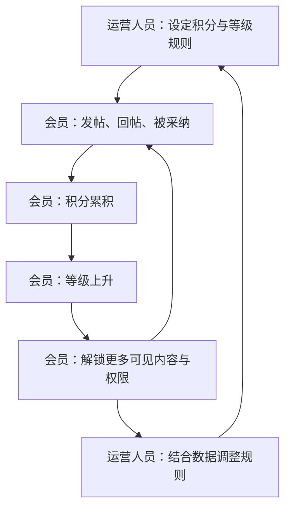
```mermaid
flowchart TD
    A[运营人员：设定积分与等级规则] --> B[会员：发帖、回帖、被采纳]
    B --> C[会员：积分累积]
    C --> D[会员：等级上升]
    D --> E[会员：解锁更多可见内容与权限]
    E --> B
    E --> F[运营人员：结合数据调整规则]
    F --> A
```

**闭环五：内容治理（版主执行，运营与站长兜底）**。话题、问题、答案与评论先审后发；公开内容接受会员举报，版主核实后处置，对违规内容与账号执行删帖、禁言、封号，运营人员跟进结果并调整规则。举报处置与违规处置的结论通知被处置一方，保证处理有入口、有结果。

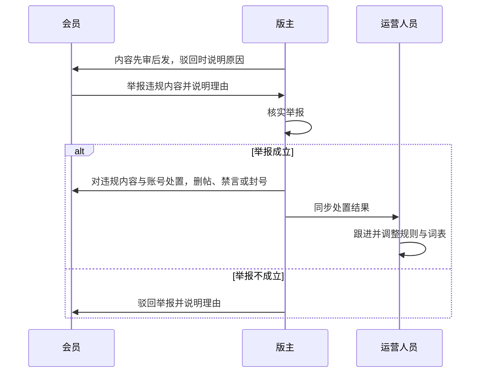
```mermaid
sequenceDiagram
    participant 会员
    participant 版主
    participant 运营人员
    版主->>会员: 内容先审后发，驳回时说明原因
    会员->>版主: 举报违规内容并说明理由
    版主->>版主: 核实举报
    alt 举报成立
        版主->>会员: 对违规内容与账号处置，删帖、禁言或封号
        版主->>运营人员: 同步处置结果
        运营人员->>运营人员: 跟进并调整规则与词表
    else 举报不成立
        版主->>会员: 驳回举报并说明理由
    end
```

## 5. 核心业务对象

**对象关系总览**：站点以板块组织内容，话题与问题分属讨论与问答两条线；会员账号是全部成员行为的起点，积分账户与会员等级承载成长，互动与治理对象围绕内容产生。

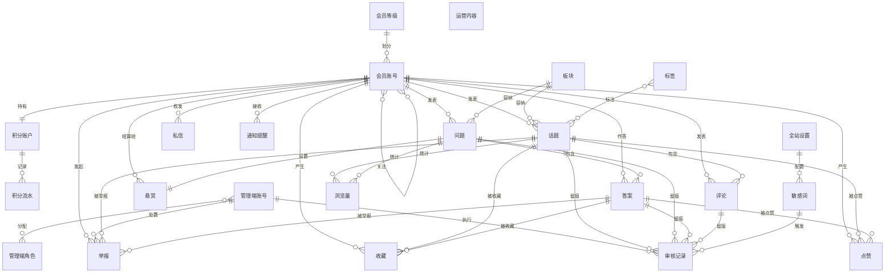
```mermaid
erDiagram
    "会员账号" ||--|| "积分账户" : "持有"
    "积分账户" ||--o{ "积分流水" : "记录"
    "会员等级" ||--o{ "会员账号" : "划分"
    "会员账号" ||--o{ "话题" : "发表"
    "会员账号" ||--o{ "评论" : "发表"
    "会员账号" ||--o{ "问题" : "发表"
    "会员账号" ||--o{ "答案" : "作答"
    "会员账号" ||--o{ "私信" : "收发"
    "会员账号" ||--o{ "通知提醒" : "接收"
    "会员账号" }o--o{ "会员账号" : "关注"
    "会员账号" ||--o{ "点赞" : "产生"
    "会员账号" ||--o{ "收藏" : "产生"
    "会员账号" ||--o{ "举报" : "发起"
    "会员账号" ||--o{ "悬赏" : "结算给"
    "管理端账号" }o--o{ "管理端角色" : "分配"
    "管理端账号" ||--o{ "审核记录" : "执行"
    "管理端账号" ||--o{ "举报" : "处置"
    "板块" ||--o{ "话题" : "容纳"
    "板块" ||--o{ "问题" : "容纳"
    "标签" }o--o{ "话题" : "标注"
    "话题" ||--o{ "评论" : "包含"
    "话题" ||--o{ "点赞" : "被点赞"
    "话题" ||--o{ "收藏" : "被收藏"
    "话题" ||--o{ "举报" : "被举报"
    "话题" ||--o{ "审核记录" : "留痕"
    "问题" ||--o{ "答案" : "包含"
    "问题" ||--o{ "审核记录" : "留痕"
    "问题" ||--|| "悬赏" : "设置"
    "答案" ||--o{ "点赞" : "被点赞"
    "答案" ||--o{ "收藏" : "被收藏"
    "答案" ||--o{ "举报" : "被举报"
    "答案" ||--o{ "审核记录" : "留痕"
    "评论" ||--o{ "审核记录" : "留痕"
    "敏感词" ||--o{ "审核记录" : "触发"
    "全站设置" ||--o{ "敏感词" : "配置"
    "运营内容"
    "话题" ||--o{ "浏览量" : "统计"
    "问题" ||--o{ "浏览量" : "统计"
```

**板块**（一句话定位：站点内容的一级去处，决定话题与问题归入哪里）：由站长建立与设定，运营人员日常维护；板块之下容纳话题与问题，成员按板块浏览内容。

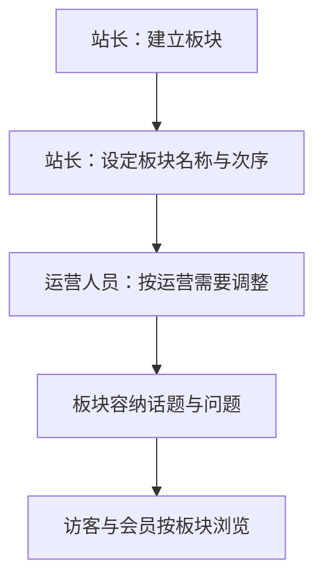
```mermaid
flowchart TD
    A[站长：建立板块] --> B[站长：设定板块名称与次序]
    B --> C[运营人员：按运营需要调整]
    C --> D[板块容纳话题与问题]
    D --> E[访客与会员按板块浏览]
```

**标签**（一句话定位：话题的横向归类标记，让同类讨论跨板块被找到）：运营人员维护标签，会员发帖时选用；一个话题可有多个标签，一个标签可标注多个话题。

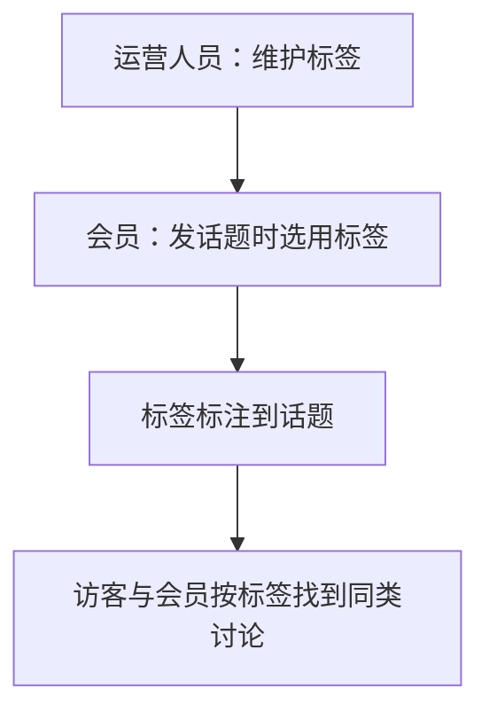
```mermaid
flowchart TD
    A[运营人员：维护标签] --> B[会员：发话题时选用标签]
    B --> C[标签标注到话题]
    C --> D[访客与会员按标签找到同类讨论]
```

**话题**（一句话定位：论坛讨论的主帖，讨论闭环的载体）：由会员发表，经审核通过后公开可见，接受评论、点赞、收藏与举报；作者可编辑自己的话题，违规时被删除。

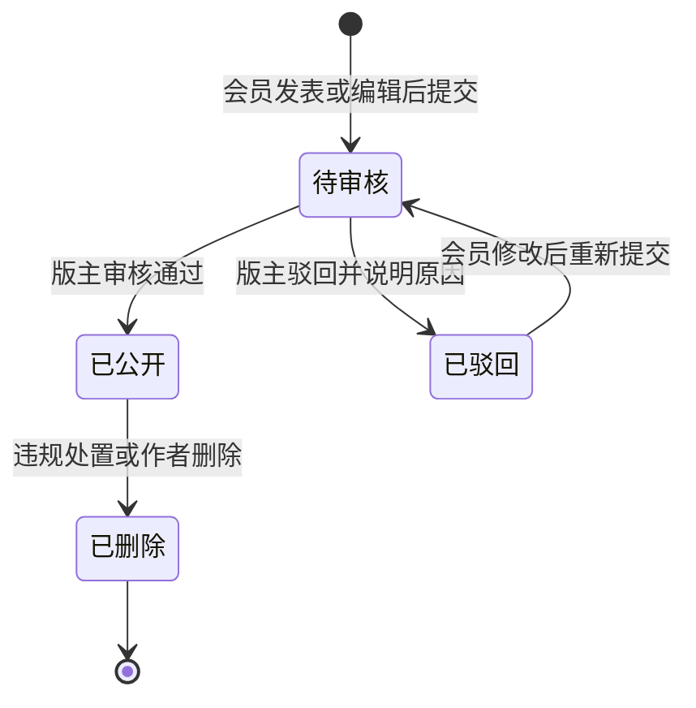
```mermaid
stateDiagram-v2
    [*] --> 待审核: 会员发表或编辑后提交
    待审核 --> 已公开: 版主审核通过
    待审核 --> 已驳回: 版主驳回并说明原因
    已驳回 --> 待审核: 会员修改后重新提交
    已公开 --> 已删除: 违规处置或作者删除
    已删除 --> [*]
```

**评论**（一句话定位：话题下的互动回复，讨论深度的来源）：由会员在已公开话题下发表，经审核通过后公开，接受点赞与举报，违规时被删除。

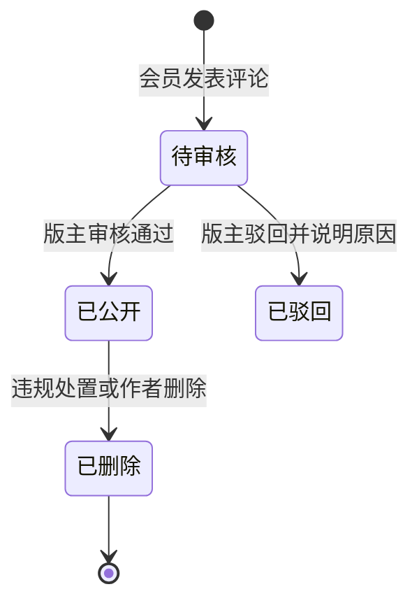
```mermaid
stateDiagram-v2
    [*] --> 待审核: 会员发表评论
    待审核 --> 已公开: 版主审核通过
    待审核 --> 已驳回: 版主驳回并说明原因
    已公开 --> 已删除: 违规处置或作者删除
    已删除 --> [*]
```

**问题**（一句话定位：悬赏问答的提问主体，问答闭环的起点）：由会员发表并可追加补充，经审核通过后公开等待作答；提问人可采纳一个答案，采纳后进入已采纳状态。

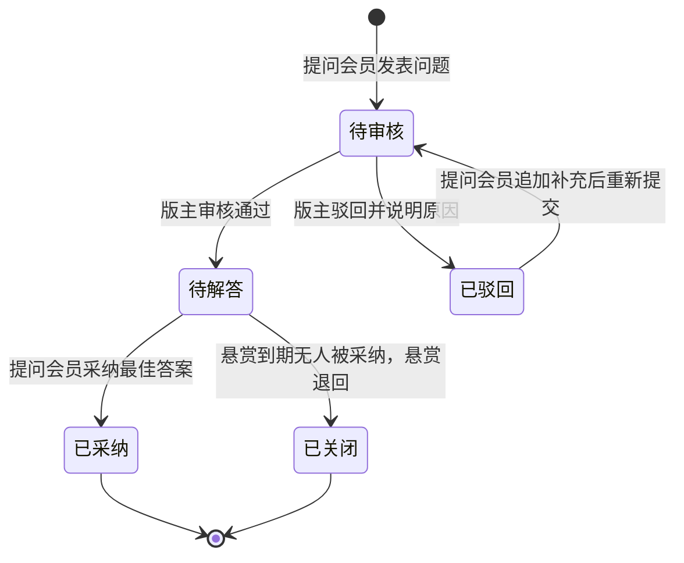
```mermaid
stateDiagram-v2
    [*] --> 待审核: 提问会员发表问题
    待审核 --> 待解答: 版主审核通过
    待审核 --> 已驳回: 版主驳回并说明原因
    已驳回 --> 待审核: 提问会员追加补充后重新提交
    待解答 --> 已采纳: 提问会员采纳最佳答案
    待解答 --> 已关闭: 悬赏到期无人被采纳，悬赏退回
    已采纳 --> [*]
    已关闭 --> [*]
```

**答案**（一句话定位：对问题的作答，被采纳者成为最佳答案）：由会员在已公开问题下发表，经审核通过后公开，接受点赞、收藏与举报；一个答案可被采纳为最佳答案。

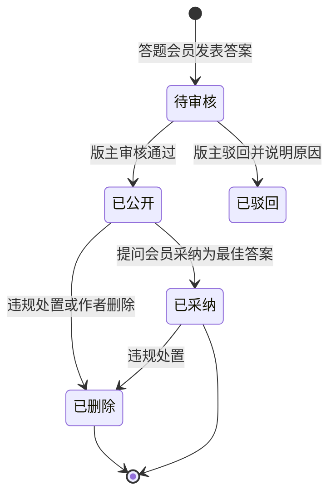
```mermaid
stateDiagram-v2
    [*] --> 待审核: 答题会员发表答案
    待审核 --> 已公开: 版主审核通过
    待审核 --> 已驳回: 版主驳回并说明原因
    已公开 --> 已采纳: 提问会员采纳为最佳答案
    已公开 --> 已删除: 违规处置或作者删除
    已采纳 --> 已删除: 违规处置
    已删除 --> [*]
    已采纳 --> [*]
```

**悬赏**（一句话定位：提问人为问题设置的积分回报，随问题的采纳或到期而结清）：随问题设置而生成，金额来自提问人的积分账户；被采纳时结算给答题人，无人被采纳而到期时退回提问人。

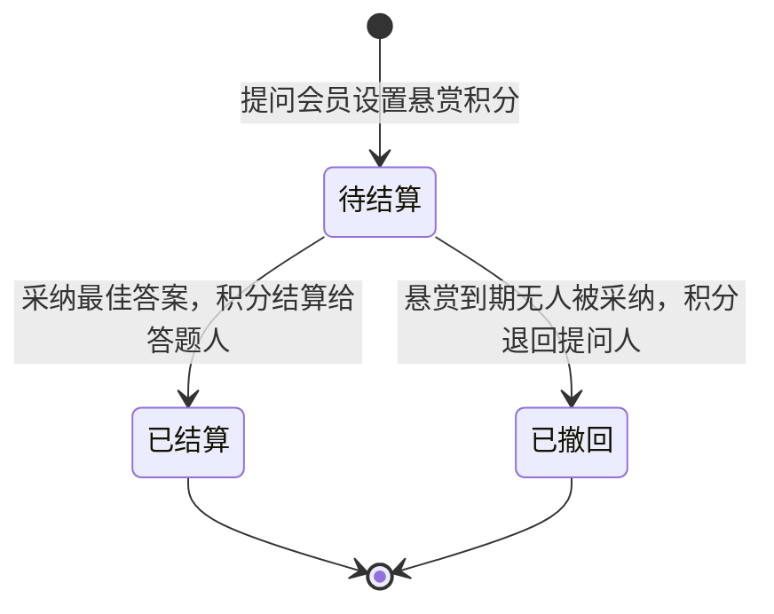
```mermaid
stateDiagram-v2
    [*] --> 待结算: 提问会员设置悬赏积分
    待结算 --> 已结算: 采纳最佳答案，积分结算给答题人
    待结算 --> 已撤回: 悬赏到期无人被采纳，积分退回提问人
    已结算 --> [*]
    已撤回 --> [*]
```

**审核记录**（一句话定位：内容先审后发的留痕，记录谁在什么时候以什么结论审了什么内容）：由版主审核话题、问题、答案与评论时产生，结论为通过或驳回；驳回原因随记录保留并通知作者，敏感词可作为触发线索。

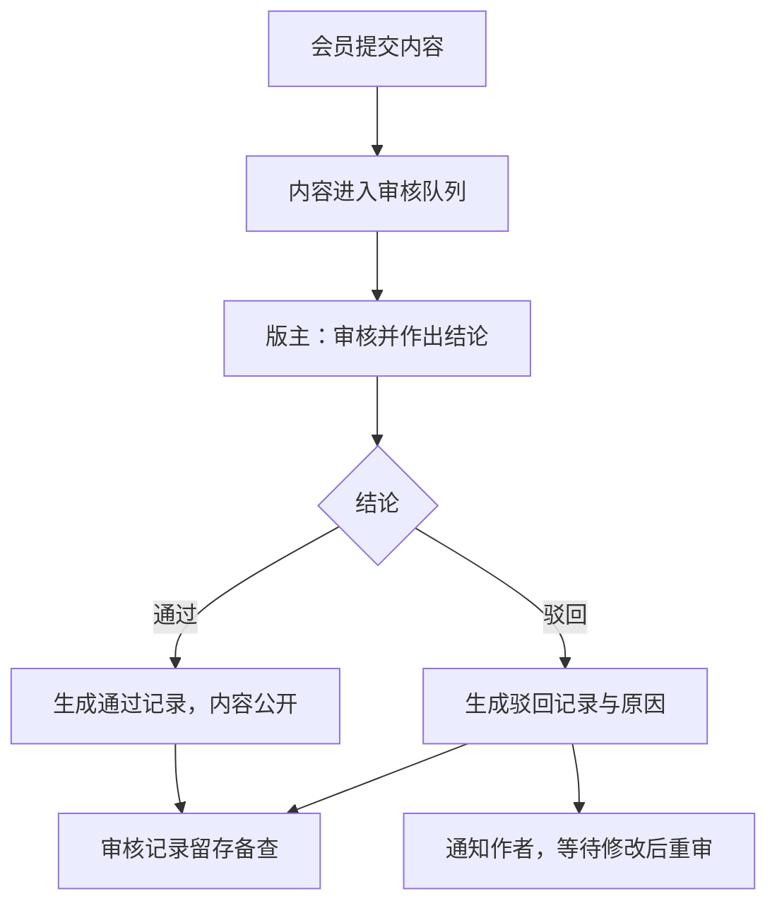
```mermaid
flowchart TD
    A[会员提交内容] --> B[内容进入审核队列]
    B --> C[版主：审核并作出结论]
    C --> D{结论}
    D -->|通过| E[生成通过记录，内容公开]
    D -->|驳回| F[生成驳回记录与原因]
    F --> G[通知作者，等待修改后重审]
    E --> H[审核记录留存备查]
    F --> H
```

**会员账号**（一句话定位：社区成员的身份载体，承载资料、内容、互动与成长的起点）：会员注册后建立，可被禁言或封号；会员在其中的行为产生话题、评论、问题、答案与互动记录。

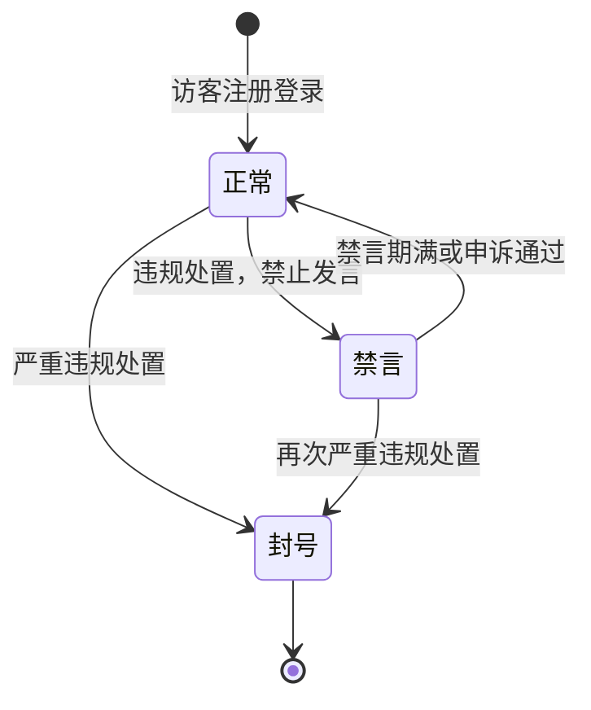
```mermaid
stateDiagram-v2
    [*] --> 正常: 访客注册登录
    正常 --> 禁言: 违规处置，禁止发言
    禁言 --> 正常: 禁言期满或申诉通过
    正常 --> 封号: 严重违规处置
    禁言 --> 封号: 再次严重违规处置
    封号 --> [*]
```

**会员等级**（一句话定位：会员成长的分层，决定可见内容与权限的开放程度）：由站长设定等级与计分口径，会员积分累积后进入相应等级，等级变化影响可见权限。

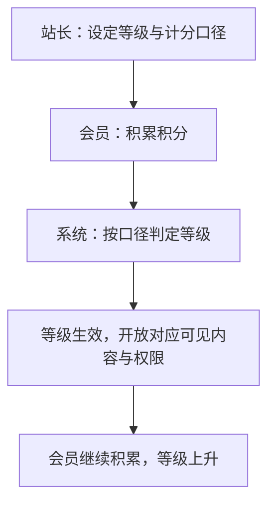
```mermaid
flowchart TD
    A[站长：设定等级与计分口径] --> B[会员：积累积分]
    B --> C[系统：按口径判定等级]
    C --> D[等级生效，开放对应可见内容与权限]
    D --> E[会员继续积累，等级上升]
```

**积分账户**（一句话定位：会员积分的账本，记录余额与每一次增减）：随会员账号建立，收入来自发帖、回帖、被采纳等行为，支出用于设置悬赏；每次变动生成一条积分流水。

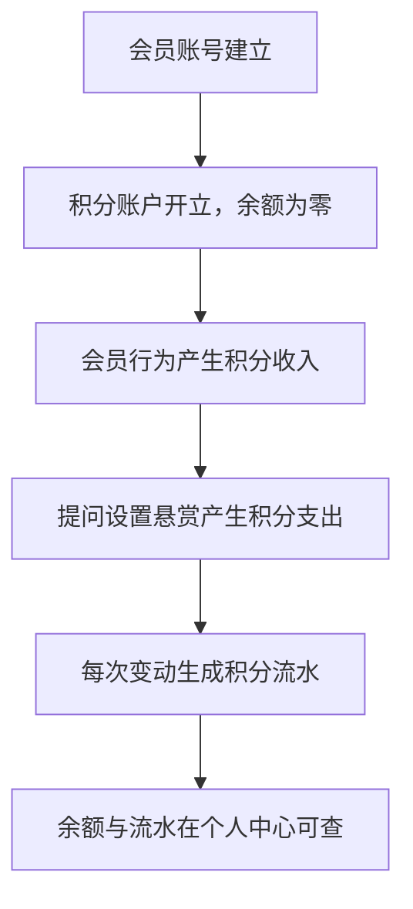
```mermaid
flowchart TD
    A[会员账号建立] --> B[积分账户开立，余额为零]
    B --> C[会员行为产生积分收入]
    C --> D[提问设置悬赏产生积分支出]
    D --> E[每次变动生成积分流水]
    E --> F[余额与流水在个人中心可查]
```

**积分流水**（一句话定位：积分账户的变动记录，说明每一次积分因何而来、因何而去）：记录型对象，由会员行为与悬赏结算产生，供会员自查与运营核对。

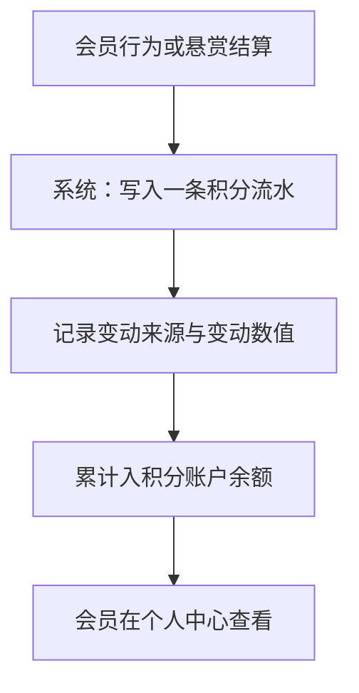
```mermaid
flowchart TD
    A[会员行为或悬赏结算] --> B[系统：写入一条积分流水]
    B --> C[记录变动来源与变动数值]
    C --> D[累计入积分账户余额]
    D --> E[会员在个人中心查看]
```

**管理端账号**（一句话定位：经营方与版主的登录身份，按角色获得相应能力）：由站长开通与分配角色，账号可被停用；账号在管理后台的一切操作留下审核与处置记录。

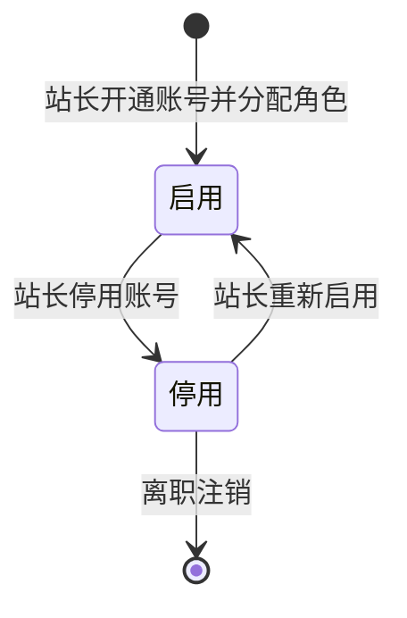
```mermaid
stateDiagram-v2
    [*] --> 启用: 站长开通账号并分配角色
    启用 --> 停用: 站长停用账号
    停用 --> 启用: 站长重新启用
    停用 --> [*]: 离职注销
```

**管理端角色**（一句话定位：管理端能力的授权模板，一人可持多个角色）：由站长定义与分配，角色决定账号在管理后台能看到什么、能做什么。

```mermaid
flowchart TD
    A[站长：定义角色] --> B[站长：为角色选定能力范围]
    B --> C[站长：将角色分配给管理端账号]
    C --> D[账号按角色行使能力]
    D --> E[站长：按需要调整或收回角色]
```

**私信**（一句话定位：会员之间的站内往来消息，不依赖外部通讯工具）：由会员发出与接收，形成双方可见的往来记录；被处置的账号不能发送私信（推断：禁言范围覆盖发言类行为）。

```mermaid
flowchart TD
    A[会员A：发起私信] --> B[私信送达会员B的收件记录]
    B --> C[会员B：查看并回复]
    C --> D[双方形成往来记录]
    D --> E[收到新私信时产生通知提醒]
```

**通知提醒**（一句话定位：把与会员相关的结果主动送达的消息，覆盖互动、审核与结算）：由系统在互动、审核结论与悬赏结算等时点产生，会员在个人中心与前台查看并标记已读。

```mermaid
flowchart TD
    A[互动、审核或结算事件发生] --> B[系统：生成通知提醒]
    B --> C[会员：在个人中心查看]
    C --> D[会员：标记已读或跳转对应内容]
```

**关注**（一句话定位：会员之间的单向关注关系，积累粉丝与内容订阅）：由会员发起与取消，关注后对方的公开内容更容易被看到；关注与粉丝在个人中心管理。

```mermaid
flowchart TD
    A[会员：关注另一位会员] --> B[关注关系建立]
    B --> C[被关注者增加一名粉丝]
    C --> D[会员：在个人中心管理关注与粉丝]
    D --> E[会员：取消关注]
```

**点赞**（一句话定位：会员对内容的单次赞同标记，用于表达认可并影响内容排序）：会员对话题、评论、问题或答案点赞，同一内容同一会员只计一次。

```mermaid
flowchart TD
    A[会员：对内容点赞] --> B{是否已点赞}
    B -->|否| C[点赞记录建立]
    B -->|是| D[取消点赞，记录移除]
    C --> E[内容获得一次赞同]
    D --> E
```

**收藏**（一句话定位：会员把内容放进自己收藏夹的标记，形成个人资料夹）：会员收藏话题、问题或答案，收藏后可在个人中心的我的收藏中回看。

```mermaid
flowchart TD
    A[会员：收藏内容] --> B[收藏记录建立并归入我的收藏]
    B --> C[会员：在个人中心查看收藏夹]
    C --> D[会员：取消收藏，记录移除]
```

**举报**（一句话定位：会员对违规内容的报告，治理闭环的触发入口）：由会员发起并说明理由，进入版主的待处理队列，核实后作出处置或驳回；处置结论同步至被处置一方与举报人。

```mermaid
stateDiagram-v2
    [*] --> 待处理: 会员举报违规内容并说明理由
    待处理 --> 已处理: 版主核实成立，执行违规处置
    待处理 --> 已驳回: 版主核实不成立，驳回并说明理由
    已处理 --> [*]
    已驳回 --> [*]
```

**敏感词**（一句话定位：内容审核的拦截词表，先审后发的兜底线索）：由站长在审核策略中配置，命中敏感词的内容在审核环节被标记，供版主重点判断。

```mermaid
flowchart TD
    A[站长：在审核策略中配置敏感词] --> B[会员提交内容]
    B --> C{是否命中敏感词}
    C -->|命中| D[标记并优先交版主判断]
    C -->|未命中| E[按常规审核队列处理]
    D --> F[版主作出审核结论]
    E --> F
```

**浏览量**（一句话定位：内容被查看次数的统计，经营方判断内容热度的基础数据）：记录型对象，随内容被查看累计，作为运营人员调整规则与内容的参考。

```mermaid
flowchart TD
    A[访客或会员查看内容] --> B[系统：累计该内容的浏览量]
    B --> C[浏览量进入数据统计]
    C --> D[经营方：据此调整运营与规则]
```

**全站设置**（一句话定位：站点级参数与开关的集中存放处，规则变更的落点）：由站长维护，承载站点名称、审核策略、敏感词与等级积分规则等；变更后对全站生效。

```mermaid
flowchart TD
    A[站长：进入全站设置] --> B[维护站点参数与开关]
    B --> C[配置审核策略与敏感词]
    C --> D[设定等级与积分规则]
    D --> E[保存后对全站生效]
```

**运营内容**（一句话定位：运营人员维护的推荐与引导性内容，在站点前台运营位展示）：由运营人员新增、编辑与删除，前台按展示位置取用；具体形态（推荐位、公告或专题）留版本级定案。

```mermaid
flowchart TD
    A[运营人员：新增或编辑运营内容] --> B[设定标题正文与展示位置]
    B --> C{启停}
    C -->|启用| D[前台运营位展示]
    C -->|停用或删除| E[前台不再展示，记录保留]
```

## 6. 关键设计决策

版本细化时的遵守方式：本章各条为跨版本稳定规则，大版本与小版本在细化功能时遵守；若后续版本与此处冲突，以本章为准，本章不随版本重复表述。

**D1 载体选择——网页优先，不做原生应用**：选择以电脑端网页与手机端网页承载全部前台能力，同一站点自适应，管理后台独立成端；不做原生 App 与小程序。理由：前台内容需要能被搜索引擎收录以吸引站外流量（已确认），且自建自营的站点希望账号、内容、数据自有（已确认），网页形态最贴合；不做应用可省去多端发布与审核的长期成本（推断）。跨版本规则：前台能力一律在网页端提供，不因后续版本引入应用而改变前台功能边界。

**D2 经营模式选择——自建自营的单一站点**：选择单一经营方运营一个站点，不设平台主体、不做多站点与多租户。理由：输入为自建自营定位，账号、内容、数据由经营方自己掌握（已确认）；单站点使规则、治理与账号体系保持简单一致。

**D3 内容运行方式选择——先审后发**：选择话题、问题、答案与评论均以审核通过为公开前提，驳回时说明原因并允许修改后重新提交。理由：经营方要保证公开内容质量、要能控得住（已确认），审核是治理闭环的入口。跨版本规则：任何前台内容的公开都以审核结论为准，审核结论与原因留痕。

**D4 激励方式选择——积分与等级驱动，悬赏以积分结算**：选择以积分累积与等级上升作为成员成长的主线，悬赏问答用积分结算，本期不引入真实资金（已确认不作为范围）。理由：输入的成长闭环以"涨积分、升等级、解锁权限"表述（已确认），积分可直接与可见权限挂钩，且无需引入支付相关依赖。跨版本规则：悬赏与激励的媒介保持为积分，除非后续重新决策。

**D5 权限组织方式选择——按角色授权、一人可多角色**：选择管理端按角色授权（站长定义角色与能力范围并分配给账号，账号可停用），会员侧的开放程度由等级与积分决定。理由：小团队常有一人多岗（推断），角色模板比逐人配置更易维护；会员的可见权限需要与成长体系挂钩（已确认）。跨版本规则：能力的授予只经角色，不针对单个账号定制（除停用外）。

**D6 内容归属与处置选择——会员可维护自己的内容，经营方握有最终处置权**：选择会员可编辑、删除自己的话题、评论、问题与答案，经营方在违规时可删除内容并对账号执行禁言或封号。理由：会员需要修改与撤回自己的表达（推断），而治理闭环要求经营方有明确的处置手段（已确认）。跨版本规则：处置动作（删帖、禁言、封号）以经营方判断为准，处置结果通知当事人。

**D7 站内沟通方式选择——站内私信与通知提醒，不做即时会话**：选择以站内私信承载会员往来、以通知提醒承载结果送达，不引入外部通讯工具与实时聊天会话。理由：输入将私信与通知提醒列为必备（已确认），其诉求是站内往来与结果可达；实时会话未在输入中出现（不纳入）。跨版本规则：站内消息仅在站点内产生与查看。

**D8 数据使用方式选择——运营数据用于规则与内容调整**：选择以浏览量等内容热度数据与互动情况作为运营调整的依据，具体统计口径与呈现留版本级定义。理由：输入要求"浏览量统计"与运营复盘（已确认），但未给出指标口径（留下游）。

## 7. 备忘

- **采用的判断（建议默认）**：悬赏以积分结算、现金悬赏后续再议；悬赏到期无人被采纳时积分退回提问人；会员注册登录采用站内账号密码方式；浏览不需要先注册，参与互动需要注册。
- **推断（就地已标明）**：一人可多角色的内部协作方式；访客注册后成为会员、等级不派生新角色；会员可维护自己的内容；禁言范围覆盖私信等发言类行为；不做即时会话。
- **外部依赖与前提假设**：前台内容可被搜索引擎收录依赖站点对外的可访问性与收录条件；站内账号密码登录在后续若引入第三方登录，需重新评审本备忘中的相关判断。
- **待业务确认事项**：悬赏积分在结算与退回之外是否需要其他处理方式；禁言是否有期限与解除方式；会员注销后其公开内容的保留方式。以上不影响本文主体结论，待确认后在大版本或小版本 PRD 中细化。
- **未纳入的想法**：原生 App、小程序、真实资金交易（在线支付、现金悬赏、红包、会员卡、平台分成）、AI 问答助手、直播、短视频均为输入明确不做项（已确认），不自动成为后续承诺。
