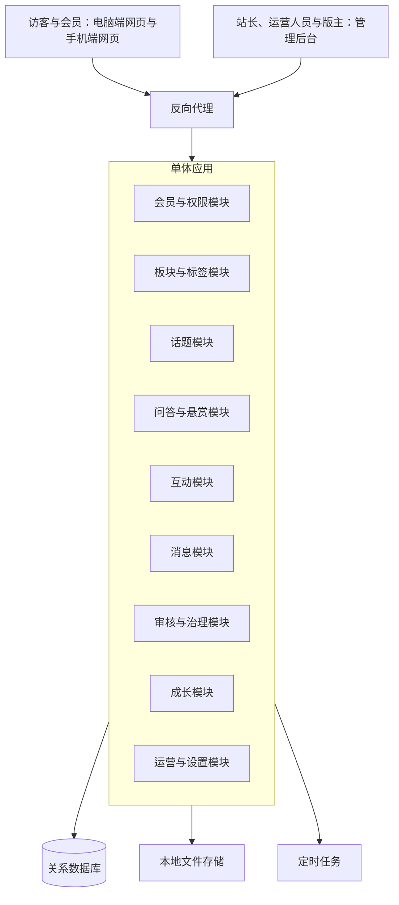
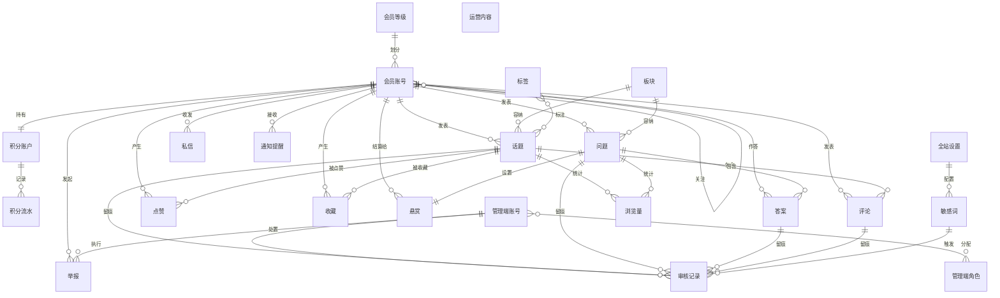

# 技术文档（项目）：巡云轻论坛

> 定位与决策状态：本文把项目 PRD 的功能与约束映射为技术基线——技术形态、技术栈、系统构成、概念数据模型与关键技术决策；定稿后只细化不推翻，各版本在此基础上落地。上游为模拟案例材料，模拟性质予以保留；技术前提推断与合理默认汇总于文末备忘。

## 1. 技术形态

**整体架构**：模块化单体——一个应用进程承载全部业务模块，前后台共用同一份业务逻辑与数据。理由：站点由单一经营方运营、功能域之间共享会员、内容、积分与审核规则，单体最省沟通与部署成本。

**前后端模式**：前台采用服务端渲染的网页，管理后台采用前后端分离的页面应用。理由：前台内容需要能被搜索引擎收录，服务端渲染的网页天然可收录；管理后台只对内部开放，不需要收录，分离形态更利于密集的表单与列表操作。

**端结构**：电脑端网页与手机端网页为同一站点的响应式形态，共用一套页面与接口；管理后台独立成端。理由：PRD 要求同一站点自适应并减少重复建设。

**部署形态**：反向代理 + 应用进程 + 关系数据库 + 本地文件存储，单机或单容器部署。理由：自建自营的单站点，规模不要求分布式部署。

## 2. 技术栈

| 分类 | 采用 | 一句话理由 |
|---|---|---|
| 后端语言与框架 | Java + Spring Boot | 主流稳定、生态完整，小团队易维护与招人（推断：按主流 Java 团队假设） |
| 数据库 | MySQL 关系数据库 | 积分、悬赏、审核结论需要事务保证，关系模型最直接 |
| 数据访问 | ORM 映射 | 以实体与关系建模，减少手写 SQL 的维护成本 |
| 前台页面 | 服务端模板渲染 HTML ＋ 渐进式脚本增强 | 满足搜索引擎收录，同时在浏览器内提供点赞收藏等交互 |
| 手机端适配 | 响应式布局，同一套页面 | 一套代码覆盖两个端，避免双份维护 |
| 管理后台页面 | Vue 前端框架 ＋ 组件库 | 表单与列表密集型界面开发效率高 |
| 站内搜索 | 数据库全文检索 | 内容量级小，够用即止，不引入独立搜索引擎 |
| 登录鉴权 | 服务端会话 ＋ 会话 Cookie | 与服务端渲染形态一致，实现简单 |
| 定时任务 | 应用内定时调度 | 悬赏到期退回、通知汇总等需要周期触发 |
| 敏感词校验 | 本地词表匹配 | 词表规模可控，匹配逻辑简单 |
| 文件存储 | 服务器本地磁盘 | 头像与少量图片，规模不需要对象存储 |
| 部署与运行 | 反向代理 ＋ 应用进程 ＋ 数据库 | 单机部署即可满足单站点运营 |

## 3. 系统构成

**架构总览**：

**模块划分与职责**：

| 模块 | 职责（一句话） |
|---|---|
| 会员与权限模块 | 会员注册登录、资料与账号状态，管理端账号与角色授权 |
| 板块与标签模块 | 板块与标签的建立维护，内容的归类与浏览入口 |
| 话题模块 | 话题的发表、编辑、评论与可见权限控制 |
| 问答与悬赏模块 | 问题与答案的发表、悬赏设置、最佳答案采纳与积分结算 |
| 互动模块 | 点赞、收藏与关注关系 |
| 消息模块 | 站内私信与通知提醒的产生、查看与已读 |
| 审核与治理模块 | 内容审核与留痕、举报受理、敏感词校验与违规处置 |
| 成长模块 | 积分账户与积分流水的记账、等级判定与权益开放 |
| 运营与设置模块 | 全站设置、运营内容维护与浏览量统计 |

**核心流程的数据流**：会员在前台提交内容，应用写库后置为待审核并生成审核队列项；版主在管理后台作出结论，应用更新内容状态、写入审核记录并生成通知提醒；内容公开后，点赞、收藏、关注与浏览量在互动时写入并按内容汇总；提问人采纳最佳答案时，应用在同一事务内完成悬赏状态变更、答题人积分入账与积分流水写入，再生成双方通知；悬赏到期由定时任务扫描并执行退回。

## 4. 概念数据模型

**实体关系**：

**逐实体说明**：

| 实体 | 一句话说明 |
|---|---|
| 会员账号 | 社区成员的身份，承载资料、账号状态与全部成员行为 |
| 会员等级 | 会员成长的分层，决定可见内容与权限的开放程度 |
| 积分账户 | 会员积分余额的账本 |
| 积分流水 | 积分每一次增减的记录，说明来源与去向 |
| 管理端账号 | 经营方与版主的登录身份 |
| 管理端角色 | 管理端能力的授权模板，一人可持多个 |
| 板块 | 内容的一级去处，容纳话题与问题 |
| 标签 | 话题的横向归类标记 |
| 话题 | 论坛讨论的主帖 |
| 评论 | 话题下的互动回复 |
| 问题 | 悬赏问答的提问主体 |
| 答案 | 对问题的作答，可被采纳为最佳答案 |
| 悬赏 | 提问人设置的积分回报，随采纳或到期结清 |
| 审核记录 | 先审后发的留痕，含结论与驳回原因 |
| 举报 | 会员对违规内容的报告 |
| 敏感词 | 内容审核的拦截词表 |
| 私信 | 会员之间的站内往来消息 |
| 通知提醒 | 互动、审核与结算结果的送达消息 |
| 关注 | 会员之间的单向关注关系 |
| 点赞 | 会员对内容的单次赞同标记 |
| 收藏 | 会员把内容归入个人收藏夹的标记 |
| 浏览量 | 内容被查看次数的统计记录 |
| 运营内容 | 运营人员维护的推荐与引导性内容，前台运营位展示 |
| 全站设置 | 站点级参数与开关的集中存放处 |

## 5. 关键技术决策

- **模块化单体**：选单体应用按业务域分模块；因为单一经营方、模块间共享会员与积分账本，单体最省成本；不选微服务，因为规模与团队人数都撑不起服务治理的代价。
- **前台服务端渲染**：选服务端模板渲染 HTML；因为前台内容必须能被搜索引擎收录；不选纯前端渲染，因为收录依赖额外改造，得不偿失。
- **站点内检索用数据库**：选数据库全文检索；因为内容量级小，需求只是"搜得到"；不选独立搜索引擎，因为索引同步与运维成本远超当前规模所需。
- **不引入缓存中间件**：先只做数据库直读，页面与列表访问量在可预期范围内；不选缓存中间件，因为先简化，出现实测瓶颈再补最省事。
- **鉴权用服务端会话**：选会话 Cookie；因为与会话状态天然匹配服务端渲染；不选令牌方案，因为管理后台与前台都跑在同域内，令牌带来的跨端收益当前用不上。
- **积分结算用事务保证**：选在采纳动作内用数据库事务同时完成悬赏状态、积分入账与流水写入；因为积分是站内唯一的价值凭证，不能出现半完成状态；不选异步结算，因为规模不需要异步，且引入补偿逻辑。
- **审核与治理留痕**：选审核记录独立成实体并保留驳回原因；因为先审后发是 PRD 的跨版本规则，处置需要可回溯；不选在内容上只记状态，因为丢失"谁在何时以什么理由作出结论"。
- **悬赏到期由定时任务处理**：选应用内定时调度扫描到期悬赏并退回积分；因为是闭环中的确定时点动作；不选人工干预，因为到期量随内容增长。
- **通知提醒不做实时推送**：选写入站内消息并在页面加载时拉取；因为 PRD 只要求送达与查看；不选长连接推送，因为实时性不是需求，且长连接会提高部署复杂度。
- **移动端用响应式而非独立站点**：选同一套页面适配两个端；因为 PRD 要求同一站点自适应；不选独立手机站，因为双份页面带来双份维护。

**明确不采用的技术**：

| 技术 | 一句话理由 |
|---|---|
| 微服务与服务网格 | 单站点规模与团队人数不匹配 |
| 独立搜索引擎 | 内容量级小，数据库检索够用 |
| 缓存中间件 | 当前没有实测瓶颈，先简化 |
| 消息队列 | 无异步解耦需求，事务已保证一致性 |
| 长连接推送 | 通知提醒无实时性要求 |
| 对象存储与内容分发网络 | 头像与少量图片用本地磁盘即可 |
| 第三方登录与短信通道 | PRD 未纳入，站内账号密码已满足 |
| 支付与资金通道 | PRD 明确不做真实资金交易 |
| 跨端应用框架 | PRD 明确不做原生应用与小程序 |

## 6. PRD 决策的技术承接

| PRD 决策 | 技术对策 |
|---|---|
| D1 网页优先、不做原生应用 | 服务端渲染网页 ＋ 响应式布局覆盖两个端，管理后台独立成端 |
| D2 自建自营单一站点 | 单体应用单实例部署，数据与文件默认存储在站点自身环境 |
| D3 内容先审后发 | 内容默认待审核状态 ＋ 审核记录实体 ＋ 审核队列与驳回原因留痕 |
| D4 积分为激励与悬赏媒介 | 积分账户与积分流水成对记账，采纳结算在同一事务内完成 |
| D5 按角色授权、一人可多角色 | 管理端账号与角色多对多授权，能力按角色判定 |
| D6 会员可维护内容、经营方握最终处置权 | 内容状态机含已删除终态，删除、禁言、封号作为经营方侧处置动作 |
| D7 站内私信与通知提醒 | 消息模块写入站内消息，页面加载时拉取并支持标记已读 |
| D8 运营数据用于调整 | 浏览量按内容累计存储，供运营侧查询使用 |

## 7. 备忘

---

- **规模假设（推断）**：站点为单经营方运营的中小规模社区，内容与会员量级不构成单库压力；出现实测瓶颈时按"先索引、再缓存、后拆分"的顺序补强，不提前设计。
- **团队技能假设（推断）**：按主流 Java 后端与前端框架技能储备的团队设计，未按某种小众技术路线选型。
- **部署环境假设（推断）**：具备一台可公网访问的服务器与一个关系数据库实例，站内检索与文件存储都在这台环境内。
- **待确认事项与影响**：若后续决定引入第三方登录或短信通道，需要补充相应的鉴权适配与消息通道，并重新评审登录鉴权决策；若前台访问量增长明显，缓存中间件的引入顺序与边界需重新评估。
- **未纳入的技术**：以上"明确不采用"清单中的技术均为当前基线不采用项，不自动成为后续承诺。
