# 模块总览：巡云轻论坛

> 定位：本文是模拟案例评审稿，定模块划分、对象归属与跨模块关系——每个模块在此只有职责、对象与简单粒度功能，操作粒度的功能展开、复杂功能详述与状态流转见各模块详情文档。

## 1. 项目结构（模块与对象）

```mermaid
flowchart TB
    P[巡云轻论坛]
    P --- M1[会员与权限模块]
    M1 --- A1[会员账号 ◇]
    M1 --- A2[管理端账号 ◇]
    M1 --- A3[管理端角色 ◇]
    P --- M2[板块与标签模块]
    M2 --- B1[板块 ◇]
    M2 --- B2[标签]
    P --- M3[话题模块]
    M3 --- C1[话题 ◇]
    M3 --- C2[评论]
    P --- M4[问答与悬赏模块]
    M4 --- D1[问题 ◇]
    M4 --- D2[答案 ◇]
    M4 --- D3[悬赏]
    P --- M5[互动模块]
    M5 --- E1[点赞]
    M5 --- E2[收藏]
    M5 --- E3[关注]
    P --- M6[消息模块]
    M6 --- F1[私信]
    M6 --- F2[通知提醒 ◇]
    P --- M7[审核与治理模块]
    M7 --- G1[审核记录]
    M7 --- G2[举报 ◇]
    M7 --- G3[敏感词 ◇]
    P --- M8[成长模块]
    M8 --- H1[会员等级 ◇]
    M8 --- H2[积分账户 ◇]
    M8 --- H3[积分流水]
    P --- M9[运营与设置模块]
    M9 --- I1[全站设置 ◇]
    M9 --- I2[浏览量]
    M9 --- I3[运营内容]
    classDef marked fill:#fff3cd,stroke:#b8860b;
    class A1,A2,A3,B1,C1,D1,D2,F2,G2,G3,H1,H2,I1 marked;
```

**与技术文档分包的映射**：模块与技术文档《系统构成》的分包一一对应，无聚合、无拆分——技术文档按业务域划出九个模块（会员与权限、板块与标签、话题、问答与悬赏、互动、消息、审核与治理、成长、运营与设置），本文的模块识别结论与之一致：每个域都有独立对象群、独立规则群与独立使用方，且都能独立成文，不需要并入邻近模块。

## 2. 模块与对象

### 2.1 会员与权限模块

**职责**：管身份——会员账号的注册、资料与凭据、状态与个人中心，管理端账号与角色授权；不管内容的发表与维护、不管成长账本。

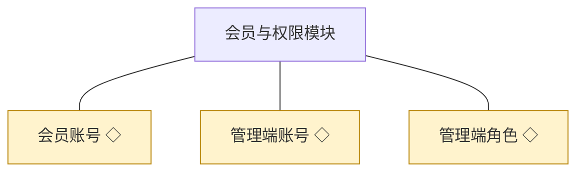

| 对象 | 业务含义与主要组成 | 关系及约束 |
|---|---|---|
| 会员账号 | 社区成员的身份：资料与头像、登录凭据、账号状态、我的内容与业务记录的入口 | 一人一个会员账号；状态为正常、禁言、封号；被内容、互动、消息与账本对象引用 |
| 管理端账号 | 经营方与版主的登录身份：账号资料、所属角色、启停状态 | 可持多个管理端角色；停用后不得登录与操作 |
| 管理端角色 | 管理端能力的授权模板：角色名、能力点集合、被分配账号 | 由站长定义与分配；能力点判定同时作用于页面入口与接口校验 |

**共享对象**：

| 对象 | 共享方式 | 使用方 |
|---|---|---|
| 会员账号 | 身份标识引用，统一由本模块写入 | 话题、问答与悬赏、互动、消息、审核与治理、成长 |
| 管理端账号 | 身份标识引用，统一由本模块写入 | 审核与治理、运营与设置 |
| 管理端角色 | 能力点判定结果引用 | 审核与治理、运营与设置 |

**功能列表**：会员注册登录（注册、登录、退出、密码重置、注销）；会员资料与头像维护；我的内容聚合入口；会员账号状态处置（禁言、解除禁言、封号）；管理端账号管理（开通、编辑、停用、启用、注销）；管理端角色管理（定义、授权、调整、删除）；个人设置（管理端自身资料与凭据重置）；会员查询与维护（运营侧）。

**详细设计**：[04C-会员与权限模块.md](./04C-会员与权限模块.md)

### 2.2 板块与标签模块

**职责**：管站点结构——板块的建立、编排与容纳关系，标签的维护，为内容提供去处与归类；不管内容本身。

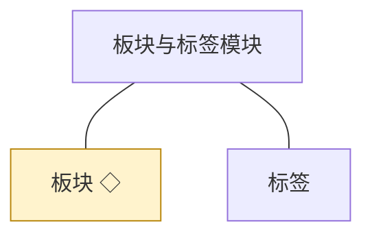

| 对象 | 业务含义与主要组成 | 关系及约束 |
|---|---|---|
| 板块 | 内容的一级去处：名称、说明、次序、启停状态 | 容纳话题与问题；停用板块不接收新内容，已有内容仍可读 |
| 标签 | 话题的横向归类标记：名称、使用次数 | 与话题多对多；被使用中的标签不可删除 |

**共享对象**：

| 对象 | 共享方式 | 使用方 |
|---|---|---|
| 板块 | 标识引用，统一由本模块写入 | 话题、问答与悬赏、运营与设置 |

**功能列表**：板块新增与编辑；板块排序；板块启停与删除；标签新增与编辑；标签删除；前台板块与标签入口（列表、详情导航）。

**详细设计**：[04C-板块与标签模块.md](./04C-板块与标签模块.md)

### 2.3 话题模块

**职责**：管论坛讨论线——话题与评论的发表、编辑、可见权限与删除；不管审核结论（审核与治理模块作出）、不管互动标记（互动模块持有）。

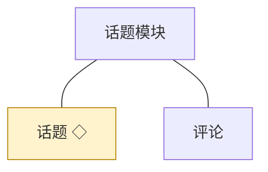

| 对象 | 业务含义与主要组成 | 关系及约束 |
|---|---|---|
| 话题 | 论坛讨论的主帖：标题、正文、所属板块、可见条件、审核状态 | 状态为待审核、已公开、已驳回、已删除；已删除为终态 |
| 评论 | 话题下的互动回复：正文、审核状态 | 依附于话题；话题不可见时评论一并不可见 |

**共享对象**：

| 对象 | 共享方式 | 使用方 |
|---|---|---|
| 话题 | 标识引用，统一由本模块写入 | 互动、审核与治理、运营与设置 |

**功能列表**：话题发表；话题编辑与重新提交；话题删除；话题查看与列表；话题搜索；话题可见权限设置；评论发表与回复；评论删除；评论查看；内容查询与维护（运营侧）。

**详细设计**：[04C-话题模块.md](./04C-话题模块.md)

### 2.4 问答与悬赏模块

**职责**：管问答线——问题、答案、悬赏与最佳答案采纳；不管积分记账（成长模块）、不管审核结论（审核与治理模块）。

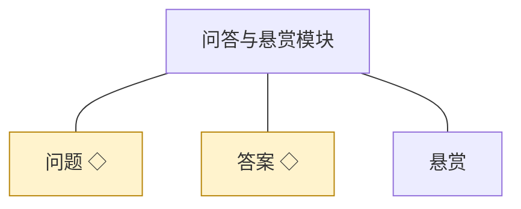

| 对象 | 业务含义与主要组成 | 关系及约束 |
|---|---|---|
| 问题 | 悬赏问答的提问主体：标题、正文、追加补充、所属板块、审核状态 | 状态为待审核、待解答、已驳回、已采纳、已关闭；采纳与关闭为终态 |
| 答案 | 对问题的作答：正文、审核状态、是否被采纳 | 一个答案只属于一个问题；被采纳的答案不能被删除 |
| 悬赏 | 提问人设置的积分回报：悬赏积分、状态、结算对象 | 与问题一对一；状态为待结算、已结算、已撤回 |

**共享对象**：

| 对象 | 共享方式 | 使用方 |
|---|---|---|
| 问题 | 标识引用，统一由本模块写入 | 互动、审核与治理、运营与设置 |
| 答案 | 标识引用，统一由本模块写入 | 互动、审核与治理 |

**功能列表**：问题发表；问题追加补充与编辑；问题关闭；问题查看与列表；问答列表与详情；问答搜索；答案作答与补充；答案编辑与删除；答案查看；悬赏设置；最佳答案采纳；悬赏到期退回；内容查询与维护（运营侧）。

**详细设计**：[04C-问答与悬赏模块.md](./04C-问答与悬赏模块.md)

### 2.5 互动模块

**职责**：管点赞、收藏与关注——会员对内容与他人施加的轻量关系；不管内容本身、不管消息送达。

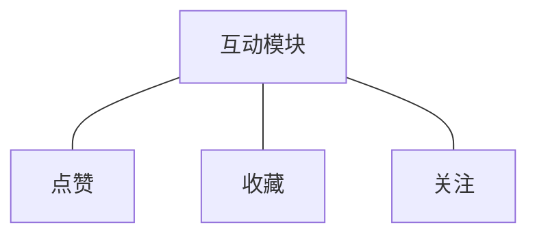

| 对象 | 业务含义与主要组成 | 关系及约束 |
|---|---|---|
| 点赞 | 会员对内容的单次赞同：会员、内容标识、时间 | 同一会员对同一内容只计一次；取消即移除 |
| 收藏 | 会员把内容归入个人收藏夹的标记：会员、内容标识、时间 | 同一会员对同一内容只计一次；在个人中心可查 |
| 关注 | 会员之间的单向关注关系：关注人、被关注人、时间 | 不能关注自己；取消即解除 |

**功能列表**：点赞与取消点赞；点赞计数；收藏与取消收藏；我的收藏；关注与取消关注；我的关注与粉丝列表。

**详细设计**：[04C-互动模块.md](./04C-互动模块.md)

### 2.6 消息模块

**职责**：管站内消息——私信的收发与通知提醒的写入、查看、已读；不管事件来源（由各模块触发）。

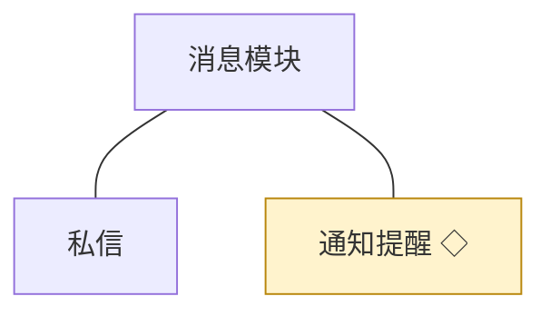

| 对象 | 业务含义与主要组成 | 关系及约束 |
|---|---|---|
| 私信 | 会员之间的站内往来消息：收发双方、正文、已读状态 | 被禁言或封号的账号不能发送；双方各自可见往来记录 |
| 通知提醒 | 互动、审核与结算结果的送达消息：接收人、类型、关联内容、已读状态 | 由各业务模块在同一事务内触发写入；只读不改 |

**共享对象**：

| 对象 | 共享方式 | 使用方 |
|---|---|---|
| 通知提醒 | 统一写入接口，写入方不直接操作消息侧表 | 会员与权限、话题、问答与悬赏、互动、审核与治理、成长 |

**功能列表**：私信发送；私信往来查看；私信已读与删除；通知提醒产生与写入；通知提醒查看；通知提醒标记已读；通知提醒清理。

**详细设计**：[04C-消息模块.md](./04C-消息模块.md)

### 2.7 审核与治理模块

**职责**：管内容审核、举报、敏感词与违规处置——先审后发的审核队列与留痕、举报受理与处置、违规内容与账号的处置动作；不管内容本身的发表与维护。

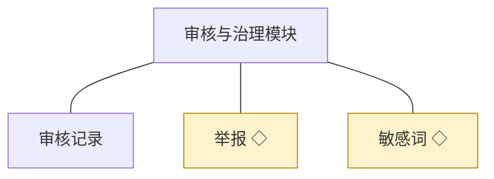

| 对象 | 业务含义与主要组成 | 关系及约束 |
|---|---|---|
| 审核记录 | 先审后发的留痕：审核人、结论、驳回原因、时间、被审内容 | 只增不改；与内容状态变更同事务写入 |
| 举报 | 会员对违规内容的报告：举报人、被举报内容、理由、处理结论 | 状态为待处理、已处理、已驳回；结论通知举报人与被处置一方 |
| 敏感词 | 审核拦截词表：词条、启停状态 | 由全站设置登记与配置；命中作为审核线索，不单独构成驳回理由 |

**共享对象**：

| 对象 | 共享方式 | 使用方 |
|---|---|---|
| 举报 | 标识引用，统一由本模块写入 | 会员与权限（个人中心入口） |
| 敏感词 | 标识引用，统一由本模块写入 | 运营与设置 |

**功能列表**：审核队列查看；内容审核通过；内容审核驳回；审核留痕查询；举报发起；举报受理与核实；举报处置与驳回；敏感词新增、编辑、删除；违规内容删除；账号禁言与解除；账号封号。

**详细设计**：[04C-审核与治理模块.md](./04C-审核与治理模块.md)

### 2.8 成长模块

**职责**：管账本与分层——积分账户、积分流水、等级判定与权益开放；不管积分由什么行为触发（由各模块事件触发）。

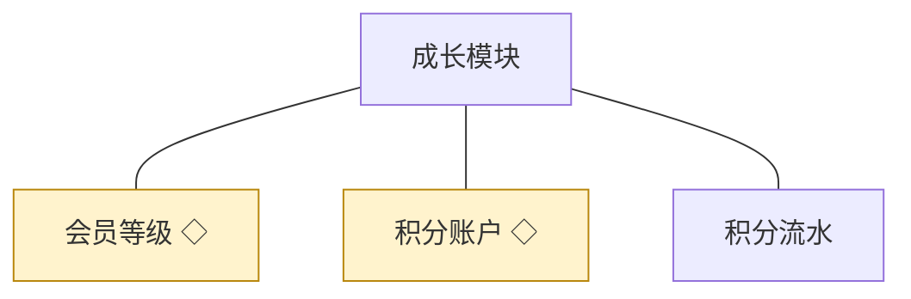

| 对象 | 业务含义与主要组成 | 关系及约束 |
|---|---|---|
| 会员等级 | 成长分层：等级名、所需积分、开放的内容可见与权限 | 由全站设置登记规则；等级变化即时生效 |
| 积分账户 | 会员积分余额的账本：余额、最近变动时间 | 与会员账号一对一；余额变动必须伴随流水 |
| 积分流水 | 每一次积分增减的记录：来源、方向、数值、时间、关联对象 | 只增不改；余额可由流水重算 |

**共享对象**：

| 对象 | 共享方式 | 使用方 |
|---|---|---|
| 会员等级 | 等级判定结果引用 | 会员与权限、话题、问答与悬赏 |
| 积分账户 | 统一的入账与出账接口，使用方不直接改余额 | 问答与悬赏、审核与治理 |

**功能列表**：积分账户开立；积分入账；积分出账；积分人工修正；积分流水记录与查询；等级判定；等级变更；等级权益配置。

**详细设计**：[04C-成长模块.md](./04C-成长模块.md)

### 2.9 运营与设置模块

**职责**：管站点级参数与运营数据——全站设置、审核策略与规则入口、运营内容、浏览量统计；不管审核与处置动作本身。

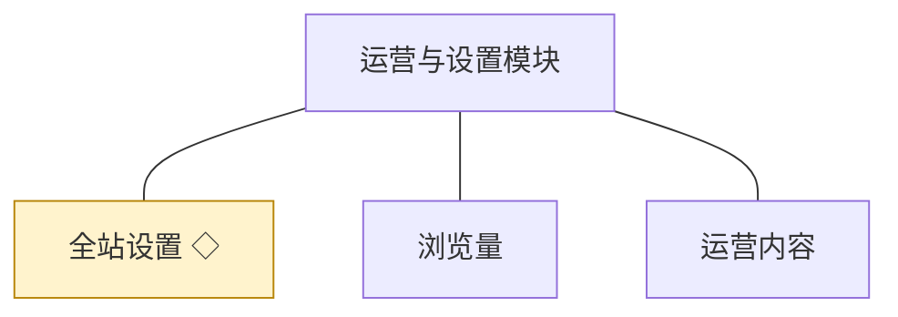

| 对象 | 业务含义与主要组成 | 关系及约束 |
|---|---|---|
| 全站设置 | 站点级参数与开关：站点信息、审核策略、等级与积分规则、敏感词配置入口 | 变更后对全站生效；被多个模块读取 |
| 浏览量 | 内容被查看次数的统计记录：内容标识、累计次数 | 记录型对象；可冗余存储并校正，以事实记录为准 |
| 运营内容 | 运营人员维护的推荐与引导性内容：标题、正文、展示位置、启停 | 由本模块持有；删除为软删除语义 |

**共享对象**：

| 对象 | 共享方式 | 使用方 |
|---|---|---|
| 全站设置 | 统一读取接口，配置变更由本模块写入 | 会员与权限、话题、问答与悬赏、审核与治理、成长 |

**功能列表**：全站设置查看与修改；审核策略配置；等级与积分规则配置；运营内容维护；浏览量累计；浏览量统计查看。

**详细设计**：[04C-运营与设置模块.md](./04C-运营与设置模块.md)

## 3. 跨模块关系

**对象关系图**：

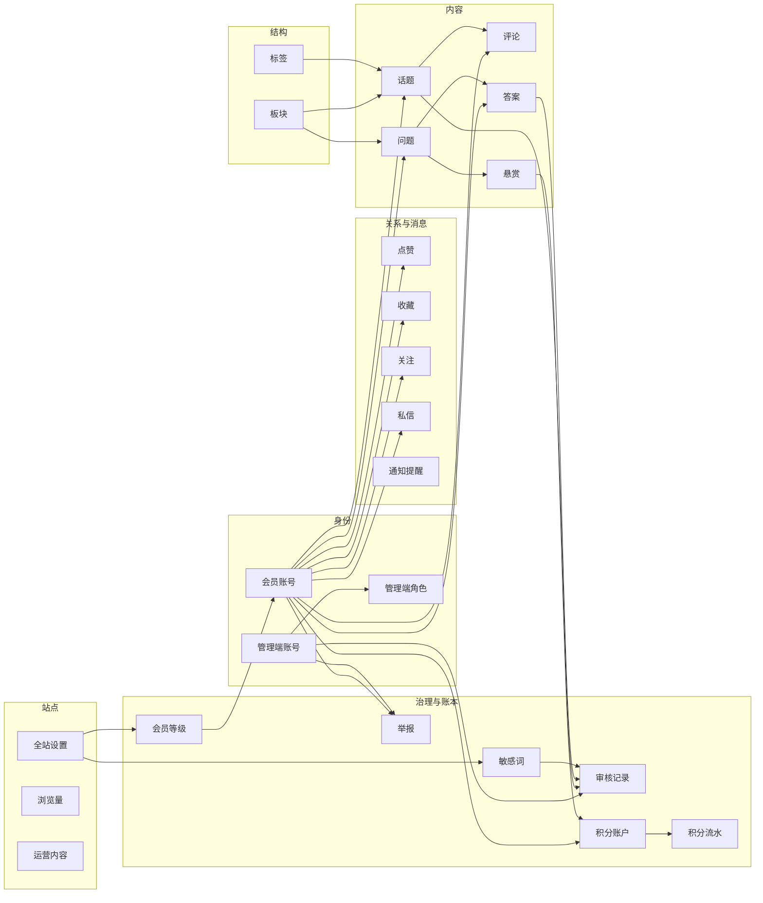

**对象关联表**：

| 关联对象 | 关系 | 数据归属 |
|---|---|---|
| 会员账号 — 话题、评论、问题、答案 | 发表与作答 | 内容方持有内容，身份方持有账号 |
| 会员账号 — 点赞、收藏、关注 | 产生关系标记 | 互动模块持有 |
| 会员账号 — 积分账户、会员等级 | 持有账本、按积分分层 | 成长模块持有 |
| 管理端账号 — 审核记录、举报 | 执行审核、处置举报 | 审核与治理模块持有 |
| 管理端账号 — 管理端角色 | 分配与授权 | 会员与权限模块持有 |
| 板块 — 话题、问题 | 容纳 | 板块与标签模块持有板块，内容方按标识引用 |
| 标签 — 话题 | 标注 | 话题模块持有标注关系，标签由板块与标签模块持有 |
| 话题 — 评论 | 包含 | 话题模块持有 |
| 问题 — 答案、悬赏 | 包含、设置 | 问答与悬赏模块持有 |
| 悬赏 — 积分账户 | 结算与退回 | 悬赏状态归问答与悬赏模块，积分变动归成长模块 |
| 敏感词、全站设置 — 审核记录 | 配置与触发线索 | 敏感词与全站设置分属治理与站点模块，审核记录归审核与治理模块 |
| 话题、问题 — 浏览量 | 统计 | 运营与设置模块持有 |

**协作约束表**：

| 协作场景 | 必须共同成立的结果 | 详细设计 |
|---|---|---|
| 内容提交与审核 | 内容状态（待审核／已公开／已驳回）与审核记录在同一事务内写入；公开以审核通过为唯一条件 | [04C-审核与治理模块.md](./04C-审核与治理模块.md) |
| 采纳与悬赏结算 | 悬赏状态变更、答题人积分入账与积分流水在同一事务内完成 | [04C-问答与悬赏模块.md](./04C-问答与悬赏模块.md) |
| 违规处置 | 处置结论、内容状态或账号状态变更、双方通知在同一事务内完成 | [04C-审核与治理模块.md](./04C-审核与治理模块.md) |
| 通知送达 | 事件发生方在业务事务内调用消息模块的写入接口，事务外不补写 | [04C-消息模块.md](./04C-消息模块.md) |
| 身份与能力判定 | 各模块的身份与能力点一律取自统一鉴权上下文，不自行解析登录态 | [04C-会员与权限模块.md](./04C-会员与权限模块.md) |
| 规则读取 | 审核策略、等级与积分规则、敏感词一律从全站设置读取，不在各模块内写死 | [04C-运营与设置模块.md](./04C-运营与设置模块.md) |
