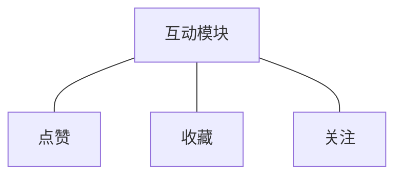
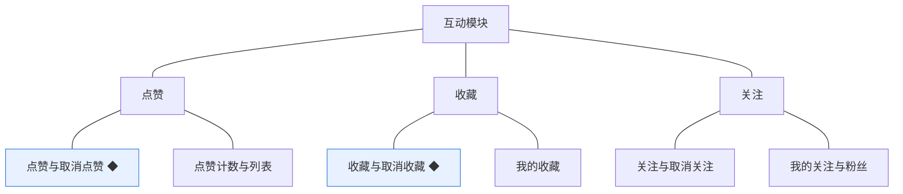
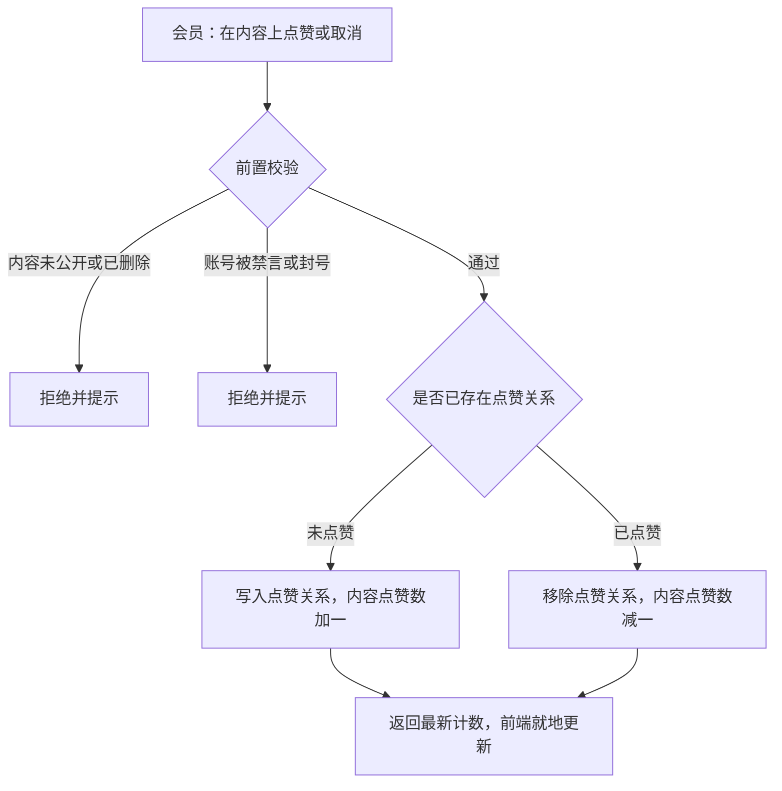
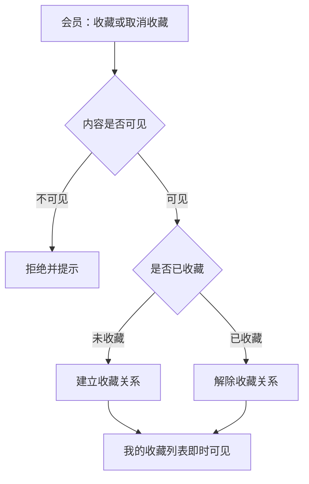

# 模块设计：互动模块

> 定位：对应技术文档《系统构成》中的「互动模块」，是总览第 2.5 节小节的同构放大。规则句末括注来源：D 为 PRD 关键设计决策编号、K 为技术文档关键技术决策、开发规范为 04A 条目、本轮建议为本模块拍板。

## 1. 职责与边界

**管**：内容与会员之间的轻量关系——点赞、收藏与关注，以及它们的计数与个人侧列表（我的收藏、我的关注与粉丝）。

**不管**：内容本身的发表与可见性归话题模块与问答与悬赏模块；消息送达归消息模块；内容删除后的关系失效由本模块按内容模块的通知执行。

**边界一句话**：本模块只记录"谁对什么表示了态度、谁关注了谁"，不判断内容能否公开。

## 2. 对象

### 2.1 对象结构

### 2.2 对象说明

**点赞**

- 定位：会员对内容的单次赞同标记，用于表达认可并参与内容热度判断。
- 关键组成：会员、内容标识、内容类型、时间。
- 关系与约束：同一会员对同一内容只计一次（开发规范·幂等）；取消即移除，不保留历史；内容删除后关系失效。

**收藏**

- 定位：会员把内容归入个人收藏夹的标记，形成个人的资料夹。
- 关键组成：会员、内容标识、内容类型、时间。
- 关系与约束：同一会员对同一内容只计一次；收藏关系在个人中心的我的收藏中呈现；内容删除后关系失效。

**关注**

- 定位：会员之间的单向关注关系，带来粉丝与内容订阅的语义。
- 关键组成：关注人、被关注人、时间。
- 关系与约束：不能关注自己（本轮建议）；取消即解除；被关注人注销或封号后关系保留但不产生新内容（本轮建议）。

### 2.3 共享对象

本模块不持有被其他模块使用的对象；点赞、收藏、关注仅在本模块与个人中心内使用，个人中心入口由会员与权限模块认领。

## 3. 功能

### 3.1 功能结构

### 3.2 点赞

| 功能 | 使用方 | 说明 |
|---|---|---|
| 点赞 | 会员 | 对已公开的话题、评论、问题或答案点赞 |
| 取消点赞 | 会员 | 撤销自己的点赞 |
| 点赞计数 | 前台页面 | 展示内容获得的赞同数 |
| 我的点赞 | 会员 | 查看自己点过赞的内容 |

### 3.3 收藏

| 功能 | 使用方 | 说明 |
|---|---|---|
| 收藏 | 会员 | 把已公开内容加入自己的收藏夹 |
| 取消收藏 | 会员 | 从收藏夹移除 |
| 我的收藏 | 会员 | 查看收藏列表并进入内容详情 |

### 3.4 关注

| 功能 | 使用方 | 说明 |
|---|---|---|
| 关注 | 会员 | 关注另一位会员 |
| 取消关注 | 会员 | 解除关注关系 |
| 我的关注 | 会员 | 查看自己关注的会员列表 |
| 我的粉丝 | 会员 | 查看关注自己的会员列表 |

### 3.5 复杂功能详述

**◆ 点赞与取消点赞**（谁、入口、做什么、结果）：会员在内容上点赞或取消，系统保证同一会员对同一内容只有一条关系记录，并同步更新内容的点赞计数。

- (1) 点赞关系以唯一约束保证幂等，重复请求不产生重复记录与重复计数（开发规范·幂等）。
- (2) 内容点赞数允许冗余存储，作为查询加速值，可由关系记录重算（开发规范·全局数据共识）。
- (3) 计数更新与关系写入同事务，不出现关系与计数不一致（开发规范·事务与一致性）。
- (4) 未公开内容不进入互动面（D3、话题模块契约·校验内容可见）。

**◆ 收藏与取消收藏**（谁、入口、做什么、结果）：会员收藏或取消收藏内容，收藏关系在其个人中心的我的收藏中呈现。

- (1) 收藏关系同样以唯一约束保证幂等（开发规范·幂等）。
- (2) 内容删除后由本模块解除关系，不保留悬空收藏（话题模块契约·删除连带）。
- (3) 收藏不向内容作者发提醒，避免打扰（本轮建议）。

## 4. 状态

**点赞、收藏、关注**（均无状态）：三者都只表达"存在或不存在"的关系事实，取消即删除关系记录，保留时间字段用于排序与展示；不承载生命周期，因此不设状态机。

## 5. 对外契约

| 操作 | 语义 | 调用方 | 关键约束 |
|---|---|---|---|
| 建立与解除关系 | 点赞、收藏、关注的写入与撤销 | 前台页面 | 以唯一约束保证幂等；写入时校验内容可见与账号可发言 |
| 读取内容互动态 | 当前会员对某内容的点赞、收藏状态 | 前台页面 | 只读 |
| 解除内容互动关系 | 内容删除后清理其上的点赞与收藏 | 话题、问答与悬赏 | 与内容删除同事务或紧随其后幂等执行（本轮建议） |
| 读取我的收藏 | 个人中心的收藏列表 | 会员与权限模块 | 只读 |
| 读取我的关注与粉丝 | 个人中心的关注与粉丝列表 | 会员与权限模块 | 只读 |

## 6. 待议与版本级事项

- **本轮建议**：不能关注自己；内容删除后由本模块幂等清理互动关系；收藏不触发提醒；被关注人封号后关注关系保留。
- **待业务确认**：关注是否带来内容订阅式的展示（如关注流），还是仅作为关系与粉丝数展示。
- **留版本级**：前台点赞与收藏按钮的交互与状态、我的收藏与关注列表的分页与排序。
- **明确不做**：私信以外的社交玩法（转发、@ 提醒、打赏）；点赞与收藏的排行榜。
- **关联评审**：若引入关注流或排行榜，需评审内容排序与查询加速方案，并评估是否引入新的统计口径。
