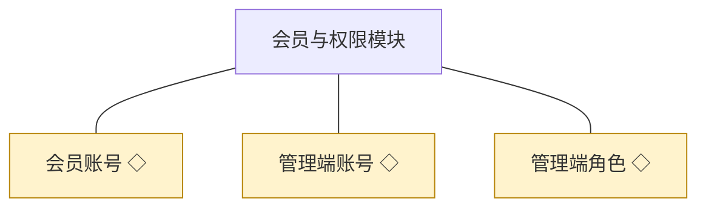
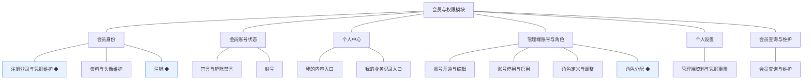
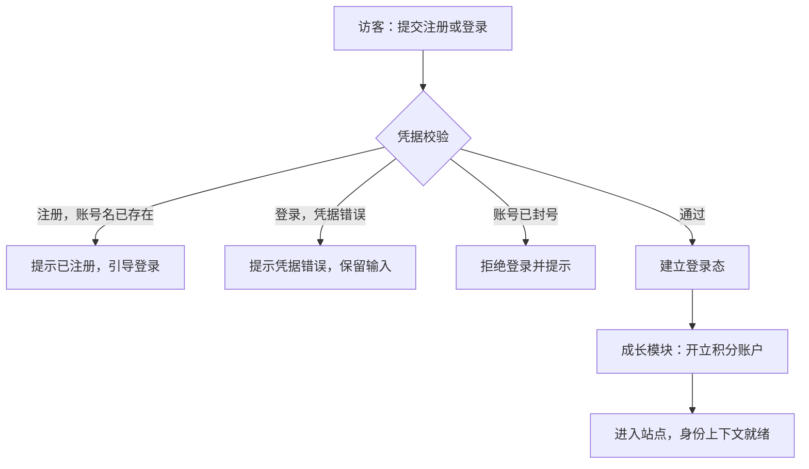
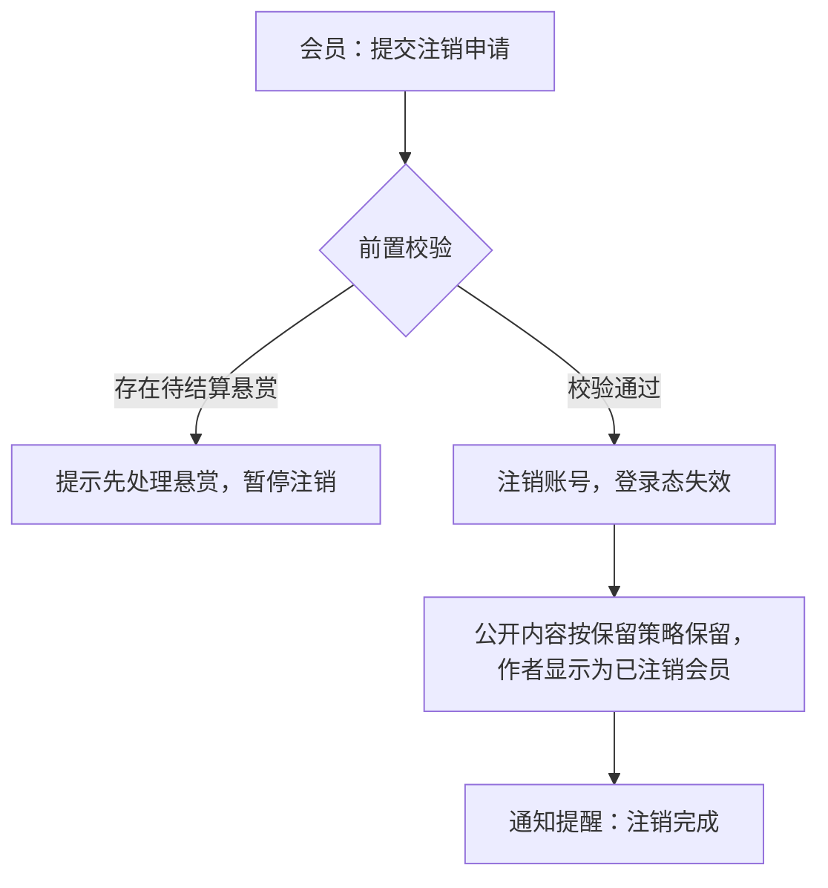
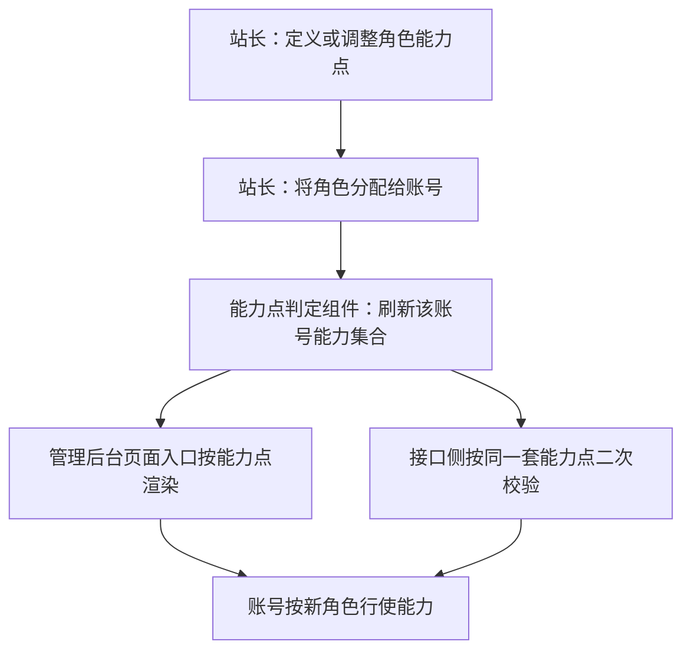
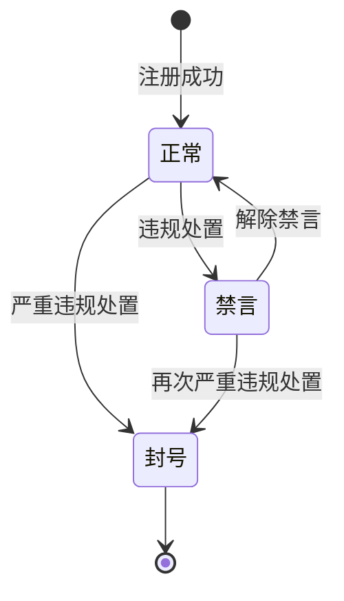
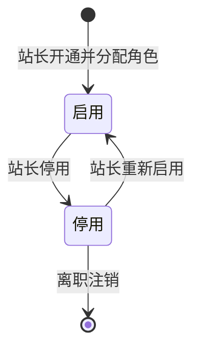

# 模块设计：会员与权限模块

> 定位：对应技术文档《系统构成》中的「会员与权限模块」，是总览第 2.1 节小节的同构放大。规则句末括注来源：D 为 PRD 关键设计决策编号、K 为技术文档关键技术决策、开发规范为 04A 条目、本轮建议为本模块拍板。

## 1. 职责与边界

**管**：身份本身——会员账号的注册、资料与凭据、账号状态与个人中心聚合入口，以及管理端账号与管理端角色的授权；个人中心的身份资料、凭据维护、我的内容与业务记录入口、注销都在本模块认领（D5、PRD 功能全景）。

**不管**：会员发表的话题与评论归话题模块；问题、答案与悬赏归问答与悬赏模块；点赞、收藏与关注归互动模块；积分与等级归成长模块；私信与通知提醒归消息模块；审核结论、举报与违规处置归审核与治理模块。

**边界一句话**：一切"这个身份是谁、还能不能使用"的判断在本模块，一切"这个身份做了什么"的规则在对应业务模块。

## 2. 对象

### 2.1 对象结构

### 2.2 对象说明

**会员账号**

- 定位：社区成员的身份，承载资料、凭据、账号状态，以及他在站内全部行为与记录的归属。
- 关键组成：编号、昵称、头像、登录凭据、账号状态、注册时间。
- 关系与约束：一人一个会员账号；状态为正常、禁言、封号，封号为终态（K 与术语表）；被内容、互动、消息与账本对象以标识引用；账号状态变更即时影响发言与登录。

**管理端账号**

- 定位：经营方与版主的登录身份。
- 关键组成：编号、账号名、凭据、所属角色集合、启停状态。
- 关系与约束：一个账号可持多个管理端角色（D5）；停用后不能登录，操作留痕仍可回溯（开发规范·留痕机制）。

**管理端角色**

- 定位：管理端能力的授权模板，把"能做什么"从"是谁"中分离出来。
- 关键组成：角色名、能力点集合、被分配的账号。
- 关系与约束：能力授予只经角色，不针对单个账号定制（D5）；页面入口与接口校验使用同一套能力点（开发规范·能力点判定）。

### 2.3 共享对象

| 对象 | 共享方式 | 使用方 | 使用契约 |
|---|---|---|---|
| 会员账号 | 标识引用，统一由本模块写入 | 话题、问答与悬赏、互动、消息、审核与治理、成长 | 他方只读身份摘要；账号状态与资料只能经本模块接口变更 |
| 管理端账号 | 标识引用，统一由本模块写入 | 审核与治理、运营与设置 | 他方以账号标识记录操作人，不修改账号本身 |
| 管理端角色 | 能力点判定结果引用 | 审核与治理、运营与设置 | 他方按能力点判定，不自行维护角色与能力对应 |

## 3. 功能

### 3.1 功能结构

### 3.2 会员身份

| 功能 | 使用方 | 说明 |
|---|---|---|
| 注册 | 访客 | 以账号密码方式建立会员账号，注册后即为会员（PRD 备忘·建议默认） |
| 登录 | 访客、会员 | 校验凭据后建立登录态 |
| 退出 | 会员 | 结束当前登录态 |
| 密码修改与重置 | 会员 | 凭据维护，重置后原登录态失效 |
| 资料与头像维护 | 会员 | 维护昵称、头像等对外信息 |
| 注销 | 会员 | 会员主动注销账号，注销后不可登录 |

### 3.3 会员账号状态

| 功能 | 使用方 | 说明 |
|---|---|---|
| 禁言 | 审核与治理模块 | 由违规处置触发，禁言期间不能发表内容、评论、作答、私信 |
| 解除禁言 | 审核与治理模块 | 解除后恢复正常发言 |
| 封号 | 审核与治理模块 | 终态处置，账号不能登录 |

### 3.4 个人中心

| 功能 | 使用方 | 说明 |
|---|---|---|
| 我的内容入口 | 会员 | 聚合展示自己发表的话题、评论、问题与答案并给出管理入口，内容本身归各内容模块 |
| 我的收藏 | 会员 | 展示互动模块持有的收藏关系 |
| 我的关注与粉丝 | 会员 | 展示互动模块持有的关注关系 |
| 我的积分与等级 | 会员 | 展示成长模块持有的账本与等级 |
| 我的私信与通知提醒 | 会员 | 进入消息模块的往来与提醒 |
| 我的资料与凭据 | 会员 | 本模块直接承载 |

### 3.5 管理端账号与角色

| 功能 | 使用方 | 说明 |
|---|---|---|
| 账号开通 | 站长 | 为内部人员建立管理端账号并分配初始角色 |
| 账号编辑 | 站长 | 修改账号资料 |
| 账号停用与启用 | 站长 | 停用后不能登录，可重新启用 |
| 账号注销 | 站长 | 离职注销，停用为终态的一种表达（术语表） |
| 角色定义与调整 | 站长 | 定义角色名与能力点集合 |
| 角色分配 | 站长 | 把角色分配给账号，一人可持多个 |

### 3.6 个人设置

| 功能 | 使用方 | 说明 |
|---|---|---|
| 管理端资料与凭据重置 | 站长、运营人员、版主 | 维护自身账号资料、重置凭据（PRD 功能全景·个人设置） |

### 3.7 会员查询与维护

| 功能 | 使用方 | 说明 |
|---|---|---|
| 会员查询与维护 | 运营人员 | 按昵称、编号与账号状态检索会员并维护其资料，支撑拉新与留存（PRD 功能全景·会员与内容管理；账号状态处置归审核与治理模块） |

### 3.8 复杂功能详述

**◆ 注册登录与凭据维护**（谁、入口、做什么、结果）：访客在注册登录页建立账号或登录，会员在个人设置中维护凭据；成功则建立登录态并开立积分账户，失败按原因返回明确提示。

- (1) 注册与登录共用一套凭据校验，凭据错误提示不区分账号是否存在（本轮建议）。
- (2) 登录态由统一鉴权组件解析为身份上下文，业务模块不得自行解析（开发规范·鉴权与身份上下文）。
- (3) 账号封号为终态，登录一律拒绝（K·概念数据模型与状态机）。
- (4) 凭据重置后，该账号既有登录态全部失效（本轮建议）。
- (5) 积分账户开立与账号创建在同一事务内完成，避免出现无账本的账号（K·积分结算用事务保证）。

**◆ 会员注销**（谁、入口、做什么、结果）：会员在个人中心申请注销，系统校验其未结事项后执行注销；注销后账号不可登录，公开内容保留（PRD 备忘·待业务确认，按保留处理）。

- (1) 待结算悬赏与未完成事务是注销的前置阻断项（本轮建议）。
- (2) 注销后不可再用同一账号登录，原账号名不可被他人注册占用（本轮建议）。
- (3) 内容保留策略由本规则确定方向，具体保留范围留版本级（PRD 备忘·待业务确认）。

**◆ 角色分配（授权）**（谁、入口、做什么、结果）：站长在管理后台定义角色能力点并分配给账号，变更即时生效。

- (1) 能力授予只经角色，不针对账号定制（D5）。
- (2) 页面入口与接口校验必须同源，缺一不可（开发规范·能力点判定）。
- (3) 角色调整必须留痕：记录操作人、时间、变更前后能力点（开发规范·留痕机制）。
- (4) 账号被停用后，其角色保留但不再生效（本轮建议）。

## 4. 状态

**会员账号**（有状态）：

| 流转 | 触发条件 | 伴随动作与约束 |
|---|---|---|
| 正常 → 禁言 | 审核与治理模块作出禁言处置 | 同事务写入处置通知；禁言期间发言类操作一律拒绝 |
| 禁言 → 正常 | 解除禁言 | 通知会员；历史内容不恢复自动公开 |
| 正常 → 封号 | 严重违规处置 | 登录态全部失效；终态 |
| 禁言 → 封号 | 禁言期间再次严重违规 | 登录态全部失效；终态 |

**管理端账号**（有状态）：启用与停用，停用后不能登录；离职注销进入停用终态表达（术语表）。

| 流转 | 触发条件 | 伴随动作与约束 |
|---|---|---|
| 启用 → 停用 | 站长停用账号 | 停用后不能登录；角色保留但不生效（本轮建议）；操作留痕仍可回溯（开发规范·留痕机制） |
| 停用 → 启用 | 站长重新启用 | 恢复登录，角色即行生效 |
| 停用 → 终结（离职注销） | 站长注销离职人员账号 | 停用为终态的一种表达、不能再启用（术语表）；账号名注销后不可复用（本轮建议） |

**管理端角色**（无状态）：角色是配置型对象，以能力点集合表达授权范围，自身不承载生命周期，变更以留痕记录表达。

## 5. 对外契约

| 操作 | 语义 | 调用方 | 关键约束 |
|---|---|---|---|
| 解析登录态 | 由统一鉴权组件给出身份上下文 | 各业务模块 | 业务模块不得自行解析登录态 |
| 读取会员摘要 | 展示昵称、头像、等级等信息 | 话题、问答与悬赏、互动、消息 | 只读；等级取自成长模块判定结果 |
| 校验可否发言 | 发言类操作的前置校验 | 话题、问答与悬赏、互动、消息 | 禁言与封号一律拒绝 |
| 查询与维护会员 | 运营侧检索会员并维护资料 | 管理后台（运营人员） | 只读身份摘要；账号状态变更仍走审核与治理模块 |
| 变更会员账号状态 | 执行禁言、解除禁言、封号 | 审核与治理模块 | 与处置记录同事务；封号为终态 |
| 能力点判定 | 给出管理端账号的能力集合 | 审核与治理、运营与设置 | 页面与接口使用同一套判定 |
| 查询账号操作人 | 记录与展示操作人信息 | 审核与治理、运营与设置 | 只读 |

## 6. 待议与版本级事项

- **本轮建议**：注册与登录共用凭据校验并不泄露账号是否存在；凭据重置使既有登录态失效；账号名在注销后不可复用；停用账号的角色保留不生效。
- **待业务确认**：会员注销后公开内容的保留范围与作者显示方式（PRD 备忘已登记）；禁言是否设期限与解除方式（PRD 备忘已登记）。
- **留版本级**：注册与登录页的具体字段与交互、头像上传的限制、密码强度口径、管理后台页面的列表与筛选交互。
- **明确不做**：第三方登录与短信通道（PRD 备忘与 K·明确不采用）；多站点与多租户的账号体系（D2）。
- **关联评审**：若后续引入第三方登录，需重新评审本模块的凭据维护与登录态规则，并同步技术文档的鉴权决策。
