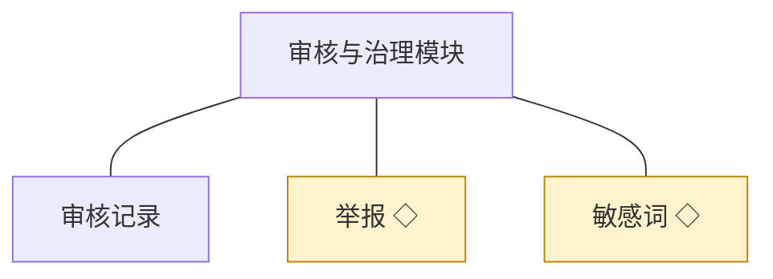
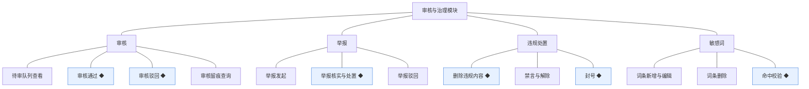
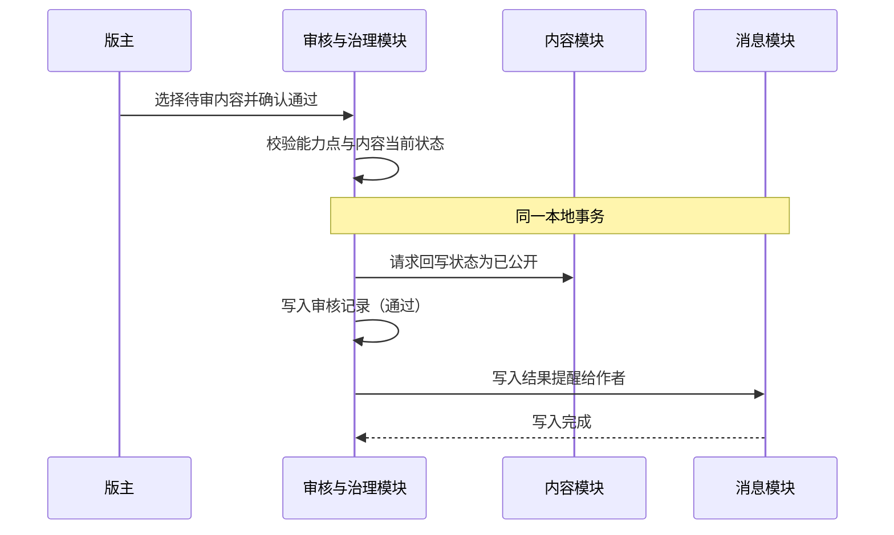
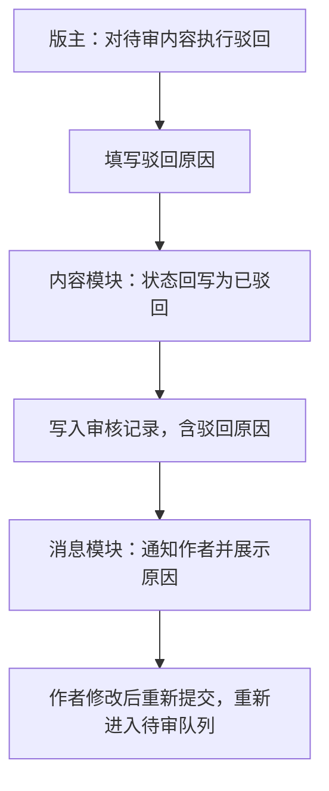
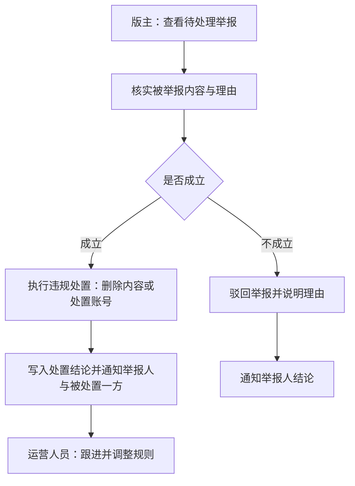
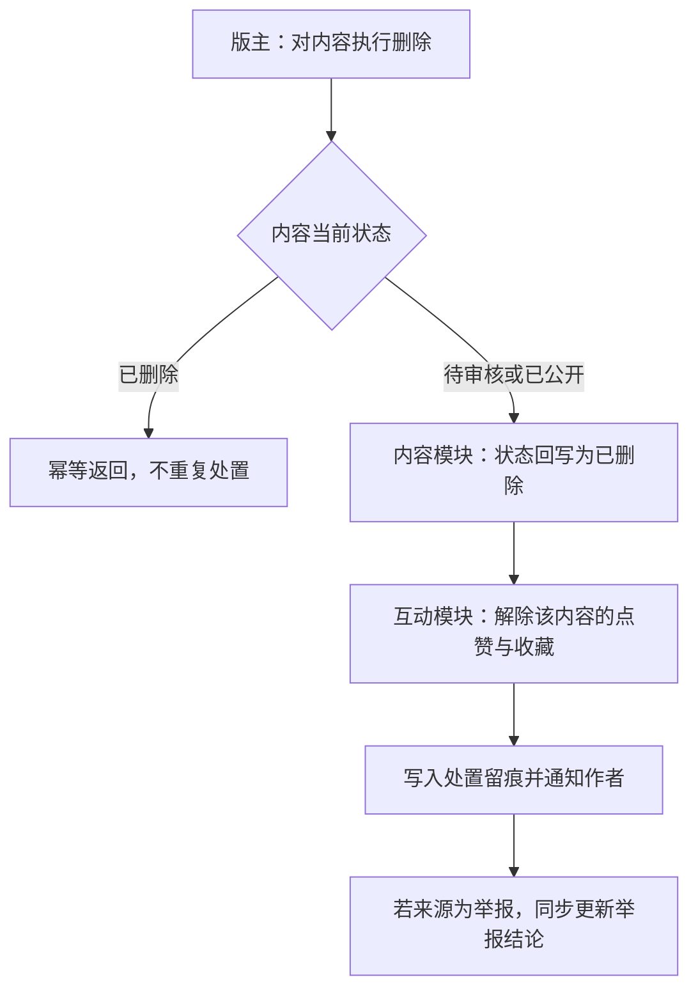
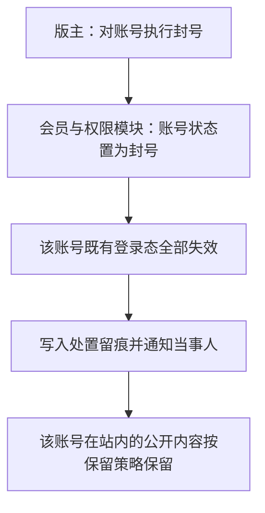
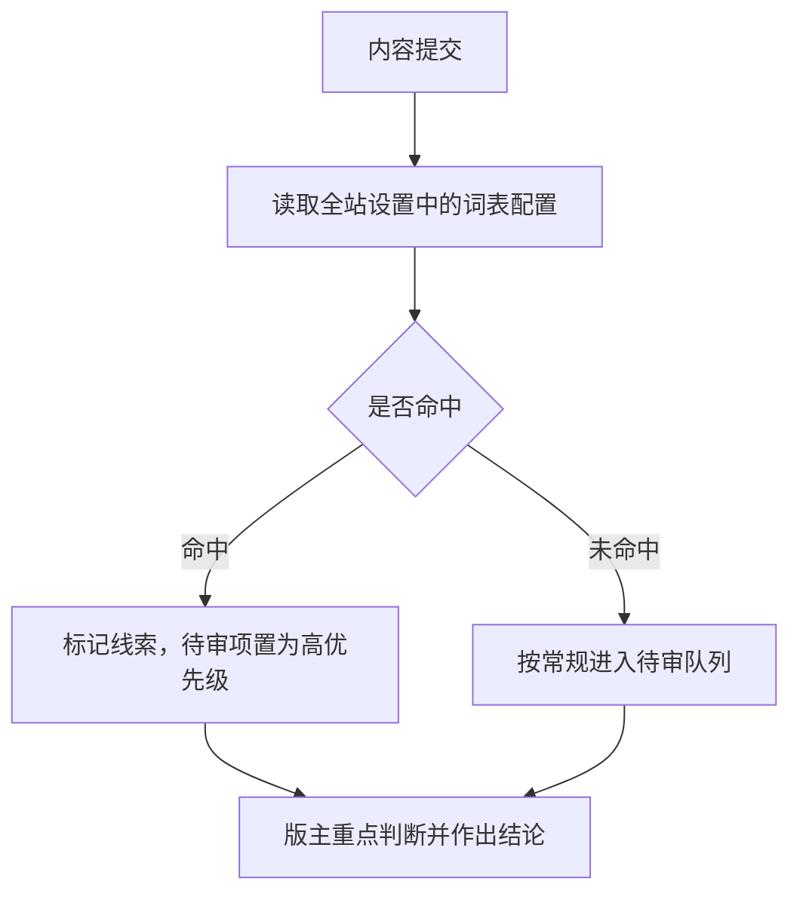
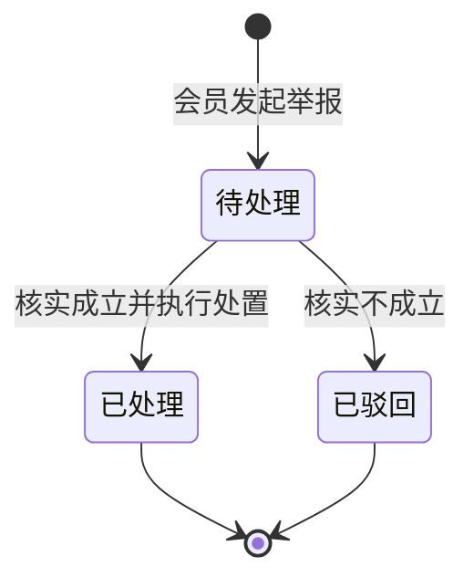

# 模块设计：审核与治理模块

> 定位：对应技术文档《系统构成》中的「审核与治理模块」，是总览第 2.7 节小节的同构放大。规则句末括注来源：D 为 PRD 关键设计决策编号、K 为技术文档关键技术决策、开发规范为 04A 条目、本轮建议为本模块拍板。

## 1. 职责与边界

**管**：内容审核（先审后发的队列、结论与留痕）、举报的受理与处置、敏感词词表、违规处置动作（删帖、禁言、封号及其解除）。

**不管**：内容本身的发表、编辑与可见权限归话题模块与问答与悬赏模块（本模块只作出结论与发起处置，状态回写由内容模块执行）；账号状态的实际变更归会员与权限模块；审核策略与规则配置入口归运营与设置模块。

**边界一句话**：本模块握有"能不能公开、要不要处置"的判断权，但内容的写入与账号的写入都发生在对象持有方。

## 2. 对象

### 2.1 对象结构

### 2.2 对象说明

**审核记录**

- 定位：先审后发的留痕，记录谁在什么时候以什么结论审了什么内容。
- 关键组成：编号、审核人、被审内容标识与类型、结论、驳回原因、时间。
- 关系与约束：只增不改（开发规范·只增不改的记录型对象口径）；结论为通过或驳回；与内容状态变更同事务写入（D3）；驳回原因对作者可见（PRD 功能全景·驳回与说明）。

**举报**

- 定位：会员对违规内容的报告，治理闭环的触发入口。
- 关键组成：编号、举报人、被举报内容标识与类型、举报理由、处理结论、处置人、时间。
- 关系与约束：状态为待处理、已处理、已驳回，均为明确终态（术语表）；结论通知举报人与被处置一方（PRD 功能全景·违规处置）。

**敏感词**

- 定位：内容审核的拦截词表，作为审核线索的兜底。
- 关键组成：编号、词条、启停状态。
- 关系与约束：由全站设置登记配置（总览协作约束表·规则读取）；命中只作为线索，不单独构成驳回理由（本轮建议）。

### 2.3 共享对象

| 对象 | 共享方式 | 使用方 | 使用契约 |
|---|---|---|---|
| 举报 | 标识引用，统一由本模块写入 | 会员与权限（个人中心入口） | 会员侧只读自己的举报记录与结论 |
| 敏感词 | 标识引用，统一由本模块写入 | 运营与设置 | 运营侧在审核策略中配置词表，不做内容判断 |

## 3. 功能

### 3.1 功能结构

### 3.2 审核

| 功能 | 使用方 | 说明 |
|---|---|---|
| 待审队列查看 | 版主 | 按类型与时间查看待审内容，支持按板块与作者筛选 |
| 审核通过 | 版主 | 结论通过，内容公开 |
| 审核驳回 | 版主 | 结论驳回并填写原因，通知作者 |
| 审核留痕查询 | 站长、版主 | 按内容或操作人查询历史审核记录 |

### 3.3 举报

| 功能 | 使用方 | 说明 |
|---|---|---|
| 举报发起 | 会员 | 对已公开内容提交举报并说明理由 |
| 举报核实与处置 | 版主 | 核实后作出处置或驳回，结论通知相关方 |
| 举报驳回 | 版主 | 举报不成立时驳回并说明理由 |
| 我的举报 | 会员 | 在个人中心查看自己发起的举报与结论 |

### 3.4 违规处置

| 功能 | 使用方 | 说明 |
|---|---|---|
| 删除违规内容 | 版主 | 对内容执行删除，删除为终态 |
| 禁言与解除 | 版主 | 对账号执行禁言或解除 |
| 封号 | 版主 | 对账号执行封号，终态处置 |

### 3.5 敏感词

| 功能 | 使用方 | 说明 |
|---|---|---|
| 词条新增与编辑 | 站长 | 维护拦截词表 |
| 词条删除 | 站长 | 移除不再需要的词条 |
| 命中校验 | 系统（内容提交时） | 内容命中词表时标记并优先交版主判断 |

### 3.6 复杂功能详述

**◆ 审核通过**（谁、入口、做什么、结果）：版主在待审队列中通过一条内容，内容状态由内容模块回写为已公开，审核记录留痕，作者收到结果提醒。

- (1) 审核前必须校验内容仍处于待审核，防止重复审核产生重复记录（开发规范·条件更新）。
- (2) 内容状态回写、审核记录与通知必须在同一事务内完成（D3、总览协作约束表）。
- (3) 通过操作必须校验操作人的能力点，页面入口与接口同源（D5、开发规范·能力点判定）。

**◆ 审核驳回**（谁、入口、做什么、结果）：版主驳回一条内容并填写原因，内容状态回写为已驳回，作者收到含原因的提醒。

- (1) 驳回原因必填，且对作者可见（PRD 功能全景·驳回与说明）。
- (2) 问答类内容的驳回同时触发悬赏积分退回，退回动作由问答与悬赏模块在同一事务内完成（问答与悬赏模块契约）。
- (3) 驳回不改变内容的作者归属与历史记录，仅改状态（本轮建议）。

**◆ 举报核实与处置**（谁、入口、做什么、结果）：版主核实举报，成立则执行处置并同步结论，不成立则驳回举报；两种结果都通知举报人。

- (1) 举报状态与处置结论、通知同事务写入（总览协作约束表·违规处置）。
- (2) 举报与处置结论均需留痕：记录处置人、时间、理由（开发规范·留痕机制）。
- (3) 一名举报人对同一内容的重复举报做合并处理，避免队列重复（本轮建议）。

**◆ 删除违规内容**（谁、入口、做什么、结果）：版主对违规内容执行删除，内容进入已删除终态并解除其上的互动关系。

- (1) 删除为终态，不提供恢复（术语表）。
- (2) 被采纳的答案不执行删除，改为保留内容并标记处置结果（问答与悬赏模块契约）。
- (3) 删除与互动关系清理、留痕、通知同事务（D6、总览协作约束表）。
- (4) 重复删除请求幂等处理，不产生多条处置记录（开发规范·幂等）。

**◆ 封号**（谁、入口、做什么、结果）：版主对严重违规的会员账号执行封号，账号进入终态并失去登录与发言能力。

- (1) 封号为终态，不可解除（术语表）；如需恢复只能新开账号（本轮建议）。
- (2) 封号与禁言同为版主的违规处置手段（PRD 功能全景·违规处置、D6）。
- (3) 处置必须留痕并与账号状态变更同事务（开发规范·留痕机制）。

**◆ 敏感词命中校验**（谁、入口、做什么、结果）：内容提交时对标题与正文做词表匹配，命中则标记为高优先级线索进入待审队列。

- (1) 词表一律从全站设置读取，不在本模块或内容模块写死（总览协作约束表·规则读取）。
- (2) 命中只作为线索，不自动驳回（本轮建议、D3）。
- (3) 匹配在提交时同步完成，失败不阻断提交，仅记录未命中原因供排查（本轮建议）。

## 4. 状态

**举报**（有状态）：

| 流转 | 触发条件 | 伴随动作与约束 |
|---|---|---|
| 待处理 → 已处理 | 举报成立 | 执行违规处置；通知举报人与被处置一方；终态 |
| 待处理 → 已驳回 | 举报不成立 | 驳回并说明理由；通知举报人；终态 |

**审核记录、敏感词**（无状态）：审核记录是只增不改的留痕，敏感词是词表配置，两者都不承载生命周期。

## 5. 对外契约

| 操作 | 语义 | 调用方 | 关键约束 |
|---|---|---|---|
| 提交待审项 | 内容提交后进入待审队列 | 话题、问答与悬赏 | 与内容写入同事务；含敏感词命中线索 |
| 回写状态请求 | 内容模块执行状态变更 | 本模块调用内容模块 | 必须与审核记录同事务 |
| 处置请求 | 删除内容、禁言、封号 | 本模块调用内容模块与会员与权限模块 | 与处置留痕同事务；终态不可逆 |
| 读取审核记录 | 留痕查询 | 运营与设置 | 只读 |
| 校验能力点 | 处置前的权限判定 | 本模块内部调用会员与权限模块 | 页面与接口同一套判定 |
| 读取我的举报 | 个人中心的举报记录 | 会员与权限模块 | 只读，按举报人过滤 |

## 6. 待议与版本级事项

- **本轮建议**：敏感词命中只作线索；重复举报合并；被采纳答案不删除；封号为终态不可解除；待审项校验当前状态防重复审核。
- **待业务确认**：禁言的期限与解除条件（PRD 备忘已登记）；被处置内容的公开可见性回溯范围（是否连带隐藏同作者其他内容）。
- **留版本级**：待审队列的筛选与排序、批量处置的交互、驳回原因的常用原因选择项、举报入口的呈现位置。
- **明确不做**：自动审核与机器判定（PRD 明确不做 AI 助手）；申诉流程（本轮不纳入，待业务提出后再评审）。
- **关联评审**：若引入申诉或自动审核，需评审处置结论的可逆性与留痕口径，并同步开发规范的幂等与留痕条目。
