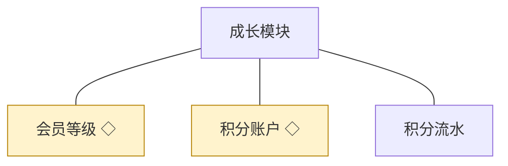
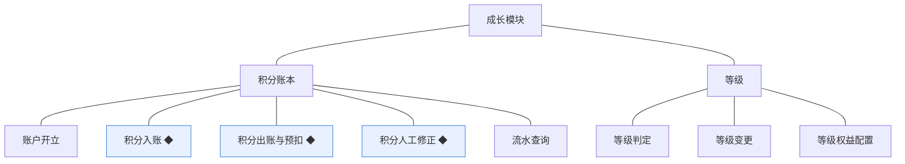
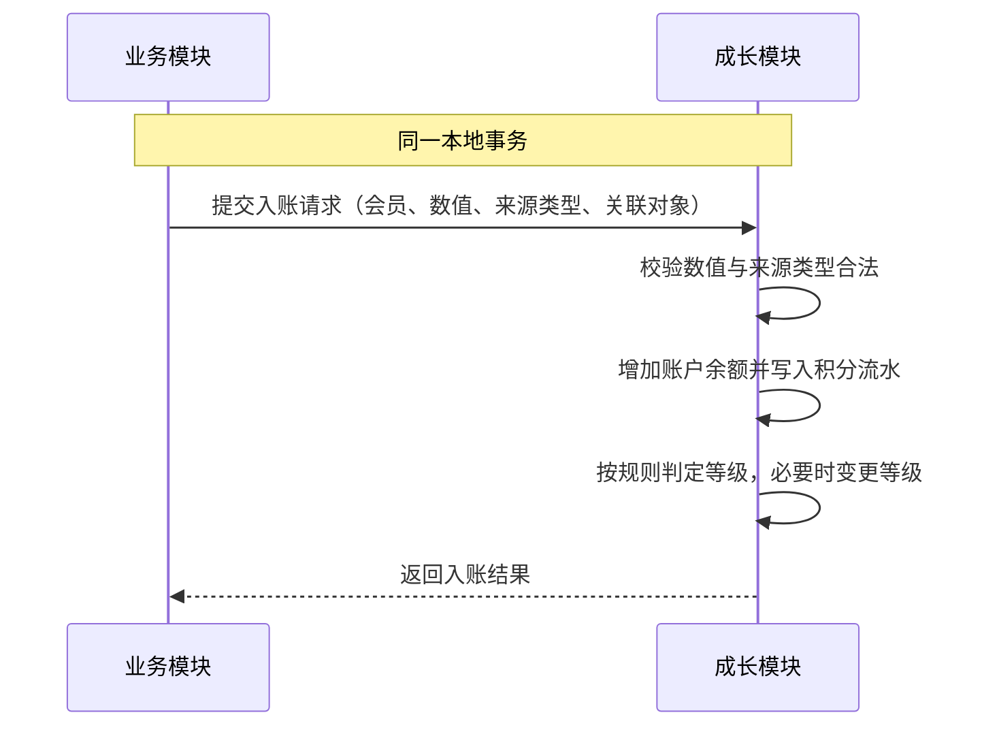
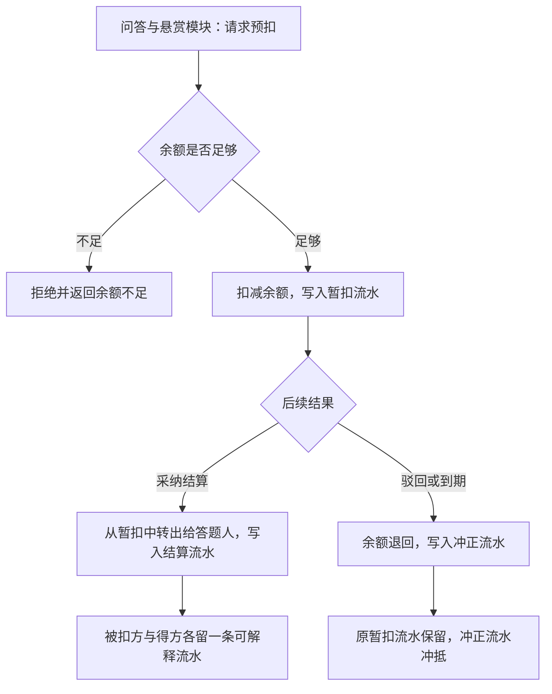
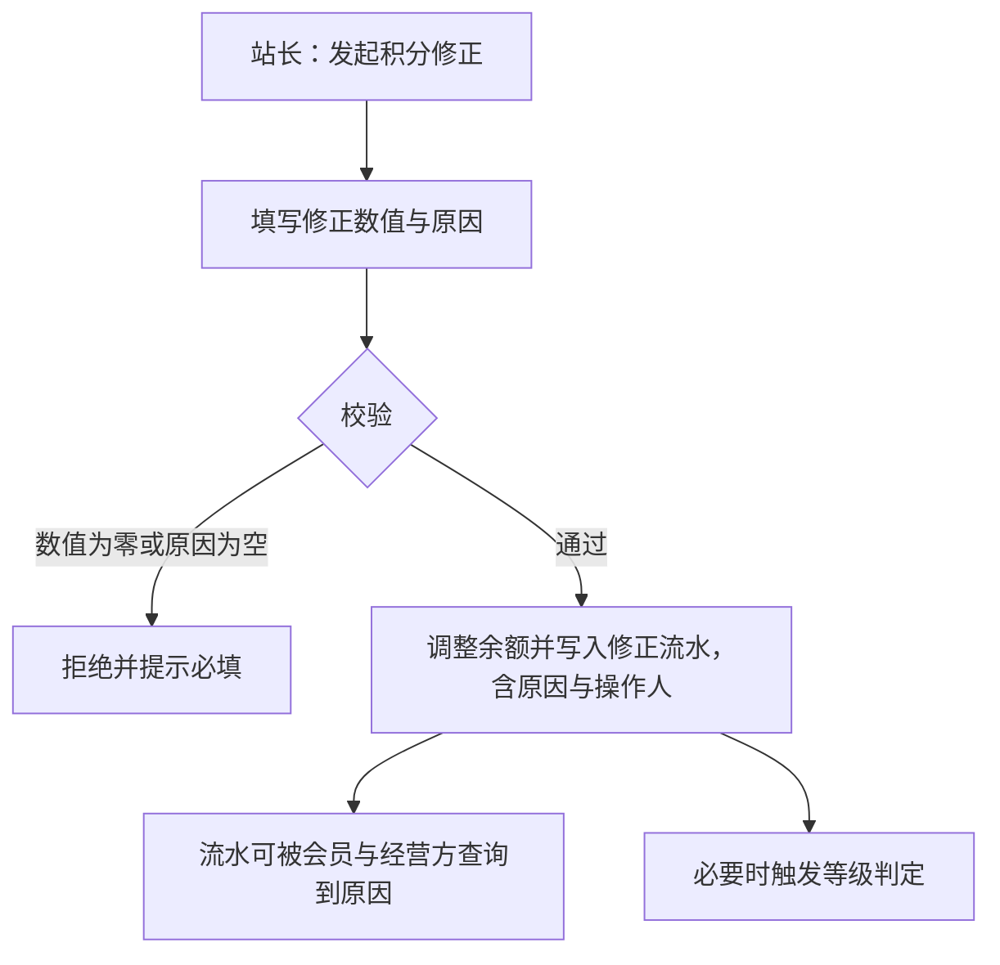

# 模块设计：成长模块

> 定位：对应技术文档《系统构成》中的「成长模块」，是总览第 2.8 节小节的同构放大。规则句末括注来源：D 为 PRD 关键设计决策编号、K 为技术文档关键技术决策、开发规范为 04A 条目、本轮建议为本模块拍板。

## 1. 职责与边界

**管**：积分账本与成长分层——积分账户的开立、入账、出账与人工修正，积分流水的记录与查询，等级判定、等级变更与权益配置口径。

**不管**：积分由什么行为触发归各业务模块（本模块只接受入账与出账请求）；等级与积分规则的配置入口归运营与设置模块；会员身份与账号状态归会员与权限模块。

**边界一句话**：本模块是站内价值凭证的唯一账本，任何余额变动都必须经本模块、并留下流水。

## 2. 对象

### 2.1 对象结构

### 2.2 对象说明

**会员等级**

- 定位：会员成长的分层，决定可见内容与权限的开放程度。
- 关键组成：等级名、所需积分门槛、开放的可见范围与权限。
- 关系与约束：等级规则从全站设置读取（总览协作约束表·规则读取）；等级由积分判定得出，不单独人工指定（本轮建议）；等级变化即时生效。

**积分账户**

- 定位：会员积分余额的账本，与会员账号一一对应。
- 关键组成：所属会员、余额、最近变动时间。
- 关系与约束：账号创建时开立（会员与权限模块契约）；余额只能经本模块的入账、出账与修正变更；余额必须可由流水重算（开发规范·事务与一致性）。

**积分流水**

- 定位：积分每一次增减的记录，说明来源与去向。
- 关键组成：编号、所属账户、方向（入账／出账）、数值、来源类型、关联对象、时间。
- 关系与约束：只增不改；冲正以反向流水表达，不删除原流水（开发规范·变动类数据留流水）；每条流水对应一次可解释的变动。

### 2.3 共享对象

| 对象 | 共享方式 | 使用方 | 使用契约 |
|---|---|---|---|
| 会员等级 | 等级判定结果引用 | 会员与权限、话题、问答与悬赏 | 他方只读等级与开放权限，不直接改等级 |
| 积分账户 | 统一的入账与出账接口 | 问答与悬赏、审核与治理 | 使用方提交数值与来源类型，不直接改余额；接口保证余额与流水一致 |

## 3. 功能

### 3.1 功能结构

### 3.2 积分账本

| 功能 | 使用方 | 说明 |
|---|---|---|
| 账户开立 | 会员与权限模块 | 会员注册时开立积分账户，初始余额为零 |
| 积分入账 | 话题、问答与悬赏、审核与治理 | 行为奖励与结算入账 |
| 积分出账与预扣 | 问答与悬赏 | 提问设置悬赏时预扣，结算或退回时转出 |
| 人工修正 | 站长 | 对异常账目做人工修正，必须填写原因 |
| 流水记录 | 本模块内部 | 每次变动写入一条流水 |
| 流水查询 | 会员、站长、运营人员 | 会员查自己的流水；经营方按会员与时间查询 |

### 3.3 等级

| 功能 | 使用方 | 说明 |
|---|---|---|
| 等级判定 | 系统（积分变动时） | 按全站设置的积分门槛判定所在等级 |
| 等级变更 | 系统 | 判定结果与原等级不同时变更并生效 |
| 等级权益配置 | 站长 | 在各等级上配置开放的可见范围与权限 |
| 等级展示 | 会员、前台页面 | 展示当前等级与距下一等级的积分差 |

### 3.4 复杂功能详述

**◆ 积分入账**（谁、入口、做什么、结果）：业务模块在行为成立或结算时请求入账，本模块在同一事务内增加余额、写入流水，并触等级判定。

- (1) 入账必须与业务变更同事务，不出现"业务成功但积分未到账"（开发规范·事务与一致性）。
- (2) 每条入账必须带来源类型与关联对象，流水可追溯到具体行为（本轮建议）。
- (3) 余额与流水同时写入，余额可由流水重算（开发规范·事务与一致性）。
- (4) 入账后即时判定等级，等级变更不单独发通知（本轮建议，留版本级决定是否提醒）。

**◆ 积分出账与预扣**（谁、入口、做什么、结果）：提问设置悬赏时预扣积分，采纳时转出给答题人，驳回或到期时冲正退回；每一步都留下流水。

- (1) 预扣与扣减必须在同一事务内完成，不允许余额为负（开发规范·事务与一致性）。
- (2) 冲正以反向流水表达，不删除原流水（开发规范·变动类数据留流水）。
- (3) 结算与退回的调用方为问答与悬赏模块，本模块只执行记账（对外契约）。
- (4) 转出与退回都必须可追溯至悬赏对象，流水携带关联对象标识（本轮建议）。

**◆ 积分人工修正**（谁、入口、做什么、结果）：站长对异常账目做人工修正，填写修正数值与原因，生成带原因的修正流水。

- (1) 人工修正属于契约类写操作，必须留痕并可追溯操作人与原因（开发规范·留痕机制）。
- (2) 修正不得把余额改为负数（本轮建议）。
- (3) 修正流水与自动流水同表记录，以来源类型区分（本轮建议）。

## 4. 状态

**积分账户**（无状态）：账户是账本余额的载体，以流水表达历史，不承载生命周期；开户即存在，账号注销后账户随身份停用。

**积分流水**（无状态）：只增不改的记录，冲正以反向记录表达，不改写历史。

**会员等级**（无状态）：等级是判定结果而非流程状态，随积分变化即时重算；等级本身不设"生效／失效"状态，规则变更从全站设置读取后即时作用。

## 5. 对外契约

| 操作 | 语义 | 调用方 | 关键约束 |
|---|---|---|---|
| 开立积分账户 | 会员注册时建立账本 | 会员与权限模块 | 与账号创建同事务；重复调用幂等 |
| 请求积分入账 | 行为或结算带来的余额增加 | 话题、问答与悬赏、审核与治理 | 与业务变更同事务；带来源类型与关联对象 |
| 请求积分预扣与转出 | 悬赏设置、结算与退回 | 问答与悬赏 | 余额不足一律拒绝；冲正以反向流水表达 |
| 请求人工修正 | 异常账目修正 | 运营与设置（站长操作） | 原因必填；留痕可追溯 |
| 读取账户与流水 | 个人中心与经营方查询 | 会员与权限模块 | 只读；个人只读自己的账本 |
| 读取等级判定结果 | 权限与可见性判定使用 | 会员与权限、话题、问答与悬赏 | 只读 |

## 6. 待议与版本级事项

- **本轮建议**：等级由积分判定、不人工指定；每条流水带来源类型与关联对象；冲正保留原流水；修正原因必填；余额不得为负。
- **待业务确认**：各行为的具体积分值与等级门槛（PRD 备忘·建议默认，留版本级配置）；等级变更是否发提醒。
- **留版本级**：积分与等级规则的配置项与页面、流水与等级的展示形态、行为奖励的具体数值。
- **明确不做**：积分商城与积分兑换实物（输入未出现，本轮不纳入）；真实资金与积分互兑（D4、K·明确不采用）。
- **关联评审**：若引入积分兑换或积分有效期，需评审余额与流水的过期处理机制，并同步问答与悬赏的预扣规则。
