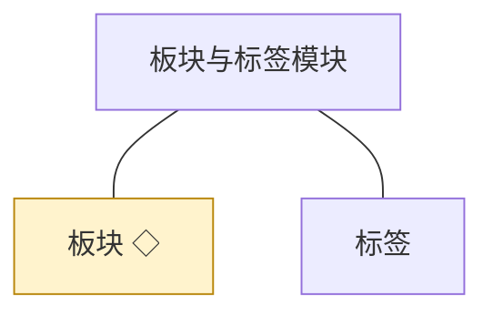
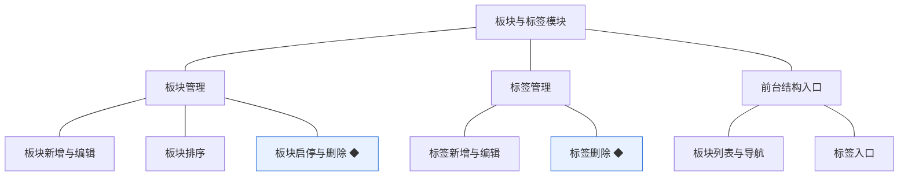
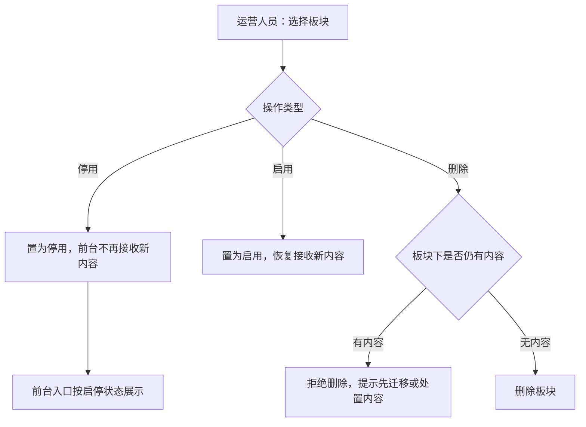
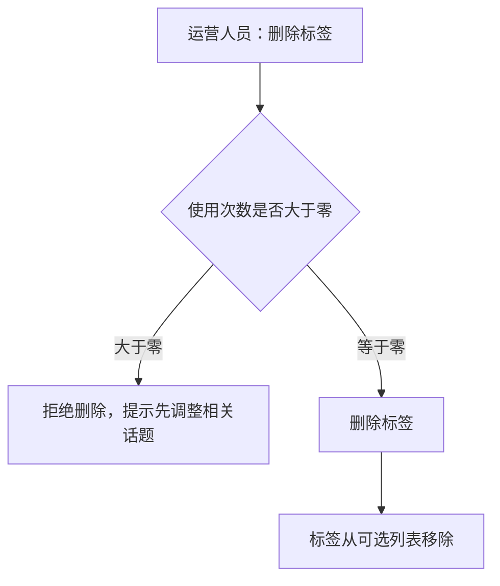
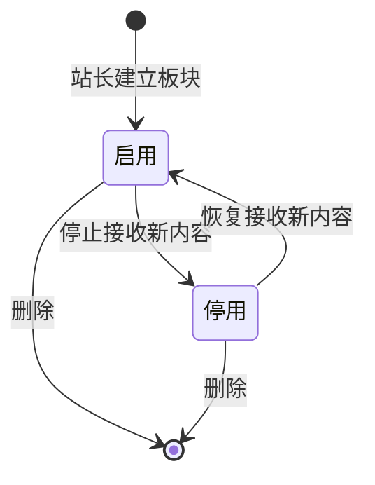

# 模块设计：板块与标签模块

> 定位：对应技术文档《系统构成》中的「板块与标签模块」，是总览第 2.2 节小节的同构放大。规则句末括注来源：D 为 PRD 关键设计决策编号、K 为技术文档关键技术决策、开发规范为 04A 条目、本轮建议为本模块拍板。

## 1. 职责与边界

**管**：站点结构——板块的建立、编排与启停，标签的维护与使用计数，为内容提供去处与横向归类。

**不管**：话题与评论归话题模块；问题与答案归问答与悬赏模块；内容的审核与处置归审核与治理模块；板块与标签在管理后台的页面交互归版本级。

**边界一句话**：本模块只回答"内容放在哪里、怎么被找到"，不回答"内容是什么、能不能公开"。

## 2. 对象

### 2.1 对象结构

### 2.2 对象说明

**板块**

- 定位：内容的一级去处，决定话题与问题归入哪里，并作为前台浏览的主入口。
- 关键组成：编号、名称、说明、排序值、启停状态。
- 关系与约束：板块被话题与问题以标识引用（K·概念数据模型）；停用板块不接收新内容，已有内容仍可读（本轮建议）；排序值决定前台展示次序。

**标签**

- 定位：话题的横向归类标记，让同类讨论跨板块被找到。
- 关键组成：编号、名称、使用次数。
- 关系与约束：与话题多对多，标注关系由话题模块持有；被使用中的标签不可删除（PRD 功能全景·标签维护与删除语义，本轮建议细化）。

### 2.3 共享对象

| 对象 | 共享方式 | 使用方 | 使用契约 |
|---|---|---|---|
| 板块 | 标识引用，统一由本模块写入 | 话题、问答与悬赏、运营与设置 | 内容方只读板块信息与启停状态；启停判定以本模块接口为准 |

## 3. 功能

### 3.1 功能结构

### 3.2 板块管理

| 功能 | 使用方 | 说明 |
|---|---|---|
| 板块新增 | 站长 | 建立板块并设定名称与说明 |
| 板块编辑 | 站长、运营人员 | 修改名称、说明与排序值 |
| 板块排序 | 站长、运营人员 | 调整前台展示次序 |
| 板块停用与启用 | 站长、运营人员 | 停用后不接收新内容，已有内容仍可读 |
| 板块删除 | 站长 | 板块下无内容时才可删除 |

### 3.3 标签管理

| 功能 | 使用方 | 说明 |
|---|---|---|
| 标签新增 | 运营人员 | 建立标签供发帖选用 |
| 标签编辑 | 运营人员 | 修改标签名称 |
| 标签删除 | 运营人员 | 未被任何话题使用时才可删除 |

### 3.4 前台结构入口

| 功能 | 使用方 | 说明 |
|---|---|---|
| 板块列表与导航 | 访客、会员 | 按板块浏览话题与问题 |
| 板块内容列表 | 访客、会员 | 板块内按时间与热度呈现内容 |
| 标签入口 | 访客、会员 | 按标签查看同类话题 |

### 3.5 复杂功能详述

**◆ 板块启停与删除**（谁、入口、做什么、结果）：运营人员在管理后台停用、启用或删除板块；停用与删除都要先处理其下内容，避免出现无归属内容。

- (1) 停用只影响新增，已公开内容仍可读（本轮建议）。
- (2) 删除前必须校验板块下无话题与问题，被引用不可删（开发规范·被引用不可删的删除语义）。
- (3) 板块启停与删除必须留痕：记录操作人、时间、变更内容（开发规范·留痕机制）。
- (4) 板块变更即时影响前台入口与内容提交校验，不做延迟生效（本轮建议）。

**◆ 标签删除**（谁、入口、做什么、结果）：运营人员删除不再使用的标签；被话题使用的标签不能删除，避免话题出现悬空标注。

- (1) 使用次数以话题模块持有的标注关系为准，不作为可独立维护的数值（本轮建议）。
- (2) 删除后不影响历史话题正文，仅移除可选与入口（本轮建议）。
- (3) 删除动作留痕（开发规范·留痕机制）。

## 4. 状态

**板块**（有状态）：启用与停用两态，停用不是删除，可回退；删除为不可逆动作，前置条件是板块下无内容。

| 流转 | 触发条件 | 伴随动作与约束 |
|---|---|---|
| 启用 → 停用 | 站长、运营人员停用 | 只影响新增，已公开内容仍可读（本轮建议）；前台不再接收新内容 |
| 停用 → 启用 | 站长、运营人员启用 | 恢复接收新内容 |
| 启用／停用 → 删除 | 站长删除板块 | 前置校验板块下无话题与问题，被引用不可删（开发规范·被引用不可删的删除语义）；不可逆；删除留痕 |

**标签**（无状态）：标签是配置型对象，只有存在与不存在两种事实，使用次数由标注关系派生，不承载生命周期。

## 5. 对外契约

| 操作 | 语义 | 调用方 | 关键约束 |
|---|---|---|---|
| 读取板块信息 | 给出板块名称、说明与启停状态 | 话题、问答与悬赏 | 只读 |
| 校验板块可提交 | 内容提交前的板块校验 | 话题、问答与悬赏 | 停用板块一律拒绝新内容 |
| 读取标签列表 | 发帖时的标签候选 | 话题 | 只读 |
| 维护标签使用次数 | 标注关系变化时同步计数 | 话题 | 由本模块按标注关系重算，不接受直接赋值 |
| 读取结构入口 | 前台板块与标签导航数据 | 前台页面 | 只读 |

## 6. 待议与版本级事项

- **本轮建议**：板块停用只影响新增；板块删除前置校验无内容；标签删除以使用次数大于零为阻断条件；结构变更即时生效。
- **待业务确认**：板块是否分设讨论区与问答区，或允许同一板块同时容纳两类内容（PRD 概念模型按同一板块容纳两类内容处理，待版本级确认呈现方式）。
- **留版本级**：板块与标签在管理后台的列表、排序交互与表单字段；前台导航的呈现形态；板块内容的默认排序口径。
- **明确不做**：多层级板块树（本轮按单层板块处理，如后续需要子板块再评审）；标签合并与批量重命名。
- **关联评审**：若引入板块层级或标签体系升级，需同步评审话题模块的标注规则与前台导航契约。
