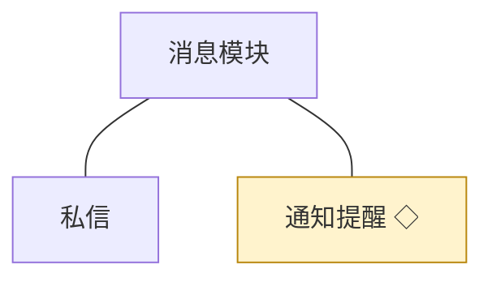
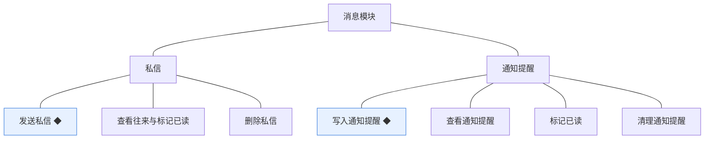
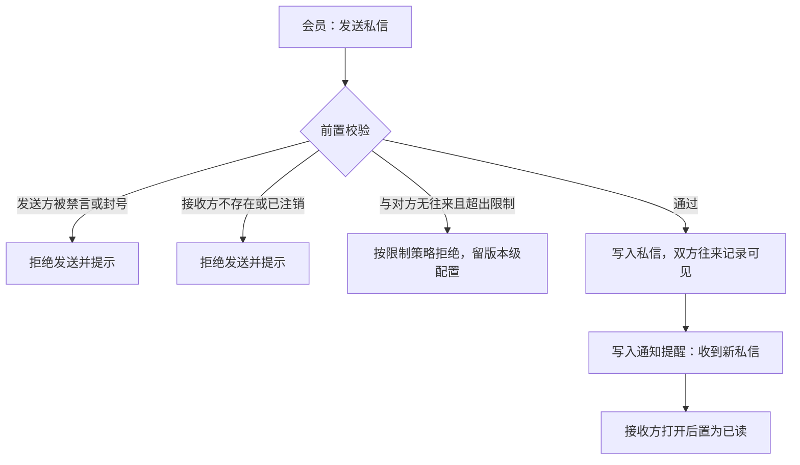
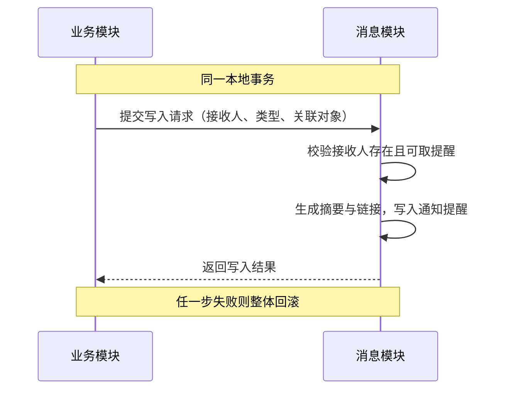

# 模块设计：消息模块

> 定位：对应技术文档《系统构成》中的「消息模块」，是总览第 2.6 节小节的同构放大。规则句末括注来源：D 为 PRD 关键设计决策编号、K 为技术文档关键技术决策、开发规范为 04A 条目、本轮建议为本模块拍板。

## 1. 职责与边界

**管**：站内消息——私信的发送、往来与已读，通知提醒的统一写入、查看、标记已读与清理。

**不管**：消息的事件来源与业务结论由各业务模块产生；会员身份与账号状态归会员与权限模块；消息不承载审核与处置动作本身。

**边界一句话**：本模块只负责"结果送达到位"，不判断"结果该不该产生"。

## 2. 对象

### 2.1 对象结构

### 2.2 对象说明

**私信**

- 定位：会员之间的站内往来消息，替代外部通讯工具承担会员之间的沟通。
- 关键组成：编号、发送人、接收人、正文、已读状态、发送时间。
- 关系与约束：被禁言或封号的账号不能发送（D7、会员与权限模块契约）；往来记录双方各自可见；单条私信只有收件方能否已读的语义（本轮建议）。

**通知提醒**

- 定位：把与会员相关的结果主动送达的消息，覆盖互动、审核结论与悬赏结算。
- 关键组成：编号、接收人、类型、关联内容标识、正文摘要、已读状态、产生时间。
- 关系与约束：由各业务模块在同一事务内触发写入（总览协作约束表·通知送达）；只增不改，除已读状态外不可修改；关联内容删除后提醒保留，点击时按内容可用性降级提示（本轮建议）。

### 2.3 共享对象

| 对象 | 共享方式 | 使用方 | 使用契约 |
|---|---|---|---|
| 通知提醒 | 统一写入接口，写入方不直接操作消息侧表 | 会员与权限、话题、问答与悬赏、互动、审核与治理、成长 | 写入方提供接收人、类型与关联对象；本模块负责生成摘要与展示；写入与业务变更同事务 |

## 3. 功能

### 3.1 功能结构

### 3.2 私信

| 功能 | 使用方 | 说明 |
|---|---|---|
| 发送私信 | 会员 | 向另一位会员发送站内消息 |
| 查看往来 | 会员 | 查看与某位会员的往来记录 |
| 标记已读 | 会员 | 打开后置为已读 |
| 删除私信 | 会员 | 删除自己一侧的消息记录 |

### 3.3 通知提醒

| 功能 | 使用方 | 说明 |
|---|---|---|
| 写入通知提醒 | 各业务模块 | 业务事件发生时写入接收人、类型与关联对象 |
| 查看通知提醒 | 会员、管理端账号 | 在个人中心与前台入口查看提醒列表 |
| 标记已读 | 会员、管理端账号 | 逐条或全部标记已读 |
| 清理通知提醒 | 会员、管理端账号 | 清理已读提醒，未读不可清理 |

### 3.4 复杂功能详述

**◆ 发送私信**（谁、入口、做什么、结果）：会员在个人中心向另一位会员发送私信，校验双方账号状态后写入，接收方在提醒与私信列表中看到。

- (1) 发送方账号状态校验取自会员与权限模块，禁言范围覆盖私信（D7、PRD 备忘·推断）。
- (2) 私信写入与提醒写入在同一事务内完成（总览协作约束表）。
- (3) 接收方为已注销账号时拒绝发送，避免消息进入无人查看的记录（本轮建议）。
- (4) 非好友首次私信是否受限留版本级配置，机制上支持按策略开关（本轮建议）。

**◆ 写入通知提醒**（谁、入口、做什么、结果）：业务模块在事件发生时调用本模块的统一写入接口，生成面向接收人的提醒；写入必须与业务变更同事务，不产生"业务成功但无提醒"或"有提醒但业务失败"的错位。

- (1) 写入与业务变更必须在同一事务内，事务外不补写（总览协作约束表·通知送达）。
- (2) 接收人为已注销账号时静默丢弃，不阻断业务（本轮建议）。
- (3) 提醒类型使用固定枚举，展示文案由本模块统一生成，业务方不传入文案（本轮建议）。
- (4) 提醒只增不改；已读状态是唯一可变字段（开发规范·只增不改的记录型对象口径）。

## 4. 状态

**私信**（无状态）：私信是往来记录，只有存在与已读两种事实，不承载生命周期；已读是收件方的阅读状态。

**通知提醒**（无状态）：提醒产生后只增不改，除已读状态外不变；清理是按接收人视角的移除，不影响业务事实。

## 5. 对外契约

| 操作 | 语义 | 调用方 | 关键约束 |
|---|---|---|---|
| 写入通知提醒 | 业务事件触发的送达 | 会员与权限、话题、问答与悬赏、互动、审核与治理、成长 | 与业务变更同事务；接收人不可用时静默丢弃 |
| 读取提醒列表 | 个人中心与前台入口的提醒列表 | 会员与权限模块 | 只读，按接收人过滤 |
| 读取未读数 | 入口角标展示 | 前台页面 | 只读 |
| 读取私信往来 | 个人中心的私信列表 | 会员与权限模块 | 只读，按往来双方过滤 |
| 校验可发送私信 | 发送前置校验 | 本模块内部调用会员与权限模块 | 禁言与封号一律拒绝 |

## 6. 待议与版本级事项

- **本轮建议**：禁言覆盖私信；接收方注销则拒绝发送；提醒类型固定枚举、文案统一生成；未读提醒不可清理。
- **待业务确认**：非好友私信的发送限制口径（是否限制、限制到什么程度）。
- **留版本级**：私信与提醒的列表分页与排序、未读角标刷新方式、提醒文案与跳转目标。
- **明确不做**：实时长连接推送（K·通知提醒不做实时推送）；群聊与多人群组消息；外部邮件与短信通知。
- **关联评审**：若后续要求实时性，需评审长连接或轮询方案，并同步技术文档的关键技术决策。
